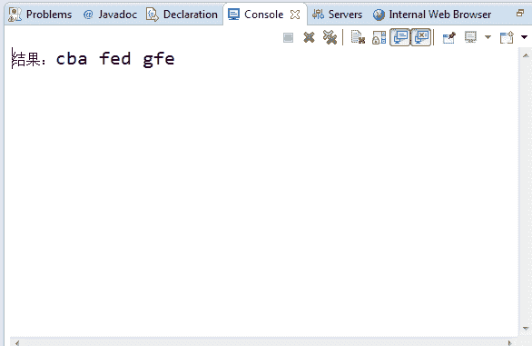

# 唯品会 2018 校招数据结构笔试题（A 卷）

## 1

将流量控制用于 TCP 数据传输的原因是什么？

正确答案: C   你的答案: 空 (错误)

```cpp
同步设备速度以便发送数据
```

```cpp
同步并对序列号排序，从而以完整的数字顺序发送数据
```

```cpp
防止传入数据耗尽接收方资源
```

```cpp
在服务器上同步窗口大小
```

本题知识点

算法工程师 唯品会 2018

讨论

[今年必得 Offer](https://www.nowcoder.com/profile/4711919)

 所谓**流量控制**就是让发送发送速率不要过快，让接收方来得及接收。利用滑动窗口机制就可以实施流量控制。原理这就是运用 TCP 报文段中的窗口大小字段来控制，发送方的发送窗口不可以大于接收方发回的窗口大小。
可以参考这篇博客：[`blog.csdn.net/sicofield/article/details/9708311`](http://blog.csdn.net/sicofield/article/details/9708311)

编辑于 2018-03-07 16:50:25

* * *

## 2

在 CPU 与主存之间设置高速缓冲存储器 Cache，其目的是为了

正确答案: B   你的答案: 空 (错误)

```cpp
扩大主存的存储容量
```

```cpp
提高 CPU 对主存的访问效率
```

```cpp
提高外存储器的速度
```

```cpp
既扩大主存容量又提高存取速度
```

```cpp
既扩大主存容量又提高 CPU 对主存的访问效率
```

本题知识点

算法工程师 唯品会 2018

讨论

[NY523](https://www.nowcoder.com/profile/5427584)

主存容量不会因为***的增加而改变，***始终是在内存上的

发表于 2018-02-05 20:15:47

* * *

[niukewangID](https://www.nowcoder.com/profile/3668539)

***的速度介于 CPU 和主存之间。

发表于 2018-03-09 13:32:29

* * *

## 3

设指针变量 p 指向双向链表中结点 A（A 不是最右边节点），指针变量 s 指向被插入的结点 X，则在结点 A 的右面插入结点 X 的操作序列为：

正确答案: D   你的答案: 空 (错误)

```cpp
p-&gt;right=s； s-&gt;left=p；  p-&gt;right-&gt;left=s；  s-&gt;right=p-&gt;right；
```

```cpp
s-&gt;left=p； s-&gt;right=p-&gt;right； p-&gt;right=s；  p-&gt;right-&gt;left=s；
```

```cpp
p-&gt;right=s；  p-&gt;right-&gt;left=s；  s-&gt;left=p；  s-&gt;right=p-&gt;right；
```

```cpp
s-&gt;left=p； s-&gt;right=p-&gt;right； p-&gt;right-&gt;left=s；  p-&gt;right=s；
```

本题知识点

算法工程师 唯品会 2018 C++ C 语言

讨论

[778 笑哈哈](https://www.nowcoder.com/profile/3718620)

先搞定 s 的前驱和后继，在搞定后继节点的前驱，最后解决前驱节点的后继

发表于 2018-01-13 10:11:36

* * *

[牛客小丑 C](https://www.nowcoder.com/profile/410104169)

A 一开始 p->right=s；已经指向了 s，这里 p->right->left=s；相当于 s->left=s，所以不正确。 B p->right=s；这里 p->right 还是表示原来结点 A 的下一结点，姑且叫 B，应该是 B 的左指针指向 s 的。所以，不正确。 C p->right->left=s；这里结合前半句 p->right=s；，可以理解为 s->left=s，跟 A 一样，很明显错误的。 简单理解，就是处理好结点的前驱后继指针的先后指向。

发表于 2020-12-10 08:25:22

* * *

## 4

设无向图 G 中的边的集合 E={(a，b)，(a，e)，(a，c)，(b，e)，(e，d)，(d，f)，(f，c)}，则从顶点 a 出发进行深度优先遍历可以得到的一种顶点序列为

正确答案: A   你的答案: 空 (错误)

```cpp
aedfcb
```

```cpp
acfebd
```

```cpp
aebcfd
```

```cpp
aedfbc
```

本题知识点

算法工程师 唯品会 2018

讨论

[Onion_on](https://www.nowcoder.com/profile/598775233)

D 选项如果是 aedfcb 就对了，C 选项如果是 aebdfc 就对了。

发表于 2020-10-13 18:20:36

* * *

[NY523](https://www.nowcoder.com/profile/5427584)

可以得到无向图 G 是：a，e，d，f，c 是一个圈，a，e，b 是另一个圈（注意路径之间不能交叉），然后进行深度遍历即可。

发表于 2018-02-05 20:20:03

* * *

[灬天晴丿﹏](https://www.nowcoder.com/profile/3166359)

我也不会吧

发表于 2018-01-22 14:36:26

* * *

## 5

关于数据库索引的说法哪些是正确的

正确答案: A D   你的答案: 空 (错误)

```cpp
经常被查询的字段建议创建索引
```

```cpp
很少被查询的字段建议创建索引
```

```cpp
内容很少变动的字段不建议创建索引
```

```cpp
内容经常变动的字段不建议创建索引
```

```cpp
索引可以提高数据插入效率
```

本题知识点

算法工程师 唯品会 2018

讨论

[。。哼](https://www.nowcoder.com/profile/4004087)

索引可以提高数据查询效率

发表于 2018-02-05 18:20:47

* * *

[OhMyGakki](https://www.nowcoder.com/profile/823592406)

正确答案：A，D 增删数据需要重建索引，消耗大。

发表于 2019-06-12 23:06:31

* * *

## 6

下列措施中，能缩短程序执行时间的是

正确答案: A B C   你的答案: 空 (错误)

```cpp
提高时钟频率
```

```cpp
优化数据通路结构
```

```cpp
程序编译优化
```

本题知识点

算法工程师 唯品会 2018

讨论

[收获 2018](https://www.nowcoder.com/profile/7688388)

CPU 的时钟频率也就是 CPU 主频率。一般说来，一个时钟周期内完成的指令数是固定的，所以主频越高，CPU 的速度也就快，程序的执行时间就越短。
Ⅱ．数据在功能部件之间传送的路径称为数据通路，数据通路的功能是实现 CPU 内部的运算器和寄存器以及寄存器之间的数据交换。优化数据通路结构，可以有效提高计算机系统的吞吐量，从而加快程序的执行。
Ⅲ．计算机程序需要先转化成机器指令序列才能最终得到执行，通过对程序进行编译优化可以得到更优的指令序列，从而使得程序的执行时间也越短。来自百度

发表于 2018-02-02 09:46:19

* * *

[niukewangID](https://www.nowcoder.com/profile/3668539)

1.时钟频率越高，一秒内完成的指令越多。 2.数据通路，是指运算器和寄存器交换数据的线路，当然是越快越好。 3.编译优化，得到的可执行代码效率更高，当然速度快。

发表于 2018-03-09 13:29:51

* * *

## 7

以下是链表的特点的是

正确答案: A C D   你的答案: 空 (错误)

```cpp
不必预先分配较多存储空间
```

```cpp
可随机访问任一元素
```

```cpp
插入删除不需要移动元素
```

```cpp
所需空间与线性表长度成正比
```

本题知识点

算法工程师 唯品会 2018

讨论

[小纸伞](https://www.nowcoder.com/profile/3248172)

链表不可以随机访问任一元素

发表于 2018-02-07 10:38:02

* * *

## 8

在现代计算机上，即使是单核单 CPU 系统，一个程序的死循环 bug，也不会导致别的程序完全得不到时间运行，这跟哪些因素有关

正确答案: A B D   你的答案: 空 (错误)

```cpp
时钟中断
```

```cpp
OS 进程（线程）时间片划分
```

```cpp
虚拟内存机制
```

```cpp
OS 抢占式调度
```

本题知识点

算法工程师 唯品会 2018

讨论

[。。哼](https://www.nowcoder.com/profile/4004087)

分时复用

发表于 2018-02-05 18:22:37

* * *

## 9

有以下代码，则 find(6)的返回值为 1
int find(int n){
if (n <= 0){
return 0;
}else if(n > 0 && n <= 2){
return 1;
}
return find(n-1)+find(n-2);
}

你的答案 (错误)

1 参考答案 (1) 8

本题知识点

算法工程师 唯品会 2018

讨论

[xxxxxxxxxxxxxxxa](https://www.nowcoder.com/profile/4397117)

8
find(6)5          3
find(5)  find(4) 3        2         2           1
find(4) find(3)   find(3) find(2)    2        1             1           1           1      1
find(3) find(2)   find(2) find(1)   find(2) find(1)  1

发表于 2018-07-30 09:19:17

* * *

[_2Binary](https://www.nowcoder.com/profile/8971285)

                                     6
                       5                               4
          4                 3                   3            2
      3      2         2    1           2         1    1
   2  1  1         1
1 因为(n > 0 && n <= 2)return 1；所以是 8

发表于 2018-02-03 00:32:41

* * *

## 10

下面 C 程序运行后的打印结果是 1
#include <stdio.h>
void func(int* a) {
static int j = -1;
do { j +=1; a[j] = a[j] + a[j+1]; } while (j < 2);
}

main( ) {
int k, a[10] = {1, 2, 3, 4, 5};
for (k=1; k<3; k++) func(a);
for (k=0; k<5; k++) printf("%d", a[k]);
printf("\n");
}

你的答案 (错误)

1 参考答案 (1) 35795

本题知识点

算法工程师 唯品会 2018

讨论

[USTCwty](https://www.nowcoder.com/profile/5616564)

java 中 程序跑出来的结果是 35795  不知道有没有相同的老铁

发表于 2018-01-09 16:58:08

* * *

[hahec](https://www.nowcoder.com/profile/3050648)

static 修饰的静态局部变量只执行初始化一次，因此 k=1 时候，{3，5，3，4，5}；k=2 时候，j 仍然=2，由于是 do，所以还要执行一次算法{3，5，7，4，5}，因而答案没错

发表于 2018-03-15 23:25:02

* * *

[一座孤岛](https://www.nowcoder.com/profile/2568310)

```cpp
public class test {
    static int j = -1;
    static void f(int[] a){
        do {
            j += 1;
            a[j] += a[j + 1];
        } while (j < 2);
    }

    public static void main(String[] args) {
        int k;
        int[] a = {1, 2, 3, 4, 5};
        for (k = 1; k<3;k++){
            f(a);
        }
        for (k=0;k<5;k++){
            System.out.print(a[k]);
            System.out.println();
        }
    }
}

```

答案有误，应当是 35795，因为第二次进入 f()函数时，会再 do 一次，不管 j 是否 小于 2

发表于 2018-03-08 16:26:53

* * *

## 11

一棵完全二叉树中有 65 个结点，则该完全二叉树的深度为 1

你的答案 (错误)

1 参考答案 (1) 7

本题知识点

算法工程师 唯品会 2018

讨论

[xxxxxxxxxxxxxxxa](https://www.nowcoder.com/profile/4397117)

2^n-1>65>2^n-1 -1  64=2⁶ 故 n=7 啊

发表于 2018-07-30 09:23:01

* * *

## 12

用二分查找法查找一个长度为 112、已排序的数组，若查找目标不存在数组中，需要比较 1 次

你的答案 (错误)

1 参考答案 (1) 7

本题知识点

算法工程师 唯品会 2018

讨论

[为快乐而设计](https://www.nowcoder.com/profile/2531670)

应该是 8 次吧，它说目标没找到，所以在 7 的基础上加 1 等于 8

发表于 2018-03-17 17:52:27

* * *

[帅霖霖](https://www.nowcoder.com/profile/8103614)

112 56 28 14 7 3 2 二分法比较

发表于 2018-01-27 20:02:42

* * *

[Seeker98](https://www.nowcoder.com/profile/3773050)

二叉搜索树。112 节点的 AVL 树(平衡)，高度为 7。 或者理解：第一次 1 个元素，第二次 1+2 个，第三次 1+2+4 个，…第 6 次 1+2+4+8+16+32 个，第 7 次就可以找完整个表。

发表于 2018-02-02 15:25:13

* * *

## 13

已知一个线性表{24, 19, 33, 56, 72, 68}，假定采用 hash 函数 h(key)=key%7 计算 hash 地址，并存储在 hash 表 A[0…6]中，若采用线性探测方法解决冲突（即若发生冲突，则从冲突位置顺序探测 hash 表中的其他存储单元，直到找到空位置为止），则在该 hash 表上查找元素 68，需要查找多少 1 步

你的答案 (错误)

1 参考答案 (1) 4

本题知识点

算法工程师 唯品会 2018

讨论

[城枫墨凉](https://www.nowcoder.com/profile/1004093)

散列表的填表过程如下：1.首先存入第一个元素 24，由于 h(24)=24%7=3，又因为 3 号单元现在没有数据，所以把 24 存入 3 号单元。2.接着存入第二个元素 19，由于 h(19)=19%7=5，又因为 5 号单元现在没有数据，所以把 19 存入 5 号单元。 3.接着存入第三个元素 33，由于 h(33)=33%7=5，此时的 5 号单元已经被 19 占据，所以进行线性再散列，线性再散列的公式为：Hi=（H(key)+di）% m ，其中的 di=1，2，3，4...。所以 H1=(5+1)%7=6，此时的单元 6 没有存数据，所以把 33 存入到 6 号单元。4\. 接着存入第四个元素 56，由于 h(56)=56%7=0，此时的 0 号单元没有数据，所以把 56 存入 0 号单元。5.接着存入第五个元素 72，由于 h(72)=72%7=2。此时的单元 2 没有存数据，所以把 72 存入到 2 号单元。6\. 最后存入第六个元素 68，由于 h(68)=68%7=5，此时的 5 号单元已被占据，所以进行线性再散列：H1=(5+1)%7=6，但 6 号单元也被占据了，所以再次散列：H2=(5+2)%7=0，但 0 号单元也被占据了，所以进行线性再散列：H1=(5+3)%7=1， 此时的单元 1 没有存数据，所以把 68 存入到 1 号单元。如果一个元素存入时，进行了 N 次散列，相应的查找次数也是 N，所以 24,19,56,72 这四个元素的查找长度为 1，33 的查找长度为 2，68 的查找长度为 4，答案为 4。如果要计算散列表上的平均查找长度，我们首先必须要知道在建立这个散列表时，每个数据存储时进行了几次散列。这样就知道哪一个元素，查找的长度是多少。
所以平均查找长度为：(1+1+1+1+2+4)/6=1.666

发表于 2018-01-10 13:41:29

* * *

## 14

已知二叉树的中序遍历结果为 MFLEDABKCGHJI，后序遍历结果为 FELMDKHGJICBA，则其先序遍历结果为 1

你的答案 (错误)

1 参考答案 (1) ADMLFEBCKIJGH

本题知识点

算法工程师 唯品会 2018

讨论

[城枫墨凉](https://www.nowcoder.com/profile/1004093)

对一棵二叉树进行遍历，我们可以采取 3 中顺序进行遍历，分别是前序遍历、中序遍历和后序遍历。
这三种方式是以访问父节点的顺序来进行命名的。假设父节点是 N，左节点是 L，右节点是 R，那么对应的访问遍历顺序如下：

前序遍历    N－>L－>R   ？我们要推断的
中序遍历    L－>N－>R   MFLEDABKCGHJI
后序遍历    L－>R－>N   FELMDKHGJICBA

其实，只要知道其中任意两种遍历的顺序，我们就可以推断出剩下的一种遍历方式的顺序，这里我们只是以：知道后序遍历和中序遍历，推断先序遍历作为例子，其他组合方式原理是一样的。要完成这个任务，我们首先要利用以下几个特性：
特性 A，对于前序遍历，第一个肯定是根节点；
特性 B，对于后序遍历，最后一个肯定是根节点；
特性 C，利用前序或后序遍历，确定根节点，在中序遍历中，根节点的两边就可以分出左子树和右子树；
特性 D，对左子树和右子树分别做前面 3 点的分析和拆分，相当于做递归，我们就可以重建出完整的二叉树；

1.根据特性 B，对于后序遍历，最后一个肯定是根节点；得出根节点：A
根据特性 C，在中序遍历中，根节点的两边就可以分出左子树和右子树
            A
        /        \
MFLED   BKCGHJI

2\. 取出左子树，在中序的左子树：MFLED    在后序的左子树：FELMD
根据特性：对于后序遍历，最后一个肯定是根节点；
得出左子树的父节点是 D,并且 D 没有右子树
           A
         /    \
       D   BKCGHJI
      /
 MFLE
3.使用同样的方法：
后序是 FELM 中序是 MFLE
所以，M 为父节点，并且 M 没有左节点
                A
              /    \
           D   BKCGHJI
         /
      M
        \
       FLE
接着后序 FEL，中序 FLE
所以 L 为父节点，F 为左节点，E 为右节点

                 A
               /   \
             D BKCGHJI
           /
        M
           \
            L
           /   \
         F     E

4.取出右子树，中序：BKCGHJI  后序：KHGJICB
父节点为 B，
            A
          /    \
        D      B
      /             \
   M           KCGHJI
     \
      L
     /   \
   F     E
中序：KCGHJI  后序：KHGJIC,父节点：C
左节点：K，右节点:GHJI

               A
             /    \
           D      B
         /            \
      M              C
       \             /   \
        L       K    GHJI
       /  \
     F    E
中序：GHJI，后序：HGJI，父节点：I,只有左节点 GHJ

                      A
                    /    \
                 D       B
                /           \
             M            C
                \          /   \
                 L      K    I
                /   \         /
               F   E    GHJ
中序：GHJ，后序:HGJ,父节点：J,只有左节点：GH
                         A
                       /    \
                    D      B
                  /            \
                M            C
                  \          /    \
                   L       K      I
                 /   \            /
               F     E      J
                            /
                          GH
中序：GH,后序：HG,父节点：G,只有右节点 H
                                 A
                               /    \
                             D      B
                           /           \
                         M             C
                            \           /   \
                             L       K      I
                           /   \            /
                        F      E      J
                                      /
                                    G
                                      \
                                       H
进行先序排列：根左右 :A，DMLFE,BCKIJGH
结果为：ADMLFEBCKIJGH

编辑于 2018-01-09 13:45:21

* * *

[Seeker98](https://www.nowcoder.com/profile/3773050)

后序遍历最后一个节点推出树根，用中序推出左右子树元素分别都是什么。 分治思想 很快得到整个二叉树。

发表于 2018-02-02 15:26:27

* * *

## 15

一组记录的关键值为(46，79，56，38，40，84)，则利用快速排序的方法，以第一个记录的关键值 46 为基准得到的一次划分结果为 1.

你的答案 (错误)

1 参考答案 (1) 40,38,46,56,79,84

本题知识点

算法工程师 唯品会 2018

讨论

[城枫墨凉](https://www.nowcoder.com/profile/1004093)

快速排序：

[46，79，56，38，40，84 ] ,base:46
  |                                      |
left                              right

1.第一步：从 right 位置往左找到第一个比 46 小的数，
  如果找到，将此数赋给 left 位置
  left 和 right 指针分别为前后的 40。

   [40，79，56，38，40，84]
      |                             |
    left                        right

2.第二步：从数组的 left 位置向后找，找到第一个比 46 大的数，
  如果找到，将此数赋给 right 的位置

   [40, 79, 56, 38, 79, 84]
            |                |
         left             right

3.重复第一步：从 right 位置往左找到第一个比 46 小的数，
  如果找到，将此数赋给 left 位置

   [40, 38, 56, 38, 79, 84]
           |            |
         left       right

4.重复第二步：从 left 位置往右找到第一个比 46 大的数，
  如果找到，将此数赋给 right 位置

   [40, 38, 56, 56, 79, 84]
                 |      |
              left   right

5.重复第一步：从 right 位置往左找到第一个比 46 小的数，
  没有找到，left 和 right 位置重合
   [40, 38, 56, 56, 79, 84]
                 |    
          left&&right

 将 base 值插入，完成一次排序
   [40, 38, 46, 56, 79, 84]

发表于 2018-01-09 13:24:16

* * *

[神拳小江南 _ 南七](https://www.nowcoder.com/profile/2872795)

这里说的以 46 为基准是指以 46 为轴，小于 46 的排在 46 左边，大于 46 的排在右边。46 79 56 38 40 84 第一次：从最右边往左边扫描，找到第一个比 46 小的数，将其交换得到 40 79 56 38 46 84 第二次：从最左边往右扫描，找到第一个比 46 大的数，将其交换得到 40 46 56 38 79 84 第三次：从最右边往左边扫描，找到第一个比 46 小的数，将其交换得到 40 38 56 46 79 84 第四次：从最左边往右扫描，找到第一个比 46 大的数，将其交换得到 40 38 46 56 79 84 到这里发现比 46 小的数都在 46 左边，比 46 大的都在右边也就是一次划分。

发表于 2018-04-07 15:25:20

* * *

[Seeker98](https://www.nowcoder.com/profile/3773050)

快速排序第一步是从后往前，元素移动方向与对应指针移动方向相同，即，假设 i 从 1 向后，j 从 n-1 向前，i 指针找到元素后，将该元素后移至 j 位置，j 同理前移。

发表于 2018-02-02 15:28:11

* * *

## 16

为了解决进程间的同步和互斥问题，通常采用一种称为信号量机制的方法。若系统中有 6 个进程共享若干个资源 R，每个进程都需要 5 个资源 R，那么使系统不发生死锁的资源 R 的最少数目是 1

你的答案 (错误)

1 参考答案 (1) 25

本题知识点

算法工程师 唯品会 2018

讨论

[城枫墨凉](https://www.nowcoder.com/profile/1004093)

先假设给 6 个进程均分配 4 个资源，即 4*6=24.此时只要在加一个资源可以使 6 个进程中的任何一个进程得到满足。即 24+1=25.

发表于 2018-01-09 14:17:54

* * *

## 17

已知一算数表达式的中缀表达式为 a*f+(b-c/d)*e，其后缀形式 1

你的答案 (错误)

1 参考答案 (1) af*bcd/-e*+

本题知识点

算法工程师 唯品会 2018

讨论

[城枫墨凉](https://www.nowcoder.com/profile/1004093)

这里所谓的前缀，中缀，后缀是根据操作符的位置来定的，如果操作符在操作数前面，则称为前缀表达式，例如“- + 1 × + 2 3 4 5”;如果操作符在操作数之间，则称为中缀表达式，例如

“1+((2+3)×4)-5”;如果操作符在操作数后面，则称为后缀表达式，例如“1 2 3 + 4 × + 5 -”。

虽然中缀表达式符合人类的日常思维习惯，但是计算机在存储中缀表达式时，需要使用树这种数据结构，如果表达式过于复杂，那么树的高度会变得很高，大大增加了时间复杂度和空间复杂度。如果转换成线性结构，那么效率将变得高很多，所以需要将中缀表达式先转换成前缀或者后缀表达式，然后依靠栈这种线性数据结构来进行计算。

前缀表达式又叫波兰表达式，后缀表达式又叫逆波兰表达式。前缀表达式基本没有在商业计算机中使用过，所以现实中用的更多的是后缀表达式。

如何将中缀表达式转化成后缀表达式呢？

利用两个栈 S1，S2：其中 S1 存放操作符，S2 存放操作数

从左往右遍历中缀表达式，如果遇到数字，则放入 S2 中，如果遇到操作符，则放入 S1 中。在放操作符的时候有一定的规则，如果栈为空或栈顶元素为（，则直接压栈。如果是(，也直接压栈;如果栈顶元素为普通操作符，则比较优先级，如果待压栈的操作符比栈顶操作符优先级高，则直接压栈，否则将 S1 中的栈顶元素出栈，并压入 S2 中，再接着比较 S1 栈顶元素的优先级。如果遇到)，则依次弹出 S1 栈顶的运算符，并压入 S2，直到遇到左括号为止，此时将这一对括号丢弃。最后将 S1 中剩余的运算符依次弹出并压入 S2，逆序输出 S2（从栈底到栈顶）便得到了后缀表达式。（注意：等号的优先级最低，因为要到最后才进行赋值操作）

得到后缀表达式之后，计算就变得方便多了，遇到数字就压栈，遇到操作符的时候，pop 出栈顶的两个元素，进行计算后将结果又压入栈中，这样一直下去，直到得到最终结果。

将中缀表达式“a*f+(b-c/d)*e”转换为后缀表达式的过程如下：

|  

&#124; 扫描到的元素 &#124;

 | S2(栈底->栈顶)数字 | S1 (栈底->栈顶)操作符 | 说明 |
| a | a | 空 | 数字，直接入栈 |
| * | a | * | S1 为空，运算符直接入栈 |
| f | af | * | 数字，直接入栈 |
| + | af* | + | +比*优先级低将 S1 中的栈顶元素出栈，并压入 S2 中 |
| ( | af* | +( | ( ,直接入栈 |
| b | af*b | +( | 数字，直接入栈 |
| - | af*b | +(- | S1 栈顶为左括号，运算符直接入栈 |
| c | af*bc | +(- | 数字，直接入栈 |
| / | af*bc | +(-/ | /比-优先级高，则直接压栈 |
| d | af*bcd | +(-/ | 数字，直接入栈 |
| ) | af*bcd/- | + | 右括号，弹出运算符到 s2 直至遇到左括号 |
| * | af*bcd/- | +* | *比+优先级高，则直接压栈 |
| e | af*bcd/-e | +* | 数字，直接入栈 |
| 到达最右端 | af*bcd/-e*+ |  空 | 弹出 S1 中剩余的运算符 |

得出结果：af*bcd/-e*+，OK

编辑于 2018-01-09 14:53:28

* * *

[夏花爱秋叶](https://www.nowcoder.com/profile/4085682)

* `中缀表达式转为后缀表达式(从左到右扫描)`
* `分为两个栈，结果栈和运算栈，遇到的情况有`
```cpp
1\. 如果是操作数(数字、字母)，则进入结果栈
2\. 如果是左括号，那么入运算栈；
3\. 如果是右括号，那么把运算栈的栈顶元素出栈，入栈到结果栈，知道遇到左括号，遇到左括号后，这一对括号都消灭
4.1 如果是运算符，如果运算栈为空，那么入栈
4.2 如果是运算符，此时运算栈顶运算符不为左括号！！！，且栈里不存在优先级大于或等于该运算符的运算符，则该运算符入栈，
否则大于等于该运算符的其他运算符先出栈再入栈到结果栈
4.3 如果是运算符，此时栈顶运算符是左括号，那么入栈
```
* 首先 a 是操作数，进结果栈；`结果栈为 a`* * 是运算符，运算栈空，进运算栈
* f 是操作数，进结果栈  `结果栈为 a f`
* +是运算符，但是栈中存在优先级大于等于的*，所以 * 先出栈，然后 * 入运算栈 `结果栈为 a f *`
* (是左括号，入运算栈，`运算栈为 + (`
* b 是操作数，入结果栈，`结果栈 a f * b`
* -是运算符，栈顶元素是左括号，所以-入运算栈 `运算栈 + ( -`
* c 是操作数，入结果栈， `结果栈 a f * b c`
* /是运算符，运算栈顶元素不是左括号，`运算栈 + ( -`不存在优先级大于等于 / 的元素，所以 / 入运算栈
* d 是操作数，d 入结果栈，`结果栈 a f * b c d`
* )是右括号，所以运算栈的栈顶元素出栈，知道左括号，入栈后进到结果栈
* 此时运算栈是 `+ ( - /` ，所以结果栈变为 `a f * b c d / -`,运算栈变为 `+`,左右括号消灭了
* 然后*是运算符，运算栈中不存在大于等于的元素，所以入运算栈,运算栈为`+ *`
* e 是操作数，e 入结果栈，结果栈为`a f * b c d / - e`,
* 扫描结束，所以运算栈全部出栈到结果栈，为 `a f * b c d / - * +`

发表于 2020-03-02 13:36:20

* * *

## 18

袋子中分别一叠纸币，其中 5 元面值的纸币 6 张，10 元面值的纸币 5 张，20 元面值的纸币 4 张，从袋子中任意取 4 张纸币，则每种面值至少取到一张的概率为 1%。（保留两位小数）

你的答案 (错误)

1 参考答案 (1) 52.75

本题知识点

算法工程师 唯品会 2018

讨论

[huanbing](https://www.nowcoder.com/profile/2878171)

总共 15 张纸币  总数是 1365 种取出方法 5 元取出一张 10 元取出一张 20 元取出 2 张 5 元取出一张 10 元取出 2 张 20 元取出 1 张 5 元取出 2 张 10 元取出一张 20 元取出 1 张加起来是 720 所以答案是 720/1365=0.52747

发表于 2018-01-14 20:59:44

* * *

[xxxxxxxxxxxxxxxa](https://www.nowcoder.com/profile/4397117)

组合问题总共可能的情况数，C{4,15}  
4 张的组成：C{2，6}*C{1,5}*C{1,4}C{1,6}*C{2,5}*C{1,4}C{1,6}*C{1,5}*C{2,4}最后的结果为 300+240+180/1365 当然下面的答案更好，分两步，先各取 1，然后剩下再取 1，提出重复除以 2

发表于 2018-07-30 09:04:42

* * *

[yekongle123](https://www.nowcoder.com/profile/2251535)

C(6,1)*C(5,1)*C(4,1)*C(12,1)/C(15,4)=96/91/2 = 0.527472525  ， 为什么除以 2？ 因为有重复，题目中纸币是不相互区分的，这里为了解释给 5 元纸币编号 1,2,3,4,5,6\. 假设第一次从 6 个 5 元纸币中取到了 1 号，取完 10 元，20 元后，从剩下的 12 张中取到了 2 号 5 元纸币，则第二次有可能从 6 个 5 元纸币中取到了 2 号，取完 10 元，20 元后，从剩下的 12 张中取到了 1 号 5 元纸币，这样两次都有 1,2 号纸币，所以要除以 2.

发表于 2018-01-31 23:29:02

* * *

## 19

8 瓶水中 1 瓶有毒，用动物测试。毒发症状在喝水 2 小时后开始出现，而你也只有 2 个小时的时间，则最少需要用 1 只动物测试

你的答案 (错误)

1 参考答案 (1) 3

本题知识点

算法工程师 唯品会 2018

讨论

[cherryljr](https://www.nowcoder.com/profile/6559349)

题目中明确说明：毒发症状在两个小时之后才会出现，而我们只有两个小时的时间。因此我们必须一次实验直接出结果。可以直接排除二分法（实验员没有那么多时间来等结果）
正确解法如下：
根据 2³=8，所以 3 只老鼠可以确定 8 个瓶子具体哪个瓶子有毒。原理如下：
000=0
001=1
010=2
011=3
100=4
101=5
110=6
111=7
一位表示一只老鼠的编号，0-7 表示 8 个瓶子。

也就是分别将 1、3、5、7 号瓶子的药混起来给老鼠 1 吃；

2、3、6、7 号瓶子的药混起来给老鼠 2 吃；

4、5、6、7 号瓶子的药混起来给老鼠 3 吃；

哪只老鼠死了，相应的位标为 1。

举个例子：

如老鼠 1 死了、老鼠 2 没死、老鼠 3 死了，那么就是 101=5 号瓶子有毒。

编辑于 2018-01-09 16:19:08

* * *

[C＆L.小白](https://www.nowcoder.com/profile/7390225)

这是个使用二分法搜索的问题！8/2=4：确定查找的数在 8 个数中的前四个或者后四个范围内 4/2=2：确定查找的数在 4 个数中前两个或者后两个范围内 2/2=1：找到要查找的数总共搜索 3 次。

编辑于 2018-01-06 13:25:13

* * *

[城枫墨凉](https://www.nowcoder.com/profile/1004093)

思路：
可以把八瓶水分成两堆，让一只老鼠在其中一堆里喝水，如果死了，毒药就在这堆里，反之就在另一堆里，然后把有毒的那一堆在分成两堆，让第二只老鼠在其中一堆里喝若死则毒药在喝的这堆里，在分一堆，在让第三只老鼠喝就能知道毒药在几号里了。

发表于 2018-01-10 10:46:38

* * *

## 20

【O】ping 命令使用的协议是 1

你的答案 (错误)

1 参考答案 (1) ICMP

本题知识点

算法工程师 唯品会 2018

讨论

[城枫墨凉](https://www.nowcoder.com/profile/1004093)

Ping 是 Windows、Unix 和 Linux 系统下的一个命令。ping 也属于一个通信协议，是 TCP/IP 协议族的一个子协议。利用"ping"命令可以检查网络是否连通，可以很好地帮助我们分析和判定[网络故障](https://baike.so.com/doc/5709765-5922486.html)。应用格式:**Ping 空格**[IP 地址](https://baike.so.com/doc/4252723-4455111.html)。该命令还可以加许多参数使用，具体是键入 Ping 按回车即可看到详细说明。使用的是 ICMP 协议，是“Internet Control Message Protocol”（Internet 控制消息协议）的缩写用于在 IP[主机](http://www.so.com/s?q=%E4%B8%BB%E6%9C%BA&ie=utf-8&src=internal_wenda_recommend_textn)、[路由器](http://www.so.com/s?q=%E8%B7%AF%E7%94%B1%E5%99%A8&ie=utf-8&src=internal_wenda_recommend_textn)之间传递控制消息。

发表于 2018-01-10 10:51:18

* * *

[niukewangID](https://www.nowcoder.com/profile/3668539)

英特网控制消息协议

发表于 2018-03-09 13:33:31

* * *

## 21

给定字符串 s, 要求把 s 中多于一个的连续空压缩成一个空格，并将连续的非空格字符串倒序打印出来，例如，给定"abc def efg"，打印"cba fed gfe"

你的答案

本题知识点

算法工程师 唯品会 2018

讨论

[刘东荣](https://www.nowcoder.com/profile/8648630)

```cpp
s = "abc def efg" def f(s):
    arr = s.split(' ')
    arr = filter(lambda x:len(x)>0,arr)
    arr = map(lambda x:x[::-1],arr)
    return ' '.join(arr)

```

发表于 2018-01-25 16:17:24

* * *

[凝视深空](https://www.nowcoder.com/profile/4232948)

```cpp
#include<iostream>
#include<string>
#include<algorithm>
using namespace std;

int main()
{     string s;     getline(cin, s);     for(int i = 0, j , k; i < s.size(); ++i) {
        if(s[i] == ' ') {
            cout << ' ';
            for(j = i; j < s.size() && s[j] == ' '; ++j);
            i = j - 1;
        }
        else {
            string tmp;
            for(k = i; k < s.size() && s[k] != ' '; ++k) {
                tmp += s[k];
            }
            i = k - 1;
            reverse(tmp.begin(), tmp.end());
            cout << tmp;
            tmp.clear();
        }     }     return 0;
}

```

发表于 2018-02-19 22:24:19

* * *

[城枫墨凉](https://www.nowcoder.com/profile/1004093)

package binarySearch;

public class SplitSpace {

    public static void main(String[] args) {
        String array = "abc def efg";
        String result = getResult(array);
        System.out.println("结果："+result.toString());
    }

    private static String getResult(String array)
    {   
        String s ="";//初始化空字符串 s
        String [] split = array.split(" ");//以空格分割字符串，一共三部分
        for(String str : split)//依次遍历分割后的部分
        {
            int strLen = str.length();//strLen:每部分的长度
            for(int i=1;i<=strLen;i++)
            {
                s+= str.charAt(strLen-i);//逆序查找每部分的元素，并加入字符串 s
            }
            s += " ";    //每个部分逆序之后，加上一个空格    
        }
        return s;
    }
}


编辑于 2018-01-10 12:15:49

* * *

## 22

围棋棋盘上有一片连续的白子，没有黑子。请写一个函数，计算返回该片白子的气数。函数输入参数为任一个白子的位置。

注：围棋规则：格子棋盘，棋子下在十字交叉点上，纵横线 19*19。一片棋子，**与其中任一子相邻的空交叉点称为这片子的 1 口气，所有这样的交叉点数量是这片子的气数**。比如中央的单独一个棋子，上下左右 4 口气，气数为 4；棋盘左上角的单独棋子，右边加下边两口气，气数是 2；中央的两个相连的白子，气数为 6。等等。

你的答案

本题知识点

算法工程师 唯品会 2018

讨论

[xxxxxxxxxxxxxxxa](https://www.nowcoder.com/profile/4397117)

给出了气数的定义，又给出了连续的前提条件。函数输入任意一白子的位置，返回该片白子的气数。**图论问题，且该图为连通图，可以使用 DFS 或者 BFS，为了回顾知识，这里会采用两种方式去处理。**

```cpp
void change_axis(int &x,int & y,int i){
    switch(i){
        case 0:
        if(x>0)
         x-=1;
        break;
       case 1:
        if(y<18)
         y+=1;
        break;
       case 2:
        if(x<18)
         x+=1;
        break;
            case 3:
        if(y>0)
         y-=1;
        break;
    }
}
//DFS 版本
void dfs(vector<vector<int>> & board,int x,int y,int & count){
    board[x][y]=-1;
    for(int i=0,tmp_x=x,tmp_y=y;i<4,++i){
        change_axis(x,y,i);
       if(board[x][y] == 1)
           dfs(board,x,y,count);
       else if(board[x][y] == 0){
             board[x][y]=-1;
          count++;
        }
       x=tmp_x,y=tmp_y;        
    }     
}
//BFS 版本
int bfs(vector<vector<int>> & board,queue<vector<int>>& que,int x,int y){
    que.push({x,y});
    for(;!que.empty();){
        vector<int> tmp=que.pop(),save=tmp;
        for(int i=0;i<4;++i){
    change_axis(tmp[0],tmp[1],i);
    if(tmp == save)
          continue;
    if(board[tmp[0]][tmp[1]]==1){
          que.push(tmp);
          board[tmp[0]][tmp[1]]=-1;
    }
    else if(board[tmp[0]][tmp[1]]==0){
          board[tmp[0]][tmp[1]]=-1;
          count++;
    }    
        }  
    }
    return count;         
}  
```

发表于 2018-07-30 10:36:46

* * *

[赠君破阵歌](https://www.nowcoder.com/profile/321688)

#include <string.h>#include<stdio.h>

int vis[20][20];
int map[20][20];
int de[10][10] = {(-1,0),(1,0),(0,-1),(0,1)};
int cnt = 0;

int fun(int r,int v){
    int i,j;
    cnt+=4;
    for(int i=0;i<=3;i++){    
        int x = r + de[i][0];
        int y = v + de[i][1];
        if(x<0 || x>=19) cnt--;//边缘 
        if(y<0 || y>=19) cnt--;
        if(vis[x][y]) cnt--;//访问过 

        if(!vis[x][y] && map[x][y]==1){//边缘是白 
            vis[r][v] = 1;
            cnt += fun(x,y); 
        }
    }
    return cnt;
}

int main(){
    int i,j;
    char map[20][20];
    for(i=0;i<19;i++){
        scanf("%s",map[i]);
    }
    int r,v;
    while(scanf("%d %d",r,v)!=EOF){
        memset(vis,0,sizeof(vis));
        printf("%d\n",fun(r,v));
    }

    return 0;
}

发表于 2018-03-04 15:24:47

* * *

[deeplxx](https://www.nowcoder.com/profile/2407687)

int solution(vector<int>& nums, int m, int n) {    return count(nums, m, n);
}
int count(vector<vector<int>>& nums, int i, int j) {
    if (i >= 0 && j >= 0 && i < (int)nums.size() && j < (int)nums.size()) {
        if (nums[i][j] == 0) {            nums[i][j] = 2;   // 修改遍历过的值避免重复
            return 1;        }
        else if (nums[i][j] == 2) return 0;
        else {
            nums[i][j] = 2; // 修改遍历过的值避免重复
            return count(i-1, j) + count(i+1, j) + count(i, j-1) + count(i, j+1); // DFS
        }
    }
    return 0;
}

编辑于 2018-01-17 21:00:00

* * *

## 23

  请设计一个整数容器，支持两个操作：add(x)和 popMedia()两个操作。add(x)是向容器中加入一个整数；popMedia()是返回容器中当前所有数的中位数，如果中位数是容器中的数字，则返回的同时还从容器中把它删除。无需写出完全代码，描述清楚设计实现即可。另外，你能使两个操作都小于 O(N)的时间吗？

注：中位数定义为：如果容器中整数的数量为奇数个，则是最中间的那个数字，如果为偶数个，则是最中间两个数的平均值。

你的答案

本题知识点

算法工程师 唯品会 2018

讨论

[就祝大家国庆快乐吧](https://www.nowcoder.com/profile/1807490)

令 L 的中位数为 m，用一个大顶堆存储数列 L 中不大于 m 的元素（即 L 按从小到大排列时的前半部分），用一个小顶堆存储数列 L 中不小于 m 的元素（即 L 按从小到大排列时的后半部分），其中这两个大小顶堆均不包含中位数 m。每次往数列 L 插入新元素 x 时，若 x<m，则将其插入大顶堆，否则插入小顶堆。若插入新元素后导致 m 不再是中位数（即两个堆的元素数目相差 2 个或 2 个以上），则将当前的中位数 m 插入到元素数量较少的那个堆中，然后令元素数量较多的那个堆的堆顶元素为新的中位数，并从该堆顶元素从堆中删除。

发表于 2018-03-23 15:33:57

* * *

[谁占用了我的名字](https://www.nowcoder.com/profile/7831941)

import java.util.Scanner;
import java.util.Comparator;
import java.util.PriorityQueue;
public class google3 {
    public static void main(String[] args)
    {
       Scanner sc=new Scanner(System.in);
       while(sc.hasNext())
       {
           String s=sc.nextLine();
           String st[]=s.split(" ");
           int []nums=new int[st.length];
           for(int i=0;i<st.length;i++)
               nums[i]=Integer.parseInt(st[i]);

           Solution sl=new Solution();
           for(int i:nums)
               sl.add(i);
           System.out.println(sl.popMedia());
       }
    }
}
class Solution
{
    private int count=0;
    //生成一个小顶堆
    private PriorityQueue<Integer> minStack=new PriorityQueue<Integer>();
    //生成一个大顶堆
    private PriorityQueue<Integer> maxStack=new PriorityQueue<Integer>(10,new Comparator<Integer>()
            {
                public int compare(Integer i,Integer j)
                {
                    return j-i;
                }
            });

    public void add(int num)
    {
        //如果是偶数个，进入小顶堆
       if(count%2==0)
       {
           maxStack.add(num);
           minStack.add(maxStack.poll());
       }
       else
       {
           minStack.add(num);
           maxStack.add(minStack.poll());
       }
       count++;
    }
    public double popMedia()
    {
        if(count%2==0) return (double)(minStack.poll()+maxStack.poll())/2;
        else return minStack.poll();
    }
}

发表于 2018-01-06 21:56:19

* * *

## 24

【测试方向优先】你用浏览器打开一个网站，却没有按预期看到应有的网页内容。请分析各种可能的原因，如果这些原因表现出来的现象不同，也请描述

你的答案

本题知识点

算法工程师 唯品会 2018

讨论

[星陳大海](https://www.nowcoder.com/profile/92683274)

1.DNS 坏掉了，修改自己的 IP 地址为 8.8.8.8 试试
2.网络断了
3.服务器拒绝访问
4.请求或者响应在网络传输中途被劫走了

发表于 2020-09-12 17:14:02

* * *

## 25

【测试方向优先】一个智能玩具，有 N 个不同模块，每个模块已独立测试过。每个模块有输入输出两个接口，可分别对接任意另外两个模块，（接一个的输出和另一个的输入），这样整个 N 个模块便可线性组装出多种不同模型（头尾不连成环形）。对任一种模型结果，有现成的通用测试过程。现在为了全覆盖测试，请你写函数生成出所有的模型作为测试用例。（每个模型都必须是用上全部 N 个模块来组装）

你的答案

本题知识点

算法工程师 唯品会 2018

## 26

【运维方向优先】**a.** 请描述 TCP 协议 3 次握手建立连接的过程。**b.** 为什么协议设计是 3 次握手连接建立而不是 2 次或 4 次，如果 2 次有什么问题，如果 4 次有什么问题？

你的答案

本题知识点

算法工程师 唯品会 2018

讨论

[_2hhhh2_](https://www.nowcoder.com/profile/7209830)

a.第一步，客户机 TCP 先向服务器 TCP 发送一个连接请求报文段。这个特殊报文段不含应用层数据，其首部的 SYN 标志设为 1。客户机随机选择一个起始序号 seq=x。第二步，服务器的 TCP 收到请求，如同意链接则向客户机发回确认，并为该 TCP 连接分配 TCP 缓存和变量。在确认报文中，SYN 和 ACK 都被置 1，确认号字段值为 x+1，并且服务器产生起始序号 y，该报文同样不包含应用层数据。第三步，客户机收到确认报文后还要向服务器给出确认，并且也要给该连接分配缓存和变量。该报文段 ACK 置 1，序号为 x+1，确认号为 ack=y+1，可携带数据。b.如客户机向服务器发出请求，若该请求报文在某个网络节点长时间滞留，客户机超时后认为报文丢失，又发送一个请求报文，服务器收到后建立连接，数据传输完毕后双方断开连接，此时客户机发送的第一个请求报文到达了服务器，若是两次握手，则服务器又建立起连接等待客户机传输数据，而客户机此时并无连接请求不给予理睬，这样就造成了服务器的资源白白浪费。

发表于 2018-01-10 19:42:26

* * *

## 27

【运维方向优先】你用浏览器打开一个电商网站，准备浏览购物。从你输入完网站的网址敲下 Enter 键，到网站首页迅速呈现出来的这段时间，你的电脑系统里发生了哪些事情？请根据你所学的计算机知识，尽可能详细的解释。（提示：从软硬件的尽量多的层次考虑和描述。）

你的答案

本题知识点

算法工程师 唯品会 2018

讨论

[收获 2018](https://www.nowcoder.com/profile/7688388)

> 1.  硬件方面
> 2.  软件方面
> 3.  网络方面

1.  外设与 CPU 进行通信

    > 键盘通过外设接口电路与 CPU 进行通信, 外设接口电路向 CPU 发起中断请求, 因为该中断请求是可屏蔽中断，所以如果 CPU 在处理其它的任务优先级比较高时，会屏蔽该中断。

2.  浏览器解析访问 URI 的 IP 地址

    > 先查询本地 hosts 文件, 如果找到了对应的 IP, 发起 http 请求.
    > 
    > 如果没有查询到, 用 UDP 协议访问本机设置的 DNS 服务器, 如果该 DNS 服务器缓存了这条记录, 直接返回. 如果网络比较堵塞, 可能有包丢失的情况，但是因为使用的 UDP 协议，所以不会重传。可能要重新发起一遍查询。 如果该 DNS 服务器没有这条记录，那么向它的父级 DNS 服务器进行转发，一直递归这种操作，直到访问根 DNS 服务器，然后一级级返回，并缓存下这条 DNS 记录，避免再次向父 DNS 服务器查询。

3.  查询到 IP 之后，发起 HTTP 请求

    > 因为 http 协议是应用层的协议, 它还是要依赖 tcp 协议进行传输, 而 tcp 协议是依赖于 ip 协议的, ip 协议是运行在链路层上的. 所以会封装成链路层上传输的包。

4.  在本机和网关进行通信时是局域网的通信

    > 局域网通信协议一般是以太网的协议, 所以要先进行载波监听. 争抢带宽的使用权. 如果监听发现已经有通信在进行，则根据策略选择重新监听的时机。 直到线路不再繁忙时再和网关进行通信.

5.  网关或路由器转发包

    > 因为路由器是三层设备, 所以是用 IP 进行通信的。先要进行路由选择, 根据路由选择算法进行路由选择， 转发到不同的端口。

6.  最后一层路由器转发包给服务器

    > 服务器防火墙检查包， 如果包通过防火墙进站策略， 则根据包中的端口转发给监听该端口的服务器软件。 否则该包会被丢弃。

7.  负载均衡

    > 如果存在负载均衡服务器，通过负载均衡服务器转发给内网应用服务器， 这取决于网站架构

8.  服务器处理 http 请求

    > 如果请求的是静态资源， 如 html 文件或 CSS、JS 或者图片文件。则直接返回。 如果是 php 等动态文件， 则交给 PHP 模块或 PHP CGI 进行处理，处理后再交给服务器软件返回给客户端

9.  客户端

    > 浏览器对返回的数据进行处理, 如果 content-type 是 html, 那么对 html 文件进行渲染. 如果 content-type 是 json 数据, 那么调用回调函数进行处理

10.  来自百度

发表于 2018-02-02 11:13:07

* * *

[秋招补招春招求战友](https://www.nowcoder.com/profile/947073)

输入网址后，应用层的 DNS 解析网址为 ip 地址，传输层通过 TCP 协议发送请求，链路层通过 ARP 协议将 ip 地址解析为 mac 地址。

发表于 2018-01-30 10:25:05

* * *</string.h>