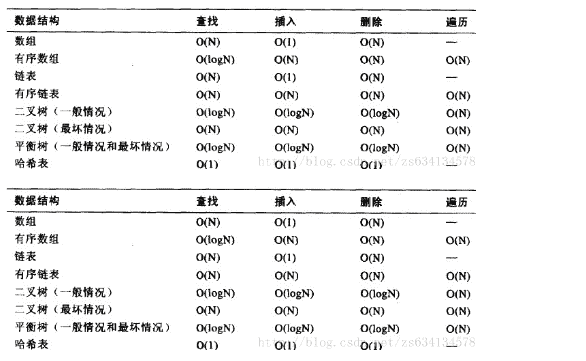
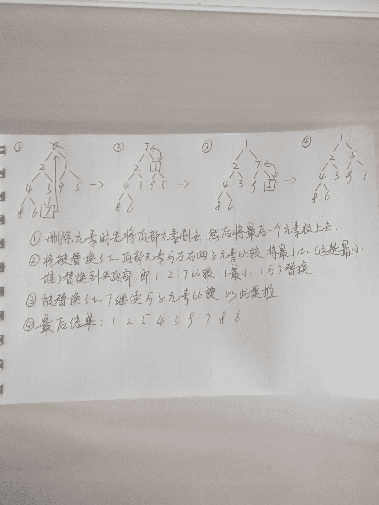
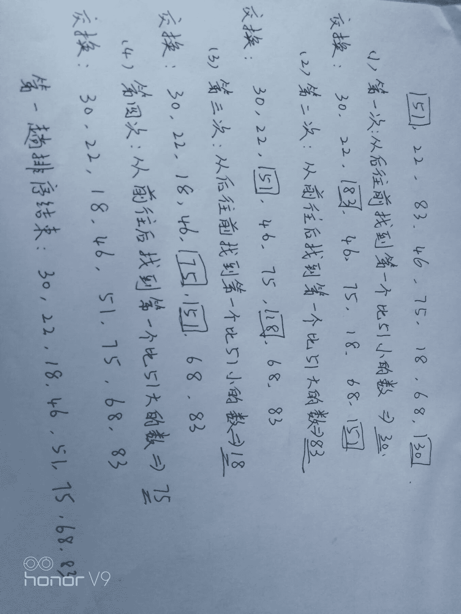
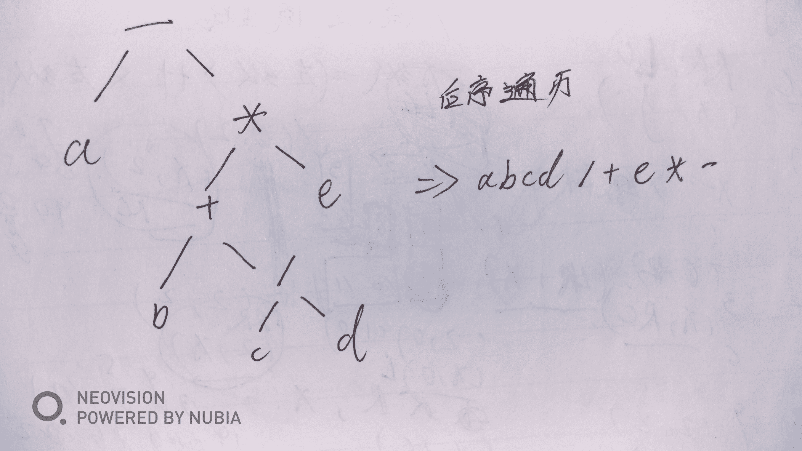

# 唯品会 2018 校招前端、java、运维、测试、数据库笔试题（B 卷）

## 1

主机甲与主机乙之间已建立一个 TCP 连接，主机甲向主机乙发送了两个连续的 TCP 段，分别包含 300B 和 500B 的有效载荷，第一个段的序列号为 200，主机乙正确接收到这两个数据段后，发送给主机甲的确认序列号是

正确答案: D   你的答案: 空 (错误)

```cpp
200
```

```cpp
500
```

```cpp
800
```

```cpp
1000
```

本题知识点

Java 工程师 前端工程师 运维工程师 数据库工程师 测试工程师 唯品会 2018

讨论

[hhffgukih](https://www.nowcoder.com/profile/7103040)

确认序列号=原始序列号+TCP 段的长度第一次的确认序列号为 200+300=500，第二次确认序列号为 500+500=1000

发表于 2018-01-04 15:23:10

* * *

[史新发 1](https://www.nowcoder.com/profile/3951917)

确认序列号是  原始序列号+TCP 段的长度第一次的确认序列号为 200+300 为 500，第二次确认序列号为 500+500=1000

发表于 2018-02-10 18:53:52

* * *

[Gamkiu](https://www.nowcoder.com/profile/4634690)

确认序列号 = 原始序列号 + TCP 报文段长度

发表于 2020-04-19 17:18:00

* * *

## 2

在支持多线程的系统中，进程 P 创建的若干个线程不能共享的是

正确答案: D   你的答案: 空 (错误)

```cpp
进程 P 的代码段
```

```cpp
进程 P 中打开的文件
```

```cpp
进程 P 的全局变量
```

```cpp
进程 P 中某线程的栈指针
```

本题知识点

Java 工程师 前端工程师 运维工程师 数据库工程师 测试工程师 唯品会 2018

讨论

[刷题的 Summer](https://www.nowcoder.com/profile/8365022)

共享的资源有 a. 堆  由于堆是在进程空间中开辟出来的，所以它是理所当然地被共享的；因此 new 出来的都是共享的（16 位平台上分全局堆和局部堆，局部堆是独享的）b. 全局变量 它是与具体某一函数无关的，所以也与特定线程无关；因此也是共享的 c. 静态变量 虽然对于局部变量来说，它在代码中是“放”在某一函数中的，但是其存放位置和全局变量一样，存于堆中开辟的.bss 和.data 段，是共享的 d. 文件等公用资源  这个是共享的，使用这些公共资源的线程必须同步。Win32 提供了几种同步资源的方式，包括信号、临界区、事件和互斥体。独享的资源有 a. 栈 栈是独享的 b. 寄存器  这个可能会误解，因为电脑的寄存器是物理的，每个线程去取值难道不一样吗？其实线程里存放的是副本，包括程序计数器 PC

发表于 2018-01-22 11:40:17

* * *

[花非花%](https://www.nowcoder.com/profile/5938878)

每个线程都有自己的栈

发表于 2018-01-07 09:43:11

* * *

[最美不过初见 2](https://www.nowcoder.com/profile/2947779)

团 t5 的话

编辑于 2018-01-23 05:02:09

* * *

## 3

排序算法的效率取决于元素的比较次数与元素的位置移动次数，现需要对数组进行升序排序，已知一数组的元素为{1, 2, 3, 4, 5, 6, 7, 8, 9, 10}，问下面哪种排序算法的效率最高？

正确答案: A   你的答案: 空 (错误)

```cpp
插入排序
```

```cpp
选择排序
```

```cpp
快速排序
```

```cpp
冒泡排序
```

本题知识点

Java 工程师 前端工程师 运维工程师 数据库工程师 测试工程师 唯品会 2018

讨论

[Doreen_n](https://www.nowcoder.com/profile/2269130)

插入排序在数组有序时效率最高，因为每次只需要和上一个元素比较，不用移动元素

发表于 2018-01-04 10:13:08

* * *

[小明 95](https://www.nowcoder.com/profile/8520490)

冒泡排序，设置一个标记，然后遍历比较一遍时间复杂度也是 n 啊

发表于 2018-01-05 20:04:33

* * *

[shunqiziran](https://www.nowcoder.com/profile/891467)

就这道题目而言，
1.如果插入排序每次插入都是在已有序序列的头部开始向后移动比较的话，需要比较(1+9)*9/2=45 次；如果插入排序每次插入都是在已有序序列的尾部开始向前移动比较的话，需要比较 9 次。
2.选择排序需要比较(1+8)*8/2=36 次。
3.优化的冒泡排序可以做到序列事先有序的情况下比较 9 次返回。

发表于 2018-05-09 19:47:55

* * *

## 4

一个栈的入栈序列是 a b c d e，则栈的输出序列不可能是

正确答案: A   你的答案: 空 (错误)

```cpp
dceab
```

```cpp
decba
```

```cpp
edcba
```

```cpp
abcde
```

本题知识点

Java 工程师 前端工程师 运维工程师 数据库工程师 测试工程师 唯品会 2018

讨论

[hhffgukih](https://www.nowcoder.com/profile/7103040)

栈是后进先出 A 中，由于入栈顺序是 abcde，而 d 第一个出栈，则此时 abc 已经入栈，然后 c 出栈（c 比 ab**栈），然后 e 入栈，然后 e 出栈，此时剩下 ab，b 比 a**栈，所以先输出 b 再输出 a，所以 A 为 dceba。BCD 也是类似分析（D 就是入栈一个出栈一个嘛..）

编辑于 2018-01-04 15:24:48

* * *

[刷题的 Summer](https://www.nowcoder.com/profile/8365022)

栈是先进后出可以边进边出

发表于 2018-01-22 11:46:09

* * *

[wongbynn](https://www.nowcoder.com/profile/4086025)

A 栈是先进后出、也可以边进边出 A：d 先出栈，说明 abc 都已经压入栈中，所以 ceab 的出栈顺序不对；而且 d 先出栈，所以 e 肯定还没有进栈或者已经出栈。所以 ceab 的出栈顺序不对。错 B：可以理解为 d 先出栈，e 再执行出栈进栈的操作，d 然后再进栈，所以最后的出栈顺序为 decba。对 C：正常情况下的出栈顺序。对 D：边进边出。对

发表于 2018-01-22 12:37:30

* * *

## 5

对数据库，关于索引的理解正确的是

正确答案: B C D   你的答案: 空 (错误)

```cpp
创建索引能提高数据插入的性能
```

```cpp
索引应该根据具体的检索需求来创建，在选择性好的列上创建索引
```

```cpp
索引并非越多越好
```

```cpp
建立索引可加速查询
```

本题知识点

Java 工程师 前端工程师 运维工程师 数据库工程师 测试工程师 唯品会 2018

讨论

[邹金标](https://www.nowcoder.com/profile/5474465)

插入数据的时候需要来维护索引，肯定会影响插入速度的

发表于 2018-01-04 17:06:16

* * *

[很菜的人](https://www.nowcoder.com/profile/142394)

D 没说 B 是前提啊

发表于 2020-06-08 22:55:57

* * *

[刷题的 Summer](https://www.nowcoder.com/profile/8365022)

能够提高检索的性能，但是会影响插入速度

发表于 2018-01-22 11:48:32

* * *

## 6

用浏览器访问一个 Internet 网站，可能使用到的协议有

正确答案: A B D   你的答案: 空 (错误)

```cpp
PPP
```

```cpp
HTTP
```

```cpp
POP
```

```cpp
ARP
```

本题知识点

Java 工程师 前端工程师 运维工程师 数据库工程师 测试工程师 唯品会 2018

讨论

[刷题的 Summer](https://www.nowcoder.com/profile/8365022)

物理层：RJ45、CLOCK、IEEE802.3（中继器，集线器，网关）
数据链路：PPP、FR、HDLC、VLAN、MAC（网桥，交换机）
网络层：IP、ICMP、ARP、RARP、OSPF、IPX、RIP、IGRP、（路由器）
传输层：TCP、UDP、SPX
会话层：NFS、SQL、NETBIOS、RPC
表示层：JPEG、MPEG、ASII
应用层：FTP、DNS、Telnet、SMTP、HTTP、WWW、NFS 访问网络时，会用到以下协议。PPP：点对点协议 ARP：地址解析协议 HTTP： 超文本传输协议但是不会用到 POP：电子邮箱协议

发表于 2018-01-22 11:52:45

* * *

[CXStarry](https://www.nowcoder.com/profile/3323856)

PPP：点对点协议 ARP：地址解析协议 HTTP： 超文本传输协议 POP：电子邮箱协议

发表于 2018-01-13 17:08:36

* * *

[逗比请来的猴子](https://www.nowcoder.com/profile/5312575)

我们能在网页打开邮箱，一般是通过 http 或者 https 从服务器(就邮箱双方而言是邮箱客户端)拉取信息，而不会直接使用 pop 协议从邮箱服务器拉取信息。

发表于 2018-01-30 18:22:49

* * *

## 7

查找或删除性能较低的数据结构有

正确答案: A B   你的答案: 空 (错误)

```cpp
有序数组
```

```cpp
有序链表
```

```cpp
AVL 树
```

```cpp
Hash 表
```

本题知识点

Java 工程师 前端工程师 运维工程师 数据库工程师 测试工程师 唯品会 2018

讨论

[邹金标](https://www.nowcoder.com/profile/5474465)



发表于 2018-01-04 17:16:04

* * *

[LizzyWen](https://www.nowcoder.com/profile/9686635)

查找和删除性能最高的是：hash 表有序数组和有序链表的性能相对较低

发表于 2018-03-22 15:24:08

* * *

[连跑带颠](https://www.nowcoder.com/profile/1087024)

链表查找不好，数组删除不好

发表于 2018-01-26 15:04:22

* * *

## 8

以下哪些与编译器的任务有关？

正确答案: A C D   你的答案: 空 (错误)

```cpp
公共子表达式合并
```

```cpp
运行程序前加载其依赖的动态库
```

```cpp
尾递归优化
```

```cpp
常量、不变式预计算
```

本题知识点

Java 工程师 前端工程师 运维工程师 数据库工程师 测试工程师 唯品会 2018

讨论

[逗比请来的猴子](https://www.nowcoder.com/profile/5312575)

这道题目涉及到编译方面的内容，代码转变到可执行文件过程经过`编译器`，`汇编器`和`链接器`，他们各自的任务如下：

*   编译器：读取源程序,进行词法和语法的分析，将高级语言指令转换为功能等效的汇编代码,中间还进行优化等处理;

*   汇编器：把汇编语言代码翻译成目标机器指令，关键是目标代码的分段处理;

*   链接器：将有关的目标文件彼此相连接生成可加载、可执行的目标文件。

[具体参考](http://www.cnblogs.com/oubo/archive/2011/12/06/2394631.html)

发表于 2018-01-30 19:01:15

* * *

[BL 芈十四](https://www.nowcoder.com/profile/196752440)

静态库和应用程序编译在一起，在任何情况下都能运行，而动态库是动态链接，文件生效时才会调用。故 B 错

发表于 2019-03-19 18:13:45

* * *

## 9

现有代码如下，则 func(5)的返回值为 1
int func(int n){
if(n <= 1){
return 1;
}else{
return n * func(n-1);
}
}

你的答案 (错误)

1 参考答案 (1) 120

本题知识点

Java 工程师 前端工程师 运维工程师 数据库工程师 测试工程师 唯品会 2018

讨论

[你好明天 fengge](https://www.nowcoder.com/profile/8591162)

递归

发表于 2018-01-06 16:23:51

* * *

[094 长理鶸队(谢世伟，姚荣辉，杜锶宇）](https://www.nowcoder.com/profile/3263368)

5*4*3*2*1

发表于 2018-01-21 11:14:02

* * *

[邱小舟](https://www.nowcoder.com/profile/4401560)

120

发表于 2018-02-09 22:59:58

* * *

## 10

下面 C 程序的运行打印结果是 1
#include <stdio.h>
int main(int argc, char** argv) {
char* array[] = {"hello", "my", "world", "goodbye"};
char** p = array;
p = p + 2;
printf("%s", *p);
return 0;
}

你的答案 (错误)

1 参考答案 (1) world

本题知识点

Java 工程师 前端工程师 运维工程师 数据库工程师 测试工程师 唯品会 2018

讨论

[木子君](https://www.nowcoder.com/profile/6648086)

char *p[]是数组，元素类型为字符指针，char**p 是指针，默认指向 p 数组的第一个字符指针。*p 表示字符

发表于 2018-01-11 17:22:44

* * *

## 11

一个长度为 100 的循环链表，指针 A 和指针 B 都指向了链表中的同一个节点，A 以步长为 1 向前移动，B 以步长为 3 向前移动，最少需要同时移动 1 步 A 和 B 才能再次指向同一个节点

你的答案 (错误)

1 参考答案 (1) 50

本题知识点

Java 工程师 前端工程师 运维工程师 数据库工程师 测试工程师 唯品会 2018

讨论

[我可不是三分钟热度](https://www.nowcoder.com/profile/2327165)

设 X 步后相遇，必定是 B 比 A 多跑一圈那么就有 3X=100+X，X=50

发表于 2018-01-10 15:35:33

* * *

[解决](https://www.nowcoder.com/profile/1736301)

解：    a:代表 A 跑的圈数，b:代表 B 跑的圈数，一圈是 360 度
    A 一步走 360/100=3.6 度，B 一步走 3*3.6=10.8 度。
    n:走的步数
    3.6*n-360*a = 10.8*n - 360b;
    ==>50(b-a) = n
    ==>当 b-a=0 时，代表 AB 不动，如果是下次相遇，则 b-a=1
    ==>n=50

发表于 2018-01-10 11:09:39

* * *

[渠不与](https://www.nowcoder.com/profile/9889360)

再次重逢必定是 B 比 A 多跑了一个循环，已知 B 比 A 快 2 步，一个循环 100，所以 100/2

发表于 2018-01-07 21:52:54

* * *

## 12

一棵完全二叉树中有 33 个结点，则该完全二叉树的深度为 1

你的答案 (错误)

1 参考答案 (1) 6

本题知识点

Java 工程师 前端工程师 运维工程师 数据库工程师 测试工程师 唯品会 2018

讨论

[AlpacaMan](https://www.nowcoder.com/profile/4331021)

应该是 5 吧, 深度和高度都是从 0 开始的

发表于 2018-02-22 19:27:16

* * *

[栖棠雨](https://www.nowcoder.com/profile/1275083)

共 i 层的完全二叉树最多只有 2^i-1 个节点

发表于 2018-01-04 21:56:14

* * *

[hey——！](https://www.nowcoder.com/profile/2340990)

2^i-1 至少>33

发表于 2018-01-29 15:05:22

* * *

## 13

{0, 2, 1, 4, 3, 9, 5, 8, 6, 7}是以数组形式存储的最小堆，删除堆顶元素 0 后的堆的新结果是 1（结果需要英文逗号分隔）

你的答案 (错误)

1 参考答案 (1) {1,2,5,4,3,9,7,8,6} 或 1,2,5,4,3,9,7,8,6

本题知识点

Java 工程师 前端工程师 运维工程师 数据库工程师 测试工程师 唯品会 2018

讨论

[刷题的 Summer](https://www.nowcoder.com/profile/8365022)



发表于 2018-01-22 12:36:51

* * *

[seanseattle](https://www.nowcoder.com/profile/7766873)

8,6,7 的顺序为什么会变？

发表于 2018-01-11 00:41:42

* * *

[蓝精灵与大鲨鱼](https://www.nowcoder.com/profile/7441047)

终于搞明白这里是小顶堆排序。。。。

发表于 2018-01-04 10:38:54

* * *

## 14

已知关键字序列为(51,22,83,46,75,18,68,30),进行快速排序，第一趟按关键码字 51 进行,完成后的序列为 1（结果需要英文逗号分隔）

你的答案 (错误)

1 参考答案 (1) 30,22,18,46,51,75,68,83 或 （30,22,18,46,51,75,68,83）

本题知识点

Java 工程师 前端工程师 运维工程师 数据库工程师 测试工程师 唯品会 2018

讨论

[城枫墨凉](https://www.nowcoder.com/profile/1004093)



发表于 2018-03-25 17:37:46

* * *

[琪琪 0000](https://www.nowcoder.com/profile/6078261)

跟算法导论的方式不一样，18 22 30 46 51 75 68 83

发表于 2018-01-11 10:49:37

* * *

[好开心呀](https://www.nowcoder.com/profile/6694567)

[`jingyan.baidu.com/article/d45ad148905ccf69552b80d9.html`](https://jingyan.baidu.com/article/d45ad148905ccf69552b80d9.html)

发表于 2018-01-08 13:45:01

* * *

## 15

如果下列的公式成立：77+77=121，则数字是采用 1 进制表示的

你的答案 (错误)

1 参考答案 (1) 13

本题知识点

Java 工程师 前端工程师 运维工程师 数据库工程师 测试工程师 唯品会 2018

讨论

[蓝精灵与大鲨鱼](https://www.nowcoder.com/profile/7441047)

看个位，7+7=14，而等号右边数字是 1,14-1=13,即满 13 进 1，剩下的个位刚好是 1.。。

发表于 2018-01-04 10:56:14

* * *

[吕绍和](https://www.nowcoder.com/profile/347897)

设数字是 x 进制的数，则表达式可以表示为：（7x+7)*2=(x*x+2*x+1)化简得到：x*x-12x-13=0 解为：x=13 或者 x=-1(舍去）综上：数字应为 13 进制的数

发表于 2018-01-13 11:34:59

* * *

[偶偶思密达](https://www.nowcoder.com/profile/8543240)

设数字是 x 进制的数，以十进制为中介 （7x+7)*2=(x*x+2*x+1) x*x-12x-13=0 解为：x=13

发表于 2018-01-21 21:06:36

* * *

## 16

LRU 的 cache 长度为 3,初始为空。依次访问如下元素后，cache 里的内容是 1（结果需要英文逗号分隔）
A,A,B,C,A,D,C,E

你的答案 (错误)

1 参考答案 (1) E,C,D

本题知识点

Java 工程师 前端工程师 运维工程师 数据库工程师 测试工程师 唯品会 2018

讨论

[木子君](https://www.nowcoder.com/profile/6648086)

缓存命中后，这个数据缓存项要移动到最前端

发表于 2018-01-16 22:51:20

* * *

[不将就 201710200819978](https://www.nowcoder.com/profile/1612607)

A ；B，A； C，B，A； A，C，B； D，A，C； C，D，A； E，C，D

编辑于 2018-02-27 17:19:28

* * *

[渠不与](https://www.nowcoder.com/profile/9889360)

LRU 即最近最久未使用算法。

发表于 2018-01-07 21:56:31

* * *

## 17

已知一算数表达式的中缀表达式为 a-(b+c/d)*e，其后缀形式为 1

你的答案 (错误)

1 参考答案 (1) abcd/+e*-

本题知识点

Java 工程师 前端工程师 运维工程师 数据库工程师 测试工程师 唯品会 2018

讨论

[昵称好难找到](https://www.nowcoder.com/profile/9384849)

不想用栈的话试试表达式树，简洁明了

发表于 2018-04-27 10:55:07

* * *

[皮蛋袖柚啾](https://www.nowcoder.com/profile/118635)

链接：[`www.nowcoder.com/questionTerminal/c7ad3a55dea74c9d935f63d3c9f78a96?source=relative`](https://www.nowcoder.com/questionTerminal/c7ad3a55dea74c9d935f63d3c9f78a96?source=relative)
来源：牛客网
中缀表达式转后缀表达式的方法：
1.遇到操作数：直接输出（添加到后缀表达式中）
2.栈为空时，遇到运算符，直接入栈
3.遇到左括号：将其入栈
4.遇到右括号：执行出栈操作，并将出栈的元素输出，直到弹出栈的是左括号，左括号不输出。
5.遇到其他运算符：加减乘除：弹出所有优先级大于或者等于该运算符的栈顶元素，然后将该运算符入栈
6.最终将栈中的元素依次出栈，输出。对于 a-(b+c/d)*e：    [ 输出,入栈][a,  ] [a,-] [a,(-]  [ab,(-]  [ab,+(-]  [abc,+(-]  [abcd,/+(-]   [abcd/+,-]    [abcd/+e,-]     [abcd/+e*-]

发表于 2018-01-10 16:24:54

* * *

[城枫墨凉](https://www.nowcoder.com/profile/1004093)

将中缀表达式“a-(b+c/d)*e”转换为后缀表达式的过程如下：

|  

&#124; 扫描到的元素 &#124;

 | S2(栈底->栈顶)数字 | S1 (栈底->栈顶)操作符 | 说明 |
| a | a | 空 | 数字，直接入栈 |
| - | a | - | S1 为空，运算符直接入栈 |
| ( | a | -( | (，直接入栈 |
| b | ab | -( | 数字，直接入栈 |
| + | ab | -(+ | S1,栈顶为左括号，运算符直接入栈 |
| c | abc | -(+ | 数字，直接入栈 |
| / | abc | -(+/ | /比+优先级高，则直接压栈 |
| d | abcd | -(+/ | 数字，直接入栈 |
| ) | abcd/+ | - | 右括号，弹出运算符到 s2 直至遇到左括号 |
| * | abcd/+ | -* | *比+优先级高，则直接压栈 |
| e | abcd/+e | -* | 数字直接入栈 |
| 到达最右端 | abcd/+e*- | 空 | 弹出 s1 中剩余的运算符 |
| 结果为：abcd/+e*- |  |   |  |
|  |  |  |   |

发表于 2018-03-25 18:24:35

* * *

## 18

从 1 - 1001 中，能被数字 2 或者数字 3 或者数字 5 整除的数字有 1 个

你的答案 (错误)

1 参考答案 (1) 734

本题知识点

Java 工程师 前端工程师 运维工程师 数据库工程师 测试工程师 唯品会 2018

讨论

[牛客 9229847 号](https://www.nowcoder.com/profile/9229847)

1.  先找 2、3、5 的最小公倍数，为 30。
2.  1 至 30 内能被 2、3、5 整除的数共有 22 个。
3.  而 1001=33*30 + 11，1 至 11 能被 2、3、5 整除的数共有 8 个。
4.  故答案为 22*33+8=734

编辑于 2018-03-22 18:48:48

* * *

[nana1](https://www.nowcoder.com/profile/2081290)

*   1-1001 之间被 2 整除的数字有 500 个,被 3 整除的数字有 333 个,被 5 整除的数组有 200 个,共 1033 个
*   我们要去掉一些重复的,能被 2 整除且能被 3 整除的也就是能被 6 整除的共 166 个
*   能被 2 整除且能被 5 整除的也就是能被 10 整除的共 100 个
*   还有能被 3 整除且能被 5 整除的也就是能被 15 整除的共 66 个
*   如果直接用 1033 减去这三个值,我们会多减去能被 2 同时能被 3 同时能被 5 整除的也就是能被 30 整除的数字(共 33),所以我们最后必须加上这 33 个.
*   1033-166-100-66+33 = 734

发表于 2018-01-04 15:56:11

* * *

[我可不是三分钟热度](https://www.nowcoder.com/profile/2327165)

```cpp
int a= 0; for(int i = 1;i<1001;i++){ if(i%2==0||i%3==0||i%5==0)
      a++; }

	System.out.println(a);

	直接撸代码解决

```

发表于 2018-01-10 15:39:06

* * *

## 19

5 个盒子每个里面各有一个球，把球全拿出来打乱再放回去，每个球都不在自己原来的盒子里，有 1 种可能

你的答案 (错误)

1 参考答案 (1) 44

本题知识点

Java 工程师 前端工程师 运维工程师 数据库工程师 测试工程师 唯品会 2018

讨论

[银越](https://www.nowcoder.com/profile/963243)

排除法。包括球在原来自己的盒子的可能一共是 5 的阶乘=120 种。
1、有五个球都在自己的盒子里，1 种。
2、有四个球在自己的盒子里，不存在，0 种。
3、有三个球在自己的盒子里，只有两个对调了，5×4/2,10 种。
4、有二个球在自己的盒子里，5×4/2×2,20 种。
5、有一个球在自己的盒子里，5×(24-1-6-4×2),45 种。（递归）
120-45-20-10-1=44 种。

发表于 2018-01-17 11:48:33

* * *

[莫行](https://www.nowcoder.com/profile/3823366)

设这 5 个盒子为 a,b,c,d,e 原本放入球的编号为 1，2，3，4，5 每个球都不在自己原来的盒子的可能为 A5 种排序。现在每个盒子中的球都不在原来的盒子里面，我们将 5 号球的位置和 e 盒中的球对调，在 A5 中排序，经过 5 号球与 e 盒中球对调之后有两种情况:1.对调之后 e 盒中的球被放置在原来的盒子中，2.对调之后 e 盒中的球未被放置在原来的盒子中。则原问题可以可以等价于有 4 个盒子 a,b,c,d 且每个球都不在原来的盒子的可有有 A4 种，将 e 盒中的 5 号球与 a,b,c,d 中的任意球调换，则 5 个盒子中的每个球都不在原来的盒子中，即这种可能有 4*A4 种；有 4 个盒子 a,b,c,d 且其中只有一个编号的球在原来的盒子里，将在原来盒子里的球与 e 盒中的 5 号球调换，则 5 个盒子中的每个球都不在原来的盒子中，即这种可能有 A3*4 种。即 A5 = 4 * A4 + 4 * A3;现在有 3 个盒子 a,b,c 原本放入球的标号为 1，2，3;三个盒子中每个球都不在原来盒子中的可能为 2，1，3；3，1，2, 即 A3 = 2 种。同理 A4 = 3 * A3 + 3* A2，易得 A2=1；所以 A4 = 3 * 2 + 3 * 1 = 9；A5 = 4 * 9 + 4 * 2 =44 种

编辑于 2018-01-25 14:48:52

* * *

[牛客 9229847 号](https://www.nowcoder.com/profile/9229847)

有通项公式的：[`zh.wikipedia.org/wiki/%E9%94%99%E6%8E%92%E9%97%AE%E9%A2%98`](https://zh.wikipedia.org/wiki/%E9%94%99%E6%8E%92%E9%97%AE%E9%A2%98)


编辑于 2018-01-26 12:32:13

* * *

## 20

【T】当用分支覆盖法对以下流程图进行测试时，至少需要设计 1 个测试用例

你的答案 (错误)

1 参考答案 (1) 6

本题知识点

Java 工程师 前端工程师 运维工程师 数据库工程师 测试工程师 唯品会 2018

讨论

[eveagle666](https://www.nowcoder.com/profile/4224861)

b 可能有 3 个值   b=0;b>0;b<0;a 可能有 2 个值   a>=0;a<0;2*3=6 ，一共有 6 种情况

发表于 2018-08-01 19:38:13

* * *

[牛客 758353252 号](https://www.nowcoder.com/profile/758353252)

答案应该是 32 吧，5 个条件 yes 或 no  2⁵=32

发表于 2020-03-28 23:54:57

* * *

[add_](https://www.nowcoder.com/profile/6472637)

每个可能跑一遍

发表于 2018-02-19 21:41:14

* * *

## 21

对一个整数的四则运算后缀表达式，请写函数将其打印成日常我们使用的中缀表达式。如对 ab+c*，打印出 (a+b)*c 。后缀表达式以一个列表形式作为函数输入，列表的元素为数字或加减乘除操作符。

你的答案

本题知识点

Java 工程师 前端工程师 运维工程师 数据库工程师 测试工程师 唯品会 2018

讨论

[顽皮迪西🤖](https://www.nowcoder.com/profile/9321223)

public class Postfix {

    private static String parseStr(String str) {
        // TODO Auto-generated method stub
        StringBuffer buf=new StringBuffer();
        Stack<String> st=new Stack<String>();
        String[] data=str.split(" ");
        buf.append(data[0]);
        for (int i=1;i<data.length;i++){
            switch (data[i]) {
            case "*":
                buf.append(data[i]);
                buf.append(st.pop());
                break;
            case "/":
                buf.append(data[i]);
                buf.append(st.pop());
                break;
            case "+":
                buf.insert(0, "(");
                buf.append(data[i]);
                buf.append(st.pop());
                buf.append(")");
                break;
            case "-":
                buf.insert(0, "(");
                buf.append(data[i]);
                buf.append(st.pop());
                buf.append(")");
                break;
            default:
                st.push(data[i]);
                break;
            }
        }
        return buf.toString();
    }

 public static void main(String[] args) {
    Scanner scan=new Scanner(System.in);
    String str=scan.nextLine();
    String out=parseStr(str);
    System.out.println(out);
}

}

发表于 2018-01-25 23:41:44

* * *

[BL 芈十四](https://www.nowcoder.com/profile/196752440)

#include <iostream>#include <sstream>
#include <string>
#include <vector>
#include <stack>
#include <map>
using namespace std;

void get_postfix(vector<string>& postfix)
{
    postfix.clear();
    string line, op_op;
    getline(cin, line);
    istringstream sin(line);
    while (sin >> op_op)
    {
        postfix.push_back(op_op);
    }
}

void init_operators(map<string, int>& optors)
{
    optors.clear();
    optors["+"] = 100;
    optors["-"] = 100;
    optors["*"] = 200;
    optors["/"] = 200;
}

bool is_operator(const map<string, int>& optors, const string& str)
{
    auto cit = optors.find(str);
    if (cit != optors.end())
    {
        return true;
    }
    else
    {
        return false;
    }
}

void post_to_in(const vector<string>& postfix, string& infix, map<string, int>& optors)
{
    infix.clear();
    if (postfix.empty())
    {
        return;
    }
    vector<string> post_optors; // 按照后缀表达式操作符的顺序，记录表达式中的操作符
    for (auto i = 0; i != postfix.size(); ++i)
    {
        if (is_operator(optors, postfix[i]))
        {
            post_optors.push_back(postfix[i]);
        }
    }
    auto pos = 0; // 记录当前操作符在 post_optors 中的位置

    // 表达式栈
    stack<string> exp_stk;
    string a, b, c;

    for (auto i = 0; i != postfix.size(); ++i)
    {
        if (!is_operator(optors, postfix[i]))
        {
            exp_stk.push(postfix[i]);
        }
        else
        {
            switch (postfix[i][0])
            {
            case '+':
            case '-':
            case '*':
            case '/':
                b = exp_stk.top();
                exp_stk.pop();
                a = exp_stk.top();
                exp_stk.pop();

                // 加括号 || 不加括号
                ++pos;
                if (pos < post_optors.size() && optors[post_optors[pos]] > optors[postfix[i]])
                {
                    c = "( " + a + " " + postfix[i] + " " + b + " )";
                }
                else
                {
                    c = a + " " + postfix[i] + " " + b;
                }

                exp_stk.push(c);
                break;

            default:
                break;
            }
        }
    }
    if (exp_stk.size() == 1)
    {
        infix = exp_stk.top();
    }
    else
    {
        infix = "后缀表达式非法，转换失败！";
    }
}

void display(const vector<string>& strs)
{
    for (auto cit = strs.begin(); cit != strs.end(); ++cit)
    {
        cout << *cit << ' ';
    }
    cout << endl;
}

int main()
{
    vector<string> postfix;
    string infix;

    map<string, int> optors;
    init_operators(optors);

    while (1)
    {
        get_postfix(postfix);

        post_to_in(postfix, infix, optors);

        display(postfix);
        cout << infix << endl;
        cout << endl;
    }

    return 0;
}

发表于 2019-03-19 20:12:40

* * *

[sir.f](https://www.nowcoder.com/profile/543888)

```cpp
class Main {   public static void main(String []args){  parseStr("ab*c*d+a+c/");   }   public static void parseStr(String string){  if(null == string || "".equals(string)) return;  StringBuilder sb = new StringBuilder();  String arr[] = string.split("");    for(int i = 0;i<arr.length;i++){  switch (arr[i]) {  case "+" :  if(sb.length() == 0)sb.append(arr[i-2]+"+"+arr[i-1]);  else sb.append("+"+arr[i-1]);  break;  case "-" :  if(sb.length() == 0)sb.append(arr[i-1]+"-"+arr[i-2]);  else sb.append("-"+arr[i-1]);  break;  case "*" :  if((sb.indexOf("+")>0 || sb.indexOf("-")>0)&& sb.indexOf(")")<0) {  sb.append(")");  sb.insert(0,"(");  } else if((sb.indexOf("*")>0 || sb.indexOf("/")>0) && sb.lastIndexOf("*") != (sb.length()-2) && sb.lastIndexOf("/") != (sb.length()-2) ){  System.out.println(sb.lastIndexOf("*")+" : "+sb.length());  sb.append(")");  sb.insert(0,"(");  }  if (sb.length() == 0)  sb.append(arr[i - 1] + "*" + arr[i - 2]);  else  sb.append("*" + arr[i - 1]);  break;  case "/" :  if((sb.indexOf("+")>0 || sb.indexOf("-")>0)&& sb.indexOf(")")<0) {  sb.append(")");  sb.insert(0,"(");  } else if((sb.indexOf("*")>0 || sb.indexOf("/")>0) && sb.lastIndexOf("*") != (sb.length()-2) && sb.lastIndexOf("/") != (sb.length()-2) ){  System.out.println(sb.lastIndexOf("*")+" : "+sb.length());  sb.append(")");  sb.insert(0,"(");  }  if(sb.length() == 0)sb.append(arr[i-1]+"/"+arr[i-2]);  else sb.append("/"+arr[i-1]);  break;  default:  break;  }  }  System.out.println(sb.toString());  }   }
```

发表于 2018-01-24 11:21:03

* * *

## 22

  挖雷游戏是一个 N*N 格子棋盘，一些随机的格子里有雷，把所有不是雷的格子挖开游戏取胜结束，挖中了任一有雷的格子游戏失败结束。在挖开一个没有雷的格子时，格子上会显示数字，表示相邻的 8 个格子里有几颗雷，如果是 0 颗，则程序会帮助把相邻的格子自动全挖开，如果其中又有 0 颗的，则继续下去。

请你写函数实现对挖开一个 0 颗雷的格子后，程序自动处理的过程。布了雷的所有格子的坐标作为已知的输入条件。

你的答案

本题知识点

Java 工程师 前端工程师 运维工程师 数据库工程师 测试工程师 唯品会 2018

## 23

 考虑一个网络服务，希望具备防刷的安全特性。假设要求策略是对每次请求访问，如果该请求的来源 IP，在当前的前 N 秒内已经请求过了 M 次，则拒绝服务 X 秒。请设计方案，无需写出完全代码，描述清楚设计实现即可。并请针对设计出的方案分析利弊

你的答案

本题知识点

Java 工程师 前端工程师 运维工程师 数据库工程师 测试工程师 唯品会 2018

## 24

【测试方向优先】你用浏览器打开一个网站，却没有按预期看到应有的网页内容。请分析各种可能的原因，如果这些原因表现出来的现象不同，也请描述

你的答案

本题知识点

Java 工程师 前端工程师 运维工程师 数据库工程师 测试工程师 唯品会 2018

讨论

[通幽通明](https://www.nowcoder.com/profile/7397836)

用 HTTP 1.1 中的状态码判断。这些状态码被分为五大类：

100-199 用于指定客户端应相应的某些动作。
200-299 用于表示请求成功。
300-399 用于已经移动的文件并且常被包含在定位头信息中指定新的地址信息。
400-499 用于指出客户端的错误。
500-599 用于支持服务器错误。

HttpServletResponse 中的常量代表关联不同标准消息的状态码。在 servlet 程序中，你会更多地用到这些常量的标识来使用状态码。例如：你一般会使用 response.setStatus(response.SC_NO_CONTENT)而不是 response.setStatus(204)，因为后者不易理解而且容易导致错误。但是，你应当注意到服务器允许对消息轻微的改变，而客户端只注意状态码的数字值。所以服务器可能只返回 HTTP/1.1 200 而不是 HTTP/1.1 200 OK。

100 (Continue/继续)
如果服务器收到头信息中带有 100-continue 的请求，这是指客户端询问是否可以在后续的请求中发送附件。在这种情况下，服务器用 100(SC_CONTINUE)允许客户端继续或用 417 (Expectation Failed)告诉客户端不同意接受附件。这个状态码是 HTTP 1.1 中新加入的。

101 (Switching Protocols/转换协议)
101 (SC_SWITCHING_PROTOCOLS)状态码是指服务器将按照其上的头信息变为一个不同的协议。这是 HTTP 1.1 中新加入的。

200 (OK/正常)
200 (SC_OK)的意思是一切正常。一般用于相应 GET 和 POST 请求。这个状态码对 servlet 是缺省的；如果没有调用 setStatus 方法的话，就会得到 200。

201 (Created/已创建)
201 (SC_CREATED)表示服务器在请求的响应中建立了新文档；应在定位头信息中给出它的 URL。

202 (Accepted/接受)
202 (SC_ACCEPTED)告诉客户端请求正在被执行，但还没有处理完。

203 (Non-Authoritative Information/非官方信息)
状态码 203 (SC_NON_AUTHORITATIVE_INFORMATION)是表示文档被正常的返回，但是由于正在使用的是文档副本所以某些响应头信息可能不正确。这是 HTTP 1.1 中新加入的。

204 (No Content/无内容)
在并没有新文档的情况下，204 (SC_NO_CONTENT)确保浏览器继续显示先前的文档。这各状态码对于用户周期性的重载某一页非常有用，并且你可以确定先前的页面是否已经更新。例如，某个 servlet 可能作如下操作：
int pageVersion =Integer.parseInt(request.getParameter("pageVersion"));
if (pageVersion >;= currentVersion) {
   response.setStatus(response.SC_NO_CONTENT);
} else {
       // Create regular page
}
但是，这种方法对通过刷新响应头信息或等价的 HTML 标记自动重载的页面起作用，因为它会返回一个 204 状态码停止以后的重载。但基于 JavaScript 脚本的自动重载在这种情况下仍然需要能够起作用。可以阅读本书 7.2 ( HTTP 1.1 Response Headers and Their Meaning/HTTP 1.1 响应头信息以及他们的意义)部分的详细讨论。

205 (Reset Content/重置内容)
重置内容 205 (SC_RESET_CONTENT)的意思是虽然没有新文档但浏览器要重置文档显示。这个状态码用于强迫浏览器清除表单域。这是 HTTP 1.1 中新加入的。

206 (Partial Content/局部内容)
206 (SC_PARTIAL_CONTENT)是在服务器完成了一个包含 Range 头信息的局部请求时被发送的。这是 HTTP 1.1 中新加入的。

300 (Multiple Choices/多重选择)
300 (SC_MULTIPLE_CHOICES)表示被请求的文档可以在多个地方找到，并将在返回的文档中列出来。如果服务器有首选设置，首选项将会被列于定位响应头信息中。

301 (Moved Permanently)
301 (SC_MOVED_PERMANENTLY)状态是指所请求的文档在别的地方；文档新的 URL 会在定位响应头信息中给出。浏览器会自动连接到新的 URL。

302 (Found/找到)
与 301 有些类似，只是定位头信息中所给的 URL 应被理解为临时交换地址而不是永久的。注意：在 HTTP 1.0 中，消息是临时移动(Moved Temporarily)的而不是被找到，因此 HttpServletResponse 中的常量是 SC_MOVED_TEMPORARILY 不是我们以为的 SC_FOUND。

注意
代表状态码 302 的常量是 SC_MOVED_TEMPORARILY 而不是 SC_FOUND。

状态码 302 是非常有用的因为浏览器自动连接在定为响应头信息中给出的新 URL。这非常有用，而且为此有一个专门的方法——sendRedirect。使用 response.sendRedirect(url)比调用 response.setStatus(response.SC_MOVED_TEMPORARILY)和 response.setHeader("Location", url)多几个好处。首先，response.sendRedirect(url)方法明显要简单和容易。第二，servlet 自动建立一页保存这一连接以提供给那些不能自动转向的浏览器显示。最后，在 servlet 2.2 版本（J2EE 中的版本）中，sendRedirect 能够处理相对路径，自动转换为绝对路径。但是你只能在 2.1 版本中使用绝对路径。

如果你将用户转向到站点的另一页中，你要用 HttpServletResponse 中的 encodeURL 方法传送 URL。这么做可预防不断使用基于 URL 重写的会话跟踪的情况。URL 重写是一种在你的网站跟踪不使用 cookies 的用户的方法。这是通过在每一个 URL 尾部附加路径信息实现的，但是 servlet 会话跟踪 API 会自动的注意这些细节。会话跟踪在第九章讨论，并且养成使用 encodeURL 的习惯会使以后添加会话跟踪的功能更容易很多。

核心技巧
如果你将用户转向到你的站点的其他页面，用 response.sendRedirect(response.encodeURL(url)) 的方式事先计划好会话跟踪(session tracking)要比只是调用 response.sendRedirect(url) 好的多。

这个状态码有时可以与 301 交换使用。例如，如果你错误的访问了[`www.talentdigger.cn/home/link.php?url=aG9zdC9%2BdXNlcg%3D%3D`](http://www.talentdigger.cn/home/link.php?url=aG9zdC9%2BdXNlcg%3D%3D)（路径信息不完整），有些服务器就会回复 301 状态码而有些则回复 302。从技术上说，如果最初的请求是 GET 浏览器只是被假定自动转向。如果想了解更多细节，请看状态码 307 的讨论。

303 (See Other/参见其他信息)
这个状态码和 301、302 相似，只是如果最初的请求是 POST，那么新文档（在定位头信息中给出）药用 GET 找回。这个状态码是新加入 HTTP 1.1 中的。

304 (Not Modified/为修正)
当客户端有一个缓存的文档，通过提供一个 If-Modified-Since 头信息可指出客户端只希望文档在指定日期之后有所修改时才会重载此文档，用这种方式可以进行有条件的请求。304 (SC_NOT_MODIFIED)是指缓冲的版本已经被更新并且客户端应刷新文档。另外，服务器将返回请求的文档及状态码 200。servlet 一般情况下不会直接设置这个状态码。它们会实现 getLastModified 方法并根据修正日期让默认服务方法处理有条件的请求。这个方法的例程已在 2.8 部分(An Example Using Servlet Initialization and Page Modification Dates/一个使用 servlet 初始化和页面修正日期的例子)给出。

305 (Use Proxy/使用***)
305 (SC_USE_PROXY)表示所请求的文档要通过定位头信息中的***服务器获得。这个状态码是新加入 HTTP 1.1 中的。

307 (Temporary Redirect/临时重定向)
浏览器处理 307 状态的规则与 302 相同。307 状态被加入到 HTTP 1.1 中是由于许多浏览器在收到 302 响应时即使是原始消息为 POST 的情况下仍然执行了错误的转向。只有在收到 303 响应时才假定浏览器会在 POST 请求时重定向。添加这个新的状态码的目的很明确：在响应为 303 时按照 GET 和 POST 请求转向；而在 307 响应时则按照 GET 请求转向而不是 POST 请求。注意：由于某些原因在 HttpServletResponse 中还没有与这个状态对应的常量。该状态码是新加入 HTTP 1.1 中的。

注意
在 HttpServletResponse 中没有 SC_TEMPORARY_REDIRECT 常量，所以你只能显示的使用 307 状态码。

400 (Bad Request/错误请求)
400 (SC_BAD_REQUEST)指出客户端请求中的语法错误。

401 (Unauthorized/未授权)
401 (SC_UNAUTHORIZED)表示客户端在授权头信息中没有有效的身份信息时访问受到密码保护的页面。这个响应必须包含一个 WWW-Authenticate 的授权信息头。例如，在本书 4.5 部分中的“Restricting Access to Web Pages./限制访问 Web 页。”

403 (Forbidden/禁止)
403 (SC_FORBIDDEN)的意思是除非拥有授权否则服务器拒绝提供所请求的资源。这个状态经常会由于服务器上的损坏文件或目录许可而引起。

404 (Not Found/未找到)
404 (SC_NOT_FOUND)状态每个网络程序员可能都遇到过，他告诉客户端所给的地址无法找到任何资源。它是表示“没有所访问页面”的标准方式。这个状态码是常用的响应并且在 HttpServletResponse 类中有专门的方法实现它：sendError("message")。相对于 setStatus 使用 sendError 得好处是：服务器会自动生成一个错误页来显示错误信息。但是，Internet Explorer 5 浏览器却默认忽略你发挥的错误页面并显示其自定义的错误提示页面，虽然微软这么做违反了 HTTP 规范。要关闭此功能，在工具菜单里，选择 Internet 选项，进入高级标签页，并确认“显示友好的 HTTP 错误信息”选项（在我的浏览器中是倒数第 8 各选项）没有被选。但是很少有用户知道此选项，因此这个特性被 IE5 隐藏了起来使用户无法看到你所返回给用户的信息。而其他主流浏览器及 IE4 都完全的显示服务器生成的错误提示页面。可以参考图 6-3 及 6-4 中的例子。

核心警告
默认情况下，IE5 忽略服务端生成的错误提示页面。

405 (Method Not Allowed/方法未允许)
405 (SC_METHOD_NOT_ALLOWED)指出请求方法(GET, POST, HEAD, PUT, DELETE, 等)对某些特定的资源不允许使用。该状态码是新加入 HTTP 1.1 中的。

406 (Not Acceptable/无法访问)
406 (SC_NOT_ACCEPTABLE)表示请求资源的 MIME 类型与客户端中 Accept 头信息中指定的类型不一致。见本书 7.2 部分中的表 7.1(HTTP 1.1 Response Headers and Their Meaning/HTTP 1.1 响应头信息以及他们的意义)中对 MIME 类型的介绍。406 是新加入 HTTP 1.1 中的。

407 (Proxy Authentication Required/***服务器认证要求)
407 (SC_PROXY_AUTHENTICATION_REQUIRED)与 401 状态有些相似，只是这个状态用于***服务器。该状态指出客户端必须通过***服务器的认证。***服务器返回一个 Proxy-Authenticate 响应头信息给客户端，这会引起客户端使用带有 Proxy-Authorization 请求的头信息重新连接。该状态码是新加入 HTTP 1.1 中的。

408 (Request Timeout/请求超时)
408 (SC_REQUEST_TIMEOUT)是指服务端等待客户端发送请求的时间过长。该状态码是新加入 HTTP 1.1 中的。

409 (Conflict/冲突)
该状态通常与 PUT 请求一同使用，409 (SC_CONFLICT)状态常被用于试图上传版本不正确的文件时。该状态码是新加入 HTTP 1.1 中的。

410 (Gone/已经不存在)
410 (SC_GONE)告诉客户端所请求的文档已经不存在并且没有更新的地址。410 状态不同于 404，410 是在指导文档已被移走的情况下使用，而 404 则用于未知原因的无法访问。该状态码是新加入 HTTP 1.1 中的。

411 (Length Required/需要数据长度)
411 (SC_LENGTH_REQUIRED)表示服务器不能处理请求（假设为带有附件的 POST 请求），除非客户端发送 Content-Length 头信息指出发送给服务器的数据的大小。该状态是新加入 HTTP 1.1 的。

412 (Precondition Failed/先决条件错误)
412 (SC_PRECONDITION_FAILED)状态指出请求头信息中的某些先决条件是错误的。该状态是新加入 HTTP 1.1 的。

413 (Request Entity Too Large/请求实体过大)
413 (SC_REQUEST_ENTITY_TOO_LARGE)告诉客户端现在所请求的文档比服务器现在想要处理的要大。如果服务器认为能够过一段时间处理，则会包含一个 Retry-After 的响应头信息。该状态是新加入 HTTP 1.1 的。

414 (Request URI Too Long/请求 URI 过长)
414 (SC_REQUEST_URI_TOO_LONG)状态用于在 URI 过长的情况时。这里所指的“URI”是指 URL 中主机、域名及端口号之后的内容。例如：在 URL--[`www.y2k-disaster.com:8080/we/look/silly/now/`](http://www.y2k-disaster.com:8080/we/look/silly/now/)中 URI 是指/we/look/silly/now/。该状态是新加入  HTTP 1.1 的。 

415 (Unsupported Media Type/不支持的媒体格式)
415 (SC_UNSUPPORTED_MEDIA_TYPE)意味着请求所带的附件的格式类型服务器不知道如何处理。该状态是新加入 HTTP 1.1 的。

416 (Requested Range Not Satisfiable/请求范围无法满足)
416 表示客户端包含了一个服务器无法满足的 Range 头信息的请求。该状态是新加入 HTTP 1.1 的。奇怪的是，在 servlet 2.1 版本 API 的 HttpServletResponse 中并没有相应的常量代表该状态。

注意
在 servlet 2.1 的规范中，类 HttpServletResponse 并没有 SC_REQUESTED_RANGE_NOT_SATISFIABLE 这样的常量，所以你只能直接使用 416。在 servlet 2.2 版本之后都包含了此常量。

417 (Expectation Failed/期望失败)
如果服务器得到一个带有 100-continue 值的 Expect 请求头信息，这是指客户端正在询问是否可以在后面的请求中发送附件。在这种情况下，服务器也会用该状态(417)告诉浏览器服务器不接收该附件或用 100 (SC_CONTINUE)状态告诉客户端可以继续发送附件。该状态是新加入 HTTP 1.1 的。

500 (Internal Server Error/内部服务器错误)
500 (SC_INTERNAL_SERVER_ERROR) 是常用的“服务器错误”状态。该状态经常由 CGI 程序引起也可能（但愿不会如此！）由无法正常运行的或返回头信息格式不正确的 servlet 引起。

501 (Not Implemented/未实现)
501 (SC_NOT_IMPLEMENTED)状态告诉客户端服务器不支持请求中要求的功能。例如，客户端执行了如 PUT 这样的服务器并不支持的命令。

502 (Bad Gateway/错误的网关)
502 (SC_BAD_GATEWAY)被用于充当***或网关的服务器；该状态指出接收服务器接收到远端服务器的错误响应。

503 (Service Unavailable/服务无法获得)
状态码 503 (SC_SERVICE_UNAVAILABLE)表示服务器由于在维护或已经超载而无法响应。例如，如果某些线程或数据库连接池已经没有空闲则 servlet 会返回这个头信息。服务器可提供一个 Retry-After 头信息告诉客户端什么时候可以在试一次。

504 (Gateway Timeout/网关超时)
该状态也用于充当***或网关的服务器；它指出接收服务器没有从远端服务器得到及时的响应。该状态是新加入 HTTP 1.1 的。

505 (HTTP Version Not Supported/不支持的 HTTP 版本)
505 (SC_HTTP_VERSION_NOT_SUPPORTED)状态码是说服务器并不支持在请求中所标明 HTTP 版本。该状态是新加入 HTTP 1.1 的。

发表于 2018-01-28 23:56:51

* * *

## 25

【测试方向优先】一个智能玩具，有 N 个不同模块，每个模块已独立测试过。每个模块有输入输出两个接口，可分别对接任意另外两个模块，（接一个的输出和另一个的输入），这样整个 N 个模块便可线性组装出多种不同模型（头尾不连成环形）。对任一种模型结果，有现成的通用测试过程。现在为了全覆盖测试，请你写函数生成出所有的模型作为测试用例。（每个模型都必须是用上全部 N 个模块来组装）

你的答案

本题知识点

Java 工程师 前端工程师 运维工程师 数据库工程师 测试工程师 唯品会 2018

## 26

【运维方向优先】关系数据库的设计，在内存与硬盘速度不匹配的情况下，为了提高查询速度普遍采用了 B 树或 B+树的存储结构。**a.**  请解释一下 B 树或 B+树。**b.**  请描述一个例子过程，说明其相对其他结构（如二叉树）提高查询速度的道理。

你的答案

本题知识点

Java 工程师 前端工程师 运维工程师 数据库工程师 测试工程师 唯品会 2018

## 27

【运维方向优先】你用微信（或 QQ）app 给中意的她（他）发送了一句表白，很快收到了一句回复“呵呵”。从你输入完消息点下“发送”按钮，到“呵呵”呈现出来的这段时间，你的手机系统里发生了哪些事情？请根据你所学的计算机知识，尽可能详细的解释。（提示：从软硬件的尽量多的层次考虑和描述。）

你的答案

本题知识点

Java 工程师 前端工程师 运维工程师 数据库工程师 测试工程师 唯品会 2018

讨论

[快乐男孩 201902010120859](https://www.nowcoder.com/profile/478169836)

因为我喜欢你

发表于 2019-02-01 01:29:40

* * *</iostream>