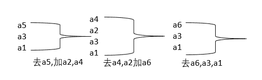

# 美丽联合 2018 校招基础平台-基础后端开发工程师笔试试卷

## 1

关于排序算法下列说法正确的是

正确答案: A   你的答案: 空 (错误)

```cpp
快速排序在被排序的数据完全无序时最易发挥其长处
```

```cpp
快速排序是稳定的排序算法
```

```cpp
堆排序最好情况和最坏情况下时间复杂度不同
```

```cpp
快速排序所需的辅助空间少于堆排序
```

本题知识点

Java 工程师 C++工程师 蘑菇街 C++工程师 Java 工程师 蘑菇街 2018

讨论

[内谁别跑](https://www.nowcoder.com/profile/7431717)

```cpp
快速排序在被排序的数据完全无序时最易发挥其长处
```

发表于 2018-09-27 18:04:50

* * *

## 2

下面关于 Linux 文件系统的 inode 描述错误的是

正确答案: A   你的答案: 空 (错误)

```cpp
inode 和文件是一一对应的
```

```cpp
inode 描述了文件大小和指向数据块的指针
```

```cpp
通过 inode 可获得文件占用的块数
```

```cpp
通过 inode 可实现文件的逻辑结构和物理结构的转换
```

本题知识点

Java 工程师 C++工程师 蘑菇街 C++工程师 Java 工程师 蘑菇街 2018

讨论

[梦境迷离](https://www.nowcoder.com/profile/759736)

```cpp
一般情况下，文件名和 inode 号码是"一一对应"关系，每个 inode 号码对应一个文件名。
但是，Unix/Linux 系统允许，多个文件名指向同一个 inode 号码。
这意味着，可以用不同的文件名访问同样的内容；对文件内容进行修改，会影响到所有文件名；
但是，删除一个文件名，不影响另一个文件名的访问。这种情况就被称为"硬链接"（hard link）。
```

编辑于 2018-02-26 13:53:30

* * *

## 3

在 TCP/IP 中，ICMP 属于哪一层协议？

正确答案: A   你的答案: 空 (错误)

```cpp
ip
```

```cpp
ppp
```

```cpp
udp
```

```cpp
tcp
```

本题知识点

Java 工程师 C++工程师 蘑菇街 C++工程师 Java 工程师 蘑菇街 2018

讨论

[梦境迷离](https://www.nowcoder.com/profile/759736)

```cpp
ICMP 是 IP 协议不可分割的一部分,所以 ICMP 是属于网络层的一个协议.
```

发表于 2018-02-26 13:54:37

* * *

## 4

0.6332 的数据类型是（）

正确答案: B   你的答案: 空 (错误)

```cpp
float
```

```cpp
double
```

```cpp
Float
```

```cpp
Double
```

本题知识点

Java 工程师 C++工程师 蘑菇街 C++工程师 Java 工程师 蘑菇街 2018

讨论

[梦境迷离](https://www.nowcoder.com/profile/759736)

这题应该说什么语言中吧 反正 java 是 double

发表于 2018-02-26 13:55:17

* * *

## 5

灰度等级为 256 级，分辨率为 1024*1024 的显示器，至少需要的帧缓存容量为（）

正确答案: C   你的答案: 空 (错误)

```cpp
4MB
```

```cpp
2MB
```

```cpp
1MB
```

```cpp
512KB
```

本题知识点

Java 工程师 C++工程师 蘑菇街 C++工程师 Java 工程师 蘑菇街 2018

讨论

[小谢 backup](https://www.nowcoder.com/profile/5379055)

1024*1024=1Mbit,
1Mbit*8=1MB(256 灰度用 8 比特表示)

编辑于 2018-02-26 15:21:15

* * *

[梦境迷离](https://www.nowcoder.com/profile/759736)

1024*1024*8/8   256 = 2⁸ 八位

编辑于 2018-02-26 13:56:42

* * *

## 6

设在一棵度数为 3 的树中，度数为 3 的结点数有 2 个，度数为 2 的结点数有 1 个，度数为 1 的结点数有 2 个，那么度数为 0 的结点数有( )个。

正确答案: C   你的答案: 空 (错误)

```cpp
4
```

```cpp
5
```

```cpp
6
```

```cpp
7
```

本题知识点

Java 工程师 C++工程师 蘑菇街 2018

讨论

[小谢 backup](https://www.nowcoder.com/profile/5379055)

从子节点的角度，共有节点数为：度数为 3 的子节点数+度数为 2 的子节点数+度数为 1 的子节点数+根节点数=3*2+2*1+1*2+1=11；
从父节点的角度，共有节点数为：度数为 3 的节点数+度数为 2 的节点数+度数为 1 的节点数+度数为 0 的节点数=2+1+2+x；
解得 x=6

发表于 2018-02-26 15:31:40

* * *

[小猫子](https://www.nowcoder.com/profile/32903037)

结点数=分枝数+1

发表于 2020-10-20 22:14:01

* * *

## 7

小明的游戏账号密码是一串 8 位数字，只记前面 5 个数字为 38034.但他肯定，后面 3 个数字全是奇数，最后一个数字是 5，且后 3 个数字中相邻数字不相同，小明至少要试多少次才能保证登入（）

正确答案: C   你的答案: 空 (错误)

```cpp
20
```

```cpp
18
```

```cpp
16
```

```cpp
15
```

本题知识点

Java 工程师 C++工程师 蘑菇街 C++工程师 Java 工程师 蘑菇街 2018

讨论

[嫣然＊戀淒月](https://www.nowcoder.com/profile/229836)

共有 1、3、5、7、9 五个奇数 1、_、5(共 3 次)3、_、5(共 3 次)5、_、5(共 4 次)7、_、5(共 3 次)9、_、5(共 3 次)
总共 3+3+4+3+3=16(次)

发表于 2018-03-16 16:35:24

* * *

[JonTang](https://www.nowcoder.com/profile/1173781)

忘记两边都是 5 的时候，可以有四种取值了

发表于 2018-09-09 20:27:06

* * *

[似水流年。。](https://www.nowcoder.com/profile/8069522)

4*4

发表于 2018-03-09 16:31:15

* * *

## 8

入栈序列是：a1,a3,a5,a2,a4,a6,出栈序列是：a5,a4,a2,a6,a3,a1，则栈的容量最小是（）

正确答案: D   你的答案: 空 (错误)

```cpp
5
```

```cpp
3
```

```cpp
6
```

```cpp
4
```

本题知识点

Java 工程师 C++工程师 蘑菇街 C++工程师 Java 工程师 蘑菇街 2018

讨论

[内谁别跑](https://www.nowcoder.com/profile/7431717)

入栈：a1,a3,a5,a2,a4,a6。出栈：a5,a4,a2,a6,a3,a1。说明 a5 第一个出栈，之后原有的栈中还剩 a1 a3 。根据入栈顺序，a2 a4 入栈之后，现在栈中有四个元素 a1 a3 a2 a4。紧接着 a4 a2 出栈。a6 入栈。栈中还剩三个元素 a1 a3 a6。所以栈的最小容量是 4。

发表于 2018-09-27 18:12:07

* * *

[小谢 backup](https://www.nowcoder.com/profile/5379055)



发表于 2018-02-26 15:41:01

* * *

## 9

500 张骨牌整齐地排成一行,按顺序编号为 1、2、3、......、499、500。第一次拿走所有奇数位置上的骨牌,第二次再从剩余骨牌中拿走奇数位置上 的骨牌,以此类推。请问最后剩下的一张骨牌的编号是? 

正确答案: C   你的答案: 空 (错误)

```cpp
128
```

```cpp
250
```

```cpp
256
```

```cpp
500
```

本题知识点

Java 工程师 C++工程师 蘑菇街 C++工程师 Java 工程师 蘑菇街 2018

讨论

[小谢 backup](https://www.nowcoder.com/profile/5379055)

循环除 2 为偶的且是最大的，
除 2 为偶的有：2，4，8，16，32，64，128，256。
继续有：4，16，64，256
继续有：16，256
最后：256

发表于 2018-03-04 11:45:48

* * *

[Linco](https://www.nowcoder.com/profile/3930597)

循环除 2 为偶的 钉子户

发表于 2018-02-27 20:22:44

* * *

## 10

Linux 文件权限一共 10 位长度,从前数第 5-7 位表示的内容是() 

正确答案: B   你的答案: 空 (错误)

```cpp
其他用户的权限
```

```cpp
文件所有者所在组的权限
```

```cpp
文件类型
```

```cpp
文件所有者的权限
```

本题知识点

Java 工程师 C++工程师 蘑菇街 C++工程师 Java 工程师 蘑菇街 2018

讨论

[笑声更迷人的小哥](https://www.nowcoder.com/profile/7283763)

Linux 用户分为：拥有者、组群(Group)、其他（other） linux 中的文件属性过分四段，如 -rwzrwz--- 第一段 - 是指文件类型 表示这是个普通文件 文件类型部分 -为：表示文件 d 为：表示文件夹 l 为：表示连接 b 为：表示里面可以供存储周边设备 c 为：表示里面为一次性读取装置 第二段(2-4) rwz 是指拥有者具有可读可写可执行的权限 类似于 windows 中的所有者权限比如 administrator 对文件具有 修改、读取和执行权限 第三段(5-7) rwz 是指所属于这个组的成员对于这个文件具有，可读可写可执行的权限 类似于 windows 中的组权限比如 administrators 组，属于这个组的成员对于文件的都有 可读可写可执行权限 第四段 --- 是指其他人对于这个文件没有任何权限 类似于 windows 中的 anyone 一样就是说所有人对着个文件都会有一个怎样的权限

发表于 2018-04-18 11:12:31

* * *

## 11

面向对象程序设计语言的三个基本特征是？（   ）

正确答案: D   你的答案: 空 (错误)

```cpp
封装、接口和多态
```

```cpp
封装、继承和动态
```

```cpp
跨平台、接口和动态
```

```cpp
封装、继承和多态
```

本题知识点

Java 工程师 C++工程师 蘑菇街 C++工程师 Java 工程师 蘑菇街 2018

讨论

[在沙雕路上越走越远](https://www.nowcoder.com/profile/8305684)

动态看成多态 GG

编辑于 2018-04-15 22:39:10

* * *

## 12

指出以下程序运行的结果是

```cpp

	public class Example{

	    String str=new String("good");

	    char[]ch={'a','b','c'};

	    public static void main(String args[]){

	        Example ex=new Example();

	        ex.change(ex.str,[ex.ch](http://ex.ch/));

	        System.out.print(ex.str+" and ");

	        System.out.print(ex.ch);

	    }

	    public void change(String str,char ch[]){

	        str="test ok";

	        ch[0]='g';

	    }

}
```

正确答案: B   你的答案: 空 (错误)

```cpp
good and abc
```

```cpp
good and gbc
```

```cpp
tst ok and abc
```

```cpp
tst ok and gbc
```

本题知识点

Java 工程师 C++工程师 蘑菇街 C++工程师 Java 工程师 蘑菇街 2018

讨论

[昵称好难找到](https://www.nowcoder.com/profile/9384849)

```cpp

	publicvoidchange(String str,charch[]){

	            str="test ok";

	            ch[0]='g';

	        }

        }
```

函数中的 str 是局部变量，String str 不是引用类型

发表于 2018-03-22 16:42:05

* * *

## 13

以下代码执行后输出结果为:

```cpp

	public class Test

	{

	    public static Test t1 = new Test();

	    {

	         System.out.println("blockA");

	    }

	    static

	    {

	        System.out.println("blockB");

	    }

	    public static void main(String[]
args)

	    {

	        Test t2 = new Test();

	    }

 }
```

正确答案: A   你的答案: 空 (错误)

```cpp
blockAblockBblockA
```

```cpp
blockAblockAblockB
```

```cpp
blockBblockBblockA
```

```cpp
blockBblockAblockB
```

本题知识点

Java 工程师 C++工程师 蘑菇街 2018

讨论

[小谢 backup](https://www.nowcoder.com/profile/5379055)

 当 mian 方法中运行到 Test t2 = newTest();时， 首先是执行静态变量和静态代码块，然后才会到新建对象的构造代码块和构造方法（且构造代码块要优先于构造方法）。即执行顺序为：静态变量>静态代码块>构造代码块>构造方法。
静态变量就是 publicstaticTest t1 = newTest();此时这行代码会调用构造代码块，即输出 blockA;注意构造代码块只有新建对象 Test()才会执行。
接着执行静态代码块，输出 blockB; 注意静态代码块之会执行一次。
然后继续就到了新建对象 t2 了，此时是先执行构造代码块，输出 blockA;接着再执行构造方法，无输出。
综上，选 A

编辑于 2018-03-04 11:40:56

* * *

## 14

计算机系统中判别是否有中断事件发生应是在（）

正确答案: B   你的答案: 空 (错误)

```cpp
进程切换时
```

```cpp
执行完一条指令后
```

```cpp
执行 P 操作后
```

```cpp
由用户态转入核心态时
```

本题知识点

Java 工程师 C++工程师 蘑菇街 C++工程师 Java 工程师 蘑菇街 2018

## 15

避免死锁的一个著名的算法是（ ）

正确答案: B   你的答案: 空 (错误)

```cpp
先入先出法
```

```cpp
银行家算法
```

```cpp
优先级算法
```

```cpp
资源按序分配法
```

本题知识点

Java 工程师 C++工程师 蘑菇街 C++工程师 Java 工程师 蘑菇街 2018

## 16

某系统中有 3 个并发进程，都需要同类资源 4 个，试问该系统不会发生死锁的最少资源数是：

正确答案: B   你的答案: 空 (错误)

```cpp
9
```

```cpp
10
```

```cpp
11
```

```cpp
12
```

本题知识点

Java 工程师 C++工程师 蘑菇街 C++工程师 Java 工程师 蘑菇街 2018

讨论

[小谢 backup](https://www.nowcoder.com/profile/5379055)

如果一个进程有 demand 个资源它就能够结束，不会使自己陷入死锁中。因此最差情况是每个进程有 demand-1 个资源并且需要另外一个资源。如果留下有一个资源可用，那么其中某个进程就能够结束并释放它的所有资源，使其它进程也能够结束。所以避免死锁的条件是：total≥n(demand-1)+1。带入上述条件公式：total≥3*(4-1)+1=10。所以答案为 10 个。 也可以这么看，3 个进程就是 3 个桶，每个桶的容量都是 4，但水容量不能太少，否则桶们不会满足，因为每个桶都不肯主动放弃自己的水，而也没有额外的外部的水，这样会导致死锁，就是互相等待其它桶的水。因此得继续增加水量，临界情况就是每个桶都有 3 份水（总的 9 份），但此时还是会导致死锁，如果再有额外的一份水，那只需要加入某个桶，这个桶就会主动释放自己的水，其它的桶类似。

如果你想问，那比如 9 份水，可以先给 4 个到某一个桶里面，其它桶少点，这样那个满足的桶可以先释放水，然后可以给其它桶了呀。
这种情况虽然可能发生，但是大多数情况下是大家都在抢所以导致没一个桶拿到满的水份，这样还是会出现死锁，而题目中意思要求不能出现死锁。 

编辑于 2018-03-03 11:57:08

* * *

[Octantis](https://www.nowcoder.com/profile/6428122)

3 个进程，分别持有 3 个资源，此时只要再多 1 个就不会死锁了，就是 3+3+4

发表于 2018-03-22 17:16:36

* * *

## 17

下面有关共享内存，说法不正确的是？

正确答案: D   你的答案: 空 (错误)

```cpp
共享内存和使用信号量一样，属于进程间通信的一种方式。
```

```cpp
使用 shmget 函数来创建共享内存
```

```cpp
尽管每个进程都有自己的内存地址，不同的进程可以同时将同一个内存页面映射到自己的地址空间中，从而达到共享内存的目的
```

```cpp
共享内存提供了同步机制，在第一个进程结束对共享内存的写操作之前，会有自动机制可以阻止第二个进程开始对它进行读取
```

本题知识点

Java 工程师 C++工程师 蘑菇街 C++工程师 Java 工程师 蘑菇街 2018

讨论

[梦境迷离](https://www.nowcoder.com/profile/759736)

共享内存不提供同步  参考 JMM java 内存模型

发表于 2018-02-26 13:59:49

* * *

## 18

假设如下代码中，若 t1 线程在 t2 线程启动之前已经完成启动。代码的输出是（）

```cpp

	public static void main(String[]args)throws Exception {

	    final Object obj = new Object();

	    Thread t1 = new Thread() {

	        public void run() {

	            synchronized (obj) {

	                try {

	                    obj.wait();

	                    System.out.println("Thread 1 wake up.");

	                } catch (InterruptedException e) {

	                }

	            }

	        }

	    };

	    t1.start();

	    Thread.sleep(1000);//We assume thread 1 must start up within 1 sec.

	    Thread t2 = new Thread() {

	        public void run() {

	            synchronized (obj) {

	                obj.notifyAll();

	                System.out.println("Thread 2 sent notify.");

	            }

	        }

	    };

	    t2.start();

}
```

正确答案: B   你的答案: 空 (错误)

```cpp
Thread 1 wake up<br>Thread 2 sent notify.
```

```cpp
Thread 2 sent notify.<br>Thread 1 wake up
```

```cpp
A、B 皆有可能
```

```cpp
程序无输出卡死
```

本题知识点

Java 工程师 C++工程师 蘑菇街 C++工程师 Java 工程师 蘑菇街 2018

讨论

[小谢 backup](https://www.nowcoder.com/profile/5379055)

以下 A 代表 t1，B 代表 t2。
当 B 调用 obj.notify/notifyAll 的时候，B 正持有 obj 锁，因此，A1，A2，A3 虽被唤醒，但是仍无法获得 obj 锁。直到 B 退出 synchronized 块，释放 obj 锁后，A1，A2，A3 中的一个才有机会获得锁继续执行。当 B 调用 obj.notify/notifyAll 的时候，B 正持有 obj 锁，因此，A1，A2，A3 虽被唤醒，但是仍无法获得 obj 锁。直到 B 退出 synchronized 块，释放 obj 锁后，A1，A2，A3 中的一个才有机会获得锁继续执行。

编辑于 2018-03-03 11:33:17

* * *

## 19

关于 TCP 可靠数据传输服务的论述，正确的是（  ）

正确答案: D   你的答案: 空 (错误)

```cpp
只有当超时事件发生，TCP 才会执行重传
```

```cpp
每次 TCP 重传时，都重新为定时器设置一个固定时间间隔
```

```cpp
TCP 接收方不需要对乱序到达的分组进行确认
```

```cpp
一旦收到 3 个冗余 ACK，TCP 就执行快速重传
```

本题知识点

Java 工程师 C++工程师 蘑菇街 C++工程师 Java 工程师 蘑菇街 2018

讨论

[梦境迷离](https://www.nowcoder.com/profile/759736)

a 有差错分组也将重传 差错由 tcp 差错检测完成 rdt2.0 开始 b 倒计数定时器，发送方需要每次发送一个分组就启动一个定时器且可以响应定时器的中断和终止定时器  而不是重新射到时间  rdt2.2c 重传需要处理冗余分组 seq 用来判断是否是重传 d 。。。copy

主要的考虑还是要区分包的丢失是由于链路故障还是乱序等其他因素引发。

两次 duplicated ACK 时很可能是乱序造成的！三次 duplicated ACK 时很可能是丢包造成

的！四次 duplicated ACK 更更更可能是丢包造成的。丢包肯

定会造成三次 duplicated ACK!综上是选择收到三个重复确认时窗口减半效果最好

发表于 2018-02-26 14:20:23

* * *

## 20

通过 POP3 协议接收邮件时，使用的传输层服务类型是（）

正确答案: D   你的答案: 空 (错误)

```cpp
无连接不可靠的数据传输服务
```

```cpp
无连接可靠的数据传输服务
```

```cpp
有连接不可靠的数据传输服务
```

```cpp
有链接可靠的数据传输服务
```

本题知识点

Java 工程师 C++工程师 蘑菇街 C++工程师 Java 工程师 蘑菇街 2018

讨论

[梦境迷离](https://www.nowcoder.com/profile/759736)

pop3 基于 tcp 必须面向链接和可靠

发表于 2018-02-26 14:21:28

* * *

## 21

下列关于闪存（Flash Memory）的叙述中，错误的是（ ）

正确答案: A   你的答案: 空 (错误)

```cpp
信息可读可写，并且读、写速度一样快
```

```cpp
存储元由 MOS 管组成，是一种半导体存储器
```

```cpp
掉电后信息不丢失，是一种非易失性存储器
```

```cpp
采用随机访问方式，可替代计算机外部存储器
```

本题知识点

Java 工程师 C++工程师 蘑菇街 C++工程师 Java 工程师 蘑菇街 2018

讨论

[似水流年。。](https://www.nowcoder.com/profile/8069522)

闪存（Flash Memory）是一种长寿命的非易失性（在断电情况下仍能保持所存储的数据信息）的[存储器](https://baike.baidu.com/item/%E5%AD%98%E5%82%A8%E5%99%A8)，数据删除不是以单个的[字节](https://baike.baidu.com/item/%E5%AD%97%E8%8A%82)为单位而是以固定的区块为单位（注意：NOR Flash 为字节存储。），区块大小一般为 256KB 到 20MB。闪存是电子可擦除[只读存储器](https://baike.baidu.com/item/%E5%8F%AA%E8%AF%BB%E5%AD%98%E5%82%A8%E5%99%A8)（EEPROM）的变种，闪存与 EEPROM 不同的是，EEPROM 能在字节水平上进行删除和重写而不是整个[芯片](https://baike.baidu.com/item/%E8%8A%AF%E7%89%87)擦写，而闪存的大部分芯片需要块擦除。由于其断电时仍能保存数据，闪存通常被用来保存设置信息，如在电脑的[BIOS](https://baike.baidu.com/item/BIOS)（基本程序）、[PDA](https://baike.baidu.com/item/PDA)（[个人数字助理](https://baike.baidu.com/item/%E4%B8%AA%E4%BA%BA%E6%95%B0%E5%AD%97%E5%8A%A9%E7%90%86)）、数码相机中保存[资料](https://baike.baidu.com/item/%E8%B5%84%E6%96%99)等。

发表于 2018-03-09 16:54:15

* * *

## 22

下面代码会输出什么（）

```cpp

	int main(int argc, char **argv)

	{

	    int a[4] = {1, 2, 3, 4};

	    int *ptr = (int *)(&a + 1);

	    printf("%d",*(ptr - 1));

}
```

正确答案: D   你的答案: 空 (错误)

```cpp
1
```

```cpp
2
```

```cpp
3
```

```cpp
4
```

本题知识点

Java 工程师 C++工程师 蘑菇街 C++工程师 Java 工程师 蘑菇街 2018

讨论

[似水流年。。](https://www.nowcoder.com/profile/8069522)

a 指向数组 a[0]的地址，&指向 a[]的地址，他们的值是相同的，但是相加不同，a+1 表示之下下一位，等于 a+sizeof(int)，&a+1 表示指向下一个 a[]数组，即等于 a+sizeof(a)

发表于 2018-03-09 16:53:10

* * *

## 23

执行如下代码段后，变量 s1 引用的字符串值是(    )

```cpp

	String s1 = "ABCD";

	String s2 = "1234";

System.out.println(s1+ s2); 
```

正确答案: A   你的答案: 空 (错误)

```cpp
ABCD
```

```cpp
1234
```

```cpp
ABCD1234
```

```cpp
1234ABCD
```

本题知识点

Java 工程师 C++工程师 蘑菇街 C++工程师 Java 工程师 蘑菇街 2018

讨论

[QuellanAn](https://www.nowcoder.com/profile/1064377)

看清题干，问题是 s1 的值是什么，而不是输出的结果，怎么感觉是文字游戏题，天~

发表于 2018-02-26 16:10:42

* * *

## 24

以下方法，哪个不是对 add 方法的重载?

```cpp

	public class Test

	{

	    public void add( int x,int y,int z){}

}
```

正确答案: B   你的答案: 空 (错误)

```cpp
public int add(int x,int y,float z){return 0;}
```

```cpp
public int add(int x,int y,int z){return 0;}
```

```cpp
public void add(int x,int y){}
```

```cpp
都不是
```

本题知识点

Java 工程师 C++工程师 蘑菇街 C++工程师 Java 工程师 蘑菇街 2018

讨论

[牛客 1467225 号](https://www.nowcoder.com/profile/1467225)

一个类中多态的表现，重载是指参数类型和个数不同，返回值可以相同也可以不同不能作为判别依据。 重写是子类方法与父类方法有相同的名称和参数。是父类与子类的多态返回值必须相同。

发表于 2018-04-03 21:30:43

* * *

[一大颗西红柿🍅](https://www.nowcoder.com/profile/8442226)

理解重载和重写区别

发表于 2018-03-07 19:54:41

* * *

[吃面用面条鲜](https://www.nowcoder.com/profile/9814164)

ab 都不是

发表于 2018-03-07 13:02:11

* * *

## 25

在 java 类设计中，类的成员变量要求仅仅能够被同一 package 下的类访问，请问应该使用下列哪个修饰词（）

正确答案: D   你的答案: 空 (错误)

```cpp
protected
```

```cpp
public
```

```cpp
private
```

```cpp
不需要任何修饰词
```

本题知识点

Java 工程师 C++工程师 蘑菇街 C++工程师 Java 工程师 蘑菇街 2018

讨论

[夏日冰激凌丶](https://www.nowcoder.com/profile/3890740)

1.  private: Java 语言中对访问权限限制的最窄的修饰符，一般称之为“私有的”。被其修饰的属性以及方法只能被该类的对象访问，其子类不能访问，更不能允许跨包访问。
2.  default：即不加任何访问修饰符，通常称为“默认访问权限“或者“包访问权限”。该模式下，只允许在同一个包中进行访问。
3.  protected: 介于 public 和 private 之间的一种访问修饰符，一般称之为“保护访问权限”。被其修饰的属性以及方法只能被类本身的方法及子类访问，即使子类在不同的包中也可以访问。
4.  public： Java 语言中访问限制最宽的修饰符，一般称之为“公共的”。被其修饰的类、属性以及方法不仅可以跨类访问，而且允许跨包访问。

发表于 2018-04-27 17:16:07

* * *

[被拐卖的小红薯](https://www.nowcoder.com/profile/6146808)

默认修饰符号就是 protected 啊！

发表于 2018-02-15 05:19:00

* * *

## 26

下面有关 forward 和 redirect 的描述,错误的是()      

正确答案: A   你的答案: 空 (错误)

```cpp
redirect 默认将产生 301 Permanently moved 的 HTTP 响应
```

```cpp
执行 forward 时，浏览器不知道服务器发送的内容是从何处来，浏览器地址栏中还是原来的地址
```

```cpp
执行 redirect 时，服务器端告诉浏览器重新去请求地址
```

```cpp
forward 是内部重定向，redirect 是外部重定向
```

本题知识点

Java 工程师 C++工程师 蘑菇街 C++工程师 Java 工程师 蘑菇街 2018

讨论

[小谢 backup](https://www.nowcoder.com/profile/5379055)

redirect 默认是 302 暂时性跳转

发表于 2018-03-03 10:51:41

* * *

[梦境迷离](https://www.nowcoder.com/profile/759736)

301 永久 302 暂时

发表于 2018-02-26 14:23:34

* * *

## 27

如果您想列出当前目录以及子目录下所有扩展名为“.txt”的文件，那么您可以使用的命令是（）

正确答案: C   你的答案: 空 (错误)

```cpp
ls -d.txt
```

```cpp
ls *.txt
```

```cpp
find -name “*.txt”
```

```cpp
find “.txt”
```

本题知识点

Java 工程师 C++工程师 蘑菇街 C++工程师 Java 工程师 蘑菇街 2018

## 28

二分查找要求节点 ()

正确答案: A   你的答案: 空 (错误)

```cpp
有序、顺序存储
```

```cpp
有序、链接存储
```

```cpp
无序、顺序存储
```

```cpp
无序、链接存储
```

本题知识点

Java 工程师 C++工程师 蘑菇街 C++工程师 Java 工程师 蘑菇街 2018

## 29

用直接插入排序方法对下面 4 个序列进行排序(由小到大),元素比较次数最少的是()

正确答案: C   你的答案: 空 (错误)

```cpp
94,32,40,90,80,46,21,69
```

```cpp
32,40,21,46,69,94,90,80
```

```cpp
21,32,46,40,80,69,90,94
```

```cpp
90,69,80,46,21,32,94,40
```

本题知识点

Java 工程师 C++工程师 蘑菇街 C++工程师 Java 工程师 蘑菇街 2018

讨论

[嫣然＊戀淒月](https://www.nowcoder.com/profile/229836)

A 共比較：4+7+4+3+2+2+1=23(次)B 共比較：1+2+1+1+1+2+3=11(次)C 共比較：1+1+2+1+2+1+1=9(次)D：沒算(看數字就覺得肯定比 C 多)

发表于 2018-03-17 10:17:42

* * *

[我是真的菜啊](https://www.nowcoder.com/profile/887629)

瞅一眼，相对有序就完事。

发表于 2018-04-08 13:40:18

* * *

## 30

现有 1G 数据需要排序，计算资源只有 1G 内存可用，下列排序方法中最可能出现性能问题的是 ____。

正确答案: C   你的答案: 空 (错误)

```cpp
堆排序
```

```cpp
插入排序
```

```cpp
归并排序
```

```cpp
冒泡排序
```

本题知识点

Java 工程师 C++工程师 蘑菇街 C++工程师 Java 工程师 蘑菇街 2018

讨论

[嫣然＊戀淒月](https://www.nowcoder.com/profile/229836)

歸併排序需要重新開一個臨時數組空間

发表于 2018-03-17 10:18:42

* * *

[梦境迷离](https://www.nowcoder.com/profile/759736)

冒泡 1g 也太. ..

编辑于 2018-02-26 14:25:08

* * *

## 31

下列选项中，降低进程优先级的合理时机是？

正确答案: B   你的答案: 空 (错误)

```cpp
进程刚完成 I/O，进入就绪列队
```

```cpp
进程的时间片用完
```

```cpp
进程从就绪态转为运行态
```

```cpp
进程长期处于就绪队列中
```

本题知识点

Java 工程师 C++工程师 蘑菇街 2018

讨论

[梦境迷离](https://www.nowcoder.com/profile/759736)

a 他已经进入就绪了 c 人家刚运行，你就降低，有可能会被抢断 d 原因 长期在就绪也就是等待，在不升高优先级就要饿死了 

发表于 2018-02-26 14:27:19

* * *

## 32

关于抽象类叙述正确的是？ ( )

正确答案: B   你的答案: 空 (错误)

```cpp
抽象类不能实现接口
```

```cpp
抽象类必须有“abstract class”修饰
```

```cpp
抽象类必须包含抽象方法
```

```cpp
抽象类也有类的特性，可以被实例化
```

本题知识点

Java 工程师 C++工程师 蘑菇街 C++工程师 Java 工程师 蘑菇街 2018

讨论

[请给我一个 offer 吧](https://www.nowcoder.com/profile/4726764)

哈哈

发表于 2018-08-02 20:48:16

* * *

[QuellanAn](https://www.nowcoder.com/profile/1064377)

一个类中含有抽象方法，则这个类为抽象类，一个类为抽象类，可以没有抽象方法。

发表于 2018-02-26 16:13:07

* * *

## 33

引入二叉线索树的目的是()

正确答案: A   你的答案: 空 (错误)

```cpp
加快查找结点的前驱或后继的速度
```

```cpp
为了能在二叉树中方便地进行插入与删除
```

```cpp
为了能方便地找到双亲
```

```cpp
使二叉树的遍历结果唯一
```

本题知识点

Java 工程师 C++工程师 蘑菇街 C++工程师 Java 工程师 蘑菇街 2018

讨论

[昵称好难找到](https://www.nowcoder.com/profile/9384849)

找一个节点的前驱后继的时候,比非二叉线索树强

发表于 2018-03-22 16:45:18

* * *

## 34

用邻接表表示图进行广度优先遍历时,通常是采用（）来实现算法的

正确答案: B   你的答案: 空 (错误)

```cpp
栈
```

```cpp
队列
```

```cpp
树
```

```cpp
图
```

本题知识点

Java 工程师 C++工程师 蘑菇街 C++工程师 Java 工程师 蘑菇街 2018

## 35

在使用 mkdir 命令创建新的目录时，在其父目录不存在时先创建父目录的选项是

正确答案: D   你的答案: 空 (错误)

```cpp
-m
```

```cpp
-d
```

```cpp
-f
```

```cpp
-p
```

本题知识点

Java 工程师 C++工程师 蘑菇街 C++工程师 Java 工程师 蘑菇街 2018

## 36

下面有关内核线程和用户线程说法错误的是？

正确答案: C   你的答案: 空 (错误)

```cpp
用户线程因<br>I/O 而处于等待状态时，整个进程就会被调度程序切换为等待状态，其他线程得不到运行的机会
```

```cpp
内核线程只运行在内核态，不受用户态上下文的影响
```

```cpp
用户线程和内核线程的调度都需要经过内核态
```

```cpp
内核线程有利于发挥多处理器的并发优势，但却占用了更多的系统开支
```

本题知识点

Java 工程师 C++工程师 蘑菇街 C++工程师 Java 工程师 蘑菇街 2018

讨论

[我是真的菜啊](https://www.nowcoder.com/profile/887629)

用户线程不需要，不然 golang 就没有存在的意义了。

发表于 2018-04-08 13:41:52

* * *

## 37

视图是一个“虚表”，视图的构造基于（    ）

正确答案: C   你的答案: 空 (错误)

```cpp
基本表
```

```cpp
视图
```

```cpp
基本表或视图
```

```cpp
数据字典
```

本题知识点

Java 工程师 C++工程师 蘑菇街 C++工程师 Java 工程师 蘑菇街 2018

## 38

大整数 845678992357836701 转化成 16 进位制的表示，最后两位字符是(  )

正确答案: D   你的答案: 空 (错误)

```cpp
8B
```

```cpp
AB
```

```cpp
EF
```

```cpp
9D
```

本题知识点

Java 工程师 C++工程师 蘑菇街 C++工程师 Java 工程师 蘑菇街 2018

讨论

[梦境迷离](https://www.nowcoder.com/profile/759736)

100%4 = 0
1000%8 = 0
10000%16 = 0（84567899235783*10000） （845678992357830000+6701） 845678992357836701%16 = 6701%16 = 701%16 = 13
所以最后一位是 D

编辑于 2018-02-26 14:32:32

* * *

## 39

Java 中用正则表达式截取字符串中第一个出现的英文左括号之前的字符串。比如：北京市（海淀区）（朝阳区）（西城区），截取结果为：北京市。正则表达式为（）

正确答案: A   你的答案: 空 (错误)

```cpp
&quot;.*?(?=\\()&quot;
```

```cpp
&quot;.*?(?=\()&quot;
```

```cpp
&quot;.*(?=\\()&quot;
```

```cpp
&quot;.*(?=\()&quot;
```

本题知识点

Java 工程师 C++工程师 蘑菇街 C++工程师 Java 工程师 蘑菇街 2018

讨论

[Demo20180727144828](https://www.nowcoder.com/profile/775854607)

如果不会，百度先行断言

发表于 2018-09-25 16:13:59

* * *

## 40

桌子上有 4 个杯子，每个杯子上写着一句话：第一个杯子：“所有的杯子中都有水果糖”；第二个杯子：“本杯中有苹果”；第三个杯子：“本杯中没有巧克力”；第四个杯子：“有些杯子中没有水果糖”。如果其中只有一句真话，那么以下哪项为真？（ ）

正确答案: D   你的答案: 空 (错误)

```cpp
所有的杯子中都有水果糖
```

```cpp
所有的杯子中都没有水果糖
```

```cpp
所有的杯子中都没有苹果
```

```cpp
第三个杯子中有巧克力
```

本题知识点

Java 工程师 C++工程师 蘑菇街 C++工程师 Java 工程师 蘑菇街 2018

讨论

[梦境迷离](https://www.nowcoder.com/profile/759736)

正确答案：D
“所有的杯子中都有水果糖”与“有些杯子中没有水果糖”具有矛盾关系，根据排中律，不可能同假，必有一真，故唯一为真的只能是这两句当中的一句，其余两句均为假，“本杯(即第三杯)中没有巧克力”为假，故“第三个杯子中有巧克力”。故选 D

发表于 2018-02-26 14:35:42

* * *

## 41

在一个 java 程序的内存中，存在一个复杂的嵌套的对象 A；现在我们需要将 A 中所有信息，通过 TCP 方式传输二进制流到 server 端。考虑到 server 可反向转化成对象 A 和以及网络流量尽量小，请问如下哪种方案的描述是正确和可行的

正确答案: D   你的答案: 空 (错误)

```cpp
先通过 protobuf 序列化成一个字符串，转化成二进制流，然后通过 lz4 压缩成需要传输的二进制流
```

```cpp
先通过 gzip 压缩成一个字符串，转化成二进制流，然后通过 json 序列化成需要传输的二进制流
```

```cpp
先通过 xml 序列化成一个字符串，转化成二进制流，然后通过 hessian 压缩成需要传输的二进制流
```

```cpp
先通过 json 序列化成一个字符串，转化成二进制流，然后通过 snappy 压缩成需要传输的二进制流
```

本题知识点

Java 工程师 C++工程师 蘑菇街 2018

## 42

在 HTTP 协议的网络编程中，经常会涉及到『长连接』、『短连接』、『长轮询』等概念，关于这些以下哪种说法不正确：

正确答案: C   你的答案: 空 (错误)

```cpp
长连接需要定期保活机制，否则容易出现断连的问题
```

```cpp
长轮询可以基于长连接实现，也可以是短连接实现
```

```cpp
在网络调用量很大的时候，短连接因为资源占用少，因而相对长连接性能更好
```

```cpp
长短连接的创建的基本过程是一致的
```

本题知识点

Java 工程师 C++工程师 蘑菇街 2018

讨论

[梦境迷离](https://www.nowcoder.com/profile/759736)

c 频繁创建 Socket 性能并不好

发表于 2018-02-26 14:39:13

* * *

## 43

对于 Linux 的 fsync，下列哪个说法是正确的?

正确答案: A   你的答案: 空 (错误)

```cpp
文件的脏页以及 metadata 会同步到存储设备
```

```cpp
文件的脏页会同步到存储设备，但不包含文件的 metadata
```

```cpp
新同步的文件内容一定不会丢失
```

```cpp
fsync 比 fdatasync 的性能更好
```

本题知识点

Java 工程师 C++工程师 蘑菇街 2018

讨论

[就想有个靠谱工作](https://www.nowcoder.com/profile/8197082)

fsync 除了同步文件的修改内容（脏页），fsync 还会同步文件的描述信息（metadata（B 错），包括 size、访问时间 st_atime & st_mtime 等等），因为文件的数据和 metadata 通常存在硬盘的不同地方，因此 fsync 至少需要两次 IO 写操作，而 fdatasync 不用同步 metadata，所以少一次 IO 写操作，更快（D 错）

发表于 2018-03-31 17:15:15

* * *

## 44

今年的第几天？

输入年、月、日，计算该天是本年的第几天。

本题知识点

Java 工程师 C++工程师 蘑菇街 2018

讨论

[JonTang](https://www.nowcoder.com/profile/1173781)

importjava.util.Scanner;publicclassMain{    publicstaticvoidmain(String[] args){        Scanner sc=newScanner(System.in);        //while(sc.hasNext()){            intY=sc.nextInt();            intM=sc.nextInt();            intD=sc.nextInt();            intmon1[]={31,29,31,30,31,30,31,31,30,31,30,31};            intmon2[]={31,28,31,30,31,30,31,31,30,31,30,31};            intsum=0;            if(Y%4==0){                for(inti=0;i<M-1;i++){                    sum+=mon1[i];                }                sum=sum+D-1;            }else{                for(inti=0;i<M-1;i++){                    sum+=mon2[i];                }                sum=sum+D-1;            }        //}        System.out.println(sum);    }}这个应该还是很简单的吧

发表于 2018-09-09 20:42:10

* * *

[我是真的菜啊](https://www.nowcoder.com/profile/887629)

importjava.util.Scanner;/** * Created by hzdmm123 on 2018/4/8\. * 今年的第几天？ 输入年、月、日，计算该天是本年的第几天。 输入描述: 包括三个整数年(1<=Y<=3000)、月(1<=M<=12)、日(1<=D<=31)。 输出描述: 输入可能有多组测试数据，对于每一组测试数据， 输出一个整数，代表 Input 中的年、月、日对应本年的第几天。 输入例子 1: 1990 9 20 2000 5 1 输出例子 1: 263 122 */publicclassMain {    publicstaticvoidmain(String[] args) {        Scanner in = newScanner(System.in);        intyead = in.nextInt();        intmonth = in.nextInt();        intday = in.nextInt();        int[] days = {31,28,31,30,31,30,31,31,30,31,30,31};        intnums= 0;        for(inti=0;i<month-1;i++){            nums +=days[i];        }        if(month>2){            if(isLeapYear(yead)){                nums+=1;            }        }        System.out.println(nums+day);    }    publicstaticbooleanisLeapYear(intyear){        if(year%4==0&&year%100!=0){            returntrue;        }elseif(year % 400==0){            returntrue;        }        returnfalse;    }}

发表于 2018-04-08 13:43:42

* * *

[FrancisLV](https://www.nowcoder.com/profile/7963492)

#include <iostream>usingnamespace std;intmain(){    int year;    int month;    int day;    int days[13] = {0};    days[1] = 0;    days[2] = 31;    days[3] = days[2]+28;    days[4] = days[3]+31;    days[5] = days[4]+30;    days[6] = days[5]+31;    days[7] = days[6]+30;    days[8] = days[7]+31;    days[9] = days[8]+31;    days[10] = days[9]+30;    days[11] = days[10]+31;    days[12] = days[11]+30;    //while(1){        cin >> year;        cin >> month;        cin >> day;        intcount = 0;        //闰年        if((year % 100 == 0 && year % 400 == 0) || (year % 100 != 0 && year % 4 == 0)){            if(month > 2){                count += (days[month] + 1 + day);            }            else                count += days[month] + day;        }        else{//平年            count += days[month] + day;        }        cout << count << endl;    //}    return0;}

发表于 2018-04-03 17:53:52

* * *