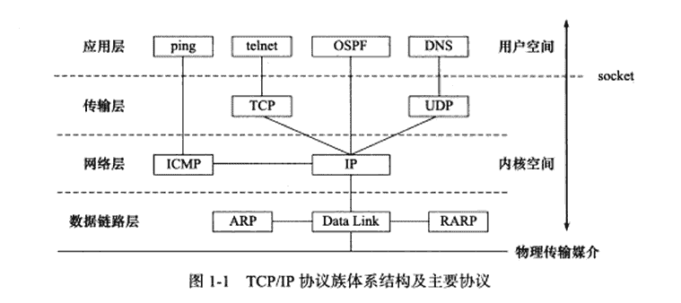
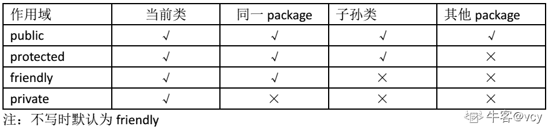

# 美丽联合 2018 校招基础平台-数据仓库开发工程师笔试试卷

## 1

关于排序算法下列说法正确的是

正确答案: A   你的答案: 空 (错误)

```cpp
快速排序在被排序的数据完全无序时最易发挥其长处
```

```cpp
快速排序是稳定的排序算法
```

```cpp
堆排序最好情况和最坏情况下时间复杂度不同
```

```cpp
快速排序所需的辅助空间少于堆排序
```

本题知识点

Java 工程师 C++工程师 蘑菇街 大数据开发工程师 蘑菇街 2018

## 2

下面关于 Linux 文件系统的 inode 描述错误的是

正确答案: A   你的答案: 空 (错误)

```cpp
inode 和文件是一一对应的
```

```cpp
inode 描述了文件大小和指向数据块的指针
```

```cpp
通过 inode 可获得文件占用的块数
```

```cpp
通过 inode 可实现文件的逻辑结构和物理结构的转换
```

本题知识点

Java 工程师 C++工程师 蘑菇街 大数据开发工程师 蘑菇街 2018

## 3

在 TCP/IP 中，ICMP 属于哪一层协议？

正确答案: A   你的答案: 空 (错误)

```cpp
ip
```

```cpp
ppp
```

```cpp
udp
```

```cpp
tcp
```

本题知识点

Java 工程师 C++工程师 蘑菇街 大数据开发工程师 2018

讨论

[洛慕](https://www.nowcoder.com/profile/2266592)



发表于 2018-03-11 12:21:21

* * *

[一左一右](https://www.nowcoder.com/profile/6320484)

ICMP 是网络层的协议，Internet 控制消息协议，题目问的有问题

发表于 2018-03-10 23:09:25

* * *

## 4

0.6332 的数据类型是（）

正确答案: B   你的答案: 空 (错误)

```cpp
float
```

```cpp
double
```

```cpp
Float
```

```cpp
Double
```

本题知识点

Java 工程师 C++工程师 蘑菇街 大数据开发工程师 蘑菇街 2018

## 5

灰度等级为 256 级，分辨率为 1024*1024 的显示器，至少需要的帧缓存容量为（）

正确答案: C   你的答案: 空 (错误)

```cpp
4MB
```

```cpp
2MB
```

```cpp
1MB
```

```cpp
512KB
```

本题知识点

Java 工程师 C++工程师 蘑菇街 大数据开发工程师 蘑菇街 2018

## 6

设在一棵度数为 3 的树中，度数为 3 的结点数有 2 个，度数为 2 的结点数有 1 个，度数为 1 的结点数有 2 个，那么度数为 0 的结点数有( )个。

正确答案: C   你的答案: 空 (错误)

```cpp
4
```

```cpp
5
```

```cpp
6
```

```cpp
7
```

本题知识点

Java 工程师 C++工程师 蘑菇街 大数据开发工程师 蘑菇街 2018

## 7

小明的游戏账号密码是一串 8 位数字，只记前面 5 个数字为 38034.但他肯定，后面 3 个数字全是奇数，最后一个数字是 5，且后 3 个数字中相邻数字不相同，小明至少要试多少次才能保证登入（）

正确答案: C   你的答案: 空 (错误)

```cpp
20
```

```cpp
18
```

```cpp
16
```

```cpp
15
```

本题知识点

Java 工程师 C++工程师 蘑菇街 大数据开发工程师 蘑菇街 2018

## 8

入栈序列是：a1,a3,a5,a2,a4,a6,出栈序列是：a5,a4,a2,a6,a3,a1，则栈的容量最小是（）

正确答案: D   你的答案: 空 (错误)

```cpp
5
```

```cpp
3
```

```cpp
6
```

```cpp
4
```

本题知识点

Java 工程师 C++工程师 蘑菇街 大数据开发工程师 蘑菇街 2018

## 9

500 张骨牌整齐地排成一行,按顺序编号为 1、2、3、......、499、500。第一次拿走所有奇数位置上的骨牌,第二次再从剩余骨牌中拿走奇数位置上 的骨牌,以此类推。请问最后剩下的一张骨牌的编号是? 

正确答案: C   你的答案: 空 (错误)

```cpp
128
```

```cpp
250
```

```cpp
256
```

```cpp
500
```

本题知识点

Java 工程师 C++工程师 蘑菇街 大数据开发工程师 蘑菇街 2018

## 10

Linux 文件权限一共 10 位长度,从前数第 5-7 位表示的内容是() 

正确答案: B   你的答案: 空 (错误)

```cpp
其他用户的权限
```

```cpp
文件所有者所在组的权限
```

```cpp
文件类型
```

```cpp
文件所有者的权限
```

本题知识点

Java 工程师 C++工程师 蘑菇街 大数据开发工程师 蘑菇街 2018

## 11

面向对象程序设计语言的三个基本特征是？（   ）

正确答案: D   你的答案: 空 (错误)

```cpp
封装、接口和多态
```

```cpp
封装、继承和动态
```

```cpp
跨平台、接口和动态
```

```cpp
封装、继承和多态
```

本题知识点

Java 工程师 C++工程师 蘑菇街 大数据开发工程师 2018 C++

讨论

[Chameleons](https://www.nowcoder.com/profile/263615503)

面向对象的三大基本特征，五大基本原则：[`www.cnblogs.com/fzz9/p/8973315.html`](https://www.cnblogs.com/fzz9/p/8973315.html)

三大基本特征：封装、继承、多态。有的也将抽象列为第四个基本特征

五大基本原则：单一职责原则（SRP）、开放封闭原则（OCP）、里氏替换原则（LSP）、依赖倒置原则（DIP）、接口隔离原则（ISP）

编辑于 2020-12-17 16:47:27

* * *

[牛客 608910176 号](https://www.nowcoder.com/profile/608910176)

这也给整错了😮

发表于 2022-03-12 01:01:26

* * *

[牛客小丑 C](https://www.nowcoder.com/profile/410104169)

我菜，动态和多态都看错。。。。。

发表于 2021-04-20 16:08:53

* * *

## 12

指出以下程序运行的结果是

```cpp

	public class Example{

	    String str=new String("good");

	    char[]ch={'a','b','c'};

	    public static void main(String args[]){

	        Example ex=new Example();

	        ex.change(ex.str,[ex.ch](http://ex.ch/));

	        System.out.print(ex.str+" and ");

	        System.out.print(ex.ch);

	    }

	    public void change(String str,char ch[]){

	        str="test ok";

	        ch[0]='g';

	    }

}
```

正确答案: B   你的答案: 空 (错误)

```cpp
good and abc
```

```cpp
good and gbc
```

```cpp
tst ok and abc
```

```cpp
tst ok and gbc
```

本题知识点

Java 工程师 C++工程师 蘑菇街 大数据开发工程师 2018

## 13

以下代码执行后输出结果为:

```cpp

	public class Test

	{

	    public static Test t1 = new Test();

	    {

	         System.out.println("blockA");

	    }

	    static

	    {

	        System.out.println("blockB");

	    }

	    public static void main(String[]
args)

	    {

	        Test t2 = new Test();

	    }

 }
```

正确答案: A   你的答案: 空 (错误)

```cpp
blockAblockBblockA
```

```cpp
blockAblockAblockB
```

```cpp
blockBblockBblockA
```

```cpp
blockBblockAblockB
```

本题知识点

Java 工程师 C++工程师 蘑菇街 大数据开发工程师 2018

## 14

计算机系统中判别是否有中断事件发生应是在（）

正确答案: B   你的答案: 空 (错误)

```cpp
进程切换时
```

```cpp
执行完一条指令后
```

```cpp
执行 P 操作后
```

```cpp
由用户态转入核心态时
```

本题知识点

Java 工程师 C++工程师 蘑菇街 大数据开发工程师 2018

## 15

避免死锁的一个著名的算法是（ ）

正确答案: B   你的答案: 空 (错误)

```cpp
先入先出法
```

```cpp
银行家算法
```

```cpp
优先级算法
```

```cpp
资源按序分配法
```

本题知识点

Java 工程师 C++工程师 蘑菇街 大数据开发工程师 蘑菇街 2018

## 16

某系统中有 3 个并发进程，都需要同类资源 4 个，试问该系统不会发生死锁的最少资源数是：

正确答案: B   你的答案: 空 (错误)

```cpp
9
```

```cpp
10
```

```cpp
11
```

```cpp
12
```

本题知识点

Java 工程师 C++工程师 蘑菇街 大数据开发工程师 2018

## 17

下面有关共享内存，说法不正确的是？

正确答案: D   你的答案: 空 (错误)

```cpp
共享内存和使用信号量一样，属于进程间通信的一种方式。
```

```cpp
使用 shmget 函数来创建共享内存
```

```cpp
尽管每个进程都有自己的内存地址，不同的进程可以同时将同一个内存页面映射到自己的地址空间中，从而达到共享内存的目的
```

```cpp
共享内存提供了同步机制，在第一个进程结束对共享内存的写操作之前，会有自动机制可以阻止第二个进程开始对它进行读取
```

本题知识点

Java 工程师 C++工程师 蘑菇街 大数据开发工程师 蘑菇街 2018

## 18

假设如下代码中，若 t1 线程在 t2 线程启动之前已经完成启动。代码的输出是（）

```cpp

	public static void main(String[]args)throws Exception {

	    final Object obj = new Object();

	    Thread t1 = new Thread() {

	        public void run() {

	            synchronized (obj) {

	                try {

	                    obj.wait();

	                    System.out.println("Thread 1 wake up.");

	                } catch (InterruptedException e) {

	                }

	            }

	        }

	    };

	    t1.start();

	    Thread.sleep(1000);//We assume thread 1 must start up within 1 sec.

	    Thread t2 = new Thread() {

	        public void run() {

	            synchronized (obj) {

	                obj.notifyAll();

	                System.out.println("Thread 2 sent notify.");

	            }

	        }

	    };

	    t2.start();

}
```

正确答案: B   你的答案: 空 (错误)

```cpp
Thread 1 wake up<br>Thread 2 sent notify.
```

```cpp
Thread 2 sent notify.<br>Thread 1 wake up
```

```cpp
A、B 皆有可能
```

```cpp
程序无输出卡死
```

本题知识点

Java 工程师 C++工程师 蘑菇街 大数据开发工程师 2018

## 19

关于 TCP 可靠数据传输服务的论述，正确的是（  ）

正确答案: D   你的答案: 空 (错误)

```cpp
只有当超时事件发生，TCP 才会执行重传
```

```cpp
每次 TCP 重传时，都重新为定时器设置一个固定时间间隔
```

```cpp
TCP 接收方不需要对乱序到达的分组进行确认
```

```cpp
一旦收到 3 个冗余 ACK，TCP 就执行快速重传
```

本题知识点

Java 工程师 C++工程师 蘑菇街 大数据开发工程师 2018

## 20

通过 POP3 协议接收邮件时，使用的传输层服务类型是（）

正确答案: D   你的答案: 空 (错误)

```cpp
无连接不可靠的数据传输服务
```

```cpp
无连接可靠的数据传输服务
```

```cpp
有连接不可靠的数据传输服务
```

```cpp
有链接可靠的数据传输服务
```

本题知识点

Java 工程师 C++工程师 蘑菇街 大数据开发工程师 2018

讨论

[H201911201806756](https://www.nowcoder.com/profile/100987324)

D   POP3 建立在 TCP 连接上,使用的是有连接可靠的数据传输服务

发表于 2019-12-19 11:25:18

* * *

## 21

下列关于闪存（Flash Memory）的叙述中，错误的是（ ）

正确答案: A   你的答案: 空 (错误)

```cpp
信息可读可写，并且读、写速度一样快
```

```cpp
存储元由 MOS 管组成，是一种半导体存储器
```

```cpp
掉电后信息不丢失，是一种非易失性存储器
```

```cpp
采用随机访问方式，可替代计算机外部存储器
```

本题知识点

Java 工程师 C++工程师 蘑菇街 大数据开发工程师 蘑菇街 2018

## 22

下面代码会输出什么（）

```cpp

	int main(int argc, char **argv)

	{

	    int a[4] = {1, 2, 3, 4};

	    int *ptr = (int *)(&a + 1);

	    printf("%d",*(ptr - 1));

}
```

正确答案: D   你的答案: 空 (错误)

```cpp
1
```

```cpp
2
```

```cpp
3
```

```cpp
4
```

本题知识点

Java 工程师 C++工程师 蘑菇街 大数据开发工程师 蘑菇街 2018

## 23

执行如下代码段后，变量 s1 引用的字符串值是(    )

```cpp

	String s1 = "ABCD";

	String s2 = "1234";

System.out.println(s1+ s2); 
```

正确答案: A   你的答案: 空 (错误)

```cpp
ABCD
```

```cpp
1234
```

```cpp
ABCD1234
```

```cpp
1234ABCD
```

本题知识点

Java 工程师 C++工程师 蘑菇街 大数据开发工程师 2018

## 24

以下方法，哪个不是对 add 方法的重载?

```cpp

	public class Test

	{

	    public void add( int x,int y,int z){}

}
```

正确答案: B   你的答案: 空 (错误)

```cpp
public int add(int x,int y,float z){return 0;}
```

```cpp
public int add(int x,int y,int z){return 0;}
```

```cpp
public void add(int x,int y){}
```

```cpp
都不是
```

本题知识点

Java 工程师 C++工程师 蘑菇街 大数据开发工程师 2018

## 25

在 java 类设计中，类的成员变量要求仅仅能够被同一 package 下的类访问，请问应该使用下列哪个修饰词（）

正确答案: D   你的答案: 空 (错误)

```cpp
protected
```

```cpp
public
```

```cpp
private
```

```cpp
不需要任何修饰词
```

本题知识点

Java 工程师 C++工程师 蘑菇街 大数据开发工程师 2018

讨论

[vcy](https://www.nowcoder.com/profile/9774191)

公开程度：public > protected > friendly(默认) > private 在 CSDN 找的图，如下：

发表于 2020-05-19 22:13:37

* * *

## 26

下面有关 forward 和 redirect 的描述,错误的是()      

正确答案: A   你的答案: 空 (错误)

```cpp
redirect 默认将产生 301 Permanently moved 的 HTTP 响应
```

```cpp
执行 forward 时，浏览器不知道服务器发送的内容是从何处来，浏览器地址栏中还是原来的地址
```

```cpp
执行 redirect 时，服务器端告诉浏览器重新去请求地址
```

```cpp
forward 是内部重定向，redirect 是外部重定向
```

本题知识点

Java 工程师 C++工程师 蘑菇街 大数据开发工程师 蘑菇街 2018

## 27

如果您想列出当前目录以及子目录下所有扩展名为“.txt”的文件，那么您可以使用的命令是（）

正确答案: C   你的答案: 空 (错误)

```cpp
ls -d.txt
```

```cpp
ls *.txt
```

```cpp
find -name “*.txt”
```

```cpp
find “.txt”
```

本题知识点

Java 工程师 C++工程师 蘑菇街 大数据开发工程师 2018

## 28

二分查找要求节点 ()

正确答案: A   你的答案: 空 (错误)

```cpp
有序、顺序存储
```

```cpp
有序、链接存储
```

```cpp
无序、顺序存储
```

```cpp
无序、链接存储
```

本题知识点

Java 工程师 C++工程师 蘑菇街 大数据开发工程师 2018

## 29

用直接插入排序方法对下面 4 个序列进行排序(由小到大),元素比较次数最少的是()

正确答案: C   你的答案: 空 (错误)

```cpp
94,32,40,90,80,46,21,69
```

```cpp
32,40,21,46,69,94,90,80
```

```cpp
21,32,46,40,80,69,90,94
```

```cpp
90,69,80,46,21,32,94,40
```

本题知识点

Java 工程师 C++工程师 蘑菇街 大数据开发工程师 蘑菇街 2018

## 30

现有 1G 数据需要排序，计算资源只有 1G 内存可用，下列排序方法中最可能出现性能问题的是 ____。

正确答案: C   你的答案: 空 (错误)

```cpp
堆排序
```

```cpp
插入排序
```

```cpp
归并排序
```

```cpp
冒泡排序
```

本题知识点

Java 工程师 C++工程师 蘑菇街 大数据开发工程师 蘑菇街 2018

## 31

下列选项中，降低进程优先级的合理时机是？

正确答案: B   你的答案: 空 (错误)

```cpp
进程刚完成 I/O，进入就绪列队
```

```cpp
进程的时间片用完
```

```cpp
进程从就绪态转为运行态
```

```cpp
进程长期处于就绪队列中
```

本题知识点

Java 工程师 C++工程师 蘑菇街 大数据开发工程师 蘑菇街 2018

## 32

关于抽象类叙述正确的是？ ( )

正确答案: B   你的答案: 空 (错误)

```cpp
抽象类不能实现接口
```

```cpp
抽象类必须有“abstract class”修饰
```

```cpp
抽象类必须包含抽象方法
```

```cpp
抽象类也有类的特性，可以被实例化
```

本题知识点

Java 工程师 C++工程师 蘑菇街 大数据开发工程师 蘑菇街 2018

## 33

引入二叉线索树的目的是()

正确答案: A   你的答案: 空 (错误)

```cpp
加快查找结点的前驱或后继的速度
```

```cpp
为了能在二叉树中方便地进行插入与删除
```

```cpp
为了能方便地找到双亲
```

```cpp
使二叉树的遍历结果唯一
```

本题知识点

Java 工程师 C++工程师 蘑菇街 大数据开发工程师 蘑菇街 2018

## 34

用邻接表表示图进行广度优先遍历时,通常是采用（）来实现算法的

正确答案: B   你的答案: 空 (错误)

```cpp
栈
```

```cpp
队列
```

```cpp
树
```

```cpp
图
```

本题知识点

Java 工程师 C++工程师 蘑菇街 大数据开发工程师 蘑菇街 2018

## 35

在使用 mkdir 命令创建新的目录时，在其父目录不存在时先创建父目录的选项是

正确答案: D   你的答案: 空 (错误)

```cpp
-m
```

```cpp
-d
```

```cpp
-f
```

```cpp
-p
```

本题知识点

Java 工程师 C++工程师 蘑菇街 大数据开发工程师 蘑菇街 2018

## 36

下面有关内核线程和用户线程说法错误的是？

正确答案: C   你的答案: 空 (错误)

```cpp
用户线程因<br>I/O 而处于等待状态时，整个进程就会被调度程序切换为等待状态，其他线程得不到运行的机会
```

```cpp
内核线程只运行在内核态，不受用户态上下文的影响
```

```cpp
用户线程和内核线程的调度都需要经过内核态
```

```cpp
内核线程有利于发挥多处理器的并发优势，但却占用了更多的系统开支
```

本题知识点

Java 工程师 C++工程师 蘑菇街 大数据开发工程师 蘑菇街 2018

## 37

视图是一个“虚表”，视图的构造基于（    ）

正确答案: C   你的答案: 空 (错误)

```cpp
基本表
```

```cpp
视图
```

```cpp
基本表或视图
```

```cpp
数据字典
```

本题知识点

Java 工程师 C++工程师 蘑菇街 大数据开发工程师 蘑菇街 2018

## 38

大整数 845678992357836701 转化成 16 进位制的表示，最后两位字符是(  )

正确答案: D   你的答案: 空 (错误)

```cpp
8B
```

```cpp
AB
```

```cpp
EF
```

```cpp
9D
```

本题知识点

Java 工程师 C++工程师 蘑菇街 大数据开发工程师 蘑菇街 2018

## 39

Java 中用正则表达式截取字符串中第一个出现的英文左括号之前的字符串。比如：北京市（海淀区）（朝阳区）（西城区），截取结果为：北京市。正则表达式为（）

正确答案: A   你的答案: 空 (错误)

```cpp
&quot;.*?(?=\\()&quot;
```

```cpp
&quot;.*?(?=\()&quot;
```

```cpp
&quot;.*(?=\\()&quot;
```

```cpp
&quot;.*(?=\()&quot;
```

本题知识点

Java 工程师 C++工程师 蘑菇街 大数据开发工程师 蘑菇街 2018

## 40

桌子上有 4 个杯子，每个杯子上写着一句话：第一个杯子：“所有的杯子中都有水果糖”；第二个杯子：“本杯中有苹果”；第三个杯子：“本杯中没有巧克力”；第四个杯子：“有些杯子中没有水果糖”。如果其中只有一句真话，那么以下哪项为真？（ ）

正确答案: D   你的答案: 空 (错误)

```cpp
所有的杯子中都有水果糖
```

```cpp
所有的杯子中都没有水果糖
```

```cpp
所有的杯子中都没有苹果
```

```cpp
第三个杯子中有巧克力
```

本题知识点

Java 工程师 C++工程师 蘑菇街 大数据开发工程师 蘑菇街 2018

## 41

请简要描述数据仓库的基本架构。

你的答案

本题知识点

Java 工程师 C++工程师 蘑菇街 大数据开发工程师 2018

讨论

[哈啰内推 2021](https://www.nowcoder.com/profile/975097568)

数据源-ETL-ods-dwd-dws-报表层、BI

发表于 2019-04-05 20:56:01

* * *

[Lyphard](https://www.nowcoder.com/profile/5368150)

数据源-> 2.ETL -> 3.数据仓库存储与管理-> 4.OLAP -> 5.BI 工具

发表于 2018-09-25 11:17:38

* * *

## 42

今年的第几天？

输入年、月、日，计算该天是本年的第几天。

本题知识点

Java 工程师 C++工程师 蘑菇街 大数据开发工程师 2018