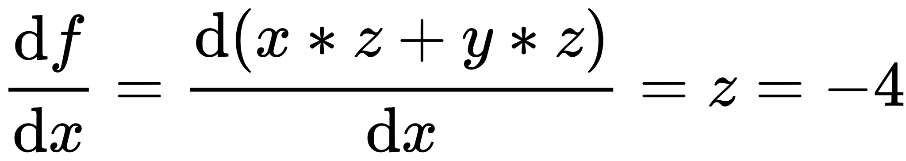
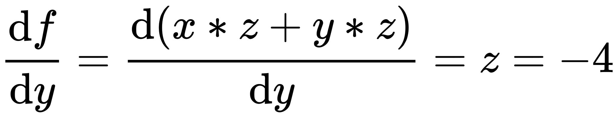
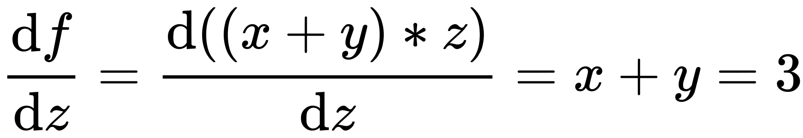
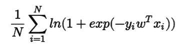
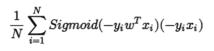
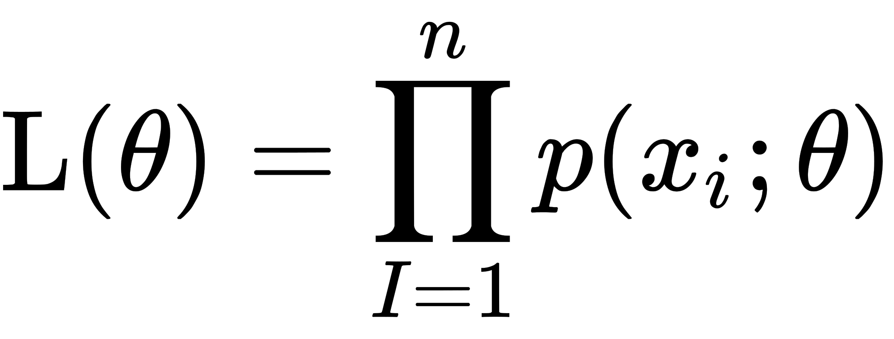
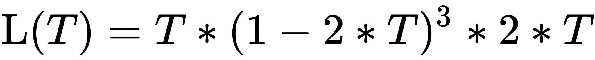
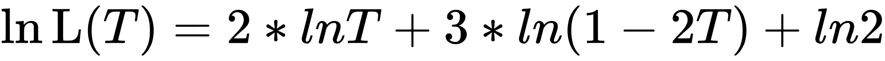
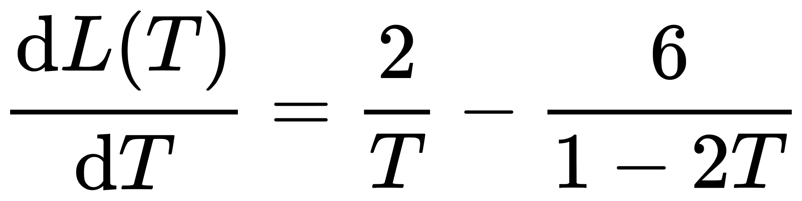
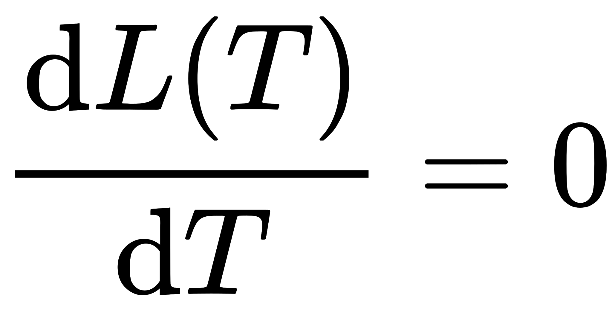

# 美丽联合 2018 校招算法工程师笔试试卷

## 1

使用以下模型解决分类问题时，一般情况下对输入数据是否进行归一化最不敏感的是？

正确答案: D   你的答案: 空 (错误)

```cpp
软间隔 SVM
```

```cpp
Lasso
```

```cpp
深度神经网络
```

```cpp
决策树
```

本题知识点

算法工程师 蘑菇街 2018

讨论

[鹏 123](https://www.nowcoder.com/profile/4329509)

决策树不需要标准化数据

发表于 2018-02-13 13:46:32

* * *

## 2

使用以下模型解决分类问题时，一般情况下对输入数据内的噪音、离群点(outlier)最敏感的是？

正确答案: A   你的答案: 空 (错误)

```cpp
Adaboost
```

```cpp
软间隔 SVM
```

```cpp
Lasso
```

```cpp
随机森林
```

本题知识点

算法工程师 蘑菇街 2018

讨论

[Kyogre_](https://www.nowcoder.com/profile/1932938)

随机森林受异常点影响较小，这是有决策树性质决定的。异常点对 SVM 和 Lasso 都会有一定的影响，但是影响最大的还是 Adaboost，因为 Adaboost 每一轮都会放大异常点数据的权重，最后将导致为异常点产生一个单独的基分类器来拟合数据。

发表于 2018-03-20 22:16:01

* * *

[莫白✘](https://www.nowcoder.com/profile/3477817)

svm 只对支持向量敏感，随机森林取最优解，所以并不影响。lasso 回归好像也可以对噪音可以舍弃。（个人理解，只是说说个人看法，后面的大佬有新看法，勿喷哈）

发表于 2018-03-08 08:38:14

* * *

## 3

对于神经元 q = x + y，f = q * z，当输入 x=-2, y=5, z=-4 时进行后向传播，则 f 对(x, y, z)的梯度分别为

正确答案: C   你的答案: 空 (错误)

```cpp
(-3, 4, 4)
```

```cpp
(-4, 4, 3)
```

```cpp
(-4, -4, 3)
```

```cpp
(3, -4, -4)
```

本题知识点

算法工程师 蘑菇街 2018

讨论

[Mowar](https://www.nowcoder.com/profile/9730423)

**！咋个求导我都忘了................f(x,y,z) = (x + y) *z;
;
;
;

发表于 2018-09-26 16:25:31

* * *

[莫白✘](https://www.nowcoder.com/profile/3477817)

分别以 x，y，z 为变量，求导即可

发表于 2018-03-08 08:39:01

* * *

## 4

请问以下和神经网络中的 dropout 作用机制类似的是？

正确答案: A   你的答案: 空 (错误)

```cpp
Bagging
```

```cpp
Boosting
```

```cpp
Stacking
```

```cpp
都不是
```

本题知识点

算法工程师 蘑菇街 2018

讨论

[1,3-丙二醇](https://www.nowcoder.com/profile/948910126)

```cpp
dropout 是用来防止过拟合的, 也就是降低 variance. Bagging 的作用类似, 不管是回归(求平均)还是分类(投票)
```

发表于 2018-09-27 08:49:36

* * *

[莫白✘](https://www.nowcoder.com/profile/3477817)

dropout 是的神经网络随机变化，是随机变化网络内部结构。bagging，是随机抽取样本。这题我选的 d。选错了…

发表于 2018-03-08 08:42:15

* * *

## 5

请问以下能为神经网络引入了非线性能力的是？

正确答案: B   你的答案: 空 (错误)

```cpp
随机梯度下降
```

```cpp
ReLU
```

```cpp
卷积
```

```cpp
以上都不是
```

本题知识点

算法工程师 蘑菇街 2018

讨论

[小牛励志要当牛魔王](https://www.nowcoder.com/profile/7462798)

B

发表于 2018-08-20 15:12:12

* * *

## 6

假设以交叉熵为损失函数，则以下为其梯度的是?

正确答案: A   你的答案: 空 (错误)

```cpp
 
```

本题知识点

算法工程师 蘑菇街 2018

讨论

[鹏 123](https://www.nowcoder.com/profile/4329509)

这道题我对了，我来说说我的解题思路：首先看到这几个网址，反应过来应该是图片地址，复制图片地址打开发现为空，由于从 A 开始，所以就选了 A，然后下一题，答案 A

发表于 2018-04-04 14:31:13

* * *

[何恺明的小迷妹](https://www.nowcoder.com/profile/186866)

图片全部挂掉了额，，

发表于 2018-03-09 16:51:21

* * *

## 7

已知二叉树的先序遍历序列为 ABCDEFI，中序遍历序列为 CBDAEFI，则该二叉树的高度为?（树的根结点高度为 1）

正确答案: C   你的答案: 空 (错误)

```cpp
2
```

```cpp
3
```

```cpp
4
```

```cpp
5
```

本题知识点

算法工程师 蘑菇街 2018

讨论

[c++爱上 java](https://www.nowcoder.com/profile/9128621)

根据朱战立 的第四版 数据结  查看全部)

编辑于 2018-05-08 15:28:10

* * *

[一吻以谢天下](https://www.nowcoder.com/profile/245743)

通过给定的先序和中序构建二叉树即可：-- NORMAL --      A    B     E C   D     F                 I 再就是注意，这里说的是树的高度，也就是从根到叶子节点的最长的一条路径上边的条数。所以是 3。答案没错，还有不明白的去百度一下树的深度和树的高度的区别即可。

发表于 2018-03-02 21:36:49

* * *

[GrantLeung](https://www.nowcoder.com/profile/3718918)

       A   B     EC   D     F                I 高度应该为 4 吧？

发表于 2018-02-22 16:27:49

* * *

## 8

在 K 近邻(KNN)模型中，超参数 K 的选择对模型的表现有较大的影响。一般而言，对比 1 近邻模型和 3 近邻模型，以下说法正确的是？

正确答案: A D   你的答案: 空 (错误)

```cpp
1 近邻模型更容易过拟合
```

```cpp
1 近邻模型的 Bias 和 Variance 都更大
```

```cpp
1 近邻模型的 Bias 更大，Variance 更小
```

```cpp
1 近邻模型的 Bias 更小，Variance 更大
```

本题知识点

算法工程师 蘑菇街 2018

讨论

[Spongebobmay](https://www.nowcoder.com/profile/7009754)

k 指周围 k 个样本的类别是什么则该样本就属于那个类别，当 k 为 1 时，模型会将噪声也学进来，就是把细枝末节的特征也学进行，造成过拟合。当 k 过大时，意味着离待分类样本点较远的点也会被包含进来对其判别产生影响，此时就会欠拟合

发表于 2018-03-10 17:00:35

* * *

[来个大厂 Offer 呗](https://www.nowcoder.com/profile/6091386)

偏差个人理解是模型对训练集的拟合程度，方差是数据扰动对模型的影响

发表于 2018-03-21 13:03:45

* * *

[菜狗求上岸](https://www.nowcoder.com/profile/2748284)

偏差指的是模型输出值与真实值之间的差异。偏差越高越容易欠拟合，不能充分利用数据的有效信息。 方差指对数据微小改变的敏感程度，方差越高，越容易过拟合，对噪声越敏感。 k 取 1，容易受到噪声影响，方差较大，容易过拟合。

发表于 2018-05-16 16:03:23

* * *

## 9

假设我们有所有用户在一个月内的商品点击和购买行为的数据，我们想利用该数据基于有监督学习方法预测特定用户点击商品后产生购买行为的概率，即将购买率预估问题看做是一个二分类问题。假设用户的购买行为十分稀疏，即购买量远小于点击量。则以下说法正确的是?

正确答案: A   你的答案: 空 (错误)

```cpp
这是一个正负类极度不平衡的数据集，因此 AUC 比较适合用于评估模型的效果
```

```cpp
如果我们将模型在所有样本上的预估值都乘以 2，则该模型模型的 AUC 有可能会下降(假设模型在所有样本上的预估值都小于 0.5)
```

```cpp
如果我们将模型在所有样本上的预估值都减去 0.01，则该模型模型的 AUC 有可能会下降(假设模型在所有样本上的预估值都大于 0.01)
```

```cpp
我们可以将数据随机切分成 10 份，选择其中 9 份作为训练集，1 份作为测试集，如此实现 10 重交叉检验可以较好地对模型的效果进行评估
```

本题知识点

算法工程师 蘑菇街 2018

讨论

[今年要做现充](https://www.nowcoder.com/profile/1412064)

A:
AUC 对样本类别是否均衡并不敏感，这也是不均衡样本通常用 AUC 评价分类器性能的一个原因
B,C:
AUC 值等于随机选择的正样本值高于随机选择的反面例子的概率。这两个操作并不会让 AUC 下降
D:
类别不平衡问题，不能随机切分，不然测试集一个正样本都没有怎么评估（个人理解）

发表于 2018-04-04 10:21:10

* * *

[萧雲](https://www.nowcoder.com/profile/9733721)

我也不知道，但 A 更好点，还挺 A

发表于 2018-03-22 21:09:12

* * *

[Mowar](https://www.nowcoder.com/profile/9730423)

感觉等比抽样好些...........数据本身就是天然分布不均衡的

发表于 2018-09-26 16:43:27

* * *

## 10

关于集成学习以下说法正确的是？

正确答案: C D   你的答案: 空 (错误)

```cpp
Adaboost 相对于单个弱分类器而言通过 Boosting 增大了模型的 Bias
```

```cpp
随机森林相对于单个决策树而言通过 Bagging 增大了模型的 Variance
```

```cpp
我们可以借鉴类似 Bagging 的思想对 GBDT 模型进行一定的改进，例如每个分裂节点只考虑某个随机的特征子集或者每棵树只考虑某个随机的样本子集这两个方案都是可行的
```

```cpp
GBDT 模型无法在树维度通过并行提速，因为基于残差的训练方式导致第 i 棵树的训练依赖于前 i-1 棵树的结果，故树与树之间只能串行
```

本题知识点

算法工程师 蘑菇街 2018

讨论

[Mowar](https://www.nowcoder.com/profile/9730423)

Adaboost 降低了偏差，增大了方差。Bagging  降低了方差,增大了偏差.c 选项类似于 Bagging 于 boosting 的综合体

发表于 2018-09-26 16:46:38

* * *

[billzhan](https://www.nowcoder.com/profile/2117888)

Bagging 会降低 variance

发表于 2018-04-04 06:04:06

* * *

## 11

如下数据集中，适合使用隐马尔科夫模型(HMM)建模的有?

正确答案: A C D   你的答案: 空 (错误)

```cpp
基因序列集合
```

```cpp
电影影评数据集合
```

```cpp
股票市场数据集合
```

```cpp
北京气温数据集合
```

本题知识点

算法工程师 蘑菇街 2018

讨论

[鼠标点点点点](https://www.nowcoder.com/profile/3583470)

隐马科夫链是一种状态转移链，因此前后会有相关关系，比如气温、股票、基因等等，前者的信息对后者会有作用，但是电影的影评是不存在这层关系的，所以不存在事件的关联性，无法使用

发表于 2018-06-15 17:38:42

* * *

## 12

下列几个范数项可以为模型带来稀疏性的有：

正确答案: A C   你的答案: 空 (错误)

```cpp
向量内非零元素之和
```

```cpp
向量内非零元素之和的平方
```

```cpp
向量内所有元素之和
```

```cpp
向量内所有元素之和的平方
```

本题知识点

算法工程师 蘑菇街 2018

讨论

[何恺明的小迷妹](https://www.nowcoder.com/profile/186866)

这题目不严谨。。。L0 范数的 就是 向量内非零元素的**个数**之和 L1 范数的 就是 向量内非零元素的**绝对值**之和 个人见解，欢迎大佬指正

发表于 2018-03-09 16:58:36

* * *

[鸡排饭加两个蛋](https://www.nowcoder.com/profile/1682002)

有问题，所有元素绝对值之和，不然怎么 push 到 0 啊

发表于 2018-03-20 19:22:11

* * *

[aaaaaaaaaaaaa1aaa](https://www.nowcoder.com/profile/5123325)

L0 范数和 L1 范数 可以实现稀疏

发表于 2018-03-05 12:57:56

* * *

## 13

在深度神经网络的训练过程中发现损失函数值的变化非常缓慢，以下方案中很可能有助于解决该问题的是？

正确答案: C D   你的答案: 空 (错误)

```cpp
调小 learning rate
```

```cpp
调大 batch<br>size
```

```cpp
使用 ReLU
```

```cpp
使用 batch normaliztion
```

本题知识点

算法工程师 蘑菇街 2018

讨论

[a36a55ad0r](https://www.nowcoder.com/profile/6767301)

loss 不变，判断为梯度消失情况，改用 relu 激活，或者添加 batchnormal

发表于 2018-03-04 22:27:51

* * *

[Mowar](https://www.nowcoder.com/profile/9730423)

 倘若上文描述的情况发生在收敛的时候,怎么破?

发表于 2018-09-26 16:54:05

* * *

## 14

以下关于排序算法的说法中错误的是？

正确答案: A   你的答案: 空 (错误)

```cpp
快速排序的最坏时间复杂度为 O(nlog(n))
```

```cpp
快速排序不是一种稳定的排序
```

```cpp
堆排序的最坏时间复杂度为 O(nlog(n))
```

```cpp
堆排序不是一种稳定的排序
```

本题知识点

算法工程师 蘑菇街 2018

讨论

[Mowar](https://www.nowcoder.com/profile/9730423)

| 算法 |  平均时间复杂度 | 最坏情况 | 是否稳定 | 空间复杂度 |
| 堆排序    | O(nlog(n)) | O(nlog(n)) |  不稳定 | O(1) |
| 快排 | O(nlog(n)) | O(n²) | 不稳定 | O(log(n)) ~O(n) |
| 希尔排序 | O(nlog(n)) | O(nlog(n)) | 不稳定 | O(1) |
| 选择排序 | O(n²) | O(n²) |  不稳定 | O(1) |

发表于 2018-09-26 17:05:09

* * *

[破格录取](https://www.nowcoder.com/profile/116346713)

不稳定： 
快排 O(nlogn)O(nlogn) 平均时间， 最坏情况 O(n2)O(n2) 
堆排序 O(nlogn)O(nlogn) 
选择排序 O(n2)O(n2) 
希尔排序 O(nlogn)O(nlogn)

稳定： 
冒泡排序 O(n2)O(n2) 
插入排序 O(n2)O(n2) 
归并排序 O(nlogn)O(nlogn) 
桶排序 O(n)O(n) 额外空间复杂度 O(n)

发表于 2018-09-10 18:19:07

* * *

[小了仔](https://www.nowcoder.com/profile/5066518)

选成正确的了……

发表于 2018-03-22 17:50:42

* * *

## 15

请实现 str2int 函数，不限语言，但请不要用使用语言自带的类型转换。例如对于输入"123"，输出应为 123

你的答案

本题知识点

算法工程师 蘑菇街 2018

讨论

[何恺明的小迷妹](https://www.nowcoder.com/profile/186866)

//这种题目怕的就是溢出，搞个 long long 保险 long long str2int(string str) {    long long result = 0;
    int flag = 1;
    for (int i = 0; i<str.size(); i++) {
        if (str[i] == '-') {
            flag = -1;
            continue;
        }
        if (str[i] == '+') {
            continue;
        }
        result *= 10;
        result += (str[i]-'0');
    }
    return result*flag;

}

发表于 2018-03-09 19:46:22

* * *

[一吻以谢天下](https://www.nowcoder.com/profile/245743)

int str2int(char str[]){
  int res = 0;
  for (char *p = str; *p; p++)
  {
    if(*p >= '0' && *p <= '9')
    {
      res = (res<<1) + (res<<3) + *p - '0';
    }
  }
  return res;
}-- NORMAL --

发表于 2018-03-02 17:02:19

* * *

[鼠标点点点点](https://www.nowcoder.com/profile/3583470)

```cpp
import sys
data = sys.stdin.readline().strip().split()[0]

data_length = len(data)
result = 0
str_data = ['0','1','2','3','4','5','6','7','8','9']
for i data:
    num = str_data.index(i) - 1
    result  = result + num * (10 ** data_length)
    data_length -= 1
print(result)

```

发表于 2018-06-15 17:29:54

* * *

## 16

假设有 A、B 两枚硬币，A 硬币正面朝上的概率为 T，B 硬币正面朝上的概率为 2T，按一定顺序抛了这两枚硬币之后，收集到如下样本：1) A 硬币，正面 2) B 硬币，反面 3) B 硬币，反面 4) B 硬币，反面 5) B 硬币，正面。

    a) 请写出上述样本关于 T 的 log 似然函数

    b) 请给出对 T 的极大似然估计

你的答案

本题知识点

算法工程师 蘑菇街 2018

讨论

[Mowar](https://www.nowcoder.com/profile/9730423)

。。。。。。。由忘了咋个求似然函数，只好把书翻由于是离散型总体,所以:




令,解的 T=0.2

编辑于 2018-09-26 18:04:36

* * *

[Depapepe](https://www.nowcoder.com/profile/9806305)

lnL(T) = lnT + ln2T + 3ln(1-2T)1/T + 1/T - 6/(1-2T) = 0T = 0.2

发表于 2018-05-16 23:28:52

* * *

[诚实的小小乐](https://www.nowcoder.com/profile/1010634)

似然函数 3*ln(T)+3*ln(1-2T)+ln(2)T =0.25

编辑于 2018-04-27 16:42:35

* * *

## 17

假设有一份数据量较大的数据，假设总共 1 亿行，现在要根据它的某个字段 a 进行全局降序排序，如果使用 Map-Reduce 来实现，程序大致应该怎么设计？要求：只要写出伪代码即可，注意避免控制数据多次分发和并行效率

你的答案

本题知识点

算法工程师 蘑菇街 2018

## 18

假设使用结构为(parent varchar(6), child varchar(6))的表来存储一颗树内所有子节点-父节点的关系。请使用 SQL 统计出该树内每个节点的儿子节点和孙子节点（即儿子的儿子）的数量之和。没有儿子且没有孙子的节点不应该出现在结果中。

样例输入

parent, child

A B

A C

A D

B E

B F

E G

样例输出

node, cnt

A 5

B 3

你的答案

本题知识点

算法工程师 蘑菇街 2018

讨论

[信大呆](https://www.nowcoder.com/profile/5924424)

use test;create table test1(parent char, child char);insert into test1 values ('A', 'B');insert into test1 values ('A', 'C');insert into test1 values ('A', 'D');insert into test1 values ('B', 'E');insert into test1 values ('B', 'F');insert into test1 values ('E', 'G');
select son.parent, sum(son.cnt+grandson.cnt) cnt from (select parent, count(*) cnt from test1 group by parent) son, (    select t1.parent, count(*) cnt from test1 as t1, test1 as t2     where t1.child=t2.parent group by t1.parent) grandson where son.parent = grandson.parent group by son.parent;

发表于 2018-05-13 13:26:46

* * *

[编程的渣渣啊啊啊](https://www.nowcoder.com/profile/8501721)

select parent node,count(*) cnt from t as t_son;select t1.parent node,count(*) cnt from t as t1, t as t2 where t1.child = t2.parent as t_grandsonselect t_son.node,sum(t_son.cnt+t_grandson.cnt) cnt  from t_son,t_grandson where t_son.node = t_grandson.node

发表于 2018-04-05 10:30:55

* * *