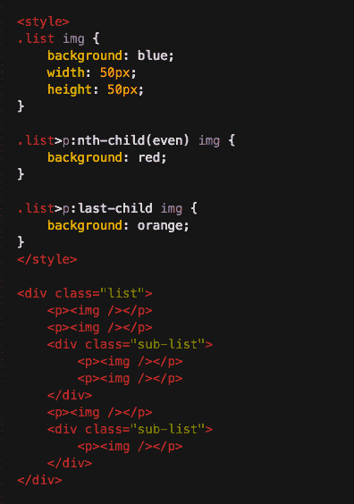
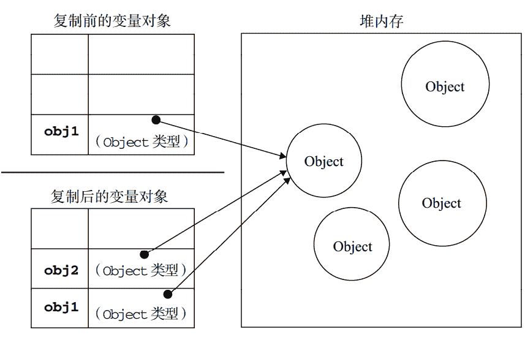

# 美丽联合 2018 校招前端开发工程师笔试试卷

## 1

以下选项，全部属于块级元素的一项是？ (  )

正确答案: B   你的答案: 空 (错误)

```cpp
li / p / img / blockquote
```

```cpp
div / pre / h1 / form
```

```cpp
form / strong / span / ul
```

```cpp
fieldset / section / canvas / a
```

本题知识点

前端工程师 蘑菇街 前端工程师 蘑菇街 2018

讨论

[orange-x](https://www.nowcoder.com/profile/4051282)

```cpp
块级元素:

	特点：

	 1.每个块级元素都是独自占一行，其后的元素也只能另起一行，并不能两个元素共用一行。

	 2.元素的高度、宽度、行高和顶底边距都是可以设置的。 

	  3.元素的宽度如果不设置的话，默认为父元素的宽度。

常见的块级元素：
h1~h6,hr
div,dir(目录列表),dl(定义列表)
table,ul.ol,li,form,fieldset(from 控制组)
p,pre
address,blockquote,center
menu(菜单列表)
noframes(对于不支持 frame 的浏览器显示此区块内容)
noscript(对于不支持 script 的浏览器显示此内容)
```

发表于 2018-02-26 19:14:58

* * *

[李闪](https://www.nowcoder.com/profile/6299354)

块级元素：li，p，blockquote，div，pre，h1~h6，form，ul，ol，fieldset，section

发表于 2018-02-12 14:46:21

* * *

## 2

下列 js 可以让一个 input 的背景颜色变成红色的是？

正确答案: A   你的答案: 空 (错误)

```cpp
inputElement.style.backgroundColor = 'red'；
```

```cpp
inputElement.backgroundColor = 'red';
```

```cpp
inputElement.style.backgroundColor = '#0000';
```

```cpp
inputElement.backgroundColor = '#0000';
```

本题知识点

前端工程师 蘑菇街 前端工程师 蘑菇街 2018

讨论

[米兰的小皮匠](https://www.nowcoder.com/profile/8547295)

A 的分号是中文的  运行不报错吗？

发表于 2018-02-25 12:13:44

* * *

[censek](https://www.nowcoder.com/profile/8089923)

红色:#F00;黑色:#000。 style--修改样式。

编辑于 2018-03-06 16:22:01

* * *

## 3

下面 CSS3 新增伪类中不正确的一个是？

正确答案: B   你的答案: 空 (错误)

```cpp
p:first-of-type
```

```cpp
p:only-of-child
```

```cpp
p:nth-child(2)
```

```cpp
:disabled
```

本题知识点

前端工程师 蘑菇街 前端工程师 蘑菇街 2018

讨论

[censek](https://www.nowcoder.com/profile/8089923)

B.:only-child CSS3 新增伪类如下:① p:last-of-type   选择其父元素的最后的一个 P 元素; ② p:last-child   选择其父元素的最后子元素(一定是 P 才行); ③ p:first-of-type   选择其父元素的首个 P 元素; ④ p:first-child 选择其父元素的首个子元素(一定是 p 才行); ⑤ p:only-child 选择其父元素的只有一个元素(而且这个元素只能是 p 元素，不能有其他元素); ⑥ p:only-of-type 选择其父元素的只有一个 p 元素(不能有第二个 P 元素，其他元素可以有); ⑦ p:nth-child(n)   选择其父元素的第 N 个 刚好是 p 的元素; ⑧ p:nth-last-child(n)   从最后一个子元素开始计数; ⑨ p:nth-of-type(n) 选择其父元素的 n 个元素; ⑩ p:nth-last-of-type(n)   从最后一个子元素开始计数

编辑于 2018-02-28 16:22:55

* * *

[g 给不二](https://www.nowcoder.com/profile/3088243)

p:last-of-type         选择其父元素的最后的一个 P 元素

p:last-child            选择其父元素的最后子元素(一定是 P 才行)

p:first-of-type        选择其父元素的首个 P 元素

p:first-child           选择其父元素的首个 p 元素(一定是 p 才行)

p:only-child　　　　选择其父元素的只有一个元素(而且这个元素只能是 p 元素，不能有其他元素)

p:only-of-type　　　选择其父元素的只有一个 p 元素(不能有第二个 P 元素，其他元素可以有)

**选第 N 个**

p:nth-child(n)    　　选择其父元素的第 N 个 刚好是 p 的元素

p:nth-last-child(n)    ..............................................从最后一个子元素开始计数

p:nth-of-type(n)　  选择其父元素的 n 个元素

p:nth-last-of-type(n)   ........................从最后一个子元素开始计数

**用在 input 上**

:enabled

发表于 2018-03-12 14:11:33

* * *

[治电小白菜](https://www.nowcoder.com/profile/683580)

:only-child 

发表于 2018-02-13 10:17:39

* * *

## 4

下面代码的运行结果是

正确答案: C   你的答案: 空 (错误)

```cpp
1,2,3
```

```cpp
1,1,1
```

```cpp
4,4,4
```

```cpp
3,3,3
```

本题知识点

前端工程师 蘑菇街 2018

讨论

[笨鸟先飞 _ljy](https://www.nowcoder.com/profile/933779)

这道题答案错了，我运行了一遍，应该选 c

发表于 2018-02-14 21:04:02

* * *

[logeast](https://www.nowcoder.com/profile/8276701)

答案选 C。先说说代码运行的结果 4 的来源，这个循环的运行结果是 i 不再小于 4，条件首次成立时 i=4，因此输出结果为循环结束时 i 的最终值。再说说为什么会输出三个 4，延迟函数的回调会在循环条件结束时再执行，即使定时器执行的是 setTimeout(..., 0)，因此会每次输出一个 4 来。追究问题的本质原因，尽管循环中的三个函数是在各个迭代中独立定义的，但他们都被封闭在一个共享作用域中，故而实际上只有一个 i。ES6 中的 let 声明会劫持块级作用域，for 循环的 let 声明会在每次迭代时进行变量声明，随后每个迭代都会用上一次循环结束的值来初始化 i，这样迭代的结果就是 1，2，3 了。

```cpp
for(let i=1; i<4; i++) {
  setTimeout(()=>console.log(i), 0);
}
//1 2 3
```

发表于 2018-03-07 13:47:24

* * *

[只如初见 0706](https://www.nowcoder.com/profile/3786964)

如果使用 let 定义 i，结果为 1,2,3
如果使用 var 定义 i，结果为 4,4,4，

编辑于 2018-03-07 11:00:21

* * *

## 5

"abcdefg".substring(____)的结果是”c" 

正确答案: C   你的答案: 空 (错误)

```cpp
3, 4
```

```cpp
2, 4
```

```cpp
2, 3
```

```cpp
1, 2
```

本题知识点

前端工程师 蘑菇街 2018

讨论

[笨鸟先飞 _ljy](https://www.nowcoder.com/profile/933779)

这道题答案错了，我自己运行了一遍 应该选 c

发表于 2018-02-14 21:03:41

* * *

[治电小白菜](https://www.nowcoder.com/profile/683580)


发表于 2018-02-13 10:18:44

* * *

[Joy201802181149199](https://www.nowcoder.com/profile/3583582)

substring(start,end)用于截取指定下标的字符串，包括开始下标但不包括结束下标

发表于 2018-02-18 19:12:55

* * *

## 6

以下可以设置表单元素为必填项的是

正确答案: B   你的答案: 空 (错误)

```cpp
request
```

```cpp
required
```

```cpp
require
```

```cpp
not null
```

本题知识点

前端工程师 蘑菇街 2018 HTML

讨论

[censek](https://www.nowcoder.com/profile/8089923)


发表于 2018-02-28 16:32:55

* * *

[getElementById](https://www.nowcoder.com/profile/7594403)

表单提交中必填字段可添加属性 required

发表于 2018-02-25 19:49:17

* * *

[游子鹤](https://www.nowcoder.com/profile/372740939)

表单元素的值是被填的，所以被需要 被动 required

发表于 2021-10-18 20:35:24

* * *

## 7

网页中颜色 rgb(255,0,0)转换为 16 进制写法正确的是

正确答案: B   你的答案: 空 (错误)

```cpp
#FFFF00
```

```cpp
#F00
```

```cpp
#500
```

```cpp
#F0F0F0
```

本题知识点

前端工程师 蘑菇街 2018

讨论

[DLL25](https://www.nowcoder.com/profile/2871268)

进制转化，#FF0000 等效与#F00

发表于 2018-02-21 23:33:18

* * *

[迷途人](https://www.nowcoder.com/profile/3581298)

别粗心了,红色的十六进制应该是 FF0000,看到 FF 开头就选了

发表于 2018-03-07 18:12:47

* * *

## 8

请填入数字，使得输出结果为 1234567 

正确答案: D   你的答案: 空 (错误)

```cpp
1526374
```

```cpp
1327465
```

```cpp
1237456
```

```cpp
1527364
```

本题知识点

前端工程师 蘑菇街 前端工程师 蘑菇街 2018

讨论

[ChangeHow](https://www.nowcoder.com/profile/9776308)

emmmm，这题看错了，没看到第二个定时器函数是有时间的，这里的考点是定时器函数间隔设置为 0 时是表示语句结束之后立即执行该定时器函数，这里的执行顺序是由上至下的，也就是，不带定时器的 console 执行之后立马依次执行间隔设置为 0 的定时函数，然后再是 300ms 间隔的定时器函数

发表于 2018-02-17 03:12:14

* * *

[Joy201802181149199](https://www.nowcoder.com/profile/3583582)

定时器函数设置时间间隔为 0 时表示顺序执行完所有函数后立即执行比函数

发表于 2018-02-18 19:19:28

* * *

[白日梦先生。](https://www.nowcoder.com/profile/138812)

由于 setTimeout()会将回调函数加入事件处理队列，等待没有使用 setTimeout()的执行完毕之后才调用，所以这道题的关键是看四个没有使用 setTimeout()的 console.log()语句的位置，所以选 D

发表于 2018-03-06 08:13:04

* * *

## 9

向当前#list 的最后元素之后添加 100 个新的 li 节点，合理的操作方式是？

正确答案: D   你的答案: 空 (错误)

```cpp
通过循环方式创建新的 li 节点，并依次添加到#list 中
```

```cpp
先将#list 节点的 display 设置为 none，通过循环方式创建新的 li 节点，并依次添加到#list 中，最后再将#list 节点的 display 设置为 block
```

```cpp
取出#list 中现有的 li 节点的 html，将它与新增的 li 节点对应的 html 代码拼接成字符串，一次性插入到#list 中
```

```cpp
创建 Fragment，通过循环方式创建新的 li 节点，添加到 Fragment 中，最后再将 Fragment 添加到#list 中
```

本题知识点

前端工程师 蘑菇街 前端工程师 蘑菇街 2018

讨论

[logeast](https://www.nowcoder.com/profile/8276701)

createDocumentFragment 方***创建一个文档片段，它的变化不会引起 DOM 树的重新渲染，从而不会导致性能问题。最后将创建的文档片段添加到 DOM 树中即可仅发生一次渲染就实现目标，下面是一个简单的方法。

```cpp
  var app = document.getElementById("app");
  var fragment = document.createDocumentFragment();

  for(var i=0; i<100; i++) {
    let li = document.createElement("li");
    fragment.appendChild(li);
    li.innerHTML = i;
  }
  app.appendChild(fragment);

```

编辑于 2018-03-09 16:50:57

* * *

[二面全挂的大猫](https://www.nowcoder.com/profile/505665)

我觉得 C 选项的性能和 D 差不多

发表于 2018-02-14 09:48:06

* * *

## 10

以下的代码，从上到下 img 标签的背景色依次是 

正确答案: C   你的答案: 空 (错误)

```cpp
blue / red / blue / red / blue / orange
```

```cpp
blue / red / blue / red / blue / blue
```

```cpp
blue / red / blue / blue / red / blue
```

```cpp
red / blue / blue / blue / blue / red
```

本题知识点

前端工程师 蘑菇街 前端工程师 蘑菇街 2018

讨论

[dttttt](https://www.nowcoder.com/profile/2309060)

```cpp
p:nth-child(even) {}
```

选择其父元素下偶数位的子元素（不论类别），且子元素为 p 元素。:nth-child()的参数从 1 开始。

```cpp
p:last-child {}
```

选择其父元素最后一个子元素，且该子元素为 p 元素。如果最后一个子元素不为 p，则该选择器不生效。
1、第一个 p 标签下的 img，blue2、第二个 p 标签，为父元素.list 下的第二个子元素，red3、第三第四个 p 标签，位于父元素.list 下的 div 中。所以上面两个伪类选择器不生效，blue4、第五个 p 标签，该标签位于父元素.list 下的第四个，:nth-child 选择器生效，red。这里要注意，.list>p:last-child 并不是选择父元素.list 中最后一个 p 元素，而是如果.list 最后一个子元素为 p 元素的话，就选择它，否则不选择。5、第六个 p 标签，同第三点，blue

编辑于 2018-02-23 16:19:56

* * *

[wfz](https://www.nowcoder.com/profile/449584)

css 后代选择器：>，只是选择元素的子元素，也就是儿子。而不是后代元素，即不包括孙子，曾孙子等。

发表于 2018-02-28 21:14:07

* * *

[getElementById](https://www.nowcoder.com/profile/7594403)

list 下面的 p 元素只有 1,2,4 符合，下面共有 5 个元素，所以 orange 颜色不会出现，排除 a,：nth-of-type(even)表示偶数行符合条件，所以 2 和 4 为红色。其余则为蓝色

编辑于 2018-02-25 19:55:46

* * *

## 11

以下说法中错误的是

正确答案: A B D   你的答案: 空 (错误)

```cpp
当元素的 position 属性设置为 relative 时，设置的 top、right、bottom、left 偏移值是相对于其父元素的。
```

```cpp
当元素的 position 属性设置为 absolute 时，设置的 top、right、bottom、left 偏移值是相对于其父元素的。
```

```cpp
网页中，rem 作为元素尺寸单位时，是相对 文档根节点的 font-size 进行计算的。
```

```cpp
在 Microsoft Internet Explorer 中，盒模型默认使用的是 border-box。
```

本题知识点

前端工程师 蘑菇街 2018 CSS

讨论

[前端超级兵](https://www.nowcoder.com/profile/1694036)

1.absolute:生成绝对定位的元素，相对的是最近一级定位不是 static 的元素进行定位，而元素的默认定位就是 static。2.relative 生成相对定位的元素，相对于其本身在文档流中的定位来进行定位。3.rem 相对的是根元素的 font-size 来设置大小的；根据父元素的 font-size 来设置大小的是 em。4.只有在缺少 DOCTYPE（文档类型声明）时，在 IE6~IE8 中会触发怪异模式（quirks）

发表于 2018-03-12 20:56:10

* * *

[是函数不是方法](https://www.nowcoder.com/profile/7255829)

A.相对自己原来位置 B.必须是离他最近且有定位的父元素 D.通常说的“IE 盒子模型”指的是 IE5.5，IE6 及其以后，盒模型都为 content-box；当浏览器未设置<!doctype>声明时，盒模型都为 border-box

发表于 2018-07-03 16:08:49

* * *

[getElementById](https://www.nowcoder.com/profile/7594403)

position：absolute;不一定是相对于父元素，可能是只有子绝父相的情况下才符合。

发表于 2018-02-25 19:57:09

* * *

## 12

下列不等于 true 是

正确答案: A B C   你的答案: 空 (错误)

```cpp
undefined === null
```

```cpp
var i = 2; ++i == 2
```

```cpp
1 === '1'
```

```cpp
&quot;&quot; == 0
```

本题知识点

前端工程师 蘑菇街 2018

讨论

[IT_bird](https://www.nowcoder.com/profile/311673)

```cpp
&quot;在 js 文件这么写会报错...
```

发表于 2018-03-16 01:25:19

* * *

[Joy201802181149199](https://www.nowcoder.com/profile/3583582)

"代表" ""==0 为 true

发表于 2018-02-18 19:39:46

* * *

[Delucia](https://www.nowcoder.com/profile/6195114)

B 是因为++的优先级高于==

发表于 2018-02-28 14:55:54

* * *

## 13

以下能用来设置网页数值的单位的是

正确答案: A B D   你的答案: 空 (错误)

```cpp
%
```

```cpp
px
```

```cpp
vm
```

```cpp
rem
```

本题知识点

前端工程师 蘑菇街 2018 CSS

讨论

[Joy201802181149199](https://www.nowcoder.com/profile/3583582)

vm 未被纳入 w3c 标准，仅浏览器中 ie9 支持，为长度单位，表示相对于视口的宽度或高度中较小的那个。其中最小的那个被均分为 100 单位的 vm

发表于 2018-02-18 19:47:36

* * *

[努力就是了](https://www.nowcoder.com/profile/4007577)

在 CSS 规范中，有 4 种类型的可用视口单位： vw --- 1vw 等于视口宽度的 1% vh --- 1vh 等于视口高度的 1% vmin --- vw 和 vh 中的较小值 vmax --- vw 和 vh 中的较大值 视口，即浏览器屏幕大小，1vw 等于浏览器宽度的 1%，100vw 即整个浏览器的宽度。

发表于 2018-03-08 08:37:07

* * *

[闫坤来咯](https://www.nowcoder.com/profile/248625027)

**1.rem**

```cpp
rem 是相对于**根元素**的字体大小的单位  rem 能等比例适配所有的屏幕，根据 html 的字体的大小来控制 rem 的大小
```

**2.dpr 设备像素比**

```cpp
dpr = 物理像素 / 逻辑像素

物理像素：设计图量出的 px（设备显示的 px）
逻辑像素：css 中设置的 px

如果设计图的宽度是 640px 或者 750px     dpr = 2 如果设计图的宽度是 1080px              dpr = 3
```

**3.vw**

```cpp
视窗宽度
1vw 等于视窗宽度的 1%
100vw 等于视窗宽度的 100%
```

**4.vw 与 px 之间的换算**

```cpp
如果设计图的宽度是 640px  则 dpr = 2

逻辑像素 = 640px /2 = 320px
320px = 100vw
1vw = 3.2px 31.25vw = 100px = 1rem
```

```cpp
如果设计图的宽度是 750px  则 dpr = 2 所以：逻辑像素 = 750px /2 = 375px
375px = 100vw
1vw = 3.75px 26.67vw = 100px = 1rem
```

```cpp
如果设计图的宽度是 1080px  则 dpr = 3 所以：逻辑像素 = 1080px / 3 = 360px 所以：360px = 100vw
1vw = 3.6px 27.78vw = 100px
```

发表于 2021-08-05 10:48:52

* * *

## 14

以下说法中正确的是

正确答案: A C   你的答案: 空 (错误)

```cpp
canvas 中绘制的元素不可以通过浏览器提供的接口获取到。
```

```cpp
SVG 中绘制的元素不可以通过浏览器提供的接口获取到。
```

```cpp
html 中 a 标签 target 属性的默认取值是 _self，默认在当前窗口打开。
```

```cpp
为了优化网页的 SEO 效果，常用 javascript 动态生成网页的 title、description、keyword。
```

本题知识点

前端工程师 蘑菇街 2018 HTML

讨论

[帆 f](https://www.nowcoder.com/profile/962238250)

canvas 绘制的图形不是 dom 元素，无法像操作 dom 一样操作修改。而 svg 是直接绘制 dom 元素，可以操作修改

编辑于 2020-08-06 14:07:50

* * *

[至玮](https://www.nowcoder.com/profile/6014871)

D 哪里错了

发表于 2018-02-24 14:58:44

* * *

[河马网](https://www.nowcoder.com/profile/853904733)

d 选项：搜索引擎暂时不支持 js 使用标签参考[(7 条消息) HTML 的 SEO（搜索引擎优化）标准 _weixin_33695082 的博客-CSDN 博客](https://blog.csdn.net/weixin_33695082/article/details/86260375)

发表于 2021-11-24 10:46:37

* * *

## 15

以下结果等于字符串 string 的是

正确答案: A B D E F   你的答案: 空 (错误)

```cpp
typeof 'string'
```

```cpp
String('string').toString()
```

```cpp
'string'.split('').sort().join('')
```

```cpp
(function(string){return string})('string')
```

```cpp
JSON.parse('{"string":"string"}').string
```

```cpp
'string'.toLocaleLowerCase()
```

本题知识点

前端工程师 蘑菇街 2018

讨论

[瘋](https://www.nowcoder.com/profile/4887543)

下面是 C 的运行结果'string'.split('').sort().join('')"ginrst"C 中进行了一次排序，所以结果不是原来的样子

发表于 2018-02-23 19:06:54

* * *

[Month 丶](https://www.nowcoder.com/profile/7400867)

求问为什么 C 不对呢

发表于 2018-02-16 03:00:36

* * *

[g 给不二](https://www.nowcoder.com/profile/3088243)

对于 C 答案，输出如下答案要求结果输出是 string,但 C 结果中将字符串排序了。ginrst  != string

发表于 2018-03-12 14:31:07

* * *

## 16

以下关于箭头函数的说法正确的是 

正确答案: A B   你的答案: 空 (错误)

```cpp
箭头函数不可以作为构造函数使用。
```

```cpp
箭头函数不绑定自己的 this 指针。
```

```cpp
箭头函数绑定自己的 arguments。
```

```cpp
箭头函数只能作为匿名函数使用。
```

本题知识点

前端工程师 蘑菇街 2018

讨论

[Xiao 小](https://www.nowcoder.com/profile/4869076)

箭头函数不绑定 this、arguments

发表于 2019-03-25 15:50:15

* * *

[censek](https://www.nowcoder.com/profile/8089923)

ES6 标准新增了一种新的函数：Arrow Function（箭头函数）。它的定义用的就是一个箭头：x => x * x
上面的箭头函数相当于：
function (x) {
    return x * x;
}
箭头函数相当于匿名函数，并且简化了函数定义。箭头函数有两种格式，一种像上面的，只包含一个表达式，连{ ... }和 return 都省略掉了。还有一种可以包含多条语句，这时候就不能省略{ ... }和 return
由于 this 在箭头函数中已经按照词法作用域绑定了，所以，用 call()或者 apply()调用箭头函数时，无法对 this 进行绑定，即传入的第一个参数被忽略。

摘自[`www.liaoxuefeng.com/wiki/001434446689867b27157e896e74d51a89c25cc8b43bdb3000/001438565969057627e5435793645b7acaee3b6869d1374000`](https://www.liaoxuefeng.com/wiki/001434446689867b27157e896e74d51a89c25cc8b43bdb3000/001438565969057627e5435793645b7acaee3b6869d1374000)

发表于 2018-02-28 16:56:52

* * *

[鹏程🍿](https://www.nowcoder.com/profile/1472891)

对于 B 选项 箭头函数不绑定自己的 this 指针。
可以用本次测试的一道题理解 var a={x:5,y:7};var c={
x:1,
y:2,
add:function(){
return this.x+this.y
}}b.add.call(a);         //12 使用箭头函数后 var c={
x:1,
y:2,
add:()=>{
return this.x+this.y
}}c.add.call(a);          NaN

对于 C 选项 箭头函数绑定自己的 arguments。

> *   严格模式下不允许使用 arguments（规定），并且，普通函数里 arguments 代表了调用时传入的参数，但是箭头函数不是，箭头函数会把 arguments 当成一个普通的变量，顺着作用域链由内而外地查询（词法作用域）
> *   arguments 可以用...rest 取代(es6 新特性,推荐替换 arguments)
> 
> **注意 Rest 参数与 arguments 有以下几点区别**
> 
> *   Rest 参数是未指定变量名的参数数组
> *   arguments 是全部参数的集合
> *   Rest 参数是真正的数组
> *   arguments 对象只是有 length 属性的类数组
> 
> 作者：3 浪
> 链接：[`www.zhihu.com/question/57195309/answer/152037995`](https://www.zhihu.com/question/57195309/answer/152037995)
> 来源：知乎
> 著作权归作者所有。商业转载请联系作者获得授权，非商业转载请注明出处。

编辑于 2018-03-21 17:06:06

* * *

## 17

关于栈（stack）和堆（heap），下列说法正确的是

正确答案: A B C   你的答案: 空 (错误)

```cpp
基本类型存放在栈(stack)中
```

```cpp
引用类型存放在堆（heap）中
```

```cpp
指向引用类型的地址存放在栈(stack)中
```

```cpp
栈是一种 FIFO（先进先出）的数据结构
```

本题知识点

前端工程师 蘑菇街 2018

讨论

[g 给不二](https://www.nowcoder.com/profile/3088243)

如果从一个变量向另一个变量复制基本类型的值，会在变量对象上创建一个新值，然后把该值复制到为新变量分配的位置上 当从一个变量向另一个变量复制引用类型的值时，同样也会将存储在变量对象中的值复制一份放到为新变量分配的空间中。不同的是，这个值的副本实际上是一个指针，**而这个指针指向存储在堆中的一****个对象。**复制操作结束后，两个变量实际上将引用同一个对象。因此，改变其中一个变量，就会影响另一个变量  

发表于 2018-03-12 15:01:50

* * *

[雨儿阳](https://www.nowcoder.com/profile/1339083)


发表于 2018-03-07 16:20:07

* * *

[字节跳动内推（全方向）](https://www.nowcoder.com/profile/3705978)

https://www.cnblogs.com/huangshikun/p/6510482.html

发表于 2018-03-29 11:53:37

* * *

## 18

以下关于 JSON 的说法错误的是

正确答案: A C   你的答案: 空 (错误)

```cpp
JSON 是 javascript 的子集。
```

```cpp
JSON 中属性名称必须是双引号字符串。
```

```cpp
JSON 中属性前可以加双引号进行注释
```

```cpp
JSON 最后一个属性后面不能有逗号
```

本题知识点

前端工程师 蘑菇街 2018

讨论

[包子是好包子](https://www.nowcoder.com/profile/9170153)

JS 高级程序设计中说：JSON 是 JavaScript 的一个严格的子集，利用了 JavaScript 中的一些模式来表示结构化数据。所以 A 选项到底是对是错啊？

发表于 2018-05-16 09:32:11

* * *

[censek](https://www.nowcoder.com/profile/8089923)

JSON 基于 [ECMAScript](https://wapbaike.baidu.com/item/ECMAScript) (w3c 制定的 js 规范)的一个子集，采用完全独立于编程语言的文本格式来存储和表示数据。JSON 键值对是用来保存 JS 对象的一种方式，和 JS 对象的写法也大同小异，键/值对组合中的键名写在前面并用双引号 "" 包裹，使用冒号 : 分隔，然后紧接着值：

```cpp
{"firstName": "Json"}
```

[]表示数组。 多个键值对之间用逗号分开。

发表于 2018-02-28 17:16:15

* * *

[g 给不二](https://www.nowcoder.com/profile/3088243)

描述 JSON 格式数据的语法采用了 JS 对象字面量的表示方法，其实对于"js 对象的字面量表示法"中属性加不加引号是"js 对象"还是"JSON 对象的说法本身就是错误的，加与不加引号它都是"js 对象",只是你加了引号以后，从语法上来说符合 JSON 的语法规则，而 JSON 的语法规则又是"js 对象的字面量表示法"语法规则的子集，所以无论怎么表示，他都是一个"js 对象"

发表于 2018-03-12 14:39:41

* * *

## 19

同源策略指哪几部分相同

正确答案: A B C   你的答案: 空 (错误)

```cpp
domain
```

```cpp
port
```

```cpp
protocal
```

```cpp
path
```

本题知识点

前端工程师 蘑菇街 2018

讨论

[dttttt](https://www.nowcoder.com/profile/2309060)

同源是指，域名，协议，端口相同

发表于 2018-02-23 16:27:59

* * *

## 20

以下关于同源策略的说法错误的是

正确答案: B C   你的答案: 空 (错误)

```cpp
js、css 资源不受同源策略限制
```

```cpp
两个页面的域名和端口相同，则这两个页面同源
```

```cpp
服务端也受到同源策略限制
```

```cpp
放开同源策略会导致巨大安全隐患
```

本题知识点

前端工程师 蘑菇街 2018

讨论

[](https://www.nowcoder.com/profile/5476356)

同源策略只针对浏览器，而服务器不是浏览器

发表于 2018-04-24 17:30:02

* * *

[dttttt](https://www.nowcoder.com/profile/2309060)

B.端口、协议、域名相同才叫同源。C.同源策略是针对浏览器的，服务端不是浏览器。

发表于 2018-02-23 16:27:23

* * *

[anlinsir](https://www.nowcoder.com/profile/3322450)

同源不是浏览器行为吗

发表于 2018-04-01 12:12:42

* * *

## 21

以下描述正确的是？

正确答案: C D   你的答案: 空 (错误)

```cpp
a1 与 a2 是通过构造函数 A 实例化得到的两个对象，且 a1.foo()与 a2.foo()调用的是同一个方法
```

```cpp
代码最末尾处对 a1.bar 进行修改，A.prototype 上的 bar 也被修改
```

```cpp
调用 a2.bar，会顺着原型链查找到 A.prototype.bar 并调用它
```

```cpp
如果继续在代码尾部修改 A.prototype.bar，a1.bar 不受影响
```

本题知识点

前端工程师 蘑菇街 2018

讨论

[垚的彼岸](https://www.nowcoder.com/profile/1623480)

**选项 A：a1 与 a2 是通过构造函数 A 实例化得到的两个对象，且 a1.foo()与 a2.foo()调用的是同一个方法。**

**分析：foo 函数是属于每个实例中的属性，创建一个实例就会新生成一个。**

**选项 B：代码最末尾处对 a1.bar 进行修改，A.prototype 上的 bar 也被修改。**

**分析：代码末尾对 a1.bar 进行的赋值***作只会在 a1 实例中新建一个 bar 属性，并不会影响到原型中的 bar 属性。**

**选项 C：调用 a2.bar，会顺着原型链查找到 A.prototype.bar 并调用它。**

**分析：a2 实例中并没有 bar 属性，那么 a2 就会顺着原型链去找 bar 属性，找到后便调用它。**

**选项 D：如果继续在代码尾部修改 A.prototype.bar，a1.bar 不受影响。**

**分析：这个和选项 B 的分析是一样的，a1.bar 经过最后一步的***作，指向的是 a1 实例中的 bar，故而改变原型是不会有影响的。**

发表于 2018-09-27 14:28:01

* * *

[高山流水 201804101033589](https://www.nowcoder.com/profile/2048315)

console.log(a1.bar===a2.bar);  //  true 这种继承方式 目的不就是为了对象共用原型上的方法吗？

发表于 2018-07-18 16:46:10

* * *

[丿 Zero 丶 CC(前端开发)](https://www.nowcoder.com/profile/6169086)

```cpp
a1.foo()与 a2.foo()  调用的不是同一个方法吗？？？
```

发表于 2018-04-17 11:43:56

* * *

## 22

在前端开发过程中使用 use strict 模式的目的是什么？

正确答案: A B C D   你的答案: 空 (错误)

```cpp
消除 Javascript 语法的一些不合理、不严谨之处，减少一些怪异行为
```

```cpp
消除代码运行的一些不安全之处，保证代码运行的安全
```

```cpp
提高编译器效率，增加运行速度
```

```cpp
为未来新版本的 Javascript 做好铺垫
```

本题知识点

前端工程师 蘑菇街 2018

讨论

[dttttt](https://www.nowcoder.com/profile/2309060)

设立"严格模式"的目的，主要有以下几个：- 消除 Javascript 语法的一些不合理、不严谨之处，减少一些怪异行为;
- 消除代码运行的一些不安全之处，保证代码运行的安全；
- 提高编译器效率，增加运行速度；
- 为未来新版本的 Javascript 做好铺垫。[`www.ruanyifeng.com/blog/2013/01/javascript_strict_mode.html`](http://www.ruanyifeng.com/blog/2013/01/javascript_strict_mode.html)

编辑于 2018-02-23 16:35:03

* * *

[Zipple](https://www.nowcoder.com/profile/1392562)

Js 根本没有编译器！！

发表于 2018-03-12 15:41:40

* * *

## 23

HTTP 协议中可以控制缓存的有哪些？

正确答案: A B C D   你的答案: 空 (错误)

```cpp
cache-control
```

```cpp
Expires
```

```cpp
Last-Modified
```

```cpp
ETag
```

本题知识点

前端工程师 蘑菇街 2018

讨论

[Passerbylll](https://www.nowcoder.com/profile/7309576)

1.Expires：过期时间。（HTTP 1.0 的字段）

浏览器再次发起请求的时候会先检查是否超过这个时间，如果没超过则直接从缓存中读取信息。但是如果浏览器的时间和服务器的时间不一致，就会出现问题。

2.Cache-control：max-age=6000(毫秒)/no-***/no-store/private/public （HTTP 1.1 的字段）

同时设置 Expires 和 max-age 的情况下，使用 max-age

3.Last-Modified：最后一次修改时间。

4.Etag：被请求变量的实体标记

发表于 2018-02-23 19:32:01

* * *

[丿 Zero 丶 CC(前端开发)](https://www.nowcoder.com/profile/6169086)

Expires:过期时间 （HTTP 1.0）Etag：请求变量的实体标记 Last-Modified:最后一次修改的时间

发表于 2018-04-17 11:46:37

* * *

[xiaobb](https://www.nowcoder.com/profile/3635774)

我觉得只有 a 才是正确的 e49d259246b312015807e2e62d24514d

发表于 2018-02-20 21:01:31

* * *

## 24

以下对 Javascript 作用域链的理解正确的是?

正确答案: A B C   你的答案: 空 (错误)

```cpp
作用域链的作用是保证执行环境里有权访问的变量和函数是有序的
```

```cpp
作用域链的变量只能向上访问
```

```cpp
变量访问到 window 对象即被终止
```

```cpp
作用域链也是允许向下访问变量的
```

本题知识点

前端工程师 蘑菇街 2018

讨论

[](https://www.nowcoder.com/profile/5476356)

C 怎么回事

发表于 2018-04-24 17:36:03

* * *

[Dcison](https://www.nowcoder.com/profile/5054382)

node.js 全局变量为 global 所以 c 不完整，是错的

发表于 2018-03-12 01:01:23

* * *

## 25

cookie 和 session 的区别描述正确的是

正确答案: A B C D   你的答案: 空 (错误)

```cpp
cookie 数据存放在客户的浏览器上，session 数据放在服务器
```

```cpp
cookie 不是很安全，别人可以分析存放在本地的 COOKIE 并进行 COOKIE 欺骗
```

```cpp
session 会在一定时间内保存在服务器上。当访问增多，会比较占用你服务器的性能
```

```cpp
单个 cookie 保存的数据不能超过 4K，很多浏览器都限制一个站点最多保存 20 个 cookie
```

本题知识点

前端工程师 蘑菇街 2018

讨论

[g 给不二](https://www.nowcoder.com/profile/3088243)

Session 是另一种记录客户状态的机制，不同的是 Cookie 保存在客户端浏览器中，而 Session 保存在服务器上。客户端浏览器访问服务器的时候，服务器把客户端信息以某种形式记录在服务器上。这就是 Session。客户端浏览器再次访问时只需要从该 Session 中查找该客户的状态就可以了。

如果说 Cookie 机制是通过检查客户身上的“通行证”来确定客户身份的话，那么 Session 机制就是通过检查服务器上的“客户明细表”来确认客户身份。Session 相当于程序在服务器上建立的一份客户档案，客户来访的时候只需要查询客户档案表就可以了。

发表于 2018-03-12 14:51:10

* * *

## 26

声明 var a = b = true;，下列 b 等于 true 的是

正确答案: A C   你的答案: 空 (错误)

```cpp
if( a === b ){ b = !false; }
```

```cpp
while (a == true) { b = a = false; }
```

```cpp
b = a === false ? false : true;
```

```cpp
for(var i = 0;i&lt;3; i++){b=i%2==a;}
```

本题知识点

前端工程师 蘑菇街 2018

讨论

[我还是不知道取啥名儿](https://www.nowcoder.com/profile/8946717)

第三个选项中，条件运算符（？：）的优先级高于赋值运算符（=），因此先进行条件判断再赋值。

发表于 2018-03-03 17:57:45

* * *

[橙子呀](https://www.nowcoder.com/profile/7942587)

D 选项能不能解释一下？？？

发表于 2018-03-13 11:24:04

* * *

## 27

下列无效的 CSS 选择器的是

正确答案: C H   你的答案: 空 (错误)

```cpp
.className a
```

```cpp
.className .a
```

```cpp
a.className a
```

```cpp
a.className .a
```

```cpp
span[data-type=1]
```

```cpp
.className:first-child
```

```cpp
div:before
```

```cpp
i:span
```

本题知识点

前端工程师 蘑菇街 2018 CSS

讨论

[T1ng](https://www.nowcoder.com/profile/3428732)

C.  a 标签不能套 a 标签，p 标签不能套块标签（借用评论区老哥的）G.  CSS3 中，单冒号 **:visited** 伪类，双冒号 **::before** 伪元素。 **:before** 是 CSS3 之前的**旧的伪类**。H.  **没有**为:span 的伪类或伪元素

编辑于 2021-04-25 17:46:05

* * *

[xc_silence](https://www.nowcoder.com/profile/204319422)

C 选项，a 标签不能套 a 标签，p 标签不能套块标签

发表于 2020-09-11 15:44:27

* * *

[aristotll](https://www.nowcoder.com/profile/676760)

c

link 里面不能有 link 吧

见 回答 [`stackoverflow.com/a/9883044/4680436`](https://stackoverflow.com/a/9883044/4680436)

发表于 2018-02-23 10:20:05

* * *

## 28

关于 XML 和 JSON 区别的描述正确的是

正确答案: A B D   你的答案: 空 (错误)

```cpp
JSON 相对于 XML 来讲，数据的体积小，传递的速度更快些
```

```cpp
JSON 与 JavaScript 的交互更加方便，更容易解析处理，更好的数据交互
```

```cpp
JSON 对数据的描述性比 XML 较好
```

```cpp
JSON 的速度要远远快于 XML
```

本题知识点

前端工程师 蘑菇街 2018

讨论

[censek](https://www.nowcoder.com/profile/8089923)

（1）可读性方面：基本相同，XML 的可读性比较好；

（2）可扩展性方面：都具有良好的扩展性；

（3）编码难度方面：相对而言，JSON 的编码比较容易；

（4）解码难度：JSON 的解码难度基本为零，XML 需要考虑子节点和父节点；

（5）数据体积方面：JSON 相对于 XML 来讲，数据体积小，传递的速度比较快；

（6）数据交互方面：JSON 与 javascript 的交互更加方便，更容易解析处理，更好的数据交互；

（7）数据描述方面：XML 对数据描述性比较好；

（8）传输速度方面：JSON 的速度远远快于 XML。

发表于 2018-02-28 17:02:19

* * *

[null211](https://www.nowcoder.com/profile/8776741)

a，d 难道不互相矛盾吗。。一个快一些一个远远快于

发表于 2018-03-05 20:23:59

* * *

## 29

以下代码，想要实现 a.add() 计算 a.x+a.y 的值，以下可行的方式有 

正确答案: A B D   你的答案: 空 (错误)

```cpp
b.add.call(a);
```

```cpp
b.add.apply(a);
```

```cpp
b.add.excute(a);
```

```cpp
b.add.bind(a);
```

本题知识点

前端工程师 蘑菇街 2018

讨论

[牛客 2242685 号](https://www.nowcoder.com/profile/2242685)

bind 返回一个新函数，不执行怎么可能有结果？应还是 xxx.bind(a)()

发表于 2018-02-17 14:57:14

* * *

[zero0009](https://www.nowcoder.com/profile/5633220)

d 选项得是 b.add.bind(a)(); 才可以运行返回 this.x+this.y 的结果吧

发表于 2018-03-14 15:36:07

* * *

[柠檬脾气](https://www.nowcoder.com/profile/9889848)

D 是把 b 的 add 方法绑定到 a 上

发表于 2018-03-09 14:23:10

* * *

## 30

下列哪些情况可触发 reflow

正确答案: A D   你的答案: 空 (错误)

```cpp
改变块级元素的 width/height
```

```cpp
改变 background-color
```

```cpp
visibility:hidden
```

```cpp
改变 font-size
```

本题知识点

前端工程师 蘑菇街 2018 HTML

讨论

[治电小白菜](https://www.nowcoder.com/profile/683580)

**体现：**

repaint 是某个 DOM 元素进行重绘；reflow 是整个页面进行重排，也就是页面所有 DOM 元素渲染。

**如何触发：**

style 变动造成 repaint 和 reflow。

不涉及任何 DOM 元素的排版问题的变动为 repaint，例如元素的 color/text-align/text-decoration 等等属性的变动。

除上面所提到的 DOM 元素 style 的修改基本为 reflow。例如元素的任何涉及长、宽、行高、边框、display 等 style 的修改。

**常见触发场景：**

1.  触发 repaint：
    1.  color 的修改，如 color=#ddd；
    2.  text-align 的修改，如 text-align=center；
    3.  a:hover 也会造成重绘。
    4.  :hover 引起的颜色等不导致页面回流的 style 变动。
    5.  等等太多，一时间写出来也太难想了。
2.  触发 reflow：
    1.  width/height/border/margin/padding 的修改，如 width=778px；
    2.  动画，:hover 等伪类引起的元素表现改动，display=none 等造成页面回流；
    3.  appendChild 等 DOM 元素操作；
    4.  font 类 style 的修改；
    5.  background 的修改，注意着字面上可能以为是重绘，但是浏览器确实回流了，经过浏览器厂家的优化，部分 background 的修改只触发 repaint，当然 IE 不用考虑；
    6.  scroll 页面，这个不可避免；
    7.  resize 页面，桌面版本的进行浏览器大小的缩放，移动端的话，还没玩过能拖动程序，resize 程序窗口大小的多窗口操作系统。
    8.  读取元素的属性（这个无法理解，但是技术达人是这么说的，那就把它当做定理吧）：读取元素的某些属性（offsetLeft、offsetTop、offsetHeight、offsetWidth、scrollTop/Left/Width/Height、clientTop/Left/Width/Height、getComputedStyle()、currentStyle(in IE))；

发表于 2018-02-13 10:26:48

* * *

[菏妹](https://www.nowcoder.com/profile/8181085)

C 选项：visibility 保留物理空间，即使设置了 visibility:hidden 但页面结构没有改变

发表于 2018-09-29 10:09:24

* * *

[平平无奇的小废物](https://www.nowcoder.com/profile/225194855)

摘自百度：

**reflow：几乎是无法避免的。现在界面上流行的一些效果，比如树状目录的折叠、展开（实质上是元素的显 示与隐藏）等，都将引起浏览器的 reflow。鼠标滑过、点击……只要这些行为引起了页面上某些元素的占位面积、定位方式、边距等属性的变化，都会引起它内部、周围甚至整个页面的重新渲 染。通常我们都无法预估浏览器到底会 reflow 哪一部分的代码，它们都彼此相互影响着。**

**repaint：**如果只是改变某个元素的背景色、文 字颜色、边框颜色等等不影响它周围或内部布局的属性，将只会引起浏览器 repaint（重绘）。repaint 的速度明显快于 reflow

下面情况会导致 reflow 发生

**1：改变窗口大小**

**2：改变文字大小**

**3：内容的改变，如用户在输入框中敲字**

**4：激活伪类，如:hover**

**5：操作 class 属性**

**6：脚本操作 DOM**

**7：计算 offsetWidth 和 offsetHeight**

**8：设置 style 属性**

那么为了减少回流要注意哪些方式呢？

**1：不要通过父级来改变子元素样式，最好直接改变子元素样式，改变子元素样式尽可能不要影响父元素和兄弟元素的大小和尺寸**

**2：尽量通过 class 来设计元素样式，切忌用 style**

发表于 2021-04-14 15:44:57

* * *

## 31

试着编写一个 arrayMerge() 函数，实现该函数被调用时，传递任意数量的数组，返回一个合并后的数组（可不局限于一种实现）。

你的答案

本题知识点

前端工程师 蘑菇街 2018

讨论

[NanShanJi](https://www.nowcoder.com/profile/9422310)

```cpp
let arrayMerge = (...arr) => {
  return Array.prototype.concat.call([], ...arr)
}

```

编辑于 2018-05-16 11:41:08

* * *

[ChangeHow](https://www.nowcoder.com/profile/9776308)

```cpp
let arrayMerge = (...list) => {
    const args_len = list.length;
    //得到参数的数量
    let res = [];
    for(let i = 0; i < args_len; i ++){
        res = [...res, ...list[i]];
    }
    return res;
};
const res = arrayMerge([1,2,3],[4,5]);
```

发表于 2018-02-17 02:15:03

* * *

[IT_bird](https://www.nowcoder.com/profile/311673)

```cpp

	function arrayMerge(){

	  var result = Array.prototype.concat.apply(this,arguments);

	  result.shift();

	  return result;

	}

```

发表于 2018-03-16 01:42:01

* * *

## 32

请用代码实现如下倒计时组件（包括 HTML，JS，CSS 代码），要求：支持单页面多次调用及移动端显示；

你的答案

本题知识点

前端工程师 蘑菇街 2018

讨论

[不完美卡卡](https://www.nowcoder.com/profile/4516985)

没写翻页，写了倒计时 dow.onload = function(){
    function countTime(){
        //获取当前时间  
        var date = new Date();  
        var now = date.getTime();  
        //设置截止时间  
        var endDate = new Date("04/10/2018");  
        var end = endDate.getTime();  
        //时间差  
        var leftTime = end-now;  
        //定义变量 d,h,m,s 保存倒计时的时间  
        var d,h,m,s;  
        if (leftTime>=0) {  
            d = Math.floor(leftTime/1000/60/60/24);  
            h = Math.floor(leftTime/1000/60/60%24);  
            m = Math.floor(leftTime/1000/60%60);  
            s = Math.floor(leftTime/1000%60);                     
        }  
        //将倒计时赋值到 div 中  
        document.getElementById("day").innerHTML = d;  
        document.getElementById("hour").innerHTML = h;  
        document.getElementById("minute").innerHTML = m;  
        document.getElementById("mount").innerHTML = s;  

    } 
    setInterval(countTime,1000);

发表于 2018-04-09 15:39:16

* * *

[little0_0](https://www.nowcoder.com/profile/6901995)

贡献上我的代码，希望小伙伴们给出整改意见

```cpp
<!doctype html>
<html lang="en">
<head>
    <meta charset="UTF-8">
    <meta name="viewport"  content="width=device-width, user-scalable=no, initial-scale=1.0, maximum-scale=1.0, minimum-scale=1.0">
    <meta http-equiv="X-UA-Compatible" content="ie=edge">
    <title>倒计时</title>

    <style> #box { background-color: black;  border-radius: 5px;  padding: 5px 10px;  display: flex;  -webkit-display: flex;  color: white;  justify-content: space-between;  align-items: center;  width: 240px;  height: 40px;  box-sizing: border-box;  } #box span, #box div { width: 20%;  text-align: center;  } #box div { position: relative;  overflow: hidden;  height: 100%;  } #item1, #item2 { display: block;  position: absolute;  left: 0;  right: 0;  margin: auto;  }
    </style>

</head>
<body>
<div id="box">
    <span id="day"></span> :  <span id="hour"></span> :  <span id="minute"></span> :  <div id="second">
        <span id="item1"></span>
        <span id="item2"></span>
    </div>
</div>

<script> var timer;  var date = new Date('3/30/2018');  function move() { var now = new Date();  var count = date - now;   console.log(count);   if(count <= 0) { timer = null;  } var time = calculate(count);   console.log(time);   document.getElementById('day').innerHTML =  (time.day < 10) ? ('0' + time.day) : time.day;  document.getElementById('hour').innerHTML =  (time.hour < 10) ? ('0' + time.hour) : time.hour;  document.getElementById('minute').innerHTML =  (time.minute < 10) ? ('0' + time.minute) : time.minute;   var item1 = document.getElementById('item1');  var item2 = document.getElementById('item2');   item1.innerHTML = time.second + 1;  item2.innerHTML = time.second;   item2.style.top = (Math.floor(time.ms / 100)*3) + 'px';  item1.style.top = (Math.floor(time.ms / 100)*3-30) + 'px';   timer = setTimeout(move, 100);  } function calculate(count) { var result = {
            day: 0,  hour: 0,  minute: 0,  second: 0,  ms: 0  };  result.ms = count % 1000;  count = (count - result.ms) / 1000;  if(!count) { return result;  }
        result.second = count % 60;  count = (count - result.second) / 60;  if(!count) { return result;  }
        result.minute = count % 60;  count = (count - result.minute) / 60;  if(!count) { return result;  }
        result.hour = count % 24;  count = (count - result.hour) / 24;  result.day = count;  return result;  } move(); </script>
</body>
</html>
```

发表于 2018-03-26 08:50:25

* * *

[字节跳动内推|极速反馈](https://www.nowcoder.com/profile/4687752)

```cpp
var totalTime=200000   
var counter=document.getElementById('counter')

function countTime(){
    if(this.totalTime<0) return
    var objTime=this.divideTime(this.totalTime)
    var res=objTime.hours+':'+objTime.minutes+':'+objTime.seconds+':'+objTime.milliseconds/100
    this.counter.innerHTML=res
    this.totalTime-=100
    setTimeout("countTime()",100)
}

function divideTime(totalMilliseconds){
    var hours,minutes,seconds,milliseconds;
    var rest
    milliseconds=totalMilliseconds%1000
    rest=Math.floor(totalMilliseconds/1000)
    seconds=rest%60
    rest=Math.floor(rest/60)
    minutes=rest%60
    rest=Math.floor(rest/60)
    hours=rest%24
    return {hours,minutes,seconds,milliseconds}
}

countTime()

```

发表于 2018-02-21 18:04:49

* * *