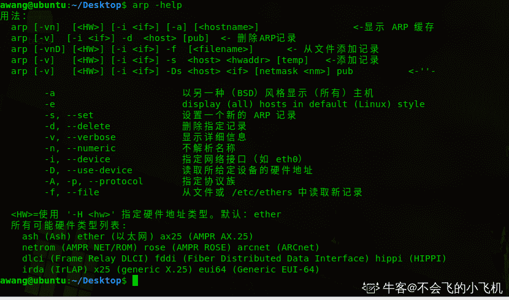
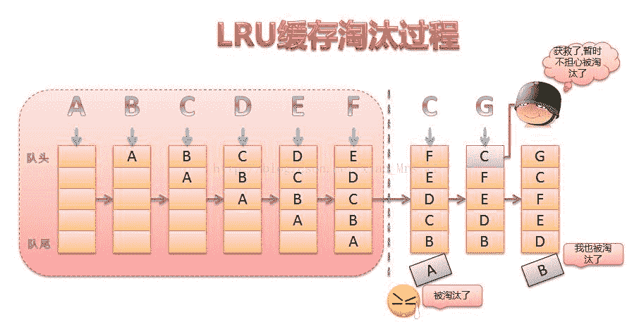
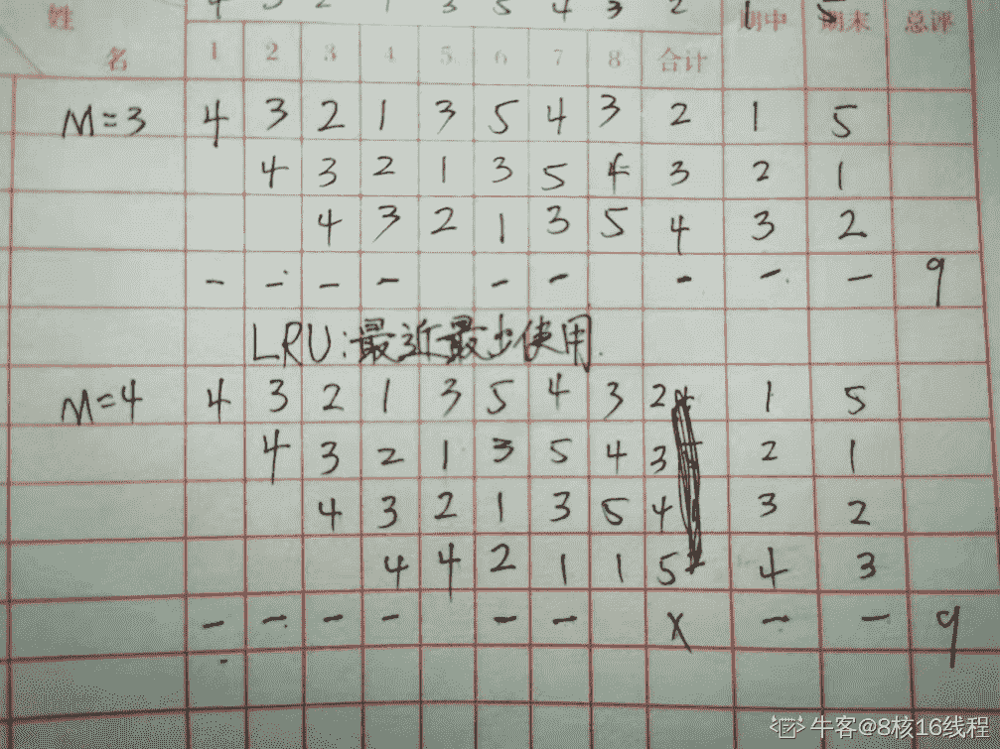
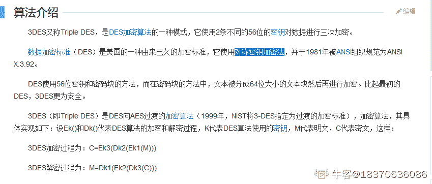

# 趋势科技 2017 校招开发岗试题（B）

## 1

以下程序输出结果是 ?

```cpp
#include <iostream>
using namespace std;
```

```cpp
int main()
{
    int x = 2, y, z;
    x *= (y=z=5);
    z = 3;
    x += (y & z);
    x += (y && z);
    cout << x << endl;
    return 0;
}
```

你的答案

本题知识点

C++ C++工程师 Java 工程师 趋势科技 2017

讨论

[星辰大海的碎片](https://www.nowcoder.com/profile/5437584)

12

发表于 2018-02-23 18:03:47

* * *

[吃兔子的萝卜](https://www.nowcoder.com/profile/6291525)

&是位运算，&&用于逻辑与，当 y=5，z=3 时， y&z 就是 101&011 得到 001 的值 1，y&&z，y 和 z 都不为 0，所以值为 1，最后得到 10+1+1=12

发表于 2018-03-01 09:16:28

* * *

[Tendō·Pein](https://www.nowcoder.com/profile/6291542)

2*5+1+1=12

发表于 2018-02-28 23:33:46

* * *

## 2

以下程序输出值是?

```cpp
#include <stdio.h>
#define f(a,b) a+b
#define g(a,b) a*b
int main(int argc, char **argv)
{
int m;
m=2*f(3,g(4,5));
printf("\n m is %d\n",m);
}
```

你的答案

本题知识点

C++ C++工程师 Java 工程师 趋势科技 2017

讨论

[星辰大海的碎片](https://www.nowcoder.com/profile/5437584)

26

发表于 2018-02-23 18:03:39

* * *

[跳腾的咸鱼](https://www.nowcoder.com/profile/5507379)

26。 #define 只是单纯的文本替换，文本替换过来则是: m=2*3+4*5

编辑于 2018-03-13 19:06:26

* * *

[丰年泮水](https://www.nowcoder.com/profile/8380298)

m is 26

发表于 2018-05-11 15:20:28

* * *

## 3

请问在 main 函数中用户自定义类的默认构造函数总共被调用了几次？

```cpp
#include <iostream>
using namespace std;
```

```cpp
class Animal {
public:
    Animal() { }
    virtual void eat()
    {
        cout << "Animal" << "eat" << endl;
    }
};
```

```cpp
class Mammal : public virtual Animal {
public:
    Mammal() {}
    virtual void breathe()
    {}
    virtual void eat()
    {
        cout << "Mammal" << "eat" << endl;
    }
};
```

```cpp
class WingedAnimal : public virtual  Animal {
public:
    WingedAnimal() { }
    virtual void flap()
    {}
    virtual void eat()
    {
        cout << "WingedAnimal" << "eat" << endl;
    }
}
class Bat : public Mammal, public WingedAnimal
{
public:
    Bat() { }
```

```cpp
    virtual void eat()
    {
        cout<<"Bat"<<" eat"<<endl;
    }
};
int main()
{
    Bat b;
    WingedAnimal bb;
    Animal &a = b;
```

```cpp
    Animal &aa = bb;
    aa.eat();
```

```cpp
    return 0;
}
```

你的答案

本题知识点

C++ C++工程师 Java 工程师 趋势科技 2017

讨论

[HvbUse](https://www.nowcoder.com/profile/6177571)

Bat b; -------  查看全部)

编辑于 2018-05-08 10:26:05

* * *

[Syaoo](https://www.nowcoder.com/profile/332715771)

```cpp
Bat b;                       //     4       (ani +mam + win +bat)
WingedAnimal bb;            //     2       (ani + win)
Animal &a = b;              //     0        拷贝构造
Animal &aa = bb;           //     0        拷贝构造

```

Bat 因为菱形继承，所以 base ani ctor 只调用一次                Ani
             /        \         Mam     Win              \       /                 Bat

编辑于 2021-08-20 17:36:31

* * *

[Earth 活出自己的精彩](https://www.nowcoder.com/profile/5288106)

```cpp
 Bat b;  //调用 Animal  Mammal   WingedAnimal 的构造函数，然后再构造 Bat 的构造函数。  WubgedAnimal bb;   // 调用  Animal WingedAnimal 的构造函数

其余的两行不调用构造函数(这个不太懂为什么，求大佬给个解释）
```

编辑于 2018-09-17 14:05:45

* * *

## 4

请写出函数 strncpy 的声明和实现。 (注: 不可以调用 C/C++的字符串库函数)

你的答案

本题知识点

C++ C++工程师 Java 工程师 趋势科技 2017

讨论

[killerray](https://www.nowcoder.com/profile/1007311)

char * strncpy(char *dest, const char *src, size_t n)；
char * strncpy(char *dest, const char *src, size_t n)           {
               size_t i;
               for (i = 0; i < n && src[i] != '\0'; i++)
                   dest[i] = src[i];
               for ( ; i < n; i++)
                   dest[i] = '\0';
               return dest;
           }

发表于 2018-05-06 15:04:08

* * *

[牛客 7778178 号](https://www.nowcoder.com/profile/7778178)

int strncpy(char *sd, char *ss);int strncpy(char *sd, char *ss){int c=0;while(ss[c]!='\0'){sd[c]=ss[c];c++;}sd[c]='\0'; return 1;}

发表于 2018-03-19 15:17:25

* * *

[门头沟做题家](https://www.nowcoder.com/profile/5223782)

char *strcnpy(char *dest,const char *src,size_t n)
{
    assert((dest!=NULL)&&(src!=NULL));
    if(n==0)
        return dest;
    char *addr=dest;
    int i=0;
    while((i<n)&&(src[i]!='\0'))
    {
         *dest++=src[i++];
    }
  return addr;
 }

发表于 2018-03-09 14:21:12

* * *

## 5

写出伪代码，实现进程调度，使所有进程（P）可以顺利执行完毕。
程序中参数如下：
P - 进程的集合；
Mp - 进程 p 的最大的请求资源；
Cp - 进程 p 当前被分配的资源；
A - 当前可用的资源。

你的答案

本题知识点

操作系统 C++工程师 Java 工程师 趋势科技 2017

讨论

[YaphetS 丶 666](https://www.nowcoder.com/profile/1335124)

```cpp

	while(n > 0){       // n 表示进程数目

	   int i = 0;          // 当前进程号

	 while(i < n) { 

if(Cp + A >= Mp){
            进程执行；
             A += Cp;        //释放资源
             n--;        //进程运行结束，进程集合数目减一
         }
      i++;

	  }

	  若 n 未减小，则发生死锁；

	}

```

编辑于 2018-05-10 22:03:29

* * *

## 6

以下关于数字签名说法正确的是?

正确答案: B   你的答案: 空 (错误)

```cpp
数字签名是在所传输的数据后附加上一段和传输毫无关系的数字信息
```

```cpp
数字签名能够解决篡改，伪造等安全性问题
```

```cpp
数字签名一般采用对称加密机制
```

```cpp
数字签名能够解决数据的加密传输，即安全传输问题
```

本题知识点

网络基础 C++工程师 Java 工程师 趋势科技 2017

讨论

[天乾龙](https://www.nowcoder.com/profile/2572814)

本题考查数字摘要算法的基本概念。 数字签名技术是将摘要用发送者的私钥加密，与原文一起传送给接收者。接收者只有用发送者的公钥才能解密被加密的摘要，然后用 Hash 函数对收到的原文产生一个摘要，与解密的摘要对比，如果相同，则说明收到的信息是完整的，在传输过程中没有被修改，否则，就是被修改过，不是原信息。同时，也证明发送者发送了信息，防止了发送者的抵赖。 B 正确。实现数字签名的主要技术是非对称密钥加密技术。C 错。但是，数字签名并不能保证信息在传输过程中不被截获。D 错。

发表于 2018-03-01 16:35:56

* * *

[柳小白](https://www.nowcoder.com/profile/375210551)

实现数字签名的主要技术是非对称密钥加密技术。

发表于 2019-03-13 07:56:38

* * *

[自拾](https://www.nowcoder.com/profile/563810566)

1、放冒充
2、可鉴别身份
3、防篡改
4、防重放
5、防抵赖
6、机密性

发表于 2021-05-17 15:56:16

* * *

## 7

下面哪项是数组优于链表的特点？

正确答案: D   你的答案: 空 (错误)

```cpp
方便删除
```

```cpp
方便插入
```

```cpp
长度可变
```

```cpp
存储空间小
```

本题知识点

数组 链表 *C++工程师 Java 工程师 趋势科技 2017* *讨论

[诠释、那悲催的回忆](https://www.nowcoder.com/profile/5106650)

1： 数组内存空间少比链表少 2：数组支持随机访问，链表不具有随机访问的特性 3：插入和删除是链表优于数组，数组需要移动被删除或者插入位置之后的元素[`blog.csdn.net/u014082714/article/details/44259029`](https://blog.csdn.net/u014082714/article/details/44259029)

发表于 2018-04-01 22:23:27

* * *

[gtxvs](https://www.nowcoder.com/profile/2445494)

D 链表要保存指向下个节点的指针，占用空间比数组更大

发表于 2018-03-27 08:40:40

* * *

[我也支持](https://www.nowcoder.com/profile/6206174)

```cpp
更准确的说法应该是存储效率高
```

发表于 2019-01-17 19:43:03

* * *

## 8

若两台主机在同一个子网中，则两台主机的 IP 地址分别与它们的子网掩码相“与”的结果是?

正确答案: C   你的答案: 空 (错误)

```cpp
全 0
```

```cpp
全 1
```

```cpp
相同
```

```cpp
不同
```

本题知识点

网络基础 C++工程师 Java 工程师 趋势科技 2017

讨论

[熬夜狗🐶](https://www.nowcoder.com/profile/3031116)

Ｃ
IP 地址与子网掩码与运算的结果为该网络的网络号，因为他们在同一个子网，因此网络号也必然相同，所以选Ｃ

发表于 2018-02-25 21:26:40

* * *

[梦境迷离](https://www.nowcoder.com/profile/759736)

ip&子网掩码= 网络号=网段=同子网下肯定相同。而且路由是可以直到不需要转发。

编辑于 2018-03-25 17:15:26

* * *

[_NoBB_](https://www.nowcoder.com/profile/6149544)

C :  IP 地址 32b   设网络号 16b ,  决定子网位数 n , 主机位数为 16-n 子网掩码应为 1111 1111 | n 个 1  (16-n)个 0 |与上 IP 地址前 16 位本是相同的，又在同一子网 ，  故 结果相同。个人记忆如此

发表于 2018-02-25 20:01:51

* * *

## 9

在浏览器里打开网址 http://www.trendmicro.com，以下哪个协议一定不会被用到?

正确答案: A   你的答案: 空 (错误)

```cpp
SMTP
```

```cpp
TCP
```

```cpp
UDP
```

```cpp
DNS
```

```cpp
ARP
```

本题知识点

网络基础 C++工程师 Java 工程师 趋势科技 2017

讨论

[album](https://www.nowcoder.com/profile/3572443)

自己的电脑一般处于局域网中，要与公网服务器访问需要找到网关出口。 发生 ARP 广播，找到网关 ip 对应的 mac，因为局域网内是靠 mac 地址通讯； 发生 dns 解析，找到域名对应的 ip 地址。涉及到浏览器的 dns 缓存、***作系统的 dns 缓存、hosts 文件、本地首选 dns 服务器等一系列查询过程，dns 底层使用 udp 协议； 将域名与 ip 地址对应关系存入缓存，然后发生传输层的 tcp 三次握手连接（一定发生，因为 http 基于 TCP 连接），如果涉及到视频流等传输会用到 UDP； TCP 连接建立，发生 http request，服务端发生 http response，得到 html 代码 ; 浏览器获取解析渲染 html 页面。 总结一下，用到的协议依次是 ARP->DNS->TCP/UDP->HTTP SMTP，全名 Simple Mail Transport Protocal，译为简单邮件传输协议，也是基于 TCP 连接的一种协议，本题中未提及 html 页面嵌入邮件发送代码，故不考虑。

编辑于 2019-09-06 12:38:18

* * *

[牛客 2073152 号](https://www.nowcoder.com/profile/2073152)

域名解析用到的是 udp,传输层

发表于 2018-03-14 00:08:23

* * *

[熬夜狗🐶](https://www.nowcoder.com/profile/3031116)

Ａ

TCP,UDP 是肯定会用到其中之一的，都有可能被用到
DNS　域名解析，将域名转化为 ip 地址，因此是必然要用到的
ARP　地址解析，将 ip 地址转化为相应的物理地址，因此也是必须要用到的

发表于 2018-02-25 21:31:59

* * *

## 10

当一台 PC 从一个网络移到另一个网络时，以下说法正确的是?

正确答案: B   你的答案: 空 (错误)

```cpp
它的 IP 地址和 MAC 地址都会改变
```

```cpp
它的 IP 地址会改变，MAC 地址不会改变
```

```cpp
它的 MAC 地址会改变，IP 地址不会改变
```

```cpp
它的 MAC 地址、IP 地址都不会改变
```

本题知识点

网络基础 C++工程师 Java 工程师 趋势科技 2017

讨论

[郑重阳](https://www.nowcoder.com/profile/9392705)

当一主机移动到另一个网络时，因为各个网络的网络地址不同，因此 IP 地址会发生改变；而 MAC 地址固化在网卡中，全球惟一，不会发生变化。

发表于 2018-02-26 17:21:28

* * *

[warrior_shadow](https://www.nowcoder.com/profile/172321)

mac 地址是厂家写死的，不能再修改

发表于 2018-07-13 11:00:49

* * *

[zhogjiane](https://www.nowcoder.com/profile/255365)

跟上网环境有关。 如果是静态 ip 上网的方式话，  两者均不会改变 。 若是 拨号上网等 方式 ip 会发生变化 。 mac 地址，生产时  ， 写在网卡上， 不会改变 。

发表于 2018-03-08 00:01:25

* * *

## 11

在 Linux 中查看 ARP 缓存记录的命令是（）?

正确答案: A   你的答案: 空 (错误)

```cpp
“arp –a”
```

```cpp
“arp –d”
```

```cpp
“arp -L”
```

```cpp
“arp –D”
```

本题知识点

Linux 操作系统 C++工程师 Java 工程师 趋势科技 2017

讨论

[小谢 backup](https://www.nowcoder.com/profile/5379055)

```cpp
“arp –a”:all
```

```cpp
“arp –d”:delete
```

```cpp
“arp -L”:不知道，找不到这个参数
```

```cpp
“arp –D”:Device
```

编辑于 2018-03-04 17:50:54

* * *

[牛客 7102076 号](https://www.nowcoder.com/profile/7102076)

-a：显示 arp 缓冲区的所有条目； -H：指定 arp 指令使用的地址类型； -d：从 arp 缓冲区中删除指定主机的 arp 条目； -D：使用指定接口的硬件地址； -e：以 Linux 的显示风格显示 arp 缓冲区中的条目； -i：指定要操作 arp 缓冲区的网络接口； -s<mac>：设置指定的主机的 IP 地址与 MAC 地址的静态映射； -n：以数字方式显示 arp 缓冲区中的条目； -v：显示详细的 arp 缓冲区条目，包括缓冲区条目的统计信息； -f：设置主机的 IP 地址与 MAC 地址的静态映射

发表于 2018-02-27 00:30:06

* * *

[大星星和小猩猩](https://www.nowcoder.com/profile/9374535)



编辑于 2020-04-02 18:37:10

* * *

## 12

在一个请求页式存储管理中，一个程序的页面走向为 4, 3, 2, 1, 3, 5, 4, 3, 2, 1, 5，并采用 LRU 算法。假设分配给该程序的存储块 M 分别为 3 和 4，则该访问中发生的缺页次数 F 分别是?

正确答案: C   你的答案: 空 (错误)

```cpp
(1) M=3, F=8    (2) M=4, F=5
```

```cpp
(1) M=3, F=10   (2) M=4, F=8
```

```cpp
(1) M=3, F=9    (2) M=4, F=9
```

```cpp
(1) M=3, F=7    (2) M=4, F=6
```

本题知识点

操作系统 C++工程师 Java 工程师 趋势科技 2017

讨论

[小谢 backup](https://www.nowcoder.com/profile/5379055)

答案：C。都是 9 次。思路：M=3 时：

| 4  | 3  | 2  | 1  | 3  | 5  | 4  | 3  | 2  | 1  | 5 |
|   | 4  | 3  | 2  | 1  | 3  | 5  | 4  | 3  | 2  | 1  |
|   |   | 4  | 3  | 2  | 1  | 3  | 5  | 4  | 3  | 2  |
| x  | x  | x  | x  |   | x  | x  |   | x  | x  | x  |

F=9。
----------------------------------------------------------------分割线--------------------------------------------------------------
M=4 时：

| 4  | 3  | 2  | 1  | 3  | 5  | 4  | 3  | 2  | 1  | 5  |
|   | 4  | 3  | 2  | 1  | 3  | 5  | 4  | 3  | 2  | 1  |
|   |   | 4  | 3  | 2  | 1  | 3  | 5  | 4  | 3  | 2  |
|   |   |   | 4  | 4  | 2  | 1  | 1  | 5  | 4  | 3  |
| x  | x  | x  | x  |   | x  | x  |   | x  | x  | x  |

F=9.

编辑于 2019-08-10 19:14:12

* * *

[天乾龙](https://www.nowcoder.com/profile/2572814)

C 都是 9 次。LRU（least recently used)是将近期最不会访问的数据给淘汰掉
相当于维护了一个长度为 M 的滑动窗口，前 M 次都算缺页。之后，遇到新数则舍弃最旧数，遇到旧数则调整顺序。

编辑于 2018-03-01 17:06:58

* * *

[8 核 16 线程](https://www.nowcoder.com/profile/479785442)



发表于 2021-10-30 17:16:48

* * *

## 13

以下四句中正确的叙述为?

正确答案: D   你的答案: 空 (错误)

```cpp
操作系统的一个重要概念是进程，不同的进程所执行的代码一定也不同
```

```cpp
为了避免发生进程死锁，各进程应逐个申请资源
```

```cpp
操作系统用 PCB(进程控制块)管理进程，用户进程可能从 PCB 中读出与本身运行状态相关的信息
```

```cpp
进程同步是指某些进程之间在逻辑上相互制约的关系
```

本题知识点

操作系统 C++工程师 Java 工程师 趋势科技 2017

讨论

[天乾龙](https://www.nowcoder.com/profile/2572814)

正确答案是 D 啊。A “一定也不同” 错误。B “各进程应逐个申请资源”这句错误。可以通过合理的资源分配算法来确保永远不会形成环形等待的封闭进程链，从而避免死锁。该方法支持多个进程的并行执行，为了避免死锁，系统动态的确定是否分配一个资源给请求的进程。C “用户进程” 错误，用户进程不能读取状态信息，系统进程才可以。D 正确。异步环境下的一组并发进程因直接制约而互相发送消息、进行互相合作、互相等待，使得各进程按一定的速度执行的过程称为进程间的同步。

编辑于 2018-03-06 13:38:02

* * *

[走位崴了脚](https://www.nowcoder.com/profile/4695029)

进程本身不能通过 PCB 读取自身状态，操作系统才可以；互斥与同步是进程之间的两种制约关系

发表于 2018-10-25 13:32:05

* * *

[Gasleakage](https://www.nowcoder.com/profile/5333243)

C

发表于 2018-02-27 09:16:20

* * *

## 14

在某企业中，有关系 W（工号，姓名，工种，工资），其中工资由工种唯一决定。将其规范化到第三范式，正确的答案是？

正确答案: C   你的答案: 空 (错误)

```cpp
W1（工号，姓名）  W2（工种，工资）
```

```cpp
W1（工号，工种，工资）  W2（工号，姓名）
```

```cpp
W1（工号，姓名，工种）  W2（工种，工资）
```

```cpp
以上都不对
```

本题知识点

数据库 C++工程师 Java 工程师 趋势科技 2017

讨论

[John_Hua](https://www.nowcoder.com/profile/5247495)

第三范式：指表中所有的数据元素不但要能唯一地被主键所标识，而且他们之间还必须相互独立，不存在其他的函数关系。 选 c

发表于 2018-03-01 16:38:02

* * *

[艾斯兰地](https://www.nowcoder.com/profile/673085041)

W1（工号，姓名，工种），W2（工种，工资）
在第三范式中，一张表最多有 2 层同类信息。W1 中姓名和工种依赖于工号，W2 中，工资依赖于工种。

发表于 2019-01-06 22:15:44

* * *

[zengqingfa](https://www.nowcoder.com/profile/2313999)

c

发表于 2018-05-13 22:04:52

* * *

## 15

计算机网络系统中广泛使用的 3DES 算法属于?

正确答案: C   你的答案: 空 (错误)

```cpp
不对称加密
```

```cpp
不可逆加密
```

```cpp
对称加密
```

```cpp
公开密钥加密
```

本题知识点

网络基础 C++工程师 Java 工程师 趋势科技 2017 牛客

讨论

[尚永强](https://www.nowcoder.com/profile/5114626)

3DES（或称为 Triple DES）是三重数据加密算法（TDEA，Triple Data Encryption Algorithm）块密码的通称。它相当于是对每个数据块应用三次 DES 加密算法。由于计算机运算能力的增强，原版 DES 密码的密钥长度变得容易被暴力破解；3DES 即是设计用来提供一种相对简单的方法，即通过增加 DES 的密钥长度来避免类似的攻击，而不是设计一种全新的块密码算法。 而 DES 是对称加密算法，故而 3DES 也是对称加密算法。

发表于 2018-02-26 20:50:26

* * *

[最近的天空之歌](https://www.nowcoder.com/profile/957781058)

学得没那么深，都没听说过

发表于 2021-05-13 17:24:23

* * *

[18370636086](https://www.nowcoder.com/profile/3972697)



发表于 2020-06-24 19:19:22

* * *

## 16

下面哪个语句无法通过编译？

正确答案: B   你的答案: 空 (错误)

```cpp
if (x>y);
```

```cpp
if (x=y) && (x!=0) x+= y;
```

```cpp
if (x!=y) scanf("%d",&x); else scanf("%d",&y);
```

```cpp
if (x<y) {x++; y++;}
```

本题知识点

C++ C++工程师 Java 工程师 趋势科技 2017 C 语言

讨论

[xxxxxxxxxxxxxxxa](https://www.nowcoder.com/profile/4397117)

前面几个人的解答都不太对，其实是

```cpp
if (x=y) && (x!=0) x+= y;//少了括号
```

```cpp
if((x=y)&&(x!=0))
```

发表于 2018-05-05 21:04:44

* * *

[┏豬鼓勵豆℡](https://www.nowcoder.com/profile/396510930)

选 B 是因为 if 没打括号，赋值语句在 if 中是可以正常执行的，只要 x 的值非 0 就为真。

发表于 2018-08-22 10:47:47

* * *

[菜*鱼](https://www.nowcoder.com/profile/2682071)

if 表达式中写成了复制语句是可以通过编译的，但是此题目中&&后面的语句并不是 if 语句的条件表达式，所以不能这样连接这两个语句

发表于 2018-04-09 09:13:11

* * *

## 17

设 x 和 y 均为 int 型变量，则以下语句：

```cpp
x+=y;
y=x-y;
x-=y;
```

的功能是？

正确答案: D   你的答案: 空 (错误)

```cpp
把 x 和 y 按从大到小排列
```

```cpp
把 x 和 y 按从小到大排列
```

```cpp
无确定结果
```

```cpp
交换 x 和 y 中的值
```

本题知识点

C++ C++工程师 Java 工程师 趋势科技 2017 C 语言

讨论

[scanf();](https://www.nowcoder.com/profile/2729901)

正确答案为 D 第一条语句：x += y；此时 x 为 x、y 之和 第二条语句：y = x - y； 将原来 x 的值赋值给 y 第三条语句：x -= y； 此时的 y 为原来的 x，所以表达式最终结果为原 y，并将 y 赋值给 x。 所以，该程序的功能是实现 x，y 的互换 还有一种方法如下： i = x； x = y； y = i； 与上面这种方式相比的好处是不需要开辟第三个变量，节省了空间

发表于 2018-03-09 11:14:47

* * *

[大闸蟹养殖专业户](https://www.nowcoder.com/profile/423282307)

补充防溢出的交换办法

```cpp
x = x ^ y;
y = x ^ y;
x = x ^ y;
```

举例 x = 8 y = 3 写成二进制 x = 1000 y = 0011x =  x ^ y = 1000 xor 0011 = 1011y =  x ^ y = 1011 xor 0011 = 1000x =  x ^ y = 1011 xor 1000 = 0011

发表于 2020-03-10 15:48:00

* * *

[FLKID](https://www.nowcoder.com/profile/200170217)

这题应该是 C，超 int 后就不能实现交换的功能了

发表于 2020-09-04 14:13:08

* * *

## 18

在使用标准 C 库时，下面哪个选项使用只读模式打开文件？

正确答案: A   你的答案: 空 (错误)

```cpp
fopen("foo.txt", "r")
```

```cpp
fopen("foo.txt", "r+")
```

```cpp
fopen("foo.txt", "w")
```

```cpp
fopen("foo.txt", "w+")
```

```cpp
fopen("foo.txt", "a")
```

本题知识点

C++工程师 趋势科技 2017 C 语言

讨论

[山人骑士](https://www.nowcoder.com/profile/774757626)

a 以附加的方式打开只写文件。若文件不存在，则会建立该文件，如果文件存在，写入的数据会被加到文件尾，即文件原先的内容会被保留。a+ 以附加方式打开可读写的文件。若文件不存在，则会建立该文件，如果文件存在，写入的数据会被加到文件尾后，即文件原先的内容会被保留。

发表于 2018-08-24 14:43:31

* * *

[小谢 backup](https://www.nowcoder.com/profile/5379055)

| r | 以只读方式打开文件，该文件必须存在。 |
| r+ | 以读/写方式打开文件，该文件必须存在 |

w 打开只写文件，若文件存在则长度清为 0，即该文件内容消失，若不存在则创建该文件。

w+ 打开可读/写文件，若文件存在则文件长度清为零，即该文件内容会消失。若文件不存在则建立该文件。

发表于 2018-03-04 18:06:46

* * *

[YoJay](https://www.nowcoder.com/profile/3444207)

fopen:    [`baike.baidu.com/item/fopen/10942321?fr=aladdin`](https://baike.baidu.com/item/fopen/10942321?fr=aladdin)

发表于 2018-03-03 19:35:07

* * *

## 19

声明语句为 int a[3][4]; 下列表达式中与数组元素 a[2][1]等价的是？

正确答案: A   你的答案: 空 (错误)

```cpp
*(a[2]+1)
```

```cpp
a[9]
```

```cpp
*(a[1]+2)
```

```cpp
*(*(a+2))+1
```

本题知识点

C++ C++工程师 Java 工程师 趋势科技 2017

讨论

[郑耀钧](https://www.nowcoder.com/profile/341687)

a[2][1] 等价于 *(a[2] + 1) 或 *(*(a + 2) + 1) ，因此 A 正确，CD 错误。a[9] 是一次指针，a[9][0] 才相当于 a[2][1] ，因此 B 错误。

发表于 2018-02-25 15:25:18

* * *

[是萌萌的前辈呀](https://www.nowcoder.com/profile/649256)

B 应该改为*(a[0]+9)

发表于 2018-05-03 10:04:11

* * *

[桃花教主](https://www.nowcoder.com/profile/4747691)

D 如果改成*（*（a＋2）+1）就对了

发表于 2018-03-28 23:10:15

* * *

## 20

以下程序的输出结果是?

```cpp
#include <stdio.h>
main()
{ 
  char a[10]={ ‘1’,‘2’,‘3’,‘4’,‘5’,‘6’,‘7’,‘8’,‘9’,0},*p;
  int i;
  i=8;
  p=a+i;
  printf("%s\n",p-3);
}
```

正确答案: B   你的答案: 空 (错误)

```cpp
6
```

```cpp
6789
```

```cpp
'6'
```

```cpp
789
```

本题知识点

C++ C++工程师 Java 工程师 趋势科技 2017

讨论

[N.F.P](https://www.nowcoder.com/profile/1960138)

因为输出%s,结果是 6789;
如果输出%c,结果是 6；

发表于 2018-04-01 09:58:52

* * *

[落雨離愁](https://www.nowcoder.com/profile/4761399)

敲黑板：输出会把剩下的全部输出！！！参数是头地址！

发表于 2018-03-03 03:23:17

* * *

[郑耀钧](https://www.nowcoder.com/profile/341687)

p - 3 == a + i - 3 == a + 5 故从 a[5] 开始输出字符串直到结束，即输出 6789 ，答案选 B 。

发表于 2018-02-25 15:27:27

* * *

## 21

假如整型指针 p 已经指向某个整型变量 x，则(*p)++和下面哪一个等价？

正确答案: B   你的答案: 空 (错误)

```cpp
p++
```

```cpp
x++
```

```cpp
*(p++)
```

```cpp
&x++
```

本题知识点

C++工程师 Java 工程师 趋势科技 2017 C 语言

讨论

[Chen7006](https://www.nowcoder.com/profile/233010047)

一个类型里会出现很多运算符,他们也像普通的表达式一样,有优先级,其优先级和运算优先级一样:从变量名处起,根据运算符优先级结合,一步一步分析：
int p; //这是一个普通的整型变量  
int *p; //首先从 P 处开始,先与*结合,所以说明 P 是一个指针,然后再与 int 结合,说明指针所指向的内容的类型为 int 型.所以 P 是一个返回整型数据的指针  
int p[3]; //首先从 P 处开始,先与[]结合,说明 P 是一个数组,然后与 int 结合,说明数组里的元素是整型的,所以 P 是一个由整型数据组成的数组  
int *p[3]; //首先从 P 处开始,先与[]结合,因为其优先级比*高,所以 P 是一个数组,然后再与*结合,说明数组里的元素是指针类型,然后再与 int 结合,说明指针所指向的内容的类型是整型的,所以 P 是一个由返回整型数据的指针所组成的数组  
int (*p)[3]; //首先从 P 处开始,先与*结合,说明 P 是一个指针然后再与[]结合(与"()"这步可以忽略,只是为了改变优先级),说明指针所指向的内容是一个数组,然后再与 int 结合,说明数组里的元素是整型的.所以 P 是一个指向由整型数据组成的数组的指针  
int **p; //首先从 P 开始,先与*结合,说是 P 是一个指针,然后再与*结合,说明指针所指向的元素是指针,然后再与 int 结合,说明该指针所指向的元素是整型数据.由于二级指针以及更高级的指针极少用在复杂的类型中,所以后面更复杂的类型我们就不考虑多级指针了,最多只考虑一级指针.  
int p(int); //从 P 处起,先与()结合,说明 P 是一个函数,然后进入()里分析,说明该函数有一个整型变量的参数,然后再与外面的 int 结合,说明函数的返回值是一个整型数据  
Int (*p)(int); //从 P 处开始,先与指针结合,说明 P 是一个指针,然后与()结合,说明指针指向的是一个函数,然后再与()里的 int 结合,说明函数有一个 int 型的参数,再与最外层的 int 结合,说明函数的返回类型是整型,所以 P 是一个指向有一个整型参数且返回类型为整型的函数的指针 
原文：[`blog.csdn.net/constantin_/article/details/79575638`](https://blog.csdn.net/constantin_/article/details/79575638)  

发表于 2018-12-27 08:44:11

* * *

[郑耀钧](https://www.nowcoder.com/profile/341687)

() 括号优先级最高，对 (*p) 求值即对 p 进行解引用，因此相当于其指向的 x 变量，即 x++ 。选项 B 正确。

发表于 2018-02-25 15:30:07

* * *

[Blue.2.0](https://www.nowcoder.com/profile/769962858)

(*p)++     p 是一级指针，*p 也就是取指针所指向空间里的值，此时*p 也可以理解为一个变量

发表于 2022-03-03 10:47:09

* * *

## 22

下列对字符数组进行初始化的语句正确的是？

正确答案: A   你的答案: 空 (错误)

```cpp
char a[] =“Hello”;
```

```cpp
char a[][]={‘H’,‘e’,‘l’,‘l’,‘o’};
```

```cpp
char a[5]= “Hello”;
```

```cpp
char a[2][5]={ “Hello”,“World”};
```

本题知识点

C++ Java 工程师 趋势科技 2017 C 语言

讨论

[天乾龙](https://www.nowcoder.com/profile/2572814)

比较简单。A 正确。B 二维数组最后一维必须有值。***数组只能省略第一维（感谢评论提醒）CD 都超出长度，最后有"\0"

编辑于 2018-03-11 00:41:15

* * *

[一心只想养老](https://www.nowcoder.com/profile/6674227)

char a="hello"正确的，char 数组默认加一个\0 作为结束符

发表于 2019-04-09 14:07:18

* * *

[进阶中的牛客人](https://www.nowcoder.com/profile/450066322)

B 错，二维数组可以省略第一维的，但是第二维不可以省略 C 和 D 错，C 系统在用字符数组存放字符串常量时，会自动加一个‘\0’作为结束符，例如，“C program”共有 9 个字符，字符串是存放在一维数组中的，在数组中占 10 个字节，最后一个字节'\0'是由系统自动加上的。

发表于 2021-05-09 15:10:29

* * *

## 23

若有以下 C 函数调用语句：

```cpp
f(m+n,x+y,f(m+n,z,(x,y)));
```

在此函数定义中，f 有多少个参数？

正确答案: D   你的答案: 空 (错误)

```cpp
6
```

```cpp
5
```

```cpp
4
```

```cpp
3
```

本题知识点

C++工程师 Java 工程师 趋势科技 2017 C 语言

讨论

[郑耀钧](https://www.nowcoder.com/profile/341687)

分解一下

```cpp
- call: f
--- expr: m + n
--- expr: x + y
--- expr: f(m+n,z,(x,y))

```

因此 f 有三个参数。至于 f(m+n,z,(x,y)) 也是类似的，里面的 (x, y) 是个括号表达式，返回 y 的值。

编辑于 2018-02-25 15:37:03

* * *

[scanf();](https://www.nowcoder.com/profile/2729901)

三个参数，分别将 m+n, x+y, f(m+n,z,(x,y))看做一个整体，所以该函数有三个参数

发表于 2018-03-09 11:42:19

* * *

[sf54837](https://www.nowcoder.com/profile/688437321)

看逗号就 OK，第三个为函数参数

发表于 2020-08-20 22:07:43

* * *

## 24

下列运算符中优先级最高的是?

正确答案: B   你的答案: 空 (错误)

```cpp
<
```

```cpp
+
```

```cpp
&&
```

```cpp
!=
```

本题知识点

C++ Java C++工程师 Java 工程师 趋势科技 2017

讨论

[MissNull](https://www.nowcoder.com/profile/1200590)

if(a+b!=c&&a<b){}相信这个条件大家都知道怎么计算。

发表于 2018-03-03 00:52:40

* * *

[靠着莪哋肩嫎ヽ](https://www.nowcoder.com/profile/7735618)

口诀：淡云一笔安洛三福 单目>算数运算符>移位>比较>按位>逻辑>三目>赋值

发表于 2018-03-17 20:26:02

* * *

[walden1996](https://www.nowcoder.com/profile/7175095)

单目运算符：+，-，++，--算数运算符：+，-，*，/，%移位运算符：<<,>>关系运算符：>,<,>=,<=,==,!=位运算符：&，|，~，^,逻辑运算符：&&，||三目运算符：表达式 1？表达式 2：表达式 3;赋值运算符：=等

编辑于 2018-03-01 20:38:06

* * *

## 25

以下代码中, 类 A 的构造函数和析构函数分别执行了几次？（）

```cpp
A *pa = new A[5];
delete pa;
```

正确答案: D   你的答案: 空 (错误)

```cpp
1, 1
```

```cpp
5, 5
```

```cpp
1, 5
```

```cpp
5, 1
```

本题知识点

C++ C++工程师 Java 工程师 趋势科技 2017

讨论

[為靜](https://www.nowcoder.com/profile/6643832)

构造函数是 5 次，pa 相当于数组的第一个元素地址,delete pa 只释放第一个元素，delete[] pa 释放 pa 指向的全部元素。

发表于 2018-03-01 21:21:54

* * *

[百度 _zopen](https://www.nowcoder.com/profile/3532665)

delete pa;改为 delete[] pa;答案就是析构五次。

发表于 2019-03-26 10:37:07

* * *

[stt2019](https://www.nowcoder.com/profile/4320786)

pa 只指向第一个元素，所以只析构一次

发表于 2018-03-15 23:42:24

* * *</mac>*