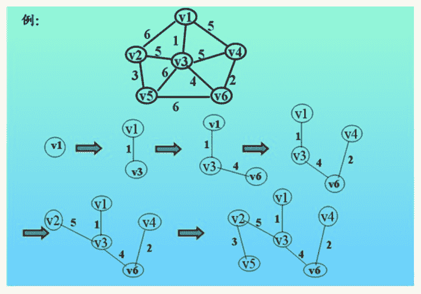

# 【2018】牛客模考（一模）编程题集合（A）

## 1

在情报传递过程中，为了防止情报被截获，往往需要对情报用一定的方式加密，简单的加密算法虽然不足以完全避免情报被破译，但仍然能防止情报被轻易的识别。我们给出一种最简的的加密方法，对给定的一个字符串，把其中从 a-y,A-Y 的字母用其后继字母替代，把 z 和 Z 用 a 和 A 替代，则可得到一个简单的加密字符串。

本题知识点

字符串 *模拟 C++工程师 golang 工程师 iOS 工程师 安卓工程师 运维工程师 前端工程师 算法工程师 测试工程师 PHP 工程师 Java 工程师 2018 牛客* *讨论

[263 保洁小妹](https://www.nowcoder.com/profile/7617726)

送分题，细节不出错就行

```cpp
#include <stdio.h>
#include <string.h>
#define N 100

int main()
{
    char s[N];
    while(gets(s))
    {
        int len=strlen(s);
        for(int i=0; i<len; i++)
        {
            if('a'<=s[i]&&s[i]<='y') s[i]++;
            else if('A'<=s[i]&&s[i]<='Y') s[i]++;
            else if(s[i]=='z') s[i]='a';
            else if(s[i]=='Z') s[i]='A';
        }
        puts(s);
    }
    return 0;
}
```

发表于 2018-02-21 21:19:04

* * *

[华科平凡](https://www.nowcoder.com/profile/4939096)

python solution:

```cpp
 while True:
    try:
        a=int(input())
        for i in range(a):
            b=input()
            res=""
            for i in b:
                if i.isalpha():
                    if ord(i)!=122 and ord(i)!=90:
                        res+=chr(ord(i)+1)
                    else:
                        res+=chr(ord(i)-25)
                else:
                    res+=i
            print(res)

    except:
        break 
```

发表于 2017-10-04 08:18:04

* * *

[底层搬砖工](https://www.nowcoder.com/profile/210498279)

```cpp
//这个题有点问题 题目给的样例中第一行是一个数字，但是输出却没处理数字  我以为是表示要输入的数据规模，结果怎么搞
//都是运行时间超过限制,题目的测试案例应该是一行行的字符串 根本没数据规模的数字
#include <stdio.h>
#include <stdlib.h>
#include <ctype.h>
int main(){
    char c;
    while((c = getchar())!='\n'){
        if(isalpha(c)){
            if(c!='z'&&c!='Z'){
                putchar(c+1);
            }else putchar(c=='z'?'a':'A');
        }else putchar(c);
    }
    putchar('\n');
    return 0;
}

```

发表于 2020-02-20 12:31:18

* * *

## 2

亮亮解出了卷轴隐藏的秘密，来到了一片沼泽地。这里有很多空地，而面试直通卡可能埋在任意一块空地中，好在亮亮发现了一堆木材，他可以将木材铺在两个空地之间的沼泽地上。因为亮亮不知道面试直通卡具体在哪一块空地中，所以必须要保证任意一块空地对于亮亮来说是可以抵达的。 “怎么还有鳄鱼！没办法，看来有些空地不能直接到达了。” 亮亮虽然没有洁癖，但是沼泽地实在太臭了，所以亮亮不会循环利用木材。而且木材不能拼接在一起使用，所以亮亮必须要知道在耗费木材最少的情况下，最长的那根木材至少需要多长。

本题知识点

贪心 图 C++工程师 golang 工程师 iOS 工程师 安卓工程师 运维工程师 前端工程师 算法工程师 测试工程师 PHP 工程师 Java 工程师 2018 楚楚街 2016 牛客

讨论

[macgradyjames](https://www.nowcoder.com/profile/9178626)

```cpp
//使用 Cruskal 解决问题
import java.util.Arrays;
import java.util.Comparator;
import java.util.Scanner;

//并查集实现最小生成树
public class Main{
    private static class Edge{
    	//起点和终点
    	int x,y;
    	int weight;
    	public Edge(int x,int y,int weight)
    	{
    		this.x=x;
    		this.y=y;
    		this.weight=weight;
    	}
    }
    public static int father(int i,int a[])
    {
    	 int k=i;
         while(a[k]!=k)k=a[k];  //并查集
         return k;
    }
	/**
	 * @param args
	 */
	public static void main(String[] args) {
		// TODO Auto-generated method stub
        Scanner in=new Scanner(System.in);
        while(in.hasNext())
        {
        	int n=in.nextInt();
        	int m=in.nextInt();
        	Edge[] edges=new Edge[m];
        	for(int i=0;i<m;i++)
        	{
        		edges[i]=new Edge(in.nextInt(),in.nextInt(),in.nextInt());
        	}
        	int a[]=new int[n+1];
        	for(int j=0;j<=n;j++)
        	{
        		a[j]=j;
        	}
        	Arrays.sort(edges,new Comparator<Edge>() {
				@Override
				public int compare(Edge o1, Edge o2) {
					// TODO Auto-generated method stub
					return o1.weight-o2.weight;
				}
			});
        	int res=0;
        	for(int i=0;i<m;i++)
        	{
        		int px=father(edges[i].x,a);
        		int py=father(edges[i].y,a);
        		if(px!=py)
        		{
        			 if(edges[i].weight>res)res=edges[i].weight;
        			 if(px>py)
        				 a[px]=py;
        			 else
        				 a[py]=px;
        		}
        	}
        	System.out.println(res);
        }
	}

}
```

发表于 2016-08-11 18:43:17

* * *

[卷积神经网络哦](https://www.nowcoder.com/profile/8684256)

图的最小生成树 Prim 算法或者 Kruscal 算法
下面给出 Prim 算法解法

如图所示 此例最小木材铺法如图最后步骤所示
此时最长木板为 5
算法思想：
从 V1 出发 求出所有点中与 V1 的距离最短的一个节点 V3(无法与 V1 直接相连的距离为无穷) 得到第一条边 然后在求剩下点到 V1 和 V3 的距离最近的点 V6 依次类推直到所有点用完
注意：
为了减少时间复杂度引入数组 dis[] dis[i]表示节点 i 到已连接的集合中所有点的最小距离
一开始时只有 V1 在集合中 所以 dis[i]就为每个点到 V1 的距离 当 V3 也加入时 dis[i]要更新为
min(i 到 V1 的距离， i 到 v3 的距离)后面依次类推
这样可以将总的时间复杂度降为 O(n²)

```cpp
#include 
#include 
#include 
#include 
#include 
#include 
using namespace std;
const int maxn = 1e4 + 1;
const int MAX_INT = INT_MAX;
int dis[maxn];
int n, m, taken[maxn];
struct Node{
    int to, val;
    Node(int a, int b){
        to = a;
        val = b;
    }
};
vector v[maxn];
int main(){
    while(scanf("%d%d", &n, &m) == 2){
        memset(taken, 0, sizeof(taken));
        memset(dis, 0, sizeof(dis));
        for(int i = 0; i < m; i++){
            int a, b, val;
            scanf("%d%d%d", &a, &b, &val);
            v[a].push_back(Node(b, val));
            v[b].push_back(Node(a, val));//用 vector 保存图
        }
        taken[1] = 1;//从点 1 开始 
        //由于鳄鱼的存在(即存在非联通分量 即存在从 1 出发永远到不了的点 所以必须从 1 出发 舍弃到不了的点)
        for(int i = 1; i <= n; i++) dis[i] = MAX_INT;
        for(int i = 0; i < v[1].size(); i++) dis[v[1][i].to] = v[1][i].val;    //每个点到点 1 的距离                
        int ans = 0;
        for(int i = 1; i < n; i++){
            int min_val = MAX_INT, min_p;
            for(int j = 1; j <= n; j++){//每个点到已连接集合的最短距离
                if(!taken[j] && dis[j] < min_val){
                    min_val = dis[j];
                    min_p = j;
                }
            }
            if(min_val == MAX_INT) continue;
            ans = max(ans, min_val);
            taken[min_p] = 1;
            for(int j = 0; j < v[min_p].size(); j++){//更新 dis 数组
                if(!taken[v[min_p][j].to] && v[min_p][j].val < dis[v[min_p][j].to])
                    dis[v[min_p][j].to] = v[min_p][j].val;
            }
        }
        cout<<ans<<endl;
        for(int i = 0; i < n; i++) v[i].clear();
    }
    return 0;
}
/*
4 3
1 2 1
2 3 1
3 4 2
ans： 2
5 4
1 2 3
1 3 8
2 3 2
4 5 7
ans: 3
*/ 
```

编辑于 2018-10-28 15:50:00

* * *

[会呼吸旳痛](https://www.nowcoder.com/profile/6433012)

```cpp
//循边最小生成树，并查集动态查询连通性
include <iostream>
#include <vector>
#include <set>
#include <algorithm>
#include <map>
using namespace std;

int father(int i, vector<int> &UF)
{
	int k=i;
	while(UF[k]!=k)k=UF[k];
	return k;
}
int main()
{
	int N,M;
	while(cin>>N>>M)
	{
		multimap<int,pair<int,int>> cost;
		while(M--)
		{
			int a,b,c;
			cin>>a>>b>>c;
			cost.insert(make_pair(c,make_pair(min(a,b),max(a,b))));
		}
		vector<int>UF(N+1);
		for(int i=0;i<=N;i++)
			UF[i]=i;

		int maxV = -1;
		int cc = 0;
		for(auto it=cost.begin();it!=cost.end();it++)
		{
			int px = father(it->second.first,UF);
			int py = father(it->second.second,UF);

			if(px != py)
			{
				cc++;
				if(it->first>maxV)maxV=it->first;
                                UF[px] = UF[py];
			}
		}

		cout<<maxV<<endl;

	};
	return 0;
}

```

编辑于 2016-08-20 09:03:46

* * *

## 3

妞妞参加完 Google Girl Hackathon 之后,打车回到了牛家庄。

妞妞需要支付给出租车司机车费 s 元。妞妞身上一共有 n 个硬币，第 i 个硬币价值为 p[i]元。

妞妞想选择尽量多的硬币，使其总价值足以支付 s 元车费(即大于等于 s)。

但是如果从妞妞支付的这些硬币中移除一个或者多个硬币，剩下的硬币总价值还是足以支付车费的话，出租车司机是不会接受的。例如: 妞妞使用价值为 2，5，7 的硬币去支付 s=11 的车费,出租车司机是不会接受的，因为价值为 2 这个硬币是可以移除的。

妞妞希望能选取最大数量的硬币，使其总价值足以支付车费并且出租车司机能接受。

妞妞希望你能帮她计算最多可以支付多少个硬币。

本题知识点

数学 贪心 数组 排序 *C++工程师 Java 工程师 2017 golang 工程师 iOS 工程师 安卓工程师 运维工程师 前端工程师 算法工程师 测试工程师 PHP 工程师 2018 牛客* *讨论

[乌邦图](https://www.nowcoder.com/profile/6536808)

```cpp
1.先排序，定义 sum 从数组第一个元素累加，到第一次大于等于 s 停止，
  用 cnt 记录当前累加个数
2.如果 sum 刚好等于 s，直接返回 cnt，如果 sum>s,定义 dis=sum-s,从累
  加的最后一个元素的前一位开始比较，如果 dis 大于该元素，dis-=arr[i]，
  并且 cnt--，直到遍历到第 0 个位置的元素结束，返回 cnt
#include<iostream>
#include<algorithm>
using namespace std;
int main()
{
    int n,s;
    cin>>n>>s;
    int * arr = new int[n];
    for(int i=0;i<n;i++)
    {
        cin>>arr[i];
    }
    sort(arr,arr+n);
    int sum=0,cnt=0,j=0;
    for(int i=0;i<n;i++)
    {
        sum+=arr[i];
        cnt++;
        if(sum<s)
            continue;
        else if(sum==s)
            break;
        else
        {
            j=i-1;
            int dis=sum-s;
            while(j>=0)
            {
                if(dis>arr[j])
                {
                    dis-=arr[j];
                    cnt--;
                    j--;
                }
                else if(dis == arr[j])
                {
                    cnt--;
                    break;
                }
                else
                    j--;
            }
        }
        break;
    }
    cout<<cnt<<endl;
    return 0;
}

```

编辑于 2018-03-18 13:46:49

* * *

[元气の悟空](https://www.nowcoder.com/profile/392974)

```cpp
#include<stdio.h>
#include<vector>
using namespace std;
#define max(a,b) a>b?a:b
int main(){
    int n,i,j,v[20],k;
    //freopen("input.txt","r",stdin);
    while(~scanf("%d%d",&n,&k)){
        for(i=0;i<n;i++) scanf("%d",v+i);
        int Max=0;
        for(j=0;j<1<<n;j++){
            vector<int> s;
            int sum=0,flag=1;
            for(i=0;i<n;i++)
                if(j>>i&1) s.push_back(v[i]),sum+=v[i];
            if(sum<k) continue;
            for(i=0;i<s.size();i++)
                if(sum-s[i]>=k){
                    flag=0;break;
                }
            if(flag==1) Max=max(Max,s.size());
        }
        printf("%d\n",Max);
    }
}

```

发表于 2017-12-30 12:51:28

* * *

[康师傅..](https://www.nowcoder.com/profile/6295609)

package NewCode;

import java.util.Scanner;

/**

*   Created by wanyu on 2018/3/19.
    */
    public class L {
    public static void main(String[] args) {

    ```cpp
     Scanner cin=new Scanner(System.in);
     int n=cin.nextInt();//硬币数量
     int s=cin.nextInt();//车费
     int corn[]=new int[n+1];
     for(int i=1;i<=n;i++){
         corn[i]=cin.nextInt();
     }
     for(int i=1;i<n;i++){//将硬币从小到大排序
         int min=i;
         for(int j=i+1;j<=n;j++){
             if(corn[min]>corn[j]){
                 min=j;
             }
             }
         if(min!=i){
             int tmp=corn[min];
             corn[min]=corn[i];
             corn[i]=tmp;
         }
     }
     int sum=0;//计算金额
     int i=0;
     boolean flag=false;
     for( i=1;i<=n;i++){
         sum+=corn[i];//从小到大开始累加 确保数量最大
         if(sum==s){//如果等于 S 则结束
             break;
         }else if(sum>s){//如果大于 S 标记 flag 进行下一步运算
             flag=true;
             break;
         }
     }
     if(flag){
         int shu=0;
         for(int j=n;j>=1;j--){//从大到小开始减
             if(sum-corn[j]>=s){//如果减掉大金额后仍大于 S 则继续
                 sum-=corn[j];
                 shu++;
             }
         }
         i=i-shu;
     }
     System.out.println(i); 
    ```

    }
    }

发表于 2018-03-19 15:44:07

* * *

## 4

妞妞参加了 Nowcoder Girl 女生编程挑战赛, 但是很遗憾, 她没能得到她最喜欢的黑天鹅水晶项链。

于是妞妞决定自己来制作一条美丽的项链。一条美丽的项链需要满足以下条件:

1、需要使用 n 种特定的水晶宝珠

2、第 i 种水晶宝珠的数量不能少于 l[i]颗, 也不能多于 r[i]颗

3、一条美丽的项链由 m 颗宝珠组成

妞妞意识到满足条件的项链种数可能会很多, 所以希望你来帮助她计算一共有多少种制作美丽的项链的方案。

本题知识点

动态规划 数学 C++工程师 Java 工程师 2017 golang 工程师 iOS 工程师 安卓工程师 运维工程师 前端工程师 算法工程师 测试工程师 PHP 工程师 2018 牛客

讨论

[元气の悟空](https://www.nowcoder.com/profile/392974)

```cpp
#include<stdio.h>
#include<string.h>
const int maxn=100;
#define max(a,b) a>b?a:b
int n,m,a[maxn],l[maxn],r[maxn];
long long dp[maxn][maxn+1];
int main(){
    int i,j,k;
    //freopen("input.txt","r",stdin);
    while(~scanf("%d%d",&n,&m)){
        for(i=0;i<n;i++) scanf("%d%d",l+i,r+i);
        memset(dp,0,sizeof(dp));
        for(i=l[0];i<=r[0];i++) dp[0][i]=1;
        for(i=1;i<n;i++)
            for(j=1;j<=m;j++){
                int left=max(0,j-r[i]),right=max(0,j-l[i]);
                for(k=left;k<=right;k++) dp[i][j]+=dp[i-1][k];
            }
        printf("%lld\n",dp[n-1][m]);
    }
}//dp[i][j]表示用前 i 种宝石组成 j 颗宝石的项链的方案数
 //但是第 i 种只能是 l[i]到 r[i]之间的数量
 //所以 dp[i][j]=dp[i-1][j-r[i]]+dp[i-1][j-r[i]+1]+...+dp[i-1][j-l[i]]

```

发表于 2017-12-30 12:15:00

* * *

[super3yearsold～](https://www.nowcoder.com/profile/3215845)

思路：如果 n 的个数确定可以采用多重循环嵌套，但是由 n 的个数不确定，思考后可以考虑递归来做，但是递归重复计算次数太多，因而想到可以采用动态规划解决此问题。

设 d[i][j]表示 i+1 种宝珠中取 j 个宝珠的方案数

k 表示宝珠个数上限-宝珠个数下限

则 d[i][j]=d[i-1][j]+d[i-1][j-1].....+d[i-1][j-k]

例如：当 2 种宝珠选 2 个时的方案数

d[1][2]=d[0][2]+d[0][1]+d[0][0]（选择从第 2 种宝珠中取 i 个时的方案数等于从第 1 种宝珠中分别取 2 个，取 1 个，取 0 个的和）

使用动态规划可得以下二维数组：

|  | 0 | 1 | 2 | 3 | 4 | 5 |
| 0 | 1 | 1 | 1 | 1 | 0 | 0 |
| 1 | 1 | 2 | 3 | 4 | 3 | 2 |
| 2 | 1 | 3 | 6 | 10 | 12 | 12 |

import java.util.Scanner;

public class MeiLiDeXiangLian {

    public static void main(String[] args) {
        // TODO Auto-generated method stub
        Scanner in=new Scanner(System.in);
        int n;
        int m;
        n=in.nextInt();
        m=in.nextInt();
        int l;
        int r;
        int[] array=new int[n];
        for(int i=0;i<n;i++) {
            l=in.nextInt();
            r=in.nextInt();
            array[i]=r-l;
            m=m-l;
        }
        in.close();
        long[][] d=new long[n][m+1];
        for(int i=0;i<=array[0];i++) {//当一种宝珠的取上限个时方案数都为 1
            d[0][i]=1;
        }
        for(int i=1;i<n;i++) {
            for(int j=0;j<=m;j++) {
                if(j==0) {
                    d[i][j]=1;
                }else {
                    long sum=0;
                    for(int k=0;k<=array[i]&&k<=j;k++) {
                        sum=sum+d[i-1][j-k];
                    }
                    d[i][j]=sum;
                }
            }
        }
        System.out.println(d[n-1][m]);
    }

}

编辑于 2018-03-23 11:43:48

* * *

[霍七](https://www.nowcoder.com/profile/1903667)

本套 6 道题全部 pass 的 C++代码已挂到了我的 GitHub([`github.com/shiqitao/NowCoder-Solutions`](https://github.com/shiqitao/NowCoder-Solutions))

牛客网上的其他题目解答也在持续更新。【题解】为了方便，在输入的时候，将 [li,ri] 的区间缩小为 [0,ri-li] 。使用动态规划，DP[i][j]为用前 i+1 种珠宝制作数量为 j 的项链的方案数量。DP[i][j+k]=DP[i-1][j]，其中 k 属于 [0,ri-li]。

```cpp
#include <iostream>
#include <cstring>
using namespace std;
int main() {
    int n, m;
    cin >> n >> m;
    int *R = new int[n], temp;
    for (int i = 0; i < n; i++) {
        cin >> temp >> R[i];
        R[i] -= temp;
        m -= temp;
    }
    long long int **DP = new long long int*[n];
    for (int i = 0; i < n; i++) {
        DP[i] = new long long int[m + 1];
        memset(DP[i], 0, sizeof(long long int)*(m + 1));
    }
    for (int i = 0; i <= R[0]; i++) {
        DP[0][i] = 1;
    }
    for (int i = 1; i < n; i++) {
        for (int j = 0; j <= R[i]; j++) {
            for (int k = 0; k <= m - j; k++) {
                DP[i][k + j] += DP[i - 1][k];
            }
        }
    }
    cout << DP[n - 1][m] << endl;
    delete[] R;
    for (int i = 0; i < n; i++) {
        delete[] DP[i];
    }
    delete[] DP;
    return 0;
}
```

编辑于 2017-12-26 14:47:29

* * *

## 5

妞妞得到一个(1~n)的排列 p[1], p[2], p[3],...,p[n], 听村里的老人牛牛说如果让这个排列变为:

对于所有的 1 <= i <= n, 都满足 p[i] ≠ i, 就可以获得 Google Girl Hackathon 的入场券。妞妞仅允许的操作是: 交换排列中两个相邻的元素, 并且妞妞允许做这个操作任意次。

但是 Google Girl Hackathon 就快要开始了, 妞妞希望做最少的操作就使排列满足要求, 妞妞希望你能帮助她。

本题知识点

模拟 贪心 数组 C++工程师 Java 工程师 2017 golang 工程师 iOS 工程师 安卓工程师 运维工程师 前端工程师 算法工程师 测试工程师 PHP 工程师 2018 牛客

讨论

[霍七](https://www.nowcoder.com/profile/1903667)

本套 6 道题全部 pass 的 C++代码已挂到了我的 GitHub([`github.com/shiqitao/NowCoder-Solutions`](https://github.com/shiqitao/NowCoder-Solutions))

牛客网上的其他题目解答也在持续更新。【题解】如果有一个 pi=i 或一对 pi=i 并且 pi+1=i+1，则需要一次交换。

```cpp
#include 
using namespace std;
int main()
{
    int n; cin >> n;
    int equal = 0, count = 0, data;
    while (count < n) {
        cin >> data;
        if (data == ++count) {
            if (count != n) cin >> data;
            count++; equal++;
        }
    }
    cout << equal;
    return 0;
}
```

编辑于 2017-12-26 15:01:01

* * *

[pipi_wei](https://www.nowcoder.com/profile/3626446)

这个题有 bug，比如当输入的组合为 1 1 2，输出应该为 2，但是输入用例并没有考虑。

发表于 2018-05-20 15:38:14

* * *

[Reyzal](https://www.nowcoder.com/profile/9605341)

本套试题 AC 代码在[`github.com/ReyzalX/nowcoder`](https://github.com/ReyzalX/nowcoder)查看

```cpp
#include<bits/stdc++.h>

using namespace std;

int main()
{
    int n;
    cin >> n;
    int result = 0;
    int i = 0;
    while(i < n)
    {
        int num;
        cin >> num;
        //如果当前数等于 i 则次数+1
        //如果下面一个数等于 i+1 则次数也是+1
        if (num == i+1) {
            if (i < n) {
                i++;
                cin >> num;
            }
            result++;
        }
        i++;
    }
    cout << result << endl;
    return 0;
} 
```

发表于 2018-03-26 01:05:41

* * *

## 6

美丽的牛家庄受到了外星人的侵略, 勇敢的妞妞要上战场抵御侵略。

在妞妞上战场前, 村长牛牛给了妞妞 N 件装备, 妞妞需要选择其中的 K 件,装备在身上提升自己的战斗力。每件装备有 5 种属性增幅值,对于第 i 件装备它的属性增幅值为(r[i1], r[i2], r[i3], r[i4], r[i5]), 分别代表该装备对不同的属性值增幅。

当妞妞装备多件装备的时候,由于装备之前会互相影响, 对于每种属性值的增幅并不是所有装备该属性值之和, 而是该种属性值下所有装备中最大的属性值。而妞妞最终增加的战斗力为这 5 种属性值增幅之和。

妞妞一定要保卫牛家庄, 所以她希望她能提升尽可能多的战斗力, 请你帮帮她计算她最多能增加多少战斗力。

本题知识点

贪心 模拟 动态规划 C++工程师 Java 工程师 2017 golang 工程师 iOS 工程师 安卓工程师 运维工程师 前端工程师 算法工程师 测试工程师 PHP 工程师 2018 牛客

讨论

[Reyzal](https://www.nowcoder.com/profile/9605341)

本套试题 AC 代码在[`github.com/ReyzalX/nowcoder`](https://github.com/ReyzalX/nowcoder)查看。
如果暴力，情况太复杂了。
预处理数据：

*   选当前装备第 1 条属性，可以得到的最大值，当前装备第 2 条属性可以得到的最大值...
*   取当前装备第 1 和第 2 条属性，可以得到的最大值，第 1 和第 3 属性可以得到的最大值。
*   ......最后遍历这个预处理后的数据即可。

```cpp
#include<bits/stdc++.h>

using namespace std;
int result = 0;
int n, K;
int best[32] = { 0 };

void dfs(int cur,int flag,int sum) {
    if (cur == K)
    {
        result = max(result,sum);
        return;
    }
    for (int i = 0; i < 32; i++)
    {
        if (i & flag)
            continue;
        dfs(cur + 1, i | flag, sum + best[i]);
    }
}
int main()
{
    cin >> n >> K;
    vector<vector<int>> data(n, vector<int>(5));
    int maxv[5] = { 0 };
    for (int i = 0; i < n; i++)
    {
        cin >> data[i][0] >> data[i][1] >> data[i][2] >> data[i][3] >> data[i][4];
        for (int k = 0; k < 5; k++)
        {
            maxv[k] = max(maxv[k], data[i][k]);
        }
        //这里是计算当使用当前装备第 12345 个属性时，加成是多少
        //best 记录最大加成
        //11111 表示使用装备 5 个属性
        //11110 使用装备第 1234 属性 11101 使用装备第 1235 属性 类推
        for (int j = 1; j < 32; j++)
        {
            int temp = 0;
            for (int k = 0; k < 5; k++)
            {
                if (j&(1 << k)) {
                    temp += data[i][k];
                }
            }
            best[j] = max(best[j], temp);
        }
    }
    if (K >= 5)
    {
        //大于 5 肯定单属性最高的
        for (int i = 0; i < 5; i++)
        {
            result += maxv[i];
        }
    }
    else {
        //小于 5
        //选单件 5 个属性的
        //选单件 4 个属性的，下一件是 1 个属性
        //选单件 3 个属性的，下一件可以 2 个属性或者 1 个属性
        //...可以动态规划，小规模直接 dfs 就行了
        dfs(0, 0,0);
    }
    cout << result << endl;
    return 0;
} 
```

发表于 2018-03-26 01:04:52

* * *

[霍七](https://www.nowcoder.com/profile/1903667)

本套 6 道题全部 pass 的 C++代码已挂到了我的 GitHub([`github.com/shiqitao/NowCoder-Solutions`](https://github.com/shiqitao/NowCoder-Solutions))

牛客网上的其他题目解答也在持续更新。【题解】没有想到好办法，m 大于等于 5 时取各个属性的最大值，m 小于等于 3 时遍历，m 等于 4 时为防止超时，用一点小小的技巧即可通过。

```cpp
#include <iostream>
#include <algorithm>
using namespace std;
int main()
{
    int n, m; cin >> n >> m;
    int **r = new int*[n], result = 0;
    int maxr[5] = { 0 };
    for (int i = 0; i < n; i++) {
        r[i] = new int[5];
        for (int j = 0; j < 5; j++) {
            cin >> r[i][j];
            maxr[j] = max(maxr[j], r[i][j]);
        }
    }
    if (m == 1) {
        for (int i = 0; i < n; i++) {
            int temp = 0;
            for (int k = 0; k < 5; k++) {
                temp += r[i][k];
            }
            result = max(result, temp);
        }
    }
    else if (m == 2) {
        for (int i = 0; i < n; i++) {
            for (int j = 0; j < n; j++) {
                int temp = 0;
                for (int k = 0; k < 5; k++) {
                    temp += max(r[i][k], r[j][k]);
                }
                result = max(result, temp);
            }
        }
    }
    else if (m == 3) {
        for (int i = 0; i < n; i++) {
            for (int j = 0; j < n; j++) {
                for (int p = 0; p < n; p++) {
                    int temp = 0;
                    for (int k = 0; k < 5; k++) {
                        temp += max(max(r[i][k], r[j][k]), r[p][k]);
                    }
                    result = max(result, temp);
                }
            }
        }
    }
    else if (m == 4) {
        int maxtemp[5][5] = { 0 };
        for (int p = 0; p < 5; p++) {
            for (int q = p + 1; q < 5; q++) {
                int temp = 0;
                for (int i = 0; i < n; i++) {
                    temp = max(temp, r[i][p] + r[i][q]);
                }
                for (int k = 0; k < 5; k++) {
                    if (k != p && k != q) {
                        temp += maxr[k];
                    }
                }
                result = max(result, temp);
            }
        }
    }
    else {
        for (int k = 0; k < 5; k++) {
            result += maxr[k];
        }
    }
    cout << result;
    return 0;
}
```

编辑于 2017-12-26 14:43:10

* * *

[ZVINK](https://www.nowcoder.com/profile/8687563)

状压 dp 可过，第一维应该可以不要

```cpp
#include<cstdio>
#include <algorithm>
#include <cstring>
using namespace std;
const int maxn = 10010;

int N;
int K;
int a[maxn][5];
int A[maxn][32];
int dp[maxn][32][5];
int MAX[5];

int main()
{
    scanf("%d%d",&N,&K);
    for(int i = 0;i<N;++i)
    {
        for(int j = 0;j<5;++j)
        {
            scanf("%d",&a[i][j]);
        }
    }
    if( K >=5)
    {
        memset(MAX,0,sizeof MAX);
        for(int i = 0;i<N;++i)
        {
            for(int j = 0;j<5;++j)
            {
                MAX[j] = max(MAX[j],a[i][j]);
            }
        }
        int ans = 0;
        for(int i = 0;i<5;++i)
            ans+= MAX[i];
        printf("%d\n",ans);
        return 0;
    }
    memset(A,0,sizeof A);
    memset(dp,0,sizeof dp);
    for(int i =  0;i<N;++i)
    {
        for(int j = 0;j<32;++j)
        {
            for(int k = 0;k<5;++k)
            {
                if((j & (1<<k) ) > 0)
                    A[i][j]+=a[i][k];
            }
            //printf("A[%d][%d]=%d\n",i,j,A[i][j]);
        }
    }
    for(int i = 0;i<N;++i)
    {
        for(int k = 1;k<=4;++k)
        for(int j = 0;j<32;++j)
        {
                dp[i][j][k] = dp[i-1][j][k];
                for(int n = 0;n<=j;++n) if((n&j) >0 &&(n&j) == n)
                {
                    //printf("i:%d j:%d n:%d j-n:%d\n",i,j,n,j-n);
                    //dp[i][j][k] = std::max(dp[i-1][j][k],dp[i-1][j-n][k-1]+A[i][n]);
                    if(dp[i-1][j-n][k-1] + A[i][n] > dp[i][j][k])
                        dp[i][j][k] = dp[i-1][j-n][k-1] +A[i][n];
                    //printf("dp[%d][%d][%d] = %d\n",i-1,j-n,k-1,dp[i-1][j-n][k-1]);
                  //  printf("A[%d][%d] = %d\n",i,n,A[i][n]);
                }
                //printf("------dp[%d][%d][%d] = %d\n",i,j,k,dp[i][j][k]);
        }
    }
    printf("%d\n",dp[N-1][31][K]);
    return 0;
}
```

发表于 2018-03-15 16:33:16

* * ***