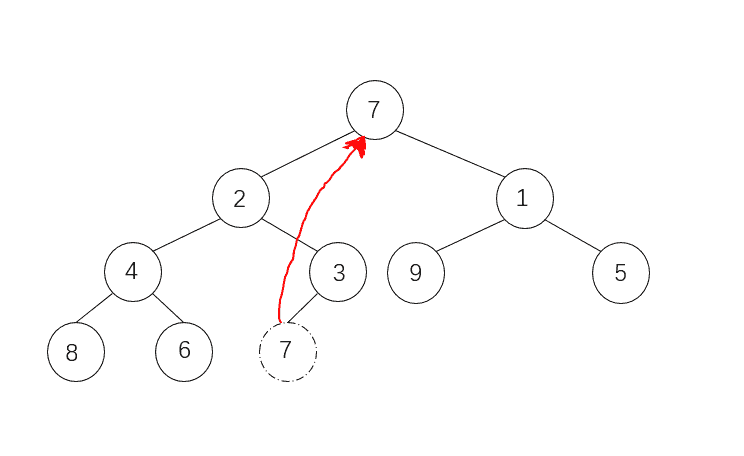

# 二千零一十八、七牛云校招笔试题（卷一）

## 1

92⁵⁰⁰ 除以 11 的余数是 （）

正确答案: A   你的答案: 空 (错误)

```cpp
1
```

```cpp
4
```

```cpp
5
```

```cpp
7
```

本题知识点

七牛云 C++工程师 Java 工程师 2018

讨论

[mEIhUAlU](https://www.nowcoder.com/profile/8230086)

费马小定理(Fermat's little theorem)是[数论](https://baike.baidu.com/item/%E6%95%B0%E8%AE%BA)中的一个重要[定理](https://baike.baidu.com/item/%E5%AE%9A%E7%90%86/9488549)，在 1636 年提出，其内容为： 假如 p 是[质数](https://baike.baidu.com/item/%E8%B4%A8%E6%95%B0)，且 gcd(a,p)=1，那么 a^(p-1)≡1（mod p）**所以这题 92⁵⁰⁰ = (92¹⁰)⁵⁰ %11 = 1**

发表于 2018-03-27 13:45:14

* * *

[lecea](https://www.nowcoder.com/profile/2313460)

92⁵⁰⁰＝(88+4)⁵⁰⁰
根据二项式定理：除以 11 的余数等于 4⁵⁰⁰ 除以 11 的余数
4⁵⁰⁰=(4⁵)¹⁰⁰=1024¹⁰⁰=(93*11+1)⁵
再根据二项式定理除以 11 的余数等于(1)¹⁰⁰ 除以 11 的余数
因此,除以 11 余数为 1,也就是 192⁵⁰⁰ 除以 11 余数为 1.

发表于 2018-04-10 22:52:00

* * *

[知岁寒の松](https://www.nowcoder.com/profile/1620948)

92⁵⁰⁰   除以 11 的余数 与 4⁵⁰⁰ 除以 11 的余数相同 4⁵⁰⁰ = 16 ²⁵⁰ 除以 11 的余数与 5²⁵⁰ 除以 11 的余数相同 5²⁵⁰ = 25¹²⁵ 除以 11 的余数与 3¹²⁵ 除以 11 的余数相同 3¹²⁵ = 243²⁵ 除以 11 的余数与 1²⁵  除以 11 的余数相同 

发表于 2018-03-22 19:50:54

* * *

## 2

现在风靡的狼人杀游戏规则如下，共 12 个人参与，抽签选择 4 个为狼人阵营，8 人为好人阵营。其中 A，B 两名玩家连续三局游戏都属于不同阵营的概率是多少？（）

正确答案: C   你的答案: 空 (错误)

```cpp
0.125
```

```cpp
0.047
```

```cpp
0.088
```

```cpp
0.5
```

本题知识点

七牛云 C++工程师 Java 工程师 2018

讨论

[JoJ](https://www.nowcoder.com/profile/5196535)

一局: 都是狼概率: 4/12 * 4/12=1/9 都是好人概率: 8/12 * 8/12=4/9 不同阵营概率:1 - 1/9 - 4/9= 4/9 三局: (4/9)³

发表于 2018-03-25 17:01:04

* * *

[北北 201803242105156](https://www.nowcoder.com/profile/5738695)

为什么一局不同的概率不是 16/33？

发表于 2018-03-26 21:23:44

* * *

[武培轩](https://www.nowcoder.com/profile/5033606)

**正确答案**C**答案解析**一局游戏中，A，B 两人不在同一阵营概率为，三局游戏为

发表于 2018-04-13 22:02:49

* * *

## 3

以下哪个不属于数据库事务特性（）

正确答案: B   你的答案: 空 (错误)

```cpp
原子性
```

```cpp
可用性
```

```cpp
隔离性
```

```cpp
持久性
```

本题知识点

七牛云 C++工程师 Java 工程师 七牛云 2018

讨论

[知岁寒の松](https://www.nowcoder.com/profile/1620948)

原子性，一致性，隔离性，持久性

发表于 2018-03-22 19:44:41

* * *

[武培轩](https://www.nowcoder.com/profile/5033606)

**正确答案**B**答案解析**数据库事务特性包括原子性、一致性、隔离性、持久性。

发表于 2018-04-13 21:43:49

* * *

[猿来](https://www.nowcoder.com/profile/988142932)

B

发表于 2018-08-07 00:21:11

* * *

## 4

在 TCP 连接中，主动断开的一方发出了 FIN 包之后，socket 处于什么状态？（）

正确答案: B   你的答案: 空 (错误)

```cpp
TIME_WAIT
```

```cpp
CLOSE_WAIT
```

```cpp
CLOSED
```

```cpp
LAST_ACK
```

本题知识点

七牛云 C++工程师 Java 工程师 2018

讨论

[逗比请来的猴子](https://www.nowcoder.com/profile/5312575)


发表于 2018-03-26 19:27:31

* * *

[武培轩](https://www.nowcoder.com/profile/5033606)

**正确答案**B**答案解析**

发表于 2018-04-13 21:46:01

* * *

## 5

以下代码返回的结果可能是 （）

```cpp
int main() {
    fork();
    int i = fork();
    printf("%d\n",i);
}
```

正确答案: D   你的答案: 空 (错误)

```cpp
0
```

```cpp
95928
```

```cpp
95928<div>95929</div>
```

```cpp
96035<div>0</div><div>0</div><div>96036</div>
```

本题知识点

七牛云 C++工程师 Java 工程师 2018 C++ C 语言

讨论

[逗比请来的猴子](https://www.nowcoder.com/profile/5312575)


发表于 2018-03-26 19:36:19

* * *

[太龙达达](https://www.nowcoder.com/profile/316035035)

c 语言的 fork()会创建一个与原来进程几乎完全相同的进程，其中父进程返回值(pid)大于 0，子进程返回值为 0。

发表于 2020-08-05 17:01:32

* * *

[Despacito007](https://www.nowcoder.com/profile/893487814)

反正 fork 了两次，肯定输出 4 个数

发表于 2020-09-08 20:13:24

* * *

## 6

使用 nginx 将 http 请求转发请求到后端服务，后端服务不可用的时候会返回什么状态码？（）

正确答案: D   你的答案: 空 (错误)

```cpp
400
```

```cpp
404
```

```cpp
500
```

```cpp
502
```

本题知识点

七牛云 C++工程师 Java 工程师 2018

讨论

[琳小梁](https://www.nowcoder.com/profile/1328940)

400 - Bad Request，请求无效，说明请求没有提交到后台服务中；404 - Not Found，无法找到服务器；500 - Not Implemented，服务器不支持当前请求所需要的某个功能；502 - Bad Gateway，作为网关或者***工作的服务器尝试执行请求时，从上游服务器接收到无效的响应网关错误。是由于对用户访问请求的响应超时造成的

发表于 2018-03-23 00:30:29

* * *

## 7

[0 ,2,1,4,3,9,5,8,6,7] 是以数组形式存储的最小堆，删除堆顶元素 0 后的结果是？（）

正确答案: D   你的答案: 空 (错误)

```cpp
[2,1,4,3,9,5,8,6,7]
```

```cpp
[1,2,5,4,3,9,8,6,7]
```

```cpp
[2,3,1,4,7,9,5,8,6]
```

```cpp
[1,2,5,4,3,9,7,8,6]
```

本题知识点

七牛云 C++工程师 Java 工程师 2018

讨论

[琳小梁](https://www.nowcoder.com/profile/1328940)

小顶堆：根节点的值总是小于等于子节点的值看图：移走 0 以后，把最末尾的 7 移到顶部
1 上浮，7 下沉到 1 的位置5 上浮，7 下沉到 5 的位置完成排序，顺序输出。

发表于 2018-03-23 00:50:53

* * *

## 8

下面哪种排序算法对序列[8,10,35,27,87] 最快？（）

正确答案: B   你的答案: 空 (错误)

```cpp
快速排序
```

```cpp
冒泡排序
```

```cpp
归并排序
```

```cpp
希尔排序
```

本题知识点

七牛云 C++工程师 Java 工程师 2018

讨论

[游客 _34907](https://www.nowcoder.com/profile/9669724)

初始序列接近有序时，冒泡排序和直接插入排序是最快的

发表于 2018-03-25 13:34:37

* * *

[武培轩](https://www.nowcoder.com/profile/5033606)

**正确答案**B**答案解析**当给定序列接近有序时，用冒泡和插入排序比较快。

编辑于 2018-04-13 22:09:23

* * *

## 9

5 个进程共享同一程序段，而且每次最多允许 3 个进程进入该程序段，则信号量的变化范围是（）。

正确答案: D   你的答案: 空 (错误)

```cpp
4, 3, 2, 1, 0
```

```cpp
3, 2, 1, 0, -1
```

```cpp
5, 4, 3, 2, 1
```

```cpp
3, 2, 1, 0, -1, -2
```

本题知识点

七牛云 C++工程师 Java 工程师 2018

讨论

[lecea](https://www.nowcoder.com/profile/2313460)

程序段最多允许三个进程进入，则表示资源的数目为 3，因此，信号量初值为 3，每进入一个进程，信号量的值减 1，当信号量的值减为 0 时，表示三个进程均进入程序段，此时若再有一个进程请求进入执行 P 操作，则信号量的值减为-1，进程阻塞。一共有五个进程，所以信号量的值最小为-2。因此信号量的值取值范围为 3，2，1，0，-1，-2。因此应该选 D。

发表于 2018-04-11 11:22:34

* * *

[武培轩](https://www.nowcoder.com/profile/5033606)

**正确答案**D**答案解析**程序段每次最多允许三个进程进入，则表示资源的数目为 3，因此，信号量初值为 3，每进入一个进程，信号量的值减 1，当信号量的值减为 0 时，表示三个进程均进入程序段，此时若再有一个进程请求进入执行 P 操作，则信号量的值减为-1，进程阻塞。一共有五个进程，所以信号量的值最小为-2。因此信号量的值取值范围为 3，2，1，0，-1，-2。

发表于 2018-04-13 22:11:54

* * *

[TripRoad、](https://www.nowcoder.com/profile/4407173)

本题目考查信号量的取值范围。程序段最多允许三个进程进入，则表示资源的数目为 3，因此，信号量初值为 3，每进入一个进程，信号量的值减 1，当信号量的值减为 0 时，表示三个进程均进入程序段，此时若再有一个进程请求进入执行 P 操作，则信号量的值减为-1，进程阻塞。一共有四个进程，所以信号量的值最小为-1。因此信号量的值取值范围为 3，2，1，0，-1。因此应该选 B。

发表于 2018-03-25 17:51:13

* * *

## 10

深度为 K 的完全二叉树至少有 1 个节点，至多有 2 个节点。

你的答案 (错误)

12 参考答案 (1) （2^(K-1)）
(2) （2^K-1）

本题知识点

七牛云 C++工程师 Java 工程师 2018

讨论

[武培轩](https://www.nowcoder.com/profile/5033606)

深度为 K 的完全二叉树至少有 2^(k-1)个节点，至多有 2^k-1 个 节点。

发表于 2018-04-13 21:54:03

* * *

[┈┾醉意流年っ](https://www.nowcoder.com/profile/9094647)

第 k 层最小有 1 个节点 最多有 2^(k-1)个节点

发表于 2018-03-27 14:38:34

* * *

[海康：MEVSAB](https://www.nowcoder.com/profile/447239166)

写了
1 2^(k-1)2 2^k-1 愣是错了，答案竟然还在外面套了个()，改卷的时候也会有这坑么……

发表于 2019-04-23 15:04:55

* * *

## 11

假设 A = 0x123456 ，在大端模式下首字节为 1 ，在小端模式下首字节为 2 。

你的答案 (错误)

12 参考答案 (1) 0x12
(2) 0x56

本题知识点

七牛云 C++工程师 Java 工程师 2018

讨论

[知岁寒の松](https://www.nowcoder.com/profile/1620948)

小端两个两个倒着显示

编辑于 2018-03-22 19:57:23

* * *

## 12

（简答题）typedef char *String_t; 和 #define String_d char *; 这两句在使用上有什么区别？

你的答案

本题知识点

七牛云 C++工程师 Java 工程师 2018

讨论

[lecea](https://www.nowcoder.com/profile/2313460)

typedef char *String_t 定义了一个新的类型别名，有类型检查 #define String_d char * 只是做了个简单的替换，无类型检查 前者在编译的时候处理，后者在预编译的时候处理。

编辑于 2018-04-12 11:16:55

* * *

[undefined21](https://www.nowcoder.com/profile/4747469)

String_t a,b,c; //3 个指针 char*变量 String_d a,b,c; //a 是 char*变量，b,c 是 char 变量

发表于 2018-05-12 17:44:16

* * *

## 13

（简答题）请描述 TCP 三次握手的全过程。

你的答案

本题知识点

七牛云 C++工程师 Java 工程师 2018

讨论

[武培轩](https://www.nowcoder.com/profile/5033606)

1.  第一次握手：Client 将标志位 SYN 置为 1，随机产生一个值 seq=J，并将该数据包发送给 Server，Client 进入 SYN_SENT 状态，等待 Server 确认。
2.  第二次握手：Server 收到数据包后由标志位 SYN=1 知道 Client 请求建立连接，Server 将标志位 SYN 和 ACK 都置为 1，ack=J+1，随机产生一个值 seq=K，并将该数据包发送给 Client 以确认连接请求，Server 进入 SYN_RCVD 状态。
3.  第三次握手：Client 收到确认后，检查 ack 是否为 J+1，ACK 是否为 1，如果正确则将标志位 ACK 置为 1，ack=K+1，并将该数据包发送给 Server，Server 检查 ack 是否为 K+1，ACK 是否为 1，如果正确则连接建立成功，Client 和 Server 进入 ESTABLISHED 状态，完成三次握手，随后 Client 与 Server 之间可以开始传输数据了。

[`www.cnblogs.com/wupeixuan/p/8639469.html`](http://www.cnblogs.com/wupeixuan/p/8639469.html)

发表于 2018-04-13 21:32:13

* * *

[赤坂龙之介](https://www.nowcoder.com/profile/190158)

TCP 建立连接的过程叫做三次握手，握手需要在客户和服务器之间交换三个 TCP 报文段。

假设 A 运行的是 TCP 客户程序，B 运行的是 TCP 服务器程序。

> ①A 先创建传输控制模块(TCB)，然后发送请求报文段，此时首部中的同部位 SYN=1，同时选择一个随机序号 seq=x。TCP 规定,SYN=1 的报文段不能携带数据，但是要消耗掉一个序号。
> 
> ②B 收到连接请求后，如同意连接，就向 A 发送确认。在确认中应把 SYN 和 ACK 都置 1，确认号为 ack=x+1，序号 seq=y。这个报文也不能携带数据，同样消耗序号
> 
> ③TCP 客户 A 在收到 B 的确认之后，还要向 B 给出确认。确认报文 ACK 置 1，确认号 ack=y+1，而自己的确认号 seq=x+1.

经过上述三次握手之后，TCP 连接已经建立。

发表于 2018-04-11 13:14:05

* * *

[养乐多か](https://www.nowcoder.com/profile/344468247)

第一次握手：客户端发送 syn 包 (syn=x) 到服务器，并进入 SYN_SEND 状态，等待服务器确认； 第二次握手：服务器收到 syn 包，必须确认客户的 SYN（ack=x+1），同时自己也发送一个 SYN 包（syn=y），即 SYN+ACK 包，此时服务器进入 SYN_RECV 状态； 第三次握手：客户端收到服务器的 SYN＋ACK 包，向服务器发送确认包 ACK(ack=y+1)，此包发送完毕，客户端和服务器进入 ESTABLISHED 状态，完成三次握手。 握手过程中传送的包里不包含数据，三次握手完毕后，客户端与服务器才正式开始传送数据。理想状态下，TCP 连接一旦建立，在通信双方中的任何一方主动关闭连接之前，TCP 连接都将被一直保持下去

发表于 2020-07-08 08:26:03

* * *

## 14

（编程题）请实现一个算法可以将任一给定的数组元素反转，如给定数组 [1, 3, 5, 2, 6] 输出为 [6, 2, 5, 3, 1]，要求 O(1) 的空间复杂度。

你的答案

本题知识点

七牛云 C++工程师 Java 工程师 2018

讨论

[打工不可能打工的](https://www.nowcoder.com/profile/4256577)

```cpp
import java.util.*;

public class Main {

	    public static int[] reverseArray(int[] arr) {

	        if (arr == null || arr.length == 0) {

	            return null;

	        }

	        int left = 0;

	        int right = arr.length - 1;

	        while (left < right) {

	            int tmp = arr[left];

	            arr[left++] = arr[right];

	            arr[right--] = tmp;

	        }

	        return arr;

	    }

}
```

发表于 2018-09-12 18:17:22

* * *

[lecea](https://www.nowcoder.com/profile/2313460)

```cpp
 #include<iostream>
 using namespace std;

 int main(){  int array[1000];  int n;  cin>>n;  for(int i=0;i<n;i++){  cin>>array[i];   }   for(int j=0;j<n/2;j++){    int temp = array[n-j-1];    array[n-j-1] = array[j];    array[j] = temp;   }   for(int i=0;i<n;i++){    cout<<array[i]<<" ";   }   return 0;
 }

```

编辑于 2018-04-11 10:46:28

* * *

[亲爱的暴躁的热心网友皮皮文](https://www.nowcoder.com/profile/3496468)

```cpp

```
# coding=utf-8 class Solution: def sort_way(l=list): return l[::-1]
s=Solution()
s.sort_way(l)
```cpp

```

发表于 2018-07-04 15:04:57

* * *

## 15

（编程题）输入一个整型数组，子数组为这个数组中连续的一个或者多个整数组成的数组。求所有子数组中的和的最大值。要求时间复杂度为 O(n)。例如，输入数组为[1, -3, 9, 10, -2, 3, -6, 5]。和最大的子数组为 [9, 10, -2, 3]，因此输出为该子数组的和 20。

你的答案

本题知识点

七牛云 C++工程师 Java 工程师 2018

讨论

[武培轩](https://www.nowcoder.com/profile/5033606)

[剑指 Offer-连续子数组的最大和](http://www.cnblogs.com/wupeixuan/p/8623206.html)

```cpp
public class Solution01 {
    public static void main(String[] args) {
        int[] arr = {1, -3, 9, 10, -2, 3, -6, 5};
        System.out.println(FindGreatestSumOfSubArray(arr));
    }
    public static int FindGreatestSumOfSubArray(int[] array) {
        if(array.length==0)
            return 0;
        int sum = array[0];//保存每组的和
        int maxSum = array[0];//连续子数组最大和
        //动态规划
        for(int i = 1;i<array.length;i++){
            sum = Math.max(sum+array[i],array[i]);
            maxSum = Math.max(sum,maxSum);
        }
        return maxSum;
    }
} 
```

发表于 2018-04-14 15:19:58

* * *

[碗底有沧桑](https://www.nowcoder.com/profile/4495842)

```cpp
def maximunSubarray(list):
    sum, result = 0, min(list)-1
    for i in range(0, len(list)):
        sum += list[i]
        if sum>result:
            result = sum
        if sum<0:
            sum = 0
    return result

print(maximunSubarray([1, -3, 9, 10, -2, 3, -6, 5]))

```

发表于 2018-04-11 17:27:52

* * *

[尚手直心木](https://www.nowcoder.com/profile/950449496)

int k=num.size(); vector<int> dp(numsSize);int dp[0]=num[0];int RES=num[0];if(k<=0) return num[0];for(int i=1;i<k;i++){ dp[i]=max{dp[i-1]+num[i],num[i]} RES=max{dp[i],RES}}

发表于 2021-03-11 11:07:17

* * *

## 16

（论述题）一个是从零开始的前沿技术的成败未知的产品研发团队，一个是服务于海量用户的成熟稳定的正常演进的产品研发团队，你会选择加入哪一个？为什么？对你来说面临的机遇和挑战是什么？你给这个团队带来的价值是什么？

你的答案

本题知识点

七牛云 C++工程师 Java 工程师 2018

讨论

[restartnow1](https://www.nowcoder.com/profile/2140695)

我想进入的是那个拥有前沿技术的团队，这样的团队是有梦想和拼劲的，当然进入这个团队的人都不是什么坐着等着吃的人，有这帮人，那么不会差到哪里去的！

发表于 2018-04-04 16:00:35

* * *

[哈哈哈哈~~](https://www.nowcoder.com/profile/2700730)

个人感觉这种题目没有固定的答案，只需要讲的合理就行。

发表于 2018-03-24 00:01:36

* * *

[冋宇同桌](https://www.nowcoder.com/profile/232185)

话说这种题目怎么答比较好 = =

发表于 2018-03-23 10:36:05

* * *

## 17

1. 三个进程 A，B，C。单核 CPU 执行时，需要以下资源。其中优先级高的进程可以抢占 CPU 资源但不能抢占 IO 资源。所有任务执行完毕时候，需要多长时间？（）

| 进程 | CPU (ms) | IO(ms) | 执行顺序  | 优先级 |
| A | 40 | 60 | 先 IO 后 CPU | 高 |
| B | 20 | 50 | 先 CPU 后 IO  | 中 |
| C | 30 | 30 | 先 CPU 后 IO  | 低 |

正确答案: C   你的答案: 空 (错误)

```cpp
90ms
```

```cpp
130ms
```

```cpp
A. 140ms
```

```cpp
A. 170ms
```

本题知识点

七牛云 C++工程师 Java 工程师 2018

讨论

[琳小梁](https://www.nowcoder.com/profile/1328940)

通过一个甘特图来解释一下。优先级：A>B>CA 先 I/O 后 CPU，这时候 CPU 是空闲的。B 先 CPU 后 I/O，C 先 CPU 后 I/O，B 的优先级比 C 高，B 先进行 CPU 操作；B 执行完 CPU 操作以后 A 还在进行 I/O 操作，这时候 C 进行 CPU 操作，B 等 A 的 I/O 执行完以后再进行操作；C 执行完 CPU 操作以后，A 还没执行完 I/O 操作，C 也等着；A 执行完 I/O 操作以后，B 比 C 的优先级高，B 进行 I/O 操作，A 进行 CPU 操作，C 等候。B 执行完 I/O 操作以后，C 再操作这是操作系统中的调度部分的知识~最近刚学完~

编辑于 2018-03-23 00:23:30

* * *

## 18

1. 假设某一虚拟存储系统采用先进先出（FIFO）页面淘汰算法，有一个进程在内存中占 3 页（开始时内存为空），当访问如下页面序列号后 1,2,3,1,2,4,2,3,5,3,4,5,6 会产生 1 次缺页。

你的答案 (错误)

1 参考答案 (1) 6

本题知识点

七牛云 C++工程师 Java 工程师 2018

讨论

[春田花花同学](https://www.nowcoder.com/profile/199395)

**访问 1，缺页，调入 1，内存中 1****访问 2，缺页，调入 2，内存中 1，2****访问 3，缺页，调入 3，内存中 1，2，3**访问 1，不缺页，内存中 1，2，3 访问 2，不缺页，内存中 1，2，3**访问 4，缺页，调入 4，淘汰 1，内存中 4，2，3**访问 2，不缺页，内存中 4，2，3 访问 3，不缺页，内存中 4，2，3**访问 5，缺页，调入 5，淘汰 2，内存中 4，5，3**访问 3，不缺页，内存中 4，5，3 访问 4，不缺页，内存中 4，5，3 访问 5，不缺页，内存中 4，5，3**访问 6，缺页，****调入 6，淘汰 3，****内存中 4，5，6**

发表于 2018-04-13 20:40:20

* * *

[冋宇同桌](https://www.nowcoder.com/profile/232185)

最开始的 3 次也要算上～

发表于 2018-03-23 10:38:12

* * *

[plzGEtoUtofmYHEAD](https://www.nowcoder.com/profile/1251387)

不看题... 是 FIFO 理解成 LRU 去做了

发表于 2019-07-15 11:28:29

* * *

## 19

在 Bash Shell 中，想要获得当前所在文件夹路径，应该使用的命令是 1。

你的答案 (错误)

1 参考答案 (1) pwd 或 echo $PWD

本题知识点

七牛云 C++工程师 Java 工程师 2018

讨论

[gdut17](https://www.nowcoder.com/profile/279358190)

pwd

发表于 2020-06-05 19:10:33

* * *

[海康：MEVSAB](https://www.nowcoder.com/profile/447239166)

根本没有给作答的机会啊喂

发表于 2019-04-23 15:11:29

* * *

## 20

一无符号整数 n，现对其二进制位的各个位进行如下变换，保留其中最地位的 1，其他为 1 的位全部清零，则变换后整数值为 1。

你的答案 (错误)

1 参考答案 (1) n&amp;~(n-1) 或 n&amp; ^(n-1)

本题知识点

七牛云 C++工程师 Java 工程师 2018

讨论

[谁的昵称](https://www.nowcoder.com/profile/1134601)

求最低位为 1 的权值：n - (n&(n-1)).   n &(n-1)去掉最低位的 1

发表于 2018-04-12 12:40:59

* * *