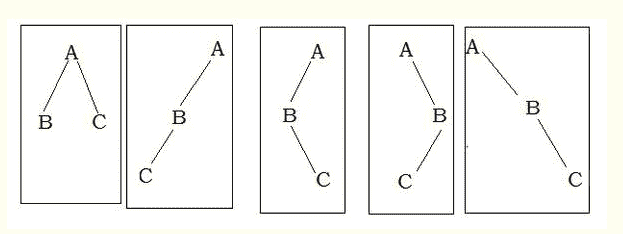
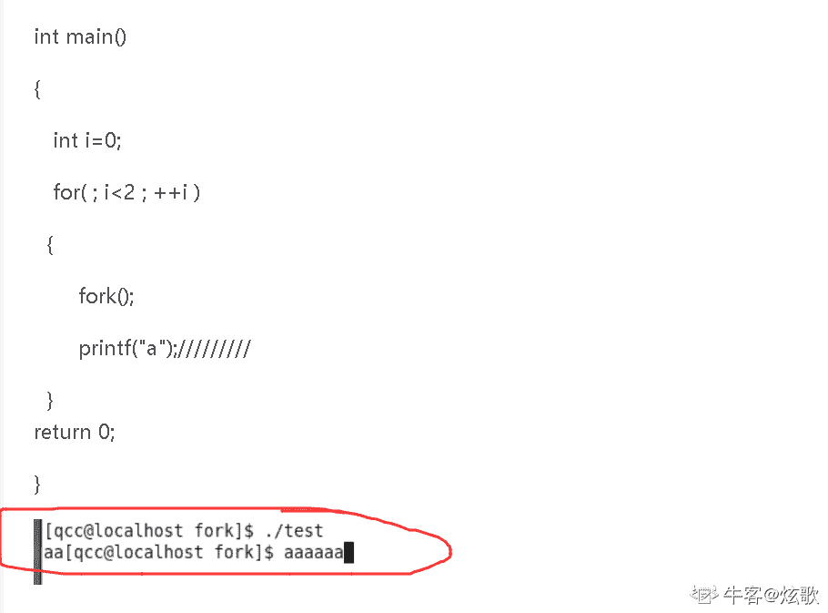

# 二千零一十八、七牛云校招笔试题（卷二）

## 1

找出规律填写空白的数字，2, 3, 7, 16, ___, 57, 93 （）

正确答案: C   你的答案: 空 (错误)

```cpp
20
```

```cpp
25
```

```cpp
32
```

```cpp
48
```

本题知识点

七牛云 C++工程师 Java 工程师 2018

讨论

[letangers](https://www.nowcoder.com/profile/7825733)

后一个数与前一个相差 1²  2²  3²  ，到空格处应该和 16 相差 16,所以是 32

发表于 2018-04-08 20:07:21

* * *

[wbpcode](https://www.nowcoder.com/profile/1208430)

依次增长 1 的平方，2 的平方，3 的平方....

发表于 2018-04-11 17:35:49

* * *

## 2

在局域网上执行 ping www.qiniu.com 没有涉及到的网络协议是？（）

正确答案: C   你的答案: 空 (错误)

```cpp
ARP
```

```cpp
DNS
```

```cpp
TCP
```

```cpp
ICMP
```

本题知识点

七牛云 C++工程师 Java 工程师 2018

讨论

[lecea](https://www.nowcoder.com/profile/2313460)

在网络层 A,B,D 都会用到，TCP 传输层才会用到。

编辑于 2018-04-10 22:02:26

* * *

[逸水之彬](https://www.nowcoder.com/profile/5303693)

ping 命令用于检查网络不通 ARP 协议只用在局域网，用来将 IP 地址解析为 MAC 地址 ICMP 是网络层协议，用于在主机和路由器之间传递控制信息。

发表于 2018-04-06 10:39:51

* * *

## 3

有三个节点，可以构成多少种二叉树？（）

正确答案: C   你的答案: 空 (错误)

```cpp
3
```

```cpp
4
```

```cpp
5
```

```cpp
6
```

本题知识点

七牛云 C++工程师 Java 工程师 2018

讨论

[mEIhUAlU](https://www.nowcoder.com/profile/8230086)

其实这是卡特兰数的一个公式。n 个节点可以构成 C(2n,n) / (1+n) 个不同的树

发表于 2018-03-28 17:55:04

* * *

[33 平凡的世界](https://www.nowcoder.com/profile/5027098)



发表于 2018-08-11 19:13:57

* * *

[凡大大](https://www.nowcoder.com/profile/1891166)

这题很简单，画个图就行了。

发表于 2018-03-28 17:05:25

* * *

## 4

下列对于数据库索引的说法一定是错误的（）

正确答案: A   你的答案: 空 (错误)

```cpp
索引不会影响表的更新、插入和删除操作的效率
```

```cpp
全表扫描不一定比使用索引执行效率低
```

```cpp
对于只有很少数据值的列，不应该创建索引
```

```cpp
索引可以加速表和表之间的连接查询
```

本题知识点

七牛云 C++工程师 Java 工程师 2018

讨论

[lecea](https://www.nowcoder.com/profile/2313460)

当进行更新、插入和删除操作时，索引要进行动态保护，影响效率。

发表于 2018-04-11 22:38:19

* * *

## 5

以下程序输出（）个“-”

```cpp
int main(void) {
    int i;
    for (i = 0; i < 2; i++) {
        fork();
        printf("-");
    }
    return 0;
}
```

正确答案: C   你的答案: 空 (错误)

```cpp
2
```

```cpp
4
```

```cpp
6
```

```cpp
8
```

本题知识点

七牛云 C++工程师 2018 C++ C 语言

讨论

[牛客越学越牛](https://www.nowcoder.com/profile/86928299)

这道题考的是子进程和行缓冲 printf（“- \n”）直接会输出一个 “-” 而 printf("-")没有换行符不会直接输出，会放在缓冲区中等到程序结束后由系统处理输出 第一次循环中经过 fork 后有两个进程 经过 printf("-")之后两个进程缓冲区中都有一个“-” 第二次进入循环经过 fork 后会有四个进程，且由于 fork 出的子进程会复制父进程的缓冲区，这时四个进程都有一个"-" 再经过 printf("-")之后四个进程都有两个"-" 这时程序结束时会将缓冲区的内容全部输出，即 8 个"-"

发表于 2020-08-21 23:50:02

* * *

[炫歌](https://www.nowcoder.com/profile/622959792)

直接上图：  输出 6 个

发表于 2020-08-04 21:18:45

* * *

[菜菜向前冲](https://www.nowcoder.com/profile/483264026)

答案：8                                                进程本身                                                    | fork
                    子进程  **-**                             |                    进程本身   **-**
                         |fork                               |                         |fork
    子进程                        该子进程本身   |    子进程                      该进程本身（拷贝了其父进程                                   |（拷贝了其父进程          的缓冲区）                                          |   的缓冲区）    **- -**                                      ** -  **              |      **- -                                 -**

发表于 2022-01-28 16:29:08

* * *

## 6

Linux 下两个进程同时打开同一个文件，这时以下描述正确的是：（）

正确答案: D   你的答案: 空 (错误)

```cpp
两个进程中会生成同一个 fd
```

```cpp
如果有一个进程删除该文件，另一个进程会立刻出现读/写文件失败
```

```cpp
操作系统会禁止两个进程同时向文件进行写入操作
```

```cpp
进程可以通过系统调用对文件加锁，从而实现对文件内容的保护
```

本题知识点

七牛云 C++工程师 Java 工程师 2018

讨论

[一个眼里只有学习的男人](https://www.nowcoder.com/profile/5039689)

*   ```cpp
    两个进程中分别产生生成两个独立的 fd
    ```

    *   ```cpp
    两个进程可以任意对文件进行读写操作，操作系统并不保证写的原子性
    ```

    *   ```cpp
    进程可以通过系统调用对文件加锁，从而实现对文件内容的保护
    ```

    *   ```cpp
    两个进程可以分别读取文件的不同部分而不会相互影响
    ```

    *   ```cpp
    一个进程对文件长度和内容的修改另外一个进程可以立即感知
    ```

发表于 2018-04-14 13:15:42

* * *

## 7

255.255.254.0 网段最多能支持 _____ 台主机？ （）

正确答案: C   你的答案: 空 (错误)

```cpp
254
```

```cpp
255
```

```cpp
510
```

```cpp
512
```

本题知识点

七牛云 C++工程师 Java 工程师 2018

讨论

[沐抒](https://www.nowcoder.com/profile/6166512)

255.255.254.0 的二进制：
11111111 11111111 11111110 00000000

由二进制可以得出主机数为 9 个二进制位 (2⁹)

因为在每个网段中都包括一个**广播地址** 和 一个**网络地址**
所以实际子网可容纳主机数为：2⁹ - 2 = 512 - 2 = 510

发表于 2018-04-13 11:46:59

* * *

## 8

如果一个数组（长度超过 10 万）仅由 0-10 的整数组成，以下哪种排序算法对该数组排序效率最高？（）

正确答案: C   你的答案: 空 (错误)

```cpp
快速排序
```

```cpp
冒泡排序
```

```cpp
计数排序
```

```cpp
希尔排序
```

本题知识点

七牛云 C++工程师 Java 工程师 2018

讨论

[lecea](https://www.nowcoder.com/profile/2313460)

它是一个不需要比较的，类似于桶排序的线性时间排序算法。该算法是对已知数量范围的数组进行排序。其时间复杂度为 O(n)，适用于小范围集合的排序。

发表于 2018-04-11 22:46:02

* * *

## 9

下面关于 Linux 文件系统的描述中错误的是：（）

正确答案: A   你的答案: 空 (错误)

```cpp
inode 和文件名是一一对应的
```

```cpp
通过 inode 可以获得文件占用的块数
```

```cpp
文件执行了删除操作之后，仍可通过之前创建的硬链接进行正常访问
```

```cpp
inode 描述了文件大小和指向数据块的指针
```

本题知识点

七牛云 C++工程师 Java 工程师 2018

讨论

[wbpcode](https://www.nowcoder.com/profile/1208430)

一个 inode 可能对应多个文件名（硬链接）

发表于 2018-04-11 17:41:23

* * *

## 10

21 点是一种扑克游戏。如果玩家拿到扑克牌的点数总和超过 21 点则称为爆点，被判失败。其中 A 牌可以被记为 11 点或者 1 点，J, Q, K 都记为 10 点。如果用一副牌玩游戏（52 张牌），玩家手上拿到一个 J 和 7。那他再抽两张牌会爆点的可能性约有多大？（C）

正确答案: C   你的答案: 空 (错误)

```cpp
65%
```

```cpp
85.3%
```

```cpp
96.4%
```

```cpp
99.8%
```

本题知识点

七牛云 C++工程师 Java 工程师 2018

讨论

[HENRY58](https://www.nowcoder.com/profile/5748362)

可以通过求两张牌点数和小于 5 的概率来反过来求爆牌的概率和为 2：A+A 和为 3：A+2 和为 4：A+3、2+2 所以还要注意的是这样算是顺序不同看作两种不同的结果（也可以当做相同来算），即先抽到 A 再抽到 2 和先抽到 2 再抽到 A 是两种不同的结果

发表于 2018-03-27 15:28:47

* * *

[牛客 145121328 号](https://www.nowcoder.com/profile/145121328)

剩余 50 张牌，取 2 张，总的可能性是 C(2，50)；先列举出两张牌加起来不大于 4 的个数为：44；则概率为：100% - （44 / C(2，50) ）

发表于 2021-11-14 15:36:23

* * *

[晨星 17](https://www.nowcoder.com/profile/1670194)

就是求两张牌加起来大于 4 的可能，

发表于 2018-03-27 13:04:46

* * *

## 11

5 个骰子，六个面分别标有 1-6，现在将五个同时随机投掷，五个点数之和概率最大的点数是 1 。

你的答案 (错误)

1 参考答案 (1) 17, 18。

本题知识点

七牛云 C++工程师 Java 工程师 2018

讨论

[33 平凡的世界](https://www.nowcoder.com/profile/5027098)

单个骰子的期望为 ：
1*1/6 + 2*1/6 + 3*1/6 + 4*1/6 + 5*1/6 + 6*1/6 = 3.5 
5 个骰子相互独立，期望就是 3.5*5=17.5，17 或 18 为最接近的点数。

发表于 2018-08-11 19:44:55

* * *

[冋宇同桌](https://www.nowcoder.com/profile/232185)

算期望

发表于 2018-03-23 13:27:09

* * *

## 12

验证远端服务器（IP：180.97.72.166）的 1935 端口是否开启的命令是 1。

你的答案 (错误)

1 参考答案 (1) telnet 180.97.72.166 1935

本题知识点

七牛云 C++工程师 Java 工程师 2018

讨论

[冋宇同桌](https://www.nowcoder.com/profile/232185)

```cpp
tcping 180.97.72.166 1935
```

发表于 2018-03-23 13:27:35

* * *

## 13

根据下面递归函数：调用函数 fun（2），返回值是 1 。

```cpp
int fun(int n) {
if(n==5)
return 2;
else
return 2*fun(n+1);
}
```

你的答案 (错误)

1 参考答案 (1) 16

本题知识点

七牛云 C++工程师 Java 工程师 2018

讨论

[沐抒](https://www.nowcoder.com/profile/6166512)

n=2 --> return 2 * fun(2 + 1)
n=3 --> return 2 * fun(3 + 1)
n=4 --> return 2 * fun(4 + 1)

n=5 --> if(n==2)条件满足结束递归,此时 return 2
所以递归结果为 2 * fun(2 * fun(2 * fun(2) ))

接着逐次向外打开
n=4 --> 2 * **fun(4 + 1)** = 2 * 2 = 4
                     |____________                                              |n=3 --> 2 * **fun(3 + 1)** = 2 * fun(4 + 1) = 2 * 4 = 8
                    |____________
                                              |
n=2 --> 2 * **fun(2 + 1)** = 2 * fun(3 + 1) = 2 * 8 = 16

发表于 2018-04-13 12:52:20

* * *

[晨星 17](https://www.nowcoder.com/profile/1670194)

就是 4 个 2 相乘

发表于 2018-03-27 13:05:45

* * *

## 14

有一组关键字序列 [5, 8, 14, 20, 31, 55, 78, 81, 93, 97, 111]，使用二分法查找关键字 97 需要进行 1 次比较。

你的答案 (错误)

1 参考答案 (1) 3 次

本题知识点

七牛云 C++工程师 Java 工程师 2018

讨论

[何必讨好✘๊](https://www.nowcoder.com/profile/505354704)

我填的 3   答案 3 次。。。。。

发表于 2019-10-17 16:05:24

* * *

[ζ゛雨过天晴ヾ](https://www.nowcoder.com/profile/1209199)

四次吧，55 81 93 97

发表于 2018-05-08 16:30:23

* * *

## 15

（简答题）在 Linux 中，file.sh 的权限用数值表示是 645。请简述这个文件权限数值的含义。

你的答案

本题知识点

七牛云 C++工程师 Java 工程师 2018

讨论

[左将离](https://www.nowcoder.com/profile/745917487)

一个文件的权限，用字母表示为：rwx rwx rwx 分为三段。分别是所有者，用户组, 所有人 6 表示所有者具有 读写的权限 4 表示用户组具有 读的权限 5 表示所有人具有 读跟执行的权限

发表于 2019-10-16 22:05:25

* * *

[***nLiu](https://www.nowcoder.com/profile/288884503)

6 = 4+2 = read + write4 = 4 = read
5 =4+1 = read + execute

发表于 2018-10-31 14:30:13

* * *

[肖大胖胖胖](https://www.nowcoder.com/profile/4026131)

6 110 读写  root4 100 读     用户组 5 101 读执行  游客

发表于 2018-04-13 17:16:09

* * *

## 16

（简答题）一个单向链表从头到尾遍历每个节点只会访问到一次，则为无环链表，如果存在节点会被重复遍历，则为有环链表。试解答：(1)如何判断一个单向链表是否存在环？（4 分）(2)如果链表有环，如何找到环的入口节点？（8 分）(3)如何计算环的长度？（3 分）

你的答案

本题知识点

七牛云 C++工程师 Java 工程师 2018

讨论

[lecea](https://www.nowcoder.com/profile/2313460)

(1) 方法一：使用 map 来记录链表中的结点是否被访问，若存在被访问两次的结点则说明存在环。

1.  #include <iostream>
2.  #include <map>
3.  using namespace std;
4.  map<node*,int>m;
5.  bool IsLoop(node *head)
6.  {
7.  if(!head)
8.  return false;
9.  node *p=head;
10.  while(p)
11.  {
12.  if(m[p]==0) // 默认值都是 0
13.  m[p]=1;
14.  else if(m[p]==1)
15.  return true;
16.  p=p->next;
17.  }
18.  }

方法二：设置两个指针 pSlow，pFast，慢的一次跳一步，快的一次跳两步，往链表末端移动，若慢指针追上了快指针，则说明链表存在环。此方法速度很快且不需要额外的存储空间。

1.  bool IsLoop(node *head)
2.  {
3.  node *pSlow=head;
4.  node *pFast=head;
5.  while(pSlow!=NULL && pFast!=NULL)
6.  {
7.  pSlow=pSlow->next;
8.  pFast=pFast->next->next;
9.  if(pSlow==pFast)
10.  return true;
11.  }
12.  return false;
13.  }

(2) class Solution {
public:
    ListNode* EntryNodeOfLoop(ListNode* pHead)
    {
        if(pHead==NULL||pHead->next==NULL){
            return NULL;
        }
        ListNode* slow = pHead;
        ListNode* fast = pHead;
        while(fast!=NULL && fast->next!=NULL){
            slow = slow->next;
            fast = fast->next->next;
            if(slow==fast){
                ListNode* p = pHead;
                ListNode* q = slow;  //相当于让 q 指向了 m1
                while(p!=q){
                    p = p->next;
                    q = q->next;
                }
                if(p==q){
                    return q;
                }
            }
        }
        return NULL;
    }
};
（3）class Solution {
public:
    ListNode* EntryNodeOfLoop(ListNode* pHead)
    {        int l=0;        if(pHead==NULL||pHead->next==NULL){
            return NULL;
        }
        ListNode* slow = pHead;
        ListNode* fast = pHead;
        while(fast!=NULL && fast->next!=NULL){
            slow = slow->next;
            fast = fast->next->next;
            if(slow==fast){
                ListNode* p = pHead;
                ListNode* q = slow;  //相当于让 q 指向了 m1
                while(p!=q){
                    p = p->next;
                    q = q->next;                    l++;
                }
                if(p==q){
                    return l;
                }
            }
        }
        return 0;
    }
};

编辑于 2018-04-12 09:19:45

* * *

## 17

（编程题）请编写一个函数，获得输入整数的平方根，如果结果不是整数则向下取整。

你的答案

本题知识点

七牛云 C++工程师 Java 工程师 2018

讨论

[neko_io](https://www.nowcoder.com/profile/952928038)

牛顿迭代法

```cpp
func Sqrt(x int) int {
	if x < 2 {
		return x
	}
	y := x / 2
	for y*y > x {
		y = (y + x/y) / 2
	}
	return int(y)
}
```

发表于 2020-04-24 16:03:35

* * *

[lecea](https://www.nowcoder.com/profile/2313460)

 **1.  #include <stdio.h>  
2.  #include <math.h>  

4.  int main()  
5.  {  
6.  int a;  
7.  double b;  
8.  scanf("%d",&a);  
9.  if( a > 0 && a < 1000 )  
10.  {  
11.  b = sqrt(a);  
12.  printf("%2.0f\n",b);  
13.  }  
14.  else  
15.  printf("error!");  

17.  return 0;  
18.  }** 

发表于 2018-04-12 09:24:01

* * *

## 18

（编程题）请使用字符串来表达任意大小的长整数，使用你熟悉的编程语言编写程序来计算两个长整数之和。例如:sum(“123”,”456”) 返回的结果是”579”。

你的答案

本题知识点

七牛云 C++工程师 Java 工程师 2018

讨论

[lecea](https://www.nowcoder.com/profile/2313460)

```cpp
#include<algorithm>  
#include <stdio.h>
#include <string.h>

using namespace std;  
char num1[111], num2[111], num3[111];  
int L, M;  
int mark;  

void add(char a[], char b[], char c[]){  
    int len1 = strlen(a);  
    int len2 = strlen(b);  
    int i, j;  
    int l = 0;  
    L = 0;  
    int temp;  
    for(i = 0; i < len1/2; i++){  
        temp = a[i];  
        a[i] = a[len1-1-i];  
        a[len1-1-i] = temp;  
    }//把输入的两个大数都逆序排列，这个循环很常见，可以专门写一个函数。  
    for(i = 0; i < len2/2; i++){  
        temp = b[i];  
        b[i] = b[len2-1-i];  
        b[len2-1-i] = temp;  
    }  
    for(i = 0; i < len1 && i < len2; i++){  
        M = (a[i] - '0' + b[i] - '0' + L) % 10;  
        L = (a[i] - '0' + b[i] - '0' + L) / 10;  
        c[i] = M + '0';  
    }//M 是代表这一位的数，L 是代表这一位两数相加后的十位数，也就是进位数的大小  
    if(i < len1){  
        for( ; i < len1; i++){  
        M = (a[i] - '0' + L) % 10;  
        L = (a[i] - '0' + L) / 10;  
        c[i] = M + '0';  
        }  
    }  
    if(i < len2){  
        for( ; i < len2; i++){  
        M = (b[i] - '0' + L) % 10;  
        L = (b[i] - '0' + L) / 10;  
        c[i] = M + '0';  
        }  
    }  
    while(L){  
        c[i++] = L + '0';  
        L /= 10;  
    }//最后一位的进位不要忘记  
    mark = i-1;  
}//这个方法比较常见，最好要牢牢掌握  

int main(){  int i, j;  int len1, len2;  scanf("%s%s",num1,num2);  len1 = strlen(num1);  len2 = strlen(num2);  add(num1,num2,num2);  for(i = mark; i >= 0; i--)  printf("%c",num2[i]);  printf("\n");  return 0;  
}

```

编辑于 2018-04-12 11:45:09

* * *

[左将离](https://www.nowcoder.com/profile/745917487)

```cpp
BS = "0123456789ABCDEFGHIJKMNOPQRSTUVWXYZ"

def convert_to_base(string, base_n=10):
    # 将字符转成 base_n 进制
    result = 0
    for s in string:
        value = BS.index(s.upper())
        result = value + result * base_n
    return result

def base_to_string(number, base_n=10):
    # 将十进制转成 base_n 进制字符串
    if number == 0:
        return "0"
    return base_to_string(number//base_n, base_n) + BS[mumber%base_n]

def sum_string(str1, str2):
    v1 = convert_to_base(str1)
    v2 = convert_to_base(str2)
    ret = v1 + v2
    return base_to_string(ret).lstrip('0')
if __name__ == "__main__":
    sum_string(x1,x2)
```

发表于 2019-10-16 23:38:01

* * *

[萌えp](https://www.nowcoder.com/profile/942010320)

我弱弱的问一句， 要是用 python 的话， 直接 int 转下就行了， 也不用考虑长整型，，，，，都是 int 类型

发表于 2019-09-28 22:03:51

* * *

## 19

（论述题）当线上服务 CPU 使用过高的时候。你会用什么方法对程序进行分析、发现服务的瓶颈？

你的答案

本题知识点

七牛云 C++工程师 Java 工程师 2018

讨论

[武培轩](https://www.nowcoder.com/profile/5033606)

**定位问题进程->定位问题线程->查看问题线程堆栈->内存问题定位->定位问题代码**

* * *

使用 top 命令查看资源占用情况，找到 CPU 占有率高的 pid，再使用 ps -mp pid -o THREAD,tid,time 命令查看该进程的线程情况，找到占有率高的线程，查看该线程的堆栈情况，先将线程 tid 转为 16 进制，再使用 jstack pid |grep tid -A 100 命令打印线程堆栈信息，根据输出信息，找到错误的逻辑，再使用 trace -p tid 看看线程的调用过程接着定位到代码。

编辑于 2018-04-13 21:07:14

* * *

[lecea](https://www.nowcoder.com/profile/2313460)

使用 vmstat 查看系统维度的 CPU 负载

使用 top 查看进程维度的 CPU 负载

发表于 2018-04-12 10:20:37

* * *

## 20

Linux 的进程通信方式有哪些 1（至少给出 3 个）

你的答案 (错误)

1 参考答案 (1) 管道 或 消息队列 或 信号量 或 共享内存 或 套接字

本题知识点

七牛云 C++工程师 Java 工程师 2018

讨论

[萌えp](https://www.nowcoder.com/profile/942010320)

管道， 有名管道， 信号量， 消息队列， 信号， 共享内存， 嵌套字（socket）

发表于 2019-09-28 22:06:34

* * *