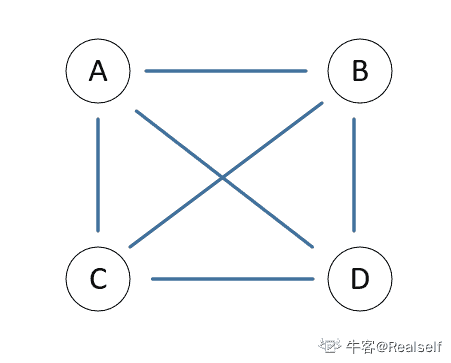

# 二千零一十八、七牛云校招笔试题（卷三）

## 1

统计各部门平均年龄，其中三部门人员平均年龄分别为 38 岁、24 岁、42 岁。A 和 B 两部门人员平均年龄为 30 岁，B 和 C 两部门人员平均年龄为 34 岁。这三个部门全体人员的平均年龄为多少岁？（）

正确答案: B   你的答案: 空 (错误)

```cpp
34
```

```cpp
35
```

```cpp
36
```

```cpp
37
```

本题知识点

七牛云 C++工程师 Java 工程师 2018

讨论

[爱嘴硬的咚咚酱 201803011740661](https://www.nowcoder.com/profile/3973086)

A，B，C 部门人数设为 X，Y，Z 有 38X+24Y=30X+30Y；    24Y+42Z=34Y+34Z;所以 X=3/4Y；Z=5/4Y；带入（38X+24Y+42Z）/（X+Y+Z）=35

发表于 2018-03-23 09:24:06

* * *

## 2

运行以下程序片段的输出结果是（）

```cpp
#include <stdio.h>
int main() {
    int x, y = 6, z = 5;
    x = y == z;
    printf("%d\n", x);
    return 0;
}
```

正确答案: B   你的答案: 空 (错误)

```cpp
6
```

```cpp
0
```

```cpp
1
```

```cpp
5
```

```cpp
编译错误
```

本题知识点

七牛云 C++工程师 2018 C 语言

讨论

[牛客 751102603 号](https://www.nowcoder.com/profile/751102603)

== 优先级高于 =  所以先判断 == c 语言中 0 为假 其它为真  y 不等于 z ，所以 x 等于 0，答案应该是 a

发表于 2021-09-16 18:26:07

* * *

[冋宇同桌](https://www.nowcoder.com/profile/232185)

正确答案，编译错误 = =

发表于 2018-03-23 14:12:54

* * *

[Huhu 丶](https://www.nowcoder.com/profile/808958419)

Java 编译报错 C 编译结果是 0

发表于 2020-08-22 21:39:37

* * *

## 3

Linux 系统中 ____ 命令可以列出当前运行的进程 （）

正确答案: B   你的答案: 空 (错误)

```cpp
ls
```

```cpp
ps
```

```cpp
grep
```

```cpp
xargs
```

本题知识点

七牛云 C++工程师 Java 工程师 2018

讨论

[哈哈哈哈~~](https://www.nowcoder.com/profile/2700730)

ls 为查看当前文件下的所有
grep 在服务端查询消息时使用
xarg 是给其他命令传递参数的一个过滤器,也是组合多个命令的一个工具

发表于 2018-03-23 00:41:11

* * *

## 4

以下数据结构的说法，错误的是：（）

正确答案: B   你的答案: 空 (错误)

```cpp
红黑树插入的操作平均时间复杂度为 O(logn)，最坏的时间复杂度是 O(logn)
```

```cpp
B+ 树插入操作平均时间复杂度是 O(logn)，最坏时间复杂度是 O(nlogn)
```

```cpp
Hash 表插入操作的平均时间复杂度为 O(1)，最坏时间复杂度是 O(n)
```

```cpp
排序链表插入操作的平均时间复杂度是 O(n)，最坏时间复杂度是 O(n)
```

本题知识点

七牛云 C++工程师 Java 工程师 七牛云 2018

讨论

[lecea](https://www.nowcoder.com/profile/2313460)


发表于 2018-04-11 21:23:09

* * *

[死：耗子](https://www.nowcoder.com/profile/1293219)

```cpp
B+ 树插入操作平均时间复杂度是 O(logn)，最坏时间复杂度是 O(n)
```

发表于 2018-03-23 10:50:46

* * *

[执笔写离歌、、](https://www.nowcoder.com/profile/7903742)


发表于 2018-09-04 21:44:39

* * *

## 5

以下是 C 语言的一个 struct 声明

```cpp
#pragma pack(4)
typedef struct {
    int a;
    char b;
    int c;
    float e;
    char f;
    float g;
} stru;
```

问在 32bits 平台下，sizeof(stru) 为多少？

正确答案: B   你的答案: 空 (错误)

```cpp
22
```

```cpp
24
```

```cpp
28
```

```cpp
32
```

本题知识点

七牛云 C++工程师 2018 C 语言

讨论

[奶茶三分糖＋冰](https://www.nowcoder.com/profile/2001814)

在此结构体中，所有数据类型在 32 位主机或者 64 位主机上无影响，另外#pragma pack(4)指定字节对齐为 4；数据类型    字节数    字节对齐 int                 4                4char              1                4int                 4                4float              4                4char              1                4float              4                4 故 sizeof 的值应为 24；

发表于 2018-03-29 16:13:17

* * *

[行进](https://www.nowcoder.com/profile/391279669)

变量本身对齐值与指定对齐值比较，小的作为变量的对齐值，以多大值为准进行开辟空间也是这样

发表于 2021-02-05 14:13:24

* * *

## 6

在 Linux 文件中，权限为-r-x--x-wx，其对应的权限用数值表达是：（）

正确答案: A   你的答案: 空 (错误)

```cpp
513
```

```cpp
517
```

```cpp
643
```

```cpp
745
```

本题知识点

七牛云 C++工程师 Java 工程师 2018

讨论

[做美梦](https://www.nowcoder.com/profile/644899151)

Linux 中 r=4，w=2，x=1r-x--x-wx 依次为：4+1，1，2+1，=513

发表于 2019-05-17 23:08:54

* * *

[Q.Song](https://www.nowcoder.com/profile/4617034)

r-x--x-wx 依次为 101 001 011，因此是 513

发表于 2018-05-29 19:56:11

* * *

[leefh](https://www.nowcoder.com/profile/7268496)

-表示无权限 0 x 表示可执行 1 w 表示可写 2 r 表示可读 4 从右往左依次相加即可

发表于 2018-03-25 10:46:56

* * *

## 7

一个 20 个顶点的连通无向图，其边的个数最少，最多分别为（）

正确答案: B   你的答案: 空 (错误)

```cpp
20, 115
```

```cpp
19, 190
```

```cpp
20, 380
```

```cpp
19, 400
```

本题知识点

七牛云 C++工程师 Java 工程师 2018

讨论

[keyven_guo](https://www.nowcoder.com/profile/4068453)

对图中任意顶点 u、v，都存在路径使 u、v 连通。对于最少边数，由于是无向图故为 n-1；对于最多边数，先考虑有向图，全出现为 n(n-1)，由于是无向图，故为 n(n-1)/2.

发表于 2018-03-23 09:57:21

* * *

[Realself](https://www.nowcoder.com/profile/831729261)

*   **连通图**：在一个无向图中，从每一个顶点到每一个其它顶点都存在一条路径，则此**无向图**是连通的

    **有 n 个顶点的连通图最多有 n（n-1）/2 条边，最少有 n-1 条边**

    举例说明：如图所示，设 ABCD 四个点构成强连通图，则：

    1.  边数最多有(4×3)/2=6 条，如图所示

        

    2.  边数最少有 3 条，如图所示

        

*   **强连通图**：满足此连通条件的**有向图**叫做强连通图

    **有 n 个顶点的强连通图最多有 n（n-1）条边，最少有 n 条边**

    举例说明：如图所示，设 ABCD 四个点构成强连通图，则：

    1.  边数最多有 4×3=12 条，如图所示
        
    2.  边数最少有 4 条，如图所示
        
*   **完全图：每一对顶点间都存在一条边**

编辑于 2020-05-06 16:54:25

* * *

## 8

数据库的并发操作有可能带来以下哪些不一致性问题？（）

正确答案: B   你的答案: 空 (错误)

```cpp
数据独立性降低
```

```cpp
不可重复读
```

```cpp
无法读取数据
```

```cpp
死锁
```

本题知识点

七牛云 C++工程师 Java 工程师 2018

讨论

[ID84848484](https://www.nowcoder.com/profile/8484574)

丢失修改，不可重复读，读脏

发表于 2019-03-15 15:58:52

* * *

[lecea](https://www.nowcoder.com/profile/2313460)

并发操作带来的数据不一致性主要有丢失修改，不可重复读，读“脏”数据。

编辑于 2018-04-12 10:22:02

* * *

## 9

下列协议属于应用层协议的是 （）

正确答案: C   你的答案: 空 (错误)

```cpp
IP, TCP 和 UDP
```

```cpp
ARP、IP 和 UDP
```

```cpp
FTP、SMTP 和 TELNET
```

```cpp
ICMP、RARP 和 ARP
```

本题知识点

七牛云 C++工程师 Java 工程师 2018

讨论

[occupy5](https://www.nowcoder.com/profile/1573336)

1，传输层协议 TCP UDP2，网络层 IP ARP ICMP3，应用层 FTP SMTP TELNET

发表于 2018-04-03 21:15:18

* * *

[过道](https://www.nowcoder.com/profile/5760563)

*   ```cpp
    IP, TCP 和 UDP
    ```

    IP 协议：Internet Protocol Address,互联网地址协议,发生在网络层，用来寻找对应的主机。
    TCP 协议：Transmission Control Protocol 传输控制协议，是运输层协议，是可靠的运输层协议，与 UDP（尽最大努力，不可靠协议）对应。
*   ```cpp
    ARP、IP 和 UDP
    ```

    ARP：地址解析协议，将 IP 转为对应的物理地址，进行判断后，才能使用数据链路层的服务。
*   ```cpp
    FTP、SMTP 和 TELNET
    ```

    FTP：文件传输协议。
    SMTP：简单邮件传输协议 Simple Mail Transfer Protocol, 我们平常发送的邮件使用的都是 SMTP 协议传送。特点在于 SMTP 是推送的协议。
    TELNET 协议：远程控制协议，与著名的 SSH 协议相比，不安全，没有进行加密，建议使用 SSH 协议.
*   ```cpp
    ICMP、RARP 和 ARP
    ```

    RARP:比 ARP 多了一个 R:逆向。
    简单说 RARP 协议就是逆向的 ARP 协议：把物理地址转为 IP。

发表于 2019-03-14 21:18:43

* * *

[牛客 480722 号](https://www.nowcoder.com/profile/480722)

9

发表于 2018-07-18 12:02:31

* * *

## 10

如下函数在执行 f(10)的时候调用了（）次

```cpp
int f(int x) {
    if(x <= 2) return 1;
    return f(x - 2) + f(x - 4) + 1;
}
```

正确答案: D   你的答案: 空 (错误)

```cpp
14
```

```cpp
18
```

```cpp
20
```

```cpp
以上都不对
```

本题知识点

七牛云 C++工程师 Java 工程师 2018 C 语言

讨论

[川久保玲球](https://www.nowcoder.com/profile/6629159)

正确答案为 15 次。f(10) = f(8) + f(6) + 1        = (f(6) + f(4) + 1) + (f(4) + f(2) + 1) + 1        = (f(4) + f(2) + 1) + (f(2) + f(0) + 1) + 1 + (f(2) + f(0) + 1) + 1 + 1 + 1        = (f(2) + f(0) + 1) + 12

发表于 2020-11-24 16:47:06

* * *

[graper](https://www.nowcoder.com/profile/3896787)

还有 f（10）

发表于 2018-03-24 17:00:57

* * *

[小小红鲤鱼](https://www.nowcoder.com/profile/6370201)

正确答案为 15 次  可以构造一个递归树，清楚明了

发表于 2018-03-25 01:22:51

* * *

## 11

两人相约见面，约定第一人到达后，等 15 分钟不见第二人来就可以离去。假设他们都在 14 点至 14 点半的任一时间来到见面地点，则两人能见面的概率是 1 。

你的答案 (错误)

1 参考答案 (1) 3/4

本题知识点

七牛云 C++工程师 Java 工程师 2018

讨论

[萌えp](https://www.nowcoder.com/profile/942010320)

上个大学，把高中学的都忘了，，也有可能初中的知识，mmp, 帮你们回忆下，，

发表于 2019-09-28 23:36:23

* * *

[Dev_Rich](https://www.nowcoder.com/profile/278062)

使用微分思想：把 30 分钟拆分成一分钟每段，计算每段总和。1/30 * ( 15/30 + 16/30 + ... + 29/30 + 30/ 30 + 29/30+ ... + 16/30 + 15/30 ) = 675/900 = 3/4 = 0.75

编辑于 2018-10-24 16:41:08

* * *

[graper](https://www.nowcoder.com/profile/3896787)

x-y<=15y-x<=15

发表于 2018-03-24 17:07:01

* * *

## 12

以下程序输出的结果是 1

```cpp
#include
int main2 {
printf("%s", 5 + "QiniuCloud");
return 0;
}
```

你的答案 (错误)

1 参考答案 (1) Cloud

本题知识点

七牛云 C++工程师 Java 工程师 2018

讨论

[咕咕雞](https://www.nowcoder.com/profile/192511756)

字符串指针向前移动 5 个字节

发表于 2018-06-26 08:31:16

* * *

[牛客 4874504 号](https://www.nowcoder.com/profile/4874504)

Cloud

发表于 2018-05-19 16:56:28

* * *

## 13

以下是浏览器和 Web 服务器交互的几个动作， 则正确的顺序是 11 浏览器使用 HTTP 协议请求一个页面 2 浏览器和 Web 服务器建立一个 TCP 连接 3Web 服务器发送网页内容给到浏览器 4 浏览器通过 DNS 协议解析域名

你的答案 (错误)

1 参考答案 (1) 4,2,1,3

本题知识点

七牛云 C++工程师 Java 工程师 2018

讨论

[嗯呢 33333](https://www.nowcoder.com/profile/959529379)

第一步：DNS 解析出服务端的 ip 地址（根据 ip 地址查找服务端的 MAC 地址）第二步：tcp 三次握手，客户端与服务端建立连接第三步：浏览器发送请求第四步：服务端响应请求

发表于 2019-10-17 12:03:42

* * *

[萌えp](https://www.nowcoder.com/profile/942010320)

4,2,1,3  说其他答案的是怎么想的呢？？？？？？？？？？？？

发表于 2019-09-28 23:38:19

* * *

[我想静静！](https://www.nowcoder.com/profile/9359484)

2143

发表于 2018-10-22 13:00:14

* * *

## 14

编写一个 shell 脚本，统计当前目录下所有 .c 文件的行数 1 。

你的答案 (错误)

1 参考答案 (1) find ./ -name &quot;*.c&quot; | xargs wc –l 或者 wc –l `find ./ -name &quot;*.c&quot;`

本题知识点

七牛云 C++工程师 Java 工程师 2018

讨论

[嗯呢 33333](https://www.nowcoder.com/profile/959529379)

find ./ -name "*.c" | wc -l 统计当前目录下所有 c 结尾文件显示的行数，即文件总数

发表于 2019-10-17 11:59:25

* * *

[牛客 4874504 号](https://www.nowcoder.com/profile/4874504)

find . -type f -name “*.c” | xargs wc -l | grep “total” | awk '｛print $1｝'

发表于 2018-05-19 16:44:47

* * *

## 15

请把表达式(1+2)*3/(10+1)转为后缀表达式 1。

你的答案 (错误)

1 参考答案 (1) 1 2 + 3 * 10 1 + /

本题知识点

七牛云 C++工程师 Java 工程师 2018

讨论

[大荣 qhr](https://www.nowcoder.com/profile/8857287)

首先按照运算的先后顺序将表达式全部都添加上括号

```cpp
（((1+2)*3)/(10+1)）

```

然后由于是后缀表达式，从里到外将所有运算符都拿到右括号的右边

```cpp
（((12)+3)*(101)+/
```

最后再将所有括号都去掉

```cpp
1 2 + 3 * 10 1 + / 同理，如果是变为前缀表达式的话，就把运算符拿到括号左边就可以啦
```

发表于 2018-05-15 21:37:23

* * *

## 16

（简答题）有一个大文件，只扫描一遍的情况下，等概率返回其中一行

你的答案

本题知识点

七牛云 C++工程师 Java 工程师 2018

讨论

[lecea](https://www.nowcoder.com/profile/2313460)

var pickOne(file){

int lenth = 1;

while(lenth <= file.size){

if(random()%lenth == 0){

pick = file[lenth];

}

lenth++;

}

return pick;

}

发表于 2018-04-12 10:40:48

* * *

[牛客 964196347 号](https://www.nowcoder.com/profile/964196347)

蓄水池抽样问题

发表于 2021-02-23 21:18:58

* * *

[Q.Song](https://www.nowcoder.com/profile/4617034)

```cpp

            发表于 2018-05-29 19:51:24

        17
        （简答题）简要描述 tcp 协议和 udp 协议的特性和区别

    你的答案

本题知识点

                                                            七牛云 
                                                C++工程师 
                                                Java 工程师 
                                                2018 

讨论

[lecea](https://www.nowcoder.com/profile/2313460)

  *UDP 特点:*无连接；尽最大努力交付；面向报文；无拥塞控制；支持一对一、一对多、多对一和多对多；首部开销小（只有 8 字节）；不可靠的；时延小；实时性强. 

  *TCP 特点:*面向连接；面向字节流；提供流量控制&拥塞控制；点对点（一对一）；首部开销大（固定首部 20 字节）；提供可靠交付服务。 

发表于 2018-04-12 10:51:07

* * *

[养乐多か](https://www.nowcoder.com/profile/344468247)

                                                                    TCP 协议和 UDP 协议特性区别总结：  （1）TCP 协议在传送数据段的时候要给段标号；UDP 协议不  （2）TCP 协议可靠；UDP 协议不可靠  （3）TCP 协议是面向连接；UDP 协议采用无连接  （4）TCP 协议负载较高，采用虚电路；UDP 采用无连接  （5）TCP 协议的发送方要确认接收方是否收到数据段（3 次握手协议）  （6）TCP 协议采用窗口技术和流控制

发表于 2020-07-06 11:02:55

* * *

[ID84848484](https://www.nowcoder.com/profile/8484574)

                                                                      TCP:面向连接的、可靠的、面向字节流的、有流量控制、阻塞控制、负载较高 
   UDP：面向无连接的，不可靠的、面向数据报的、无流量控制、无阻塞控制、负载相对较低 

发表于 2019-03-15 16:35:56

* * *

## 18

        （编程题）合并两个有序链表，保持链表顺序。例如:
输入:
链表 1: 1->3->5->7
链表 2: 2->4->6->8
输出:
链表交集: 1->2->3->4->5->6->7->8

你的答案

本题知识点

                                                            七牛云 
                                                C++工程师 
                                                Java 工程师 
                                                2018 

讨论

[牛客 276611333 号](https://www.nowcoder.com/profile/276611333)

```
a = input().split('->')
b = input().split('->')
c = a+b
c.sort()
for i in c:
    if i == c[-1]:
        print(i)
    else:
        print(i+'->',end='')

```cpp

 python

发表于 2021-03-05 22:24:37

* * *

[NIGOOOO](https://www.nowcoder.com/profile/346064320)

```
class Solution{
    public ListNode merge(ListNode l1,ListNode l2){
        if(l1==null){
            return l2;
        }
        if(l2==null){
            return l1;
        }
        if(l1.val<l2.val){
            l1.next = merge(l1.next,l2);
            return l1;
        }else{
            l2.next=merge(l1,l2.next);
            return l2;
        }
    }
}
```cpp

发表于 2020-05-06 16:56:56

* * *

[lm_fish](https://www.nowcoder.com/profile/639102524)

                                                                      LinkedList merge(LinkedList list1,LinkedList list2){ 
       LinkedList dummy=new LinkedList(); 
       LinkedList rear=dummy;

       while(list1!=null && list2!=null){ 
          if(list1.val<list2.val){ 
               rear.next=list1; 
               list1=list1.next; 
               rear=rear.next;

           }else{ 
               rear.next=list2; 
               list2=list2.next; 
               rear=rear.next;

           }

       } 
              if(list1!=null)rear.next=list1; 
               rear.next=list2; 
           return dummy.next;

   } 

发表于 2019-04-01 14:41:46

* * *

## 19

        （编程题）给定一个正整数序列，请尝试通过将它们重新排列，组合成一个最小的整数。例如输入为数组 [3, 6, 9, 12]，返回值为 12369。由于有可能会超出整数最大范围，所以请返回字符串类型。

你的答案

本题知识点

                                                            七牛云 
                                                C++工程师 
                                                Java 工程师 
                                                2018 

讨论

[虾皮内推-答疑解惑](https://www.nowcoder.com/profile/942429792)

                                                                    public static String getMinStr(int[] arr){
         int len = arr.length;
         StringBuffer sb = new StringBuffer("");
         for(int i = 0; i < len; i++){
             sb.append(arr[i]);
         }
         String str = sb.toString();
         String[] ss = str.split("");
         Arrays.sort(ss);
         for(int i = 0; i < ss.length; i++){
             if(!"0".equals(ss[0])){
                 break;
             }
             if(!"0".equals(ss[i])){
                 ss[0] = ss[i];
                 ss[i] = "0";
                 break;
             }
         }
         StringBuffer stringBuffer = new StringBuffer("");
         for (int i = 0; i < ss.length; i++){
             stringBuffer.append(ss[i]);
         }
         return stringBuffer.toString();
     }

发表于 2018-08-30 09:02:38

* * *

[学不会其](https://www.nowcoder.com/profile/6578065)

```
package com.newcoder.qiniuyun;
import java.util.ArrayList;
import java.util.Collections;
import java.util.List;
import java.util.Scanner;

public class Test4 {

    public static void main(String[] args) {
        Scanner sc=new Scanner(System.in);
        String str=sc.next();
        String[] a=str.split(",");
        ArrayList<Integer> list=new ArrayList<Integer>();
        for(int i=0;i<a.length;i++){
            list.add(Integer.parseInt(a[i]));
        }
        List<ArrayList<Integer>> perm = new ArrayList<ArrayList<Integer>>(); 
        calperm(perm, list, 0);
        String min="999999999999999999999999999999";
        for(int i=0;i<perm.size();i++){
            String ss="";
            for(int j=0;j<perm.get(i).size();j++){
                ss=ss+perm.get(i).get(j)+"";
            }
            if(min.compareTo(ss)>0){
                min=ss;
            }
        }
        System.out.println(min);       
    }
    //求全排列
    static void calperm(List<ArrayList<Integer>> perm , ArrayList<Integer> list, int n){  
        if(n == list.size()){  
            perm.add(new ArrayList<Integer>(list));  
        }else{  
            for(int i=n;i<list.size();i++){  
                Collections.swap(list, i, n);  
                calperm(perm, list, n+1);  
                Collections.swap(list, i, n);  
            }  
        }  
    } 

}

```cpp

编辑于 2018-04-14 22:16:01

* * *

[SKo00o](https://www.nowcoder.com/profile/2758003)

```
print (''.join(sorted(input().split(' '))))
```cpp

发表于 2018-04-14 11:23:36

* * *

## 20

        （论述题）你使用过哪些云服务，在什么场景下使用的？云服务和传统 IT 的优势有哪些？

你的答案

本题知识点

                                                            七牛云 
                                                C++工程师 
                                                Java 工程师 
                                                2018 

讨论

[lecea](https://www.nowcoder.com/profile/2313460)

                                                                      云计算是将我们传统的 IT 工作转为以网络为依托的云平台运行，NIST（美国国家标准与技术研究院）在 2011 年下半年公布了云计算定义的最终稿，给出了云计算模式所具备的**5 个基本特征（按需自助服务、广泛的网络访问、资源共享、快速的可伸缩性和可度量的服务）、3 种服务模式（SaaS（软件即服务）、PaaS（平台即服务）和 IaaS（基础设施即服务））和 4 种部署方式（私有云、社区云、公有云和混合云）**，而云服务则是在这个云平台上发布出来的供用户使用的产品服务！ 
   优势： 
          **1.敏捷性：**部署一台云服务器比使用物理服务器要快得多。
 **2.灵活扩展：**云服务器可以轻松的进行扩展，不用前期估算用量。
 **3.运维：**使用云主机可以大大的减少运维的人力成本。
 **4.可靠性：**物理服务器出问题了自己修吧，云服务器直接迁移。
 **5.支出：**云服务器更加省钱。   

编辑于 2018-04-12 11:08:46

* * *

```