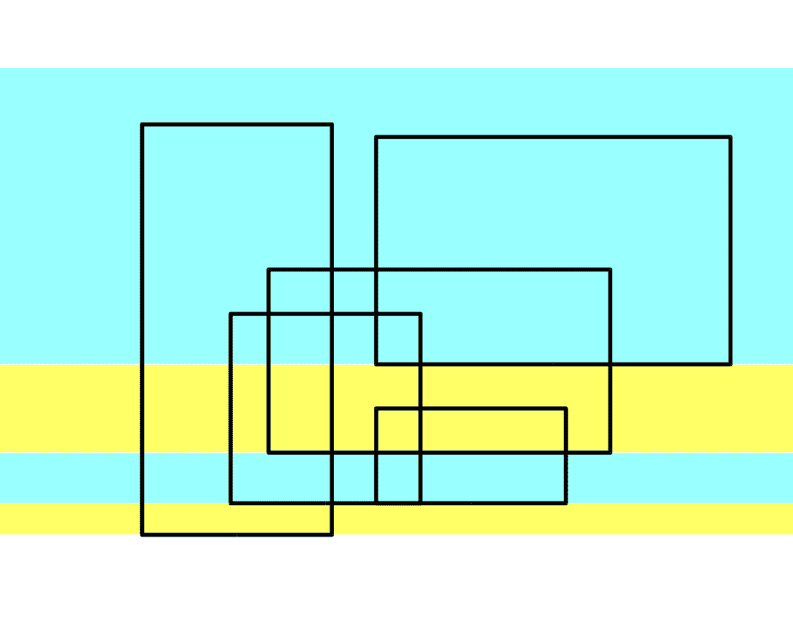

# 网易 2019 实习生招聘编程题集合

## 1

为了找到自己满意的工作，牛牛收集了每种工作的难度和报酬。牛牛选工作的标准是在难度不超过自身能力值的情况下，牛牛选择报酬最高的工作。在牛牛选定了自己的工作后，牛牛的小伙伴们来找牛牛帮忙选工作，牛牛依然使用自己的标准来帮助小伙伴们。牛牛的小伙伴太多了，于是他只好把这个任务交给了你。

本题知识点

网易 Java 工程师 C++工程师 iOS 工程师 安卓工程师 运维工程师 前端工程师 算法工程师 PHP 工程师 测试工程师 排序 *模拟 贪心 golang 工程师 2019* *讨论

[NarcissusAbyss](https://www.nowcoder.com/profile/3738695)

```cpp
/*
240ms...
这道题是卡时间的，如果直接暴力枚举，复杂度 O(mn)，
必然会超时，卡 80%，所以我们要想一个更优化的策略。
思路：
先将工作按难度排序，复杂度为 O(nlogn)。
因为工作可以重复选，那么可知员工就是要选的工作
就是在他能力值范围内的最大报酬的工作，所以把每
个工作的报酬更新为其难度范围内的工作报酬的最大
值。好比如果 job[i].diff<maxDiff{job[0]~job[i-1]}，
那么 job[i].diff=maxDiff{job[0]~job[i-1]}。

然后再对员工的能力值进行排序，复杂度为 O(mlogm)。
如果员工 p 的能力大于等于当前工作 j 的难度，那么就换下一
个难度更高的工作(++j)，如果员工 p 的能力小于当前工作的
难度，那么员工 p 只能胜任前一个工作(j-1)，然后换下一个
能力比员工 p 更强的员工 p+1 来挑选工作。因为 p+1 能力比 p 高，
所以他就可以从工作 j 挑起，那么挑选工作的复杂度实际是 O(m+n)。

员工挑选完工作后，把员工报酬按原序输出即可。

所以总的复杂度就是 max{O(nlogn), O(mlogm), O(m+n)} < O(mn)

详情参见代码~
*/
#include <iostream>
#include <vector>
#include <algorithm>

using namespace std;

int main() {
    int n, m;
    while(cin >> n >> m) {
        vector<pair<int, int> > job(n + 1), guy(m);
        vector<int> map(m);
        int mx = 0, index = 0, left = 0;
        job[0] = make_pair(0, 0);
        for(int i = 1; i <= n; ++ i) {
            cin >> job[i].first >> job[i].second;
        }
        for(int i = 0; i < m; ++ i) {
            cin >> guy[i].first;
            guy[i].second = i;
        }
        sort(job.begin(), job.end(), &{return a.first < b.first;});
        sort(guy.begin(), guy.end(), &{return a.first < b.first;});
        for(int i = 0; i <= n; ++ i) {
            mx = max(mx, job[i].second);
            job[i].second = mx;
        }
        while(left < m && index < n + 1) {
            if(guy[left].first >= job[index].first) ++ index;
            else {
                map[guy[left].second] = job[index - 1].second;
                ++ left;
            }
        }
        for(int i = left; i < m; ++ i) {
            map[guy[i].second] = job[n].second;
        }
        for(int i = 0; i < m; ++ i) {
            cout << map[i] << endl;
        }
    }
}
```

编辑于 2018-03-29 14:12:16

* * *

[牛客 44871374 号](https://www.nowcoder.com/profile/44871374)

最短代码来了~将职位的能力和薪水放入 map 中，key 为能力，value 为薪水，在 map 中就会根据 key 自动排序了~结合 make_pair 把找工作的人也加入到 map 中，这样就可以一起排序了。在 map 中遍历（按能力排序好了），将 map->second(value)值的含义改为 map->first(能力)值以内最多有多少薪水，然后按每个小伙伴的能力直接输出就好啦。

```cpp
#include<iostream>
#include<map>
using namespace std;
int n,m;
map<int,int> Map;
int main(){
    cin>>n>>m;
    int a,b;
    for(int i=0;i<n;i++){
        cin>>a>>b;
        Map[a]=b;
    }
    int ai[m];
    for(int i=0;i<m;i++){
        cin>>ai[i];
        Map.insert(make_pair(ai[i], 0));//有 ai[i]就插入，不然就不插入
    }
    int nowmax=0;
    for(map<int,int>::iterator it=Map.begin();it!=Map.end();it++){
        if(it->second<nowmax)it->second=nowmax;
        else if(it->second>nowmax)nowmax=it->second;
    }
    for(int i=0;i<m;i++)cout<<Map[ai[i]]<<endl;
    return 0;
}
```

编辑于 2020-03-07 22:23:18

* * *

[山柴贩](https://www.nowcoder.com/profile/5809510)

思路

找到难度不大于能力的所有工作里，报酬最多的。核心是用 HashMap 来记录难度和不超过该难度的最大报酬。
先把工作的难度和报酬映射到 HashMap
把人的能力也全部读进来，放到 HashMap，报酬可以先设为 0.
最后按难度从小到大（所以需要先排序）更新 HashMap,key 为难度，value 为不超过难度的最大报酬。

```cpp
import java.util.*;
public class Main{
    public static void main(String[] args){
        Scanner sc = new Scanner(System.in);
        int n = sc.nextInt();
        int m = sc.nextInt();
        int t1=0,t2=0;
        HashMap<Integer,Integer> hs = new HashMap<>();
        int[] a = new int[n+m];
        int[] b = new int[m];
        for(int i=0;i<n;i++){
            t1 = sc.nextInt();
            t2 = sc.nextInt();
            a[i] = t1;
            hs.put(t1,t2);
        }
        for(int i=0;i<m;i++){
            t1 = sc.nextInt();
            a[n+i] = t1;
            b[i] = t1;
            if(!hs.containsKey(t1))
               hs.put(t1,0);
        }
        Arrays.sort(a);
        int max = 0;
        for(int i=0;i<m+n;i++){
            max = Math.max(max,hs.get(a[i]));
            hs.put(a[i],max);
        }
        for(int i=0;i<m;i++){
            System.out.println(hs.get(b[i]));
        }
    }
} 
```

编辑于 2018-03-31 10:21:14

* * *

## 2

小 Q 得到一个神奇的数列: 1, 12, 123,...12345678910,1234567891011...。

并且小 Q 对于能否被 3 整除这个性质很感兴趣。

小 Q 现在希望你能帮他计算一下从数列的第 l 个到第 r 个(包含端点)有多少个数可以被 3 整除。

本题知识点

网易 Java 工程师 C++工程师 iOS 工程师 安卓工程师 运维工程师 前端工程师 算法工程师 PHP 工程师 测试工程师 数学 golang 工程师 2019 基础数学

讨论

[牛客 6197428 号](https://www.nowcoder.com/profile/6197428)

写出来当插入 i 以后的规律：i = 1 ----> 1i = 2 ----> 0i = 3 ----> 0i = 4 ----> 1i = 5 ----> 0i = 6 ----> 0i = 7 ----> 1………………发现在区间[1,x]之间共计有 ***(x) = (x+2)/3 个 1，剩下的都满足要求那么在区间[l, r]上的 r-l+1 个 数字中，必须抠掉 ***(r) - ***(l-1) 个不满足要求的数字。直接打印出来就可以了，O(1)，不需要循环遍历。

```cpp
#include<stdio.h>
#define ***(x) (((x)+2)/3)
int main(){
    int l, r;
    while(~scanf("%d%d", &l, &r))
        printf("%d\n", r-l+1-***(r)+***(l-1));
    return 0;
}
```

============补充证明=============记插入数字 i 以后形成的新数字为 a[i]，数字 a[i]的余数记作 last[i]容易发现，**a[i] = a[i-1]*10**^(**k**)**+ i**。则 last[i] = a[i]%3 = (a[i-1]*10^(k )+ i)%3 = (a[i-1]*(10^(k )-1) + (a[i-1] + i))%3=(a[i-1] + i)%3=(a[i-1]%3 + i%3)%3=(last[i-1] + i%3)%3 则 last 满足递推关系：

*   **last[i] = (last[i-1] + i%3)%3**

数学归纳法：当 k = 0 的时候：last[0] = 0、last[1] = 1、last[2] = 0 成立假设规律 last[3k+1] = 1、last[3k] = 0、last[3k+2] = 0 成立；则对于任意 k+1 而言 last[3(k+1)] = last[(3k+2) + 1] = (0 + 3(k+1)%3)%3 = 0last[3(k+1)+1] = (0 + (3(k+1)+1)%3)%3 = 1last[3(k+1)+2] = (1 + (3(k+1)+2)%3)%3 = (1+2)%3 = 0
可见对任意 k，上述规律恒成立。综上，last[i] = i%3==1

编辑于 2018-03-28 17:28:44

* * *

[我只想安心搬砖](https://www.nowcoder.com/profile/857604284)

```cpp
import java.util.*;

public class Main {

    public static void main(String[] args) {

        Scanner sc = new Scanner(System.in);
        while (sc.hasNext()) {
            int l = sc.nextInt();
            int r = sc.nextInt();

            System.out.println(cal(r) - cal(l - 1));
        }
    }

    private static int cal(int n) {
        int sum = n / 3 * 2;
        if (n % 3 == 2)
            return sum + 1;
        else
            return sum;
    }

}
```

首先得找到规律，我们可以发现 1，12，123 这种，

| 否 | 是 | 是 |

每三个数中有两个能被 3 整除，所以我们可以把数字按成多份，每份有 3 个，每 3 个中有 2 个能被 3 整除。就是 n/3*2 这个式子。分完之后，再对多余部分进行分析，余数为 0，那么直接返回结果，余数为 1，看表格也是直接返回结果，余数为 2，会多一种情况。最后算出 1 到 r 的结果，减去 1 到 l 的结果，得到 l 到 r 的结果。

发表于 2019-08-10 21:34:48

* * *

[jachy](https://www.nowcoder.com/profile/4685960)

一个数所有位数的和相加如果等于 3 的倍数，则这个整数是 3 的倍数。 这里第一个数是 1，第二个是 12，第三个是 123……第 n 个数是 123……(n-1)n，各个位之和可以算成(i+1)*i/2,这里如果是大于等于两位数，它算成一个数和把每一位分开计算对 3 取余的结果都是一样的，所以没关系。 所以，直接遍历 l 到 r，根据通项公式判断即可。

```cpp
#include<bits/stdc++.h>
using namespace std;
typedef long long int ll;

int main(){
    ll l , r;
    while(cin >> l >> r){
        ll count = 0;
        for(int i = l; i <= r; i++){
            if((i+1)*i/2 % 3 == 0)    count++;
        }
        cout << count << endl;
    }
    return 0;
} 
```

编辑于 2018-03-28 22:26:41

* * *

## 3

小 Q 正在给一条长度为 n 的道路设计路灯安置方案。

为了让问题更简单,小 Q 把道路视为 n 个方格,需要照亮的地方用'.'表示, 不需要照亮的障碍物格子用'X'表示。

小 Q 现在要在道路上设置一些路灯, 对于安置在 pos 位置的路灯, 这盏路灯可以照亮 pos - 1, pos, pos + 1 这三个位置。

小 Q 希望能安置尽量少的路灯照亮所有'.'区域, 希望你能帮他计算一下最少需要多少盏路灯。

本题知识点

网易 Java 工程师 C++工程师 iOS 工程师 安卓工程师 运维工程师 前端工程师 算法工程师 PHP 工程师 测试工程师 数组 模拟 字符串 *贪心 golang 工程师 2019* *讨论

[skyamz](https://www.nowcoder.com/profile/1870584)

算法思路

遍历路灯字符串，遇见“.”，就给计数器+1，然后往后挪三个位置。如果遇到“X”，就直接往后挪一个位置。

编程思路

路灯个数放入数组 n 中，路灯对应的字符串放入数组 lantern 中，要放路灯的个数放入 lantern_count 中。这三个数组是一一对应的。双重循环来遍历 lantern 中的字符串，如果遇到“.”，对应的 lantern_count+=1，j+=3(挪三个位置)。如果遇到“X”，j+=1(挪一个位置)。

```cpp
if __name__ == '__main__':
    count = int(input())  # 测试用例的个数
    n = []
    lantern = []
    for i in range(count):
        n_tmp = int(input())  # 路灯个数
        n.append(n_tmp)
        lantern_tmp = input()  # 路灯分布字符串
        lantern.append(lantern_tmp)
    lantern_count = [0 for i in range(count)]  # 存储最终结果的数组
    for i in range(len(lantern)):  # 循环路灯数
        j = 0
        while (j < len(lantern[i])):  # 循环对应路灯排列字符串
            if lantern[i][j] == '.':
                j += 3
                lantern_count[i] += 1
            else:
                j += 1
    print(lantern_count[0])
    for i in range(len(lantern_count) - 1):
        print(lantern_count[i + 1])
```

编辑于 2018-03-28 11:00:58

* * *

[向宇回桌](https://www.nowcoder.com/profile/520872)

```cpp
#include <bits/stdc++.h>
using namespace std;
int main() {
    int m; cin >> m;
    while (m--) {
        int n; cin >> n; string s; cin >> s;
        int ans = 0;
        for (int i=0; i<s.length(); i++) {
            if (s[i] == '.') {
                i+=2;
                ans++;
            }
        }
        cout << ans << endl;
    }
    return 0;
}
```

发表于 2019-07-30 01:52:19

* * *

[霍七](https://www.nowcoder.com/profile/1903667)

本套 8 道题全部 pass 的 C++代码已挂到了我的 GitHub([`github.com/shiqitao/NowCoder-Solutions`](https://github.com/shiqitao/NowCoder-Solutions))
牛客网上的其他题目解答也在持续更新。

```cpp
#include <iostream>
using namespace std;
int main()
{
    int t; cin >> t;
    for (int i = 0; i < t; i++) {
        int n; cin >> n;
        int j = 0, count = 0;
        while (j++ < n) {
            char ch; cin >> ch;
            if (ch == '.') {
                count++;
                if (j++ < n) cin >> ch;
                if (j++ < n) cin >> ch;
            }
        }
        cout << count << endl;
    }
    return 0;
} 
```

发表于 2018-03-28 19:13:28

* * *

## 4

牛牛去犇犇老师家补课，出门的时候面向北方，但是现在他迷路了。虽然他手里有一张地图，但是他需要知道自己面向哪个方向，请你帮帮他。

本题知识点

网易 Java 工程师 C++工程师 iOS 工程师 安卓工程师 运维工程师 前端工程师 算法工程师 PHP 工程师 测试工程师 字符串 *模拟 golang 工程师 2019* *讨论

[Chrety](https://www.nowcoder.com/profile/994602167)

```cpp
#include <bits/stdc++.h>
using namespace std;

int n, cnt = 1001;

char s[1010], ans[4];

int main() {
    ans[1] = 'N', ans[2] = 'E', ans[3] = 'S', ans[0] = 'W';
    cin >> n;
    cin >> s;
    for (int i = 0; i < n; ++i) {
        if (s[i] == 'R') cnt++;
        else cnt--;
    }
    cout << ans[cnt % 4];
}
```

简洁点的

```cpp
#include <bits/stdc++.h>
int n, cnt = 1001;
char s[1010], ans[4] = {'W', 'N', 'E', 'S'};
int main() {
    scanf("%d%s", &n, &s);
    for (int i = 0; i < n; ++i) s[i] == 'R' ? cnt++ : cnt--;
    printf("%c", ans[cnt % 4]);
}

```

编辑于 2019-08-21 22:08:18

* * *

[jachy](https://www.nowcoder.com/profile/4685960)

```cpp
#include<bits/stdc++.h>
using namespace std;

int main(){
    int n; cin >> n;
    int ans = 0;
    char dir[] = "NESW";
    string str; cin >> str;
    for(int i = 0; i < n; i++)
        ans = (ans + (str[i] == 'L' ? -1:1) + 4) % 4;
    cout << dir[ans%4] << endl;
    return 0;
}

```

从北开始，顺时针旋转，将 N,E,S,W 分别记为 0,1,2,3，左转相当于逆时针转，即-1；右转+1。避免结果为负数加 4 再对 4 取余。

发表于 2018-03-28 22:40:13

* * *

[Mono_Chrome](https://www.nowcoder.com/profile/3233028)

Java

定义一个方向数组

```cpp
char[] direction = new char[] {'E', 'S', 'W', 'N', 'E', 'S', 'W'};
```

然后分别计算 Left 和 Right 的步数，并将其%4，最后 direction[3 + (countRight - countLeft)]就是所求方向。

```cpp
import java.util.Scanner;

public class Main {

    public static void main(String[] args) {
        Scanner sc = new Scanner(System.in);
        char[] direction = new char[] {'E', 'S', 'W', 'N', 'E', 'S', 'W'};
        int n = sc.nextInt();
        String path = sc.next();
        int countLeft = 0;
        int countRight = 0;
        for (int i = 0; i < n; i++) {
            if (path.charAt(i) == 'L') {
                countLeft++;
            } else {
                countRight++;
            }
        }
        countLeft %= 4;
        countRight %= 4;
        System.out.println(direction[3 + (countRight - countLeft)]);
    }
}
```

发表于 2019-06-29 22:02:57

* * *

## 5

牛牛以前在老师那里得到了一个正整数数对(x, y), 牛牛忘记他们具体是多少了。

但是牛牛记得老师告诉过他 x 和 y 均不大于 n, 并且 x 除以 y 的余数大于等于 k。

牛牛希望你能帮他计算一共有多少个可能的数对。

本题知识点

网易 Java 工程师 C++工程师 iOS 工程师 安卓工程师 运维工程师 前端工程师 算法工程师 PHP 工程师 测试工程师 数学 golang 工程师 2019 基础数学

讨论

[数学&curren;lover](https://www.nowcoder.com/profile/875426)

朴素的做法是枚举 n² 个点然后跟 k 作比较。这显然对 n<=100000 的规模来说是不允许通过的。注意到当除数是 y 时，当 x=1~n 时，余数是 1,2,3,...,y-1,0 循环出现，循环节长度显然是 y 那么我们可以枚举 y=k~n(当 y<k 时所有余数均小于 k，因此不需要考虑)然后对于 x=1~n，总共出现了[n/y]个循环节，然后数出每个循环节里面不小于 k 的余数。最后再数出不满一个循环节的不小于 k 的余数，就是答案了。注意当 k=0 的时候由于余数 0 出现在循环的末尾，因此要特别判断。复杂度为 O(n)

```cpp
#include <iostream>
#include <algorithm>
using namespace std;

int main()
{
    long long n,k;
    cin>>n>>k;
    long long ans=0;
    for(int y=max(1LL,k);y<=n;++y)
    {
        int res=0;
        res=n/y*(y-k);
        if(n%y>=k)
            if(k)
                res+=n%y-k+1;
            else res+=n%y;
        ans+=res;
    }
    cout<<ans<<endl;
} 
```

发表于 2018-03-28 01:32:21

* * *

[懷戀，那弎年](https://www.nowcoder.com/profile/3523523)

```cpp
import java.util.*;

public class Main{
    public static void main(String[] args) {
        Scanner sc = new Scanner(System.in);
        long n = sc.nextInt();
        long k = sc.nextInt();
        long ans = 0L;
        if (k == 0) {
            ans = n * n; // 任何两对数的余数都是大于等于零
        } else {
            for (long y = k + 1; y <= n; y++) {
                ans += (n / y) * (y - k) + Math.max(0, n % y - k + 1);
                // 假设 n=10,k=3，则对 y 来说只能是 4,5,6,7,8,9,10
                // 当 y=4,(n/y)*(y-k)代表 x 小于等于 8(8 是 4 的整数倍)时有(3,4),(7,4)，Math.max(0,n%y-k+1)代表 x 大于 8 时符合题意的对数为 0
                // 当 y=5,(n/y)*(y-k)代表 x 小于等于 10(10 是 5 的整数倍)时有(3,5),(4,5),(8,5),(9,5)，Math.max(0,n%y-k+1)代表 x 大于 10 时符合题意的对数为 0
                // 当 y=6,(n/y)*(y-k)代表 x 小于等于 6 时有(3,6),(4,6),(5,6),Math.max(0,n%y-k+1)代表 x 大于 6 时符合题意的对数为 2,分别是(9,6),(10,6)
                // 当 y=7,(n/y)*(y-k)代表 x 小于等于 7 时有(3,7),(4,7),(5,7),(6,7),Math.max(0,n%y-k+1)代表 x 大于 7 时符合题意的对数为 1,是(10,7)
                // ...以此类推
            }
        }
        System.out.println(ans);
    }
} 
```

发表于 2018-03-28 18:34:12

* * *

[牛客 6197428 号](https://www.nowcoder.com/profile/6197428)

```cpp
#include<stdio.h>
#define max(x,y) ((x)>(y)?(x):(y))
int main() {
  int n, k;  while (~scanf("%d%d", &n, &k)) { int y;  long long count = 0; for (y = k + 1; y <= n; ++y) {  count += (n / y)*(y - k) + max(n%y+1-k, 0); if (!k) count--; } printf("%lld\n", count); } return 0;
}

```

x 可以在 [1, n] 上取，但是 y 只能在 [k, n]上取，因为 k 以下都不存在大于等于 k 的余数。所以遍历 y，**对于每一个 y，统计符合的 x 的个数**，加到 count 里。先假设 x 可以从 [0, n]中取值，那么这段区间至少可以分成(n/k)个完整的、长度为 y 的区间。x = 【0，1……y-2，y-1】【y，y+1，……，2y-2，2y-1】……【……】……【……，n】在每个小区间 a 上，第 i 个数 a[i]%y 的余数是 i。这样每一小段上大于等于 k 的 x 有 y-k 个（显然当 k=0 时，y 个数都满足题意）。【0，1，……，***k，k+1，……，y-1***】这样，已经遍历的总数是(n/y)*y，而其中满足条件的 x 的总数是（n/y）*（y-k）因为 n = (n/y)*y + n%y 所以还没遍历的数有 n+1-(n/y)*y = n+1 - (n - n%y) = 1+n%y 个，令它为 t。因为 n%y∈[0, y-1]， 则 t∈[1, y]。也就是说我这种方法，至少剩了一个数，至多会把一个整区间（数量为 y）都剩下来。**但是无论如何，这个区间 last 的第 i 个数 last[i]%y 一定是 i。则最后一个数（n）的余数就是 n%y。**如此一来，此区间内从 [k,n%y] 包含共计 n%y-k+1 个数。不过如果算出小于 0 的数，则不需要减回去，直接当没有就可以了。所以**最后一个区间里包含了** ***max(******n****%y-k+1, 0******)*** **个****满足条件的 x。**最后注意，这里实际上枚举了 x∈ [0, n]所有的数字，当 k==0 的时候，多统计了一个 0，必须减掉。

编辑于 2018-04-04 20:52:12

* * *

## 6

平面内有 n 个矩形, 第 i 个矩形的左下角坐标为(x1[i], y1[i]), 右上角坐标为(x2[i], y2[i])。

如果两个或者多个矩形有公共区域则认为它们是相互重叠的(不考虑边界和角落)。

请你计算出平面内重叠矩形数量最多的地方,有多少个矩形相互重叠。

本题知识点

网易 Java 工程师 C++工程师 iOS 工程师 安卓工程师 运维工程师 前端工程师 算法工程师 PHP 工程师 测试工程师 高级结构 数学 穷举 golang 工程师 2019

讨论

[tuweilong](https://www.nowcoder.com/profile/334452011)

```cpp
/*
无论何种情况，重叠区域也是四条边组成。
而且是取自与 n 的矩形中的四条。
所以遍历边的交点即可。
*/
import java.util.*;

public class Main {
    public static void main(String[] args) {
        Scanner in = new Scanner(System.in);
        int n = in.nextInt();
        int[] x1 = new int[n];
        int[] y1 = new int[n];
        int[] x2 = new int[n];
        int[] y2 = new int[n];
        int xmin = Integer.MAX_VALUE;
        int xmax = Integer.MIN_VALUE;
        int ymin = Integer.MAX_VALUE;
        int ymax = Integer.MIN_VALUE;
        for (int i = 0; i < n; i++) 
            x1[i] = in.nextInt();
        for (int i = 0; i < n; i++) 
            y1[i] = in.nextInt();
        for (int i = 0; i < n; i++)
            x2[i] = in.nextInt();
        for (int i = 0; i < n; i++)
            y2[i] = in.nextInt();
        int ans = 0;
        int cnt = 0;
        for (int x : x1)
            for (int y : y1) {
                for (int i = 0; i < n; i++) {
                    if (x >= x1[i] && x < x2[i] && y >= y1[i] && y < y2[i])
                        cnt++;
                }
                if (cnt > ans)
                    ans = cnt;
                cnt = 0;
            }
        System.out.println(ans);
    }
}

```

发表于 2019-06-26 13:15:59

* * *

[Yummy 蛋卷](https://www.nowcoder.com/profile/4269926)

> 注意判断重叠矩形数量最多的地方：**遍历所有可能包含的点,看一下有多少矩形包含它**
> **注**：重叠数量最多的地方肯定是一块矩形区域
> 
> **误区**：A 和 B 交，B 和 C 交，但是 A 不和 C 交 --- B 同时和 A,C 交, 但是重叠区域只为 1

代码如下：

```cpp
import sys
lines = sys.stdin.readlines()
n = int(lines[0])
x1 = list(map(int,lines[1].split()))
y1 = list(map(int,lines[2].split()))
x2 = list(map(int,lines[3].split()))
y2 = list(map(int,lines[4].split()))
# 遍历所有点的组合（包含了矩形所有角以及交点），看一下有多少矩形包含它
res = 1
for x in x1+x2:
    for y in y1+y2:
        cnt = 0
        for i in range(n):
            if x > x1[i] and y > y1[i] and x <= x2[i] and y <= y2[i]:
                cnt += 1
        res = max(res,cnt)
print(res) 
```

编辑于 2018-03-29 10:28:39

* * *

[笋也可以](https://www.nowcoder.com/profile/3631055)

O(n²logn)算法。
思路是首先对所有矩形排序，按照底边坐标值升序。

考虑到若将平面按照所有矩形的的底边坐标值横向划分，每个划分中的最大重合情况总是出现在该划分底部，且等价一维的区间重合问题。如图所示:

因此，我们每次迭代将下一个或多个底边坐标值最低的矩阵加入队列，并将整个在当前最低坐标值之下的矩形从队列中移除，然后用区间重合的算法计算队列中矩形在目前划分的重合数量。

以下是代码：

```cpp
#include <iostream>
#include <cstdio>
#include <vector>
#include <string>
#include <algorithm>
#include <map>
#include <limits.h>
using namespace std;
// square overlap
class Square{
public:
    int left, right, up, down;
    bool operator <(const Square &x){
        return down < x.down;
    }
};

bool leftto(Square a, Square b){
    return a.left < b.left;
}

void eraselower(vector<Square> &a, int ybound){
    int deln = 0, i = 0, n = a.size();
    while(i + deln < n){
        if(a[i].up<=ybound)
            swap(a[i], a[n-(++deln)]);
        else
            ++i;
    }
    a.erase(a.end()-deln, a.end());
}

int main(){
    int n;
    cin>>n;
    vector<Square> sqs(n), row;
    for(int i=0; i<n; ++i)
        cin>>sqs[i].left;
    for(int i=0; i<n; ++i)
        cin>>sqs[i].down;
    for(int i=0; i<n; ++i)
        cin>>sqs[i].right;
    for(int i=0; i<n; ++i)
        cin>>sqs[i].up;
    sort(sqs.begin(), sqs.end());
    int sn = 0, curdown = 0, res = 0;
    while(sn<n){
        curdown = sqs[sn].down;
        while(sn<n && sqs[sn].down == curdown)
            row.push_back(sqs[sn++]);
        eraselower(row, curdown);
        sort(row.begin(), row.end(), leftto);
        vector<int> rights;
        for(Square x:row){
            rights.erase(rights.begin(), upper_bound(rights.begin(), rights.end(), x.left));
            rights.insert(upper_bound(rights.begin(), rights.end(), x.right), x.right);
            if(res < rights.size()) res = rights.size();
        }
    }
    cout<<res<<endl;
}
```

编辑于 2018-04-12 15:30:39

* * *

## 7

牛牛总是睡过头，所以他定了很多闹钟，只有在闹钟响的时候他才会醒过来并且决定起不起床。从他起床算起他需要 X 分钟到达教室，上课时间为当天的 A 时 B 分，请问他最晚可以什么时间起床

本题知识点

网易 Java 工程师 C++工程师 iOS 工程师 安卓工程师 运维工程师 前端工程师 算法工程师 PHP 工程师 测试工程师 golang 工程师 2019

讨论

[FD？](https://www.nowcoder.com/profile/8525440)

```cpp
#include <iostream>

using namespace std;

int main()
{
    int N, hi, mi, x, goclass;
    int res = 0;
    cin >> N;
    int getup[N];
    for (int i = 0; i < N; i++)
    {
        cin >> hi >> mi;
        getup[i] = hi * 60 + mi;
    }
    cin >> x >> hi >> mi;
    goclass = hi * 60 + mi;
    for (int i = 0; i < N; i++)
    {
        if (getup[i] + x <= goclass && getup[i] > res)
            res = getup[i];
    }
    cout << res / 60 << ' ' << res % 60;
    return 0;
}

```

发表于 2018-03-31 09:20:59

* * *

[Nixo](https://www.nowcoder.com/profile/2967304)

第一步：将小时化为分钟，添加到数组里，第二步：遍历数组 ， 遍历的同时分为以下几步  ：1.判断当前时间会不会迟到  也就是 所剩时间 = （到校时间-路程-闹钟）如果小于 0 肯定迟到了 2.如果大于零，我们找所剩时间最小的(可以等于 0) 把 i 的位置赋值给 min a[min]就是最迟的闹钟了 3.分钟/60 所得的就是小时  分钟%60 所得的就是剩下的分钟；

```cpp
import java.util.Scanner;
public class Main {
    public static void main(String[] args) {
        Scanner in = new Scanner(System.in);
        int N = in.nextInt();
        int hh = 0 , mm = 0;
        int [] a = new int[N];
        for (int i = 0; i < N; i++) {
            hh = in.nextInt();
            mm = in.nextInt();
            a[i] =( hh * 60 ) + mm;
        }
        int lushi = in.nextInt();
        int ScHH = in.nextInt();
        int ScMM = in.nextInt();
        int School = (ScHH * 60) + ScMM;
        int min = 0;
        for (int i = 0; i < a.length; i++) {
            if(School - (lushi + a[i]) < 0 ){
                continue;
            }else{
                if(School -(lushi + a[i]) < School - (lushi + a[min])){
                    min = i;
                }
            }
        }

        System.out.println(a[min]/60+ " " +a[min]%60);
    }
}
```

发表于 2018-03-28 15:31:01

* * *

[山柴贩](https://www.nowcoder.com/profile/5809510)

思路

把时间都转换为分钟计数，上课时间-路上时间得到最晚起床时间，把所有闹钟时间排序后，二分查找最晚起床时间。

```cpp
import java.util.*;
public class Main{
    public static void main(String[] args){
        Scanner sc = new Scanner(System.in);
        int n = sc.nextInt();
        int h=0,m=0;
        int[] a = new int[n];
        for(int i=0;i<n;i++){
            h = sc.nextInt();
            m = sc.nextInt();
            a[i] = h*60+m;
        }
        int t = sc.nextInt();
        h = sc.nextInt();
        m = sc.nextInt();
        int p = h*60+m-t;
        Arrays.sort(a);
        t = Arrays.binarySearch(a,p);
        if(t <0) t = -(t+2);
        h = a[t]/60;
        m = a[t]%60;
        System.out.print(h+" "+m);
    }
} 
```

发表于 2018-03-28 11:17:54

* * *

## 8

牛牛准备参加学校组织的春游, 出发前牛牛准备往背包里装入一些零食, 牛牛的背包容量为 w。牛牛家里一共有 n 袋零食, 第 i 袋零食体积为 v[i]。牛牛想知道在总体积不超过背包容量的情况下,他一共有多少种零食放法(总体积为 0 也算一种放法)。

本题知识点

网易 Java 工程师 C++工程师 iOS 工程师 安卓工程师 运维工程师 前端工程师 算法工程师 PHP 工程师 测试工程师 高级算法 穷举 golang 工程师 2019

讨论

[番茄小西瓜](https://www.nowcoder.com/profile/4057914)

问题描述                                               其中，表示第 i 个放入还是不放入，设 state(i,w)表示 i 个零食放入背包小于等于 W 的个数，把 state(i,w)分解，可以分解为两个情况：1、是第 i 个不放入时，前 i-1 个零食放入背包小于等于 W 的个数即 state(i-1,w)；2、是在第 i 个放入的情况下，前 i-1 个零食放入背包体积小于等于 W-v[i]的个数即 state(i-1,w-v[i]);即               state(i,w) = state(i-1,w) + state(i-1,w-v[i])边界条件：i = 1 时，state(1,w1) 此时如果 w1 >0 且 v[1]<=w1,state(1,w1) = 2,即有可放入和不放入两种；                  i = 1 时，swate(1,w1)此时如果 w1 >0 且 v[1] > w1,state(1,w1)=1,即只有不放入一种；                  如果 state(i,w)中出现 w<=0,则 state(i,w)=0;例子：零食体积 1 2 4，w=10            则 state(3,10) = state(2,10) + state(2,6)                                   = state(1,10) + state(1,8) + state(1,6) + state(1,4)                                   = 2 + 2 + 2 + 2 = 8 采用递归解法：AC 率 80%

```cpp
#include<iostream>
#include<vector>
using namespace std;

int f(int n1, int n2,vector<int> &num)
{
    if(n2 <= 0)
    {
      return 0;
    }
    if(n1 == 1)
    {
        if(num[n1] <= n2)
        {
            return 2;
        }
        else
        {
            return 1;
        }
    }
    return f(n1-1,n2,num) + f(n1 - 1,n2-num[n1],num);
}
int main()
{
    int n1,sum;
    cin >> n1 >> sum;
    vector<int> res(n1 + 1);
    for(int i=1;i<=n1;i++)
    {
        cin >> res[i];
    }
    cout << f(n1,sum,res) << endl;                          
    return 0;
}

```

发表于 2018-03-28 18:31:39

* * *

[lewis_c++](https://www.nowcoder.com/profile/2111968)

```cpp
/*前几个答案的递归是有问题的，在调用的时候不需要 for 循环对每个 i 调用
递归本身就包含了这种循环*/
#include<bits/stdc++.h>
using namespace std;
long ans=0;
int n;
long w;
vector<long>value;
void dfs(long sum,int loc);
int main()
{
    cin>>n>>w;
    long total=0;
    for(int i=0;i<n;++i){
        int b;
        cin>>b;
        value.push_back(b);
        total+=value[i];
    }
    if(total<=w)
        ans=pow(2,n);
    else{
        sort(value.begin(),value.end());
        dfs(0,0);
    }
    cout<<ans<<endl;
    return 0;
}
void dfs(long sum,int loc)
{
    if(sum>w)
        return ;
    if(sum<=w){
        ++ans;
    }
    for(int i=loc;i<n;++i){
        dfs(sum+value[i],i+1);
    }
}
```

编辑于 2018-05-14 08:23:15

* * *

[数学&curren;lover](https://www.nowcoder.com/profile/875426)

这一类背包问题有两种方法，一种是当物品个数 n 较少，但是背包大小 m 比较大时采用指数级的枚举搜索，复杂度为 O(2^n)另一种是当背包比较小的时候采用动态规划 O(nm)这道题明显是属于第一种。但是 2³⁰ 的复杂度是不可以接受的，因此我们可以采用中途相遇法。把我们能接受的前 15 个物品先进行第一次枚举搜索，然后再对剩下的物品进行第二次枚举搜索。把第二次枚举搜索出来的结果(至多 2¹⁵=32768 个答案)存入数组并排序，枚举第一次搜出来的结果，计算出还剩下多少背包体积还能装，在第二次的结果中进行二分搜索，并把两次搜索的结果进行相乘(乘法原理)。再把所有的结果进行相加(加法原理)，就是答案了。我为了让小数据算的快一些，当 n<20 时直接枚举搜索出答案了。当然也可以把物品分成 n/2 和 n-n/2 两部分。总复杂度是 O(2^(n/2)*n)

```cpp
#include <iostream>
#include <map>
#include <algorithm>
#include <vector>
using namespace std;
long long a[50];
int main()
{
    int n;
    long long m;
    cin>>n>>m;
    for(int i=0;i<n;++i)
        cin>>a[i];
    if(n<20)
    {
        int ans=0;
        for(int i=0;i<1<<n;++i)
        {
            long long weight=0;
            for(int j=0;j<n;++j)
                if((i&(1<<j))!=0)
                    weight+=a[j];
            if(weight<=m)
                ans++;
        }
        cout<<ans<<endl;
        return 0;
    }
    long long b[20];
    for(int i=0;i<15;++i)
        b[i]=a[i];
    long long c[20];
    for(int i=0;i<n-15;++i)
        c[i]=a[i+15];
    map<long long,int>mp;
    for(int i=0;i<(1<<15);++i)
    {
        long long weight=0;
        for(int j=0;j<15;++j)
            if((i&(1<<j))!=0)
                weight+=b[j];
        if(weight>m)
            continue;
        if(mp.find(weight)!=mp.end())
            mp[weight]++;
        else mp[weight]=1;
    }
    //cout<<mp.size()<<endl;
    int last=n-15;
    map<long long,int>another;
    for(int i=0;i<(1<<last);++i)
    {
        long long weight=0;
        for(int j=0;j<last;++j)
            if((i&(1<<j))!=0)
                weight+=c[j];
        if(weight>m)
            continue;
        if(another.find(weight)!=another.end())
            another[weight]++;
        else another[weight]=1;
    }
    vector<pair<long long,int> >vec;
    for(map<long long,int>::iterator it=another.begin();it!=another.end();++it)
        vec.push_back(make_pair(it->first,it->second));
    for(int i=1;i<vec.size();++i)
       vec[i].second+=vec[i-1].second;
    long long ans=0;
    for(map<long long,int>::iterator it=mp.begin();it!=mp.end();++it)
    {
        long long p=m-(it->first);
        int q=lower_bound(vec.begin(),vec.end(),make_pair(p,0))-vec.begin();
        ans+=vec[q-1].second*(it->second);
    }
    cout<<ans<<endl;
}

```

发表于 2018-03-28 01:40:48

* * ****