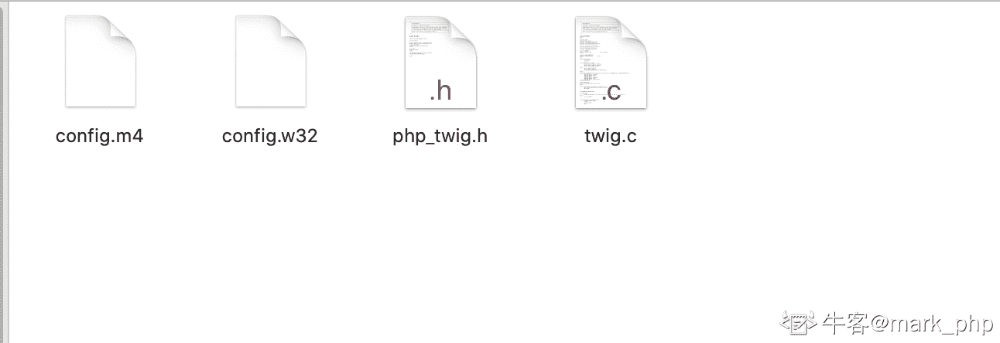

# 京东 2018 秋招 PHP 开发工程师笔试题

## 1

如下的 php 代码运行后，数组$array 里的值是什么？

```cpp
$array = array('1','1');
foreach($array as $k=>$v){
     $v  =  2;
}
```

正确答案: B   你的答案: 空 (错误)

```cpp
array('2','2')
```

```cpp
array('1','1')
```

```cpp
array(2,2)
```

```cpp
array(Null,Null)
```

本题知识点

Java 工程师 C++工程师 iOS 工程师 安卓工程师 运维工程师 前端工程师 算法工程师 PHP 工程师 京东 PHP 工程师 京东 2018

讨论

[↘↘悲伤ろ逆流ぺ](https://www.nowcoder.com/profile/5494611)

$v 相当于指向$arr 中某个元素的另一个 zval，只是值相同，因此$v 修改不影响$arr 中元素

发表于 2018-05-21 21:14:37

* * *

## 2

如果有一个数组$arr = array(2,5,4,32,27,56,65,22)，下列循环可以实现升序排序的是(  )

正确答案: D   你的答案: 空 (错误)

```cpp
$num = count($arr);  
  for($i=0;$i&lt;$num;$i++){
	for($j=$num-1;$j&gt;$i;$j--){
			$tmp = $arr[$j];
			$arr[$j] = $arr[$j-1];
			$arr[$j-1] = $tmp; }}
```

```cpp
$num = count($arr);  
  for($i=0;$i&lt;$num;$i++){
	for($j=$num-1;$j&gt;$i;$j--){
			$tmp = $arr[$j];
			$arr[$j] = $arr[$j-1];
			$arr[$j-1] = $tmp; }}
```

```cpp
$num = count($arr);  
  for($i=0;$i&lt;$num;$i++){
	for($j=$num-1;$j&gt;$i;$j--){
		if($arr[$j]&gt;$arr[$j-1]){
			$tmp = $arr[$j];
			$arr[$j] = $arr[$j-1];
			$arr[$j-1] = $tmp; }}}
```

```cpp
$num = count($arr);  
  for($i=0;$i&lt;$num;$i++){
	for($j=$num-1;$j&gt;$i;$j--){
		if($arr[$j]&lt;$arr[$j-1]){
			$tmp = $arr[$j];
			$arr[$j] = $arr[$j-1];
			$arr[$j-1] = $tmp; }}}
```

本题知识点

Java 工程师 C++工程师 iOS 工程师 安卓工程师 运维工程师 前端工程师 算法工程师 PHP 工程师 京东 2018

讨论

[zhongliwen](https://www.nowcoder.com/profile/2605138)

冒泡排序的代码，&lt 代表小于

发表于 2018-09-09 16:11:38

* * *

## 3

以下 PHP 程序的输出结果是:(  )

```cpp
<?php
$arr = str_split("tarena",2);
echo $arr[1];
?>
```

正确答案: C   你的答案: 空 (错误)

```cpp
ta
```

```cpp
r
```

```cpp
re
```

```cpp
e
```

本题知识点

Java 工程师 C++工程师 iOS 工程师 安卓工程师 运维工程师 前端工程师 算法工程师 PHP 工程师 京东 2018

讨论

[安静的 walker](https://www.nowcoder.com/profile/4761700)

首先，split 是字符串转数组的方法，将每个字符转换为单个的数组中的值，后面的参数 2 即将每隔 2 个字符为一个数组中的值，arr[1]的结果就是[re]

发表于 2018-06-12 11:27:15

* * *

[mark_php](https://www.nowcoder.com/profile/38262677)

Cstr_split()函数把字符串分割到数组中去，每个数组元素默认的长度是 1 可以通过第二个参数设置

发表于 2021-04-14 10:26:47

* * *

[曹鹏](https://www.nowcoder.com/profile/3785209)

$arr 的结果为["ta", "re", "na"]所以$arr[1]应该为"re" 

发表于 2018-06-12 09:43:31

* * *

## 4

PHP 中以下哪些情况会产生短路情况

正确答案: B D   你的答案: 空 (错误)

```cpp
&amp;&amp;或 or 运算时，第一个表达式的结果为 true
```

```cpp
&amp;&amp;或 and 运算时，第一个表达式的结构为 false
```

```cpp
||或 and 运算时，第一个表达式为 true
```

```cpp
||或 or 运算时，第一个表达式为 true
```

本题知识点

Java 工程师 C++工程师 iOS 工程师 安卓工程师 运维工程师 前端工程师 算法工程师 PHP 工程师 京东 2018

讨论

[zhongliwen](https://www.nowcoder.com/profile/2605138)

&&amp 是‘&&’的转义字符

发表于 2018-09-09 16:13:08

* * *

## 5

在虚拟存储系统中，若进程在内存中占三块，开始时为空，开始访问为空时也算缺页，采用先进先出页面淘汰算法，当执行访问页号序列为 1、2、3、4、1、2、5、1、2、3、4、5、6 时，将产生（ ）次缺页中断。

正确答案: D   你的答案: 空 (错误)

```cpp
7
```

```cpp
11
```

```cpp
9
```

```cpp
10
```

本题知识点

Java 工程师 C++工程师 iOS 工程师 安卓工程师 运维工程师 前端工程师 算法工程师 PHP 工程师 京东 PHP 工程师 京东 2018

讨论

[小嗨喜欢在阳台看花海](https://www.nowcoder.com/profile/6813469)

1、2、3、4、1、2、5、1、2、3、4、5、61、2、3---------------------------------123（缺页三次）4、1、2、5-----------------------------234（缺）、341（缺）、412（缺）、125（缺）（共四次）1、2、3、4、5、6-------------------125、125、253（缺）、534（缺）、534、346（缺）（共三次）所以共缺页 10 次。注意：不缺页的时候，内存快内的顺序不会发生变化，即先进先出的意思。

发表于 2018-06-15 16:08:21

* * *

[YY-帆 S](https://www.nowcoder.com/profile/1427645)

FIFO 1、2、3、4、1、2、5、1、2、3、4、5、6         1    1   1   **4**    4    4   5               5   5         6               2   2   2    1    1   1               3   2         2                    3   3    3    2   2               2   4         4 缺页   x   x    x    x    x     x   x                x   x         x

发表于 2018-08-06 23:04:42

* * *

[博客 winnner](https://www.nowcoder.com/profile/8927983)

本来第一眼就以为 7 次缺页中断，却忘记前 3 次插入的时候也会产生缺页中断

发表于 2018-05-21 20:35:36

* * *

## 6

有关 linux 线程的描述，正确的是( )。

正确答案: A B C   你的答案: 空 (错误)

```cpp
线程自己拥有很少的资源，但它可以使用所属进程的资源
```

```cpp
由于同一进程中的多个线程具有相同的地址空间，所以它们间的同步和通信也易于实现
```

```cpp
进程创建与线程创建的时空开销不相同
```

```cpp
线程是资源分配的基本单位，进程是资源调度的基本单位
```

本题知识点

Java 工程师 C++工程师 iOS 工程师 安卓工程师 运维工程师 前端工程师 算法工程师 PHP 工程师 京东 2018

讨论

[牛客 859114727 号](https://www.nowcoder.com/profile/859114727)

进程是资源分配的基本单位.线程是执行和调度的基本单位

发表于 2020-07-20 12:01:54

* * *

## 7

进程会在各个状态之间切换，下面哪些是不可能的

正确答案: C   你的答案: 空 (错误)

```cpp
运行&rarr;就绪
```

```cpp
运行&rarr;等待
```

```cpp
等待&rarr;运行
```

```cpp
等待&rarr;就绪
```

本题知识点

Java 工程师 C++工程师 iOS 工程师 安卓工程师 运维工程师 前端工程师 算法工程师 PHP 工程师 京东 PHP 工程师 京东 2018

讨论

[牛客 859114727 号](https://www.nowcoder.com/profile/859114727)

出现等待事件：运行→等待等待结束：等待→就绪选中：就绪→运行落选：运行→就绪

发表于 2020-07-20 12:05:23

* * *

## 8

若一序列进栈顺序为 a1,a2,a3,a4，问存在多少种可能的出栈序列（       ）

正确答案: C   你的答案: 空 (错误)

```cpp
12
```

```cpp
13
```

```cpp
14
```

```cpp
15
```

本题知识点

Java 工程师 C++工程师 iOS 工程师 安卓工程师 运维工程师 前端工程师 算法工程师 PHP 工程师 京东 PHP 工程师 京东 2018

讨论

[博客 winnner](https://www.nowcoder.com/profile/8927983)

利用卡特兰公式 C(2*N,N)/(N+1)4 个元素的出栈的情况有：C(8,4)/(4+1) = 70/5 = 14C(8,4) = (8*7*6*5)/(4*3*2*1)=70

发表于 2018-05-21 23:04:46

* * *

## 9

查询该目录及子目录下所有的以.conf 为后缀的文件

正确答案: D   你的答案: 空 (错误)

```cpp
find ./ -name &ldquo;conf&rdquo;
```

```cpp
find ./ -name &quot;*.[conf]&quot;
```

```cpp
find ./ -type d | egrep &quot;\.(conf)&quot;
```

```cpp
find ./ -regextype posix-extended -regex &quot;.*\.(conf)&quot;
```

本题知识点

Java 工程师 C++工程师 iOS 工程师 安卓工程师 运维工程师 前端工程师 算法工程师 PHP 工程师 京东 PHP 工程师 京东 2018

## 10

正则表达式 ^d+[^d]+ 能匹配下列哪个字符串？

正确答案: C   你的答案: 空 (错误)

```cpp
123
```

```cpp
123a
```

```cpp
d123
```

```cpp
123def
```

```cpp
d7d
```

本题知识点

Java 工程师 C++工程师 iOS 工程师 安卓工程师 运维工程师 前端工程师 算法工程师 PHP 工程师 京东 PHP 工程师 京东 2018

讨论

[博客 winnner](https://www.nowcoder.com/profile/8927983)

*分隔符*

正斜线(/)

hash 符号(#)

取反符号(~)

*通用原子*

```cpp
"\d"：0~9 的十进制
```

```cpp
"\D":除了 0~9 十进制的字符
```

```cpp
"\w":字母，数字，下划线
```

```cpp
"\W":不是字母，数字，下划线的字符
```

```cpp
"\s":空白符
```

```cpp
"\S":除了空白符的字符
```

*元字符*

```cpp
".":除了换行符的所有字符
```

```cpp
"*":匹配前面的字符出现 0/1/多次
```

```cpp
"?":匹配前面的字符出现 0/1 次
```

```cpp
"^":以该字符开头
```

```cpp
"$":以该字符结尾
```

```cpp
"+":出现 1/多次
```

```cpp
"{n}":恰好出现 n 次
```

```cpp
"{n,}":出现>=n 次
```

```cpp
"{n,m}":>=n 次且<=m 次
```

```cpp
"[]":集合,eg:[a,b,c]->匹配 a 或 b 或 c
```

```cpp
"()":形成一个整体(一般用来后向引用)
```

```cpp
"[^]":取反,eg:[^a,b,c]->除了 a，除了 b，除了 c
```

```cpp
"|":或
```

```cpp
"[-]":范围,eg:[0-9]->表示 0 到 9 的范围
```

*模式修正符*

```cpp
i:不区分大小写
```

```cpp
m:将字符串通过分隔符进行分隔，并对每一行进行匹配(字符串需要换行)
```

```cpp
s:修正.和换行
```

```cpp
U:取消贪婪模式
```

```cpp
x:忽略模式的空白符
```

```cpp
A:以模式开头
```

```cpp
D:修正$对换行的匹配
```

```cpp
u:utf-8 中文匹配
``` 

编辑于 2018-05-21 23:22:55

* * *

## 11

一个序列为（13,18,24,35,47,50,63,83,90,115,124），如果利用二分法查找关键字为 90 的，则需要几次比较 ？

正确答案: B   你的答案: 空 (错误)

```cpp
1
```

```cpp
2
```

```cpp
3
```

```cpp
4
```

本题知识点

Java 工程师 C++工程师 iOS 工程师 安卓工程师 运维工程师 前端工程师 算法工程师 PHP 工程师 京东 2018

讨论

[牛客 859114727 号](https://www.nowcoder.com/profile/859114727)

二分法，取中间值对比。如果大，就往后取，小就往前取。这个题的意思是，在排好顺序的情况下的二分法，所以第一次比较比较 50 和 90 的大小，发现 90 更大，所以从较大序列查询，第二次刚好是 90

发表于 2020-07-20 13:56:30

* * *

## 12

cookie 安全机制，cookie 有哪些设置可以提高安全性？

正确答案: A B C   你的答案: 空 (错误)

```cpp
指定 cookie domain 的子域名
```

```cpp
httponly 设置
```

```cpp
cookie secure 设置，保证 cookie 在 https 层面传输
```

```cpp
都不对
```

本题知识点

Java 工程师 C++工程师 iOS 工程师 安卓工程师 运维工程师 前端工程师 算法工程师 PHP 工程师 京东 2018

讨论

[牛客 859114727 号](https://www.nowcoder.com/profile/859114727)

设置 cookies 时，可以设置 cookie 的**域名参数 domain**，标识 cookie 在特定站点的合法性。

基于安全的考虑，需要给 cookie 加上 Secure 和 HttpOnly 属性，设置**HttpOnly=true**的 cookie 不能被 js 获取到，无法用 document.cookie 打出 cookie 的内容。

**Secure 属性**是说如果一个 cookie 被设置了 Secure=true，那么这个 cookie 只能用 https 协议发送给服务器，用 http 协议是不发送的。

发表于 2020-07-20 13:58:19

* * *

[博客 winnner](https://www.nowcoder.com/profile/8927983)

对保存在 cookie 里面的敏感信息加密设置 httpOnly 设置 Securecookie 设置有效期 cookie 加个时间戳和 IP 戳(实际上就是让 cookies 在同一个 IP 下多少时间内失效)

发表于 2018-05-21 23:31:20

* * *

## 13

下列选项中，有关死锁的说法正确的是？

正确答案: A D   你的答案: 空 (错误)

```cpp
采用&ldquo;按序分配&rdquo;策略可以破坏产生死锁的环路等待条件
```

```cpp
在资源的动态分配过程中，防止系统进入安全状态，可避免发生死锁
```

```cpp
银行家算法是最有代表性的死锁解除算法
```

```cpp
产生死锁的现象是每个进程等待着某个不能得到且不可释放的资源
```

本题知识点

Java 工程师 C++工程师 iOS 工程师 安卓工程师 运维工程师 前端工程师 算法工程师 PHP 工程师 京东 2018

讨论

[YY-帆 S](https://www.nowcoder.com/profile/1427645)

银行家算法是避免死锁的算法

发表于 2018-08-06 23:06:43

* * *

## 14

把 14,27,71,50,93,39 按顺序插入一棵树,插入的过程不断调整使树为平衡排序二叉树,最终形成平衡排序二叉树高度为？

正确答案: A   你的答案: 空 (错误)

```cpp
3
```

```cpp
4
```

```cpp
5
```

```cpp
6
```

本题知识点

Java 工程师 C++工程师 iOS 工程师 安卓工程师 运维工程师 前端工程师 算法工程师 PHP 工程师 京东 PHP 工程师 京东 2018

## 15

关于 HTTP 协议头描述不正确的是()

正确答案: A C   你的答案: 空 (错误)

```cpp
cookie 是通过 http 请求正文传到服务器端
```

```cpp
cookie 是保存在客户端的
```

```cpp
服务器端可以读取客户端的所有 cookie
```

```cpp
cookie 是通过 http 请求报头传到服务器端
```

本题知识点

Java 工程师 C++工程师 iOS 工程师 安卓工程师 运维工程师 前端工程师 算法工程师 PHP 工程师 京东 2018

## 16

以下正确的 shell 函数声明并且成功调用的是:

正确答案: C D   你的答案: 空 (错误)

```cpp
<div>function func(){<br>        echo &quot;Success&quot;<br>}<br>func()</div>

```

```cpp
<div>func(){<br>           echo &quot;Success&quot;<br>}<br>func()</div>

```

```cpp
<div>function func(){<br>    echo &quot;Success&quot;<br>}<br>func</div>

```

```cpp
<div>func(){<br>    echo &quot;Success&quot;<br>}<br>func</div>

```

本题知识点

Java 工程师 C++工程师 iOS 工程师 安卓工程师 运维工程师 前端工程师 算法工程师 PHP 工程师 京东 2018

## 17

现有 testfile 文件内容如下所示
12
12
213
5434
3123
123
34
对所有数字求和，以下做法正确的是:

正确答案: B D   你的答案: 空 (错误)

```cpp
awk 'BEGIN{sum}{sum+$1}END{print sum}' testfile
```

```cpp
awk 'BEGIN{sum =0}{sum+=$1}END{print sum}' testfile
```

```cpp
awk '{sum+$1}END{print sum}' testfile
```

```cpp
awk '{sum+=$1}END{print sum}' testfile
```

本题知识点

Java 工程师 C++工程师 iOS 工程师 安卓工程师 运维工程师 前端工程师 算法工程师 PHP 工程师 京东 2018

## 18

下面选项中对 TCP 与 UDP 论述正确的是？

正确答案: A C D   你的答案: 空 (错误)

```cpp
TCP 是面向连接的，如打电话要先拨号建立连接
```

```cpp
TCP 支持一对一，一对多，多对一和多对多的交互通信
```

```cpp
TCP 面向字节流，实际上是 TCP 把数据看成一连串无结构的字节流
```

```cpp
UDP 是无连接的，即发送数据之前不需要建立连接
```

本题知识点

Java 工程师 C++工程师 iOS 工程师 安卓工程师 运维工程师 前端工程师 算法工程师 PHP 工程师 京东 2018

## 19

东东从京京那里了解到有一个无限长的数字序列: 1, 2, 2, 3, 3, 3, 4, 4, 4, 4, 5, 5, 5, 5, 5, ...(数字 k 在该序列中正好出现 k 次)。东东想知道这个数字序列的第 n 项是多少,你能帮帮他么

本题知识点

Java 工程师 C++工程师 iOS 工程师 安卓工程师 运维工程师 前端工程师 算法工程师 PHP 工程师 京东 数学 2018

讨论

[内涵段子](https://www.nowcoder.com/profile/6828775)

```cpp
#include<iostream>
#include<math.h>
#include<iomanip>
using namespace std;
int main(){
    long long k = 0;
    cin >> k;
    cout << fixed << setprecision(0) << ceil((sqrt(1+8*k)-1)/2);
    return 0;
}
```

编辑于 2018-09-20 11:10:59

* * *

[子房](https://www.nowcoder.com/profile/8541890)

importjava.util.Scanner;publicclassMain {    publicstaticvoidmain(String args[]) {        Scanner  scanner = newScanner(System.in);        longn = scanner.nextLong();        longcount = 0;        for(inti = 1; i< n; i++){                count = count +1*i;                if(count -i <  n  && n <= count){                    System.out.print(i);                    break;                }        }    }}

发表于 2018-08-12 20:01:53

* * *

[袁博文 202](https://www.nowcoder.com/profile/808747)

```cpp
import math
n = int(input())
m = int(math.sqrt(2*n))
if m*m+m>=2*n:
    if m*m-m<2*n:
        print(m)
    else:
        print(m-1)
else:
    print(m+1)

```

发表于 2018-06-14 22:50:21

* * *

## 20

东东在一本古籍上看到有一种神奇数,如果能够将一个数的数字分成两组,其中一组数字的和等于另一组数字的和,我们就将这个数称为神奇数。例如 242 就是一个神奇数,我们能够将这个数的数字分成两组,分别是{2,2}以及{4},而且这两组数的和都是 4.东东现在需要统计给定区间中有多少个神奇数,即给定区间[l, r],统计这个区间中有多少个神奇数,请你来帮助他。

本题知识点

Java 工程师 C++工程师 iOS 工程师 安卓工程师 运维工程师 前端工程师 算法工程师 PHP 工程师 京东 模拟 动态规划 穷举 2018

## 21

用浏览器访问[www.jd.com](http://www.jd.com)时，可能使用到的协议有？

正确答案: A B D   你的答案: 空 (错误)

```cpp
MAC
```

```cpp
HTTP
```

```cpp
SMTP
```

```cpp
ARP
```

```cpp
RTSP
```

本题知识点

Java 工程师 C++工程师 iOS 工程师 安卓工程师 运维工程师 前端工程师 算法工程师 PHP 工程师 京东 2018

## 22

下列语句中那个可以解决跨越问题：

正确答案: A   你的答案: 空 (错误)

```cpp
header(&quot;Access-Control-Allow-Origin: *&quot;);
```

```cpp
header('Location: *');
```

```cpp
header(&quot;Content-type:application/pdf&quot;);
```

```cpp
header(&quot;Content-Disposition:attachment;filename='allow-access.php'&quot;);
```

本题知识点

Java 工程师 C++工程师 iOS 工程师 安卓工程师 运维工程师 前端工程师 算法工程师 PHP 工程师 京东 2018

## 23

php 关于类继承说法正确的是

正确答案: B   你的答案: 空 (错误)

```cpp
子类可以直接调用基类的所有方法
```

```cpp
子类可以重写基类的方法
```

```cpp
子类可以直接继承多个基类
```

```cpp
子类可以重写基类 protected 级别方法为 private 级别
```

本题知识点

Java 工程师 C++工程师 iOS 工程师 安卓工程师 运维工程师 前端工程师 算法工程师 PHP 工程师 京东 2018

讨论

[牛客 597912832 号](https://www.nowcoder.com/profile/597912832)

B

发表于 2021-09-27 16:08:43

* * *

[牛客 889934351 号](https://www.nowcoder.com/profile/889934351)

子类可以重写基类方法

发表于 2021-09-10 16:16:09

* * *

[lobamhuang](https://www.nowcoder.com/profile/120107339)

*   ```cpp
    子类可以直接调用基类的所有方法；-》 protected 方法不可以
    ```

*   ```cpp
    子类可以重写基类的方法  -》 正确
    ```

*   ```cpp
    子类可以直接继承多个基类 -》 只能继承一个基类，接口才可以实现多个接口
    ```

*   ```cpp
    子类可以重写基类 protected 级别方法为 private 级别  -》  不能重写 protected
    ```

发表于 2021-09-08 09:32:41

* * *

## 24

php 中如果想查看某个表达式的值和类型，可以用 ___?

正确答案: D   你的答案: 空 (错误)

```cpp
echo()
```

```cpp
print_r()
```

```cpp
var_export()
```

```cpp
var_dump()
```

本题知识点

Java 工程师 C++工程师 iOS 工程师 安卓工程师 运维工程师 前端工程师 算法工程师 PHP 工程师 京东 2018 百度 2020

讨论

[mark_php](https://www.nowcoder.com/profile/38262677)

D 几种打印方式效果如下：

```cpp
$demoArr = ['key'=>'value'];
echo $demoArr;
print $demoArr;
print_r($demoArr);
var_export($demoArr);
var_dump($demoArr);

ArrayArrayArray ( [key] => value ) array ( 'key' => 'value', )
/Applications/MAMP/htdocs/leaning/php/index.php:16:
array (size=1)
  'key' => string 'value' (length=5)
```

echo 和 print 的区别在于 echo 可以同时打印多个，print 只能打印单个但是有返回值

编辑于 2021-04-15 10:18:16

* * *

## 25

下列不属于 php 魔术常量的是：

正确答案: D   你的答案: 空 (错误)

```cpp
__LINE__
```

```cpp
__FUNCTION__
```

```cpp
__TRAIT__
```

```cpp
__OBJECT__
```

本题知识点

Java 工程师 C++工程师 iOS 工程师 安卓工程师 运维工程师 前端工程师 算法工程师 PHP 工程师 京东 2018

讨论

[mark_php](https://www.nowcoder.com/profile/38262677)

D 没有 __OBJECT__  只有 __CLASS__

发表于 2021-04-14 10:10:33

* * *

## 26

php 中关于 trait 的说法错误的是：

正确答案: A   你的答案: 空 (错误)

```cpp
trait 跟类一样可以被实例化
```

```cpp
trait 会覆盖基类中的函数
```

```cpp
引用 trait 的当前类中函数可以覆盖 trait 中函数
```

```cpp
一个 php 类可以引用多个 trait
```

本题知识点

Java 工程师 C++工程师 iOS 工程师 安卓工程师 运维工程师 前端工程师 算法工程师 PHP 工程师 京东 2018

讨论

[mark_php](https://www.nowcoder.com/profile/38262677)

Atrait 只能被引用，不能被实例化 trait 会覆盖基类中的函数 但是会被当前引用类中的函数覆盖

编辑于 2021-04-14 10:22:31

* * *

## 27

关于 php 性能优化方面说法错误的是：

正确答案: D   你的答案: 空 (错误)

```cpp
尽量使用 ‘’ 而不是“”
```

```cpp
如果可以的话 ，尽量用 static 函数
```

```cpp
遇到大数组操作尽量传引用，尽量避免多次 copy
```

```cpp
递增局部变量比递增全局变量要慢
```

本题知识点

Java 工程师 C++工程师 iOS 工程师 安卓工程师 运维工程师 前端工程师 算法工程师 PHP 工程师 京东 2018

## 28

对于一下函数的两种调用方式，将分别输出什么

```cpp
function test(&$a)
{
  $a=$a+100;
}
```

1，$b = 1; test($b); echo $b;
2，$a = 1; test(1); echo $a;

正确答案: D   你的答案: 空 (错误)

```cpp
1 输出 101，2 输出 1
```

```cpp
1 输出 1，2 将输出 1
```

```cpp
1 输出 1，2 将报错
```

```cpp
1 输出 101，2 将报错
```

本题知识点

Java 工程师 C++工程师 iOS 工程师 安卓工程师 运维工程师 前端工程师 算法工程师 PHP 工程师 京东 2018

## 29

关于在 php 中使用多进程或者多线程的说法错误的是：

正确答案: C   你的答案: 空 (错误)

```cpp
在 CLI 下使用 php 自带的 pthread 扩展
```

```cpp
使用 swoole 扩展实现
```

```cpp
使用 new MyThread() 创建一个新的线程，可以多次使用
```

```cpp
用 php 函数 pcntl_fork
```

本题知识点

Java 工程师 C++工程师 iOS 工程师 安卓工程师 运维工程师 前端工程师 算法工程师 PHP 工程师 京东 2018

## 30

如果需要开发一个标准 php 的扩展，必须包含那些文件(多选)：

正确答案: A B C D   你的答案: 空 (错误)

```cpp
config.m4
```

```cpp
config.w32
```

```cpp
php_counter.h
```

```cpp
counter.c
```

```cpp
package.xml
```

本题知识点

Java 工程师 C++工程师 iOS 工程师 安卓工程师 运维工程师 前端工程师 算法工程师 PHP 工程师 京东 2018

讨论

[mark_php](https://www.nowcoder.com/profile/38262677)

A B C D 如下一个扩展会包含 4 个文件

发表于 2021-04-13 15:10:12

* * *

## 31

如何有效防止 CSRF 跨站请求伪造

正确答案: A   你的答案: 空 (错误)

```cpp
在客户端页面提交的表单中增加伪随机数
```

```cpp
使用 htmlentities 函数进行过滤
```

```cpp
通过设置 header 信息防止跨域请求
```

```cpp
使用 strip_tags 函数进行处理
```

本题知识点

Java 工程师 C++工程师 iOS 工程师 安卓工程师 运维工程师 前端工程师 算法工程师 PHP 工程师 京东 2018

## 32

如果使用 composer 引入一个名字叫 test 的包的   并加载这个包的 大于 1.2 小于 2.0 版本，需要执行什么命令

正确答案: A   你的答案: 空 (错误)

```cpp
composer require test ~1.2
```

```cpp
composer install test ~1.2
```

```cpp
composer update test ~1.2
```

```cpp
composer install test -V ~1.2
```

本题知识点

Java 工程师 C++工程师 iOS 工程师 安卓工程师 运维工程师 前端工程师 算法工程师 PHP 工程师 京东 2018