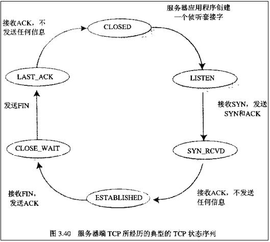

# 京东 2018 秋招测试开发工程师笔试题

## 1

若度为 m 的哈夫曼树中，其叶结点个数为 n，则非叶结点的个数为（）

正确答案: C   你的答案: 空 (错误)

```cpp
n-1
```

```cpp
n/m-1
```

```cpp
(n-1)/(m-1)
```

```cpp
n/(m-1)-1
```

```cpp
(n+1)/(m+1)-1
```

本题知识点

Java 工程师 C++工程师 iOS 工程师 安卓工程师 运维工程师 前端工程师 算法工程师 PHP 工程师 京东 测试开发工程师 京东 2018

讨论

[武培轩](https://www.nowcoder.com/profile/5033606)

**正确答案**C**答案解析****设非叶子结点数量为 x，则总结点个数为 x+n；度为 m 的哈曼夫树，每个非叶结点都有 m 个分叉，故结点总数为 x*m+1，x*m 是不包含根节点的；x+n=x*m+1，解得 x=（n-1）/（m-1）**

发表于 2018-09-09 16:37:55

* * *

[求求求 offerofferoffer](https://www.nowcoder.com/profile/3783932)

设非叶子结点数量为 x，则总结点个数为 x+n；度为 m 的哈曼夫树，每个非叶结点都有 m 个分叉，故结点总数为 x*m+1，x*m 是不包含根节点的；x+n=x*m+1，解得 x=（n-1）/（m-1）

编辑于 2018-09-06 23:43:27

* * *

[达克莱伊](https://www.nowcoder.com/profile/5860214)

平时我们见得都是度为 2 的 human 树，已知叶节点数，那么非叶节点减一，两个叶子节点构造一个新的节点。如果是度为 3 的节点，在草稿纸上画一下就知道，还需要除以分母（m-1)

发表于 2018-07-25 13:20:46

* * *

## 2

有关 linux 线程的描述，正确的是( )。

正确答案: A B C   你的答案: 空 (错误)

```cpp
线程自己拥有很少的资源，但它可以使用所属进程的资源
```

```cpp
由于同一进程中的多个线程具有相同的地址空间，所以它们间的同步和通信也易于实现
```

```cpp
进程创建与线程创建的时空开销不相同
```

```cpp
线程是资源分配的基本单位，进程是资源调度的基本单位
```

本题知识点

Java 工程师 C++工程师 iOS 工程师 安卓工程师 运维工程师 前端工程师 算法工程师 PHP 工程师 京东 测试开发工程师 2018

讨论

[JusticeZZZ](https://www.nowcoder.com/profile/878011630)

进程是**系统**进行**资源分配和调度**的一个基本单位，线程是**cpu**进行**调度和分派**的基本单位

发表于 2018-09-10 15:37:39

* * *

[武培轩](https://www.nowcoder.com/profile/5033606)

**正确答案**ABC**答案解析**D：进程是资源分配的基本单位，线程是资源调度的基本单位

发表于 2018-09-09 16:38:56

* * *

[FanFan520](https://www.nowcoder.com/profile/652481055)

进程是 CPU 资源分配的基本单位，线程是独立运行和独立调度的基本单位（CPU 上真正运行的是线程）。进程拥有自己的资源空间，一个进程包含若干个线程，线程与 CPU 资源分配无关。

发表于 2020-08-05 15:11:27

* * *

## 3

进程会在各个状态之间切换，下面哪些是不可能的

正确答案: C   你的答案: 空 (错误)

```cpp
运行&rarr;就绪
```

```cpp
运行&rarr;等待
```

```cpp
等待&rarr;运行
```

```cpp
等待&rarr;就绪
```

本题知识点

Java 工程师 C++工程师 iOS 工程师 安卓工程师 运维工程师 前端工程师 算法工程师 PHP 工程师 京东 测试开发工程师 京东 2018

讨论

[J201806141519810](https://www.nowcoder.com/profile/168860827)


发表于 2018-06-28 14:19:17

* * *

[武培轩](https://www.nowcoder.com/profile/5033606)

**正确答案**C**答案解析**进程有三种状态，分别是等待、就绪和执行。它们之间存在转换关系，但不可能出现就绪到等待这种转换。

*   运行态→等待态：等待使用资源；如等待外设传输；等待人工干预。
*   等待态→就绪态：资源得到满足；如外设传输结束；人工干预完成。
*   运行态→就绪态：运行时间片到；出现有更高优先权进程。
*   就绪态→运行态：CPU 空闲时选择一个就绪进程。

编辑于 2018-09-09 16:41:17

* * *

[鲨鱼来啦](https://www.nowcoder.com/profile/664777425)

出现等待事件：运行→等待等待结束：等待→就绪选中：就绪→运行落选：运行→就绪

编辑于 2018-07-26 16:28:22

* * *

## 4

以下哪些状态为 TCP 连接关闭过程中的出现的状态？

正确答案: B C   你的答案: 空 (错误)

```cpp
LISTEN
```

```cpp
TIME-WAIT
```

```cpp
LAST-ACK
```

```cpp
SYN-RECEIVED
```

本题知识点

Java 工程师 C++工程师 iOS 工程师 安卓工程师 运维工程师 前端工程师 算法工程师 PHP 工程师 京东 测试开发工程师 2018

讨论

[武培轩](https://www.nowcoder.com/profile/5033606)

**正确答案**

BC

**答案解析**


发表于 2018-09-09 16:43:30

* * *

[kemon](https://www.nowcoder.com/profile/6888928)



编辑于 2018-05-21 21:12:23

* * *

## 5

下面选项中，和 192.168.3.110/27 属于一个子网的有哪些

正确答案: B D   你的答案: 空 (错误)

```cpp
192.168.3.94
```

```cpp
192.168.3.124
```

```cpp
192.168.3.96
```

```cpp
192.168.3.126
```

本题知识点

Java 工程师 C++工程师 iOS 工程师 安卓工程师 运维工程师 前端工程师 算法工程师 PHP 工程师 京东 测试开发工程师 2018

讨论

[蓝齐儿](https://www.nowcoder.com/profile/674273)

192.168.3.110/27 前 27 位都是一样的，最后 8 位为**011**01110，则其子网的范围为**011**00000~**011**11111，转化成 10 进制，则为 192.168.3.96~192.168.3.127，在这个范围的都是正确答案。

发表于 2018-09-05 10:43:13

* * *

[鲨鱼来啦](https://www.nowcoder.com/profile/664777425)

原来第一个不算喔 最后一个也不算

发表于 2018-06-28 10:41:59

* * *

[来个吧 baby](https://www.nowcoder.com/profile/4467777)

主机号全 1 为子网[广播地址](https://www.baidu.com/s?wd=%E5%B9%BF%E6%92%AD%E5%9C%B0%E5%9D%80&tn=SE_PcZhidaonwhc_ngpagmjz&rsv_dl=gh_pc_zhidao)，主机号全 0 为子网网络地址，这两个地址在任何网络中都不能分配给主机用，完事。

发表于 2018-09-05 23:35:23

* * *

## 6

若一序列进栈顺序为 a1,a2,a3,a4，问存在多少种可能的出栈序列（       ）

正确答案: C   你的答案: 空 (错误)

```cpp
12
```

```cpp
13
```

```cpp
14
```

```cpp
15
```

本题知识点

Java 工程师 C++工程师 iOS 工程师 安卓工程师 运维工程师 前端工程师 算法工程师 PHP 工程师 京东 测试开发工程师 京东 2018

讨论

[33 平凡的世界](https://www.nowcoder.com/profile/5027098)

卡特兰公式 C(2n,n)/(n+1) = (2n)!/n!*(2n-n)!/(n+1) = (2n)!/(n!*n!)/n+1=14

发表于 2018-05-19 14:42:10

* * *

[武培轩](https://www.nowcoder.com/profile/5033606)

**正确答案**C**答案解析**卡特兰数：，当 n 等于 4 时，代入得 14.

发表于 2018-09-09 16:49:39

* * *

## 7

下面关于 c++拷贝构造函数说法错误的是（    ）

正确答案: B   你的答案: 空 (错误)

```cpp
产生了新的对象实例，调用的就是拷贝构造函数；如果没有，调用的是赋值运算符
```

```cpp
没有定义拷贝构造函数的话，编译器不会默认自动产生拷贝构造函数
```

```cpp
类中可以存在超过一个拷贝构造函数
```

```cpp
声明一个私有拷贝构造函数可以防止按值传递对象
```

本题知识点

Java 工程师 C++工程师 iOS 工程师 安卓工程师 运维工程师 前端工程师 算法工程师 PHP 工程师 京东 测试开发工程师 2018 C++

讨论

[ruolinchangfeng](https://www.nowcoder.com/profile/5653652)

重点是 C 选项。

```cpp
类中可以存在超过一个拷贝构造函数
```

可以有 A(A &a)和 A(const A &a)

发表于 2018-09-09 15:09:25

* * *

[Samyerye](https://www.nowcoder.com/profile/8132545)

当创建一个类对象的时候，编译器会默认加入：构造函数，拷贝构造函数，赋值函数，取值函数；因此 B 选项也是错误的，即使用户没有显式定义拷贝构造函数，编译器也会隐式生成

发表于 2020-10-11 16:24:04

* * *

[牛客 41773018 号](https://www.nowcoder.com/profile/41773018)

A 为何不是错的？产生新的对象实例可以用普通的构造函数啊？

发表于 2022-03-20 11:47:01

* * *

## 8

查询该目录及子目录下所有的以.conf 为后缀的文件

正确答案: D   你的答案: 空 (错误)

```cpp
find ./ -name &ldquo;conf&rdquo;
```

```cpp
find ./ -name &quot;*.[conf]&quot;
```

```cpp
find ./ -type d | egrep &quot;\.(conf)&quot;
```

```cpp
find ./ -regextype posix-extended -regex &quot;.*\.(conf)&quot;
```

本题知识点

Java 工程师 C++工程师 iOS 工程师 安卓工程师 运维工程师 前端工程师 算法工程师 PHP 工程师 京东 测试开发工程师 京东 2018

## 9

若将网络 192.168.0.0/22 划分为 5 个子网，则可以划分出的最小子网的子网掩码是

正确答案: C   你的答案: 空 (错误)

```cpp
255.255.255.0
```

```cpp
255.255.255.128
```

```cpp
255.255.255.192
```

```cpp
255.255.255.224
```

本题知识点

Java 工程师 C++工程师 iOS 工程师 安卓工程师 运维工程师 前端工程师 算法工程师 PHP 工程师 京东 测试开发工程师 京东 2018

讨论

[小冲冲](https://www.nowcoder.com/profile/4754385)

划分 5 个子网，需要 3 位应该就够了，本来网络号占了 22 位，所以只需要再占 3 位，25 位就够了，所以子网掩码就是前 25 位都是 1，即 255.255.255.128，所以这个题目不应该选 B 吗？我错了还是答案错了，麻烦会的给解释一下。

发表于 2018-06-01 14:59:23

* * *

[燃烧的雪](https://www.nowcoder.com/profile/9921213)

应该是 32 位，分 5 个子网，占据 3 位，加上之前 22 位，是 25 位，那么子网掩码为 11111111,11111111,11111111,10000000，但是除去网络号的 25 位后，还剩下 7 位 0000000，首位不能唯为 0,就是 1000000，加上之前的 11111111,11111111,11111111,10000000，就变成了 11111111，11111111,11111111,11000000，只有首位为 1 是最小值，所以 128+64 等于 192。主机号全 1 为子网广播地址，主机号全 0 为子网网络地址，这两个地址在任何网络中都不能分配给主机用。后 7 位不能全 0，也不能全 1！

编辑于 2018-09-05 21:13:40

* * *

[道友请留步 20180723235728](https://www.nowcoder.com/profile/380851828)

其实是我们没有正确的理解题的意思，它的意思是能够满足上面划分的，最小的子网掩码是什么。所以选择 c

发表于 2018-09-08 16:10:39

* * *

## 10

有 2 个关系模式：订单表：R（订单号，日期，客户名称，收货人）订单明细表：S（订单号，商品编码，单价，数量）若要检索 2017/1/1 到 2017/12/31 期间，订购商品的总金额超过 20000 元的客户名称和总金额，则 SQL 查询语句是

正确答案: C   你的答案: 空 (错误)

```cpp
SELECT 客户名称,单价*数量 AS 总金额 FROM R,S   WHERE 日期 BETWEEN &quot;2017-1-1&quot;AND &quot;2017-12-31&quot; AND 单价*数量&gt;20000
```

```cpp
SELECT 客户名称, SUM(单价*数量) AS 总金额 FROM R,S  WHERE R.订单号= S.订单号 AND 日期 BETWEEN &quot;2017-1-1&quot; AND &quot;2017-12-31&quot; GROUP BY 客户名称 HAVING  单价*数量&gt;20000
```

```cpp
SELECT 客户名称, SUM (单价*数量) AS 总金额 FROM R,S  WHERE R.订单号= S.订单号 AND 日期 BETWEEN &quot;2017-1-1&quot; AND &quot;2017-12-31&quot; GROUP BY 客户名称 HAVING SUM(单价*数量)&gt;20000
```

```cpp
SELECT 客户名称,单价*数量 AS 总金额 FROM R,S  WHERE R.订单号= S.订单号 AND 日期 BETWEEN  &quot;2017-1-1&quot; AND &quot;2017-12-31&quot; GROUP BY 客户名称 HAVING  单价*数量&gt;20000
```

本题知识点

Java 工程师 C++工程师 iOS 工程师 安卓工程师 运维工程师 前端工程师 算法工程师 PHP 工程师 京东 测试开发工程师 京东 2018

## 11

下面覆盖标准中 ，覆盖标准最低的是？

正确答案: A   你的答案: 空 (错误)

```cpp
语句覆盖
```

```cpp
判定覆盖
```

```cpp
条件覆盖
```

```cpp
判定/条件覆盖
```

本题知识点

Java 工程师 C++工程师 iOS 工程师 安卓工程师 运维工程师 前端工程师 算法工程师 PHP 工程师 京东 测试开发工程师 2018

讨论

[武培轩](https://www.nowcoder.com/profile/5033606)

**正确答案**A**答案解析**

语句覆盖是一种最弱的覆盖，

判定覆盖和条件覆盖比语句覆盖强，满足判定/条件覆盖标准的测试用例一定也满足判定覆盖、条件覆盖和语句覆盖，

路径覆盖也是一种比较强的覆盖，但未必考虑判定条件结果的组合，并不能代替条件覆盖和条件组合覆盖。 

条件组合覆盖是除路径覆盖外最强的

发表于 2018-09-09 16:53:26

* * *

[JusticeZZZ](https://www.nowcoder.com/profile/878011630)

语句覆盖 < 判定覆盖 < 条件覆盖 < 判定/条件覆盖 < 条件组合覆盖 < 路径覆盖 

发表于 2018-09-10 15:52:45

* * *

## 12

下面代码如果用基本路径法测试的话，覆盖几条路径？

```cpp
void sort(int num, int type){
	int a = 0;
	int b = 0;
	while(num-- > 0){
		if(3==type){
			a=b+1;
			break;
		} else if(4==type){
			x=y+10;
		} else if(5==type){
			x=y+20;
		} else {
			x=y+30;
		}
	}
}
```

正确答案: C   你的答案: 空 (错误)

```cpp
3
```

```cpp
4
```

```cpp
5
```

```cpp
6
```

本题知识点

Java 工程师 C++工程师 iOS 工程师 安卓工程师 运维工程师 前端工程师 算法工程师 PHP 工程师 京东 测试开发工程师 2018

讨论

[潜力股 123](https://www.nowcoder.com/profile/1247124)

get 一个知识点
可以通过计算谓词节点来做，公式为  基本路径=谓词节点+1；谓词节点是指程序中的条件语句，该题中依次有 while，if,else  if，else if 四个条件语句，故有五条基本路径。

发表于 2018-09-02 16:51:12

* * *

[不喝奶茶！](https://www.nowcoder.com/profile/32534477)

1.  while-if
2.  while-else if 
3.  while-else if 
4.  while-else
5.  不满足 whlie

发表于 2019-08-24 18:26:49

* * *

[JusticeZZZ](https://www.nowcoder.com/profile/878011630)

while(true)：有 4 条路径 while(false)：有 1 条路径

发表于 2018-09-10 16:00:22

* * *

## 13

Linux 系统中，哪些可以用于进程间的通信？

正确答案: A C D   你的答案: 空 (错误)

```cpp
Socket
```

```cpp
临界区
```

```cpp
消息队列
```

```cpp
信号量
```

本题知识点

Java 工程师 C++工程师 iOS 工程师 安卓工程师 运维工程师 前端工程师 算法工程师 PHP 工程师 京东 测试开发工程师 2018

讨论

[けい](https://www.nowcoder.com/profile/6267596)

链接：[`www.nowcoder.com/questionTerminal/319ef6a26d134e349fc3d9adf22c6602`](https://www.nowcoder.com/questionTerminal/319ef6a26d134e349fc3d9adf22c6602)
Linux 进程间通信：管道、信号、消息队列、共享内存、信号量、套接字(socket)Linux 线程间通信：互斥量（mutex），信号量，条件变量 Windows 进程间通信：管道、消息队列、共享内存、信号量 （semaphore） 、套接字(socket)Windows 线程间通信：互斥量（mutex），信号量（semaphore）、临界区（critical section）、事件（event）

发表于 2018-05-24 17:00:39

* * *

[武培轩](https://www.nowcoder.com/profile/5033606)

**正确答案**ACD**答案解析**Linux 进程间通信：管道、信号、消息队列、共享内存、信号量、套接字(socket)Linux 线程间通信：互斥量（mutex），信号量，条件变量 Windows 进程间通信：管道、消息队列、共享内存、信号量 （semaphore） 、套接字(socket)Windows 线程间通信：互斥量（mutex），信号量（semaphore）、临界区（critical section）、事件（event）

发表于 2018-09-09 16:54:43

* * *

## 14

正则表达式 ^d+[^d]+ 能匹配下列哪个字符串？

正确答案: C   你的答案: 空 (错误)

```cpp
123
```

```cpp
123a
```

```cpp
d123
```

```cpp
123def
```

```cpp
d7d
```

本题知识点

Java 工程师 C++工程师 iOS 工程师 安卓工程师 运维工程师 前端工程师 算法工程师 PHP 工程师 京东 测试开发工程师 京东 2018

讨论

[鲨鱼来啦](https://www.nowcoder.com/profile/664777425)

^d：头是 d+：前面的 d 出现 1-n 次[^d]匹配除了 d 之外的任何字符

发表于 2018-06-28 11:19:34

* * *

## 15

一个序列为（13,18,24,35,47,50,63,83,90,115,124），如果利用二分法查找关键字为 90 的，则需要几次比较 ？

正确答案: B   你的答案: 空 (错误)

```cpp
1
```

```cpp
2
```

```cpp
3
```

```cpp
4
```

本题知识点

Java 工程师 C++工程师 iOS 工程师 安卓工程师 运维工程师 前端工程师 算法工程师 PHP 工程师 京东 测试开发工程师 京东 2018

讨论

[武培轩](https://www.nowcoder.com/profile/5033606)

**正确答案**B**答案解析**第一次查找，index=(left+right)/2=(0+11)/2=6，第一次与 50 比较，要查找的数 90 比 50 大，因此 left=index+1,index=(7+11)/2=9,该位置上是 90，第二次查找到

发表于 2018-09-09 16:57:39

* * *

[蓝齐儿](https://www.nowcoder.com/profile/674273)

```cpp
public static int binarySearch(Integer[] srcArray, int des) {
    //定义初始最小、最大索引
    int low = 0;
    int high = srcArray.length - 1;
    //确保不会出现重复查找，越界
    while (low <= high) {
        //计算出中间索引值
        int middle = (high + low)>>>1 ;//防止溢出
        if (des == srcArray[middle]) {
            return middle;
        //判断下限
        } else if (des < srcArray[middle]) {
            high = middle - 1;
        //判断上限
        } else {
            low = middle + 1;
        }
    }
    //若没有，则返回-1
    return -1;
} 
```

发表于 2018-09-05 10:57:41

* * *

[Windy 心梦无痕#](https://www.nowcoder.com/profile/4938955)

先和第一个 mid[（11+0）/2]=50 比较，大于 50，取 start 为 mid+1，此时的 mid【（5+1+11）/2=8】=90,两次找到

发表于 2018-08-26 22:07:24

* * *

## 16

已知一个二叉树前序遍历和中序遍历分别为 ABDEGCFH 和 DBGEACHF，则该二叉树的后序遍历为？

正确答案: A   你的答案: 空 (错误)

```cpp
DGEBHFCA
```

```cpp
DGEBHFAC
```

```cpp
GEDBHFCA
```

```cpp
ABCDEFGH
```

本题知识点

Java 工程师 C++工程师 iOS 工程师 安卓工程师 运维工程师 前端工程师 算法工程师 PHP 工程师 京东 测试开发工程师 京东 2018

讨论

[Windy 心梦无痕#](https://www.nowcoder.com/profile/4938955)

可以根据前序遍历和中序遍历画出二叉树

编辑于 2018-08-26 22:25:56

* * *

[武培轩](https://www.nowcoder.com/profile/5033606)

**正确答案**A**答案解析****根据前序遍历和中序遍历，画出二叉树后序遍历****** 

编辑于 2018-09-09 17:10:35

* * *

## 17

白盒测试又称结构测试、透明盒测试、逻辑驱动测试或基于代码的测试。下面属于白盒测试方法的有哪些？

正确答案: A D   你的答案: 空 (错误)

```cpp
语句覆盖
```

```cpp
等价类划分
```

```cpp
边界值分析
```

```cpp
判定条件覆盖
```

本题知识点

Java 工程师 C++工程师 iOS 工程师 安卓工程师 运维工程师 前端工程师 算法工程师 PHP 工程师 京东 测试开发工程师 2018

讨论

[不知道叫啥 102](https://www.nowcoder.com/profile/469282907)

白盒测试常用技术之一逻辑覆盖。
逻辑覆盖包括（1） 语句覆盖（2） 判定覆盖（3） 条件覆盖（4） 条件判定组合覆盖（5） 多条件覆盖（6） 修正条件判定覆盖（7） 组合覆盖（8） 路径覆盖而且

*   ```cpp
    等价类划分
    ```

*   ```cpp
    边界值分析
    ```

属于黑盒测试

发表于 2020-10-16 10:38:13

* * *

[牛客 360842989 号](https://www.nowcoder.com/profile/360842989)

判定条件覆盖，语句覆盖

发表于 2022-03-15 00:17:31

* * *

[牛客 636771837 号](https://www.nowcoder.com/profile/636771837)

AD

发表于 2022-01-17 18:54:36

* * *

## 18

下列选项中，有关死锁的说法正确的是？

正确答案: A D   你的答案: 空 (错误)

```cpp
采用&ldquo;按序分配&rdquo;策略可以破坏产生死锁的环路等待条件
```

```cpp
在资源的动态分配过程中，防止系统进入安全状态，可避免发生死锁
```

```cpp
银行家算法是最有代表性的死锁解除算法
```

```cpp
产生死锁的现象是每个进程等待着某个不能得到且不可释放的资源
```

本题知识点

Java 工程师 C++工程师 iOS 工程师 安卓工程师 运维工程师 前端工程师 算法工程师 PHP 工程师 京东 测试开发工程师 2018

讨论

[武培轩](https://www.nowcoder.com/profile/5033606)

**正确答案**AD**答案解析**B：在资源的动态分配过程中，防止系统进入不安全状态，可避免发生死锁。C：银行家算法是一种避免死锁的算法。

发表于 2018-09-09 17:24:15

* * *

[33 平凡的世界](https://www.nowcoder.com/profile/5027098)

银行家算法是一种最有代表性的***避免死锁***的算法。在避免死锁方法中允许进程动态地申请资源，但系统在进行资源分配之前，应先计算此次分配资源的安全性，若分配不会导致系统进入不安全状态，则分配，否则等待。

发表于 2018-05-19 16:46:56

* * *

## 19

以下哪个命令不能查看文件里内容?

正确答案: C   你的答案: 空 (错误)

```cpp
more
```

```cpp
cat
```

```cpp
ls
```

```cpp
less
```

本题知识点

Java 工程师 C++工程师 iOS 工程师 安卓工程师 运维工程师 前端工程师 算法工程师 PHP 工程师 京东 测试开发工程师 京东 2018

讨论

[33 平凡的世界](https://www.nowcoder.com/profile/5027098)

```cpp
    1，cat :由第一行开始显示文件内容；
    2，tac：从最后一行开始显示；
    3，nl:显示的时候输出行号；
    4，more：分页浏览文件内容，空格显示下一页，回车显示下一行，Q 或 q 退出；
    5，less 与 more 类似，但它可以向前翻页；
    6，head：head -行数 文件名；
    7，tail：只看最后几行；
    8,tail f: 动态显示末尾内容默认显示 10 行,若要显示 5 行可以用 tail -5f 文件名表示
    9，od：以二进制的方式读取文件。
```

**ls 命令用于显示指定工作目录下之内容（列出目前工作目录所含之文件及子目录)**

编辑于 2018-05-19 17:03:10

* * *

## 20

把 14,27,71,50,93,39 按顺序插入一棵树,插入的过程不断调整使树为平衡排序二叉树,最终形成平衡排序二叉树高度为？

正确答案: A   你的答案: 空 (错误)

```cpp
3
```

```cpp
4
```

```cpp
5
```

```cpp
6
```

本题知识点

Java 工程师 C++工程师 iOS 工程师 安卓工程师 运维工程师 前端工程师 算法工程师 PHP 工程师 京东 测试开发工程师 京东 2018

## 21

现有 testfile 文件内容如下所示
12
12
213
5434
3123
123
34
对所有数字求和，以下做法正确的是:

正确答案: B D   你的答案: 空 (错误)

```cpp
awk 'BEGIN{sum}{sum+$1}END{print sum}' testfile
```

```cpp
awk 'BEGIN{sum =0}{sum+=$1}END{print sum}' testfile
```

```cpp
awk '{sum+$1}END{print sum}' testfile
```

```cpp
awk '{sum+=$1}END{print sum}' testfile
```

本题知识点

Java 工程师 C++工程师 iOS 工程师 安卓工程师 运维工程师 前端工程师 算法工程师 PHP 工程师 京东 测试开发工程师 2018

## 22

以下关于 HTTP 说法正确是的:

正确答案: A C   你的答案: 空 (错误)

```cpp
HTTP POST 方式比 GET 更安全
```

```cpp
HTTP GET 请求提交参数没有长度限制
```

```cpp
HTTP POST 请求提交参数没有长度限制
```

```cpp
HTTP GET 和 POST 请求提交参数都没有长度限制
```

本题知识点

Java 工程师 C++工程师 iOS 工程师 安卓工程师 运维工程师 前端工程师 算法工程师 PHP 工程师 京东 测试开发工程师 2018

讨论

[蓝齐儿](https://www.nowcoder.com/profile/674273)

[`www.cnblogs.com/tweet/p/7574662.html`](https://www.cnblogs.com/tweet/p/7574662.html)Get 方法提交的数据大小长度并没有限制，HTTP 协议规范没有对 URL 长度进行限制。这个限制是特定的浏览器及服务器对它的限制。
POST 是没有大小限制的。HTTP 协议规范也没有进行大小限制，起限制作用的是服务器的处理程序的处理能力。

1、首先即使有长度限制，也是限制的是整个 URI 长度，而不仅仅是你的参数值数据长度。

2、HTTP 协议从未规定 GET/POST 的请求长度限制是多少。3、所谓的请求长度限制是由浏览器和 web 服务器决定和设置的，各种浏览器和 web 服务器的设定均不一样，这依赖于各个浏览器厂家的规定或者可以根据 web 服务器的处理能力来设定。

发表于 2018-09-05 11:23:30

* * *

[吃上了](https://www.nowcoder.com/profile/332836098)

到底哪个安全？？

发表于 2020-07-19 22:46:01

* * *

[主公 201806072255693](https://www.nowcoder.com/profile/374239559)

HTTP 在协议中没有明确限制 GET 和 POST 请求的数据长度，但服务器和客户端浏览器会对 GET 和 POST 请求做一定的限制。所以？？？？？？

发表于 2018-09-09 14:58:35

* * *

## 23

python 代码如下:

```cpp
foo = [1,2]
foo1 = foo1
foo.append(3)
```

正确答案: B D   你的答案: 空 (错误)

```cpp
foo 值为[1,2]
```

```cpp
foo 值为[1,2,3]
```

```cpp
foo1 值为[1,2]
```

```cpp
foo1 值为[1,2,3]
```

本题知识点

Java 工程师 C++工程师 iOS 工程师 安卓工程师 运维工程师 前端工程师 算法工程师 PHP 工程师 京东 测试开发工程师 2018

讨论

[JusticeZZZ](https://www.nowcoder.com/profile/878011630)

第二行应为：foo1 = foo
列表属于可变类型，新建的 foo1 和 foo 的内存 id 相同，实际是同一块内存，对 foo 的更改同样会改变 foo1

编辑于 2018-09-10 17:05:17

* * *

[天才落语°](https://www.nowcoder.com/profile/3204303)

第二行怕不是 

```cpp
foo1 = foo ；

```

然后 foo1 跟 foo 都指向同一个地址，所以对 foo 的变换同样是对 foo1 的变换

发表于 2018-09-08 15:01:56

* * *

## 24

在测试“搜索”功能时，下列哪些测试用例是必须的（）

正确答案: A B C D   你的答案: 空 (错误)

```cpp
模糊查询值的搜索测试用例
```

```cpp
全数字的搜索测试用例
```

```cpp
全半角的搜索测试用例
```

```cpp
字母大小写的搜索测试用例
```

本题知识点

Java 工程师 C++工程师 iOS 工程师 安卓工程师 运维工程师 前端工程师 算法工程师 PHP 工程师 京东 测试开发工程师 2018

## 25

下面选项中对 TCP 与 UDP 论述正确的是？

正确答案: A C D   你的答案: 空 (错误)

```cpp
TCP 是面向连接的，如打电话要先拨号建立连接
```

```cpp
TCP 支持一对一，一对多，多对一和多对多的交互通信
```

```cpp
TCP 面向字节流，实际上是 TCP 把数据看成一连串无结构的字节流
```

```cpp
UDP 是无连接的，即发送数据之前不需要建立连接
```

本题知识点

Java 工程师 C++工程师 iOS 工程师 安卓工程师 运维工程师 前端工程师 算法工程师 PHP 工程师 京东 测试开发工程师 2018

讨论

[不吃白切鸡](https://www.nowcoder.com/profile/5648508)

TCP 连接只能是一对一的，UDP 支持一对一，一对多，多对一和多对多的交互通信；

发表于 2019-08-08 17:30:17

* * *

[na618](https://www.nowcoder.com/profile/9417036)

不支持多对一

发表于 2018-09-01 00:53:04

* * *

[乔➿](https://www.nowcoder.com/profile/243742463)

TCP 支持一对一，一对多，多对多的交互通信。

发表于 2018-07-26 17:26:07

* * *

## 26

C++中的拷贝构造函数在下面哪些情况下会被调用（）

正确答案: B C D   你的答案: 空 (错误)

```cpp
对象创建的时候
```

```cpp
使用一个类的对象去初始化该类的一个新对象
```

```cpp
被调用函数的形参是类的对象
```

```cpp
当函数的返回值是类的对象时，函数执行完成返回调用者
```

本题知识点

Java 工程师 C++工程师 iOS 工程师 安卓工程师 运维工程师 前端工程师 算法工程师 PHP 工程师 京东 测试开发工程师 2018 C++

讨论

[33 平凡的世界](https://www.nowcoder.com/profile/5027098)

  [`blog.csdn.net/zzwdkxx/article/details/53409803`](https://blog.csdn.net/zzwdkxx/article/details/53409803)

发表于 2018-05-19 17:08:22

* * *

[卡比巴拉的海～](https://www.nowcoder.com/profile/241796966)

不理解 A 为什么不对，A 本身就包含 B 的情况啊

发表于 2022-02-18 12:24:18

* * *

[C++好难啊](https://www.nowcoder.com/profile/106155691)

b 很好理解 c 则是函数开辟栈桢传参时，会调用拷贝 d 是返回值临时对象调用拷贝

发表于 2021-02-04 16:58:18

* * *

## 27

定义如下程序：

```cpp
public  class  Person{
    {
         System.out.println("P1");
    }
    static{
         System.out.println("P2");
    }
    public Person(){
         System.out.println("P3");
    }
}
public  class  Students extends Person{
    static{
        System.out.println("S1");
    }
    {
         System.out.println("S2");
    }
    public Students(){
         System.out.println("S3")
    }
    public static void  main(String[] args){
         new Students();
    }
}
```

程序执行结果是？（）

正确答案: D   你的答案: 空 (错误)

```cpp
P1P2P3S1S2S3
```

```cpp
P1P2P3S2S1S3
```

```cpp
P2P1S1P3S2S3
```

```cpp
P2S1P1P3S2S3
```

本题知识点

Java 工程师 C++工程师 iOS 工程师 安卓工程师 运维工程师 前端工程师 算法工程师 PHP 工程师 京东 测试开发工程师 2018

讨论

[不喝奶茶！](https://www.nowcoder.com/profile/32534477)

父类静态块->子类静态块->（主方法）->父类构造块->父类构造方法->子类构造块->子类构造方法

发表于 2019-08-24 18:22:18

* * *

[乔➿](https://www.nowcoder.com/profile/243742463)

static 修饰的是静态代码块，在所有程序之前执行先初始化父类再初始化子类

发表于 2018-07-26 17:06:10

* * *

## 28

给定一个字符串 s , 请计算输出含有连续两个 s 作为子串的最短字符串。 注意两个 s 可能有重叠部分。例如, "ababa" 含有两个 "aba".数据范围：输入的字符串长度满足  ，且保证只含有小写英文字母

本题知识点

Java 工程师 C++工程师 iOS 工程师 安卓工程师 运维工程师 前端工程师 算法工程师 PHP 工程师 京东 字符串 *穷举 测试开发工程师 2018* *讨论

[华科平凡](https://www.nowcoder.com/profile/4939096)

python 解法

遍历一遍，枚举出结果：

```cpp
string = input()
for i in range(1, len(string) + 1):
    if string.startswith(string[i:]): # 如果后半部分字符串匹配 string 的起始字符串
        print(string + string[len(string) - i:])
        break 
```

发表于 2019-03-15 22:30:15

* * *

[刘炳辰](https://www.nowcoder.com/profile/592435033)

```cpp
#include<iostream>
#include<stdio.h>
#include<algorithm>
#include<cstring>
using namespace std;
int main(){
    string s;
    cin >> s;

    //求 next+1 数组
    int* next = new int[s.size() + 1];
    int k = -1;
    int j = 0;
    next[0] = -1;
    while(j < s.size()){
        if(k == -1 || s[k] == s[j]) {
            j++;
            k++;
            next[j] = k;
        }
        else{
            k = next[k];
        }
    }
    //看 next+1 数组最后一位的值 表示前缀后缀相同字母的个数
    cout << s + s.substr(next[s.size()]) << endl;
    delete[] next;
}
```

发表于 2019-02-25 21:23:48

* * *

[mignnan](https://www.nowcoder.com/profile/1929169)

```cpp
import java.util.Scanner;
public class Main{
    public static void main (String[] args) {
        Scanner input = new Scanner(System.in);
        String s = input.nextLine();
        String out = s + s;
        String sub = "";
        int len = s.length(); 
        int index = len;
        for(int i= len-1; i >= 1; i--) {
            sub = s.substring(i,len);
            if(s.startsWith(sub)) index = i;
        }
         if(index != len) out = s + s.substring(len-index,len);
        System.out.print(out);
    }
}

```

//逆序取子串，用 s.startswith(s1)判断子串是不是符合条件，记录最大的子串的 index，

```cpp
out = s + s.substring(len-index,len);//输出有子串时的结果
```

编辑于 2019-04-14 11:20:03

* * *

## 29

合法的括号匹配序列被定义为:
1\. 空串""是合法的括号序列
2\. 如果"X"和"Y"是合法的序列,那么"XY"也是一个合法的括号序列
3\. 如果"X"是一个合法的序列,那么"(X)"也是一个合法的括号序列
4\. 每个合法的括号序列都可以由上面的规则生成
例如"", "()", "()()()", "(()())", "(((())))"都是合法的。 东东现在有一个合法的括号序列 s,一次移除操作分为两步:
1\. 移除序列 s 中第一个左括号
2\. 移除序列 s 中任意一个右括号.保证操作之后 s 还是一个合法的括号序列
东东现在想知道使用上述的移除操作有多少种方案可以把序列 s 变为空
如果两个方案中有一次移除操作移除的是不同的右括号就认为是不同的方案。
例如: s = "()()()()()",输出 1, 因为每次都只能选择被移除的左括号所相邻的右括号.
s = "(((())))",输出 24, 第一次有 4 种情况, 第二次有 3 种情况, ... ,依次类推, 4 * 3 * 2 * 1 = 24

本题知识点

Java 工程师 C++工程师 iOS 工程师 安卓工程师 运维工程师 前端工程师 算法工程师 PHP 工程师 京东 递归 字符串 *动态规划 测试开发工程师 2018* *讨论

[鱼忘七秒我忘七年](https://www.nowcoder.com/profile/4221852)

```cpp
#include <stdio.h>
#include <stdlib.h>
#include <string>
#include <vector>
#include <iostream>
using namespace std;
int main()
{
    string s;
    cin >> s;
    vector<int> cout_left, cout_right;
    for(int i = 0; i < s.size(); i++)
    {
        if(s.at(i) == '(')
        {
            cout_left.push_back(i);
        }
        else
        {
            cout_right.push_back(i);
        }
    }
    vector<int> num;
    for(int i=0; i<cout_left.size(); i++)
    {
        int anum = 1;
        int begin_idx, end_idx;
        begin_idx = cout_left.at(i);
        end_idx = cout_right.at(i);
        for(int j=begin_idx+1; j< end_idx; j++)
        {
            if(s.at(j)==')')
            {
                anum++;
            }
        }
        num.push_back(anum);
    }
    int result = 1;
    for(int i=0; i<num.size(); i++)
    {
        result *= num.at(i);
    }
    cout<<result<<endl;
    system("pause");
    return 0;
} 
```

发表于 2018-09-09 18:39:15

* * *

[亲爱的暴躁的热心网友皮皮文](https://www.nowcoder.com/profile/3496468)

两个目标位一个 X 一个 Y 向前向后移动 寻找公共区域 直到  ANS 时候找到 输出即可

发表于 2018-06-30 17:45:11

* * *

## 30

用浏览器访问[www.jd.com](http://www.jd.com)时，可能使用到的协议有？

正确答案: A B D   你的答案: 空 (错误)

```cpp
MAC
```

```cpp
HTTP
```

```cpp
SMTP
```

```cpp
ARP
```

```cpp
RTSP
```

本题知识点

Java 工程师 C++工程师 iOS 工程师 安卓工程师 运维工程师 前端工程师 算法工程师 PHP 工程师 京东 测试开发工程师 2018

讨论

[段誉 34](https://www.nowcoder.com/profile/830606332)

物理层 Mac 协议网络层：IP 协议、ICMP 协议、ARP 协议、RARP 协议传输层：TCP、UDP 协议会话层：FTP、SMTP、Telnet、DNS 应用层：FTP、    Telnet、DNS、SMTP、HTTP

发表于 2018-09-06 21:43:28

* * *

[けい](https://www.nowcoder.com/profile/6267596)

应用层用到--HTTP 协议传输层--tcp 协议    网络层--ARP 协议控制信息的传递--ICMP 服务器后台处理--IP 协议(DNS)打开网页---HTML 发送时---pop（邮件传输协议）

发表于 2018-05-24 18:15:54

* * *

## 31

功能测试用例需包含哪些元素（ ）

正确答案: A B C   你的答案: 空 (错误)

```cpp
测试步骤
```

```cpp
预期结果
```

```cpp
测试数据
```

```cpp
实际结果
```

本题知识点

Java 工程师 C++工程师 iOS 工程师 安卓工程师 运维工程师 前端工程师 算法工程师 PHP 工程师 京东 测试开发工程师 2018

讨论

[武培轩](https://www.nowcoder.com/profile/5033606)

**正确答案**ABC**答案解析**功能测试用例需包含哪些元素测试步骤、预期结果、测试数据。

发表于 2018-09-09 17:26:59

* * *

## 32

下面程序的输出是？

```cpp
public class Main {
  public static void main(String[] args) {
    Other o = new Other();
    new Main().addOne(o);
    System.out.println(o.i);
  }
  public void addOne(final Other o) {
    o.i++;
  }
}

class Other {
  public int i;
}
```

正确答案: B   你的答案: 空 (错误)

```cpp
0
```

```cpp
1
```

```cpp
编译出错
```

```cpp
运行出错
```

本题知识点

Java 工程师 C++工程师 iOS 工程师 安卓工程师 运维工程师 前端工程师 算法工程师 PHP 工程师 京东 测试开发工程师 2018

讨论

[党中人士](https://www.nowcoder.com/profile/106847325)

求解

发表于 2021-02-22 00:40:11

* * ***