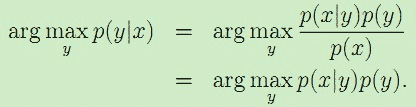
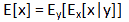
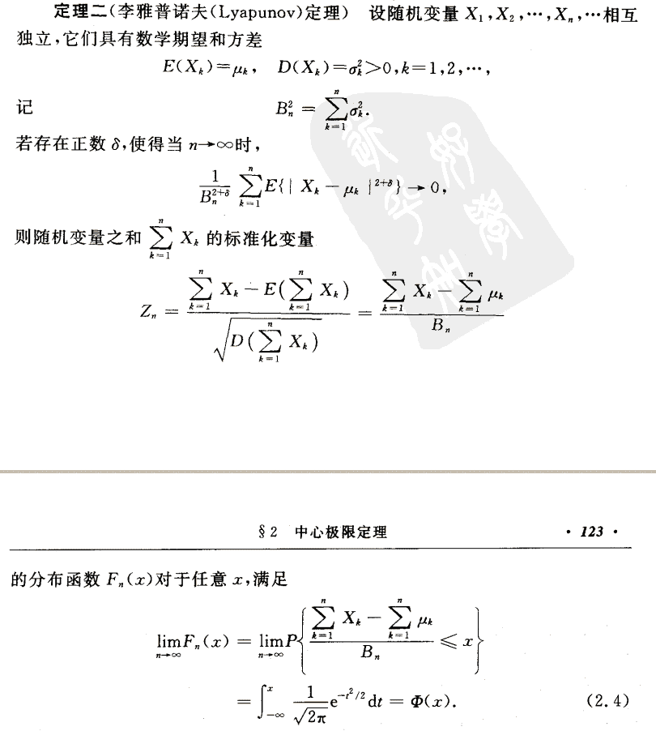
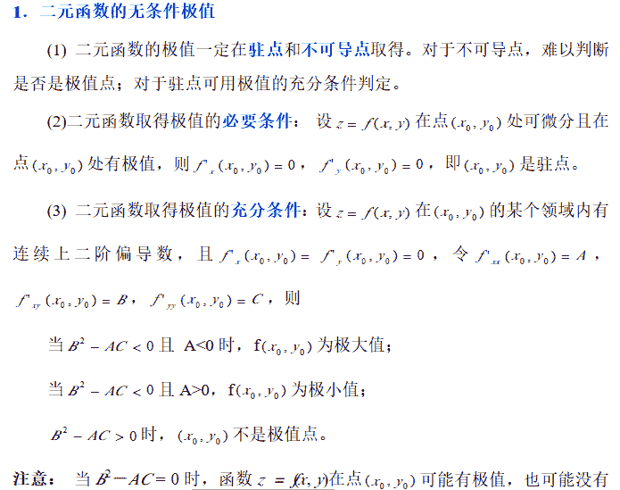

# 京东 2018 秋招算法工程师笔试题

## 1

使用中序遍历一棵二叉树得到 E A C K F H D B G，使用后序遍历得到 E C K A H B G D F，则先序遍历将得到（）

正确答案: B   你的答案: 空 (错误)

```cpp
FAEKCDBHG
```

```cpp
FAEKCDHGB
```

```cpp
EAFKHDCBG
```

```cpp
FEAKDCHBG
```

本题知识点

Java 工程师 C++工程师 iOS 工程师 安卓工程师 运维工程师 前端工程师 算法工程师 PHP 工程师 京东 2018

讨论

[黄小辉€柒小曦](https://www.nowcoder.com/profile/6699762)

B 后序遍历最后一个节点是根节点，在结合中序遍历，得知 EACK 是根节点 F 的左边节点，HDBG 是根节点的右边节点，由于后序遍历是先遍历左节点、右节点，最后遍历根节点，中序遍历是先左节点、根节点，再右节点就可以判断 F 的右节点是 D，D 的左节点是 H，G 是 D 的右节点，B 是 G 的左节点。由于中序遍历和后序遍历都是以 E 开头，得知 E 一定是左节点，而且处于最底层，再根据中序遍历和后序遍历的特点就可以完整的推断出这个二叉树的分布。

发表于 2018-05-22 16:50:00

* * *

[可留](https://www.nowcoder.com/profile/3615031)

前序遍历：先遍历根节点，接着遍历左子树，最后遍历右子树中序遍历：先遍历左子树，接着遍历根节点，最后遍历右子树后序遍历：先遍历左子树，接着遍历右子树，最后遍历根节点注意每一次遍历都要严格执行以上步骤由后续遍历可以确定最上方的根节点为 F,然后以中序遍历可以确定 EACK 为 F 的左子树，HDBG 为 F 的右子树；对比中序遍历和后序遍历的前四个字目，容易发现，最左子树为 E，E 的根节点为 A，CK 为 A 的右子树，严格按照定义，可知 C 为 K 的左子树同理，观察 F 的右子树，易知 D 为根节点，H 为 D 左子树，GB 为右子树，G 为 B 的根节点请严格按定义遍历！！！！

发表于 2018-05-29 21:20:06

* * *

[牛客 9548317 号](https://www.nowcoder.com/profile/9548317)

由后序遍历可以推导这个二叉树正中间的节点为 F，然后根据中序和后续都是由 E 开始，可以确定 E 节点一定是在最坐标，而且是最左边，然后根据后序遍历可以看出 A 后面的为 H，因此可以推导 H 也在最左边，在由二叉树的遍历规则可以很快推出答案。

发表于 2018-05-22 15:28:45

* * *

## 2

某二叉树有 2000 个结点，则该二叉树的最小高度为（）

正确答案: B   你的答案: 空 (错误)

```cpp
10
```

```cpp
11
```

```cpp
12
```

```cpp
13
```

本题知识点

Java 工程师 C++工程师 iOS 工程师 安卓工程师 运维工程师 前端工程师 算法工程师 PHP 工程师 京东 算法工程师 京东 2018

讨论

[小舔哥](https://www.nowcoder.com/profile/5568694)

n 个节点的二叉树高度，最低为，最高为 n

发表于 2018-08-21 15:24:52

* * *

[黄小辉€柒小曦](https://www.nowcoder.com/profile/6699762)

B，具有 n 个节点的完全二叉树的深度是【logn】+1

发表于 2018-05-22 16:54:37

* * *

[jasonomad](https://www.nowcoder.com/profile/735783496)

这题出的是不是把深度和高度搞混了？？

发表于 2018-09-05 20:42:18

* * *

## 3

若一序列进栈顺序为 a1,a2,a3,a4，问存在多少种可能的出栈序列（       ）

正确答案: C   你的答案: 空 (错误)

```cpp
12
```

```cpp
13
```

```cpp
14
```

```cpp
15
```

本题知识点

Java 工程师 C++工程师 iOS 工程师 安卓工程师 运维工程师 前端工程师 算法工程师 PHP 工程师 京东 算法工程师 京东 2018

讨论

[Howz](https://www.nowcoder.com/profile/1509877)

根据卡塔兰数的思想，n 元素固定顺序入栈，对应的出栈次数 a=C(2n,n)/(n+1)

发表于 2018-05-24 11:38:59

* * *

[闭目人](https://www.nowcoder.com/profile/109555)

[`blog.csdn.net/u014097230/article/details/53391091`](https://blog.csdn.net/u014097230/article/details/53391091)这个链接，第二种思路讲的很清楚。

发表于 2018-07-13 21:34:04

* * *

[TheFurtherLo](https://www.nowcoder.com/profile/6649734)

这个可以根据卡特兰数的思想，若有 n 个元素顺序入栈，则对应的出栈次序共有 f(n)=f（0）f（n-1）+f（1）f（n-2）+……+f（n-1）f（0）

发表于 2018-05-18 20:34:19

* * *

## 4

下列方面不可以防止过拟合的是（）

正确答案: C   你的答案: 空 (错误)

```cpp
加入正则项
```

```cpp
增加样本
```

```cpp
建立更加复杂的模型
```

```cpp
Bootstrap 重采样
```

本题知识点

Java 工程师 C++工程师 iOS 工程师 安卓工程师 运维工程师 前端工程师 算法工程师 PHP 工程师 京东 2018

讨论

[XuuuMeng](https://www.nowcoder.com/profile/9184755)

防止过拟合的几个方法：（参考[`blog.csdn.net/Left_Think/article/details/77684087`](https://blog.csdn.net/Left_Think/article/details/77684087)）

1.  引入正则化
2.  Dropout
3.  提前终止训练
4.  增加样本量
5.  Bootstrap 重采样：（参考[`blog.csdn.net/iterate7/article/details/79740136`](https://blog.csdn.net/iterate7/article/details/79740136)）

编辑于 2018-10-10 10:05:47

* * *

[字节跳动-智能创作实验室-内推](https://www.nowcoder.com/profile/1591238)

本题答案显然是 C，建立更复杂的模型，提高了模型的拟合能力，换句话说模型可能拟合到更复杂的过拟合函数上。

发表于 2018-07-19 14:29:57

* * *

## 5

下列属于有监督学习算法的是：（）

正确答案: D   你的答案: 空 (错误)

```cpp
谱聚类
```

```cpp
主成分分析 PCA
```

```cpp
主题模型 LDA
```

```cpp
线性判别分析 LDA
```

本题知识点

Java 工程师 C++工程师 iOS 工程师 安卓工程师 运维工程师 前端工程师 算法工程师 PHP 工程师 京东 算法工程师 京东 2018

讨论

[live&learn](https://www.nowcoder.com/profile/801523168)

线性判别分析 LDA 是一种监督学习的降维技术，数据集的每个样本是有类别输出的。聚类、主成分分析 PCA、主题模型 LDA 均属于无监督学习。

发表于 2018-08-08 10:10:05

* * *

[XuuuMeng](https://www.nowcoder.com/profile/9184755)

无监督学习

谱聚类：是一种基于图论的聚类方法，谱聚类算法建立在谱图理论基础上，与传统的聚类算法相比，它具有能在任意形状的样本空间上聚类且收敛于全局最优解的优点。而聚类都是无监督学习。Principal Component Analysis，PCA，主成分分析：PCA 之所以是无监督学习，是因为 PCA 是进行输入数据降维的，对于输入数据用于分类还是回归，输出数据是什么，并不关心。PCA 用的纯线性代数的理论。主体模型 LDA 是一种无监督的贝叶斯模型，最常见的例子是 HR 看简历，新手 HR 通过不断地看简历（学习过程）来猜测一份简历的好坏，但是简历中只包括各种特征，并不包括简历的好坏，也就是仅有数据的输入，而没有数据的输出。线性判别分析（linear discriminant analysis，LDA）：（参考[`blog.csdn.net/liuweiyuxiang/article/details/78874106`](https://blog.csdn.net/liuweiyuxiang/article/details/78874106)）和 PCA 一样，同样是一种数据降维的方法，不过不同的是，它是一种有监督方法。

编辑于 2018-10-24 15:37:46

* * *

## 6

以下是产生式模型的机器学习算法为：

正确答案: D   你的答案: 空 (错误)

```cpp
LR
```

```cpp
SVM
```

```cpp
神经网络
```

```cpp
隐马尔科夫（HMM）
```

本题知识点

Java 工程师 C++工程师 iOS 工程师 安卓工程师 运维工程师 前端工程师 算法工程师 PHP 工程师 京东 2018

讨论

[所谓伊人 sasa](https://www.nowcoder.com/profile/927401922)

判别式模型（Discriminative Model）是直接对条件概率 p(y|x;θ)建模。

**常见的判别式模型有线性回归模型、线性判别分析、支持向量机 SVM、神经网络等。**

生成式模型（Generative Model）则会对 x 和 y 的联合分布 p(x,y)建模，然后通过贝叶斯公式来求得 p(y[i]|x)，然后选取使得 p(y[i]|x)最大的 y[i]，即：

        

**常见的生成式模型有隐马尔可夫模型 HMM、朴素贝叶斯模型、高斯混合模型 GMM、****狄利克雷分布模型****（****Latent Dirichlet Allocation****，****LDA****）****等。**

发表于 2018-07-24 21:32:32

* * *

## 7

一个序列为（13,18,24,35,47,50,63,83,90,115,124），如果利用二分法查找关键字为 90 的，则需要几次比较 ？

正确答案: B   你的答案: 空 (错误)

```cpp
1
```

```cpp
2
```

```cpp
3
```

```cpp
4
```

本题知识点

Java 工程师 C++工程师 iOS 工程师 安卓工程师 运维工程师 前端工程师 算法工程师 PHP 工程师 京东 算法工程师 京东 2018

讨论

[牛客 1001 号](https://www.nowcoder.com/profile/83257315)

这个题的意思是，在排好顺序的情况下的二分法，所以第一次比较比较 50 和 90 的大小，发现 90 更大，所以从较大序列查询，第二次刚好是 90

发表于 2018-08-27 20:43:15

* * *

## 8

已知一个二叉树前序遍历和中序遍历分别为 ABDEGCFH 和 DBGEACHF，则该二叉树的后序遍历为？

正确答案: A   你的答案: 空 (错误)

```cpp
DGEBHFCA
```

```cpp
DGEBHFAC
```

```cpp
GEDBHFCA
```

```cpp
ABCDEFGH
```

本题知识点

Java 工程师 C++工程师 iOS 工程师 安卓工程师 运维工程师 前端工程师 算法工程师 PHP 工程师 京东 算法工程师 京东 2018

讨论

[Whelp-wolf](https://www.nowcoder.com/profile/674651341)

前序遍历 根-左-右  中序 左-中-右 后序 左-右-中由前序遍历和中序遍历可以看出 A 是根结点左面为 DBGE 右面为 CHF 又比较前序遍历和中序遍历的前 4 位可以得到 G 为 E 的右子结点 E 为 B 的右子结点同理右面 H 为 F 左子点，F 为 C 的右子结点

发表于 2018-09-08 11:14:23

* * *

## 9

在贝叶斯线性回归中， 假定似然概率和先验概率都为高斯分布， 假设先验概率的高斯准确率参数为 a, 似然概率的高斯准确率参数为 b， 则后验概率相当于平方误差+L2 正则，则其正则化参数为

正确答案: A   你的答案: 空 (错误)

```cpp
a + b
```

```cpp
a / b
```

```cpp
a² + b²
```

```cpp
a² / (b²)
```

本题知识点

Java 工程师 C++工程师 iOS 工程师 安卓工程师 运维工程师 前端工程师 算法工程师 PHP 工程师 京东 算法工程师 京东 2018

讨论

[驾校开除自学成才](https://www.nowcoder.com/profile/581682343)

京东上面的答案就是 C，具体做法原因还请另外的大佬来分析

发表于 2019-08-23 11:25:16

* * *

[咚咚逗逗酱](https://www.nowcoder.com/profile/4099840)

有解答以下的吗，感觉应该选 C 啊，A 不是 L1 正则吗

发表于 2019-08-10 11:32:57

* * *

[黑白 python](https://www.nowcoder.com/profile/2483195)

答案 A 是 L1 正则吧，亲

发表于 2018-08-10 20:04:20

* * *

## 10

以下关于准确率，召回， f1-score 说法错误的是：

正确答案: D   你的答案: 空 (错误)

```cpp
准确率为 TP/(TP+FP)
```

```cpp
召回率为 TP/(TP + FN)
```

```cpp
f1-score 为 2TP/(2TP + FP + FN)
```

```cpp
f1-score 为 准确率*召回率/(准确率+召回率)
```

本题知识点

Java 工程师 C++工程师 iOS 工程师 安卓工程师 运维工程师 前端工程师 算法工程师 PHP 工程师 京东 2018

讨论

[邹婷童鞋](https://www.nowcoder.com/profile/2926253)

f1-score=2*准确率×召回率/(准确率+召回率）
将准确率=TP/(TP+FP)
召回率=TP/(TP+FN)带入可得 C

发表于 2018-07-11 10:42:25

* * *

[Imback!](https://www.nowcoder.com/profile/4701640)

应该说的是精确率不是准确率吧

发表于 2018-09-09 13:01:49

* * *

[小舔哥](https://www.nowcoder.com/profile/5568694)

更一般的，  Score 的公式为   其中 P 为准确率（precision），R 为召回率（recall）

发表于 2018-08-22 10:26:46

* * *

## 11

以下关于共轭梯度说法正确的是

正确答案: C   你的答案: 空 (错误)

```cpp
共轭梯度需要计算 hessian 矩阵的逆
```

```cpp
共轭梯度只需要一阶梯度即可，所以收敛速度较慢
```

```cpp
共轭梯度法所需的存储量小，收敛快，稳定性高的优点
```

```cpp
共轭梯度梯度方向与最速下降法的梯度相同
```

本题知识点

Java 工程师 C++工程师 iOS 工程师 安卓工程师 运维工程师 前端工程师 算法工程师 PHP 工程师 京东 2018

讨论

[鹏 123](https://www.nowcoder.com/profile/4329509)

共轭梯度法是一种介于牛顿法跟梯度快速下降法之间的一种算法，收敛比梯度快速下降法要快，并且内存计算上，不需要像牛顿法那样求海伦矩阵，复杂度比牛顿法低

发表于 2018-05-27 10:36:26

* * *

[XuuuMeng](https://www.nowcoder.com/profile/9184755)

常见的几种最优化方法（梯度下降法、牛顿法、拟牛顿法、共轭梯度法等）（参考[`www.cnblogs.com/shixiangwan/p/7532830.html`](https://www.cnblogs.com/shixiangwan/p/7532830.html)）hessian 矩阵的逆：
共轭梯度：**共轭梯度法是介于最速下降法与牛顿法之间的一个方法，它仅需利用一阶导数信息，但克服了最速下降法收敛慢的缺点，又避免了牛顿法需要存储和计算 Hesse 矩阵并求逆的缺点，共轭梯度法不仅是解决大型线性方程组最有用的方法之一，也是解大型非线性最优化最有效的算法之一。** 在各种优化算法里，共轭梯度法是非常重要的一种。其优点是所需存储量小，具有步收敛性，稳定性高，而且不需要任何外来参数。
下图为共轭梯度法和梯度下降法搜索最优解的路径对比示意图：注：绿色为梯度下降法，红色代表共轭梯度法

编辑于 2018-10-24 15:40:20

* * *

[牛客 72773](https://www.nowcoder.com/profile/116953323)

共轭梯度法的每一个搜索方向是互相共轭的，且这些搜索方向仅是负梯度方向与上一次迭代的搜索方向的组合

发表于 2018-08-19 11:20:07

* * *

## 12

把 14,27,71,50,93,39 按顺序插入一棵树,插入的过程不断调整使树为平衡排序二叉树,最终形成平衡排序二叉树高度为？

正确答案: A   你的答案: 空 (错误)

```cpp
3
```

```cpp
4
```

```cpp
5
```

```cpp
6
```

本题知识点

Java 工程师 C++工程师 iOS 工程师 安卓工程师 运维工程师 前端工程师 算法工程师 PHP 工程师 京东 算法工程师 京东 2018

讨论

[chaoyueyue](https://www.nowcoder.com/profile/3845004)

平衡二叉排序树的插入过程：

发表于 2018-08-16 13:35:52

* * *

[Nooni](https://www.nowcoder.com/profile/881583987)

a) 正常插入 14,27,71

b) 插入 50 后，平衡因子>1，需要调整

 

 c) 正常插入 93 

d) 插入 39 后，平衡因子>1，需要调整

所以最终高度是 3\.觉得即使不画出平衡树，也能做这道题。一共 6 个点，一个根结点，根结点的两个子结点，这样已经用掉 3 个结点，且高度为 2 了。若高度为 4，则显然不满足 AVL 树的定义，所以一定是 3 层。

发表于 2020-04-18 13:27:43

* * *

[阿肯色人](https://www.nowcoder.com/profile/8074591)

先生成二叉排序树，再转为平衡二叉排序树。

发表于 2018-05-20 18:00:55

* * *

## 13

以下是基于图的特征降维方法的是

正确答案: A B   你的答案: 空 (错误)

```cpp
LE(Laplacian eigenmap)
```

```cpp
LLE(local linear embedding)
```

```cpp
PCA
```

```cpp
KL
```

本题知识点

Java 工程师 C++工程师 iOS 工程师 安卓工程师 运维工程师 前端工程师 算法工程师 PHP 工程师 京东 2018

讨论

[所谓伊人 sasa](https://www.nowcoder.com/profile/927401922)

[四大机器学习降维算法：PCA、LDA、LLE、Laplacian Eigenmaps](http://dataunion.org/13451.html)

**Principal Component Analysis(PCA)**是最常用的线性降维方法，它的目标是通过某种线性投影，将高维的数据映射到低维的空间中表示，并期望在所投影的维度上数据的方差最大，以此使用较少的数据维度，同时保留住较多的原数据点的特性。

**Linear Discriminant Analysis** (也有叫做 Fisher Linear Discriminant)是一种有监督的（supervised）线性降维算法。与 PCA 保持数据信息不同，LDA 是为了使得降维后的数据点尽可能地容易被区分！

**Locally linear embedding（LLE）**[1]是一种非线性降维算法，它能够使降维后的数据较好地保持原有**流形结构**。LLE 可以说是流形学习方法最经典的工作之一。很多后续的流形学习、降维方法都与 LLE 有密切联系。

**Laplacian Eigenmaps****（拉普拉斯特征映射）**看问题的角度和 LLE 有些相似，也是用局部的角度去构建数据之间的关系。它的直观思想是希望相互间有关系的点（在图中相连的点）在降维后的空间中尽可能的靠近。Laplacian Eigenmaps 可以反映出数据内在的流形结构。

其中最后后两种是基于图的特征降维方法。参考网址：[`dataunion.org/13451.html`](http://dataunion.org/13451.html)

编辑于 2018-07-25 10:03:36

* * *

[XuuuMeng](https://www.nowcoder.com/profile/9184755)

四大机器学习降维算法 PCA、LDA、LLE、LE 对比（参考[`dataunion.org/13451.html`](http://dataunion.org/13451.html)）K-L 变换（ Karhunen-Loeve Transform）是建立在统计特性基础上的一种变换，有的文献也称为霍特林（Hotelling）变换，因他在 1933 年最先给出将离散信号变换成一串不相关系数的方法。K-L 变换的突出优点是去相关性好，是均方误差（MSE，Mean Square Error）意义下的最佳变换，它在数据压缩技术中占有重要地位。

编辑于 2018-10-24 15:42:02

* * *

## 14

以下说法正确的是

正确答案: A B   你的答案: 空 (错误)

```cpp
XOR 问题不能简单的用线性分类解决
```

```cpp
XOR 问题可以通过 2 层感知器解决
```

```cpp
XOR 可以通过 LR 模型解决
```

```cpp
XOR 可以通过单层感知器解决
```

本题知识点

Java 工程师 C++工程师 iOS 工程师 安卓工程师 运维工程师 前端工程师 算法工程师 PHP 工程师 京东 2018

讨论

[XuuuMeng](https://www.nowcoder.com/profile/9184755)

（Exclusive-OR XOR）异或问题：
从图四可以看出，异或是线性不可分的，单层感知机和线性回归（Logistic Regression LR）属于线性模型，所以无法区分 XOR 问题中的两类点，而两层感知机为非线性模型，故而可以解决 XOR 问题。

编辑于 2018-10-16 19:37:39

* * *

[shunqiziran](https://www.nowcoder.com/profile/891467)

感知机和 LR 模型都是线性模型，不能用来解决 XOR 问题这样的非线性问题。2 层感知就是 1 个输入层+1 个隐藏层+1 个输出层的神经网络，其中输入层至接受输入，不做函数处理，隐藏层和输出层的神经元是功能神经元，所以是 2 层感知机。一个单隐藏层的神经网络，如果神经元个数足够多，通过非线性的激活函数则可以拟合任意函数。

发表于 2018-08-19 09:41:27

* * *

[大黄 banana](https://www.nowcoder.com/profile/107914989)

LR 模型就是逻辑回归模型，也就是线性问题，因此 XOR 异或问题不可以用 LR 解决

发表于 2018-08-09 13:15:07

* * *

## 15

以下模型哪些是无向图

正确答案: B C   你的答案: 空 (错误)

```cpp
朴素贝叶斯
```

```cpp
LR
```

```cpp
CRF
```

```cpp
HMM
```

本题知识点

Java 工程师 C++工程师 iOS 工程师 安卓工程师 运维工程师 前端工程师 算法工程师 PHP 工程师 京东 2018

讨论

[XuuuMeng](https://www.nowcoder.com/profile/9184755)

几种模型的对比（参考[`www.zhihu.com/question/35866596/answer/236886066`](https://blog.csdn.net/qq_31442743/article/details/80502043)）


编辑于 2018-10-16 19:55:58

* * *

[linlinle1994](https://www.nowcoder.com/profile/2837966)

无向图模型也叫马尔科夫随机场(MarkovRandomFields)或马尔科夫网络(MarkovNetwork)有向图模型也叫贝叶斯网络(Bayesiannetworks)或信念网络(BeliefNetworks) 

发表于 2018-07-10 21:15:30

* * *

[大黄 banana](https://www.nowcoder.com/profile/107914989)

LR 模型（判别模型）的输出是标量，CRF 输出是结构化的多元输出（应该可以看做向量吧），因此 LR 模型可以看做最简单的 CRF 模型。 CRF 是条件随机场算法。属于无向图，而朴素贝叶斯属于有向图（生成模型）。

发表于 2018-08-09 13:18:43

* * *

## 16

协同过滤经常被用于推荐系统， 包含基于内存的协同过滤， 基于模型的协同过滤以及混合模型， 以下说法正确的是

正确答案: A D   你的答案: 空 (错误)

```cpp
基于模型的协同过滤能比较好的处理数据稀疏的问题
```

```cpp
基于模型的协同过滤不需要 item 的内容信息
```

```cpp
基于内存的协同过滤可以较好解决冷启动问题
```

```cpp
基于内存的协同过滤实现比较简单， 新数据可以较方便的加入
```

本题知识点

Java 工程师 C++工程师 iOS 工程师 安卓工程师 运维工程师 前端工程师 算法工程师 PHP 工程师 京东 2018

讨论

[white9](https://www.nowcoder.com/profile/6646935)

论文《Empirical Analysis of Predictive Algorithm for Collaborative Filtering》中对协同过滤提出了分类，分为基于内存的协同过滤和基于模型的协同过滤，而基于用户的协同过滤和基于项目的协同过滤都是属于基于内存的协同过滤。

基于内存的协同过滤有以下不足：

1） 数据稀疏问题

2） 冷启动问题：冷启动问题包含新用户问题（new user problem）和新项目问题（new itemproblem）两种情况。新用户问题是指当一个新用户加入到推荐系统时，由于没有该用户的历史评分数据，因此无法根据评分信息对新用户进行推荐服务。新项目问题是指当一个全新的商品加入到推荐系统中后，由于没有用户对其进行过评价，则在系统运行的初期，它将很难获得推荐。新项目问题可以通过结合基于内容的推荐（项目的属性信息）等方法，来缓解冷启动问题。

3） 可扩展性问题

4） 鲁棒性问题：推荐系统能否识别此种情况，去除恶意用户及异常数据，提高推荐系统的可靠性，这也是目前推荐系统鲁棒性方面所需要重点关注的问题。

5） 隐性喜好发现

基于模型的协同过滤

我们的问题是这样的 m 个物品，m 个用户的数据，只有部分用户和部分数据之间是有评分数据的，其它部分评分是空白，此时我们要用已有的部分稀疏数据来预测那些空白的物品和数据之间的评分关系，找到最高评分的物品推荐给用户。所以其能较好的解决数据稀疏问题，但其还是需要 item 的内容信息的。（ps:从网上查的相关资料，若有错误欢迎指正。）

发表于 2018-09-09 22:52:17

* * *

## 17

以下关于神经网络说法正确的是

正确答案: A B   你的答案: 空 (错误)

```cpp
神经网络可以实现非线性分类
```

```cpp
神经网络可以实现线性分类
```

```cpp
神经网络的每层神经元激活函数必须相同
```

```cpp
神经网络的每层神经元激活函数值阈必须在[-1,1]
```

本题知识点

Java 工程师 C++工程师 iOS 工程师 安卓工程师 运维工程师 前端工程师 算法工程师 PHP 工程师 京东 2018

讨论

[shunqiziran](https://www.nowcoder.com/profile/891467)

逻辑回归可以看做激活函数是 sigmoid 的单层简单神经网络，只要在神经元的输出端有一个合适的损失函数，就能让单个神经元变成一个线性分类器，或者说，线性的分类器本身就是一个单层神经网络。所以 B 对。

发表于 2018-08-19 10:23:12

* * *

[奔跑的胖蜗牛](https://www.nowcoder.com/profile/7460545)

神经网络可以用于线性和非线性分类。（一般非线性的模型只要数据量足够大均可用于线性分类任务）神经网络每层激活函数不必相同，可根据需要选择。激活函数 relu，值域范围就不在[-1,1]之间，而在[0,+无穷)

发表于 2018-07-18 17:20:49

* * *

## 18

使用 LR 来拟合数据， 一般随机将数据分为训练集和测试集。 则随着训练集合的数据越来越多， 以下说法正确的是

正确答案: A D   你的答案: 空 (错误)

```cpp
测试集上的测试误差会越来越小
```

```cpp
测试集上的测试误差会越来越大
```

```cpp
训练集上的训练误差会越来越小
```

```cpp
训练集上的训练误差会越来越大
```

本题知识点

Java 工程师 C++工程师 iOS 工程师 安卓工程师 运维工程师 前端工程师 算法工程师 PHP 工程师 京东 2018

讨论

[linlinle1994](https://www.nowcoder.com/profile/2837966)

前提：测试数据不变，只增加训练数据 1.减少过拟合，泛化更好，测试误差变小 2.训练集多样性增加，数据输入分布改变，训练误差变大

发表于 2018-07-10 20:13:14

* * *

## 19

以下模型是时序模型的是

正确答案: A B C   你的答案: 空 (错误)

```cpp
GRU
```

```cpp
LSTM
```

```cpp
RNN
```

```cpp
CNN
```

本题知识点

Java 工程师 C++工程师 iOS 工程师 安卓工程师 运维工程师 前端工程师 算法工程师 PHP 工程师 京东 2018

讨论

[XuuuMeng](https://www.nowcoder.com/profile/9184755)

RNN、LSTM、GRU 比较（参考[`blog.csdn.net/softee/article/details/54292102`](https://blog.csdn.net/softee/article/details/54292102)）RNN（Recurrent Neural Network）递归神经网络：RNN 被称为并发的（recurrent），是因为它以同样的方式处理句子中的每个字词，并且对后面字词的计算依赖于前面的字词。
LSTM（Long Short-Term Memory）长短期记忆网络：LSTM 是为了解决 RNN 中的反馈消失问题而被提出的模型，它也可以被视为 RNN 的一个变种。与 RNN 相比，增加了 3 个门（gate）：input 门，forget 门和 output 门，门的作用就是为了控制之前的隐藏状态、当前的输入等各种信息，确定哪些该丢弃，哪些该保留。
GRU（Gated Recurrent Unit）封闭复发性单位：GRU 具有与 LSTM 类似的结构，但是更为简化。 

编辑于 2018-10-16 20:07:34

* * *

[杨柳祎](https://www.nowcoder.com/profile/495618757)

RNN 系的都是时序的吧

发表于 2018-08-16 15:55:53

* * *

## 20

以下为防止过拟合的方法的是

正确答案: A B C   你的答案: 空 (错误)

```cpp
增加样本
```

```cpp
L1 正则
```

```cpp
交叉验证
```

```cpp
增加复杂特征
```

本题知识点

Java 工程师 C++工程师 iOS 工程师 安卓工程师 运维工程师 前端工程师 算法工程师 PHP 工程师 京东 2018

讨论

[零葬](https://www.nowcoder.com/profile/75718849)

交叉验证为什么可以防止过拟合

发表于 2018-09-09 12:09:44

* * *

[牛客 7796418 号](https://www.nowcoder.com/profile/7796418)

交叉验证不是用来判断过拟合的程度的么

发表于 2018-09-01 15:19:44

* * *

## 21

两个随机变量 x,y，服从联合概率分布 p(x,y), 以下等式成立的有

正确答案: A C   你的答案: 空 (错误)

本题知识点

Java 工程师 C++工程师 iOS 工程师 安卓工程师 运维工程师 前端工程师 算法工程师 PHP 工程师 京东 2018

讨论

[阿肯色人](https://www.nowcoder.com/profile/8074591)




发表于 2018-05-20 18:25:03

* * *

## 22

东东从京京那里了解到有一个无限长的数字序列: 1, 2, 2, 3, 3, 3, 4, 4, 4, 4, 5, 5, 5, 5, 5, ...(数字 k 在该序列中正好出现 k 次)。东东想知道这个数字序列的第 n 项是多少,你能帮帮他么

本题知识点

Java 工程师 C++工程师 iOS 工程师 安卓工程师 运维工程师 前端工程师 算法工程师 PHP 工程师 京东 数学 2018

讨论

[新鲜菜鸡🐔](https://www.nowcoder.com/profile/3317181)

```cpp
直接求解！
import math
n = int(input())
ans = (2*n+0.25)**0.5-0.5
print(math.ceil(ans)) 
```

发表于 2018-06-03 22:52:26

* * *

[漂亮的反击](https://www.nowcoder.com/profile/8649193)

importjava.util.Scanner;publicclassMain {    publicstaticvoidmain(String args[]) {    Scanner sc=newScanner(System.in);    longn=sc.nextLong();    System.out.println((int)Math.ceil((-1+Math.sqrt(1+8*n))/2));    }}

发表于 2018-09-09 15:43:21

* * *

[梦想不会远](https://www.nowcoder.com/profile/347091580)

考察的不应该就是二分法嘛

```cpp
while True:
    try:
        n = int(input())
        l = 1
        r = 10**18
        while l < r:
            mid = (l+r)//2
            if mid*(mid+1)//2 >= n:
                r = mid
            else:
                l = mid + 1
        print(l)
    except:
        break
```

发表于 2020-08-06 17:17:09

* * *

## 23

东东对幂运算很感兴趣,在学习的过程中东东发现了一些有趣的性质: 9³ = 27², 2¹⁰ = 32²
东东对这个性质充满了好奇,东东现在给出一个整数 n,希望你能帮助他求出满足 a^b = c^d(1 ≤ a,b,c,d ≤ n)的式子有多少个。
例如当 n = 2: 1¹=1¹
1¹=1²
1²=1¹
1²=1²
2¹=2¹
2²=2²
一共有 6 个满足要求的式子

本题知识点

Java 工程师 C++工程师 iOS 工程师 安卓工程师 运维工程师 前端工程师 算法工程师 PHP 工程师 京东 数学 2018

讨论

[一生平安 777777](https://www.nowcoder.com/profile/774086091)

```cpp

		import java.util.*;

public class Main {
    public static void main(String args[]) {
        Scanner in = new Scanner(System.in);
        int n = in.nextInt();
        long out = 0;
        int[] already = new int[n + 1];
        out += ((long)n) * n; // a=c=1
        out += ((long)n) * (n - 1);// a=c!=1 时
        for (int i = 2; i <= n; i++)// 底数遍历
        {
            if (already[i] == 0) {//算过的就不用算了
                long counti = 0;
                int logn = (int) Math.round(Math.log(n) / Math.log(i));// log 以 i 为底 可能有舍入误差
                if (Math.pow(i, logn) > n)
                    logn--;
                for (int loga = 1; loga <= logn; loga++) {
                    for (int logc = 1; logc <= logn; logc++) {
                        if (loga != logc) {
                            int comFactor = 1;// 最大公因数
                            int smaller = loga > logc ? logc : loga;
                            int bigger = loga < logc ? logc : loga;
                            for (int com = 1; com <= smaller; com++) {
                                if (loga % com == 0 && logc % com == 0) {
                                    comFactor = com;
                                }
                            }
                            counti += (n / (bigger / comFactor));
                        }
                    }
                    already[(int) Math.pow(i, loga)] = 1;
                }
                out += counti;
            }
        }
        System.out.println(out % 1000000007L);
    }
}

		//在答题区看到了更好的答案 留给大家研究研究

		import java.util.HashSet;
import java.util.Scanner;
import java.util.Set;

public class Main {

  public final static long MOD = 1000000000 + 7;

  public static int max(int a, int b){
    return (a>b) ? a : b;
  }

  public static long gcd(long a,long b){
    return (a % b == 0) ? b : gcd(b,a%b);
  }

  public static void main(String[] args) {
    Scanner in = new Scanner(System.in);
    long n = in.nextInt();
    long ans = (long)1*n*(n*2-1) % MOD;
    Set<Integer> set  = new HashSet<>();
    for (int i = 2; i*i <= n; i++){
      if ( set.contains(i)) continue;
      long tmp = i;
      int cnt = 0;

      while(tmp <= n) {
        set.add((int)tmp);
        tmp = tmp * i;
        cnt++;
      }

      for(int k = 1; k <= cnt; k++) {
        for(int j = k + 1; j <= cnt; j++) {
          ans = (ans + n / (j / gcd(k, j) ) * (long)2 ) % MOD;
        }
      }

    }

    System.out.println(ans);
  }
}

```

编辑于 2018-09-16 22:21:52

* * *

[spMoon](https://www.nowcoder.com/profile/7695748)

```cpp
 照 北交大李国杰 同学答案改的 py3 版本，通过率 90%，感觉是 python 数值计算精度的问题导致的计算错误；
希望解决了这个问题的同学指教
import math
def gcd(a,b):
    a,b=min(a,b),max(a,b)
    for i in range(1,a+1):
        if a%i==0 and b%i==0:
            cd=i
    return cd
n=int(input())
mode=int(1e9+7)
rec=[0]*(n+1)#record list
res=n*(2*n-1)%mode
for i in range(2,n+1):
    if rec[i]:
        continue
    rec[i]=1
    lgn=math.floor(math.log(n,i))
    for lga in range(1,lgn):
        rec[i**lga]=1
        for lgc in range(lga+1,lgn+1):
            res+=(n//(lgc//gcd(lga,lgc))*2)
            res=res%mode
print(res)

```

发表于 2018-08-31 15:14:44

* * *

[起个昵称真难 201807192251996](https://www.nowcoder.com/profile/775351995)

```cpp
import math
n=int(input())
count=0
for i in range(1,n+1):
    for j in range(1,n+1):
        for k in range(1,n+1):
            if math.pow(i**j,1/k) in range(1,n+1):
                count=count+1   
print(count)               
```

编辑于 2018-09-06 09:36:29

* * *

## 24

以下属于凸函数的是

正确答案: A D   你的答案: 空 (错误)

```cpp
e 的 x 次方
```

```cpp
x 的 a 次方
```

```cpp
log(x)
```

```cpp
f(x, y) = x 的平方/y
```

本题知识点

Java 工程师 C++工程师 iOS 工程师 安卓工程师 运维工程师 前端工程师 算法工程师 PHP 工程师 京东 2018

讨论

[月缘天星](https://www.nowcoder.com/profile/9438243)

D 选型的 hessian 矩阵肯定是正定吗，跟 y 的符号无关吗？

发表于 2018-05-29 19:59:58

* * *

[XuuuMeng](https://www.nowcoder.com/profile/9184755)

1\. 一元函数：2\. 二元函数： （二元凸函数判定的等价形式参考[`www.doc88.com/p-3364682941916.html`](http://www.doc88.com/p-3364682941916.html)） 3\. 多元函数：Hessian 矩阵半正定，则函数是凸函数；若 Hessian 矩阵正定，则函数是严格凸函数。（参考[`blog.csdn.net/qq_39521554/article/details/78895869`](https://blog.csdn.net/qq_39521554/article/details/78895869)） 对于这一题，我个人认为选项 D 有问题。 

编辑于 2018-10-18 11:28:36

* * *

[零葬](https://www.nowcoder.com/profile/75718849)

这个 D 应该不对吧，受 y 符号的影响，曲面一部分是凸，一部分是凹啊

发表于 2021-01-08 10:21:56

* * *

## 25

以下关于 batch normalization 说法正确的是：

正确答案: B C   你的答案: 空 (错误)

```cpp
normalization 的均值方差计算是基于全部训练数据的
```

```cpp
normalization 的均值方差只基于当前的 minibatch
```

```cpp
normalization 对输入层的每一维单独计算均值方差，
```

```cpp
normalization 的输出分布服从均值为 0，方差为 1 的高斯分布
```

本题知识点

Java 工程师 C++工程师 iOS 工程师 安卓工程师 运维工程师 前端工程师 算法工程师 PHP 工程师 京东 2018

讨论

[XuuuMeng](https://www.nowcoder.com/profile/9184755)

针对选项 D（参考[`www.cnblogs.com/guoyaohua/p/8724433.html`](https://www.cnblogs.com/guoyaohua/p/8724433.html)）
这里的 normalization 指的是 Batch Normalization 的输出，而服从标准正态分布的是，上图的 normalize 部分，是 BN 的其中一部分。

发表于 2018-10-19 10:21:48

* * *

[小太阳 hello](https://www.nowcoder.com/profile/995075964)

bn 基于 minibatch 没问题，
c 选项表示不懂，bn 并没有对[N,H,W,C]每一维都计算了方差和均值啊，不是只计算了 N,H,W 这三个维度么 normalization 会使输入保持 0,1 的正态分布，但是输出就不能保证了。

发表于 2018-09-07 21:08:15

* * *

[牛客 322268448 号](https://www.nowcoder.com/profile/322268448)

D 选项认为有问题，BN 的输出本来就是 normalized 之后的，只有 BN 层的输出为了可学习才加入线性参数

发表于 2018-12-20 09:51:56

* * *

## 26

CRF 模型可以用来做专名识别， 语义消歧等， 以下关于 CRF 模型说法正确的是

正确答案: B C   你的答案: 空 (错误)

```cpp
CRF 模型是产生式模型
```

```cpp
CRF 模型是判别式模型
```

```cpp
CRF 模型的图模型为无向图
```

```cpp
CRF 模型的图模型为有向图
```

本题知识点

Java 工程师 C++工程师 iOS 工程师 安卓工程师 运维工程师 前端工程师 算法工程师 PHP 工程师 京东 2018

讨论

[大黄 banana](https://www.nowcoder.com/profile/107914989)

LR 逻辑回归是最简单的 CRF 模型，CRF 相当于有多个输出，因此属于判别式无向图

发表于 2018-08-09 17:00:41

* * *

## 27

以下关于二项分布说法正确的是

正确答案: B C   你的答案: 空 (错误)

```cpp
二项分布是一种离散概率分布，表示在 n 次伯努利试验中， 试验 k 次才得到第一次成功的概率
```

```cpp
二项分布是一种离散概率分布，表示在 n 次伯努利试验中，有 k 次成功的概率
```

```cpp
当 n 很大时候，二项分布可以用泊松分布和高斯分布逼近
```

```cpp
当 n 很大时候，二项分布可以用高斯分布逼近，但不能用泊松分布逼近
```

本题知识点

Java 工程师 C++工程师 iOS 工程师 安卓工程师 运维工程师 前端工程师 算法工程师 PHP 工程师 京东 2018

讨论

[小太阳 hello](https://www.nowcoder.com/profile/995075964)


当二项分布的 n 很大而 p 很小时，泊松分布可作为二项分布的近似，其中λ为 np。通常当 n≧20,p≦0.05 时，就可以用泊松公式近似得计算。事实上，泊松分布正是由二项分布推导而来的，具体推导过程参见本词条相关部分。

发表于 2018-09-07 21:18:37

* * *

[XuuuMeng](https://www.nowcoder.com/profile/9184755)


发表于 2018-10-10 12:49:14

* * *

## 28

以下关于 random forest 说法错误的是

正确答案: A D   你的答案: 空 (错误)

```cpp
rf 中的每棵子树都是独立同分布的
```

```cpp
rf 中模型方差随着子树的增加而减少
```

```cpp
rf 主要通过增加子树之间的相关性来减少模型的方差
```

```cpp
rf 中模型偏差随着子树的增加而减少
```

本题知识点

Java 工程师 C++工程师 iOS 工程师 安卓工程师 运维工程师 前端工程师 算法工程师 PHP 工程师 京东 2018

讨论

[HectorLee](https://www.nowcoder.com/profile/8101651)

ACD？A 近似分布，但不独立（因为子样本集的相似性）；C 子树之间相关相关性越强，模型方差不一定减小，RF 反而是通过 D-C 来处理子模型降低子模型间的相关性，来降低方差；D 模型偏差随子模型数量的增加不一定减少，RF 的主要目的在于降低方差。

发表于 2018-07-13 11:50:01

* * *

[Imback!](https://www.nowcoder.com/profile/4701640)

子树越多越易过拟合偏差减小方差增大为什么 D 错 B 对？

发表于 2018-09-09 16:54:47

* * *

[大师兄不急](https://www.nowcoder.com/profile/8000383)

rf 采用 bagging，树之间越相关，方差越小，子树越多偏差越大

发表于 2018-07-12 21:33:34

* * *

## 29

在机器学习中，经常采用线性变换，将基变换为正交基， 下列矩阵式正交矩阵的是

正确答案: A C   你的答案: 空 (错误)

本题知识点

Java 工程师 C++工程师 iOS 工程师 安卓工程师 运维工程师 前端工程师 算法工程师 PHP 工程师 京东 2018

讨论

[NARUTO201807131727371](https://www.nowcoder.com/profile/624236879)

AAT=E    A 是正交矩阵

发表于 2019-04-12 22:55:40

* * *

[XuuuMeng](https://www.nowcoder.com/profile/9184755)

************

编辑于 2018-10-16 20:33:48

* * *

[奔跑的胖蜗牛](https://www.nowcoder.com/profile/7460545)

为什么看不到图片，只能看到网址？

发表于 2018-07-18 17:29:44

* * *

## 30

有 A，B 两个国家，人口比例为 4:6，A 国的犯罪率为 0.1%，B 国的为 0.2%。现在有一个新的犯罪事件，发生在 A 国的概率是？

正确答案: B   你的答案: 空 (错误)

```cpp
0.15
```

```cpp
0.25
```

```cpp
0.35
```

```cpp
0.45
```

本题知识点

Java 工程师 C++工程师 iOS 工程师 安卓工程师 运维工程师 前端工程师 算法工程师 PHP 工程师 京东 算法工程师 京东 2018

讨论

[MissTime](https://www.nowcoder.com/profile/142648386)

利用贝叶斯公式设犯罪事件为 F，则问题是要求 p(A|F)p(A|F) = ==0.25

发表于 2018-07-11 13:25:25

* * *

## 31

随机变量 X1,X2...X100 都服从[1,9]的均匀分布，则(X1+X2+...+X100)/100 近似服从 ________。

正确答案: A   你的答案: 空 (错误)

```cpp
高斯分布
```

```cpp
泊松分布
```

```cpp
均匀分布
```

```cpp
指数分布
```

本题知识点

Java 工程师 C++工程师 iOS 工程师 安卓工程师 运维工程师 前端工程师 算法工程师 PHP 工程师 京东 2018

讨论

[XuuuMeng](https://www.nowcoder.com/profile/9184755)


定理：

发表于 2018-10-17 10:22:13

* * *

[闭目人](https://www.nowcoder.com/profile/109555)

牛客网的 markdown 似乎不支持 latex，建议复制下文到[`www.zybuluo.com/mdeditor`](https://www.zybuluo.com/mdeditor) 再看或者直接看这个链接[`bindog.github.io/blog/2015/05/20/different-method-to-generate-normal-distribution/`](https://bindog.github.io/blog/2015/05/20/different-method-to-generate-normal-distribution/)

中心极限定理。对于任意 n 个独立同分布随机变量$Xi$，如果他们有期望和方差，那么他们的和趋向于正态分布，且 n 越大，效果越好。进一步的，我们假设新的随机变量 $Z=\frac{\sum{i=1}^{n} x_i - n\mu}{\sigma\sqrt{n}}$，其中$\mu$为 n 个随机变量的均值，$\sigma$为方差，则有$P{Z<=x}=\Phi(x)$。因此，我们可以用均匀分布产生正态分布：先生成 n 个[0,1]之间的随机变量$X_i$，然后用这 n 个值求出$Z$，重复这个过程一万次，我们就能得到一万个$Z$，对$Z$做直方图，做出来的效果应该就是正态分布的样子了。参考文献：[`bindog.github.io/blog/2015/05/20/different-method-to-generate-normal-distribution/`](https://bindog.github.io/blog/2015/05/20/different-method-to-generate-normal-distribution/) 【暴力生成正态分布小节】
注意该文的代码
tsum = (np.mean(np.random.uniform(0,1,n))-0.5)np.sqrt(12n)

实际上是把$Z$的公式上下同除了一个 n，并且 0-1 的均匀分布的方差是$\frac{1}{12}$泊松分布是对于二项分布$B~(np)$，若$np$不大的时候，可以用$\lambda=np$来近似二项分布对于$np$接近无穷时，用正态分布来近似二项分布

编辑于 2018-07-12 19:17:07

* * *

[linlinle1994](https://www.nowcoder.com/profile/2837966)

对于服从均匀分布的随机变量，只要 n 充分大，随机变量 就服从均值为零，方差为 1 的正态分布。

发表于 2018-07-10 20:33:09

* * *

## 32

关于 x,y 的函数 f(x,y)=x*e^(-x²-y²)，(x,y∈R)，则该函数有 _____ 个极小值点。

正确答案: B   你的答案: 空 (错误)

```cpp
0
```

```cpp
1
```

```cpp
2
```

```cpp
3
```

本题知识点

Java 工程师 C++工程师 iOS 工程师 安卓工程师 运维工程师 前端工程师 算法工程师 PHP 工程师 京东 2018

讨论

[所谓伊人 sasa](https://www.nowcoder.com/profile/927401922)



发表于 2018-07-25 21:34:22

* * *

[大只大只](https://www.nowcoder.com/profile/869726003)

fx = 0,求得 x[1]=(0.5)^(0.5), x[2] = - (0.5)^(0.5)fy = 0,求得 y = 0f(x,y)为奇函数，所以两个极值点，一个为极大值，一个为极小值。

发表于 2018-08-08 16:52:20

* * *

[闭目人](https://www.nowcoder.com/profile/109555)

不知道对不对，大家看一下思路是这样的，f^’[x]=0，得出 x[1]=(0.5)^(0.5), x[2] = - (0.5)^(0.5)f^‘[y ]= 0，得出 y = 0 所以暂时判断是两个极值点（x1,y）（x2,y）在对 x 求二次偏导，分析得出 x1 对应的点为极小值点，x2 对应的点为极大值点 PS：刚才没看到能用 markdown 写.. 

发表于 2018-07-12 15:31:29

* * *