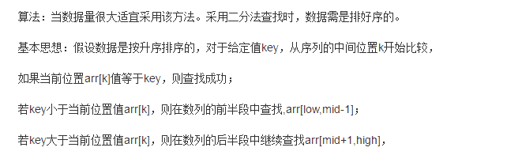
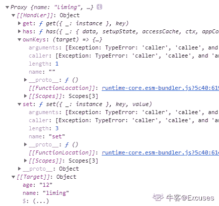

# 京东 2018 秋招 Web 前端工程师笔试题

## 1

对于 ajax 技术描述正确的是（）

正确答案: A B   你的答案: 空 (错误)

```cpp
可以实现无刷新页面
```

```cpp
用户体验好、速度快
```

```cpp
对搜索引擎比较友好
```

```cpp
推荐门户网站(渲染性强)多加使用该技术
```

本题知识点

Java 工程师 C++工程师 iOS 工程师 安卓工程师 运维工程师 前端工程师 算法工程师 PHP 工程师 京东 2018

讨论

[包子是好包子](https://www.nowcoder.com/profile/9170153)

A 正确：AJAX 可以使网页实现异步更新，这意味着可以在不重新加载整个网页的情况下，对网页的某部分进行更新。B 正确：经典的网页技术必须整个更新网页（即使你只想更新某一部分），是笨重的。AJAX 允许网页持续更新，但只需要和服务 器交互很少的数据，只获得你所需的数据，这样能给你更快的接口和更低的响应时间。响应更快因此性能和速度增加了。C 错误：搜索引擎会屏蔽掉所有 javascript 代码， 那么 ajax 载入的内容对于搜索引擎来说也是透明的。默认情况下，搜索引擎是抓取不到 ajax 内容。

发表于 2018-05-19 15:24:46

* * *

[QQ 群](https://www.nowcoder.com/profile/968354)

搜索引擎会屏蔽 js 代码，ajax 又是写在 js 里面的，所以搜索引擎会屏蔽 ajax。结果：ajax 对搜索引擎**不友好**！渲染性强的网站，肯定会多次用到 ajax 请求，这样会影响页面性能！

发表于 2018-07-22 19:36:26

* * *

[。。哼](https://www.nowcoder.com/profile/4004087)

异步局部刷新?不需要吗？🙃

发表于 2018-06-27 10:17:29

* * *

## 2

获取内容…标签里的文本内容（）

正确答案: B C   你的答案: 空 (错误)

```cpp
$(&quot;#content&quot;).val()
```

```cpp
$(&quot;#content&quot;).html();
```

```cpp
$(&quot;#content&quot;).text();
```

```cpp
$(&quot;#content&quot;).innerHTML();
```

本题知识点

Java 工程师 C++工程师 iOS 工程师 安卓工程师 运维工程师 前端工程师 算法工程师 PHP 工程师 京东 2018

讨论

[包子是好包子](https://www.nowcoder.com/profile/9170153)

text()设置或返回所选元素的文本内容；html（）设置或返回所选元素的内容（包括 html 标记）；val（）设置或返回表单字段的值；innerHTML/innerText:是原生 js 中的写法，jquery 不支持。

发表于 2018-05-19 15:34:08

* * *

[你把你 offer 给我交了](https://www.nowcoder.com/profile/7815107)

因为该 div 里根本就没有其他 html 标签了，所以返回值和 text()一样，只是文本

发表于 2018-06-09 20:05:12

* * *

[阿呆 777](https://www.nowcoder.com/profile/3774701)

文本内容的话，那就只有 C 是对的吧

发表于 2018-06-06 10:20:50

* * *

## 3

对于 IFrame 说法正确的有：()

正确答案: C D   你的答案: 空 (错误)

```cpp
通过 IFrame，网页可以嵌入其他网页内容，并可以动态更改
```

```cpp
在相同域名下，内嵌的 IFrame 可以获取外层网页的对象
```

```cpp
在相同域名下，外层网页脚本可以获取 IFrame 网页内的对象
```

```cpp
可以通过脚本调整 IFrame 的大小
```

本题知识点

Java 工程师 C++工程师 iOS 工程师 安卓工程师 运维工程师 前端工程师 算法工程师 PHP 工程师 京东 2018 HTML

讨论

[张炳权](https://www.nowcoder.com/profile/6461207)

*   在相同域名下，内嵌的 IFrame 可以获取外层网页的对象
*   在相同域名下，外层网页脚本可以获取 IFrame 网页内的对象
*   可以通过脚本调整 IFrame 的大小
*   通过 IFrame，网页可以嵌入其他网页内容，并可以动态更改
*   <html>
        <head>
        </head>
        <script>
            function fun(){
                //通过脚本调整 iframe 的大小
                window.frames[0].resizeTo(500,500);
                //在相同域名下，外层脚本可以获取 iframe 网页内的内容
                var v=window.frames[0].document.getElementById("txt").value;
                alert(v);
            }
        </script>
        <body>
            <input type="button" onclick="fun()" value="按钮">
            <iframe src="32.html"></iframe>
        </body>
    </html>

        <script>
        function fun(){
           //document.getElementsByTagName("input");
           arr=document.form1.elements;
           var s="";
           for(i=0;i<arr.length;i++){
               if(arr[i].type=='text'){
                   s=s+arr[i].value+"\r";
               }

           }
           alert(s);
        }
    </script>

    <body>
    <form name="form1">
        <input type="text" id="txt" name="txt" value="wulisusu"/><br>
        <input type="button" id="bun" name="bun" value="检验" onclick="fun()"/><br>
        <input type="submit" id="sub" name="sub" value="提交"/><br>
        <input type="reset" id="res" name="res" value="重置"/><br>
        <input type="text" id="txt2" name="txt2" value="wuliyuanyuan"/>
        //在相同域名下，内嵌的 IFrame 可以获取外层网页的对象
        <a href="#" onclick="alert(window.parent.document.getElementsByTagName('input')[0].value)">返回</a>
    </form>
    </body>

发表于 2018-06-01 04:42:22

* * *

[WhoS](https://www.nowcoder.com/profile/268977784)

答案错误 A B 也是正确的

编辑于 2018-07-29 21:02:09

* * *

[Vibin](https://www.nowcoder.com/profile/5684661)

IFrame 现在很少有人用了吧?

发表于 2018-05-31 16:37:35

* * *

## 4

以下选项中为 CSS 盒模型的属性有

正确答案: B C E   你的答案: 空 (错误)

```cpp
font
```

```cpp
margin
```

```cpp
padding
```

```cpp
visible
```

```cpp
border
```

本题知识点

前端工程师 CSS

讨论

[包子是好包子](https://www.nowcoder.com/profile/9170153)

盒模型的属性：margin（外边距）、border（边框）、padding（内边距）、content（内容）

发表于 2018-05-19 15:51:34

* * *

[masteryoudig](https://www.nowcoder.com/profile/220051637)

display:none 和 visible:hidden 都能把网页上某个元素隐藏起来，但两者有区别: display:none ---不为被隐藏的对象保留其物理空间，即该对象在页面上彻底消失，通俗来说就是看不见也摸不到。 visible:hidden--- 使对象在网页上不可见，但该对象在网页上所占的空间没有改变，通俗来说就是看不见但摸得到。

发表于 2020-10-09 09:25:15

* * *

## 5

常见的浏览器端的存储技术有哪些？

正确答案: A B D   你的答案: 空 (错误)

```cpp
cookie
```

```cpp
localStorage
```

```cpp
session
```

```cpp
userData
```

本题知识点

Java 工程师 C++工程师 iOS 工程师 安卓工程师 运维工程师 前端工程师 算法工程师 PHP 工程师 京东 2018

讨论

[](https://www.nowcoder.com/profile/5476356)

session 存储在服务端内存中的，并不是客户端。 UserDate 是 ie 浏览器使用的存储方式。

编辑于 2018-05-21 16:18:10

* * *

[QQ 群](https://www.nowcoder.com/profile/968354)

cookie：浏览器端，跟随 http 请求一起发送给服务器 localStorage：浏览器端 session：服务器端 userData：浏览器端，仅仅 ie 支持的

发表于 2018-05-29 21:48:18

* * *

[随遇而安 201805181435879](https://www.nowcoder.com/profile/1059259)

cookie

cookie 会随着每次 HTTP 请求头信息一起发送，无形中增加了网络流量，另外，cookie 能存储的数据容量有限，根据浏览器类型不同而不同，IE6 大约只能存储 2K。

Flash ShareObject

这种方式能能解决上面提到的 cookie 存储的两个弊端，而且能够跨浏览器，应该说是目前最好的本地存储方案。不过，需要在页面中插入一个 Flash，当浏览器没有安装 Flash 控件时就不能用了。所幸的是，没有安装 Flash 的用户极少。

缺点：需要安装 Flash 插件。

Google Gear

Google 开发出的一种本地存储技术。

缺点：需要安装 Gear 组件。

userData

IE 浏览器可以使用 userData 来存储数据，容量可达到 640K，这种方案是很可靠的，不需要安装额外的插件。缺点：它仅在 IE 下有效。

sessionStorage

使用于 Firefox2+的火狐浏览器，用这种方式存储的数据仅窗口级别有效，同一个窗口（或者 Tab）页面刷新或者跳转，都能获取到本地存储的数据，当新开窗口或者页面时，原来的数据就失效了。

缺点：IE 不支持、不能实现数据的持久保存。

globalStorage

使用于 Firefox2+的火狐浏览器，类似于 IE 的 userData。

发表于 2018-05-21 15:32:45

* * *

## 6

下面哪个语句可以在 JS 里判断一个对象 oStringObject 是否为 String。

正确答案: A   你的答案: 空 (错误)

```cpp
oStringObject instanceof String
```

```cpp
typeof oStringObject == 'string'
```

```cpp
oStringObject is String
```

```cpp
其他答案都不正确
```

本题知识点

Java 工程师 C++工程师 iOS 工程师 安卓工程师 运维工程师 前端工程师 算法工程师 PHP 工程师 京东 2018

讨论

[fangna](https://www.nowcoder.com/profile/9451812)

使用 typeof 运算符时采用引用类型存储值会出现一个问题，无论引用的是什么类型的对象，它都返回 "object"。 oStringObject 是 String 对象类型，在 typeof 方***返回 "object" ；instanceof 方法要求开发者明确地确认对象为某特定类型， var oStringObject = new String("hello world");console.log(oStringObject instanceof String);   // 输出 "true" 

发表于 2018-07-24 14:40:02

* * *

[春夏⊙﹏⊙秋冬](https://www.nowcoder.com/profile/7659011)

题目问的是  是不是一个 String 对象， A 是对的， B 只能判断是不是一个字符串 

发表于 2018-05-22 19:51:46

* * *

[随遇而安 201805181435879](https://www.nowcoder.com/profile/1059259)

typeof object 是这种格式的才是对的

发表于 2018-05-21 15:33:37

* * *

## 7

设一组初始关键字序列为(31，65，82，76，13，27，10)，则第 4 趟冒泡排序结束后的结果为（）

正确答案: A   你的答案: 空 (错误)

```cpp
(13，27，10，31，65，76，82)
```

```cpp
(10，13，27，31，65，76，82)
```

```cpp
(31，13，27，10，65，76，82)
```

```cpp
(31，27，13, 65, 10，76，82)
```

本题知识点

Java 工程师 C++工程师 iOS 工程师 安卓工程师 运维工程师 前端工程师 算法工程师 PHP 工程师 京东 前端工程师 京东 2018

讨论

[桃客](https://www.nowcoder.com/profile/3342150)

两两比较交换（小值在前，大值在后）第 1 趟：31, 65, 76, 13, 27, 10, 82 第 2 趟：31, 65, 13, 27, 10, 76, 82 第 3 趟：31, 13, 27, 10, 65, 76, 82 第 4 趟：13, 27, 10, 31, 65, 76, 82

发表于 2018-05-24 10:56:46

* * *

[包子是好包子](https://www.nowcoder.com/profile/9170153)

冒泡排序是排序算法之一，原理：比较相邻的两个元素，将值大的元素交换到右边

发表于 2018-05-27 20:27:52

* * *

[难受啊，马飞](https://www.nowcoder.com/profile/1625910)

🤣 冒泡不是小的冒上去吗，为什么不是从右往左冒泡。。。

发表于 2019-08-23 10:11:12

* * *

## 8

正则表达式 ^d+[^d]+ 能匹配下列哪个字符串？

正确答案: C   你的答案: 空 (错误)

```cpp
123
```

```cpp
123a
```

```cpp
d123
```

```cpp
123def
```

```cpp
d7d
```

本题知识点

Java 工程师 C++工程师 iOS 工程师 安卓工程师 运维工程师 前端工程师 算法工程师 PHP 工程师 京东 前端工程师 京东 2018

讨论

[清青春明](https://www.nowcoder.com/profile/516603)

c  ^d+是以 d 字母开头并且一个或者多个 d[^d]+是非 d 字母一个或者多个看清楚啊不是\d

发表于 2018-05-21 17:09:03

* * *

[QQ 群](https://www.nowcoder.com/profile/968354)

^d：匹配“以 d 开头”^d+：匹配“以 1 或 n 个 d 开头”：dxxx、ddxxx、ddddxx[^d]：匹配“非 d 的字幕”[^d]+：匹配“1 或者 n 个非 d 的字母”

发表于 2018-07-22 20:46:27

* * *

[](https://www.nowcoder.com/profile/5476356)

本题是 d 不是\d

发表于 2018-05-21 16:19:41

* * *

## 9

一个序列为（13,18,24,35,47,50,63,83,90,115,124），如果利用二分法查找关键字为 90 的，则需要几次比较 ？

正确答案: B   你的答案: 空 (错误)

```cpp
1
```

```cpp
2
```

```cpp
3
```

```cpp
4
```

本题知识点

Java 工程师 C++工程师 iOS 工程师 安卓工程师 运维工程师 前端工程师 算法工程师 PHP 工程师 京东 前端工程师 京东 2018

讨论

[黄小辉€柒小曦](https://www.nowcoder.com/profile/6699762)

Blow=1，high=10，mid=（10+1)/2=5; 编号为 5 的数是 50 小于 90；low=6,high=10,mid=(10+6)/2=8;编号为 8 的数是 90，刚好，比较了两次

发表于 2018-05-22 17:10:22

* * *

[包子是好包子](https://www.nowcoder.com/profile/9170153)

二分法就是一分为二，逐段进行查找所以先和 50 比，排除左边，再和 90 比，正好相等，查找成功

发表于 2018-05-27 20:39:06

* * *

[清浅就是我](https://www.nowcoder.com/profile/3620554)

为什么是比较两次 而不是三次  第一次和 50 比较 大于 50 在 50 右边找；第二次和 83 比较 大于 83 在 83 右边找 ；第三次 找到 90 90=90； 不是比较三次吗

发表于 2018-05-22 12:52:31

* * *

## 10

以下哪些是 HTTP 请求中浏览器缓存机制会用到的协议头？

正确答案: A B   你的答案: 空 (错误)

```cpp
Last-Modified
```

```cpp
Etag
```

```cpp
Referer
```

```cpp
Authorization
```

本题知识点

Java 工程师 C++工程师 iOS 工程师 安卓工程师 运维工程师 前端工程师 算法工程师 PHP 工程师 京东 2018

讨论

[包子是好包子](https://www.nowcoder.com/profile/9170153)

Last-Modified：标示这个响应资源的最后修改时间。web 服务器在响应请求时，告诉浏览器资源的最后修改时间 Etag：web 服务器响应请求时，告诉浏览器当前资源在服务器的唯一标识（生成规则由服务器决定）Referer: 告诉服务器我来自于哪里 Authorization:认证，http 协议是无状态的， 浏览器和 web 服务器之间可以通过 cookie 来身份识别, 桌面应用程序一般不会使用 cookie, 而是把 "用户名+冒号+密码"用 BASE64 编码的字符串放在 http request 中的 header Authorization 中发送给服务端，来进行身份认证

发表于 2018-05-28 08:55:42

* * *

## 11

CSS 属性 position 的值不包含（）

正确答案: C   你的答案: 空 (错误)

```cpp
absolute
```

```cpp
inherit
```

```cpp
box
```

```cpp
static
```

本题知识点

前端工程师 CSS

讨论

[geni 鱼](https://www.nowcoder.com/profile/7459058)

absolute，生成[绝对定位](https://www.baidu.com/s?wd=%E7%BB%9D%E5%AF%B9%E5%AE%9A%E4%BD%8D&tn=SE_PcZhidaonwhc_ngpagmjz&rsv_dl=gh_pc_zhidao)的元素，相对于 static 定位以外的第一个父元素进行定位；

元素的位置通过 "left", "top", "right" 以及 "bottom" 属性进行规定；

fixed，生成[绝对定位](https://www.baidu.com/s?wd=%E7%BB%9D%E5%AF%B9%E5%AE%9A%E4%BD%8D&tn=SE_PcZhidaonwhc_ngpagmjz&rsv_dl=gh_pc_zhidao)的元素，相对于浏览器窗口进行定位；

元素的位置通过 "left", "top", "right" 以及 "bottom" 属性进行规定。

relative，生成[相对定位](https://www.baidu.com/s?wd=%E7%9B%B8%E5%AF%B9%E5%AE%9A%E4%BD%8D&tn=SE_PcZhidaonwhc_ngpagmjz&rsv_dl=gh_pc_zhidao)的元素，相对于其正常位置进行定位；

static，[默认值](https://www.baidu.com/s?wd=%E9%BB%98%E8%AE%A4%E5%80%BC&tn=SE_PcZhidaonwhc_ngpagmjz&rsv_dl=gh_pc_zhidao)，没有定位，元素出现在正常的流中（忽略 top, bottom, left, right 或者 z-index 声明）；

inherit，规定应该从父元素继承 position 属性的值。

发表于 2018-05-23 13:04:42

* * *

[迷途小学生](https://www.nowcoder.com/profile/246775)

position 的取值应该有：absolute,static,inherit,relative,fixed.

发表于 2021-07-16 14:24:55

* * *

[找呀找朋友](https://www.nowcoder.com/profile/8174627)

position 的属性值：static、relative、absolute、fixed、inherit、sticky

发表于 2020-08-09 21:48:30

* * *

## 12

块级元素里面只有一行文字，能实现文字前留白两字的 CSS 属性有：

正确答案: A B C   你的答案: 空 (错误)

```cpp
margin-left
```

```cpp
padding-left
```

```cpp
text-indent
```

```cpp
letter-spacing
```

本题知识点

前端工程师 CSS

讨论

[Ped](https://www.nowcoder.com/profile/9416754)

A 竟然可以？他不是整个块级元素都先右移了吗？这还叫文字前留白？

发表于 2019-04-13 14:58:27

* * *

[QQ 群](https://www.nowcoder.com/profile/968354)

letter-spacing：字符之间的距离

发表于 2018-07-22 20:47:42

* * *

[58 同城内推](https://www.nowcoder.com/profile/8302804)

要想让文字前留两空白 1.最常用的 padding-left 2.text-indent 首行缩进 3.margin-left 整个盒往右，相对于原来位置，文字前不也是留了空白吗（这种方法不应该推荐，只不过也是能达到这题的目的）

发表于 2018-09-09 09:11:50

* * *

## 13

cookie 安全机制，cookie 有哪些设置可以提高安全性？

正确答案: A B C   你的答案: 空 (错误)

```cpp
指定 cookie domain 的子域名
```

```cpp
httponly 设置
```

```cpp
cookie secure 设置，保证 cookie 在 https 层面传输
```

```cpp
都不对
```

本题知识点

Java 工程师 C++工程师 iOS 工程师 安卓工程师 运维工程师 前端工程师 算法工程师 PHP 工程师 京东 2018

讨论

[寂静于暖](https://www.nowcoder.com/profile/6461901)

一、对保存到 cookie 里面的敏感信息加密

二、设置 HttpOnly 为 true

三、设置 Secure 为 true

四、给 Cookie 设置有效期

五、给 Cookies 加个时间戳和 IP 戳，实际就是让 Cookies 在同个 IP 下多少时间内失效

发表于 2018-08-10 10:51:28

* * *

[Ok，I_am_fine](https://www.nowcoder.com/profile/545418523)

设置 cookies 时，可以设置 cookie 的**域名参数 domain**，标识 cookie 在特定站点的合法性。 基于安全的考虑，需要给 cookie 加上 Secure 和 HttpOnly 属性，设置**HttpOnly=true**的 cookie 不能被 js 获取到，无法用 document.cookie 打出 cookie 的内容。

**Secure 属性**是说如果一个 cookie 被设置了 Secure=true，那么这个 cookie 只能用 https 协议发送给服务器，用 http 协议是不发送的。 

发表于 2019-09-03 09:37:39

* * *

[苟阳残喘](https://www.nowcoder.com/profile/193814575)

一、对保存到 cookie 里面的敏感信息加密

二、设置 HttpOnly 为 true

三、设置 Secure 为 true

四、给 Cookie 设置有效期

五、给 Cookies 加个时间戳和 IP 戳，实际就是让 Cookies 在同个 IP 下多少时间内失效

发表于 2019-03-10 12:10:08

* * *

## 14

关于 HTTP 协议头描述不正确的是()

正确答案: A C   你的答案: 空 (错误)

```cpp
cookie 是通过 http 请求正文传到服务器端
```

```cpp
cookie 是保存在客户端的
```

```cpp
服务器端可以读取客户端的所有 cookie
```

```cpp
cookie 是通过 http 请求报头传到服务器端
```

本题知识点

Java 工程师 C++工程师 iOS 工程师 安卓工程师 运维工程师 前端工程师 算法工程师 PHP 工程师 京东 2018

讨论

[前端小白啦](https://www.nowcoder.com/profile/815171945)

怪不得答案相反，原来选错误的........一定要看清题目

发表于 2018-09-07 10:13:28

* * *

[Tency](https://www.nowcoder.com/profile/4538145)

cookie 是存放在浏览器的，每次对服务器发出 http 请求时都会把 cookie 放在 http 报头一起发出去。

发表于 2018-07-07 15:02:05

* * *

[Howie59](https://www.nowcoder.com/profile/8933688)

cookie 存放于浏览器中

发表于 2018-07-07 19:41:08

* * *

## 15

下列哪一选项不属于 document 对象的方法 ( )

正确答案: A D   你的答案: 空 (错误)

```cpp
focus()
```

```cpp
getElementById()
```

```cpp
getElementsByName()
```

```cpp
bgColor()
```

本题知识点

Java 工程师 C++工程师 iOS 工程师 安卓工程师 运维工程师 前端工程师 算法工程师 PHP 工程师 京东 2018 HTML

讨论

[QQ 群](https://www.nowcoder.com/profile/968354)

bgColor：是属性，不是方法。可以通过 document.bgColor 来设置 document 的背景颜色 focus：是方法，但是不是 document 的

发表于 2018-05-30 21:53:55

* * *

[java 最强的男人](https://www.nowcoder.com/profile/562879882)

看错题目。。

发表于 2018-10-15 20:22:17

* * *

[咚咚呱](https://www.nowcoder.com/profile/735469384)

bgColor 是属性，不是方法，可以设置背景颜色，不过 H5 中不建议使用了

发表于 2020-08-17 20:27:12

* * *

## 16

下列选项中哪些标签是 HTML5 新增的？

正确答案: A C D   你的答案: 空 (错误)

```cpp
footer
```

```cpp
content
```

```cpp
section
```

```cpp
header
```

本题知识点

Java 工程师 C++工程师 iOS 工程师 安卓工程师 运维工程师 前端工程师 算法工程师 PHP 工程师 京东 2018 HTML

讨论

[Enigma1912](https://www.nowcoder.com/profile/6222887)

h5 新增的标签 ：

| video | 表示一段视频并提供播放的用户界面 |
| audio | 表示音频 |
| canvas | 表示位图区域 |
| source | 为 video 和 audio 提供数据源 |
| track | 为 video 和 audio 指定字母 |
| svg | 定义矢量图 |
| code | 代码段 |
| figure | 和文档有关的图例 |
| figcaption | 图例的说明 |
| main |  |
| time | 日期和时间值 |
| mark | 高亮的引用文字 |
| datalist | 提供给其他控件的预定义选项 |
| keygen | 秘钥对生成器控件 |
| output | 计算值 |
| progress | 进度条 |
| menu | 菜单 |
| embed | 嵌入的外部资源 |
| menuitem | 用户可点击的菜单项 |
| menu | 菜单 |
| header | 定义了文档的头部区域 |
| section | 定义文档中的节（section、区段）。 |
| nav | 定义导航链接的部分 |
| aside | 定义页面独立的内容区域 |
| article | 定义页面的侧边栏内容。 |
| footer | 定义 section 或 document 的页脚 |
|   | 

发表于 2018-09-09 16:46:21

* * *

[Eking.](https://www.nowcoder.com/profile/563304288)

CSS 的 content CSS 属性用于在元素的  [::before](https://developer.mozilla.org/zh-CN/docs/Web/CSS/::before) 和 [::after](https://developer.mozilla.org/zh-CN/docs/Web/CSS/::after) 伪元素中插入内容。使用 content 属性插入的内容都是匿名的*[可替换元素](https://developer.mozilla.org/zh-CN/docs/Web/CSS/Replaced_element)。
不是新增的标签*

发表于 2021-10-19 17:44:33

* * *

## 17

下列选项中哪些属性是 CSS3 新增的？

正确答案: A B D   你的答案: 空 (错误)

```cpp
box-sizing
```

```cpp
transition
```

```cpp
border-collapse
```

```cpp
border-radius
```

本题知识点

Java 工程师 C++工程师 iOS 工程师 安卓工程师 运维工程师 前端工程师 算法工程师 PHP 工程师 京东 2018 CSS

讨论

[微曦&&Dawn](https://www.nowcoder.com/profile/1223005)

border-collapse 属性设置表格的边框是否被合并为一个单一的边框，还是象在标准的 HTML 中那样分开显示。CSS2 中添加。

发表于 2018-08-21 14:08:26

* * *

[技术小白请多指教](https://www.nowcoder.com/profile/470614853)

这都考得些啥

发表于 2020-09-15 14:19:30

* * *

[牛客 637181859 号](https://www.nowcoder.com/profile/637181859)

这也太简单了叭

发表于 2021-04-20 09:48:43

* * *

## 18

当使用 HTML5 的拖放 API 实现拖动时，需要监听”开始拖动”事件，此事件的名称是：

正确答案: A   你的答案: 空 (错误)

```cpp
dragstart
```

```cpp
dragend
```

```cpp
drop
```

```cpp
mousedown
```

本题知识点

Java 工程师 C++工程师 iOS 工程师 安卓工程师 运维工程师 前端工程师 算法工程师 PHP 工程师 京东 2018 HTML

讨论

[Enigma1912](https://www.nowcoder.com/profile/6222887)

拖放

拖放是一种常见的特性，即抓取对象以后拖到另一个位置。

在 HTML5 中，拖放是标准的一部分，任何元素都能够拖放。首先，为了使元素可拖动，把 draggable 属性设置为 true

拖动什么 - ondragstart

放到何处 - ondragover

ondragover 事件规定在何处放置被拖动的数据。

进行放置 - ondrop

当放置被拖数据时，会发生 drop 事件

发表于 2018-09-09 17:12:10

* * *

[牛客 516870253 号](https://www.nowcoder.com/profile/516870253)

看见题中有开始 再看选择里又个 start 果断选了

发表于 2021-10-13 10:57:46

* * *

[你快乐吗](https://www.nowcoder.com/profile/5271388)

不应该是**ondragstart**吗？

发表于 2020-11-13 14:57:10

* * *

## 19

使用 canvas 绘制图形时，使用什么方法可以在当前属性中填入边框的颜色值：

正确答案: B   你的答案: 空 (错误)

```cpp
fileStyle
```

```cpp
strokeStyle
```

```cpp
fileRect
```

```cpp
strokeRect
```

本题知识点

Java 工程师 C++工程师 iOS 工程师 安卓工程师 运维工程师 前端工程师 算法工程师 PHP 工程师 京东 2018

讨论

[寂静于暖](https://www.nowcoder.com/profile/6461901)

fileStyle:设置填充颜色 strokeStyle：设置边框颜色 fillRect：画实心矩形 strokeRect：画空心矩形

发表于 2018-08-10 10:56:23

* * *

[曲智超](https://www.nowcoder.com/profile/3657372)

fillStyle 是填充

发表于 2018-06-29 09:30:01

* * *

## 20

JavaScript 中需要往数组末尾处添加一个元素，应该使用以下哪个方法：

正确答案: A   你的答案: 空 (错误)

```cpp
push
```

```cpp
pop
```

```cpp
shift
```

```cpp
unshift
```

本题知识点

Java 工程师 C++工程师 iOS 工程师 安卓工程师 运维工程师 前端工程师 算法工程师 PHP 工程师 京东 2018 浩鲸云 2020

讨论

[若即若离 2524](https://www.nowcoder.com/profile/4038639)

push 是从数组尾部插入元素并返回新的数组长度 pop 是从数组尾部弹出元素并返回该元素 shift 是从数组头部移除元素并返回该元素 unshift 是从数组头部插入若干元素并返回新长度

发表于 2018-07-18 17:34:04

* * *

## 21

下面关于 DOM 事件描述错误的是：

正确答案: C D   你的答案: 空 (错误)

```cpp
onload() 元素被载入(文档，框架或图像)
```

```cpp
onclick() 鼠标点击一个元素时触发
```

```cpp
onchange() 元素在页面的位置发生改变时触发
```

```cpp
onblur() 元素发生变化时触发
```

```cpp
onreset() 表单元素被重置，比如当用户按下表单重置按钮
```

本题知识点

Java 工程师 C++工程师 iOS 工程师 安卓工程师 运维工程师 前端工程师 算法工程师 PHP 工程师 京东 2018 HTML

讨论

[苟阳残喘](https://www.nowcoder.com/profile/193814575)

onchange()  事件会在域的内容改变时发生比如：<input type="text">, <select>, <textarea>onblur()  会在对象失去焦点时发生

发表于 2019-03-10 12:21:08

* * *

[小傻妞（雪）](https://www.nowcoder.com/profile/384740605)

呵呵呵，选反了

发表于 2021-01-08 17:42:47

* * *

[徐小弟](https://www.nowcoder.com/profile/159564541)

onload() 元素被载入(文档，框架或图像) onclick() 鼠标点击一个元素时触发 onreset() 表单元素被重置，比如当用户按下表单重置按钮 onchange() 事件会在域的内容改变时发生,事件也可用于单选框与复选框改变后触发的事件 onblur() 事件会在对象失去焦点时发生,经常用于 Javascript 验证代码，一般用于表单输入框

发表于 2022-03-04 17:09:35

* * *

## 22

合法的括号匹配序列被定义为:
1\. 空串""是合法的括号序列
2\. 如果"X"和"Y"是合法的序列,那么"XY"也是一个合法的括号序列
3\. 如果"X"是一个合法的序列,那么"(X)"也是一个合法的括号序列
4\. 每个合法的括号序列都可以由上面的规则生成
例如"", "()", "()()()", "(()())", "(((())))"都是合法的。 东东现在有一个合法的括号序列 s,一次移除操作分为两步:
1\. 移除序列 s 中第一个左括号
2\. 移除序列 s 中任意一个右括号.保证操作之后 s 还是一个合法的括号序列
东东现在想知道使用上述的移除操作有多少种方案可以把序列 s 变为空
如果两个方案中有一次移除操作移除的是不同的右括号就认为是不同的方案。
例如: s = "()()()()()",输出 1, 因为每次都只能选择被移除的左括号所相邻的右括号.
s = "(((())))",输出 24, 第一次有 4 种情况, 第二次有 3 种情况, ... ,依次类推, 4 * 3 * 2 * 1 = 24

本题知识点

Java 工程师 C++工程师 iOS 工程师 安卓工程师 运维工程师 前端工程师 算法工程师 PHP 工程师 京东 递归 字符串 *动态规划 2018* *讨论

[不愿停](https://www.nowcoder.com/profile/9322258)

```cpp
var line = readline().split('');
var count=1;
while(line.length) {
    var i = line.indexOf(')');
    count *= i;
    line.splice(i-1,2);
}
print(count);
```

编辑于 2018-09-10 16:00:10

* * *

[duo-re-mi](https://www.nowcoder.com/profile/7300413)

```cpp
var arr = readline();
function getRes (arr) {
    for(var i=0; i<arr.length; i++) {

        if(arr[i] == ')') {
            var str = "";
            if(i=='1') {
                str += arr.substring(2);
                return i*getRes(str);
            }
           str = arr.slice(0,i-1) + arr.slice(i+1, arr.length);
           return i*getRes(str);
        }
    }
    if(arr == "") {
            return 1;
    }
}
var res = getRes(arr);
print(res);
```

发表于 2018-05-23 10:35:49

* * *

[Benjaminpcm](https://www.nowcoder.com/profile/62565923)

python3 版本有多少个'('就会用多少个')'，通过'('来确定出')'的个数

```cpp
import sys
s = sys.stdin.readline()
res = 1 
for i in s: 
    if i == '(':
        stack.append(i)
    else:
        res *= len(stack)
        stack.pop() print(res)
print(res)
```

编辑于 2018-12-29 17:44:06

* * *

## 23

用浏览器访问[www.jd.com](http://www.jd.com)时，可能使用到的协议有？

正确答案: A B D   你的答案: 空 (错误)

```cpp
MAC
```

```cpp
HTTP
```

```cpp
SMTP
```

```cpp
ARP
```

```cpp
RTSP
```

本题知识点

Java 工程师 C++工程师 iOS 工程师 安卓工程师 运维工程师 前端工程师 算法工程师 PHP 工程师 京东 2018

讨论

[随遇而安 201805181435879](https://www.nowcoder.com/profile/1059259)

应用层用到--HTTP 协议传输层--tcp 协议    网络层--ARP 协议控制信息的传递--ICMP 服务器后台处理--IP 协议(DNS)打开网页---HTML

发表于 2018-05-21 18:05:39

* * *

[苟阳残喘](https://www.nowcoder.com/profile/193814575)

一个域名只能对应一个 IP 地址，而一个 IP 却可以对应多个域名。在浏览器中输入网址后，浏览器会连接域名对应的[DNS 服务器](https://www.baidu.com/s?wd=DNS%E6%9C%8D%E5%8A%A1%E5%99%A8&tn=SE_PcZhidaonwhc_ngpagmjz&rsv_dl=gh_pc_zhidao)，[DNS 服务器](https://www.baidu.com/s?wd=DNS%E6%9C%8D%E5%8A%A1%E5%99%A8&tn=SE_PcZhidaonwhc_ngpagmjz&rsv_dl=gh_pc_zhidao)会对域名进行解析，寻找域名对应主机的 IP，在寻找到相应的主机后，将信息返回给浏览器，浏览器会访问主机上的文件，最终将访问结果呈现给用户。在数据通信时，IP 地址负责表示计算机的网络层地址，网络层设备（如路由器）根据 IP 地址来进行操作；MAC 地址负责表示计算机的数据链路层地址，数据链路层设备（如交换机）根据 MAC 地址来进行操作。IP 和 MAC 地址这种映射关系由 ARP（Address Resolution Protocol，地址解析协议）协议完成。IP 地址应用于 OSI 第三层，即网络层，而 MAC 地址应用在 OSI 第二层，即数据链路层。 数据链路层协议可以使数据从一个节点传递到相同链路的另一个节点上（通过 MAC 地址），而网络层协议使数据可以从一个网络传递到另一个网络上（ARP 根据目的 IP 地址，找到中间节点的 MAC 地址，通过中间节点传送，从而最终到达目的网络）。MAC 协议决定了节点什么时候允许发送分组，而且通常控制对[物理层](https://baike.baidu.com/item/%E7%89%A9%E7%90%86%E5%B1%82/4329158)的所有访问。

发表于 2019-03-10 12:23:22

* * *

[小野市](https://www.nowcoder.com/profile/9391147)

RTSP: [流媒体传输控制协议](https://github.com/EasyDarwin/Course/blob/master/%E6%B5%81%E5%AA%92%E4%BD%93%E4%BC%A0%E8%BE%93%E6%8E%A7%E5%88%B6%E5%8D%8F%E8%AE%AE(RTSP%20RTP%20SDP)%E8%AF%A6%E8%A7%A3/rtsp.md)SMTP: 简单邮件传输协议

发表于 2018-08-09 20:03:57

* * *

## 24

下面哪个语法能够正确的将一个 div 的每个外边距都设置为 5px ?（）

正确答案: B C   你的答案: 空 (错误)

```cpp
div{padding: 5px;}
```

```cpp
div{margin: 5px 5px;}
```

```cpp
div{margin: 5px;}
```

```cpp
div{padding: 5px 5px;}
```

本题知识点

前端工程师 HTML CSS

讨论

[Linterest](https://www.nowcoder.com/profile/333836267)

正确答案: B C   你的答案: A D (错误)

发表于 2019-04-04 22:40:43

* * *

[曾阳](https://www.nowcoder.com/profile/359478674)

margin:后面跟一个像素表示 4 个外边距是同一个值；跟两个像素时前一个是上下的外边距，后一个是左右的外边距；跟四个像素则依次表示上右下左（顺时针顺序）的外边距。

发表于 2018-10-16 19:55:04

* * *

[牛客 268060315 号](https://www.nowcoder.com/profile/268060315)

margin：1 2 3 4    上 1    下 2    左 3    右 4margin：1 2 3       上 1    左右 2    下 3margin：1 2          上下 1    左右 2margin：1             四边距都是 1

发表于 2020-09-24 15:22:34

* * *

## 25

下列哪些是正确的引入 CSS 样式到 html 中的方式? ()

正确答案: A C   你的答案: 空 (错误)

```cpp
<link rel="stylesheet" type="text/css" href="test.css">
```

```cpp
<link rel="stylesheet" type="text/css" src="mystyle.css">
```

```cpp
<style type=”text/css”>body{color:red}</style>
```

```cpp
<style type=“text/css" src="test.css"></style>
```

本题知识点

前端工程师 京东 2018 HTML

讨论

[牛客 99696480 号](https://www.nowcoder.com/profile/99696480)

BD 选项：后边不能用 src 引入

发表于 2020-08-22 09:39:03

* * *

[凯普特恩 bibibi](https://www.nowcoder.com/profile/111429378)

踩坑啊, 引入 CSS, 我第一反应是引入 CSS 文件到 HTML. 出题混淆人

发表于 2020-12-03 18:28:07

* * *

[桃客](https://www.nowcoder.com/profile/3342150)

想问 &lt &gt  是原本的题目就是这样写的，还是网站弄的

发表于 2018-05-25 10:15:35

* * *

## 26

jQuery 通过哪个方法可以设置或返回表单字段的值：

正确答案: C   你的答案: 空 (错误)

```cpp
$(&quot;#test&quot;).text()
```

```cpp
$(&quot;#test&quot;).html()
```

```cpp
$(&quot;#test&quot;).val()
```

```cpp
$(&quot;#test&quot;).attr()
```

本题知识点

Java 工程师 C++工程师 iOS 工程师 安卓工程师 运维工程师 前端工程师 算法工程师 PHP 工程师 京东 2018 HTML

讨论

[桃客](https://www.nowcoder.com/profile/3342150)

.value()  用在表单元素上，用来设置获取 input 或 select 的值.html()  设置或返回的是源代码.text()  设置或返回的是纯文本内容.attr()  设置或返回被选元素的属性值

发表于 2018-05-25 10:30:38

* * *

[WEBJ2EE](https://www.nowcoder.com/profile/3930151)

attr 返回属性值；htmml 返回 innerHTML；text 返回 innerTextC

发表于 2019-12-21 10:40:41

* * *

[ย檀香^小拜佛](https://www.nowcoder.com/profile/9194351)

$().val()方法就是取得值，

发表于 2018-05-23 21:44:48

* * *

## 27

以下 jQuery 方法中那个方法可以设置渐变为给定的不透明度

正确答案: D   你的答案: 空 (错误)

```cpp
$(selector).fadeIn()
```

```cpp
$(selector).fadeOut()
```

```cpp
$(selector).fadeToggle()
```

```cpp
$(selector).fadeTo()
```

本题知识点

Java 工程师 C++工程师 iOS 工程师 安卓工程师 运维工程师 前端工程师 算法工程师 PHP 工程师 京东 2018 HTML

讨论

[桃客](https://www.nowcoder.com/profile/3342150)

.fadeIn()  使用淡入效果显示元素.fadeOut()  淡入效果隐藏元素.fadeToggle()  淡入效果显示 / 隐藏元素来回切换.fadeTo()  元素的透明度逐渐变化到制定的值

发表于 2018-05-25 10:37:12

* * *

[Hayle](https://www.nowcoder.com/profile/416498138)

In 显示，Out 隐藏，toogle 切换，to 透明度逐渐变化到制定的值

发表于 2021-04-17 21:33:09

* * *

[*neverGiveUp*](https://www.nowcoder.com/profile/763816985)

jQuery fadeIn() 用于淡入已隐藏的元素；jQuery fadeOut() 方法用于淡出可见元素；jQuery fadeToggle() 方法可以在 fadeIn() 与 fadeOut() 方法之间进行切换； jQuery fadeTo() 方法允许渐变为给定的不透明度（值介于 0 与 1 之间）。 

发表于 2022-01-22 22:50:23

* * *

## 28

下列语句在 ES6 规范下错误的是：

正确答案: B   你的答案: 空 (错误)

```cpp
var name = 'jd'; var map = {name};
```

```cpp
var name = null; var domain = `${name ?? 'jd'}.com`;
```

```cpp
var sites = [...['jd.com', 'jcloud.com']];
```

```cpp
var test = (a = 'jd', b = '.com') =&gt; a + b;
```

本题知识点

Java 工程师 C++工程师 iOS 工程师 安卓工程师 运维工程师 前端工程师 算法工程师 PHP 工程师 京东 2018

讨论

[包子是好包子](https://www.nowcoder.com/profile/9170153)

考查知识点：1、对象属性的简洁表达法 2、模板字符串 3、扩展运算符 4、箭头函数[`es6.ruanyifeng.com/#README`](http://es6.ruanyifeng.com/#README)

编辑于 2018-08-31 08:50:26

* * *

[小野市](https://www.nowcoder.com/profile/9391147)

```cpp
${}里面应该是变量
```

发表于 2018-08-09 20:10:31

* * *

## 29

以下方案中，不是用于解决回调陷阱的的是：

正确答案: D   你的答案: 空 (错误)

```cpp
Promise
```

```cpp
Generator
```

```cpp
async
```

```cpp
Proxy
```

本题知识点

Java 工程师 C++工程师 iOS 工程师 安卓工程师 运维工程师 前端工程师 算法工程师 PHP 工程师 京东 2018

讨论

[Poplar🙈Poplar](https://www.nowcoder.com/profile/820361806)

**Proxy** 对象用于定义基本操作的自定义行为（如属性查找，赋值，枚举，函数调用等）

发表于 2018-08-06 09:49:29

* * *

## 30

下面关于 Vue 说法错误的是

正确答案: A   你的答案: 空 (错误)

```cpp
data 中某一属性的值发生改变后，视图会立即同步进行重渲染
```

```cpp
Vue 实例创建后再添加的属性，该属性改动将不会触发视图更新
```

```cpp
计算属性只有在它的相关依赖发生改变时才会重新求值
```

```cpp
Vue 组件的 data 选项必须是函数
```

本题知识点

Java 工程师 C++工程师 iOS 工程师 安卓工程师 运维工程师 前端工程师 算法工程师 PHP 工程师 京东 2018

讨论

[Excuses](https://www.nowcoder.com/profile/1424168)

A 和 B 主要考察了，在 data 中创建的属性以及未在 data 中创建的属性，是否会让视图更新如下：

```cpp
export default {
    name: 'Home',
    data() {
        return {
            age: '12'
        };
    },
    components: {
        HelloWorld
    },
    mounted() {
        this.name = 'liming';
    }
};
```

```cpp

			<div>{{ age }}</div> 

			<div>{{ name }}</div> 

```

这时候 name 不会在视图上显示出来，符合了 B 所说的。而 A 说，data 属性中的某一个值，name 也是 data 中的一个属性，但是却不会更新视图，因为他是后面创建的，所以错误。
查看 data：

编辑于 2021-02-23 01:06:40

* * *

[佛系青年阿谢](https://www.nowcoder.com/profile/903994386)

感觉这个题目不太严谨,因为非根组件的 data 是一个函数,而根组件的 data 可以是一个对象也可以是一个函数

发表于 2019-11-01 21:22:14

* * *

[Xiao 小](https://www.nowcoder.com/profile/4869076)

选项 A 和 B 是矛盾的

发表于 2018-07-07 23:04:29

* * *

## 31

下面关于 React 说法错误的是

正确答案: D   你的答案: 空 (错误)

```cpp
React DOM 在渲染之前会默认过滤所有传入的值
```

```cpp
React DOM 在渲染过程中只会更新改变了的部分
```

```cpp
直接通过赋值更新 React 组件状态不会重新渲染组件，必须使用 setState 方法
```

```cpp
JSX 是 JavaScript 的一种语法扩展，React 的使用依赖 JSX
```

本题知识点

Java 工程师 C++工程师 iOS 工程师 安卓工程师 运维工程师 前端工程师 算法工程师 PHP 工程师 京东 2018

讨论

[Number_DDD](https://www.nowcoder.com/profile/6245047)

纯 React 创建节点的话可以用 React.createElement，组件的话有 ES6 class、createClass 或 stateless function 三种创建方法(目前)

发表于 2018-08-12 08:37:17

* * *

[Sc0tt](https://www.nowcoder.com/profile/9132034)

也可以使用 React.createClass 定义组件

发表于 2018-05-20 22:52:28

* * *

[是少年啊](https://www.nowcoder.com/profile/229692145)

D 选项，错在依赖，只是推荐使用，并不必须

发表于 2018-12-20 21:48:43

* * *

## 32

HTML 模块为一个简化版的购物车，tbody 为商品列表，tfoot 为统计信息，系统会随机在列表中生成一些初始商品信息
1、请完成 add 函数，在列表后面显示 items 商品信息。参数 items 为{name: String, price: Number}组成的数组
2、请完成 bind 函数，点击每一行的删除按钮(包括通过 add 增加的行)，从列表中删除对应行
3、请注意同步更新统计信息，价格保留小数点后两位
4、列表和统计信息格式请与 HTML 示例保持一致
5、不要直接手动修改 HTML 中的代码
6、不要使用第三方库

本题知识点

Java 工程师 C++工程师 iOS 工程师 安卓工程师 运维工程师 前端工程师 算法工程师 PHP 工程师 京东 字符串 *模拟 2018* *讨论

[adxiong](https://www.nowcoder.com/profile/2403857)

function add(items) {
    // items {name , price }
    var parent = document.getElementsByTagName('tbody')[0]
    var tfoot = document.getElementsByTagName('tfoot')[0]
    var len = parent.children.length
    var total = tfoot.innerText.match(/^.*\t(\d*\.?\d*)\(.*\)$/)[1]
    var price = parseFloat(total)
    var tr = ""
    for (let i in items){
            price = parseFloat((price+items[i].price).toFixed(2))
            tr += `<tr>
                    <td>${items[i].name}</td>
                    <td>${items[i].price.toFixed(2)}</td>
                    <td><a href="javascript:void(0);">删除</a></td>
                    </tr>`
            len++
    }

    var tf = `
             <tr><th>总计</th><td colspan="2">${price.toFixed(2)}(${len}件商品)</td></tr>
             `
    tfoot.innerHTML = tf
    parent.innerHTML = parent.innerHTML+tr

 }

function bind() {
    var parent = document.getElementsByTagName('tbody')[0]
    var tfoot = document.getElementsByTagName('tfoot')[0]
    parent.addEventListener('click',(event)=>{
      var len = parent.children.length
      if(event.target.tagName == 'A'){
        var price = event.target.parentElement.parentElement.innerText.match(/^.*\t(\d*\.?\d*)\t.*$/)[1]
        var total = tfoot.innerText.match(/^.*\t(\d*\.?\d*)\(.*\)$/)[1]
        price = parseFloat((parseFloat(total)-price).toFixed(2))
        var tf = `
             <tr><th>总计</th><td colspan="2">${price.toFixed(2)}(${len-1}件商品)</td></tr>
             `
        tfoot.innerHTML = tf
        event.target.parentElement.parentElement.remove()
      }
    })
}
bind()

发表于 2021-06-03 17:33:02

* * *

[Hg20181211172926](https://www.nowcoder.com/profile/579479265)

```cpp
function add(items) {
  let frag = document.createDocumentFragment()
  for (let item of items) {
    let tr = document.createElement('tr')
    tr.innerHTML = `
        <td>${item.name}</td>
        <td>${item.price.toFixed(2)}</td>
        <td><a href="javascript:void(0);">删除</a>
        </td>`
    frag.appendChild(tr)
  }
  document.querySelector('tbody').appendChild(frag)
  bind()
}

function bind() {
  let tbody = document.getElementsByTagName('tbody')[0]
  let allTr = [].slice.call(tbody.getElementsByTagName('tr'), 0)
  let totalNode = document.querySelector('tfoot td')
  let total = 0
  for (let trNode of allTr) {
    let price = +trNode.children[1].innerText
    total += price
    if (!trNode.onclick) {
      trNode.onclick = handleDelete
    }
  }
  total = total.toFixed(2)
  totalNode.innerText = `${total}(${allTr.length}件商品)`
}
function handleDelete(e) {
  if (e.target.tagName == 'A') {
    this.remove()
    bind()
  }
}
```

通过看这位大佬的代码：@[响亮的名字 sy](https://www.nowcoder.com/profile/856409997)，我终于过了。原因就是，获取 tr 的列表时不能用 querySelector('tbody tr')。改成用 getElementsByTagName 就过了

发表于 2021-12-05 22:49:49

* * *

[♈FourBrother✅已认证♉](https://www.nowcoder.com/profile/603005090)

就离谱

```cpp
function add(items) {
    const tbody = document.querySelector('#jsTrolley > tbody')
    items.forEach(item => {
        const { name, price } = item
        const tr = document.createElement('tr')
        tr.innerHTML = `<td>${name}</td><td>${price.toFixed(2)}</td><td><a href="javascript:void(0);">删除</a></td>`
        tbody.append(tr)
    })
    calcTotalPrice()
}
function calcTotalPrice() {
    const tdPriceAll = document.querySelectorAll('#jsTrolley > tbody > tr > td:nth-child(2)')
    let newSumPrice = 0
    tdPriceAll.forEach(item => {
        newSumPrice += +item.innerText
    })
    document.querySelector('#jsTrolley > tfoot > tr > td').innerText = `${newSumPrice.toFixed(2)}(${tdPriceAll.length}件商品)`
}
function bind() {
    const tbody = document.querySelector('#jsTrolley > tbody')
    tbody.onclick = (e) => {
        if (e.target.tagName === 'A' && e.target.innerText === '删除') {
            e.target.parentElement.parentElement.remove()
            calcTotalPrice()
        }
    }
}
```

发表于 2021-11-29 14:32:40

* * ***