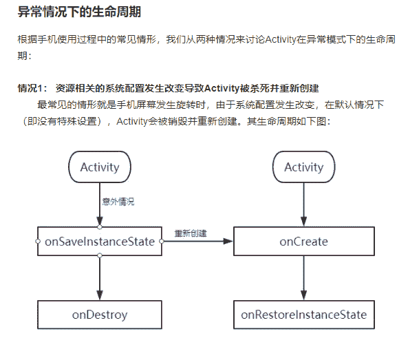
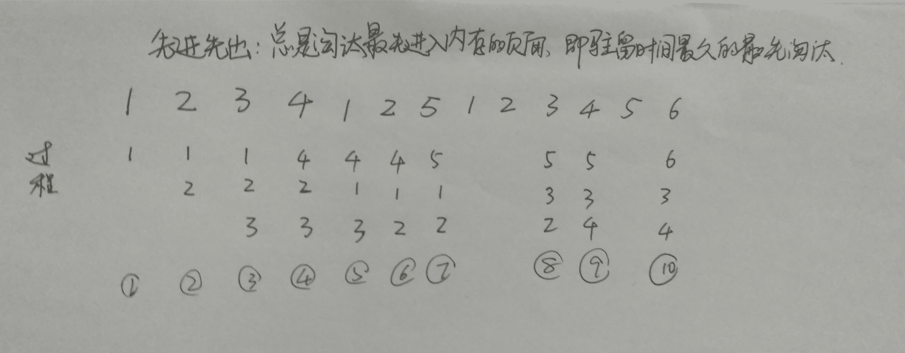
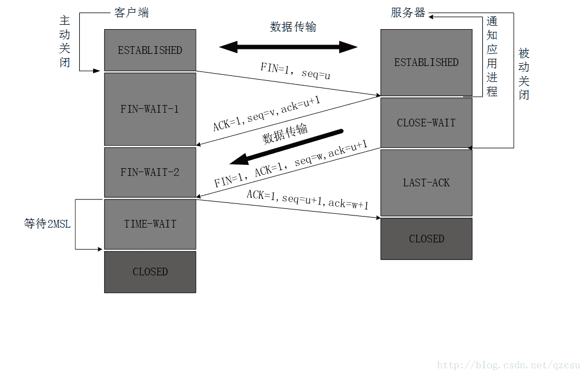
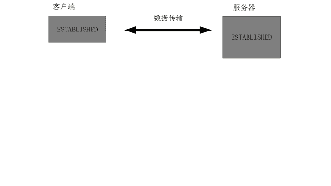
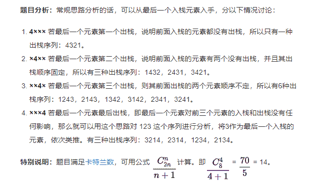
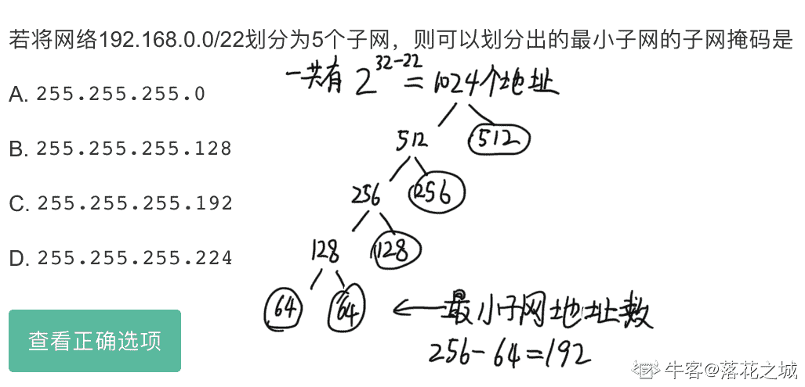
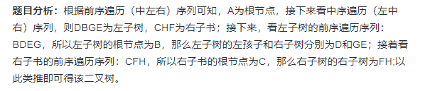
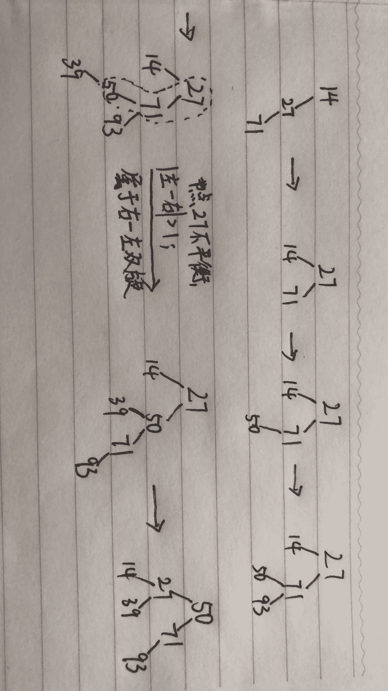

# 京东 2018 秋招 Android 工程师笔试题

## 1

接口是 Java 面向对象的实现机制之一，以下说法正确的是：( )

正确答案: B   你的答案: 空 (错误)

```cpp
Java 支持多重继承，一个类可以实现多个接口；
```

```cpp
Java 只支持单重继承，一个类可以实现多个接口；
```

```cpp
Java 只支持单重继承，一个类只可以实现一个接口；
```

```cpp
Java 支持多重继承，但一个类只可以实现一个接口。
```

本题知识点

安卓工程师 京东 安卓工程师 京东 2018

讨论

[jefshi](https://www.nowcoder.com/profile/714128099)

```cpp
interface A {} interface B{} interface C extends A, B {}
```

不好意思，接口是多重继承的，有是一道文字游戏题

发表于 2018-12-05 16:50:29

* * *

[空帆船](https://www.nowcoder.com/profile/3656142)

```cpp
Java 只支持单重继承？不应该是只支持单继承？指的是只有一个直接父类，但是可以有 A extends B, B extends C;这个才是多重继承啊！
```

发表于 2018-06-03 23:52:46

* * *

[Nixo](https://www.nowcoder.com/profile/2967304)

Java 是 C++衍生的语言，C++可以多继承，但是 Java 不可以，因为多继承可能会导致继承意义不够准确，还有就是父类中如果有相同的方法，可能会导致歧义产生冲突。而不能继承多父类的一个缺点就是，不够灵活，所以 Java 使用了接口，使得代码更灵活，可以通过不同的接口来更灵活的实现更多的功能，同时接口里只能写抽象方法，在编译时只会编译它的实现方法。这样也就弥补了上述所说的多父类中相同方法的冲突问题。如果有错误的地方或者不足的地方还请指正！

编辑于 2018-06-14 19:10:03

* * *

## 2

关于 Java 线程说法错误的是（）

正确答案: C   你的答案: 空 (错误)

```cpp
创建线程的有 2 种方式，方式 1 是继承 Thread 类，方式 2 是实现 Runnable 接口
```

```cpp
解决线程安全使用问题 synchronized 关键字，使得同一时间只有一个线程执行该关键字限定的代码段
```

```cpp
线程间通信所使用的方法有，wait，notify，notifyAll，它们都是 Thread 类的方法
```

```cpp
Java 线程包括 5 个状态，线程的创建，可运行，运行，阻塞和消亡
```

本题知识点

安卓工程师 京东 安卓工程师 京东 2018

讨论

[Nixo](https://www.nowcoder.com/profile/2967304)

A 答案我觉得可能有歧义，因为这两种方式的确可以创建线程，但是 Runnable 接口的底层工作原理也是对 Thread 类的一个高度封装，其中原理也是相当于 new 了一个 Thread   （可能我的观点有些不正确还请指教。）C 错在他们三个是 Object 类提供的方法 1\. wait(): 将当前线程加入到等待队列中，等待其他线程调用 notify 或者 notifyAll 来唤醒。2\. notify(): 唤醒在等待队列中等待的单个线程. 如果多个线程都是在等待队列中等待, 则随机唤醒一个. 3\. notifyAll(): 唤醒所有在等待队列中等待的所有线程。

发表于 2018-05-19 20:57:32

* * *

[牛客最菜](https://www.nowcoder.com/profile/2365703)

实现 callable 不是也能创建线程吗？A 选项有问题吧

发表于 2018-05-19 18:18:45

* * *

[Sencer](https://www.nowcoder.com/profile/2329236)

C 选项所给的三个方法是 Object 类的方法

发表于 2018-05-18 23:03:51

* * *

## 3

哪个方法可以用来关闭 activity？

正确答案: A   你的答案: 空 (错误)

```cpp
finish()
```

```cpp
onDestroy()
```

```cpp
finishActivity()
```

```cpp
None are correct
```

本题知识点

安卓工程师 京东 2018

讨论

[Nixo](https://www.nowcoder.com/profile/2967304)

在 Android 中 使用 finish()方***直接执行当前 Activity 中的 onDestory()生命周期方法来销毁 Activity；而 onDestory 仅仅是 Activity 的一个生命周期可以在里面做一些操作，资源释放等。

发表于 2018-05-19 21:03:10

* * *

## 4

我们是否可以在 activity 生命周期中的 onSaveInstanceState()方法中执行更新数据库的操作？

正确答案: C   你的答案: 空 (错误)

```cpp
可以，但是必须确认这个操作不会耗时太多
```

```cpp
可以，我们可以在这个方法中更新任意大小的数据库操作
```

```cpp
不可以， 因为这个方法不能保证在 activity 的生命周期中每次都会被调用
```

```cpp
都不正确
```

本题知识点

安卓工程师 京东 2018

讨论

[J-laughter](https://www.nowcoder.com/profile/217524534)

[`www.jianshu.com/p/ec50675ed116`](https://www.jianshu.com/p/ec50675ed116) 

发表于 2018-09-26 16:35:52

* * *

[Nixo](https://www.nowcoder.com/profile/2967304)

不可以，因为 onSaveInstanceState()方法只有在 Activity 异常情况下终止时才会调用，正常生命周期并不会调用该方法来保存 Activity 状态。

发表于 2018-05-19 21:06:03

* * *

## 5

如果 activity 被强制关闭， 我们需要如何保存 UI 状态？

正确答案: D   你的答案: 空 (错误)

```cpp
在方法 onSaveInstanceState()中保存部分 UI 状态
```

```cpp
在方法 onSaveInstanceState()中保存所有 UI 状态
```

```cpp
在 onPause 方法中保存
```

```cpp
Android 系统会自动保存和恢复 UI 状态，程序员不必关心
```

本题知识点

安卓工程师 京东 2018

讨论

[Nixo](https://www.nowcoder.com/profile/2967304)

Activity 在异常情况下终止时，系统会调用 onSaveInstanceState()来保存当前 Activity 状态（保存为 Bundle 对象），然后再 onCreate 或者 onRestoreInstanceState（）来恢复 Activity 状态。

发表于 2018-05-19 21:07:46

* * *

## 6

某系统中有 4 个并发进程，都需要同类资源 5 个，试问该系统无论怎样都不会发生死锁的最少资源数是 ___

正确答案: D   你的答案: 空 (错误)

```cpp
9
```

```cpp
21
```

```cpp
16
```

```cpp
17
```

本题知识点

安卓工程师 京东 2018

讨论

[Nixo](https://www.nowcoder.com/profile/2967304)

当 4 个线程都占有 4 个资源时 目前资源数为 16  再来一个资源时为他们刚好不会发生死锁的最少资源数 所以答案为 4x4+1 =17 

发表于 2018-05-19 21:09:03

* * *

## 7

在虚拟存储系统中，若进程在内存中占三块，开始时为空，开始访问为空时也算缺页，采用先进先出页面淘汰算法，当执行访问页号序列为 1、2、3、4、1、2、5、1、2、3、4、5、6 时，将产生（ ）次缺页中断。

正确答案: D   你的答案: 空 (错误)

```cpp
7
```

```cpp
11
```

```cpp
9
```

```cpp
10
```

本题知识点

安卓工程师 京东 2018

讨论

[shijiacheng](https://www.nowcoder.com/profile/179663)



发表于 2018-05-20 17:59:59

* * *

[风 2011612](https://www.nowcoder.com/profile/4086472)

一共缺页 10 次
缺页顺序为：（左边为页号，右边为缺页次数）1，1，#此时页号为：12，2，#此时页号为：1 23，3，#此时页号为：1 2 34，4，#此时已满，将最早进来的 1 替换出去，此时页号为：2 3 41，5，#将 2 替换出去，此时页号为：3 4 12，6，#将 3 替换出去，此时页号为：4 1 25，7，#将 4 替换出去，此时页号为：1 2 51，在，不缺页，此时页号为：1 2 52，在，不缺页，此时页号为：1 2 53，8，#将 1 替换出去，此时页号为：2 5 34，9，#将 2 替换出去，此时页号为：5 3 45，在，不缺页，此时页号为：5 3 46，10，#将 5 替换出去，此时页号为：3 4 6

发表于 2018-05-19 20:20:32

* * *

## 8

以下哪些状态为 TCP 连接关闭过程中的出现的状态？

正确答案: B C   你的答案: 空 (错误)

```cpp
LISTEN
```

```cpp
TIME-WAIT
```

```cpp
LAST-ACK
```

```cpp
SYN-RECEIVED
```

本题知识点

安卓工程师 京东 2018

讨论

[w 逸泽](https://www.nowcoder.com/profile/6484727)

（1） TCP 客户端发送一个 FIN，用来关闭客户到服务器的[数据传送](https://baike.baidu.com/item/%E6%95%B0%E6%8D%AE%E4%BC%A0%E9%80%81)。 客户端( time_wait   fin_wait1 )（2） 服务器收到这个 FIN，它发回一个 ACK，确认序号为收到的序号加 1。和 SYN 一样，一个 FIN 将占用一个序号。服务端(syn_ack   close_wait )（3） 服务器关闭客户端的连接，发送一个 FIN 给客户端。客户端收到( fin_wait2)（4） 客户端发回 ACK[报文](https://baike.baidu.com/item/%E6%8A%A5%E6%96%87)确认，并将确认序号设置为收到序号加 1。客户端(Last_ACK) 服务端(closed)

发表于 2018-08-04 18:02:12

* * *

[紫夜丶听雨](https://www.nowcoder.com/profile/4959477)




盗图的来了

发表于 2018-08-04 16:31:55

* * *

[小黄人 hcy0925](https://www.nowcoder.com/profile/370695430)

主动端可能出现的状态：FIN_WAIT,FIN_WAITING_CLOSE,TIME_WAIT 被动端 CLOSE_WAIT\LASK_ACK

发表于 2018-09-07 13:09:30

* * *

## 9

若一序列进栈顺序为 a1,a2,a3,a4，问存在多少种可能的出栈序列（       ）

正确答案: C   你的答案: 空 (错误)

```cpp
12
```

```cpp
13
```

```cpp
14
```

```cpp
15
```

本题知识点

安卓工程师 京东 安卓工程师 京东 2018

讨论

[J-laughter](https://www.nowcoder.com/profile/217524534)

[`www.jianshu.com/p/b57d88debef3`](https://www.jianshu.com/p/b57d88debef3)

发表于 2018-09-26 16:37:22

* * *

[Nixo](https://www.nowcoder.com/profile/2967304)

该问题满足卡特兰数  公式为 C（n，2n）/（n+1） = 70/5 = 14

发表于 2018-05-19 21:10:57

* * *

## 10

若将网络 192.168.0.0/22 划分为 5 个子网，则可以划分出的最小子网的子网掩码是

正确答案: B   你的答案: 空 (错误)

```cpp
255.255.255.0
```

```cpp
255.255.255.128
```

```cpp
255.255.255.192
```

```cpp
255.255.255.224
```

本题知识点

安卓工程师 京东 2018

讨论

[落花之城](https://www.nowcoder.com/profile/3419407)



发表于 2019-11-30 17:47:47

* * *

[Z4789](https://www.nowcoder.com/profile/4331631)

192.168.0.0/22  表示前 22 位是网络号，则后 10 位是主机号子网的划分是对主机号部分进行的，现在要划分 5 个子网，则应该从 10 位中取 3 位来表示子网号（最大可 8 个子网，2 位只能表示 4 个子网，因此不符合要求）那么对应的子网掩码就应该为：11111111.11111111.11111111.10000000 即：255.255.255.128 所以答案不应该选 C 呀？？？？有没有出来解答一下

编辑于 2018-06-24 17:43:27

* * *

## 11

正则表达式 ^d+[^d]+ 能匹配下列哪个字符串？

正确答案: C   你的答案: 空 (错误)

```cpp
123
```

```cpp
123a
```

```cpp
d123
```

```cpp
123def
```

```cpp
d7d
```

本题知识点

安卓工程师 京东 2018

讨论

[昵称已被占用、](https://www.nowcoder.com/profile/5014683)

^：匹配字符串的起始位置 d：表示字母 d，\d 匹配一个数组，即 [0-9]；\D，匹配一个非数字字符。+ ：前一项重复 1 次或多次。* 重复 0 次或多次。[^d]：中括号内的^表示非

发表于 2018-07-20 21:15:11

* * *

[WEBJ2EE](https://www.nowcoder.com/profile/3930151)

^d+ ==> 匹配字符串开头，后面跟一个或多个字母 d          ===> C\E 当中选；              [^d]+ ==> 后面再跟着一个或多个【不是字母 d】的字符                             ===> 选 C

发表于 2019-12-14 10:30:45

* * *

[dasdadsadas](https://www.nowcoder.com/profile/3036234)

^d+表示一行开头从 d 开始，可以出现一次或多次，[^d]+表示之后跟着的不能有 d，一个或多个都不行

发表于 2018-05-22 19:56:51

* * *

## 12

一个序列为（13,18,24,35,47,50,63,83,90,115,124），如果利用二分法查找关键字为 90 的，则需要几次比较 ？

正确答案: B   你的答案: 空 (错误)

```cpp
1
```

```cpp
2
```

```cpp
3
```

```cpp
4
```

本题知识点

安卓工程师 京东 安卓工程师 京东 2018

讨论

[dasdadsadas](https://www.nowcoder.com/profile/3036234)

第一次取第（0+10）/2=5 个数，值为 50,因为 90>50,查找{63,83,90,115,124}，去中间的数 90，刚好找到

发表于 2018-05-22 20:06:38

* * *

[Nixo](https://www.nowcoder.com/profile/2967304)

第一次{13,18,24,35,47}{50,63,83,90,115,124}第二次（后半部分）{50,63,83}{90,115,124}找到 90 了，所以两次可能理解有误，还请留言指教。

发表于 2018-05-19 21:13:43

* * *

## 13

已知一个二叉树前序遍历和中序遍历分别为 ABDEGCFH 和 DBGEACHF，则该二叉树的后序遍历为？

正确答案: A   你的答案: 空 (错误)

```cpp
DGEBHFCA
```

```cpp
DGEBHFAC
```

```cpp
GEDBHFCA
```

```cpp
ABCDEFGH
```

本题知识点

安卓工程师 京东 安卓工程师 京东 2018

讨论

[Marblog](https://www.nowcoder.com/profile/8504276)

很简单的二叉树算法，先续 A

发表于 2018-06-13 19:57:48

* * *

[J-laughter](https://www.nowcoder.com/profile/217524534)

[`www.jianshu.com/p/b57d88debef3`](https://www.jianshu.com/p/b57d88debef3)

发表于 2018-09-26 16:38:13

* * *

[星星月亮银河都是我的](https://www.nowcoder.com/profile/3861640)

                    A         B                    CD            E                        F          G                      H

发表于 2018-09-26 09:01:14

* * *

## 14

下面选项中对于 java 序列化正确的是

正确答案: C D   你的答案: 空 (错误)

```cpp
使用 FileInputStream 可以将对象进行读入
```

```cpp
使用 BufferedWriter 可以将对象进行传输
```

```cpp
使用 ObjectInputStream 类完成对象读取，使用 ObjectOutputStream 类完成对象存储
```

```cpp
如果想要进行对象序列化，需要实现 Serializable 接口
```

本题知识点

安卓工程师 京东 2018

讨论

[Marblog](https://www.nowcoder.com/profile/8504276)

Fileinput 是文件读取，A 错，object 是对象，B 错

编辑于 2018-06-13 19:59:59

* * *

## 15

以下哪些是 HTTP 请求中浏览器缓存机制会用到的协议头？

正确答案: A B   你的答案: 空 (错误)

```cpp
Last-Modified
```

```cpp
Etag
```

```cpp
Referer
```

```cpp
Authorization
```

本题知识点

安卓工程师 京东 2018

讨论

[learner111111](https://www.nowcoder.com/profile/970262031)

Last-Modified      // 指示最后修改的时间

Etag               // 指示资源的状态唯一标识

Expires            // 指示资源在浏览器缓存中的过期时间

发表于 2018-09-09 16:35:30

* * *

## 16

以下哪个命令不能查看文件里内容?

正确答案: C   你的答案: 空 (错误)

```cpp
more
```

```cpp
cat
```

```cpp
ls
```

```cpp
less
```

本题知识点

安卓工程师 京东 安卓工程师 京东 2018

讨论

[Marblog](https://www.nowcoder.com/profile/8504276)

ls 是列出文件项目，不能查看内容！

发表于 2018-06-13 20:01:05

* * *

## 17

在 MySQL 中,与语句 SELECT * FROM user WHERE age NOT BETWEEN 30 AND 70;等价的是()

正确答案: B   你的答案: 空 (错误)

```cpp
SELECT * FROM user WHERE age&lt;=30 OR age&gt;=70;
```

```cpp
SELECT * FROM user WHERE age&lt;30 OR age&gt;70;
```

```cpp
SELECT * FROM user WHERE age&gt;=30 OR age&lt;=70;
```

```cpp
SELECT * FROM user WHERE age&gt;30 OR age&lt;70;
```

本题知识点

安卓工程师 京东 安卓工程师 京东 2018

讨论

[SGZH](https://www.nowcoder.com/profile/3820510)

between... and ... 是一个闭区间

发表于 2018-05-25 18:43:52

* * *

## 18

把 14,27,71,50,93,39 按顺序插入一棵树,插入的过程不断调整使树为平衡排序二叉树,最终形成平衡排序二叉树高度为？

正确答案: A   你的答案: 空 (错误)

```cpp
3
```

```cpp
4
```

```cpp
5
```

```cpp
6
```

本题知识点

安卓工程师 京东 安卓工程师 京东 2018

讨论

[UIX](https://www.nowcoder.com/profile/678569229)



发表于 2018-06-13 22:24:37

* * *

## 19

以下正确的 shell 函数声明并且成功调用的是:

正确答案: C D   你的答案: 空 (错误)

```cpp
<div>function func(){<br>        echo &quot;Success&quot;<br>}<br>func()</div>

```

```cpp
<div>func(){<br>           echo &quot;Success&quot;<br>}<br>func()</div>

```

```cpp
<div>function func(){<br>    echo &quot;Success&quot;<br>}<br>func</div>

```

```cpp
<div>func(){<br>    echo &quot;Success&quot;<br>}<br>func</div>

```

本题知识点

安卓工程师 京东 安卓工程师 京东 2018

讨论

[learner111111](https://www.nowcoder.com/profile/970262031)

在 Shell 中可以通过下面的两种语法来定义函数，即有无 function；调用的时候不可带括号，只能写函数名。

发表于 2018-09-09 16:40:10

* * *

## 20

现有 testfile 文件内容如下所示
12
12
213
5434
3123
123
34
对所有数字求和，以下做法正确的是:

正确答案: B D   你的答案: 空 (错误)

```cpp
awk 'BEGIN{sum}{sum+$1}END{print sum}' testfile
```

```cpp
awk 'BEGIN{sum =0}{sum+=$1}END{print sum}' testfile
```

```cpp
awk '{sum+$1}END{print sum}' testfile
```

```cpp
awk '{sum+=$1}END{print sum}' testfile
```

本题知识点

安卓工程师 京东 2018

讨论

[昵称已被占用、](https://www.nowcoder.com/profile/5014683)

AWK

文本分析工具。grep 更适合淡出的查找或者匹配，sed 适合编辑匹配到的文本，awk 适合格式化文本，对文本进行复杂的处理。
**用法 1：**

```cpp
awk '{[pattern] action}'  filenames # 行匹配语句 awk '' 只能用单引号
```

**例如：**
1.每行按空格或者 Tab 分割，输出每行的第 1、4 列。

```cpp
awk '{print $1,$4}' log.txt # 格式化输出使用 printf
```

分割字符由 -F 指定，默认为空格或者 Tab。$n 引用由 FS 分割的第 n 个字段。
**用法 2：**

```cpp
awk 'BEGIN{执行前语句}{每一行执行的语句}END{所有行执行完后执行的语句}'
```

**例如：**
1.累加每行第一列数字

```cpp
awk 'BEGIN{sum=0}{sum+=$1}{print sum}'

#也可以省略 BEGIN
awk '{sum+=$1}{print sum}'
```

编辑于 2018-07-22 20:48:17

* * *

## 21

以下关于 HTTP 说法正确是的:

正确答案: A C   你的答案: 空 (错误)

```cpp
HTTP POST 方式比 GET 更安全
```

```cpp
HTTP GET 请求提交参数没有长度限制
```

```cpp
HTTP POST 请求提交参数没有长度限制
```

```cpp
HTTP GET 和 POST 请求提交参数都没有长度限制
```

本题知识点

安卓工程师 京东 2018

讨论

[我想我是疯了](https://www.nowcoder.com/profile/694217643)

POST 只是表面上看不到，实际上只要被抓包仍然可以把数据解析出来

发表于 2020-03-21 02:27:50

* * *

[伊涅斯塔](https://www.nowcoder.com/profile/650932)

POST 和 GET 不是相同的 HTTP 层吗，怎么会更安全？或者说表面上的安全？

发表于 2018-09-09 17:49:37

* * *

[Marblog](https://www.nowcoder.com/profile/8504276)

post 方式更安全，是加密传输，从浏览器地址栏看不到内容的

发表于 2018-06-13 20:02:35

* * *

## 22

安卓中事件传递有若干阶段，以下哪个方法只在 ViewGroup 及其子类中才存在？

正确答案: C   你的答案: 空 (错误)

```cpp
public boolean dispatchTouchEvent(MotionEvent ev)
```

```cpp
public boolean onTouchEvent(MotionEvent event)
```

```cpp
public boolean onInterceptTouchEvent(MotionEvent ev)
```

```cpp
public boolean onHandleTouchEvent(MotionEvent ev)
```

本题知识点

安卓工程师 京东 2018

讨论

[yudesong](https://www.nowcoder.com/profile/542881)

[`blog.csdn.net/zhe_ge_sha_shou/article/details/72597780`](https://blog.csdn.net/zhe_ge_sha_shou/article/details/72597780)

发表于 2018-05-30 13:39:36

* * *

[learner111111](https://www.nowcoder.com/profile/970262031)

只有在根 View 即 DecorView()之后才有事件拦截的方法（包括根 view）。

发表于 2018-09-09 16:46:43

* * *

## 23

以下对 Android 布局优化正确的是

正确答案: A B C   你的答案: 空 (错误)

```cpp
Include 标签共享布局
```

```cpp
ViewStub 标签实现延迟加载
```

```cpp
merge 标签减少布局层次
```

```cpp
LinearLayout 代替 RelativeLayout，增加嵌套和 View 节点
```

本题知识点

安卓工程师 京东 2018

讨论

[Nixo](https://www.nowcoder.com/profile/2967304)

造成卡顿的主要原因程序的大部分操作必须在 60fps 内执行完毕，否则就会造成卡顿造成卡顿的几种情况：background 图片过大，过多的嵌套，动画执行次数过多。画面渲染时遇上了 GC。ABC 都能减少卡顿问题，D 错在 LinearLayout 要实现精准的控件摆放肯定会使用很多的嵌套，会促进卡顿而不会减少卡顿.

发表于 2018-05-19 21:23:22

* * *

## 24

以下属于典型的 ANR 问题场景的是

正确答案: A C D   你的答案: 空 (错误)

```cpp
应用程序 UI 线程存在耗时操作
```

```cpp
用户网络中断，数据无法下载
```

```cpp
耗时的动画需要大量的计算工作，可能导致 CPU 负载过重
```

```cpp
应用程序的 UI 线程等待子线程释放某个锁，从而无法处理用户的输入
```

本题知识点

安卓工程师 京东 2018

讨论

[Nixo](https://www.nowcoder.com/profile/2967304)

B 答案中 通常数据下载这种耗时操作都要在子线程中执行，而 ANR 异常是主线程中未响应超过 5s 所弹出的异常，所以 B 不会导致 ANR 异常

发表于 2018-05-19 21:25:17

* * *

## 25

下面选项中对 TCP 与 UDP 论述正确的是？

正确答案: A C D   你的答案: 空 (错误)

```cpp
TCP 是面向连接的，如打电话要先拨号建立连接
```

```cpp
TCP 支持一对一，一对多，多对一和多对多的交互通信
```

```cpp
TCP 面向字节流，实际上是 TCP 把数据看成一连串无结构的字节流
```

```cpp
UDP 是无连接的，即发送数据之前不需要建立连接
```

本题知识点

安卓工程师 京东 2018

讨论

[武培轩](https://www.nowcoder.com/profile/5033606)

**正确答案**ACD**答案解析**TCP 只支持点对点，UDP 支持一对一、一对多、多对多。

发表于 2018-09-09 18:57:25

* * *

[伊涅斯塔](https://www.nowcoder.com/profile/650932)

TCP 不支持多对一

发表于 2018-09-09 17:52:40

* * *

## 26

下面哪些是 Java 的 Runtime Exception?

正确答案: A B C   你的答案: 空 (错误)

```cpp
NullPointerException
```

```cpp
ClassCastException
```

```cpp
IndexOutOfBoundsException
```

```cpp
IOException
```

本题知识点

安卓工程师 京东 2018

讨论

[牽不動的手い](https://www.nowcoder.com/profile/8837261)

异常分为运行时异常和非运行时异常。运行时异常包括 NullPointerException， IndexOutOfBoundsException， ClassCastException 等。非运行时异常包括 IOException、SQLException 以及用户自定义的 Exception 等。  

发表于 2018-05-21 17:41:53

* * *

## 27

如下哪些 sql 语句能查询出每门课都都大于 80 分的学生姓名,部分数据如下表(student_score)所示,

| stu_no | stu_name | sub_no | sub_name | score |
| 1 | 张三 | 001 | 语文 | 90 |
| 1 | 张三 | 002 | 数学 | 60 |
| 2 | 李四 | 001 | 语文 | 89 |
| 2 | 李四 | 002 | 数学 | 86 |

正确答案: A B   你的答案: 空 (错误)

```cpp
select distinct stu_name from student_score where stu_name not in (select distinct stu_name from student_score where score &lt;= 80)
```

```cpp
select stu_name from student_score group by stu_name having min(score) &gt; 80
```

```cpp
select distinct stu_name from student_score where score &gt; 80
```

```cpp
select stu_name from student_score group by sub_name having min(score) &gt; 80
```

本题知识点

安卓工程师 京东 2018

讨论

[learner111111](https://www.nowcoder.com/profile/970262031)

c 中为存在一门大于 80，而题目意思为所有的才对；d 中分类错误。

发表于 2018-09-09 16:53:00

* * *

## 28

Java 的泛型是 JDK1.5 引入的一个新特性，它提供了编译期的类型安全监测机制。 现定义如下程序：

```cpp
public class T {}
public class A extends T{}
public class B extends A{}
public class Test {
    public static void main(String[] args){
        List<Class<? extends T>> list = new ArrayList<>();
    }
}
```

请问下面选项中哪个类的 class 能够被存储到 list 对象中（）

正确答案: D   你的答案: 空 (错误)

```cpp
只有 A.class
```

```cpp
只有 B.class
```

```cpp
A.class 和 B.class
```

```cpp
A.class,B.class 和 T.class
```

本题知识点

安卓工程师 京东 2018

讨论

[小强开学前](https://www.nowcoder.com/profile/4208515)

<? extends E> 是 Upper Bound（上限） 的通配符，用来限制元素的类型的上限,即只能是这个 E 或者 E 的子类；另外还有 <? super E>，它是 Lower Bound（下限） 的通配符 ，用来限制元素的类型下限,即只能是这个 E 或者 E 的父类。

发表于 2018-09-10 12:11:53

* * *

## 29

定义如下程序：

```cpp
public  class  Person{
    {
         System.out.println("P1");
    }
    static{
         System.out.println("P2");
    }
    public Person(){
         System.out.println("P3");
    }
}
public  class  Students extends Person{
    static{
        System.out.println("S1");
    }
    {
         System.out.println("S2");
    }
    public Students(){
         System.out.println("S3")
    }
    public static void  main(String[] args){
         new Students();
    }
}
```

程序执行结果是？（）

正确答案: D   你的答案: 空 (错误)

```cpp
P1P2P3S1S2S3
```

```cpp
P1P2P3S2S1S3
```

```cpp
P2P1S1P3S2S3
```

```cpp
P2S1P1P3S2S3
```

本题知识点

安卓工程师 京东 2018

讨论

[J-laughter](https://www.nowcoder.com/profile/217524534)

> [`www.jianshu.com/p/0077663d433f`](https://www.jianshu.com/p/0077663d433f)

编辑于 2018-09-11 19:00:46

* * *

[Nixo](https://www.nowcoder.com/profile/2967304)

使用了静态关键字来修饰的对象在编译时不会创建对象而直接执行，没有使用的则需要创建一个对象，所以 static 比一般都要快。所以 P2S1 肯定是先执行的。

发表于 2018-05-19 21:27:36

* * *

## 30

合法的括号匹配序列被定义为:
1\. 空串""是合法的括号序列
2\. 如果"X"和"Y"是合法的序列,那么"XY"也是一个合法的括号序列
3\. 如果"X"是一个合法的序列,那么"(X)"也是一个合法的括号序列
4\. 每个合法的括号序列都可以由上面的规则生成
例如"", "()", "()()()", "(()())", "(((())))"都是合法的。 东东现在有一个合法的括号序列 s,一次移除操作分为两步:
1\. 移除序列 s 中第一个左括号
2\. 移除序列 s 中任意一个右括号.保证操作之后 s 还是一个合法的括号序列
东东现在想知道使用上述的移除操作有多少种方案可以把序列 s 变为空
如果两个方案中有一次移除操作移除的是不同的右括号就认为是不同的方案。
例如: s = "()()()()()",输出 1 , 因为每次都只能选择被移除的左括号所相邻的右括号.
s = "(((())))",输出 24 , 第一次有 4 种情况, 第二次有 3 种情况, ... ,依次类推, 4 * 3 * 2 * 1 = 24 数据范围：输入的序列长度满足  ，保证输入的括号序列合法

本题知识点

安卓工程师 京东 递归 字符串 *动态规划 2018* *讨论

[shijiacheng](https://www.nowcoder.com/profile/179663)

```cpp
import java.util.Scanner;
import java.util.Stack;

/**
 * 京东 2018 秋招 Android
 * 括号匹配方案
 * 合法的括号匹配序列被定义为:
 * 1\. 空串""是合法的括号序列
 * 2\. 如果"X"和"Y"是合法的序列,那么"XY"也是一个合法的括号序列
 * 3\. 如果"X"是一个合法的序列,那么"(X)"也是一个合法的括号序列
 * 4\. 每个合法的括号序列都可以由上面的规则生成
 * 例如"", "()", "()()()", "(()())", "(((())))"都是合法的。 东东现在有一个合法的括号序列 s,
 * 一次移除操作分为两步:
 * 1\. 移除序列 s 中第一个左括号
 * 2\. 移除序列 s 中任意一个右括号.保证操作之后 s 还是一个合法的括号序列
 * 东东现在想知道使用上述的移除操作有多少种方案可以把序列 s 变为空
 * 如果两个方案中有一次移除操作移除的是不同的右括号就认为是不同的方案。
 * 例如: s = "()()()()()",输出 1, 因为每次都只能选择被移除的左括号所相邻的右括号.
 * s = "(((())))",输出 24, 第一次有 4 种情况, 第二次有 3 种情况, ... ,依次类推, 4 * 3 * 2 * 1 = 24
 * 输入描述:
 * 输入包括一行,一个合法的括号序列 s,序列长度 length(2 ≤ length ≤ 20).
 * 输出描述:
 * 输出一个整数,表示方案数
 * 输入例子 1:
 * (((())))
 * 输出例子 1:
 * 24
 *
 * 思路：遍历字符串，每次把左括号都压入栈，每次遇到右括号，先统计栈中有几个左括号，统计数与上次统计数相乘
 * 接着弹出栈中的一个左括号
 * 直到遍历结束，结果即为方案数
 */
public class BracketMatch {
    public static void main(String[] args) {
        Scanner sc = new Scanner(System.in);
        String s = sc.next();

        Stack<Character> stack = new Stack<>();
        int result = 1;
        char c;

        for (int i = 0; i < s.length(); i++) {
            c = s.charAt(i);
            if (c == '(') {
                stack.push(c);

            }
            if (c == ')') {
                int size = stack.size();
                result *= size;
                stack.pop();
            }
        }

        System.out.println(result);
    }
} 
```

发表于 2018-05-20 18:02:41

* * *

[Nixo](https://www.nowcoder.com/profile/2967304)

这道题是之前求括号层次的变种  求层次需要比对找到最大值而这个题不用，解题思路，1.遍历字符串如果是（ 则+1 如果是）则减一  （因为是合法的，所以第一个肯定是 (   ）2.在-1 时执行乘法运算，然后再-1，也就相当于题目中 4x3x2x1 反过来一样。代码如下：import java.util.Scanner;

//括号有多少种组合方式。

public class Main2 {

```cpp
    public static void main(String[] args) {
        Scanner scanner = new Scanner(System.in);
        String S = scanner.next();
        int index = 0;
        int result = 1;
        for (int i = 0; i < S.length(); i++) {
            if(S.charAt(i) == '('){
                index ++;
            }else{
                result *= index;
                index--;
            }
        }
        System.out.println(result);
    }
}

```

发表于 2018-05-19 21:31:36

* * *

[我回来啦](https://www.nowcoder.com/profile/795247535)

```cpp
 import math
 while True:
     try:
         s = list(input())
         count = 0
         res = 1
         for i in range(len(s)):
             if s[i] == "(":
                 count += 1
             else:
                 res *= count
                 count -= 1

         print(res)
     except:
         break

```

            发表于 2019-03-31 11:45:29

        31
          东东在一本古籍上看到有一种神奇数,如果能够将一个数的数字分成两组,其中一组数字的和等于另一组数字的和,我们就将这个数称为神奇数。例如 242 就是一个神奇数,我们能够将这个数的数字分成两组,分别是 {2,2} 以及 {4} ,而且这两组数的和都是 4 .东东现在需要统计给定区间中有多少个神奇数,即给定区间 [l, r] ,统计这个区间中有多少个神奇数,请你来帮助他。 

   数据范围：  ， 

            本题知识点

                                                            安卓工程师 
                                                京东 
                                                模拟 
                                                动态规划 
                                                穷举 
                                                2018 

        讨论
            [shijiacheng](https://www.nowcoder.com/profile/179663)

```cpp
import java.util.Arrays;
import java.util.Scanner;

/**
 * 京东 2018 秋招 Android
 * 神奇数
 * 东东在一本古籍上看到有一种神奇数,如果能够将一个数的数字分成两组,其中一组数字的和等于另一组数字的和,
 * 我们就将这个数称为神奇数。例如 242 就是一个神奇数,我们能够将这个数的数字分成两组,分别是{2,2}以及{4},
 * 而且这两组数的和都是 4.东东现在需要统计给定区间中有多少个神奇数,即给定区间[l, r],统计这个区间中有多
 * 少个神奇数,请你来帮助他。
 * 输入描述:
 * 输入包括一行,一行中两个整数 l 和 r(1 ≤ l, r ≤ 10⁹, 0 ≤ r - l ≤ 10⁶),以空格分割
 * <p>
 * <p>
 * 输出描述:
 * 输出一个整数,即区间内的神奇数个数
 * <p>
 * 输入例子 1:
 * 1 50
 * <p>
 * 输出例子 1:
 * 4
 */
public class MagicNumber {
    /**
     * 首先判断数组能否被平分，即数组分割问题，
     * dp[i][j]
     * 表示数组前 i
     * 个数字能否求和得到 j
     * 则
     * dp[i][j]=dp[i−1][j]||dp[i−1][j−array[i]]
     * 其中||是逻辑或运算。
     * 优化：
     * 1、若 sum（array）为奇数，直接返回 false
     * 2、使用逆序循环将 dp 数组简化为一维数组
     */

    public static boolean isMagic(int[] nums, int sum) {
        int len = nums.length;

        if (sum % 2 != 0)
            return false;

        int mid = sum / 2;

        int[] dp = new int[mid + 1];
        dp[0] = 1;
        for (int i = 0; i < len; i++) {
            for (int j = mid; j > 0; j--) {
                if (j >= nums[i] && nums[i] != -1)
                    dp[j] = Math.max(dp[j], dp[j - nums[i]]);
            }
        }
        if (dp[mid] > 0)
            return true;
        else
            return false;
    }

    public static void main(String[] args) {
        Scanner sc = new Scanner(System.in);
        int l = sc.nextInt();
        int r = sc.nextInt();

        int result = 0;

        for (int i = l; i <= r; i++) {

            int num = i;
            int[] nums = new int[10];
            int sum = 0;
            Arrays.fill(nums, -1);
            int index = 0;
            while (num > 0) {
                int temp = num % 10;
                nums[index++] = temp;
                sum += temp;
                num = num / 10;
            }

            if (isMagic(nums, sum)) {
                result++;
            }
        }

        System.out.println(result);
    }

} 
```

            发表于 2018-05-20 18:02:03

            [ChessC](https://www.nowcoder.com/profile/848210337)

```cpp

	#include <iostream>

	#include <vector>
#include <algorithm>
using namespace std;
bool judge(vector<int>& nums,int sum){
    if(sum%2!=0) //如果累加和为奇数，直接 false
        return false;
    int n=nums.size();
    int target=sum/2; //目标累加和
    vector<bool> dp(target+1,false); //dp[i][j]为前 i 个数的累加和能否为 j，简化为一维数组
    dp[0]=true;
    for(int i=1;i<=n;++i)
        for(int j=target;j>=nums[i];--j) //0-1 背包问题，逆序循环
            dp[j]=dp[j-nums[i]] || dp[j];
    return dp[target];
}

vector<int> get_num(int i){ //取出每一位数字
    vector<int> res;
    while(i){
        res.push_back(i%10);
        i/=10;
    }
    return res;
}
int main(){
    int l,r;
    cin>>l>>r;
    int cnt=0;
    for(int i=l;i<=r;++i){
        vector<int> nums=get_num(i);
        int sum=accumulate(nums.begin(),nums.end(),0);
        if(judge(nums,sum))
            cnt++;
    }
    cout<<cnt;
    return 0;
}  

```

            编辑于 2019-02-22 14:23:18

            [Huluuu](https://www.nowcoder.com/profile/6198101)

                                                                      转自 CSDN 博客：[`blog.csdn.net/bing_lee/article/details/77899602`](https://blog.csdn.net/bing_lee/article/details/77899602)  

```cpp
#include <iostream>
#include <vector>
#include <algorithm>

using namespace std;

bool IsNum(int &in){
       vector<int> arry;
       int num=in;
       int half=0;
       while(num){//将数字打散存入 arry 数组
              arry.push_back(num%10);
              half+=num%10;
              num/=10;
       }
       if (half%2!=0) return false;
       half/=2;
       vector<int> dp(half+1); //之后这一小段用的是 01 背包，判断能装下最大的数和一半是否相等。
       for (int i=0;i<arry.size();i++){
              for(int j=half;j>=arry[i];j--){
                     dp[j]=max(dp[j],dp[j-arry[i]]+arry[i]);
              }
       }
       return dp[half]==half;
}

int main()
{
       int l,r;
       cin>>l>>r;
       int count=0;
       for(int i=l;i<=r;i++){
              if(IsNum(i))
                     count++;//如果是神奇数，计数+1
       }
       cout<<count<<endl;
       return 0;
}
```

            编辑于 2018-10-04 14:59:47

        32
        用浏览器访问 www.jd.com 时，可能使用到的协议有？

    正确答案:
                                A
                                             B
                                                              D
                                        你的答案:

                  空
                             (错误)

```cpp
MAC
```

```cpp
HTTP
```

```cpp
SMTP
```

```cpp
ARP
```

```cpp
RTSP
```

本题知识点

                                                            安卓工程师 
                                                京东 
                                                2018 

讨论

[Nixo](https://www.nowcoder.com/profile/2967304)

                                                                      两台通讯需要 MAC 和 IP 地址  而一开始我们没有 MAC 地址，所以需要通过 ARP 协议来获取到对方的 MAC 地址，然后再经过 http 协议 来访问网页 
   所以需要 ARP HTTP MAC 

发表于 2018-05-19 21:33:10

* * *

```cpp

```*