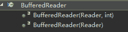
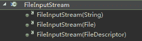

# 搜狐畅游 2018 校招笔试题-游戏开发工程师（java）

## 1

尼尔机械纪元当中以下哪个型号的寄叶部队你不可以使用？

正确答案: D   你的答案: 空 (错误)

```cpp
A2
```

```cpp
2B
```

```cpp
9S
```

```cpp
6O
```

本题知识点

Java 工程师 游戏研发工程师 Java 工程师 搜狐畅游 2018

## 2

尼尔机械纪元一周目 boss 是谁？

正确答案: B   你的答案: 空 (错误)

```cpp
亚当
```

```cpp
夏娃
```

```cpp
A2
```

```cpp
塔
```

本题知识点

Java 工程师 游戏研发工程师 Java 工程师 搜狐畅游 2018

## 3

FGO 中，人活着就是为了谁？

正确答案: B   你的答案: 空 (错误)

```cpp
阿尔托利亚·潘德拉贡
```

```cpp
贞德
```

```cpp
金闪闪（吉尔伽美什）
```

```cpp
EGOIST
```

本题知识点

Java 工程师 游戏研发工程师 Java 工程师 搜狐畅游 2018

## 4

Lol 当中以下那个英雄是男性？

正确答案: B   你的答案: 空 (错误)

```cpp
虚空遁地兽-雷克塞
```

```cpp
狂暴之心-凯南
```

```cpp
发条魔灵-奥利安娜
```

```cpp
海兽祭司-俄洛伊
```

本题知识点

Java 工程师 游戏研发工程师 Java 工程师 搜狐畅游 2018

## 5

《阴阳师》中，以下哪个式神是男孩子？

正确答案: B   你的答案: 空 (错误)

```cpp
烟烟罗
```

```cpp
般若
```

```cpp
九命猫
```

```cpp
阎魔
```

本题知识点

Java 工程师 常识判断 游戏研发工程师 搜狐畅游 2018 运营 牛客 2020

讨论

[小阿花 Minty](https://www.nowcoder.com/profile/724882383)

我强烈怀疑这是网易的题

发表于 2020-02-23 21:42:48

* * *

[牛客 645094379 号](https://www.nowcoder.com/profile/645094379)

？？？

发表于 2020-02-21 21:00:57

* * *

[牛客 65550563 号](https://www.nowcoder.com/profile/65550563)

我裂开，行测还搞这些吗

发表于 2021-04-29 20:31:07

* * *

## 6

《绝地逃生》中，“大吉大利，今晚吃鸡”的条件是

正确答案: B   你的答案: 空 (错误)

```cpp
杀死 10 名玩家
```

```cpp
存活到最后
```

```cpp
捡到一只鸡
```

```cpp
存活一小时
```

本题知识点

Java 工程师 游戏研发工程师 Java 工程师 搜狐畅游 2018

## 7

以下哪个游戏与其他游戏不是一个类型的

正确答案: C   你的答案: 空 (错误)

```cpp
COK
```

```cpp
王国纪元
```

```cpp
梦幻西游
```

```cpp
阿瓦隆之王
```

本题知识点

Java 工程师 游戏研发工程师 Java 工程师 搜狐畅游 2018

## 8

以下哪个《守望先锋》英雄不是突击类英雄？

正确答案: D   你的答案: 空 (错误)

```cpp
源氏
```

```cpp
死神
```

```cpp
末日铁拳
```

```cpp
半藏
```

本题知识点

Java 工程师 游戏研发工程师 Java 工程师 搜狐畅游 2018

## 9

《炉石传说》中，以下哪张牌一定能够消灭指定随从？

正确答案: D   你的答案: 空 (错误)

```cpp
斩杀
```

```cpp
刺杀
```

```cpp
迈克斯纳
```

```cpp
死亡之翼
```

本题知识点

Java 工程师 游戏研发工程师 Java 工程师 搜狐畅游 2018

讨论

[goodeven](https://www.nowcoder.com/profile/302846)

???? 被鸭杀鸡之类的拉出来不触发战吼怎么消灭，这个有问题啊

发表于 2018-05-24 15:58:56

* * *

## 10

以下几款游戏哪款和其它三款类型不同？

正确答案: C   你的答案: 空 (错误)

```cpp
问道
```

```cpp
诛仙
```

```cpp
桃园
```

```cpp
神武
```

本题知识点

Java 工程师 游戏研发工程师 Java 工程师 搜狐畅游 2018

讨论

[宁旭东](https://www.nowcoder.com/profile/5509292)

为什么不是 b 啊，感觉除了诛仙，都是回合制游戏啊

发表于 2018-05-29 20:05:49

* * *

## 11

暴雪在 1998 年开发的以人族、神族、虫族三个种族之间的实时战略形态构成的游戏是

正确答案: C   你的答案: 空 (错误)

```cpp
天堂
```

```cpp
疯狂坦克
```

```cpp
星际争霸
```

```cpp
暗黑破坏神
```

本题知识点

Java 工程师 游戏常识 游戏研发工程师 搜狐畅游 2018

讨论

[泽雨 Cover](https://www.nowcoder.com/profile/425527864)

这题搞错就真的是一点基础常识都没有了

发表于 2021-02-13 20:55:31

* * *

## 12

“植物大战僵尸”中“向日葵”的作用是

正确答案: B   你的答案: 空 (错误)

```cpp
发射葵花籽攻击正前方的第一个目标，每次攻击射出一颗葵花籽
```

```cpp
产出阳光
```

```cpp
每隔一段时间灼烧前方所有僵尸
```

```cpp
冻住触及到自身的一个僵尸
```

本题知识点

Java 工程师 游戏常识 游戏研发工程师 搜狐畅游 2018

讨论

[煮煮的咖啡](https://www.nowcoder.com/profile/781967401)

B

发表于 2020-09-20 14:52:26

* * *

[小缝帽](https://www.nowcoder.com/profile/174691452)

😂玩过的都懂

发表于 2020-09-20 00:51:55

* * *

## 13

以下解释错误的是

正确答案: C   你的答案: 空 (错误)

```cpp
DPS：每秒输出伤害
```

```cpp
AOE：范围性作用技能
```

```cpp
BUFF：自己或者女方英雄身上持续性的负面魔法效果
```

```cpp
DOT：持续伤害
```

本题知识点

Java 工程师 游戏研发工程师 Java 工程师 搜狐畅游 2018

讨论

[ustczxd](https://www.nowcoder.com/profile/8423936)

增益状态，debuff 削弱

发表于 2018-10-21 12:07:45

* * *

## 14

以下哪个不是《英雄联盟》排位赛段位名称？

正确答案: B   你的答案: 空 (错误)

```cpp
英勇黄铜
```

```cpp
秩序白银
```

```cpp
荣耀黄金
```

```cpp
最强王者
```

本题知识点

Java 工程师 游戏研发工程师 Java 工程师 搜狐畅游 2018

讨论

[Ezreal💕](https://www.nowcoder.com/profile/1802428)

不屈白银

发表于 2018-09-17 10:00:01

* * *

[秋霞](https://www.nowcoder.com/profile/4489168)

明明是青铜。。。。。

发表于 2018-09-16 23:15:22

* * *

## 15

以下哪个不是暴雪旗下游戏？

正确答案: D   你的答案: 空 (错误)

```cpp
《星际争霸 II》
```

```cpp
《魔兽世界：熊猫人之谜》
```

```cpp
《失落的维京人》
```

```cpp
《流放之路》
```

本题知识点

Java 工程师 游戏研发工程师 Java 工程师 搜狐畅游 2018

## 16

在腾讯公司发行的 MOBA 类手游《王者荣耀》中，击杀蓝 BUFF 会带来什么样的增益？

正确答案: B   你的答案: 空 (错误)

```cpp
普通攻击附带灼烧并减速
```

```cpp
加快回蓝速度并减少技能冷却时间
```

```cpp
击杀小兵额外获得金钱奖励
```

```cpp
并没有什么增益
```

本题知识点

Java 工程师 游戏研发工程师 Java 工程师 搜狐畅游 2018

讨论

[只喝维他🍋茶](https://www.nowcoder.com/profile/46903103)

B

发表于 2019-03-29 04:09:23

* * *

## 17

卡牌手游《阴阳师》中，最稀有的式神用什么来表示

正确答案: B   你的答案: 空 (错误)

```cpp
SR
```

```cpp
SSR
```

```cpp
SSSR
```

```cpp
SSS
```

本题知识点

Java 工程师 游戏研发工程师 Java 工程师 搜狐畅游 2018

## 18

下列哪个游戏不是国产武侠类网游

正确答案: C   你的答案: 空 (错误)

```cpp
剑侠情缘三
```

```cpp
天涯明月刀
```

```cpp
魔兽世界
```

```cpp
天龙八部
```

本题知识点

Java 工程师 游戏常识 游戏研发工程师 搜狐畅游 2018

讨论

[牛客 76015038 号](https://www.nowcoder.com/profile/76015038)

都没玩过

发表于 2020-08-01 19:42:14

* * *

[shenengen](https://www.nowcoder.com/profile/453334066)

《魔兽世界》（World of Warcraft）是由著名游戏公司暴雪娱乐所制作的第一款网络游戏，属于大型多人在线角色扮演游戏。 2003 年《魔兽争霸 III：冰封王座》发售之后，暴雪娱乐正式宣布了《魔兽世界》的开发计划（之前已经秘密开发了数年之久）。魔兽世界于 2004 年在北美公开测试，同年 11 月 23 日开始在美国、新西兰、加拿大、澳洲与墨西哥发行。

发表于 2021-10-25 15:38:32

* * *

[牛客 439149533 号](https://www.nowcoder.com/profile/439149533)

 c

发表于 2020-08-02 15:53:34

* * *

## 19

下面哪个网站是因为大型游戏《魔兽世界》而被人熟知的？

正确答案: D   你的答案: 空 (错误)

```cpp
A9VGB
```

```cpp
ACFANC
```

```cpp
COLGD
```

```cpp
NGA
```

本题知识点

Java 工程师 游戏研发工程师 Java 工程师 搜狐畅游 2018

## 20

王者荣耀中以下哪个角色不是法师？

正确答案: D   你的答案: 空 (错误)

```cpp
王昭君
```

```cpp
墨子
```

```cpp
干将莫邪
```

```cpp
曹操
```

本题知识点

Java 工程师 游戏研发工程师 Java 工程师 搜狐畅游 2018

## 21

以下哪些动物不是开心消消乐的消除块？

正确答案: C   你的答案: 空 (错误)

```cpp
狐狸
```

```cpp
青蛙
```

```cpp
小猪
```

```cpp
熊
```

本题知识点

Java 工程师 游戏研发工程师 Java 工程师 搜狐畅游 2018

## 22

剑灵当中召唤师的召唤物是什么？

正确答案: A   你的答案: 空 (错误)

```cpp
猫
```

```cpp
狗
```

```cpp
蜜蜂
```

```cpp
龙
```

本题知识点

Java 工程师 游戏研发工程师 Java 工程师 搜狐畅游 2018

## 23

手游《阴阳师》中，哪种玩法无法收集新的式神

正确答案: D   你的答案: 空 (错误)

```cpp
悬赏任务
```

```cpp
式神委派
```

```cpp
百鬼夜行
```

```cpp
业原火副本
```

本题知识点

Java 工程师 游戏研发工程师 Java 工程师 搜狐畅游 2018

## 24

手游《魔法门之英雄无敌：战争纪元》中，没有以下哪个种族？

正确答案: C   你的答案: 空 (错误)

```cpp
塔楼
```

```cpp
地狱
```

```cpp
要塞
```

```cpp
元素
```

本题知识点

Java 工程师 游戏研发工程师 Java 工程师 搜狐畅游 2018

## 25

手游《不思议迷宫》中，以下哪个冈布奥不是战斗系的？

正确答案: B   你的答案: 空 (错误)

```cpp
角斗士冈布奥
```

```cpp
佐罗冈布奥
```

```cpp
斯巴达冈布奥
```

```cpp
死亡骑士冈布奥
```

本题知识点

Java 工程师 游戏研发工程师 Java 工程师 搜狐畅游 2018

## 26

以下关于异常的说法正确的是：

正确答案: D   你的答案: 空 (错误)

```cpp
一旦出现异常，程序运行就终止了
```

```cpp
如果一个方法申明将抛出某个异常，它就必须真的抛出那个异常
```

```cpp
在 catch 子句中匹配异常是一种精确匹配
```

```cpp
可能抛出系统异常的方法是不需要申明异常的
```

本题知识点

Java 工程师 游戏研发工程师 搜狐畅游 2018

## 27

给定如下 Java 代码，编译运行的结果是（）
LinkedList list=new LinkedList();
list.add("A");
list.add(0,"B");
String s=(String)list.get(1);
System.out.println(s);

正确答案: C   你的答案: 空 (错误)

```cpp
编译时发生错误
```

```cpp
运行时引发异常
```

```cpp
正确运行，输出：A
```

```cpp
正确运行，输出：B
```

本题知识点

Java 工程师 游戏研发工程师 搜狐畅游 2018

讨论

[GoodDemo](https://www.nowcoder.com/profile/493702)

**[add](https://tool.oschina.net/uploads/apidocs/jdk-zh/java/util/LinkedList.html#add(E))**([E](https://tool.oschina.net/uploads/apidocs/jdk-zh/java/util/LinkedList.html) e) 将指定元素添加到此列表的结尾。所以 list 索引 0 放的是 B，索引 1 放的是 A。

发表于 2020-11-12 22:19:28

* * *

## 28

下列叙述中正确的是( )

正确答案: A   你的答案: 空 (错误)

```cpp
Java 语言的标识符是区分大小写的
```

```cpp
源文件名与 public 类名可以不相同
```

```cpp
源文件扩展名为.jar
```

```cpp
源文件中 public 类的数目不限
```

本题知识点

Java 工程师 游戏研发工程师 Java 工程师 搜狐畅游 2018

## 29

下列属于合法的 Java 标识符是( )

正确答案: A   你的答案: 空 (错误)

```cpp
_cat
```

```cpp
5books
```

```cpp
+static
```

```cpp
-3.14159
```

本题知识点

Java 工程师 游戏研发工程师 Java 工程师 搜狐畅游 2018

讨论

[北北小姑娘](https://www.nowcoder.com/profile/6856968)

a

发表于 2018-09-14 00:52:50

* * *

## 30

在 Java 中所有类的根类是( )

正确答案: A   你的答案: 空 (错误)

```cpp
java.lang.Object
```

```cpp
java.lang.Class
```

```cpp
java.applet.Applet
```

```cpp
java.awt.Frame
```

本题知识点

Java 工程师 游戏研发工程师 Java 工程师 搜狐畅游 2018

## 31

在 Java 中用 Package 语句说明一个包时，该包的层次结构必须是( )

正确答案: A   你的答案: 空 (错误)

```cpp
与文件的结构相同
```

```cpp
与文件目录的层次相同
```

```cpp
与文件类型相同
```

```cpp
与文件大小相同
```

本题知识点

Java 工程师 游戏研发工程师 搜狐畅游 2018

讨论

[牛得滑爱我一万年](https://www.nowcoder.com/profile/1698736)

？百度的答案是 B，个人感觉也是 B

发表于 2018-09-15 16:02:57

* * *

## 32

在读字符文件 Employee.dat 时可以使用该文件作为参数的类是( )。

正确答案: D   你的答案: 空 (错误)

```cpp
BufferReader
```

```cpp
DatalnputStream
```

```cpp
DataOutoutStream
```

```cpp
FileInputStream
```

本题知识点

Java 工程师 游戏研发工程师 Java 工程师 搜狐畅游 2018

讨论

[我是如此相信](https://www.nowcoder.com/profile/7988004)





发表于 2019-03-22 18:26:59

* * *

[牛得滑爱我一万年](https://www.nowcoder.com/profile/1698736)

本题考查 java.io 包中的字符输入流。 Java 的输入输出包括字节流、文件流、对象流等，要注意区分不同流使用的不同类。字符类输入流都是抽象 InputStreamReader 及其子类 FileReader、BufferedReader 等。选项 A 中 BufferedReader 是把缓冲技术用于字符输入流，提高了字符传送的效率，但它不能处理文件流。选项 B 中 DateInputStream 类是用来处理字节流，实现了 DataInput 接口，不能处理文件流。选项 C 中 DataOutputStream 类实现了 DataOutput 接口，不能处理文件流。选项 D 中 FileInputStream 可对一个磁盘文件涉及的数据进行处理，满足题目要求。

发表于 2018-09-15 16:04:15

* * *

## 33

在 Java 中能实现多重继承效果的方式是( )。

正确答案: C   你的答案: 空 (错误)

```cpp
内部类
```

```cpp
适配器
```

```cpp
接口
```

```cpp
同步
```

本题知识点

Java 工程师 游戏研发工程师 搜狐畅游 2018

讨论

[秋霞](https://www.nowcoder.com/profile/4489168)

外部类继承一个父类，内部类继承另一个父类也算是多继承了吧？

发表于 2018-09-16 23:18:16

* * *

## 34

下列方法中可以用来创建一个新线程的是( )。

正确答案: C   你的答案: 空 (错误)

```cpp
实现 java.lang.Runnable 接口并重写 start()方法
```

```cpp
实现 java.iang.Runnable 接口并重写 run()方法
```

```cpp
继承 java.lang.Thread 类并重写 run()方法
```

```cpp
继承 java.lang.Thread 类并重写 start()方法
```

本题知识点

Java 工程师 游戏研发工程师 Java 工程师 搜狐畅游 2018

讨论

[就想有个靠谱工作](https://www.nowcoder.com/profile/8197082)

B 选项错在是 iang，要是改成实现 java.lang.Runnable 接口重写 run 方法也是对的

发表于 2018-07-04 17:27:45

* * *

## 35

下列关于线程优先级的说法中正确的是( )。

正确答案: C   你的答案: 空 (错误)

```cpp
线程的优先级是不能改变的
```

```cpp
线程的优先级是在创建线程时设置的
```

```cpp
在创建线程后的任何时候都可以设置
```

```cpp
B 和 C
```

本题知识点

Java 工程师 游戏研发工程师 搜狐畅游 2018

讨论

[牛得滑爱我一万年](https://www.nowcoder.com/profile/1698736)

创建线程后设置

发表于 2018-09-15 16:09:05

* * *

## 36

下列说法不正确的是（）

正确答案: C   你的答案: 空 (错误)

```cpp
每个 Servlet 在 JVM 中只有一个实例
```

```cpp
容器对于每个 HTTP Request 会使用一个线程处理
```

```cpp
Servlet 是线程安全对象
```

```cpp
JSP 会编译成 Servlet
```

本题知识点

Java 工程师 游戏研发工程师 Java 工程师 搜狐畅游 2018

## 37

下列 JavaScript 代码的输出结果（）
var foo = "11"+2-"1";
console.log(foo);

正确答案: A   你的答案: 空 (错误)

```cpp
111
```

```cpp
12
```

```cpp
JavaScript 报错
```

```cpp
都不对
```

本题知识点

Java 工程师 游戏研发工程师 搜狐畅游 2018

## 38

与 document.getElementById("myHeader")具有同样效果的 jQuery 选择器是（）

正确答案: C   你的答案: 空 (错误)

```cpp
$(&quot;myHeader&quot;)
```

```cpp
$(&quot;.myHeader&quot;)
```

```cpp
$(&quot;#myHeader&quot;)
```

```cpp
都不正确
```

本题知识点

Java 工程师 游戏研发工程师 Java 工程师 搜狐畅游 2018

## 39

下面哪个 CSS 属性会使 DOM 脱离文档流（）

正确答案: A   你的答案: 空 (错误)

```cpp
position: absolute;
```

```cpp
position: relative;
```

```cpp
position: static;
```

```cpp
都不对
```

本题知识点

Java 工程师 游戏研发工程师 搜狐畅游 2018 CSS

讨论

[爱自己的修罗](https://www.nowcoder.com/profile/452079222)

position 的值为 absolute、fixed 的元素脱离文档流，static、relative 没有脱离文档流

发表于 2020-08-22 10:23:38

* * *

[PiggyCoder](https://www.nowcoder.com/profile/556507504)

absoulte 会相对于自己最近的父元素进行移动,脱离了文档流。

发表于 2020-08-12 12:59:20

* * *

[维也纳的悲伤](https://www.nowcoder.com/profile/759773974)

| absolute | 生成绝对定位的元素，相对于 static 定位以外的第一个父元素进行定位。元素的位置通过 "left", "top", "right" 以及 "bottom" 属性进行规定。 |
| fixed | 生成绝对定位的元素，相对于浏览器窗口进行定位。元素的位置通过 "left", "top", "right" 以及 "bottom" 属性进行规定。 |
| relative | 生成相对定位的元素，相对于其正常位置进行定位。因此，"left:20" 会向元素的 LEFT 位置添加 20 像素。 |
| static | 默认值。没有定位，元素出现在正常的流中（忽略 top, bottom, left, right 或者 z-index 声明）。 |
| inherit | 规定应该从父元素继承 position 属性的值。 |

发表于 2021-05-18 15:21:48

* * *

## 40

以下程序的运行结果为 ( )
public class Test extends Thread {
@Override
public void run() {
try {
Thread.sleep(1000);
} catch (InterruptedException e) {
e.printStackTrace();
}
System.out.print("run");
}

public static void main(String[] args) {
Test example = new Test();
example.run();
System.out.print("main");
}
}

正确答案: B   你的答案: 空 (错误)

```cpp
不能确定
```

```cpp
runmain
```

```cpp
mainrun
```

```cpp
main
```

```cpp
run
```

本题知识点

Java 工程师 游戏研发工程师 搜狐畅游 2018

讨论

[Logicr](https://www.nowcoder.com/profile/9107075)

启动线程必须是 start（）方法，所以顺序执行就好了，如果是 start（）启动，则选 c

编辑于 2018-07-29 22:36:40

* * *

## 41

以下程序的运行结果为 ( )
public class HelloChangyou {
public static synchronized void main(String[] args) {
Thread t = new Thread() {
public void run() {
changyou();
}
};
t.run();
System.out.print("Hello");
}

static synchronized void changyou() {
System.out.print("ChangYou");
}
}

正确答案: C   你的答案: 空 (错误)

```cpp
不能确定
```

```cpp
HelloChangYou
```

```cpp
ChangYouHello
```

```cpp
Hello
```

本题知识点

Java 工程师 游戏研发工程师 搜狐畅游 2018

讨论

[我是如此相信](https://www.nowcoder.com/profile/7988004)

同一根线程可重入锁

发表于 2019-03-22 18:36:49

* * *

## 42

请问下面关于与 wait()一起使用的方法 notify()的各种陈述，哪个正确？

正确答案: B   你的答案: 空 (错误)

```cpp
多个线程同时等待某个条件，则只有等待时间最长的哪个线程被通知
```

```cpp
多个线程同时等待某条件，则没有办法预测哪个线程被通知
```

```cpp
notify()方法，在任何方法中都能调用
```

```cpp
notify()方法只能从 while 循环中调用
```

本题知识点

Java 工程师 游戏研发工程师 搜狐畅游 2018

讨论

[cyrmeat](https://www.nowcoder.com/profile/280029669)

notify 方法只唤醒一个等待（对象的）线程并使该线程开始执行。所以如果有多个线程等待一个对象，这个方法只会唤醒其中一个线程，选择哪个线程取决于操作系统对多线程管理的实现。notifyAll 会唤醒所有等待(对象的)线程，尽管哪一个线程将会第一个处理取决于操作系统的实现。如果当前情况下有多个线程需要被唤醒，推荐使用 notifyAll 方法。比如在生产者-消费者里面的使用，每次都需要唤醒所有的消费者或是生产者，以判断程序是否可以继续往下执行。参考：[`www.cnblogs.com/moongeek/p/7631447.html`](https://www.cnblogs.com/moongeek/p/7631447.html)

发表于 2019-02-20 22:04:42

* * *

[ccXcc](https://www.nowcoder.com/profile/9870102)

notify（）方法必须在获得锁的方法中才能调用

发表于 2018-09-13 22:20:01

* * *

## 43

以下属于非关系型数据库的有？

正确答案: D   你的答案: 空 (错误)

```cpp
MySQL
```

```cpp
SQLLite
```

```cpp
Access
```

```cpp
MongoDB
```

本题知识点

Java 工程师 游戏研发工程师 Java 工程师 搜狐畅游 2018

## 44

JDBC 中，用于表示数据库连接的对象是？

正确答案: B   你的答案: 空 (错误)

```cpp
Statement
```

```cpp
Connection
```

```cpp
DriverManager
```

```cpp
PreparedStatement
```

本题知识点

Java 工程师 游戏研发工程师 搜狐畅游 2018

讨论

[初来乍到的初](https://www.nowcoder.com/profile/534563284)

connection

发表于 2020-06-19 07:48:19

* * *

## 45

数据库中建立索引的目的？

正确答案: B   你的答案: 空 (错误)

```cpp
加快写入速度
```

```cpp
加快查询速度
```

```cpp
加快删除速度
```

```cpp
降低存储数据空间
```

本题知识点

Java 工程师 游戏研发工程师 Java 工程师 搜狐畅游 2018

## 46

下面代码中，在 if 处填写什么代码，可以使得输出结果为：changyou ？public static void main(String[] args) {
  if (          ){  //填写条件
      System.out.print("chang");
  } else {
      System.out.print("you");
  }
}

你的答案

本题知识点

Java 工程师 游戏研发工程师 搜狐畅游 2018

讨论

[迪杰斯特拉终结者](https://www.nowcoder.com/profile/841475130)

true) {
                  System.out.println("changyou");
              } else if( 1==2  

发表于 2018-09-12 10:24:20

* * *

[prolenking](https://www.nowcoder.com/profile/8730756)

true){System.out.print("chang");}if(false

发表于 2018-05-24 15:38:38

* * *

## 47

以下代码会输出什么结果
Integer[] arr = new Integer[2];
int count = 0;
for(Integer i : arr)
i = count++;
for(Integer i : arr)
System.out.println(i);

你的答案

本题知识点

Java 工程师 游戏研发工程师 搜狐畅游 2018

讨论

[牛得滑爱我一万年](https://www.nowcoder.com/profile/1698736)

因为每一次 loop 你只是获得了当前元素的值，却没有获得当前元素在数组中的对象句柄。这样你就无法直接操作对应的句柄。

所以当你想遍历数组并只想获得元素值的时候才用 foreach。其他的时候比如想修改数组，或者想获得 index 的时候就别用 foreach。

发表于 2018-09-15 16:28:38

* * *

[ccXcc](https://www.nowcoder.com/profile/9870102)

for(Integer i : arr)
i = count++;表示的是给 for 中的 i 赋值，并不是 arr[i]赋值，所以 arr 数组中任然为 null

发表于 2018-09-13 22:32:04

* * *

## 48

数据分页,对于指定的页数和每页的元素个数，返回该页应该显示的数据。

本题知识点

Java 工程师 模拟 游戏研发工程师 搜狐畅游 2018

讨论

[Linco](https://www.nowcoder.com/profile/3930597)

贴个 Java 的, 神他喵分页从 0 开始, 第 0 页,第 1 页,第 2 页.....

```cpp
import java.util.Scanner;  public class Main {
    public static void main(String[] args) {
        Scanner scanner = new Scanner(System.in);
        int total = scanner.nextInt();
        int[] irr = new int[total];
        for (int i = 0; i < total; i++) {
            irr[i] = scanner.nextInt();
        }
        int p = scanner.nextInt();
        int size = scanner.nextInt();
        int page = (total - 1) / size + 1;
        if (p > page -1)
            System.out.println("超过分页范围");
        else {
            int start = p * size, end = start + size > total ? total : start + size;
            for (int i = start; i < end; i++)
                System.out.println(irr[i]);
        }
    }
}
```

编辑于 2018-06-19 23:37:05

* * *

[nbgao](https://www.nowcoder.com/profile/211289)

```cpp
#include <bits/stdc++.h>
using namespace std;

int main(){
    int n, m, k;
    scanf("%d", &n);
    int a[n];
    for(int i=0;i<n;i++)
        scanf("%d", &a[i]);
    scanf("%d%d", &m, &k);
    if(m > n/k-1)
        puts("超过分页范围");
    else
        for(int i=m*k;i<(m+1)*k;i++)
            printf("%d\n", a[i]);
    return 0;
}
```

发表于 2020-11-23 23:48:35

* * *

[向宇回桌](https://www.nowcoder.com/profile/520872)

```cpp
import java.util.*;

public class Main {
    public static void main(String[] args) {
        Scanner sc = new Scanner(System.in);
        int n = sc.nextInt();
        int[] nums = new int[n+5];
        for (int i = 0; i!=n; i++) {
            nums[i] = sc.nextInt();
        }
        int pageNumber = sc.nextInt();
        int pageCapacity = sc.nextInt();
        if ((n + pageCapacity - 1) / pageCapacity < pageNumber) {
            System.out.println("超过分页范围");
            return;
        }
        StringBuilder sb = new StringBuilder();
        for (int i=pageNumber*pageCapacity; i < Math.min(pageCapacity*(pageNumber+1), n); i++) {
            sb.append(nums[i]);
            sb.append("\n");
        }
        System.out.print(sb.toString());
        return;
    }
}

```

发表于 2019-02-11 01:46:18

* * *