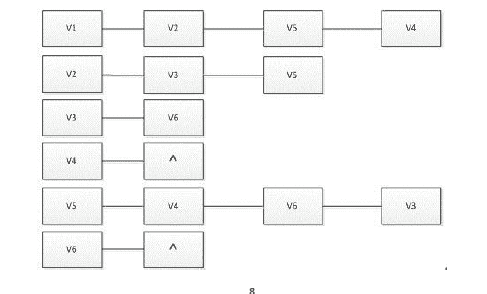

# 搜狐畅游 18 届游戏开发实习生笔试题 20170705

## 1

下图是一个邻接表，以 V1 为起点，深度优先遍历序列为 V1-V2-V3-V6-V5-V4，从 V1 开始的广度优先遍历序列为（）。 

正确答案: A   你的答案: 空 (错误)

```cpp
V1 V2 V5 V4 V3 V6
```

```cpp
V1 V2 V3 V4 V5 V6
```

```cpp
V1 V3 V5 V4 V2 V6
```

```cpp
V1 V2 V5 V3 V4 V6
```

本题知识点

Java 工程师 游戏研发工程师 搜狐畅游 2017

## 2

有这样一个类：class Eye{public:void Look(void);};现在希望定义一个 Head 类，也想实现 Look 的功能，应该使用（）方法，实现代码重用。

正确答案: B   你的答案: 空 (错误)

```cpp
继承
```

```cpp
组合
```

```cpp
模板
```

```cpp
过滤
```

本题知识点

Java 工程师 游戏研发工程师 搜狐畅游 2017

## 3

用某种排序方法对关键字序列（25,84,21,47,15,27,68,35,20）进行排序，序列的变化情况采样如下：20,15,21,25,47,27,68,35,8415,20,21,25,35,27,47,68,8415,20,21,25,27,35,47,68,84 请问采用的是以下哪种排序算法？（）

正确答案: D   你的答案: 空 (错误)

```cpp
选择排序
```

```cpp
希尔排序
```

```cpp
归并排序
```

```cpp
快速排序
```

本题知识点

Java 工程师 游戏研发工程师 搜狐畅游 2017

## 4

假设某算法的计算时间可用递推关系式 T(n)=2T(n/2)+n 表示，则该算法的时间复杂度为（）。

正确答案: B   你的答案: 空 (错误)

```cpp
O(logn)
```

```cpp
O(n*logn)
```

```cpp
O(n)
```

```cpp
O(n²)
```

本题知识点

Java 工程师 游戏研发工程师 搜狐畅游 2017

## 5

初始序列为 1 8 6 2 5 4 7 3 一组数采用堆排序，当建堆（小顶堆）完毕时，堆所对应的二叉树中序遍历序列为（）

正确答案: A   你的答案: 空 (错误)

```cpp
8 3 2 5 1 6 4 7
```

```cpp
3 2 8 5 1 4 6 7
```

```cpp
3 8 2 5 1 6 7 4
```

```cpp
8 2 3 5 1 4 7 6
```

本题知识点

Java 工程师 游戏研发工程师 搜狐畅游 2017

## 6

已知下面的 class 层次,其中每一个 class 都定义有一个 default constructor 和一个 virtual destructor。

class X {...};

class A {...};

class B : public A {...};

class C : public B{...};

class D : public X, public C {...};

下面（）执行 dynamic_cast 会失败。

正确答案: C   你的答案: 空 (错误)

```cpp
A *pa = new D; X *px =<br>
dynamic_cast&lt;X*&gt;(pa)
```

```cpp
D *pd = new D; A *pa = dynamic_cast&lt;A*&gt;(pd)
```

```cpp
B *pb = new B; D *pd = dynamic_cast&lt;D*&gt;(pb)
```

```cpp
A *pa = new C; C *pc = dynamic_cast&lt;C*&gt;(pa)
```

本题知识点

Java 工程师 游戏研发工程师 搜狐畅游 2017

## 7

定义一个函数指针，指向的函数有两个 int 形参并且返回一个函数指针，返回的指针指向一个有一个 int 形参且返回 int 的函数。（）

正确答案: A   你的答案: 空 (错误)

```cpp
int (*(*F)(int, int))(int)
```

```cpp
int (*F)(int, int)
```

```cpp
int (*(*F)(int, int))
```

```cpp
*(*F)(int, int)(int)
```

本题知识点

Java 工程师 游戏研发工程师 搜狐畅游 2017

## 8

n 个顶点， m 条边的全连通图，至少去掉 1 条边才能构成一棵树。

你的答案 (错误)

1 参考答案 (1) m-n+1

本题知识点

Java 工程师 游戏研发工程师 搜狐畅游 2017

讨论

[offer 夕夕](https://www.nowcoder.com/profile/910819714)

m-(n-1) = m-n+1

编辑于 2019-07-30 22:41:58

* * *

## 9

7*7 的方格，从左下角走到右上角，最短路径前提下一共有 1 种不同路径。

你的答案 (错误)

1 参考答案 (1) 3432

本题知识点

Java 工程师 游戏研发工程师 搜狐畅游 2017

讨论

[牛客 _Pursuer](https://www.nowcoder.com/profile/786644)

既然是跟最短路径相关，那肯定应该只能向上或者向右移动。否则任何向左或者向下的移动都会造成路径不是最短。那么此时，我们发现会有 7 次向上以及 7 次向右的移动。从十四步中，选择 7 步为向上移动，那剩下的 7 步必然是向右移动了。所以不同路径数为 C（14,7）。

发表于 2019-10-21 09:05:11

* * *

## 10

设有序表中有 1000 个元素，则用二分查找元素 X 最多需要比较 1 次。假设所查找元素一定在查找序列中。

你的答案 (错误)

1 参考答案 (1) 10

本题知识点

Java 工程师 游戏研发工程师 搜狐畅游 2017

## 11

有一个数组（ 53,83,18,59,38,35 ），依次将其存储在 hash 表中，其中哈希函数为 h(k)=k%7, 如采用线性探测（每次向后查找 1 位）的方式解决冲突，则该 hash 表上查找 38,35,53 访问 hash 表的表项次数分别为 1 ， 2 ， 3 。

你的答案 (错误)

123 参考答案 (1) 5
(2) 2
(3) 1

本题知识点

Java 工程师 游戏研发工程师 搜狐畅游 2017

## 12

将 N 条长度均为 M 的有序链表进行合并，合并以后的链表也保持有序，时间复杂度为 1 。

你的答案 (错误)

1 参考答案 (1) O(N * M * logN)

本题知识点

Java 工程师 游戏研发工程师 搜狐畅游 2017

讨论

[jack_kuo](https://www.nowcoder.com/profile/9590450)

1\. 在每一个链表中取出第一个值，然后把它们放在一个大小为 N 的数组里，然后把这个数组当成 heap 建成小(大)根堆。此步骤的时间复杂度为 O(N)：N 个数构建一个堆的复杂度是 O(N)

2\. 取出堆中的最小值(也是数组的第一个值), 然后把该最小值所处的链表的下一个值放在数组的第一个位置。如果链表中有一个已经为空（元素已经都被取出），则改变 heap 的大小。此步骤的时间复杂度为 O(lg N)。

3\. 不断的重复步骤二，直到所有的链表都为空。

建堆只建一次，复杂度为 O(N)；调整堆 MN-1 次（构建的时候抽走了根结点，剩下的数目是 MN-1 个数），复杂度为(MN-1)*O(lg N)。

4.复杂度是 O(N)+(MN-1)*O(lg N)，所以复杂度为 O(MN*lg N)

在堆排序中也是一样的，总共 n 个数，需要得到 n 个有序的数，那么构建堆需要 O(n)，重建堆需要（n-1)*O(lgn)，所以总共复杂度 O(nlgn)；如果我只需要前面 k 个数有序的，那么重构堆需要 k*O(lgn)，那么总共复杂度就是 O(klgn)
 发表于 2021-04-24 16:11:29

* * *

## 13

两个线程 X 和 Y 并发执行以下代码段 , 假设 a 是全局变量 , 请列举出所有可能出现的输出结果，并分别简述每种输出结果对应的线程调度情形。

int a = 1;

void foo()

{

    ++a;

    printf(“%d”, a);

}

foo();

你的答案

本题知识点

Java 工程师 游戏研发工程师 搜狐畅游 2017

## 14

为了方便，在类的构造函数里面直接使用 memset(this,0,sizeof(*this)); 语句来初始化整个类，问  （ 1 ） 这种写法，会有哪些弊端？    （ 2 ） 具备何种特性的类可以采用这种写法？

你的答案

本题知识点

Java 工程师 游戏研发工程师 搜狐畅游 2017

## 15

已知一颗二叉树的先序遍历结果和中序遍历结果，求其后序遍历结果，请给出伪代码。

你的答案

本题知识点

Java 工程师 游戏研发工程师 搜狐畅游 2017

## 16

给定一个整数的数组，相邻的数不能同时选，求从该数组选取若干整数，使得他们的和最大，要求只能使用 o(1)的空间复杂度。请给出伪代码。

你的答案

本题知识点

Java 工程师 游戏研发工程师 搜狐畅游 2017