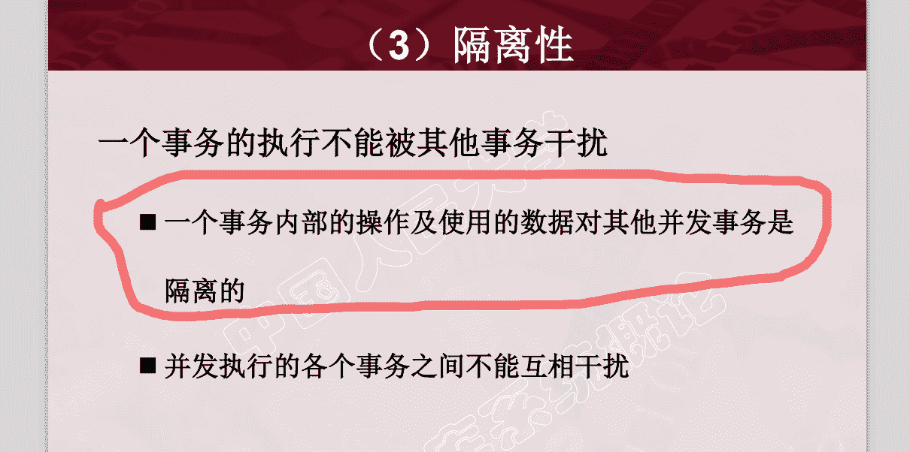

# 搜狐畅游 2017 校招游戏开发笔试题

## 1

以下哪个不是魔兽世界中联盟主城。

正确答案: D   你的答案: 空 (错误)

```cpp
铁炉堡
```

```cpp
暴风城
```

```cpp
达纳苏斯
```

```cpp
奥格瑞玛
```

本题知识点

Java 工程师 C++工程师 游戏研发工程师 搜狐畅游 2017 游戏研发工程师 搜狐畅游 2017

讨论

[迪杰斯特拉终结者](https://www.nowcoder.com/profile/841475130)

奥格瑞玛是部落的 力量与荣耀 鲜血与黎明 FOR 楼可达 哦嘎

发表于 2018-09-06 19:26:54

* * *

## 2

景天是以下仙剑几的男主角？

正确答案: B   你的答案: 空 (错误)

```cpp
仙剑二
```

```cpp
仙剑三
```

```cpp
仙剑三外传
```

```cpp
仙剑四
```

本题知识点

Java 工程师 C++工程师 常识判断 游戏研发工程师 搜狐畅游 2017

讨论

[你快乐吗](https://www.nowcoder.com/profile/5271388)

还记得一句台词：我叫景天，景天的景，景天的天

发表于 2020-10-04 21:46:53

* * *

[周嘉楠](https://www.nowcoder.com/profile/753370440)

😅

发表于 2021-09-05 12:53:12

* * *

[DaysGoBy](https://www.nowcoder.com/profile/1704845)

电视剧仙剑三

发表于 2018-09-07 08:50:31

* * *

## 3

守望先锋一共有多少个英雄？

正确答案: C   你的答案: 空 (错误)

```cpp
19
```

```cpp
20
```

```cpp
21
```

```cpp
22
```

本题知识点

Java 工程师 C++工程师 游戏研发工程师 搜狐畅游 2017 游戏研发工程师 搜狐畅游 2017

讨论

[orangeyang](https://www.nowcoder.com/profile/871292799)

21

发表于 2018-10-18 10:57:33

* * *

## 4

英雄联盟中，多少秒后才能出基地？

正确答案: C   你的答案: 空 (错误)

```cpp
5 秒
```

```cpp
10 秒
```

```cpp
15 秒
```

```cpp
20 秒
```

本题知识点

Java 工程师 C++工程师 游戏研发工程师 搜狐畅游 2017 游戏研发工程师 搜狐畅游 2017

## 5

炉石传说中，以下哪个场景尚未加入冒险模式？

正确答案: D   你的答案: 空 (错误)

```cpp
纳克萨玛斯
```

```cpp
黑石山
```

```cpp
探险者协会
```

```cpp
太阳井
```

本题知识点

Java 工程师 C++工程师 常识判断 游戏研发工程师 搜狐畅游 2017

讨论

[亚亞亚](https://www.nowcoder.com/profile/178201486)

毫无意义

发表于 2020-02-09 00:51:33

* * *

[牛客 613923580 号](https://www.nowcoder.com/profile/613923580)

三国杀中哪位武将的血量通常呈现出‘5 4 3 2 0’的趋势？😐

发表于 2020-04-12 10:41:31

* * *

## 6

皇室战争中，捐献一个野猪骑士能获得多少金币？

正确答案: D   你的答案: 空 (错误)

```cpp
5
```

```cpp
10
```

```cpp
20
```

```cpp
50
```

本题知识点

Java 工程师 C++工程师 游戏研发工程师 搜狐畅游 2017 游戏研发工程师 搜狐畅游 2017

## 7

天龙八部 3D 最高等级宝石是几级？

正确答案: C   你的答案: 空 (错误)

```cpp
8
```

```cpp
10
```

```cpp
12
```

```cpp
15
```

本题知识点

Java 工程师 C++工程师 游戏研发工程师 搜狐畅游 2017 游戏研发工程师 搜狐畅游 2017

讨论

[龙子-](https://www.nowcoder.com/profile/4240920)

认真的吗？

发表于 2018-06-17 10:36:40

* * *

## 8

网络游戏《剑灵》哪一个职业是龙族的专属职业？

正确答案: C   你的答案: 空 (错误)

```cpp
灵剑士
```

```cpp
咒术师
```

```cpp
力士
```

```cpp
拳师
```

本题知识点

Java 工程师 C++工程师 游戏研发工程师 搜狐畅游 2017 游戏研发工程师 搜狐畅游 2017

## 9

穿越火线游戏中，哪个角色是中国人？

正确答案: B   你的答案: 空 (错误)

```cpp
黑鹰
```

```cpp
飞虎队
```

```cpp
白狼
```

```cpp
审判者
```

本题知识点

Java 工程师 C++工程师 常识判断 游戏研发工程师 搜狐畅游 2017

讨论

[朝露牛客](https://www.nowcoder.com/profile/817228490)

飞虎队一听就是中国的名字

发表于 2020-04-17 11:33:18

* * *

[牛客 818904947 号](https://www.nowcoder.com/profile/818904947)

净忙着打游戏了，还真没关注过，哈哈哈

发表于 2021-10-24 10:19:28

* * *

## 10

以下属于 FPS 类型的游戏是？

正确答案: A   你的答案: 空 (错误)

```cpp
守望先锋
```

```cpp
剑侠世界
```

```cpp
枪神纪
```

```cpp
激战 2
```

本题知识点

Java 工程师 C++工程师 常识判断 游戏研发工程师 搜狐畅游 2017

讨论

[林林 july](https://www.nowcoder.com/profile/573029255)

第一人称射击类游戏,FPS(First-person shooting game)即时战略游戏（Real-Time Strategy Game），简称 RTS。游戏是策略游戏（Strategy Game）的一种。射击游戏（Shooting Game 或 Shooter game，简称为 STG）格斗游戏（Fighting Game，简称为 FTG）冒险游戏（Adventure Game），简称为 AVG 模拟游戏（Simulation Game），简称为 SIM 或 SLG 角色扮演游戏（Role-playing game），简称为 RPG。音乐游戏（Music Game 或 Rhythm Game）休闲游戏（Casual Game）在国外的反义词是“硬派游戏”（*** Game，也常译为硬核游戏）。大型多人在线网络游戏（即 Massive（Massively）Multiplayer Online Game，简称为[MMOG](https://baike.baidu.com/item/MMOG)。 

发表于 2020-03-14 11:04:52

* * *

[牛客 673044822 号](https://www.nowcoder.com/profile/673044822)

枪神纪是动作/第三人称射击（TPS）

发表于 2021-07-06 00:59:45

* * *

[半城烟沙 Quan](https://www.nowcoder.com/profile/915055451)

这也能算是常识吗？

发表于 2022-03-19 20:48:22

* * *

## 11

以下是 MOBA 类游戏术语的有？

正确答案: D   你的答案: 空 (错误)

```cpp
鬼跳
```

```cpp
刷本
```

```cpp
硬直
```

```cpp
打野
```

本题知识点

Java 工程师 C++工程师 游戏研发工程师 搜狐畅游 2017 游戏研发工程师 搜狐畅游 2017

## 12

以下术语中表示角色定位的是？

正确答案: A   你的答案: 空 (错误)

```cpp
ADC
```

```cpp
SOLO
```

```cpp
DOT
```

```cpp
GG
```

本题知识点

Java 工程师 C++工程师 游戏研发工程师 搜狐畅游 2017 游戏研发工程师 搜狐畅游 2017

## 13

以下使用了非游戏 IP 的是？

正确答案: B   你的答案: 空 (错误)

```cpp
梦幻西游手游版
```

```cpp
天龙八部
```

```cpp
奇迹暖暖
```

```cpp
刺客信条血帆
```

本题知识点

Java 工程师 C++工程师 游戏常识 游戏研发工程师 搜狐畅游 2017

讨论

[小七七七七七⑦](https://www.nowcoder.com/profile/601201918)

天龙八部的 IP 是原著小说

发表于 2021-04-21 13:35:57

* * *

[大薯蘸圣代](https://www.nowcoder.com/profile/368424703)

奇迹暖暖是啥 ip 啊 👴服了

发表于 2020-03-04 15:37:21

* * *

[柳絮纷飞弄清影](https://www.nowcoder.com/profile/532575938)

什么题啊 不是有个 天龙八部的游戏吗

发表于 2020-08-01 12:35:58

* * *

## 14

以下属于沙盒类游戏的是？

正确答案: B   你的答案: 空 (错误)

```cpp
辐射：避难所
```

```cpp
我的世界
```

```cpp
天涯明月刀
```

```cpp
天天酷跑
```

本题知识点

Java 工程师 C++工程师 游戏常识 游戏研发工程师 搜狐畅游 2017

讨论

[莫西希](https://www.nowcoder.com/profile/266320136)

是由沙盘游戏演变而来，代表我的世界、DayZ

发表于 2020-04-01 21:02:33

* * *

[Contessia](https://www.nowcoder.com/profile/321435540)

天天酷跑》是 rpg

发表于 2020-04-10 11:35:15

* * *

## 15

以下游戏中属于竞技类游戏的是？

正确答案: A   你的答案: 空 (错误)

```cpp
炉石传说
```

```cpp
奇异人生
```

```cpp
全民飞机大战
```

```cpp
兽人必须死
```

本题知识点

Java 工程师 C++工程师 游戏研发工程师 搜狐畅游 2017 游戏研发工程师 搜狐畅游 2017

## 16

以下属于电竞赛事的是？

正确答案: C   你的答案: 空 (错误)

```cpp
CJ
```

```cpp
E3
```

```cpp
LPL
```

```cpp
GDC
```

本题知识点

Java 工程师 C++工程师 游戏常识 游戏研发工程师 搜狐畅游 2017

讨论

[大景](https://www.nowcoder.com/profile/935929847)

 1.  ChinaJoy，正式名称中国国际数码互动娱乐展览会，是继 E3 电子娱乐展、东京电玩展、科隆国际游戏展、台北国际电玩展之后的又一同类型互动娱乐展，尤以网络游戏为主。展会 2004 年第一届在北京展览馆举行，从第二届起每年在上海新国际博览中心举行。
2.  E3 电子娱乐展，是全球电子游戏产业最大的年度商业化展览，也是第一大的游戏大会，由娱乐软件协会主办。展览只对电子游戏产业圈内人士及记者开放，并且规定 18 岁以上才能参观。2017 年首度开放给大众，有超过 15000 名的参与者。 E3 近几年一般于 6 月第 3 周在美国洛杉矶的洛杉矶会展中心举办。
3.  LPL(League of Legends Pro League): 英雄联盟职业联赛，简称 LPL，是《英雄联盟》中国大陆地区的顶级职业联赛。 英雄联盟职业联赛目前共有 17 支队伍参与，每年进行春季赛和夏季赛两次联赛，每次联赛分为常规赛、季后赛两部分。
4.  GDC(Game Developers Conference): 游戏开发者大会是规模最大的游戏开发者年度专业性质会议与展览，提供游戏开发者间的技术交流、获取灵感以及交友联谊平台。GDC 包含展览、联谊活动、奖项颁发，以及一系列的技术交流、教学，和有业界专家主持涵盖游戏编程、设计、音响、后制、美术与商业化和管理主题的圆桌会议。 

发表于 2020-11-17 07:26:43

* * *

[Contessia](https://www.nowcoder.com/profile/321435540)

GDC（Game Developers Cnference）游戏开发者大会；

CJ（China Joy）中国国际数码互动娱乐展览会；

LPL（League of Legends Pro League）是中国大陆地区最高级别的职业联赛

编辑于 2020-04-10 11:57:56

* * *

## 17

下列游戏中属于 MMORPG 的游戏是？

正确答案: D   你的答案: 空 (错误)

```cpp
守望先锋
```

```cpp
三国杀
```

```cpp
街头篮球
```

```cpp
魔兽世界
```

本题知识点

Java 工程师 C++工程师 游戏研发工程师 搜狐畅游 2017 游戏研发工程师 搜狐畅游 2017

## 18

通常我们在 MMORPG 游戏中所说的“Tank”是指？

正确答案: C   你的答案: 空 (错误)

```cpp
远程职业
```

```cpp
刺客型职业
```

```cpp
肉盾型职业
```

```cpp
魔法输出职业
```

本题知识点

Java 工程师 C++工程师 游戏研发工程师 搜狐畅游 2017 游戏研发工程师 搜狐畅游 2017

## 19

下列名词中区别于其它三项的是？

正确答案: D   你的答案: 空 (错误)

```cpp
HP
```

```cpp
MP
```

```cpp
EXP
```

```cpp
PVP
```

本题知识点

Java 工程师 C++工程师 游戏研发工程师 搜狐畅游 2017 游戏研发工程师 搜狐畅游 2017

## 20

手游刀塔传奇是一种？

正确答案: C   你的答案: 空 (错误)

```cpp
冒险类游戏
```

```cpp
休闲类游戏
```

```cpp
卡牌类游戏
```

```cpp
动作类游戏
```

本题知识点

Java 工程师 C++工程师 游戏研发工程师 搜狐畅游 2017 游戏研发工程师 搜狐畅游 2017

## 21

在穿越火线游戏中，默认哪个键表示丢弃当前枪械？

正确答案: B   你的答案: 空 (错误)

```cpp
B
```

```cpp
G
```

```cpp
空格
```

```cpp
C
```

本题知识点

Java 工程师 C++工程师 游戏常识 游戏研发工程师 搜狐畅游 2017

讨论

[布鲁布鲁冒泡泡](https://www.nowcoder.com/profile/805954332)

左 A 背包 B 右 D 主要武器 1 前 W *** 2 后 S ** 3 走 Shift 投掷类武器 4 蹲 Ctrl C4** 5 跳 空格 帮助 F1 射击/C4** 鼠标左键 一般聊天模式 F2 武器特殊动作 鼠标右键 组队聊天模式 F3 装弹 R 画面的亮度 Home 扔掉装备 G 画面的亮度 End 以前的武器 Q 鼠标的手感 Page Up 解除** E 鼠标的手感 Page Down

发表于 2020-03-27 20:26:16

* * *

## 22

被誉为第二代卡牌的开启者，是下列哪一款游戏？

正确答案: B   你的答案: 空 (错误)

```cpp
我是 MT2
```

```cpp
刀塔传奇
```

```cpp
放开那三国
```

```cpp
少年三国志
```

本题知识点

Java 工程师 C++工程师 游戏研发工程师 搜狐畅游 2017 游戏研发工程师 搜狐畅游 2017

## 23

以下哪个不是即时战略游戏？

正确答案: A   你的答案: 空 (错误)

```cpp
英雄联盟
```

```cpp
War3
```

```cpp
星际争霸
```

```cpp
红色警戒
```

本题知识点

Java 工程师 C++工程师 游戏常识 游戏研发工程师 搜狐畅游 2017

讨论

[Contessia](https://www.nowcoder.com/profile/321435540)

即时战略游戏 RTS（AOS）

发表于 2020-04-10 04:41:07

* * *

[今天是今天的九儿](https://www.nowcoder.com/profile/501036054)

也称：多人在线战术竞技游戏就是常说的 MOBA 游戏

发表于 2020-03-18 17:25:39

* * *

[牛客 806061964 号](https://www.nowcoder.com/profile/806061964)

MOBA 类型是一个营销概念，而不是学术概念。英雄联盟严格来说应该是 DOTALIKE 或者 AOSLIKE 游戏，DATA 本来就是魔兽争霸里的一张地图，既然魔兽争霸是 RTS，为什么 DOTA 不是呢？

发表于 2021-08-20 18:04:43

* * *

## 24

以下哪个主播不是英雄联盟主播？

正确答案: D   你的答案: 空 (错误)

```cpp
55 开
```

```cpp
Miss
```

```cpp
董小飒
```

```cpp
430
```

本题知识点

Java 工程师 C++工程师 游戏常识 游戏研发工程师 搜狐畅游 2017

讨论

[迪杰斯特拉终结者](https://www.nowcoder.com/profile/841475130)

430 是我们 dota2 的主播 曾经 ti2 是 IG 的中单获得 TI 冠军

发表于 2018-09-06 19:29:16

* * *

[牛客 396106061 号](https://www.nowcoder.com/profile/396106061)

懂的人已经起立了

发表于 2021-04-28 01:21:41

* * *

[牛客 703261918 号](https://www.nowcoder.com/profile/703261918)

轮轮世界第一可爱

发表于 2020-04-26 22:24:08

* * *

## 25

PSP 上销量最多的游戏是？

正确答案: B   你的答案: 空 (错误)

```cpp
怪物猎人
```

```cpp
GTA
```

```cpp
生化危机
```

```cpp
战神
```

本题知识点

Java 工程师 C++工程师 游戏常识 游戏研发工程师 搜狐畅游 2017

讨论

[在下叶良辰本地有势力](https://www.nowcoder.com/profile/522475162)

👴🏻哭了，到底是谁还在买 gta，猎人这销量都赶不上？

发表于 2020-03-14 10:26:39

* * *

[卡咔咯咖](https://www.nowcoder.com/profile/908179179)

吐了，到底还有哪个平台不是给他爱

发表于 2020-02-24 09:32:05

* * *

[牛客 237763408 号](https://www.nowcoder.com/profile/237763408)

让我看看是谁不想玩 6！

发表于 2022-03-12 14:21:09

* * *

## 26

2016 年 1-6 月，中国游戏市场实际销售收入是？

正确答案: C   你的答案: 空 (错误)

```cpp
587.5 亿元
```

```cpp
687.5 亿元
```

```cpp
787.5 亿元
```

```cpp
887.5 亿元
```

本题知识点

Java 工程师 C++工程师 游戏研发工程师 搜狐畅游 2017 游戏研发工程师 搜狐畅游 2017

## 27

2016 年 China Joy 开幕是哪一天？

正确答案: C   你的答案: 空 (错误)

```cpp
7 月 26 日
```

```cpp
7 月 27 日
```

```cpp
7 月 28 日
```

```cpp
7 月 29 日
```

本题知识点

Java 工程师 C++工程师 常识判断 游戏研发工程师 搜狐畅游 2017

讨论

[牛客 544693960 号](https://www.nowcoder.com/profile/544693960)

百度百科答案是 2016.7.27

发表于 2020-03-31 17:47:28

* * *

## 28

亚洲最大的游戏展会是？

正确答案: B   你的答案: 空 (错误)

```cpp
亚洲游戏展
```

```cpp
东京游戏展
```

```cpp
E3 游戏展
```

```cpp
ChinaJoy
```

本题知识点

Java 工程师 C++工程师 游戏常识 游戏研发工程师 搜狐畅游 2017

讨论

[卡咔咯咖](https://www.nowcoder.com/profile/908179179)

答案有争议，国内媒体报道普遍认同 TGS 是“亚洲最具影响力游戏展”，而把“亚洲最大游戏展”名号送给了 CJ。但是你去国外看一看就不一样了，毫无疑问 TGS 无论是国际知名度还是参展规模，参展质量要远高于 CJ。

发表于 2020-02-24 08:59:07

* * *

[而上](https://www.nowcoder.com/profile/192367485)

东京电玩展(Tokyo Game Show，简称 TGS)，始办于 1996 年，是规模仅次于美国 E3 游戏展的全球第二大游戏展会，已经发展成为亚洲最大的游戏展览会，是在日本东京千叶幕张国际展览中心（幕张メッセ）举办的大型视讯游戏展览。东京电玩展的内容以各类游戏机及其娱乐软体、电脑游戏以及游戏周边产品为主。

发表于 2021-08-31 07:01:15

* * *

[如祢](https://www.nowcoder.com/profile/799379252)

秒选了 d，没想到能错

发表于 2020-03-13 17:56:08

* * *

## 29

游戏行业中经常提到渠道一次，以下哪家公司没有自主渠道？

正确答案: C   你的答案: 空 (错误)

```cpp
腾讯
```

```cpp
网易
```

```cpp
完美世界
```

```cpp
360
```

本题知识点

Java 工程师 C++工程师 游戏研发工程师 搜狐畅游 2017 游戏研发工程师 搜狐畅游 2017

## 30

在今年中国大陆 iOS 游戏畅销排行榜上，霸占榜首时间最长的是哪个游戏？

正确答案: C   你的答案: 空 (错误)

```cpp
大话西游
```

```cpp
王者荣耀
```

```cpp
梦幻西游
```

```cpp
穿越火线
```

本题知识点

Java 工程师 C++工程师 游戏研发工程师 搜狐畅游 2017 游戏研发工程师 搜狐畅游 2017

## 31

通常我们所说的“次日留存”是指？

正确答案: A   你的答案: 空 (错误)

```cpp
游戏用户次日上线率
```

```cpp
游戏用户充值率
```

```cpp
类型游戏淘汰率
```

```cpp
游戏行业优次比率
```

本题知识点

Java 工程师 C++工程师 游戏研发工程师 搜狐畅游 2017

## 32

以下哪种语言不能被用来用作游戏服务器开发？

正确答案: D   你的答案: 空 (错误)

```cpp
C
```

```cpp
C++
```

```cpp
Java
```

```cpp
CSS
```

本题知识点

Java 工程师 C++工程师 游戏研发工程师 搜狐畅游 2017 C++ C 语言

讨论

[抹茶千层](https://www.nowcoder.com/profile/414507114)

CSS 语言一般指 CSS。层叠样式表(英文全称：Cascading Style Sheets)是一种用来表现 HTML（标准通用标记语言的一个应用）或 XML（标准通用标记语言的一个子集）等文件样式的计算机语言。CSS 不仅可以静态地修饰网页，还可以配合各种脚本语言动态地对网页各元素进行格式化。

发表于 2020-08-10 18:58:50

* * *

## 33

以下哪个不是数值策划的工作内容？

正确答案: D   你的答案: 空 (错误)

```cpp
战斗系统搭建
```

```cpp
经济系统搭建
```

```cpp
技能系统搭建
```

```cpp
副本设计
```

本题知识点

Java 工程师 C++工程师 游戏研发工程师 搜狐畅游 2017

## 34

以下哪个不是剧情策划的工作内容？

正确答案: C   你的答案: 空 (错误)

```cpp
世界观搭建
```

```cpp
装备命名
```

```cpp
背包功能设定
```

```cpp
NPC 对白
```

本题知识点

Java 工程师 C++工程师 游戏研发工程师 搜狐畅游 2017

讨论

[林登](https://www.nowcoder.com/profile/817735429)

c

发表于 2020-05-11 20:49:42

* * *

## 35

下面那款引擎在 IOS，Android 跨平台移植最方便？

正确答案: D   你的答案: 空 (错误)

```cpp
Unreal3
```

```cpp
CE3
```

```cpp
Cocos
```

```cpp
Unity
```

本题知识点

Java 工程师 C++工程师 游戏研发工程师 搜狐畅游 2017

## 36

游戏中的师徒系统，其主要作用是什么？

正确答案: C   你的答案: 空 (错误)

```cpp
推动玩家在游戏内的消费
```

```cpp
促进玩家在游戏中参加更多的活动
```

```cpp
加快玩家脱离新手阶段，融入游戏中
```

```cpp
提升作为师傅的玩家的成就感
```

本题知识点

Java 工程师 C++工程师 游戏研发工程师 搜狐畅游 2017

## 37

以下哪种格式的图片不能用于特效制作？

正确答案: A   你的答案: 空 (错误)

```cpp
GIF 格式
```

```cpp
JPG 格式
```

```cpp
BMP 格式
```

```cpp
TGA 格式
```

本题知识点

Java 工程师 C++工程师 游戏研发工程师 搜狐畅游 2017 游戏研发工程师 搜狐畅游 2017

## 38

UE 的全称是什么？

正确答案: A   你的答案: 空 (错误)

```cpp
User Experience
```

```cpp
United Electric
```

```cpp
Unforced error
```

```cpp
User Equipment
```

本题知识点

Java 工程师 C++工程师 游戏研发工程师 搜狐畅游 2017 游戏研发工程师 搜狐畅游 2017

## 39

下列游戏中，不属于搜狐畅游的是？

正确答案: C   你的答案: 空 (错误)

```cpp
天龙八部
```

```cpp
鹿鼎记
```

```cpp
天下贰
```

```cpp
大话水浒
```

本题知识点

Java 工程师 C++工程师 游戏研发工程师 搜狐畅游 2017 游戏研发工程师 搜狐畅游 2017

讨论

[一个可耐的内推官](https://www.nowcoder.com/profile/5341138)

c

发表于 2019-08-08 18:00:06

* * *

[真的懒得起](https://www.nowcoder.com/profile/893407771)

天下贰 网易的

发表于 2019-03-28 19:32:11

* * *

## 40

以下哪个是畅游的价值观？

正确答案: A   你的答案: 空 (错误)

```cpp
正直，激情，好学，创新，用户导向，合作
```

```cpp
正直，激情，好学，创新，用户导向，团结
```

```cpp
正直，激情，好学，创新，用户导向，分享
```

```cpp
正直，激情，好学，创新，用户导向，热爱游戏
```

本题知识点

Java 工程师 C++工程师 游戏研发工程师 搜狐畅游 2017 游戏研发工程师 搜狐畅游 2017

## 41

对于下面 char (*p)[16]的声明描述正确的一项是（）

正确答案: C   你的答案: 空 (错误)

```cpp
p 是长度为 16 的字符指针数组
```

```cpp
p 是包含 16 个字符的字符串
```

```cpp
p 是指向长度为 16 的字符数组的指针
```

```cpp
p 是长度为 16 的字符数组
```

本题知识点

Java 工程师 C++工程师 游戏研发工程师 搜狐畅游 2017 C++ C 语言

讨论

[牛客 782540893 号](https://www.nowcoder.com/profile/782540893)

char (*p)[5];代表了一个指针，这个指针是指向一个大小为 10 的字符数组； 与 char *p[5]的区别是，char *p[5]代表了一个大小为 10 的数组，数组的每个元素都是一个字符指针。

发表于 2021-07-02 22:00:18

* * *

[silva_david](https://www.nowcoder.com/profile/430295519)

举例：char (*p)[10];代表了一个指针，这个指针是指向一个大小为 10 的字符数组；
需要与 char *p[10];区分开来，这个代表了一个大小为 10 的数组，数组的每个元素都是一个字符指针。

发表于 2022-01-22 20:49:18

* * *

[牛客 355814770 号](https://www.nowcoder.com/profile/355814770)

括号中有指针表示，这个变量就是指针类型

发表于 2021-03-01 11:35:14

* * *

## 42

下面函数正确的是（）

正确答案: A   你的答案: 空 (错误)

```cpp
void swap(int * p,int *q)
{
        int temp;
        temp = *p;
        *p = *q;
        *q = temp;
}
```

```cpp
void swap(int* p,int* q)
{
        int* temp;
        *temp = *p;
        *p = *q;
        *q = *temp;
}
```

```cpp
void swap(int* p,int* q)
{
        int* temp;
        temp = p;
        p = q;
        q = temp;
}
```

```cpp
void swap(int p, intq)
{
int temp;
temp = p;
p = q;
q = temp;
}
```

本题知识点

Java 工程师 C++工程师 游戏研发工程师 搜狐畅游 2017 C++ C 语言

讨论

[Libenze](https://www.nowcoder.com/profile/596435046)

对于 D：不用指针，又没有返回值，函数没有意义 B 和 C 我参考 C++ prime plus 中 4.7.2 节：在 C++创建指针时，计算机将分配用来存储地址的内存，但不会分配用来存储指针所指向的数据的内存。本题中 temp 这个指针的指向是不确定的，这种错误可能引发一些最隐匿、最难以追踪的 bug。一定要在*之前将指针初始化成一个确定、适当的地址。

编辑于 2021-03-07 21:50:50

* * *

[奋斗小强吧](https://www.nowcoder.com/profile/324744938)

不明白这题到底要表达的是什么意思

发表于 2020-09-01 15:41:10

* * *

[贪嗔痴慢疑](https://www.nowcoder.com/profile/57247130)

    只交换形参不能改变实参的值，需要通过指针来间接修改实参的值。

发表于 2020-12-23 18:49:35

* * *

## 43

#define DOUBLE(x) x+xi = 5*DOUBLE(5)； i 是多少？

正确答案: C   你的答案: 空 (错误)

```cpp
50
```

```cpp
25
```

```cpp
30
```

```cpp
125
```

本题知识点

Java 工程师 C++工程师 游戏研发工程师 搜狐畅游 2017 游戏研发工程师 搜狐畅游 2017

## 44

有以下一段代码：

```cpp
class A
{
public:
    A() {}
    ~A() {}
};
class B : public A
{
public:
    B() {}
    ~B() {}
public:
    int a;
};
```

若：x=sizeof(A),y=sizeof(B)，请问 x，y 的值分别是多少？

正确答案: B   你的答案: 空 (错误)

```cpp
x=0，y=4
```

```cpp
x=1，y=4
```

```cpp
x=1，y=5
```

```cpp
x=4，y=8
```

本题知识点

Java 工程师 C++工程师 游戏研发工程师 搜狐畅游 2017 C++

讨论

[牛客 175879381 号](https://www.nowcoder.com/profile/175879381)

空类中编译器插入一个 char 类型，用来标识这个 class 不同实体在内存中配置独一无二地址，故空类大小 1 字节

发表于 2020-09-11 10:42:42

* * *

[奋斗小强吧](https://www.nowcoder.com/profile/324744938)

空类中编译器插入一个 char 类型，用来标识这个 class 不同实体在内存中配置独一无二地址，故空类大小 1 字节

发表于 2020-08-22 14:48:17

* * *

[312 的 LG](https://www.nowcoder.com/profile/502652541)

一个空类型，sizeof 是 1 字节，一个整型变量的大小为 4 个字节

发表于 2020-08-07 18:52:02

* * *

## 45

有以下一段代码：

```cpp
void fun(char a[100])
{
 printf("%d", sizeof(a));
}
void main()
{
 char a[100] = "hello world";
 printf("%d", sizeof(a));
 fun(a);
}
```

请问程序最后输出结果是？

正确答案: D   你的答案: 空 (错误)

```cpp
11100
```

```cpp
12100
```

```cpp
100100
```

```cpp
1004
```

本题知识点

Java 工程师 C++工程师 游戏研发工程师 搜狐畅游 2017 游戏研发工程师 搜狐畅游 2017

讨论

[ustczxd](https://www.nowcoder.com/profile/8423936)

作为函数参数，数组名退化为指针

发表于 2018-10-21 20:31:13

* * *

## 46

有以下一段代码

```cpp
#include <stdio.h>
char* fun() {
    char a[] = "hello world";
    return a + 6;
}
int main() {
    printf("%s", fun());
    return 0;
}
```

请问程序最后输出结果是（）

正确答案: C   你的答案: 空 (错误)

```cpp
world
```

```cpp
hello world
```

```cpp
结果未知或者程序崩溃
```

```cpp
程序崩溃
```

本题知识点

C++工程师 游戏研发工程师 搜狐畅游 2017 C 语言

讨论

[杨海泉](https://www.nowcoder.com/profile/2217520)

因为这里 a 指的是栈上的存储区，申请的内存在函数结束的时候就会被收回，因此不能返回。而 char* p = "hello world"就可以！！！，因为这里指的是常量内存区。

发表于 2018-06-21 23:01:48

* * *

[HSTC_XIAOZEKAI](https://www.nowcoder.com/profile/916023699)

数组 a 具有自动存储期限，C 语言中函数不能返回具有自动存储期限的指针，因为具有自动存储期限的变量在其作用域结束后就不存在了，进行操作会导致未定义的行为。

发表于 2022-03-21 11:19:52

* * *

[牛壮壮](https://www.nowcoder.com/profile/764544521)

数组是在栈上创建的，还来不及返回就还给操作系统了

发表于 2021-12-03 09:21:53

* * *

## 47

关于类成员函数的重载的说法错误的是？

正确答案: C   你的答案: 空 (错误)

```cpp
相同的范围
```

```cpp
函数名字相同
```

```cpp
参数相同
```

```cpp
virtual 关键字可有可无
```

本题知识点

Java 工程师 C++工程师 游戏研发工程师 搜狐畅游 2017 C++

讨论

[MarkOut](https://www.nowcoder.com/profile/1032465)

成员函数被重载的特征：

（1）相同的范围（在同一个类中）；

（2）函数名字相同；

（3）参数不同；

（4）virtual 关键字可有可无。

覆盖是指派生类函数覆盖基类函数，特征是：

（1）不同的范围（分别位于派生类与基类）；

（2）函数名字相同；

（3）参数相同；

（4）基类函数必须有 virtual 关键字。

发表于 2021-03-07 12:47:44

* * *

[牛客 737721305 号](https://www.nowcoder.com/profile/737721305)

参数类型吧

发表于 2020-08-18 22:43:01

* * *

## 48

对于下面的代码

```cpp
int i = (j = 4, k = 8, l = 16, m = 32);
printf("%d", i);
```

的输出是（）

正确答案: D   你的答案: 空 (错误)

```cpp
4
```

```cpp
8
```

```cpp
16
```

```cpp
32
```

本题知识点

C++工程师 游戏研发工程师 搜狐畅游 2017 C 语言

讨论

[steam_fight](https://www.nowcoder.com/profile/657092030)

逗号运算级别很低，int i = (j=4,k=8,l=16,m=32) ，加了括号就是取最后一个值，所以 i=32；如果没加加括号就该是 i=4.

发表于 2020-10-10 13:50:56

* * *

[皖甜](https://www.nowcoder.com/profile/683589956)

当一个语句是由多个被逗号运算符隔开的表达式组成时，此语句的值为最后一个表达式的值。

发表于 2020-08-30 10:00:56

* * *

## 49

有以下一段代码：

```cpp
class A
{
public:
    A()
    {
        printf("A");
    }
    ~A()
    {
        printf("~A");
    }
    void B()
    {
        printf("B");
    }
};
int main()
{
    A* a = (A*)malloc(sizeof(A));
    a->B();
    free(a);
    return 0;
}
```

请问程序最后输出结果是？

正确答案: C   你的答案: 空 (错误)

```cpp
A
```

```cpp
~A
```

```cpp
B
```

```cpp
AB~A
```

本题知识点

Java 工程师 C++工程师 游戏研发工程师 搜狐畅游 2017 C++

讨论

[顶级自闭症患者](https://www.nowcoder.com/profile/4463985)

new 分为两步：1.给对象分配内存(operator new())和 malloc 等同 2.调用构造函数 delete 也是两步: 1.调用析构函数 ， 2.回收空间(如果是 malloc 就用 free 回收)题目中 :  A* a = (A*)malloc(sizeof(A)); 不是直接 new,所以只是执行了 1,因此不会调用构造函数            : free(a); 的情况相同
这题应该是在考 new/malloc   delete/free 的区别吧

发表于 2019-03-17 17:05:06

* * *

[杉杉来啦](https://www.nowcoder.com/profile/243827773)

使用 new 操作符来分配对象内存时会经历三个步骤：

第一步：调用 operator new 函数（对于数组是 operator new[]）分配一块足够大的，原始的，未命名的内存空间以便存储特定类型的对象。

第二步：编译器运行相应的**构造函数**以构造对象，并为其传入初值。

第三部：对象构造完成后，返回一个指向该对象的指针。

使用 delete 操作符来释放对象内存时会经历两个步骤：

第一步：调用对象的**析构函数**。

第二步：编译器调用 operator delete(或 operator delete[])函数释放内存空间。

**总之来说，new/delete 会调用对象的构造函数/析构函数以完成对象的构造/析构。而 malloc 则不会。**

 发表于 2020-08-19 08:26:42

* * *

[soohoo](https://www.nowcoder.com/profile/123184)

这里记住并没有通过 new 创建对象，所以就没有调用系统的构造和细狗函数。😓

发表于 2020-10-18 19:26:41

* * *

## 50

在 64 位机器上 sizeof(a) sizeof(b)大小分别是（）

```cpp
char a[10];
char *b = (char*)malloc(10*sizeof(char));
```

正确答案: A   你的答案: 空 (错误)

```cpp
10 8
```

```cpp
20 4
```

```cpp
20  8
```

```cpp
10 4
```

本题知识点

C++工程师 游戏研发工程师 搜狐畅游 2017 C++ C 语言

讨论

[杉杉来啦](https://www.nowcoder.com/profile/243827773)

b 是一个 char 型的指针，在 64 位系统中 sizeof（char*）=8 a 是一个 char 型的数组，在 64 位系统中 sizeof（char）=1，共 10 值因此为 1064 位系统中，指针占 8 个字节，32 位系统中，指针占 4 个字节。b 是一个指向用 malloc 申请的大小为 10*sizeof(char)的空间，在 64 位的系统中，指针占 8 字节 a 是一个字符数组，大小为 10*sizeof(char)，占 10 字节。

编辑于 2020-08-04 10:12:51

* * *

[理想汽车内推官](https://www.nowcoder.com/profile/6164733)

64 和 32 位系统指针大小分别为 8 和 4 字节。

发表于 2021-12-04 10:25:54

* * *

[大大大🍍](https://www.nowcoder.com/profile/70956794)

看看有多少人没带眼镜写题的，俺就是。。。。64 位机器

发表于 2021-10-08 09:44:28

* * *

## 51

静态变量通常存储在进程哪个区？

正确答案: C   你的答案: 空 (错误)

```cpp
栈区
```

```cpp
堆区
```

```cpp
全局区
```

```cpp
代码区
```

本题知识点

Java 工程师 C++工程师 游戏研发工程师 搜狐畅游 2017 游戏研发工程师 搜狐畅游 2017

## 52

对于派生类的构造函数，在定义对象时构造函数的执行顺序为？

1 ：成员对象的构造函数

2 ：基类的构造函数

3 ：派生类本身的构造函数

正确答案: D   你的答案: 空 (错误)

```cpp
123
```

```cpp
231
```

```cpp
321
```

```cpp
213
```

本题知识点

Java 工程师 C++工程师 游戏研发工程师 搜狐畅游 2017 C++

讨论

[-怦然星动`](https://www.nowcoder.com/profile/674583763)

在定义派生类的对象时，先调用父类的构造函数，在调用成员的构造函数，最后调用派生类的构造函数。可理解为“先父亲，再客人，最后自己”

发表于 2020-08-04 14:10:02

* * *

[666 的佩奇爸爸](https://www.nowcoder.com/profile/7670357)

```cpp
#include <iostream.h> 
//using namespace std;  
class C
{  
public:  
    C()
    {  
        cout << "C Construct" << endl;  
    }  
    ~C()
    {  
        cout << "C Deconstruct" << endl;  
    }  
};  

class Base 
{
public:
    Base()  
    {  
        cout << "Base Construct\n";  
    }  
    ~Base()  
    {  
        cout << "Base Destruct\n";  
    }  
};  

class Derived : public Base 
{  
private:  
    C c;  
public:  
    Derived()  
    {  
        cout << "Derived Construct\n";  
    }  

    ~Derived()  
    {  
        cout << "Derived Destruct\n";  
    }  
};  

main()  
{  
    //定义派生类对象  
    Derived obj;  
} 
/* 显示结果：
Base Construct
C Construct
Derived Construct
Derived Destruct
C Deconstruct
Base Destruct
*/
/*
答案：D。
构造函数是一种特殊的函数，用来在对象实例化时初始化对象的成员变量。构造函数具有以下特点：
1）构造函数名必须与类的名字相同，并且不能有返回值（返回值也不能为 void）。
2）每个类可以有多个构造函数。当开发人员没有提供构造函数的时候，编译器会提供一个没有
   参数、默认的构造函数，但该构造函数不会执行任何代码。如果开发人员提供了构造函数，
   那么编译器就不会再创建默认的构造函数了。
3）构造函数可以被重载，因此，一个类可以有多个构造函数。
4）构造函数的主要作用是完成对象的初始化工作。
5）构造函数不能被继承，但是构造函数能够被重载，可以使用不同的参数个数或参数类型来定义多个构造函数。
6）在类的继承关系中，当父类没有提供无参数的构造函数时，子类的构造函数中必须显式地调用父类的构造函数，
   如果父类中提供了无参数的构造函数，此时子类的构造函数就可以不显式地调用父类的构造函数，
   在这种情况下编译器会默认调用父类的无参数的构造函数。当有父类时，在实例化对象时会首先执行父类的构造函数，
   然后才执行子类的构造函数。
   在继承关系中，当定义派生类对象时，构造函数的执行顺序如下：
   基类的构造函数→对象成员的构造函数→派生类的构造函数。
   析构函数的执行顺序恰好和构造函数的执行顺序相反，
   当对象脱离其作用域时（例如对象所在的函数已调用完毕），系统会自动执行析构函数。
*/

```

发表于 2018-07-12 19:49:15

* * *

[牛客小丑 C](https://www.nowcoder.com/profile/410104169)

打个比如，自己假设为派生类，客人是成员对象，基类是父亲，那么调用构造函数视为入座吃饭，先父亲（基类）然后是客人（成员对象），最后是自己（派生类）

发表于 2021-09-04 10:00:36

* * *

## 53

```cpp
short int a[20];
sizeof(a)=
```

正确答案: B   你的答案: 空 (错误)

```cpp
20
```

```cpp
40
```

```cpp
80
```

```cpp
4
```

本题知识点

Java 工程师 C++工程师 游戏研发工程师 搜狐畅游 2017 C++ C 语言

讨论

[牛客 621706853 号](https://www.nowcoder.com/profile/621706853)

short 两个字节，数组大小就为 40 个字节

发表于 2020-11-14 16:24:13

* * *

[牛客 543663199 号](https://www.nowcoder.com/profile/543663199)

short int,看错数据类型

发表于 2020-08-05 15:46:57

* * *

[هاوتشوان](https://www.nowcoder.com/profile/699059703)

每个数组元素都是短整型一个短整型占两个字节 20 个元素就是 20*2=40

发表于 2021-04-10 08:37:02

* * *

## 54

下列程序的输出是：

```cpp
#define add(a+b) a+b
int main()
{
 printf("%d\n",5*add(3+4));
 return 0;
}
```

正确答案: D   你的答案: 空 (错误)

```cpp
23
```

```cpp
35
```

```cpp
16
```

```cpp
19
```

本题知识点

Java 工程师 C++工程师 游戏研发工程师 搜狐畅游 2017 游戏研发工程师 搜狐畅游 2017

## 55

在执行 __ 操作时，需要使用队列做辅助存储空间。

正确答案: D   你的答案: 空 (错误)

```cpp
查找哈希表
```

```cpp
深度优先搜索
```

```cpp
前序遍历二叉树
```

```cpp
广度优先搜索树
```

本题知识点

Java 工程师 C++工程师 游戏研发工程师 搜狐畅游 2017 游戏研发工程师 搜狐畅游 2017

讨论

[真的懒得起](https://www.nowcoder.com/profile/893407771)

b，c 是栈，a 没有辅助工具

发表于 2019-03-28 19:36:25

* * *

## 56

表达式 a*(b+c)-d 的后缀表达式是

正确答案: B   你的答案: 空 (错误)

```cpp
abcd*+-
```

```cpp
abc+*d-
```

```cpp
abc*+d-
```

```cpp
-+*abcd
```

本题知识点

Java 工程师 C++工程师 游戏研发工程师 搜狐畅游 2017 游戏研发工程师 搜狐畅游 2017

讨论

[CiM](https://www.nowcoder.com/profile/1518003)

通常书写的事中缀表达式：a(b+c)-d 即操作符在两个操作数中间
后缀表达式书写是操作符紧跟在两个操作符后，按照从左到右的顺序，按照括号内优先及操作符优先 的原则，在书写时去掉括号，将改写的部分作为一个操作数。
(a(bc+))d- , (此处为了方便查看过程，最内部的括号表示最先改写的部分以此向外)
后缀表达式： abc+*d-
参考链接：[`blog.csdn.net/luyafei_89430/article/details/12955691`](https://blog.csdn.net/luyafei_89430/article/details/12955691)

编辑于 2018-07-16 21:28:06

* * *

[流浪打工人](https://www.nowcoder.com/profile/8803600)

二叉树表达式

发表于 2018-05-31 21:26:15

* * *

## 57

若系统中的某子模块需要为其它模块提供访问不同数据库系统（Oracle、SQL Server、DB2 UDB 等）的功能，这些数据库系统提供的访问接口有一定的差异，但访问过程却都是相同的，例如，先连接数据库，再打开数据库，最后对数据进行查询，（ ）设计模式可抽象出相同的数据库访问过程

正确答案: D   你的答案: 空 (错误)

```cpp
外观
```

```cpp
装饰
```

```cpp
单件
```

```cpp
模板方法
```

本题知识点

Java 工程师 C++工程师 游戏研发工程师 搜狐畅游 2017

## 58

下面哪一种设计模式和其他三种设计模式的主要目的不同？

正确答案: B   你的答案: 空 (错误)

```cpp
工厂方法模式
```

```cpp
模板方法模式
```

```cpp
建造者模式
```

```cpp
单例模式
```

本题知识点

Java 工程师 C++工程师 游戏研发工程师 搜狐畅游 2017

讨论

[showtime20180727195671](https://www.nowcoder.com/profile/433271628)

工厂方法模式、建造者模式、单例模式都是创建型模式，而模板方法模式是行为型模式。

发表于 2018-09-14 22:30:16

* * *

## 59

当我们想创建一个具体的对象又不希望制定具体的类时，可以使用（）模式

正确答案: A   你的答案: 空 (错误)

```cpp
创建型
```

```cpp
结构型
```

```cpp
行为型
```

```cpp
其他选项都可以
```

本题知识点

Java 工程师 C++工程师 游戏研发工程师 搜狐畅游 2017 游戏研发工程师 搜狐畅游 2017

## 60

以下算法，不稳定的是

正确答案: A   你的答案: 空 (错误)

```cpp
快速排序
```

```cpp
基数排序
```

```cpp
归并排序
```

```cpp
冒泡排序
```

本题知识点

Java 工程师 C++工程师 游戏研发工程师 搜狐畅游 2017 游戏研发工程师 搜狐畅游 2017

## 61

冒泡排序算法的时间复杂度是多少？

正确答案: B   你的答案: 空 (错误)

```cpp
O(n)
```

```cpp
O(n²)
```

```cpp
O(1)
```

```cpp
O(logn)
```

本题知识点

Java 工程师 C++工程师 游戏研发工程师 搜狐畅游 2017 游戏研发工程师 搜狐畅游 2017

## 62

下面的程序是哪种排序？

```cpp
public class App {
    public static void main(String[] args) {
        int [] a = {4,2,1,6,3,6,0,-5,1,1};
        int i,j;
        int low,high,mid;
        int temp;
        for(i=1;i<10;i++){
            temp=a[i];
            low=0;
            high=i-1;
            while(low<=high){
                mid=(low+high)/2;
                if(a[mid]>temp){
                    high=mid-1;
                }else{
                    low=mid+1;
                }
            }
            for(j=i-1;j>high;j--){
                a[j+1]= a[j];
                a[high+1] = temp;
            }
            for(i=0;i<10;i++){
                System.out.println(a[i]);
            }
        }
    }
}
```

正确答案: D   你的答案: 空 (错误)

```cpp
归并排序
```

```cpp
快速排序
```

```cpp
希尔排序
```

```cpp
二分法排序
```

本题知识点

Java 工程师 C++工程师 游戏研发工程师 搜狐畅游 2017 游戏研发工程师 搜狐畅游 2017

## 63

15 瓶试剂中有一瓶有毒，用小白鼠测试，每个测试 4 小时之后才能出结果。现在只有 4 个小时的时间。问最少需要（）只小白鼠测试

正确答案: B   你的答案: 空 (错误)

```cpp
3
```

```cpp
4
```

```cpp
10
```

```cpp
16
```

本题知识点

Java 工程师 C++工程师 游戏研发工程师 搜狐畅游 2017 游戏研发工程师 搜狐畅游 2017

讨论

[SCurry](https://www.nowcoder.com/profile/7573161)

四种。具体解析 请查看类似题目： [`www.nowcoder.com/questionTerminal/a09c0eecbf684b0cba2ad0be32b7988e`](https://www.nowcoder.com/questionTerminal/a09c0eecbf684b0cba2ad0be32b7988e)大同小异，几乎一样。

发表于 2018-06-11 19:19:02

* * *

[流浪打工人](https://www.nowcoder.com/profile/8803600)

有趣有趣~

发表于 2018-05-31 21:33:08

* * *

## 64

排序方法中，将整个无序序列分割成若干小的子序列并分别进行插入排序的方法，称为

正确答案: A   你的答案: 空 (错误)

```cpp
希尔排序
```

```cpp
冒泡排序
```

```cpp
插入排序
```

```cpp
选择排序
```

本题知识点

Java 工程师 C++工程师 游戏研发工程师 搜狐畅游 2017 游戏研发工程师 搜狐畅游 2017

## 65

下列程序段的时间复杂度是 ______。

```cpp
int count=0;
for(int k=1;k<=n;k*=2)
{
    for(intj=1;j<=n;j++)
    {
        count++;
    }
}
```

正确答案: C   你的答案: 空 (错误)

```cpp
O(log2n)
```

```cpp
O(n)
```

```cpp
O(nlog2n)
```

```cpp
O(n2)
```

本题知识点

Java 工程师 C++工程师 游戏研发工程师 搜狐畅游 2017 游戏研发工程师 搜狐畅游 2017

## 66

事务的隔离性是指

正确答案: A   你的答案: 空 (错误)

```cpp
一个事务内部的操作及使用的数据对并发的其他事务是隔离的
```

```cpp
事务一旦提交，对数据库的改变是永久的
```

```cpp
事务中包括的所有操作要么都做，要么都不做
```

```cpp
事务必须是使数据库从一个一致性状态变到另一个一致性状态
```

本题知识点

Java 工程师 C++工程师 游戏研发工程师 搜狐畅游 2017

讨论

[Kelliden](https://www.nowcoder.com/profile/252211911)



发表于 2019-06-05 18:58:04

* * *

## 67

Windows 系统消息调度机制是？

正确答案: C   你的答案: 空 (错误)

```cpp
指令队列
```

```cpp
指令堆栈
```

```cpp
消息队列
```

```cpp
消息堆栈
```

本题知识点

Java 工程师 C++工程师 游戏研发工程师 搜狐畅游 2017

## 68

以下哪种不是进程间通信机制？

正确答案: C   你的答案: 空 (错误)

```cpp
共享内存
```

```cpp
消息传递
```

```cpp
全局变量
```

```cpp
管道
```

本题知识点

Java 工程师 C++工程师 游戏研发工程师 搜狐畅游 2017

## 69

如果系统中有 5 台虚拟订票系统，有多个进程均需要使用两台，规定每个进程一次仅能申请一台，则至多允许（）个进程参与竞争而不会发生死锁

正确答案: C   你的答案: 空 (错误)

```cpp
2
```

```cpp
3
```

```cpp
4
```

```cpp
5
```

本题知识点

Java 工程师 C++工程师 游戏研发工程师 搜狐畅游 2017 游戏研发工程师 搜狐畅游 2017

## 70

同一进程下的线程可以共享（）

正确答案: B   你的答案: 空 (错误)

```cpp
stack
```

```cpp
data section
```

```cpp
register set
```

```cpp
thread ID
```

本题知识点

Java 工程师 C++工程师 游戏研发工程师 搜狐畅游 2017 游戏研发工程师 搜狐畅游 2017

讨论

[小萝卜的菠萝](https://www.nowcoder.com/profile/9728945)

b

发表于 2018-12-10 22:01:39

* * *

## 71

已知一组记录的排序码为(45,78,56,38,39,81,99,24),写出对其进行快速排序的每一次的划分结果。

你的答案

本题知识点

Java 工程师 C++工程师 游戏研发工程师 搜狐畅游 2017

讨论

[牛客 908370395 号](https://www.nowcoder.com/profile/908370395)

[24 39 38] 45 [56 81 99 78]24 [39 38] 45 56 [81 99 78]24 38 39 45 56 78 81 99

发表于 2018-11-16 11:13:13

* * *

[满楼红袖招](https://www.nowcoder.com/profile/393584353)

38,39,24,45,78,56,81,99 24,38,39,45,78,56,81,99 24,38,39,45,56,78,81,99

发表于 2019-08-04 23:13:43

* * *

## 72

  C++中使用模板类的优点是什么？

你的答案

本题知识点

Java 工程师 C++工程师 游戏研发工程师 搜狐畅游 2017

讨论

[牛客 908370395 号](https://www.nowcoder.com/profile/908370395)

便于重复使用

发表于 2018-11-16 11:13:29

* * *

## 73

1. 这是一个单例模式的实现，请丰富下面的代码，解决该模式合适的时候释放 m_pInstance 指向空间的问题。

```cpp
class CSingle
{
 public:
 static CSingle * GetInstance()
 {
 if(m_pInstance == NULL)
 m_pInstance = new CSingle();
 return m_pInstance;
 }
 private:
 CSingle(){};
 static CSingle * m_pInstance;
 // 添加代码
}
```

（2）

```cpp
class Engine
{
//
}
class Underpan
{
//
}
class Wheel
{
//
}
class Car
{
public:
 Car(Underpan u, Wheel w, Engine e)()
 {
 }
 fun()
 {
 //dosomething
 }
}
// 以下为需改造的代码
int main(int argc, char* argv[])
{
 Engine engine = Engine();
 Underpan underpan = Underpan();
 Wheel wheel = Wheel();
 ICar* car = new Car(underpan,
        wheel, engine);
 car.fun();
 if(car != NULL)
 {
 delete car;
 car = NULL;
 }
 return 0;
}
// 以上为需改造的代码
```

使用工厂方法模式将以上需改造部分的代码重写一下 

你的答案

本题知识点

Java 工程师 C++工程师 游戏研发工程师 搜狐畅游 2017