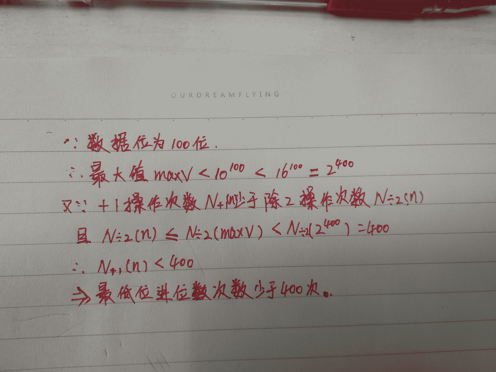

# 【2018】牛客模考（一模）编程题集合（B）

## 1

牛牛的快递到了，他迫不及待地想去取快递，但是天气太热了，以至于牛牛不想在烈日下多走一步。他找来了你，请你帮他规划一下，他最少要走多少距离才能取回快递。

本题知识点

Java 工程师 C++工程师 iOS 工程师 安卓工程师 运维工程师 前端工程师 算法工程师 PHP 工程师 图 golang 工程师 测试工程师 2018 牛客

讨论

[FlushHip](https://www.nowcoder.com/profile/7741213)

2018 年校招全国统一模拟笔试(五月场)编程题集合 - 题解

[`blog.csdn.net/FlushHip/article/details/80446002`](https://blog.csdn.net/FlushHip/article/details/80446002)

发表于 2018-05-25 02:56:45

* * *

[岚の风](https://www.nowcoder.com/profile/646602)

```cpp
//短小精悍的代码~
#include<iostream>
#include<queue>
#include<cstring>
using namespace std;
int n,m,s,t;
struct Node
{
    int t;
    int dis;
    Node(int t,int dis):t(t),dis(dis){}
    bool operator < (const Node& n)const
    {
        return dis>n.dis;
    }
};
vector<Node> V[10002];//vector 模拟边表
bool hs[10002];//访问标记
int findPath(int s,int t)//dijkstra 优先队列优化
{
    memset(hs,0,sizeof(hs));
    priority_queue<Node> Q;
    Node tmp(s,0);
    Q.push(tmp);
    while(!Q.empty())
    {
        tmp = Q.top();
        Q.pop();
        int src=tmp.t;
        int dis=tmp.dis;
        if(hs[src])//剪枝，弹出的节点已是最短距离，标记不再次进行搜索或放入队列
            continue;
        hs[src]=1;
        if(src==t)
            return dis;
        for(int i=0;i<V[src].size();++i)
        {
            int to = V[src][i].t;
            int todis=dis+V[src][i].dis;
            if(!hs[to])
            {
                Q.push(Node(to,todis));
            }
        }
    }
    return 10000000;//路径不可达
}
int main()
{
    cin>>n>>m>>s>>t;
    int a,b,c;
    while(m--)
    {
        cin>>a>>b>>c;
        V[a].push_back(Node(b,c));
    }
    int result = findPath(s,t);
    result+=findPath(t,s);
    cout<<result<<endl;
    return 0;
}

```

发表于 2018-06-04 09:56:03

* * *

[Samuelyo](https://www.nowcoder.com/profile/5146365)

```cpp
import java.util.ArrayList;
import java.util.Arrays;
import java.util.Comparator;
import java.util.List;
import java.util.PriorityQueue;
import java.util.Scanner;

public class Main {

    public static class Item {
        int index;
        int weight;

        public Item(int index, int weight) {
            this.index = index;
            this.weight = weight;
        }
    }

    public static void main(String[] args) {

        Scanner sc = new Scanner(System.in);
        while (sc.hasNext()) {
            int len = sc.nextInt();
            int times = sc.nextInt();
            int start = sc.nextInt();
            int end = sc.nextInt();
            List<List<Item>> lists = new ArrayList<List<Item>>();
            for (int i = 0; i <= len; i++) {
                lists.add(new ArrayList<Item>());
            }
            for (int i = 0; i < times; i++) {
                int s = sc.nextInt();
                int e = sc.nextInt();
                int v = sc.nextInt();
                lists.get(s).add(new Item(e, v));
            }
            int res = helper(lists, len, start, end) + helper(lists, len, end, start);
            System.out.println(res);
        }
        sc.close();

    }

    public static int helper(List<List<Item>> lists, int len, int start, int end) {
        boolean[] visited = new boolean[len + 1];
        int[] dis = new int[len + 1];
        Arrays.fill(dis, Integer.MAX_VALUE);
        dis[start] = 0;
        PriorityQueue<Item> queue = new PriorityQueue<Item>(new Comparator<Item>() {

            @Override
            public int compare(Item o1, Item o2) {
                return o1.weight - o2.weight;
            }

        });
        queue.offer(new Item(start, 0));
        while (!queue.isEmpty()) {
            Item item = queue.poll();
            int index = item.index;
            if (visited[index]) {
                continue;
            }
            visited[index] = true;
            List<Item> list = lists.get(index);
            for (int j = 0; j < list.size(); j++) {
                Item temp = list.get(j);
                if (!visited[temp.index] && dis[index] + temp.weight < dis[temp.index]) { 
                    dis[temp.index] = dis[index] + temp.weight;
                    queue.offer(new Item(temp.index, dis[index] + temp.weight));
                }
            }
        }
        return dis[end];
    }

} 
```

发表于 2018-05-26 13:01:40

* * *

## 2

牛牛得知了一些股票今天买入的价格和明天卖出的价格，他找犇犇老师借了一笔钱，现在他想知道他最多能赚多少钱。

本题知识点

Java 工程师 C++工程师 iOS 工程师 安卓工程师 运维工程师 前端工程师 算法工程师 PHP 工程师 动态规划 数组 模拟 贪心 golang 工程师 测试工程师 2018 牛客

讨论

[麦垛上的守望者](https://www.nowcoder.com/profile/4610893)

本地测试没问题，但是牛客测试，每次都提醒语法错误或者数组越界，就是给 items 数组赋值那一块，不知道为什么 public class Main {
public static void main(String[] args) {
Scanner scanner = new Scanner(System.in);
int n = scanner.nextInt();
int m = scanner.nextInt();

int[][] items = new int[n][2];  //股票价格
//int[] values = new int[n];  //收益

for(int i=0;i<n;i++){
//  items[i][0] = Integer.parseInt(scanner.next());
//  items[i][1] = Integer.parseInt(scanner.next());
items[i][0] = scanner.nextInt();
items[i][1] = scanner.nextInt();
items[i][1]=items[i][1]-items[i][0];
//values[i] = scanner.nextInt()-items[i];
scanner.nextLine();
}

int[] dp = new int[m+1];
for(int i=0;i<n;i++){
for(int j=items[i][0];j<=m;j++){
dp[j] = Math.max(dp[j], dp[j-items[i][0]]+items[i][1]);
}
}

//System.out.println(dp[m-1]);
System.out.println(dp[m]);

scanner.close();
}

}

编辑于 2018-05-25 17:01:02

* * *

[Dracary](https://www.nowcoder.com/profile/555421295)

完全背包。但牛客的输入数据有问题，有时候不足 n 行，要加个判断 import java.util.Scanner;public class Solution {
    public static void main(String[] args) {
        Scanner sc = new Scanner(System.in);
        int n = sc.nextInt();
        int m = sc.nextInt();
        if(n>0 && m>0){
            int[] buy = new int[n];
            int[] sale = new int[n];
            int[] f = new int[m+1];
            for(int i = 0; i < n && sc.hasNext(); i++){
                buy[i] = sc.nextInt();
                sale[i] = sc.nextInt();
            }
            for(int i=0;i < n;i++){
                for(int j=buy[i];j<f.length;j++) {
                    f[j] = Math.max(f[j], f[j - buy[i]] + sale[i] - buy[i]);
                }
            }
            System.out.println(f[m]);
        }
    }
}

发表于 2019-02-23 16:59:46

* * *

[Deep_Blue](https://www.nowcoder.com/profile/6794293)

```cpp

		#include <iostream>

		#include <vector>

		usingnamespacestd;

		intmain()

		{

		   vector<int> cost;

		   vector<int> profit;

		    intN, M;

		    while(cin>>N>>M)

		    {

		    for(inti = 0; i < N; i++)

		    {

		       intin, out;

		       cin>>in>>out;

		       cost.push_back(in);

		       profit.push_back(out - in);

		    }

		    vector<vector<int>> maxprofit(N, vector<int>(M + 1, 0));

		    for(inti = 0; i < N; i++)

		    {

		       maxprofit[i][0] = 0;

		    }

		    for(intj = 1; j <= M; j++)

		    {

		       if(j >= cost[0])

		       {

		          maxprofit[0][j] = maxprofit[0][j - cost[0]] + profit[0];

		       }

		    }

		    for(inti = 1; i < N; i++)

		    {

		       for(intj = 0; j <= M; j++)

		       {

		          maxprofit[i][j] = maxprofit[i - 1][j];

		          if(j >= cost[i] && maxprofit[i][j - cost[i]] + profit[i] > maxprofit[i][j])

		            maxprofit[i][j] = maxprofit[i][j - cost[i]] + profit[i];

		       }

		    }

		    if(maxprofit[N - 1][M] >= 0)

		    cout<<maxprofit[N - 1][M]<<endl;

		    else

		      cout<<0<<endl;

		    cost.clear();

		    profit.clear();

		    }

		    return0;

		}

```

发表于 2018-05-31 14:12:07

* * *

## 3

小牛牛为了向他的父母表现他已经长大独立了,他决定搬出去自己居住一段时间。

一个人生活增加了许多花费: 牛牛每天必须吃一个水果并且需要每天支付 x 元的房屋租金。

当前牛牛手中已经有 f 个水果和 d 元钱,牛牛也能去商店购买一些水果,商店每个水果售卖 p 元。

牛牛为了表现他独立生活的能力,希望能独立生活的时间越长越好,牛牛希望你来帮他计算一下他最多能独立生活多少天。

本题知识点

Java 工程师 C++工程师 iOS 工程师 安卓工程师 运维工程师 前端工程师 算法工程师 PHP 工程师 查找 *模拟 数学 golang 工程师 测试工程师 2018 牛客* *讨论

[theScavenger](https://www.nowcoder.com/profile/1689045)

```cpp
let line = readline().split(' ');
let x = +line[0];
let f = +line[1];
let d = +line[2];
let p = +line[3];

let tmp = Math.floor(d / x);
f >= tmp ? print(tmp) : print(f + Math.floor((d - x * f) / (x + p)));

```

编辑于 2019-02-24 17:30:24

* * *

[没有 offer 的大咸鱼](https://www.nowcoder.com/profile/6826169)

```cpp
import java.util.*;
public class Main{
    public static void main(String[] args){
        Scanner in =new Scanner(System.in);
        int x = in.nextInt();
        int f = in.nextInt();
        int d = in.nextInt();
        int p = in.nextInt();
        int res = 0;
        //当前没有那么多钱，房租交不起。水果够吃的情况。
        //结果等于 当前钱数 / 每天房租。
        if(d <= f * x){
            res = d/x;
        }
        //需要买水果的情况
        //res = f 天 + 剩余钱数/ （水果价格+ 房租）
        else{
            d -= f*x;
            res += f;
            res += d /(x + p);
        }

        System.out.println(res);

    }

}
```

发表于 2020-07-22 15:54:49

* * *

[ErgouJing](https://www.nowcoder.com/profile/9875411)

```cpp
#include<iostream>
using namespace std;
int main()
{
    int x, f, d, p;
    cin >> x >> f >> d >> p;
    int cnt = 0;
    if(d <= x * f)
        cnt = d / x;
    else
    {
        cnt += f;
        d -= x * f;
        cnt += d / (x + p);
    }
    cout << cnt << endl;
    return 0;
}

```

发表于 2018-09-02 16:11:42

* * *

## 4

最近天气太热了，牛牛每天都要吃雪糕。雪糕有一盒一份、一盒两份、一盒三份这三种包装，牛牛一天可以吃多盒雪糕，但是只能吃六份，吃多了就会肚子疼，吃少了就会中暑。而且贪吃的牛牛一旦打开一盒雪糕，就一定会把它吃完。请问牛牛能健康地度过这段高温期么？

本题知识点

Java 工程师 C++工程师 iOS 工程师 安卓工程师 运维工程师 前端工程师 算法工程师 PHP 工程师 模拟 穷举 数组 贪心 golang 工程师 测试工程师 2018 牛客 大数据开发工程师 信息技术岗 安全工程师 数据分析师 数据库工程师 游戏研发工程师 区块链 测试开发工程师 2019 2020

讨论

[刘东荣](https://www.nowcoder.com/profile/8648630)

> 多一个的情况下特判就可以了

```cpp
import java.util.Scanner;

public class Main {
    public static void main(String[] args) {
        Scanner scanner = new Scanner(System.in);
        int T = scanner.nextInt();
        while (T-- != 0) {
            int s = scanner.nextInt();
            int one = scanner.nextInt();
            int two = scanner.nextInt();
            int three = scanner.nextInt();
            boolean res = getResult(s, one, two, three);
            System.out.println(res ? "Yes" : "No");
        }
    }

    private static boolean getResult(int s, int one, int two, int three) {
        int sum = one + two * 2 + three * 3;
        s *= 6;
        if (sum < s) return false;
        if (sum - s == 1) {
            return one >= 1;
        }
        return true;
    }
}
```

编辑于 2019-02-21 17:56:38

* * *

[唉梅子](https://www.nowcoder.com/profile/637548027)

```cpp
#include <iostream>
#include <vector>
using namespace std;
bool fun(int n,int a,int b,int c){
    if(a + 2 * b + 3 * c < n)
        return false;
    n -= c / 2;
    n -= b / 3;
    b %= 3;
    c %= 2;
    if(n <= 0)
        return true;
    if(n * 6 - b * 2 - c * 3 > 0 && n * 6 - b * 2 - c * 3 <= a)
        return true;
    else
        return false;
}
int main(){
    int t;
    cin >> t;
    for(int i = 0;i < t;i++){
        int n,a,b,c;
        cin >> n >> a >> b >> c;
        bool flag = fun(n,a,b,c);
        if(flag)
            cout << "Yes" << endl;
        else
            cout << "No" << endl;
    }
    return 0;
}
</vector></iostream>
```

发表于 2019-07-23 22:17:24

* * *

[zevyu](https://www.nowcoder.com/profile/2361451)

```cpp

	#include <iostream>

	#include <vector>

	using namespace std;

	int main()

	{

	int T,N,A,B,C;

	cin>>T;

	for(int i=0;i<T;i++)

	{

	cin>>N>>A>>B>>C;

	N=N-B/3-C/2;

	B%=3;

	C%=2;

	if(N<=0)cout<<"Yes"<<endl;

	else if((A+B*2+3*C<6*N)||((A+B*2+3*C>=6*N)&&(A==0)))cout<<"No"<<endl;

	else cout<<"Yes"<<endl;

	}

	return 0;

	}

```

编辑于 2018-05-28 20:42:55

* * *

## 5

牛牛在地上捡到了一个手套，他带上手套发现眼前出现了很多个小人，当他打一下响指，这些小人的数量就会发生以下变化：如果小人原本的数量是偶数那么数量就会变成一半，如果小人原本的数量是奇数那么数量就会加一。现在牛牛想考考你，他要打多少次响指，才能让小人的数量变成 1。

本题知识点

Java 工程师 C++工程师 前端工程师 算法工程师 PHP 工程师 golang 工程师 iOS 工程师 安卓工程师 运维工程师 测试工程师 2018 牛客 大数据开发工程师 信息技术岗 安全工程师 数据分析师 数据库工程师 游戏研发工程师 区块链 测试开发工程师 2019 2020

讨论

[biamgo](https://www.nowcoder.com/profile/809426)

```cpp
n = input()
s = bin(n)[2:]
ans = len(s) - 1 + s.strip("0").count("0")
if s.count("1") > 1:
    ans += 2
print ans

```

编辑于 2018-08-02 20:07:54

* * *

[zevyu](https://www.nowcoder.com/profile/2361451)

#include <iostream>#include<vector>

using namespace std;
int main()
{
uint32_t N[128] = { 0 };
char temp;
int begin = 0, end = 0, res = 0;
while (scanf("%c", &temp))
{
if (temp == '\n')
break;
N[end] = temp - '0';
end++;
}
while (!(begin == end - 1 && N[end - 1] == 1))
{
if (N[end - 1] & 1)
{
N[end - 1]++;
res++;
}
int flag = 0, tempV = 0;
res++;
for (int i = begin; i < end; i++)
{
tempV = N[i] + flag * 10;
flag = tempV & 1;
N[i] = tempV >> 1;
}
if (N[begin] == 0)begin++;
}
cout << res;
return 0;
}关于+1 进位时只在最低位进位，下图大致计算了进位次数，可以保证最低位不会溢出。

编辑于 2018-06-25 09:19:03

* * *

[为啥要起名字](https://www.nowcoder.com/profile/1833472)

while True:
    try:
        num=int(raw_input().strip())
        if num==1:
            print(0)
        else:
            count=0
            while True:
                if num%2==0:
                    num=num//2
                    count+=1
                else:
                    num+=1
                    count+=1
                if num==1:
                    break
            print(count)
    except:
        break

发表于 2018-05-28 09:39:39

* * *</iostream>*