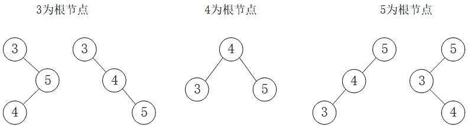

# 网易 2018 校园招聘 Android 开发工程师笔试卷

## 1

Android 中经常会使用到一些数据结构,下列说法错误的是

正确答案: B   你的答案: 空 (错误)

```cpp
HashMap 以 K,V 的方式存储数据,但存储数据是无序的
```

```cpp
ArrayMap 通过 key 的二分查找法查找 value,如果执行 remove 和 clear 后,会对数据进行收缩,以节约空间,因此 ArrayMap 比较适合数据量较大的数据场景
```

```cpp
SparseArray 内部实现了一个矩阵压缩算法,但 key 只能是 Integer 和 Long 类型.在一些 key 需要是 Integer 和 Long 类型,且数据量相对较小的场景下, SparseArray 的性能最优
```

```cpp
TreeMap 中所有的 key 都会保持着固定的顺序,在某些需要顺序存储数据的场景下,TreeMap 比较适用
```

本题知识点

网易 安卓工程师 2018

讨论

[_Jockey](https://www.nowcoder.com/profile/547803)

arrayMap 不适合数据量较大的场景

发表于 2018-06-01 10:56:25

* * *

## 2

关于 ListView 与 RecyclerView 下列说法错误的是

正确答案: B   你的答案: 空 (错误)

```cpp
RecyclerView 必须使用 ViewHolder 来绑定 view 对象,而 listview 不是必须.
```

```cpp
RecyclerView 通过 LayoutManager 可以实现更多丰富的布局如:瀑布流,网格展示等.而 Listview 的 LayoutManager 则只能实现纵向滑动
```

```cpp
RecyclerView 提供了 ItemAnimator 可以轻松实现 item 的添加和 remove 动画.
```

```cpp
Recycler 实现 itme 之间的的间隔符必须使用 ItemDecoration,这一点相对 listview 比较复杂
```

本题知识点

网易 安卓工程师 安卓工程师 网易 2018

讨论

[牛客 6481049 号](https://www.nowcoder.com/profile/6481049)

因为 ListView 没有[LayoutManager](https://link.zhihu.com/?target=https%3A/developer.android.com/reference/android/support/v7/widget/RecyclerView.LayoutManager.html)？

发表于 2018-05-28 20:22:46

* * *

[孙大硕](https://www.nowcoder.com/profile/7749194)

难道能实现横向滑动吗

发表于 2018-05-26 16:48:50

* * *

## 3

Android 开发中经常会遇到对象序列化的问题,以下说法正确的是

正确答案: B   你的答案: 空 (错误)

```cpp
Parcelable 并不是 Android 特有的序列化方式.
```

```cpp
Parcelable 在内存开销方面比 Serializable 小,所以在内存传输时,推荐使用.
```

```cpp
Parcelable 可以做持久化存储,兼容性也比 Serializable 稳定
```

```cpp
不需要引入 Serializable 接口,任何类其实都可以使用 Transient 关键字对部分对需要的字段进行序列化
```

本题知识点

网易 安卓工程师 2018

## 4

在主线程中调用 init()方法,下列哪个选项会导致 ANR?

正确答案: B   你的答案: 空 (错误)

```cpp
<pre class="prettyprint">public void init(){
        mHandler.sendEmptyMessageDelayed(0,1000);
}
    Handler mHandler=new Handler(){
        @Override
        public void dispatchMessage(Message msg) {
            super.dispatchMessage(msg);
            mHandler.sendEmptyMessageDelayed(0,1000);
        }
    }
</pre> <div>  <br> </div> <br>
```

```cpp
<pre class="prettyprint">public void init() {
    while (true){
        try {
                Thread.sleep(10000);
        }catch (Exception e) {
              e.printStackTrace();
        }           
     }
}
</pre> <div>  <br> </div> <br>
```

```cpp
<pre class="prettyprint">public void init() {
        Toast myToast=Toast.makeText(this,&quot;hello&quot;,Toast.LENGTH_SHORT);
        for (int i = 0; i &lt; 10000; i++) {
            myToast.show();
        }
} 
</pre> <div>  <br> </div>
```

```cpp
<pre class="prettyprint">TextView mTextview;
public void init() {
        mTextview=(TextView)findViewById(R.id.textview);
        for (int i = 0; i &lt; 10000; i++) {
            mTextview.setText(i+&quot;&quot;);
        }
}
</pre> <div>  <br> </div> <br>
```

本题知识点

网易 安卓工程师 2018

## 5

在某些场景下我们往往需要使用.9 图来实现背景的无限拓展与延伸下列关于.9 图说法正确的是

正确答案: A   你的答案: 空 (错误)

```cpp
.9 图处理中,图片的上方和左边为拉伸区域,右边和下面为显示内容区域
```

```cpp
.9 原图可以使用带纹理的图片,纹理会以重复出现的方式延伸
```

```cpp
.9 无法处理带尖角的图片,如果此图拉伸,尖角会变圆
```

```cpp
.9 处理完的图片,大小会有所减小
```

本题知识点

网易 安卓工程师 2018

讨论

[仟掰度](https://www.nowcoder.com/profile/455526648)

口诀：右下放，左上伸右下-文字的放置区域
左上-图片的拉伸区域

发表于 2019-07-23 10:58:07

* * *

## 6

下面关于注册静态广播正确的方法是

正确答案: A   你的答案: 空 (错误)

```cpp
&lt;receiver android:name=&quot;myBroadcast&quot;&gt;<br>&lt;intent-filter&gt;<br>&lt;action android:name=&quot;android.provider.action. myBroadcast &quot;&gt;&lt;action&gt;<br>&lt;/intent-filter&gt;<br>&lt;/receiver&gt;
```

```cpp
&lt;receiver android:name=&quot; myBroadcast &quot;&gt;<br>&lt;intent-filterandroid:name=&quot;android.provider.action. myBroadcast &quot; &gt;&lt;/intent-filter&gt;<br>&lt;/receiver&gt;
```

```cpp
&lt;receiver android:name=&quot; myBroadcast &quot;&gt;<br>&lt;action android:name=&quot;android.provider.action. myBroadcast &quot;&gt;&lt;action&gt;<br>&lt;/receiver&gt;
```

```cpp
&lt;intent-filter&gt;<br>&lt;receiver android:name=&quot; myBroadcast &quot;&gt;<br>&lt;action android:name=&quot;android.provider.action. myBroadcast &quot;&gt;&lt;action&gt;<br>&lt;/receiver&gt;<br>&lt;/intent-filter&gt;
```

本题知识点

网易 安卓工程师 2018

## 7

触摸事件对应的是 MotionEvent 类，以下不属于 MotionEvent 事件类型的是？

正确答案: B   你的答案: 空 (错误)

```cpp
ACTION_DOWN
```

```cpp
ACTION_CLICK
```

```cpp
ACTION_MOVE
```

```cpp
ACTION_UP
```

本题知识点

网易 安卓工程师 2018

## 8

Android 的 UI 管理系统的层级关系，由外到内，正确的包含关系是？

正确答案: C   你的答案: 空 (错误)

```cpp
PhoneWindow, Activity, DecorView, ContentView
```

```cpp
Activity, DecorView, PhoneWindow, ContentView
```

```cpp
Activity, PhoneWindow, DecorView, ContentView
```

```cpp
Activity, DecorView, ContentView, PhoneWindow
```

本题知识点

网易 安卓工程师 安卓工程师 网易 2018

## 9

移动端 APP 几乎都是联网的，通过网络请求从服务端获取数据，网络的延迟会对 APP 的性能产生较大的影响，以下哪种不是优化网络的措施？

正确答案: B   你的答案: 空 (错误)

```cpp
合并网络请求，减少请求接口。
```

```cpp
加快轮询，减少轮询的间隔时间。
```

```cpp
离线缓存。
```

```cpp
压缩数据大小
```

本题知识点

网易 安卓工程师 2018

## 10

Broadcast 是一种广泛运用的，在应用程序之间传输信息的机制，以下对广播描述有误的一项是？

正确答案: C   你的答案: 空 (错误)

```cpp
普通广播是完全异步的，通过 Context 的 sendBroadcast()函数来发送，消息传递的效率比较高，但所有的 receivers（接收器）的执行顺序不确定。
```

```cpp
有序广播通过 Context.sendOrderedBroadcast()来发送，所有的广播接收器按照优先级依次执行。
```

```cpp
本地广播是全局的，所有应用程序都可以接收到。
```

```cpp
sticky 广播通过 Context.sendStickyBroadcast()函数发送，用此函数发送的广播会一直滞留，当有匹配此广播的接收器被注册后，该广播接收器就会受到此条广播。
```

本题知识点

网易 安卓工程师 2018

## 11

View 测量绘制过程中需要依赖 MeasureSpec,而 MeasureSpec 的值由 specSize 和 specMode 共同组成，以下哪种类型不属于 specMode？

正确答案: B   你的答案: 空 (错误)

```cpp
EXACTLY。
```

```cpp
AT_LEAST。
```

```cpp
AT_MOST。
```

```cpp
UNSPECIFIED。
```

本题知识点

网易 安卓工程师 2018

## 12

java 中，关于 synchronized 关键字的说法错误的是？（ ）

正确答案: D   你的答案: 空 (错误)

```cpp
可以修饰类的静态方法
```

```cpp
可以修饰类的非静态方法
```

```cpp
可以修饰某一段代码块
```

```cpp
可以修饰类的属性
```

本题知识点

网易 安卓工程师 安卓工程师 网易 2018

## 13

设一组初始关键字记录关键字为(17,13,10,16,19,34,43,8),则以开头 17 为基准记录的一趟快速排序结束的结果为()

正确答案: B   你的答案: 空 (错误)

```cpp
13,8,10,16,17,34,43,19
```

```cpp
8,13,10,16,17,34,43,19
```

```cpp
8,13,10,16,17,43,34,19
```

```cpp
8,13,10,17,16,43,34,19
```

本题知识点

网易 安卓工程师 安卓工程师 网易 2018

## 14

某二叉查找树的每个节点存放一个整数,中序遍历该树得到的序列为 3,4,5，则该树的画法有多少种情况?

正确答案: C   你的答案: 空 (错误)

```cpp
3
```

```cpp
4
```

```cpp
5
```

```cpp
6
```

本题知识点

网易 安卓工程师 安卓工程师 网易 2018

讨论

[仟掰度](https://www.nowcoder.com/profile/455526648)



发表于 2019-07-23 15:37:10

* * *

## 15

以下关于无向正权图的最短路和最小生成树的说法正确的有()

正确答案: C   你的答案: 空 (错误)

```cpp
当图的每条边的权值都增加 2 的时候，之前计算的最短路和最小生成树都仍然有效。
```

```cpp
当图的每条边的权值都扩大 2 倍的时候，之前计算的最短路和最小生成树已经失效。
```

```cpp
当图的每条边的权值都增加 2 的时候，之前计算的最小生成树仍然有效。
```

```cpp
当图的每条边的权值都扩大 2 倍的时候，之前计算的最短路已经失效（不再是最短路）。
```

本题知识点

网易 安卓工程师 安卓工程师 网易 2018

## 16

以下算法不可以使用贪心算法的是?

正确答案: A   你的答案: 空 (错误)

```cpp
Floyd-Warshall 算法
```

```cpp
dijkstra 算法
```

```cpp
kruskal 算法
```

```cpp
Huffman 编码算法
```

本题知识点

网易 安卓工程师 安卓工程师 网易 2018

## 17

将一颗有 346 个结点的完全二叉树从根这一层开始，进行广度遍历编号(从 1 开始编号)，那么编号最小的叶节点的编号是（）

正确答案: D   你的答案: 空 (错误)

```cpp
171
```

```cpp
172
```

```cpp
173
```

```cpp
174
```

```cpp
175
```

本题知识点

网易 安卓工程师 安卓工程师 网易 2018

## 18

下面关于网络协议说法错误的有?

正确答案: A   你的答案: 空 (错误)

```cpp
发送 email 使用的网络协议是 SNMP
```

```cpp
POP3 协议主要用于支持使用客户端远程管理在服务器上的电子邮件
```

```cpp
FTP 用于 Internet 上的控制文件的双向传输
```

```cpp
TCP 是一种面向连接的、可靠的、基于字节流的传输层通信协议
```

本题知识点

网易 安卓工程师 2018

## 19

下面关于父子进程说法错误的是?

正确答案: A   你的答案: 空 (错误)

```cpp
fork（）时子进程拷贝了父进程除了数据段以外的绝大部分空间，包括代码段，堆栈段等
```

```cpp
在拷贝的时候，系统会为子进程创建一个新的进程表项
```

```cpp
虽然父子进程共享代码空间，但是在涉及写数据时子进程有自己的数据空间，在有数据修改时，系统会为子进程申请新的页面
```

```cpp
所有进程都是 init 进程直接或者间接的 fork 出来的
```

本题知识点

网易 安卓工程师 安卓工程师 网易 2018

## 20

下面关于 TCP 和 UDP 说法正确的是?

正确答案: A   你的答案: 空 (错误)

```cpp
在 TCP/UDP 传输段中，源端口地址和目的端口地址是不能相同的
```

```cpp
当客户端和服务器建立的是 TCP 连接的时候，服务器最后如果想要断开直接断开连接，停止发送数据就好了
```

```cpp
UDP 是用户数据报协议，是一个简单的面向数据报的应用层协议
```

```cpp
UDP 在传输数据报前不用在客户和服务器之间建立一个连接，但是也有超时重发的机制
```

```cpp
UDP 的传输速度优于 TCP
```

本题知识点

网易 安卓工程师 安卓工程师 网易 2018

## 21

一个由小写字母组成的字符串可以看成一些同一字母的最大碎片组成的。例如,"aaabbaaac"是由下面碎片组成的:'aaa','bb','c'。牛牛现在给定一个字符串,请你帮助计算这个字符串的所有碎片的平均长度是多少。

本题知识点

网易 安卓工程师 字符串 *贪心 模拟 2018* *讨论

[无问 201904031109330](https://www.nowcoder.com/profile/838953714)

```cpp

	**import** java.util.ArrayList;

	**import** java.util.List;

	**import** java.util.Scanner;

	**public**  **class** Main {

	    **public** **static** **void** main(String[] args) {

	        Scanner sc = **new** Scanner(System.***in***); 

	 String s=sc.nextLine(); 

	 List<String> pieces = **new** ArrayList<>();

	     **char**[] c=s.toCharArray();

	     **int** Sum=0;

	     String param="",p="";

	     **for**(**int** i=0;i<s.length();i++){

	     param=String.*valueOf*(c[i]);

	     **if**(p==""){

	     p=param;

	     }**else** **if** (p.contains(param)){

	     p=p+param;

	     }**else**{

	     pieces.add(p);

	     p=param;

	     }

	     }

	     pieces.add(p);

	     **for**(String piece:pieces){

	     Sum=Sum+piece.length();

	     }

	     **float** res= ((**float**)(Sum*1.00)/pieces.size());

	     System.***out***.println(res);

	    }

	}

```

发表于 2019-08-01 21:34:47

* * *

[牛客 6481049 号](https://www.nowcoder.com/profile/6481049)

```cpp
#include <string>
#include <iostream>
#include <stdio.h>

using namespace std;

float getResult(const string& str) {
    int len = str.size();
    int denominator = 1;
    for(int i = 1; i < len; ++i) {
        if(str[i] != str[i - 1]) {
            denominator++;
        }
    }

    float res = static_cast<float>(len) /  denominator;
    return res;
}

int main() {
    string str;
    while(cin>>str) {
        auto res = getResult(str);
        printf("%.2f\n",res);
    }
}

```

编辑于 2018-05-28 20:13:15

* * *

[仟掰度](https://www.nowcoder.com/profile/455526648)

```cpp
import java.util.*;

public class Main {
    public static void main(String[] args) {
        Scanner sc = new Scanner(System.in);
        String s = sc.next();
        char a = s.charAt(0);
        double avgLength = 0;
        double count = 1;
        for (int i = 1; i < s.length(); i++) {
            if (s.charAt(i) != a) {
                a = s.charAt(i);
                count++;
            }
        }
        avgLength = s.length() / count;
        System.out.println(String.format("%.2f", avgLength));
    }
}
```

发表于 2019-08-13 17:41:40

* * *

## 22

魔法王国一共有 n 个城市,编号为 0~n-1 号,n 个城市之间的道路连接起来恰好构成一棵树。
小易现在在 0 号城市,每次行动小易会从当前所在的城市走到与其相邻的一个城市,小易最多能行动 L 次。
如果小易到达过某个城市就视为小易游历过这个城市了,小易现在要制定好的旅游计划使他能游历最多的城市,请你帮他计算一下他最多能游历过多少个城市(注意 0 号城市已经游历了,游历过的城市不重复计算)。

本题知识点

网易 安卓工程师 贪心 动态规划 树 2018

讨论

[irat_1997](https://www.nowcoder.com/profile/7402696)

```cpp
import java.util.LinkedList;
import java.util.Queue;
import java.util.Scanner;

public class Main {
    public static void main(String[] args) {
        Scanner sc = new Scanner(System.in);
        while (sc.hasNext()) {
            int n = sc.nextInt();
            int l = sc.nextInt();
            int[] parent = new int[n];
            for (int i = 1; i < n; i++) {
                parent[i] = sc.nextInt();
            }
            System.out.println(mostCities(parent, n, l));
        }
    }

    private static int mostCities(int[] parent, int n, int move) {
        int[] h = new int[n];    // h[i]是 i 号城市到 0 号城市的距离
        h[0] = 0;
        Queue<Integer> queue = new LinkedList<>();
        queue.add(0);
        int d = 0;
        while (!queue.isEmpty()) {
            int cur = queue.poll();
            for (int i = 1; i < n; i++) {
                if (parent[i] == cur) {
                    d = h[i] = h[cur] + 1;
                    queue.add(i);
                }
            }
        }
        // d 是离 0 号城市最远的城市的距离，move 是可移动次数
        // move<=d 时，最多可游历 move+1 个城市
        // move>d 时，最优的移动策略是保证沿着从 0 开始最长的路径单向走完
        //     且在此之前在从 0 开始的其他较短的路径上往返
        //     此时的城市数为：沿最长路径单向移动经过的城市数（d）
        //     + 剩余的步数用来在其他路径往返（(move - d) / 2） + 0 号城市（1）
        //     但结果不能超过城市的个数
        return (move <= d)? move + 1: Math.min(n, d + (move - d) / 2 + 1);
    }
}

```

编辑于 2018-07-09 18:07:18

* * *

[重洋](https://www.nowcoder.com/profile/543034449)

一开始想错了，最长的路径是要走，但不是先走，而是最后走！所以剩下的步数除以二才是多出来的可以走的城市数量。

```cpp
import java.util.*;
public class Main {

	public static void main(String[] args) {
		Scanner sc = new Scanner(System.in);
		int n = sc.nextInt();
        int L = sc.nextInt();

		int[] depth = new int[n];
		int maxDepth = 0;
		for(int i=1; i<n; i++) {
			depth[i] = depth[sc.nextInt()] + 1;
			maxDepth = Math.max(maxDepth, depth[i]);
		}

		if(L<=maxDepth)
			System.out.println(L+1);
		else {
			int leftCanGoCity = (L-maxDepth)/2;
			int all = leftCanGoCity + maxDepth + 1;
			System.out.println(Math.min(all, n));
		}
	}
}
```

发表于 2019-09-05 19:49:10

* * *

[ruolinchangfeng](https://www.nowcoder.com/profile/5653652)

为什么没人考虑一下，计算树的最大深度时，宽度优先遍历的顺序和节点遍历顺序（1~N-1）不一定是一致的吗？

考虑一下这个输入样例

10 5
3 3 0 0 4 4 1 1 1
得到的最大深度 d 应该是 3，而不是 2。
加了一个求宽度优先遍历顺序的过程。如下

```cpp
#include <bits/stdc++.h>
#include <vector>
#include <queue>
#include <iostream>
using namespace std;
const int maxn = 50 + 5;
int n, L;
int parent[maxn];
int dp[200];

vector<int> find_child(int _parent,int n){
  vector<int> children;
  for(int i=1;i<n;i++){
    if(_parent == parent[i]){
      children.push_back(i);
    }
  }
  return children;
}
int main() {
  scanf("%d%d", &n, &L);
  for(int i = 1; i < n; i++) scanf("%d", &parent[i]);
  int mx = 0;

  queue<int> q;
  vector<int> travel_list;
  q.push(0);

  while(!q.empty()){
    travel_list.push_back(q.front());
    auto children = find_child(q.front(),n);

    // cout<<"q.front()"<<q.front()<<endl;
    q.pop();

    for(auto c:children){
      q.push(c);
    }

  }

  //去掉 0 号，因为它没有 parent
  for(int i = 1; i < travel_list.size(); i++) {
    int j = travel_list[i];
    dp[j] = dp[parent[j]] + 1;
    mx = max(mx, dp[j]);
  }

  for(int i = 0; i < n - 1; i++) {
    dp[i + 1] = dp[parent[i]] + 1;
    mx = max(mx, dp[i + 1]);
  }
  int d = min(L, mx);
  cout << min(n, 1 + d + (L - d) / 2);
  return 0;
} 
```

编辑于 2018-07-25 15:21:33

* * *

## 23

小易有一个长度为 N 的正整数数列 A = {A[1], A[2], A[3]..., A[N]}。
牛博士给小易出了一个难题:
对数列 A 进行重新排列,使数列 A 满足所有的 A[i] * Ai + 1 都是 4 的倍数。
小易现在需要判断一个数列是否可以重排之后满足牛博士的要求。

本题知识点

网易 安卓工程师 数学 贪心 动态规划 数组 2018

## 24

在日常开发中，我们多用 gradle 进行项目构建，假如有一个 app 项目中有 2 个 Module，其中 A 是 application module，B 是一个 library module，同时 A 编译依赖 B，且都有 debug 和 release 两个版本。请问如果实现 A 和 B 编译版本的统一，即编译 A 的 debug 版本也编译 B 的 debug 版本，编译 A 的 release 版本也编译 B 的 release 版本，请简要说明方法。

你的答案

本题知识点

网易 安卓工程师 2018

## 25

apk 包中根目录下的/META-INF 目录下有三个文件，MANIFEST.MF，CERT.SF，CERT.RSA。它们的作用是什么，以及三者之间的关系？

你的答案

本题知识点

网易 安卓工程师 2018*