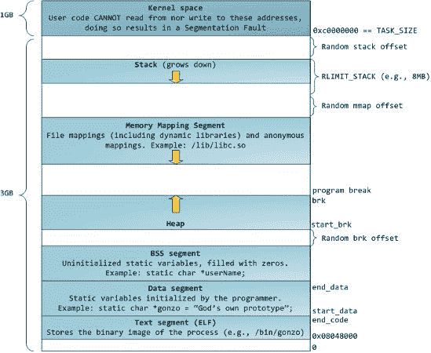
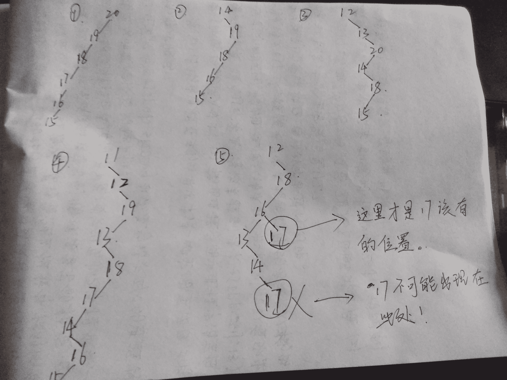

# 网易 2018 校园招聘 C 开发工程师笔试卷

## 1

修改替换 file 文件中 myname 字段为 name, 下列正确的是:

正确答案: D   你的答案: 空 (错误)

```cpp
sed 's@name@myname@g' file
```

```cpp
sed -i 's@name@myname@g' file
```

```cpp
sed 's@myname@name@g' file
```

```cpp
sed -i 's@myname@name@g' file
```

本题知识点

网易 C++工程师 C++工程师 网易 2018

讨论

[小树 1962](https://www.nowcoder.com/profile/9860878)

```cpp
sed -i 's@旧内容@新内容@g 'file
```

发表于 2018-08-11 09:23:43

* * *

## 2

在 Linux 系统下，要将 wangyi.txt 压缩成 wangyi.txt.tar.gz，下面那个命令可以实现?

正确答案: D   你的答案: 空 (错误)

```cpp
gzip &ndash;r wangyi.txt.tar.gz wangyi.txt
```

```cpp
gzip &ndash;r wangyi.txt wangyi.txt.tar.gz
```

```cpp
tar &ndash;zcvf wangyi.txt wangyi.txt.tar.gz
```

```cpp
tar &ndash;zcvf wangyi.txt.tar.gz wangyi.txt
```

本题知识点

网易 C++工程师 2018

讨论

[小树 1962](https://www.nowcoder.com/profile/9860878)

```cpp
tar –cvf jpg.tar *.jpg     // 将目录里所有 jpg 文件打包成 tar.jpg  
tar –czf jpg.tar.gz *.jpg  // 将目录里所有 jpg 文件打包成 jpg.tar 后，并且将其用 gzip 压缩，生成一个 gzip 压缩过的包，命名为 jpg.tar.gz  
tar –cjf jpg.tar.bz2 *.jpg // 将目录里所有 jpg 文件打包成 jpg.tar 后，并且将其用 bzip2 压缩，生成一个 bzip2 压缩过的包，命名为 jpg.tar.bz2  
tar –cZf jpg.tar.Z *.jpg   // 将目录里所有 jpg 文件打包成 jpg.tar 后，并且将其用 compress 压缩，生成一个 umcompress 压缩过的包，命名为 jpg.tar.Z  

tar –xvf file.tar         // 解压 tar 包  
tar -zxvf file.tar.gz     // 解压 tar.gz  
tar -jxvf file.tar.bz2    // 解压 tar.bz2  
tar –Zxvf file.tar.Z      // 解压 tar.Z  

```

发表于 2018-08-11 09:26:49

* * *

## 3

Linux 进程内存空间有以下几个部分:

> 1.stack 2.heap3.bss segment4.code segment/text segment5.data segment

它们从高地址到低地址的分布顺序为()

正确答案: B   你的答案: 空 (错误)

```cpp
45321
```

```cpp
12354
```

```cpp
45312
```

```cpp
21354
```

本题知识点

网易 C++工程师 C++工程师 网易 2018

讨论

[小树 1962](https://www.nowcoder.com/profile/9860878)



发表于 2018-08-11 09:35:35

* * *

## 4

以下哪三个中有不属于 Unix 系统调用?

正确答案: A   你的答案: 空 (错误)

```cpp
open lseek fseek
```

```cpp
open close read
```

```cpp
wait pipe stat
```

```cpp
signal chmod mkdir
```

本题知识点

网易 C++工程师 C++工程师 网易 2018

讨论

[good_study](https://www.nowcoder.com/profile/997305769)

上面的解析有一处错误，lseek 是系统调用。但是 fseek 不是。我在 mac10.15 的 sdk 下查的是这样的，在 apue 里也有提到共 lseek。

发表于 2020-08-01 11:05:17

* * *

[小树 1962](https://www.nowcoder.com/profile/9860878)

系统调用，顾名思义，说的是操作系统提供给用户程序调用的一组“特殊”接口。用户程序可以通过这组“特殊”接口来获得操作系统内核提供的服务，比如用户可以通过文件系统相关的调用请求系统打开文件、关闭文件或读写文件，可以通过时钟相关的系统调用获得系统时间或设置定时器等。有:进程通过系统调用要求文件系统提供服务,进程管理和存储管理;而 fseek 和 lseek 函数是文件打开之后的操作，不涉及系统调用

发表于 2018-08-11 09:58:25

* * *

## 5

有一个数组,元素为 70,10,40,30,190,100,130,160,90,80,将它进行堆排序,当刚刚建成大根堆时,它
所对应二叉树的前序遍历是多少?

正确答案: C   你的答案: 空 (错误)

```cpp
190,160,130,100,90,80,70,40,30,10
```

```cpp
30,90,70,160,10,80,190,100,130,40
```

```cpp
190,70,160,30,90,10,80,130,100,40
```

```cpp
30,70,90,10,80,160,100,40,130,190
```

本题知识点

网易 C++工程师 C++工程师 网易 2018

讨论

[lpplgg](https://www.nowcoder.com/profile/2201901)

                       190
            160                  130
      90          80      100       40
   30  70   10 堆排序排完应该是这样的吧？前序遍历是 190 160 90 30 70 80 10 130 100 40

发表于 2018-08-15 10:35:17

* * *

[响亮 _ 小牛](https://www.nowcoder.com/profile/391851304)

我感觉答案没毛病啊，只是说建立最大堆后的先序遍历，堆排序分两步，第一步：建立最大堆，第二步调整最大堆

发表于 2019-08-01 15:57:46

* * *

[库克船长 201808081934978](https://www.nowcoder.com/profile/980084485)

答案错了 190 160 90 30 70 80 10 130 100 40

发表于 2018-08-11 11:58:46

* * *

## 6

某表达式的后缀表达式为 AB+CD+/E*，该表达式原型可能为以下哪个?

正确答案: D   你的答案: 空 (错误)

```cpp
A+B/(C+D)*E
```

```cpp
((A+B)/C+D)*E
```

```cpp
(A+B/C+D)*E
```

```cpp
(A+B)/(C+D)*E
```

```cpp
(A+B)*E/(C+D)
```

本题知识点

网易 C++工程师 C++工程师 网易 2018

讨论

[川夜施密特](https://www.nowcoder.com/profile/5603531)

D。后缀转中缀，从左向右遇到数字就进栈，遇到符号就将栈顶两个数字出栈运算，结果放回栈中，一直到最终的结果。A B + C D + / E * ，将 A B 放入栈中，遇到+，则计算 A+B，并将结果（A+B）入栈，然后 C D 依次入栈，又遇到+，则将栈顶 C D 与+运算，得到（C+D）并放入栈中，往下遇到 /，将栈顶的（A+B）和（C+D）与 /运算，得到（A+B）/（C+D），并将其放入栈中，继续遇到 E，入栈，往下是*，同上(A+B)/(C+D)*E。

发表于 2018-05-25 20:42:12

* * *

[小树 1962](https://www.nowcoder.com/profile/9860878)

> [`www.cnblogs.com/chensongxian/p/7059802.html`](https://www.cnblogs.com/chensongxian/p/7059802.html)

详细讲解：

后缀表达式计算机求值

从左至右扫描表达式，遇到数字时，将数字压入堆栈，遇到运算符时，弹出栈顶的两个数，用运算符对它们做相应的计算（次顶元素 op 栈顶元素），并将结果入栈；重复上述过程直到表达式最右端，最后运算得出的值即为表达式的结果

发表于 2018-08-11 11:57:14

* * *

## 7

以下算法不可以使用贪心算法的是?

正确答案: A   你的答案: 空 (错误)

```cpp
Floyd-Warshall 算法
```

```cpp
dijkstra 算法
```

```cpp
kruskal 算法
```

```cpp
Huffman 编码算法
```

本题知识点

网易 C++工程师 C++工程师 网易 2018

讨论

[小树 1962](https://www.nowcoder.com/profile/9860878)

Floyd-Warshall 算法是采用动态规划的方案来解决在一个有向图 G=（V，E）上每对顶点间的最短路径问题。运行时间为Θ（V³）。

发表于 2018-08-11 11:59:28

* * *

## 8

假设一棵二叉排序树的节点的值均为 10 到 20 的整数，如果在这棵树里查找 15，以下哪个序列是不可能存在的?

正确答案: E   你的答案: 空 (错误)

```cpp
20,19,18,17,16,15
```

```cpp
14,19,18,16,15
```

```cpp
12,13,20,14,18,15
```

```cpp
11,12,19,13,18,17,14,16,15
```

```cpp
12,18,16,13,14,17,15
```

本题知识点

网易 C++工程师 C++工程师 网易 2018

讨论

[SCurry](https://www.nowcoder.com/profile/7573161)

看图：

发表于 2018-06-15 10:00:45

* * *

[小树 1962 王汉杰](https://www.nowcoder.com/profile/9860878)

引用自  @[王汉杰](https://www.nowcoder.com/profile/506739)对任意点，后面的元素要么全部大于它，要么全部小于它。E 不符。

发表于 2018-08-11 12:15:07

* * *

## 9

有一个算法的递推关系式为：T(N) = T(2N/3) + 1，则该算法的时间复杂度为（）(^符号是幂的意思)

正确答案: D   你的答案: 空 (错误)

```cpp
O(1)
```

```cpp
O(N^log2(3) )
```

```cpp
O(N^log3(2) )
```

```cpp
O(logN)
```

```cpp
O(N)
```

本题知识点

网易 C++工程师 C++工程师 网易 2018

讨论

[859378367](https://www.nowcoder.com/profile/859378367)

递归方程时间复杂度公式：对于 T(n) = a*T(n/b) + c* n^k T(n) 分三种情况 ：当 a > b^ k  --> T(n) = O( n ^ logb (a) ) 当 a = b^ k  --> T(n) = O( n^ k * log (n) )当 a< b^ k  --> T(n) = n^ k 这道题中，a=1 ,b =3/2 ,k=0 --> a=b ^ k --> T(n) = O（log(n)）  选 D

发表于 2019-08-02 21:19:31

* * *

## 10

将一颗有 346 个结点的完全二叉树从根这一层开始，进行广度遍历编号(从 1 开始编号)，那么编号最小的叶节点的编号是（）

正确答案: D   你的答案: 空 (错误)

```cpp
171
```

```cpp
172
```

```cpp
173
```

```cpp
174
```

```cpp
175
```

本题知识点

网易 C++工程师 2018

讨论

[SCurry](https://www.nowcoder.com/profile/7573161)

1，由公式知：满二叉树叶子节点的个数为：（2^k）-1（k 为树的深度）。那么根据这个公式和结点总数得：(2⁸)-1<346<(2⁹)-1; 所以此树深度为 9。第 9 层叶子节点总数为：346-（(2⁸)-1）=91；产生 91 个叶子节点需要：【91/2】=46 个父节点。所以第 8 层第 47 个节点为第一个叶子节点！所以 ：标号为 ((2⁷)-1)+47=174。

编辑于 2018-06-15 10:21:13

* * *

## 11

下面模板的声明中，正确的是（）

正确答案: A   你的答案: 空 (错误)

```cpp
template  class C3{};
```

```cpp
templateclass C1{};
```

```cpp
templateclass C2{};
```

```cpp
templateclass C4{};
```

本题知识点

网易 C++工程师 2018 C++ C 语言

讨论

[快乐小碌](https://www.nowcoder.com/profile/294853902)

| < | 小于号 | &lt; |   |
| > | 大于号 | &gt; |

发表于 2021-02-16 18:56:13

* * *

[小树 1962](https://www.nowcoder.com/profile/9860878)

```cpp

	类模板的格式如下：

	template<class 形参名，class 形参名，…>class 类名{ ... };

	函数模板的格式如下：

	Template <class 形参名，class 形参名，......> 返回类型函数名(参数列表){函数体}

	其中，class 可以用 typename 关键字代替。

```

发表于 2018-08-11 12:29:57

* * *

[牛客 74710402 号](https://www.nowcoder.com/profile/74710402)

我怎么记得 class 和 typename 只能用一个的

发表于 2021-02-24 16:17:47

* * *

## 12

以下代码是哪一句可能导致的编译错误?

```cpp
#include <iostream>
using namespace std;
class Test
{
public:
	Test() { cout << "i like zk"; }
	Test(int) { cout << "i like wangyi"; }
	void exe() { cout << "this is my choice"; }
};
int main()
{
	Test a(1);//1
	a.exe();  //2
	Test b(); //3
	b.exe();  //4
	Test c;   //5
	c.exe();  //6
        return 0;
}
```

正确答案: D   你的答案: 空 (错误)

```cpp
1
```

```cpp
2
```

```cpp
3
```

```cpp
4
```

```cpp
5
```

```cpp
6
```

本题知识点

网易 C++工程师 2018 C++

讨论

[SCurry](https://www.nowcoder.com/profile/7573161)

Test b();  声明了一个函数返回类型为 Test ，参数为空的函数，函数名字为 b() ;

编辑于 2018-06-16 14:45:06

* * *

[Cpp 学渣本渣](https://www.nowcoder.com/profile/199461854)

对于类而言： 栈上创建的对象，如果有默认拷贝构造函数，就不要加括号，即 Test b; 如果加了括号会被编译器误认为是函数声明，如：Test b(); 返回类型为 Test ，函数名为 b，形参为空。

编辑于 2020-12-04 00:23:12

* * *

[pengxxh](https://www.nowcoder.com/profile/465916590)

应该是 Text b;b.exec();

发表于 2019-08-05 09:46:28

* * *

## 13

关于迭代器失效，下面说法错误的有?

正确答案: C   你的答案: 空 (错误)

```cpp
当向 vector 容器插入（push_back）一个元素后，end 操作返回的迭代器肯定失效
```

```cpp
当向 vector 容器插入(push_back)一个元素后，capacity 返回值与没有插入元素之前相比有改变,此时 first 和 end 操作返回的迭代器都会失效
```

```cpp
当 vector 容器 erase 一个元素后，仅指向删除点的迭代器失效
```

```cpp
在 deque 容器的任何其他位置的插入和删除操作将使指向该容器元素的所有迭代器失效
```

```cpp
对于节点式容器(map, list, set)元素的删除，插入操作会导致指向该元素的迭代器失效，其他元素迭代器不受影响
```

本题知识点

网易 C++工程师 C++工程师 网易 2018

## 14

以下语句哪个判断是错误的?

```cpp
int& func_int_r(void);
int&& func_int_rr(void);
int func_int(void);

const int&& func_cint_rr(void);
const int func_cint(void);

int x=0;

decltype(func_int_r())    a1=x; //1.判断 a1 是 int&类型
decltype(func_int_rr())   b1=0; //2.判断 b1 是 int&&类型
decltype(func_int())        c1=0; //3.判断 c1 是 int 类型

decltype(func_cint_rr())  b2=x; //4.判断 b2 是 const int&&类型
decltype(func_cint)         c2=x; //5.判断 c2 是 const int 类型
```

正确答案: E   你的答案: 空 (错误)

```cpp
1
```

```cpp
2
```

```cpp
3
```

```cpp
4
```

```cpp
5
```

本题知识点

网易 C++工程师 2018 C++

讨论

[lpplgg](https://www.nowcoder.com/profile/2201901)

最后一个没加括号应该不是考察的点，是题出错了。。。考察的应该是函数返回值作为右值，被 const 修饰无效，decltype 返回的是 int。

发表于 2018-08-15 10:46:40

* * *

[dadada234](https://www.nowcoder.com/profile/3292426)

最后一个没加括号。。

发表于 2018-08-10 14:12:45

* * *

[寻 1314](https://www.nowcoder.com/profile/154886984)

应该是因为第五个没有括号，所以判断为错误

发表于 2021-07-30 21:46:36

* * *

## 15

下面关于 dynamic_cast 说法错误的有?

正确答案: C   你的答案: 空 (错误)

```cpp
dynamic_cast 在运行期，会检查这个转换是否可能
```

```cpp
dynamic_cast&lt;X&gt;(a)，那么 X 必须是一个指针或者引用
```

```cpp
表达式 dynamic_cast&lt;T*&gt;(a) 将 a 值转换为类型为 T 的对象指针。如果类型 T 不是 a 的某个基类型，该操作将失败抛出 bad_cast 异常
```

```cpp
T1 obj;T2 *pObj = dynamic_cast&lt;T2*&gt;(&amp;obj);被转换对象 obj 的类型 T1 必须是多态类型，即 T1 必须公有继承自其它类，或者 T1 拥有虚函数（继承或自定义）
```

本题知识点

网易 C++工程师 C++工程师 网易 2018

讨论

[库克船长 201808081934978](https://www.nowcoder.com/profile/980084485)

指针类型的非限定转换的值是 null 指针。 引用类型的非限定转换会引发 [bad_cast 异常](https://msdn.microsoft.com/zh-cn/library/82f1eehz.aspx)。 如果 expression 不指向也不引用有效的对象，则 __non_rtti_object 异常引发。

发表于 2018-08-10 21:12:18

* * *

## 16

有如下代码:

```cpp
struct A1{
    virtual ~A1(){}
};
struct A2{
    virtual ~A2(){}
};
struct B1 : A1, A2{};
int main()
{
 B1 d;
 A1* pb1 = &d;
 A2* pb2 = dynamic_cast<A2*>(pb1);  //L1
 A2* pb22 = static_cast<A2*>(pb1);  //L2
 return 0;
}
```

正确答案: B   你的答案: 空 (错误)

```cpp
L1 语句编译失败，L2 语句编译通过
```

```cpp
L1 语句编译通过，L2 语句编译失败
```

```cpp
L1，L2 都编译失败
```

```cpp
L1，L2 都编译通过
```

本题知识点

网易 C++工程师 2018 C++

讨论

[lpplgg](https://www.nowcoder.com/profile/2201901)

dynamic_cast 是运行时检查，虽然 pb1 是 A1 类型的，但是指向的实体却是子类，所以子类转父类 A2 完全是可以的。
但是 static_cast 比较“死脑筋”，在编译期检查，这样是不检查指针指向的值的，于是发现 pb1 是 A1 类型，A1 想转 A2？报错！

发表于 2018-08-15 10:54:27

* * *

[库克船长 201808081934978](https://www.nowcoder.com/profile/980084485)

L1 中 pb1 已经被转换为 A2 型指针，而 A2 与 A2 转应该是没有继承关系吧

发表于 2018-08-10 21:33:12

* * *

## 17

在页式存储管理中，假设一个程序的存储块数是 3，要访问的页面 id 为 1,2,3,3,2,1,4,3,2,1，并采用 LRU 算法，那么整个过程缺页次数为多少?

正确答案: C   你的答案: 空 (错误)

```cpp
5
```

```cpp
6
```

```cpp
7
```

```cpp
8
```

```cpp
4
```

本题知识点

网易 C++工程师 2018

讨论

[chiyiw](https://www.nowcoder.com/profile/438601)

最开始的三次也算。。。

发表于 2019-09-20 11:07:36

* * *

## 18

下面关于操作系统的进程说法正确的有?

正确答案: B   你的答案: 空 (错误)

```cpp
系统中进程的数目越多，CPU 的利用率就越高
```

```cpp
同一个进程的多个线程共享状况为堆共享，栈私有
```

```cpp
只有使用了多进程技术才会发生死锁问题
```

```cpp
进程和线程都有独立的地址空间
```

本题知识点

网易 C++工程师 C++工程师 网易 2018

## 19

操作系统中，不同子线程会共享同一个父进程的?

正确答案: B   你的答案: 空 (错误)

```cpp
寄存器组的值
```

```cpp
文件描述符
```

```cpp
线程的堆栈
```

```cpp
错误返回码
```

本题知识点

网易 C++工程师 C++工程师 网易 2018

## 20

如果把一个网络 30.30.0.0 分为两个子网，第一个子网是 30.30.0.0/17，那么第二个子网将会是()

正确答案: D   你的答案: 空 (错误)

```cpp
30.30.1.0/17
```

```cpp
30.30.2.0/16
```

```cpp
30.30.64.0/17
```

```cpp
30.30.128.0/17
```

```cpp
30.30.192.0/17
```

本题知识点

网易 C++工程师 C++工程师 网易 2018

讨论

[小风 201812112250658](https://www.nowcoder.com/profile/32467579)

17，说明子网掩码是 255.255.128.0，因为划分为两个子网，所以第 17 位分 0 和 1，故第二个子网是 30.30.128.0/17

发表于 2019-08-03 10:07:37

* * *

## 21

魔法王国一共有 n 个城市,编号为 0~n-1 号,n 个城市之间的道路连接起来恰好构成一棵树。
小易现在在 0 号城市,每次行动小易会从当前所在的城市走到与其相邻的一个城市,小易最多能行动 L 次。
如果小易到达过某个城市就视为小易游历过这个城市了,小易现在要制定好的旅游计划使他能游历最多的城市,请你帮他计算一下他最多能游历过多少个城市(注意 0 号城市已经游历了,游历过的城市不重复计算)。

本题知识点

网易 C++工程师 贪心 动态规划 树 2018

## 22

小易有一个长度为 N 的正整数数列 A = {A[1], A[2], A[3]..., A[N]}。
牛博士给小易出了一个难题:
对数列 A 进行重新排列,使数列 A 满足所有的 A[i] * Ai + 1 都是 4 的倍数。
小易现在需要判断一个数列是否可以重排之后满足牛博士的要求。

本题知识点

网易 C++工程师 数学 贪心 动态规划 数组 2018

讨论

[ErgouJing](https://www.nowcoder.com/profile/9875411)

```cpp
/*
复杂度为 O(n)
统计三种数字：
1.能被 4 整除，取名 div4，（可以认为在此题中这种数字比较珍贵）
2.只能被 2 整除，但不能被 4 整除 d，iv2
```

```cpp
3.不能被 2 整除，div1
a.如果不存在只能被 2 整除的数字，那么按照 div1 和 div4 相间排列即可满足要求，且 div1 可以占据首尾，即 div1 <= div4 + 1;
b.如果存在 div2，将它们放在最后面，1 4 1 4 2 2 2 排列
c.其他情况，No
*/
#include<bits/stdc++.h>
using namespace std;

bool judge(vector<int>& vec)
{
    int div1 = 0, div2 = 0, div4 = 0;//，，不能被 2 整除的数字个数 div1
    for(auto &c : vec)
    {
        if(c % 2 == 0)
        {
            if(c % 4 == 0)
                div4++;//能被 4 整除的数字个数 div4
            else
                div2++;//统计只能被 2 整除的数字个数 div2
        }
        else
            div1++;//不能被 2 整除的数字个数 div1
    }
    if(div2 == 0)//如果不存在只能被 2 整除的数字
    {
        if(div1 - 1 <= div4)//1 4 1 4 1 4 1 符合要求
            return true;
    }
    else//存在只能被 2 整除的数字
    {
        if(div1 <= div4)//1 4 1 4 1 4 2 2 2 符合要求
            return true;
    }
    return false;
}

int main()
{
    int n;
    while(cin >> n)
    {
        for(int i = 0; i < n; i++)
        {
            int m;
            cin >> m;
            vector<int> vec;
            int temp;
            for(int j = 0; j < m; j++)
            {
                cin >> temp;
                vec.push_back(temp);
            }
            if(judge(vec))
                cout << "Yes" << endl;
            else
                cout << "No" << endl;
        }
    }
    return 0;
}

```

发表于 2018-08-10 23:08:54

* * *

[oceanbase-jonny](https://www.nowcoder.com/profile/4555748)

寻找满足条件下的规律：    首先寻找整除 4 的数可以先统计，然后统计不能 4 整除单能整除 2 的数，最后统计两者都不能的，我们知道连续的能整除 2 的数的两个数的乘积是可以整除 4 的，然后判断能整除 4 的个数和不能被乘除的个数，就可以得出：

| #include<iostream>#include<vector>usingnamespacestd;intmain(){    intt;    cin>>t;    vector<string> re;    for(inti=0;i<t;++i){        intn;        cin>>n;        intcount_4=0,count_2=0,count_1=0;        for(inti=0;i<n;++i){            intm;            cin>>m;            if(m%4==0)                ++count_4;            else if(m%2==0)                ++count_2;            else                ++count_1;        }        count_2=count_2%2;        if(count_4>=count_2+count_1-1)            re.push_back("Yes");        else            re.push_back("No");    }    for(auto s:re)        cout<<s<<endl;} |

发表于 2018-05-28 11:26:55

* * *

## 23

小易正在玩一款新出的射击游戏,这个射击游戏在一个二维平面进行,小易在坐标原点(0,0),平面上有 n 只怪物,每个怪物有所在的坐标(x[i], y[i])。小易进行一次射击会把 x 轴和 y 轴上(包含坐标原点)的怪物一次性消灭。
小易是这个游戏的 VIP 玩家,他拥有两项特权操作:
1、让平面内的所有怪物同时向任意同一方向移动任意同一距离
2、让平面内的所有怪物同时对于小易(0,0)旋转任意同一角度
小易要进行一次射击。小易在进行射击前,可以使用这两项特权操作任意次。
小易想知道在他射击的时候最多可以同时消灭多少只怪物,请你帮帮小易。如样例所示:
所有点对于坐标原点(0,0)顺时针或者逆时针旋转 45°,可以让所有点都在坐标轴上,所以 5 个怪物都可以消灭。

本题知识点

网易 C++工程师 模拟 数学 穷举 2018

## 24

简述下面几项定义各自表达的含义：a. int *ptr[n]b. int (*)ptr[n]c. int *ptr()d. int (*)ptr()e. int (* ((*ptr(int, int)))(int)

你的答案

本题知识点

网易 C++工程师 2018

讨论

[拖拉机嘟嘟嘟](https://www.nowcoder.com/profile/117252758)

b，因该是 int (*ptr)[n]

发表于 2019-08-02 15:17:05

* * *

## 25

传统数据库索引都通过 B+树来实现，而为了能更好利用 I/O 资源，数据库通常都是以数据页的形式来管理索引和数据，假设一张数据页的大小为 16KB，一张表索引字段为 4Bytes，请回答以下问题：a. 理想状况下，一张数据页能存储多少索引节点？ 一颗 3 层高的 B+树(包含 root 节点)，最多能索引多少条记录？b. 一张数据页可能包含大量索引节点，为了提高效率，通常在数据页内部会采用二分法进行查找，给定一张数据页中如下序列 a[12] = [10, 15, 15, 20, 20, 20, 20, 35, 35, 35, 40, 45, 50]，自定义一个函数来完成序列中指定条件的数值查找，用伪代码实现即可，(提示：需考虑非等值查询条件下的处理)

你的答案

本题知识点

网易 C++工程师 2018