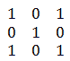
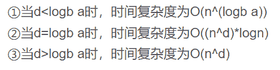

# 网易 2018 校园招聘人机交互算法工程师笔试卷

## 1

图像数据如下：卷积核为：则输出为：

正确答案: A   你的答案: 空 (错误)

本题知识点

网易 算法工程师 算法工程师 网易 2018

## 2

以下关于 Linear discriminant analysis（LDA）说法错误的是;

正确答案: B   你的答案: 空 (错误)

```cpp
LDA 假设每个类别的密度分布为高斯分布
```

```cpp
LDA 假设每个类之间的协方差矩阵都是对角阵
```

```cpp
LDA 假设每个类之间的协方差矩阵都相同
```

```cpp
LDA 的分界面为线性的
```

本题知识点

网易 算法工程师 算法工程师 网易 2018

## 3

在以下示意图中， 交集部分可以表示哪个统计量

 

正确答案: C   你的答案: 空 (错误)

```cpp
联合熵
```

```cpp
条件熵
```

```cpp
互信息
```

```cpp
交叉熵
```

本题知识点

网易 算法工程师 算法工程师 网易 2018

## 4

假如一个二叉树有 1026 个节点，它的深度的可能性有多少种?(假设只有根节点的深度为 1)

正确答案: E   你的答案: 空 (错误)

```cpp
2
```

```cpp
1017
```

```cpp
1014
```

```cpp
1015
```

```cpp
1016
```

本题知识点

网易 算法工程师 算法工程师 网易 2018

讨论

[零葬](https://www.nowcoder.com/profile/75718849)

如果是完全二叉树，有 11 层；如果退化成单链表，有 1026 层。因此二叉树的深度从 11~1026 层都可以通过一些调整做到，一共有 1016 种可能性。

发表于 2022-02-27 22:49:21

* * *

## 5

有一个算法的递推关系式为：T(N) = T(2N/3) + 1，则该算法的时间复杂度为（）(^符号是幂的意思)

正确答案: D   你的答案: 空 (错误)

```cpp
O(1)
```

```cpp
O(N^log2(3) )
```

```cpp
O(N^log3(2) )
```

```cpp
O(logN)
```

```cpp
O(N)
```

本题知识点

网易 算法工程师 算法工程师 网易 2018

讨论

[零葬](https://www.nowcoder.com/profile/75718849)

根据 master 公式

依题意：


属于情况②

发表于 2022-02-27 22:52:24

* * *

## 6

下面关于操作系统的进程说法正确的有?

正确答案: B   你的答案: 空 (错误)

```cpp
系统中进程的数目越多，CPU 的利用率就越高
```

```cpp
同一个进程的多个线程共享状况为堆共享，栈私有
```

```cpp
只有使用了多进程技术才会发生死锁问题
```

```cpp
进程和线程都有独立的地址空间
```

本题知识点

网易 算法工程师 算法工程师 网易 2018

## 7

下面关于 TCP 和 UDP 说法正确的是?

正确答案: A   你的答案: 空 (错误)

```cpp
在 TCP/UDP 传输段中，源端口地址和目的端口地址是不能相同的
```

```cpp
当客户端和服务器建立的是 TCP 连接的时候，服务器最后如果想要断开直接断开连接，停止发送数据就好了
```

```cpp
UDP 是用户数据报协议，是一个简单的面向数据报的应用层协议
```

```cpp
UDP 在传输数据报前不用在客户和服务器之间建立一个连接，但是也有超时重发的机制
```

```cpp
UDP 的传输速度优于 TCP
```

本题知识点

网易 算法工程师 算法工程师 网易 2018

## 8

图像中应用的 kmeans 算法，以下说法错误的是：

正确答案: D   你的答案: 空 (错误)

```cpp
kmeans 算法有效的前提假设是数据满足高斯分布
```

```cpp
kmeans 需要手工指定类别的数目 K
```

```cpp
对于多维实数数据，kmeans 算法最终一定是收敛的
```

```cpp
kmeans 算法可以直接得到类别分布的层级关系
```

本题知识点

网易 算法工程师 2018

## 9

CNN 神经网络对图像特征提取带来了变革性的变化，使之前的人工特征提取升级到数据驱动的自动特征提取，在 CNN 中，起到特征提取作用的网络层是：

正确答案: A   你的答案: 空 (错误)

```cpp
convolution 层
```

```cpp
full connect 层
```

```cpp
max pooling 层
```

```cpp
norm 层
```

本题知识点

网易 算法工程师 算法工程师 网易 2018

## 10

小易有一个长度为 N 的正整数数列 A = {A[1], A[2], A[3]..., A[N]}。
牛博士给小易出了一个难题:
对数列 A 进行重新排列,使数列 A 满足所有的 A[i] * Ai + 1 都是 4 的倍数。
小易现在需要判断一个数列是否可以重排之后满足牛博士的要求。

本题知识点

网易 算法工程师 数学 贪心 动态规划 数组 2018

## 11

一个合法的括号匹配序列被定义为:
1\. 空串""是合法的括号序列
2\. 如果"X"和"Y"是合法的序列,那么"XY"也是一个合法的括号序列
3\. 如果"X"是一个合法的序列,那么"(X)"也是一个合法的括号序列
4\. 每个合法的括号序列都可以由上面的规则生成
例如"", "()", "()()()", "(()())", "(((()))"都是合法的。
从一个字符串 S 中移除零个或者多个字符得到的序列称为 S 的子序列。
例如"abcde"的子序列有"abe","","abcde"等。
定义 LCS(S,T)为字符串 S 和字符串 T 最长公共子序列的长度,即一个最长的序列 W 既是 S 的子序列也是 T 的子序列的长度。
小易给出一个合法的括号匹配序列 s,小易希望你能找出具有以下特征的括号序列 t:
1、t 跟 s 不同,但是长度相同
2、t 也是一个合法的括号匹配序列
3、LCS(s, t)是满足上述两个条件的 t 中最大的
因为这样的 t 可能存在多个,小易需要你计算出满足条件的 t 有多少个。

如样例所示: s = "(())()",跟字符串 s 长度相同的合法括号匹配序列有:
"()(())", "((()))", "()()()", "(()())",其中 LCS( "(())()", "()(())" )为 4,其他三个都为 5,所以输出 3.

本题知识点

网易 算法工程师 字符串 *贪心 栈 *穷举 哈希 *2018*** ***## 12

小易接手了一个人体姿态估计（估计人体关节点）的任务，希望从 RGB 图像中恢复出人体姿态，已知人体姿态数据量充足：1）请介绍一种能够快速且有效地恢复人体姿态的方法，写出该算法大致的工作流程。2）假如小易已经恢复出了人体姿态，请帮助小易设计出至少两种人体姿态估计的应用场景，并大致介绍你的实现流程。

你的答案

本题知识点

网易 算法工程师 2018

## 13

语音交互是人机交互中重要的一环，产品策划小易想在一个移动设备上实现简单的语音交互控制功能，于是来请教你的意见。具体来说，想要在某个应用内实现一些控制命令如“进入”“退出”“上一个”“下一个等”，如果可以的话也想实现应用的打开与关闭、简单的情景对话、关键词唤醒等功能。已知公司已有成熟的中文语音识别引擎，请从算法工程实现的角度给小易一个可行性反馈，并简要介绍如何实现。

你的答案

本题知识点

网易 算法工程师 2018

## 14

随着深度相机使用越来越普遍，小易想基于深度相机做一些简单的手势交互；已知深度相机可以同时获取 RGB 图像和深度图像，该项目的一个重要步骤就是从得到的图像中分割出感兴趣手部区域；已知深度图像有随机噪声，相机会有随机抖动，此外会有将水杯等物体放入相机视野中，过一段时间又拿走的情况出现；请帮小易实现一个稳定的感兴趣手部区域提取方案。

你的答案

本题知识点

网易 算法工程师 2018

## 15

图像处理中有一类问题是需要将两张或者多张图像进行拼接，得到一张完整的大图,请问如何将多张图像拼接成一张完整的大图？请详细介绍你使用的方法及其原理。在图像拼接问题中，拼接的后图像常常会有光照不均、仿射畸变、接缝等问题，这些问题又该如何解决？

你的答案

本题知识点

网易 算法工程师 2018***