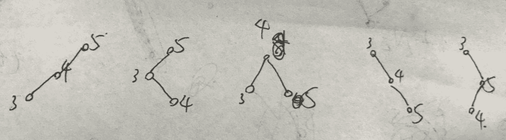

# 网易 2018 校园招聘前端开发工程师笔试卷

## 1

下面关于正则表达式的说法错误的是()

正确答案: D   你的答案: 空 (错误)

```cpp
&quot;.&quot;匹配除\n 之外的任意字符
```

```cpp
&quot;*&quot;匹配 0 个或多个的数量限定符
```

```cpp
&quot;+&quot;匹配 1 个或多个的数量限定符
```

```cpp
&quot;?&quot;匹配前面的子表达式 0 次或 1 次或 2 次
```

本题知识点

网易 前端工程师 前端工程师 网易 2018

讨论

[QQ 群](https://www.nowcoder.com/profile/968354)

？：匹配 0/1 次

发表于 2018-07-31 14:07:41

* * *

## 2

下列关于 Web Sockets 通信的说法错误的是：

正确答案: A   你的答案: 空 (错误)

```cpp
webSocket.close();用来监听关闭事件
```

```cpp
初始化连接时使用，var webSocket = new WebSocket('ws://localhost:8080/socket');
```

```cpp
发送数据时使用，webSocket.send('data');
```

```cpp
接收服务端传送的数据使用：onmessage 事件
```

本题知识点

网易 前端工程师 2018

讨论

[包子是好包子](https://www.nowcoder.com/profile/9170153)

Web Sockets 的目标是在一个单独的持久连接上提供一个全双工、双向通信。客户端实现 Web Sockets 的一些事件和方法：

```cpp
//实例化一个 WebSocket 对象，并传入要连接的决定 URL
var socket = new WebSocket("url");//    url 中要使用 ws://来代替 http:// ;使用 wss 来代替 https://
//当成功建立连接时会触发 open 事件
socket.onopen = function(){
    alert("established");
}
//当发生错误时会触发 error 事件
socket.onerror = function(){
    alert("error!");
}
//当连接关闭时会触发 close 事件
socket.onclose = function(){
    alert("closed!");
}
//使用 send() 方法发送数据 只能接受字符串 json 对象要先序列化成 json 字符串
socket.send(str);
//当服务端像客户端发来消息，WebSocket 对象就会触发 message 事件
socket.onmessage = function(event){
    console.log(event.data);//返回的数据 也为字符串形式
}
//调用 close()方法 会关闭 Web Sockets 连接，可在任何时候调用 close（）方法
 socket.close();
```

注意：事件和方法的使用写法不一样  websocket 有一个 close 事件 也有一个 close（）方法

发表于 2018-08-14 20:09:45

* * *

[是函数不是方法](https://www.nowcoder.com/profile/7255829)

```cpp
webSocket.onclose();用来监听关闭事件
```

发表于 2018-06-26 14:38:43

* * *

## 3

Web Workers 线程的描述错误的是：

正确答案: D   你的答案: 空 (错误)

```cpp
var worker = new Worker('worker.js');创建一个 Worker 对象
```

```cpp
向一个 Worker 发送消息则使用：worker.postMessage(message)
```

```cpp
接收一个 Worker 的消息使用：worker.onmessage=function(event){};
```

```cpp
Web Workers 线程不可以进行嵌套
```

本题知识点

网易 前端工程师 2018

## 4

某二叉查找树的每个节点存放一个整数,中序遍历该树得到的序列为 3,4,5，则该树的画法有多少种情况?

正确答案: C   你的答案: 空 (错误)

```cpp
3
```

```cpp
4
```

```cpp
5
```

```cpp
6
```

本题知识点

网易 前端工程师 2018

讨论

[一直都这样](https://www.nowcoder.com/profile/654062)



发表于 2018-05-25 20:25:46

* * *

## 5

若一棵二叉树上的节点只有叶子节点和度数为 2 的节点，假设度数为 2 的节点个数为 N，那么该二叉树上的结点总数为()

正确答案: A   你的答案: 空 (错误)

```cpp
2N+1
```

```cpp
2N-1
```

```cpp
2N-2
```

```cpp
2N
```

```cpp
不能确定，得看树的具体情况
```

本题知识点

网易 前端工程师 前端工程师 网易 2018

讨论

[青柚 _](https://www.nowcoder.com/profile/4577841)

二叉树中，除了根节点，其他度数为 2 的结点产生 1 个叶结点（2 个儿子结点减去父节点本身），根节点产生两个叶结点，因为 N 个度数为 2 的结点产生的叶子结点为 N - 1 + 2 = N + 1 个，加上 N 个度数为 2 的结点，共有（2N+1）个结点

发表于 2018-09-03 20:52:50

* * *

[sunnyww](https://www.nowcoder.com/profile/964650883)

二叉树中，叶子节点总比度为 2 的节点多 1 个，如果度数为 2 的节点个数为 N，那么叶子节点有 N+1 个，所以节点总数为 2N+1

发表于 2019-09-20 10:15:42

* * *

## 6

下面关于排序的空间复杂度说法不正确的有()(N 为被排序数据的长度)

正确答案: D   你的答案: 空 (错误)

```cpp
堆排序的空间复杂度为 O(1)
```

```cpp
冒泡排序的空间复杂度为 O(1)
```

```cpp
归并排序的空间复杂度为 O(N)
```

```cpp
插入排序的空间复杂度为 O(N)
```

```cpp
递归实现的快速排序的空间复杂度为 O(logn)
```

本题知识点

网易 前端工程师 前端工程师 网易 2018

讨论

[NefeliBata11](https://www.nowcoder.com/profile/1358335)

空间复杂度(Space Complexity)是对一个算法在运行过程中临时占用存储空间大小的量度，记做 S(n)=O(f(n))。比如直接插入排序的时间复杂度是 O(n²),空间复杂度是 O(1) 。而一般的递归算法就要有 O(n)的空间复杂度了，因为每次递归都要存储返回信息。

发表于 2018-05-28 14:57:29

* * *

## 7

操作系统中，不同子线程会共享同一个父进程的?

正确答案: B   你的答案: 空 (错误)

```cpp
寄存器组的值
```

```cpp
文件描述符
```

```cpp
线程的堆栈
```

```cpp
错误返回码
```

本题知识点

网易 前端工程师 前端工程师 网易 2018

讨论

[在下雨的 Tokyo](https://www.nowcoder.com/profile/2487011)

文件操作属于进程级的资源

发表于 2020-07-28 19:03:03

* * *

## 8

下面关于 TCP 和 UDP 说法正确的是?

正确答案: A   你的答案: 空 (错误)

```cpp
在 TCP/UDP 传输段中，源端口地址和目的端口地址是不能相同的
```

```cpp
当客户端和服务器建立的是 TCP 连接的时候，服务器最后如果想要断开直接断开连接，停止发送数据就好了
```

```cpp
UDP 是用户数据报协议，是一个简单的面向数据报的应用层协议
```

```cpp
UDP 在传输数据报前不用在客户和服务器之间建立一个连接，但是也有超时重发的机制
```

```cpp
UDP 的传输速度优于 TCP
```

本题知识点

网易 前端工程师 2018

讨论

[QQ 群](https://www.nowcoder.com/profile/968354)

B 选项：断开 tcp 连接，要发送“断开请求”C 选项：udp 是运输层协议 D 选项：没有超时重发的机制 E 选项：丢包多时，udp 速度反而更慢

发表于 2018-07-31 14:40:08

* * *

[青柚 _](https://www.nowcoder.com/profile/4577841)

```cpp
在 TCP/UDP 传输段中，若源端口地址和目的端口地址相同，相当于是建立了一条自己通向自己的连接，会造成资源浪费
```

发表于 2018-09-03 20:57:49

* * *

[是函数不是方法](https://www.nowcoder.com/profile/7255829)

B.需要调用 close 之类的函数主动终止连接，需要告知对方 C.是运输层协议 D.没有超时重发机制，所以很快 E.丢包多的话 udp 反而更慢

发表于 2018-07-01 21:22:17

* * *

## 9

shell 中，可以让一个变量变为全局变量的是？

正确答案: B   你的答案: 空 (错误)

```cpp
alias
```

```cpp
export
```

```cpp
exports
```

```cpp
let
```

本题知识点

网易 前端工程师 2018

## 10

下面的代码在页面上输出的结果为?

> <ol><li>网易</li><li>http://www.163.com</li><ol>

正确答案: D   你的答案: 空 (错误)

```cpp
·网易<br>·http://www.163.com
```

```cpp
网易<br>http://www.163.com
```

```cpp
.网易<br>.http://www.163.com
```

```cpp
1.网易<br>2.http://www.163.com
```

本题知识点

网易 前端工程师 2018 HTML

讨论

[sunnyww](https://www.nowcoder.com/profile/964650883)

ol:ordered list 有序表格 ul:unordered list 无序表格

发表于 2019-09-20 10:22:35

* * *

[是函数不是方法](https://www.nowcoder.com/profile/7255829)

如果是才是 a 选项

发表于 2018-07-01 21:17:03

* * *

[山城郴王](https://www.nowcoder.com/profile/462634888)

这个就涉及到 xhtml(当年 w3c 玩命推荐的，虽然后面被各个知名浏览器公司推翻了)语法了：

> 1\. html 中不区分大小写，但是我们一般使用小写
> 2\. html 中注释不可以嵌套！！！
> 3\. html 标签最好解构完整：要么成对出现，要么自结束
>         <p>我是 ：**但这样也可以：浏览器会尽力正确解析页面，修正不规范 ===>  <p>我是</p>
>            但是有时候会修正错误（标签放在 html 外也可以）
>      修改之后在源代码中看不到,在内存中可以(elements)看到
>     ***存在原因：为了巩固市场,不好的 html 写者的页面不规范导致在有的浏览器中不可以正常显示            但在有的浏览器可以打开(修正过的)， 这样用户就会先选择可以美化代码的浏览器(非严格解析)4\. html 标签可以嵌套，但是不可以交叉嵌套
> 5\. html 标签必须有值，且值必须加引号
> 这道题就涉及到了第三点：浏览器会给代码加上尾标签</ol>（这儿加了两个），让解析变得正常

发表于 2021-12-09 07:33:00

* * *

## 11

下面代码的输出是

```cpp
var neteaseArray = [3,4,5];
var neteaseSliceArray = neteaseArray.slice(0, 1);
var neteaseConcatArray = neteaseArray.concat("a");
var neteaseSpliceArray = neteaseArray.splice(0, 1);
console.log(neteaseArray);
console.log(neteaseSliceArray);
console.log(neteaseConcatArray);
console.log(neteaseSpliceArray);
```

正确答案: B   你的答案: 空 (错误)

```cpp
[3, 4, 5] [3] [3, 4, 5, &quot;a&quot;] [3, 4, 5]
```

```cpp
[4, 5] [3] [3, 4, 5, &quot;a&quot;] [3]
```

```cpp
[3] [3,4,5] [&quot;a&quot;] [3, 4, 5]
```

```cpp
[3,4,5] [4,5] [4,5&quot;a&quot;] [4, 5]
```

本题知识点

网易 前端工程师 2018

讨论

[sunnyww](https://www.nowcoder.com/profile/964650883)

*   slice(start,end) 返回浅拷贝数组 **不改变原数组**
*   splice() 如果删除一个元素 返回只包含该元素的数组 **原数组改变**
*   concat() 返回拼接后的数组 **不改变原数组**

发表于 2019-09-20 11:27:08

* * *

[若即若离 2524](https://www.nowcoder.com/profile/4038639)

splice(0, 1)，0 表示元素开始位置，1 表示要删除的元素个数，结果返回被删除元素，所以是[3]，而且该方***直接改变原数组，所以第一个是[4,5]slice(i,j)返回位置为 i 到 j-的元素 所以是[3]

发表于 2018-08-11 01:00:41

* * *

[UYDE＇eo201803251615409](https://www.nowcoder.com/profile/1436013)

slice(a,b)提取的为 a 到 b 的字符串（a,b 大于 0），但不包括 b。concat 类似于+。splice 也是返回被删除的数组，但他会改变原始数组。

发表于 2018-05-28 21:22:56

* * *

## 12

以下 js 代码的执行结果是什么？

```cpp
var strNumber = '100';
var intNumber = 50;
console.log(strNumber + intNumber);
console.log(strNumber - intNumber);
console.log(strNumber / intNumber);
```

正确答案: C   你的答案: 空 (错误)

```cpp
150<br>50<br>2
```

```cpp
150<br>undefined<br>undefined
```

```cpp
10050<br>50<br>2
```

```cpp
10050<br>50<br>undefined
```

本题知识点

网易 前端工程师 2018

讨论

[sunnyww](https://www.nowcoder.com/profile/964650883)

*   + 字符串拼接
*   - 隐式转换为数字型
*   /  * 隐式转换为数字型

发表于 2019-09-20 11:30:22

* * *

## 13

下面的代码输出结果为：

```cpp
var val = 100;
function wangyi(){
    console. log(val);
    var val = 200;
    console.log(val);
}
wangyi();
```

正确答案: B   你的答案: 空 (错误)

```cpp
100 200
```

```cpp
undefined 200
```

```cpp
undefined 100
```

```cpp
200 200
```

本题知识点

网易 前端工程师 前端工程师 网易 2018

讨论

[Sc0tt](https://www.nowcoder.com/profile/9132034)

变量声明提升

发表于 2018-05-26 23:30:54

* * *

[sunnyww](https://www.nowcoder.com/profile/964650883)

预解析：变量提升，但赋值不提升；函数提升，但调用不提升

发表于 2019-09-20 11:33:29

* * *

[青柚 _](https://www.nowcoder.com/profile/4577841)

js 允许提前使用随后才声明的变量，称为变量声明提升，但“被声明提升”的变量的值一律规定为 `undefined` 。题目中的函数首先在函数内寻找 val 的定义，找到了则只调用函数内定义的 val，所以两次输出的 val 都是函数内声明的那个。第一个输出 undefined，第 2 个输出 200

发表于 2018-09-03 21:02:14

* * *

## 14

小易准备去魔法王国采购魔法神器,购买魔法神器需要使用魔法币,但是小易现在一枚魔法币都没有,但是小易有两台魔法机器可以通过投入 x(x 可以为 0)个魔法币产生更多的魔法币。
魔法机器 1:如果投入 x 个魔法币,魔法机器会将其变为 2x+1 个魔法币
魔法机器 2:如果投入 x 个魔法币,魔法机器会将其变为 2x+2 个魔法币
小易采购魔法神器总共需要 n 个魔法币,所以小易只能通过两台魔法机器产生恰好 n 个魔法币,小易需要你帮他设计一个投入方案使他最后恰好拥有 n 个魔法币。

本题知识点

网易 前端工程师 数学 贪心 模拟 2018

讨论

[青柚 _](https://www.nowcoder.com/profile/4577841)

```cpp

	function createCoins(){

	    var n = parseInt(readline().split(" ")[0]);

	    if(n == 1) return"1";

	    if(n == 2) return"2";

	    var order = [];

	    while(n > 0){

	        if((n-2)%2 == 0){

	            n = (n - 2) / 2;

	            order = order.concat([2]);

	        }

	        else{

	            n = (n - 1) / 2;

	            order = order.concat([1]);

	        }

	    }

	    order.reverse();

	    returnorder.join("");

	}

	console.log(createCoins());

```

发表于 2018-09-03 21:03:00

* * *

[waitforuwen](https://www.nowcoder.com/profile/3076139)

```cpp

	var except = parseInt(readline());

	var res = [];

	getRes(except);

	console.log(res.join(""));

	/*

	    思路：期望为 10 个币

	    若上一步是投的 1 号机那么可计算出上一步手中有几个 (10-1)/2=4.5，

	    若是 2 号机 (10-2)/2=4

	    可以观察出为整数的才是真正选择的机器，为小数不是我们上一步选择投递的机器

	    递归由后向前，退出条件为 except<=0 

	 */

	function getRes (except){

	    if(except<=0){

	        return;

	    }

	    var input1 = (except-1)/2,

	        input2 = (except-2)/2;

	    var last = 0;

	    //有小数的舍去

	    if(String(input1).indexOf(".")>-1){

	        last = input2;

	        res.unshift(2);

	    }else{

	        last = input1;

	        res.unshift(1)

	    }

	    getRes (last);

	}

```

发表于 2018-08-11 12:35:03

* * *

[蚂蚁快到碗里来](https://www.nowcoder.com/profile/9356835)

```cpp

```

	#include<stdio.h>

	int main(){

	    int n;

	    char a[1000];

	    int count = 0;

	    scanf("%d",&n);

	    while(n!=0){

	        if(n%2==0){

	            a[count] = '2';

	            n = (n-2)/2;

	        } else{

	            a[count] = '1';

	            n = (n-1)/2;

	        }

	        count++;

	    }

	    for(int i=count-1;i>=0;i--){

	        printf("%c",a[i]);

	    }

	    return 0;

	}

```cpp

```

编辑于 2018-10-14 13:41:17

* * *

## 15

一个由小写字母组成的字符串可以看成一些同一字母的最大碎片组成的。例如,"aaabbaaac"是由下面碎片组成的:'aaa','bb','c'。牛牛现在给定一个字符串,请你帮助计算这个字符串的所有碎片的平均长度是多少。

本题知识点

网易 前端工程师 字符串 *贪心 模拟 2018* *讨论

[MagicBo](https://www.nowcoder.com/profile/372729124)

```cpp
var input
while (input = readline()) {
    var arr = input.match(/(\w)\1*/g);
    var total = 0;
    for(var i = 0; i < arr.length; i ++) {
        total += arr[i].length;
    }
    print((total/arr.length).toFixed(2));
} 
```

发表于 2018-08-06 19:16:24

* * *

[JYeontu](https://www.nowcoder.com/profile/867819739)

s = input()
sum = 1
for i in range(len(s)-1):
    if s[i]!=s[i+1]:
        sum = sum + 1
print('%.2f'%(1.0*len(s)/sum))

发表于 2020-08-19 17:02:57

* * *

[在下雨的 Tokyo](https://www.nowcoder.com/profile/2487011)

```cpp
var str = readline();
var len = str.length;

function helper(str, len) {
    if(len === 0) return 0;
    let res = 0, num = 0;
    let i = 0, j = 1;
    while(j < len) {
        if(str[j] === str[i]) {
            j+=1;
        } else {
            res += (j-i);
            num += 1;
            i = j;
            j = i+1;
        }
    }
    res += (j-i);
    num+=1;
    return (res/num).toFixed(2);
}
print(helper(str, len));
```

发表于 2020-07-28 19:05:30

* * *

## 16

一个合法的括号匹配序列被定义为:
1\. 空串""是合法的括号序列
2\. 如果"X"和"Y"是合法的序列,那么"XY"也是一个合法的括号序列
3\. 如果"X"是一个合法的序列,那么"(X)"也是一个合法的括号序列
4\. 每个合法的括号序列都可以由上面的规则生成
例如"", "()", "()()()", "(()())", "(((()))"都是合法的。
从一个字符串 S 中移除零个或者多个字符得到的序列称为 S 的子序列。
例如"abcde"的子序列有"abe","","abcde"等。
定义 LCS(S,T)为字符串 S 和字符串 T 最长公共子序列的长度,即一个最长的序列 W 既是 S 的子序列也是 T 的子序列的长度。
小易给出一个合法的括号匹配序列 s,小易希望你能找出具有以下特征的括号序列 t:
1、t 跟 s 不同,但是长度相同
2、t 也是一个合法的括号匹配序列
3、LCS(s, t)是满足上述两个条件的 t 中最大的
因为这样的 t 可能存在多个,小易需要你计算出满足条件的 t 有多少个。

如样例所示: s = "(())()",跟字符串 s 长度相同的合法括号匹配序列有:
"()(())", "((()))", "()()()", "(()())",其中 LCS( "(())()", "()(())" )为 4,其他三个都为 5,所以输出 3.

本题知识点

网易 前端工程师 字符串 *贪心 栈 *穷举 哈希 *2018*** ***讨论

[cassssss](https://www.nowcoder.com/profile/636316463)

var str = readline();
var num=0;
var arr=[]
for(var i=0;i<str.length;i++){
    if(i==0){
         var s = str[0];
         var ss =str.slice(1);
    }else if(i==str.length-1){
         var ss = str.slice(0,i);
         var s = str[i];
    }else {
        var ss = str.slice(0,i)+str.slice(i+1);
        var s = str[i]
    }
    for(var j=0;j<=ss.length;j++){
        if(j==0){
            var e = s + ss
            }else if(j==ss.length){
                var e = ss + s
                }else {
                    var e = ss.slice(0,j) + s + ss.slice(j);
                }
        if(legal(e)){
            arr.push(e)
        }
    }
}
function legal (s){
        var count=0;
        for(var i=0;i<s.length;i++)
        {
            if(s.charAt(i)=='(')
                count++;
            else
                count--;
            if(count<0)
                return false;
        }
        return count==0;
    }
var arr2 = [...new Set(arr)]
var flag=true;
for(var i=0;i<arr2.length;i++){
    if(arr2[i]===str){
        flag=false;
        break;
    }
}
if(flag){
    console.log(arr2.length)
}else {
    console.log(arr2.length-1)
}

发表于 2019-07-27 11:02:29

* * *

[字节跳动内推|极速反馈](https://www.nowcoder.com/profile/4687752)

```cpp
 function main(str) {
     if (str.length === 2) return 0
     if (str.length === 4) return 1

     str = str + " "
     var next = []

     for (var i = 0; i < str.length - 1; i++) {
         for (var j = 0; j < str.length; j++) {
             var temp = deleteAndInsert(str, i, j)
             temp = temp.replace(" ", "")
             if (isLegalBracket(temp)) {
                 next.push(temp)
             }
         }
     }
     arrRemoveRepeat(next)
     return next.length-1
 }

 function deleteAndInsert(str, i, j) {
     var temp=str[i]
     var arr=str.split("")
     arr.splice(i,1)
     arr.splice(j,0,temp)
     return arr.join("")
 }
 //是否为合法括号序列
 function isLegalBracket(str) {
     if (!str || str.length === 0) return false
     var stack = []
     var res = true

     for (var i = 0; i < str.length; i++) {
         if (str[i] === "(") {
             stack.push("(")
         } else {
             if (stack.length !== 0) {
                 stack.pop()
             } else {
                 res = false
                 break
             }
         }
     }
     return res
 }
 //数组去重，并排序
 function arrRemoveRepeat(arr) {
     arr.sort()
     for (var i = 1; i < arr.length; i++) {
         if (arr[i] === arr[i - 1]) {
             arr.splice(i, 1)
             i--
         }
     }
 }

 var str = readline()
 var out = main(str)
 console.log(out)

            发表于 2018-07-30 21:11:02

        17
        下面哪个函数没有定时器作用？

    正确答案:
                                                                                   D
                       你的答案:

                  空
                             (错误)

```
window.setTimeout
```cpp

```
window.setInterval
```cpp

```
window.requestAnimationFrame
```cpp

```
window.requestAsyncAfter
```cpp

本题知识点

                                                            网易 
                                                前端工程师 
                                                2018 

## 18

        以下关于 webpack 打包，错误的是：

正确答案:
                                                 B
                                                         你的答案:

                  空
                             (错误)

```
可以在开发阶段使用浏览器没实现的语法规范
```cpp

```
可以提高代码的运行效率
```cpp

```
可以直接用 node 编写配置文件
```cpp

```
可以使用 npm 管理前端代码的模块依赖
```cpp

本题知识点

                                                            网易 
                                                前端工程师 
                                                前端工程师 
                                                网易 
                                                2018 

## 19

        下列语句不符合 ES6 规范的是：

正确答案:
                                                 B
                                                         你的答案:

                  空
                             (错误)

```
var str = `${'Hello'} world`;
```cpp

```
var boolean = false ?? true;
```cpp

```
var chars = [...'Hello world'];
```cpp

```
var func = (a = 1, b = 2) =&gt; a + b;
```cpp

本题知识点

                                                            网易 
                                                前端工程师 
                                                2018 

讨论

[青柚 _](https://www.nowcoder.com/profile/4577841)

```
var str = `${'Hello'} world`;   //输出 Hello world，${}内可以是一个变量，也可以是字符串
```cpp

```
var boolean = false ?? true;  //没有此写法
```cpp

```
var chars = [...'Hello world'];  //将符号串拆分为字符，返回一个数组 ["H", "e", "l", "l", "o", " ", "w", "o", "r", "l", "d"]
```cpp

```
var func = (a = 1, b = 2) =&gt; a + b;  //箭头函数
```cpp

发表于 2018-09-03 21:31:05

* * *

## 20

        关于 localStorage 说法正确的是：

正确答案:
                                A
                                                                          你的答案:

                  空
                             (错误)

```
只能将数据存储为字符串类型
```cpp

```
可以设置有效期
```cpp

```
a.163.com 和 b.163.com 共享一个存储对象
```cpp

```
http://163.com 可以直接读取 https://163.com 的数据
```cpp

本题知识点

                                                            网易 
                                                前端工程师 
                                                2018 

讨论

[青柚 _](https://www.nowcoder.com/profile/4577841)

                                                                      localStorage 只能手动删除； 
   它将所有数据类型的数据都转换为字符串存储； 
   一个域名下的 localStorage 只能被同源网站读取（同源是指协议、主机名、端口号相同）。 

发表于 2018-09-03 21:34:26

* * *

## 21

        下面代码的运行结果为：

```
var name = 'window';
var obj = {
     name: 'netease',
     print1: () => {
         console.log(this.name);
     },
     print2 () {
         console.log(this.name);
     }
};
obj.print1();
obj.print2();
```cpp

正确答案:
                                                                                   D
                       你的答案:

                  空
                             (错误)

```
netease netease
```cpp

```
window window
```cpp

```
netease window
```cpp

```
window netease
```cpp

本题知识点

                                                            网易 
                                                前端工程师 
                                                2018 

讨论

[鲁小溪 Angela](https://www.nowcoder.com/profile/5620727)

                                                                      箭头函数中的 this 在定义时确定，为父级作用域的 this。 
   此时 print1 方法是 obj 的对象方法，obj 外层为 window，所以 print1 中的 this 指向 window。 
   如果还存在一个 print3 方法，如下： 

```

		  var name  =  'window';

		  var obj  =  {

		  name:  'netease',

		  print1:  () => {

		  console.log(this.name);

		  },

		  print2 ()  {

		  console.log(this.name);

		  },

		  print3(){

		  return  ()=>{

		  console.log(this.name);

		  }

		  }

		  };

		 obj.print1();//window

		 obj.print2();//netease

		 obj.print3()();//netease

```cpp

 可以看到调用 print3 中的箭头函数此时输出 netease。因为此时箭头函数中的 this 为父级 print3 中的 this，即为 obj。

发表于 2018-09-20 17:33:42

* * *

[Sc0tt](https://www.nowcoder.com/profile/9132034)

                                                                    箭头函数可以改变函数的作用域

发表于 2018-05-26 23:33:06

* * *

## 22

          以下的 HTML 代码中含有四个 input 元素，根据元素的先后顺序分别称其为按钮 1、按钮 2、按钮 3、按钮 4。
 以下选项说法正确的是 

```
<form>
 <label for="wangyi">网易</label>
 <input type="radio" name="animal" id="panda" class="button1"/>
 <input type="radio" name="animal" id="panda" class="button2"/>
 <div>
 <input type="radio" name="animal" class="button3"/>
 <input type="checkbox" name="animal" class="button4"/>
 </div>
</form>
```cpp

正确答案:
                                                                  C
                                        你的答案:

                  空
                             (错误)

```
按钮 1 为多选按钮
```cpp

```
点击“网易”文本时按钮 2 会被选中
```cpp

```
点击按钮 2 时，原来被选中的按钮 3 会被取消选中
```cpp

```
点击按钮 3 时，原来被选中的按钮 4 会被取消选中
```cpp

本题知识点

                                                            网易 
                                                前端工程师 
                                                2018 
                                                HTML 

讨论

[若即若离 2524](https://www.nowcoder.com/profile/4038639)

                                                                    radio  以 name 属性划分组，一组内有且仅有一个被选中，所以点击按钮 2，原选中的按钮 3 会被取消

发表于 2018-08-11 10:37:40

* * *

[明若轻兮](https://www.nowcoder.com/profile/356736337)

                                                                    radio 为单选框，且在同一分组类，所以当点击二时，原本选中的三会取消

发表于 2020-11-24 16:57:35

* * *

[春招年薪 x 冲冲冲](https://www.nowcoder.com/profile/805190040)

                                                                    第三个 radio 在 div 里面  为啥不影响呀

发表于 2021-01-21 09:09:48

* * *

## 23

        根据以下代码，两个 div 元素垂直间距为()
 <div style="width:100px; height:100px; margin-bottom:100px;"></div>
<div style="width:100px; height:100px; margin-top:200px;"></div> 

正确答案:
                                                 B
                                                         你的答案:

                  空
                             (错误)

```
100px
```cpp

```
200px
```cpp

```
300px
```cpp

```
400px
```cpp

本题知识点

                                                            网易 
                                                前端工程师 
                                                2018 
                                                HTML 

讨论

[青柚 _](https://www.nowcoder.com/profile/4577841)

                                                                    css 盒模型，块之间共享垂直外边距 margin，margin 取其大。

发表于 2018-09-03 21:38:43

* * *

[Star，，，](https://www.nowcoder.com/profile/45090401)

                                                                    外边距塌陷问题，当两个在标准流中相邻（兄弟或父子关系）的块级元素的外边距，组合在一起变成单个外边距，但只有上下外边距会发生塌陷。 计算方式： 1\. 两个块 margin 都为正，取其较大的一个 2\. 两个块 magin 都为负，取其绝对值较大的一个 3\. 一个块为负，一个块为正，取两个块 margin 之和

发表于 2020-10-14 10:53:25

* * *

[若即若离 2524](https://www.nowcoder.com/profile/4038639)

                                                                    计算间距时，默认取上元素 margin-bottom 和下元素 margin-top 的较大值

发表于 2018-08-11 01:05:20

* * *

## 24

        我们知道，浏览器原生的 select 下拉菜单有自己的样式，在不同的操作系统中，它们的外观也有较大差别。在实际的前端开发工作中，我们经常会使用 div 元素来模拟 select 下拉菜单，并把它封装成组件，方便在不同的页面中使用。请简述该组件的实现思路。

你的答案

本题知识点

                                                            网易 
                                                前端工程师 
                                                2018 

讨论

[如是说如是](https://www.nowcoder.com/profile/256683866)

             <label class="jsBtLabel">2017.11.03.18</label>                      

*   2017.11.0***                 

*   2017.11.03.18                 

          </body></html>

发表于 2019-08-02 22:18:16

* * *

## 25

          作为中文用户，我们总是希望页面上的列表项（比如商品名称）能按拼音排序，方便查找。已知 JavaScript 中的字符串有一个方法可以实现对中文按拼音排序，我们假设这个方法为 x，示例代码如下： 

   let name = `网易杭州`; 
   let sortedName = name.split('').sort((a, b) => { 
       // 利用字符串的 x 方法进行拼音排序 
       return a.x(b); 
   }).join(''); 
   console.log(sortedName); // 输出 `杭网易州` 

   问： 
   1\. x 方法的真实名称是什么？ 
   2\. 汉字转拼音，常见的做法是准备一个庞大的字典库，所以放到前端来转换是不现实的。利用题目中的这个方法，可以很方便地将汉字转换成拼音，请简述实现思路。要求字典库体积尽可能小，转换效率尽可能高。 

你的答案

本题知识点

                                                            网易 
                                                前端工程师 
                                                2018 

讨论

[cassssss](https://www.nowcoder.com/profile/636316463)

                                                                    stringObject.localeCompare(target)

发表于 2019-07-27 11:38:17

* * *

```****