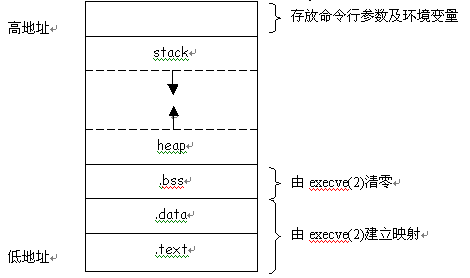

# 网易 2018 校园招聘测试开发工程师笔试卷

## 1

以下 python 代码输出为

```cpp
>>> a=[1,2,3]
>>> b=a
>>> b[:] = [x+1 for x in a]
>>> print a, b
>>> b = [x-1 for x in a]
>>> print a, b

```

正确答案: A   你的答案: 空 (错误)

```cpp
[2, 3, 4] [2, 3, 4]<br>[2, 3, 4] [1, 2, 3]
```

```cpp
[1, 2, 3] [2, 3, 4]<br>[1, 2, 3] [1, 2, 3]
```

```cpp
[2, 3, 4] [2, 3, 4]<br>[1, 2, 3] [1, 2, 3]
```

```cpp
[1, 2, 3] [2, 3, 4]<br>[1, 2, 3] [2, 3, 4]
```

本题知识点

网易 测试开发工程师 网易 2018

## 2

java 中，关于 synchronized 关键字的说法错误的是？（ ）

正确答案: D   你的答案: 空 (错误)

```cpp
可以修饰类的静态方法
```

```cpp
可以修饰类的非静态方法
```

```cpp
可以修饰某一段代码块
```

```cpp
可以修饰类的属性
```

本题知识点

网易 测试开发工程师 网易 2018

## 3

Ｃ/Ｓ结构软件测试时，以下哪个选项是Ｂ/Ｓ测试时所不需要的？

正确答案: A   你的答案: 空 (错误)

```cpp
客户端专用软件安装包的正常安装测试
```

```cpp
浏览器能否正常打开网页的测试
```

```cpp
数据库是否正常连接的测试
```

```cpp
通过数据库交互取得的数据正确性测试
```

本题知识点

网易 测试开发工程师 网易 2018

## 4

需求文档里，文本输入框（textbox）长度要求 1~100 个字，需要以下哪些测试用例？Ａ）0 个文字输入Ｂ）纯英文，纯汉字，英文与汉字结合 1~100 输入Ｃ）全半角输入 D）能否完整显示输入的内容

正确答案: C   你的答案: 空 (错误)

```cpp
ACD
```

```cpp
ABD
```

```cpp
ABCD
```

```cpp
BCD
```

本题知识点

网易 测试开发工程师 2018

## 5

对于需求文档的测试，是在以下哪个阶段进行？

正确答案: C   你的答案: 空 (错误)

```cpp
单元测试
```

```cpp
集成测试
```

```cpp
系统测试
```

```cpp
验收测试
```

本题知识点

网易 测试开发工程师 网易 2018

讨论

[MambaHJ](https://www.nowcoder.com/profile/743392944)

单元测试：软件设计文档集成测试：软件结构设计文档配置项测试：需求规格说明书系统测试：用户需求验收测试：软件研制合同（用户需求或系统需求）

发表于 2019-08-01 22:28:01

* * *

## 6

关于 linux 中 shell 变量$,下面那个说法是错误的?

正确答案: C   你的答案: 空 (错误)

```cpp
$0 是脚本本身的名字
```

```cpp
$@ 是传给脚本的所有参数的列表
```

```cpp
$1 是传递给该 shell 脚本的第二个参数
```

```cpp
$$ 是脚本运行的当前进程 ID 号
```

本题知识点

网易 测试开发工程师 网易 2018

讨论

[MambaHJ](https://www.nowcoder.com/profile/743392944)

| $0 | 当前脚本的文件名 |
| $n | 传递给脚本或函数的参数。n 是一个数字，表示第几个参数。例如，第一个参数是$1，第二个参数是$2。 |
| $# | 传递给脚本或函数的参数个数。 |
| $* | 传递给脚本或函数的所有参数。 |
| $@ | 传递给脚本或函数的所有参数。被双引号(" ")包含时，与 $* 稍有不同，下面将会讲到。 |
| $? | 上个命令的退出状态，或函数的返回值。 |
| $$ | 当前 Shell 进程 ID。对于 Shell 脚本，就是这些脚本所在的进程 ID。 |

发表于 2019-08-01 22:33:14

* * *

## 7

下面关于 Linux 链接说法正确的是()

正确答案: D   你的答案: 空 (错误)

```cpp
符号链接又被称为硬链接
```

```cpp
硬链接可以跨文件系统，软链接不可以
```

```cpp
软链接不可以对一个不存在的文件名进行链接
```

```cpp
软链接可以对目录进行链接
```

```cpp
硬链接指向是的不同的 inode 节点
```

本题知识点

网易 测试开发工程师 网易 2018

讨论

[offercall 快点来好嘛](https://www.nowcoder.com/profile/4107414)

软链接：符号链接硬链接：实体链接尽管硬链接节省空间，也是 Linux 系统整合文件系统的传统方式，但是存在一些不足之处：
1.不允许给目录创建硬链接。
2.不可以在不同文件系统的文件间建立链接。因为 inode 是这个文件在当前分区中的索引值，是相对于这个分区的，当然不能跨越文件系统了。

发表于 2018-08-11 13:52:16

* * *

## 8

Linux 进程内存空间有以下几个部分:

> 1.stack 2.heap3.bss segment4.code segment/text segment5.data segment

它们从高地址到低地址的分布顺序为()

正确答案: B   你的答案: 空 (错误)

```cpp
45321
```

```cpp
12354
```

```cpp
45312
```

```cpp
21354
```

本题知识点

网易 测试开发工程师 网易 2018

讨论

[offercall 快点来好嘛](https://www.nowcoder.com/profile/4107414)



发表于 2018-08-11 13:56:42

* * *

## 9

设一组初始关键字记录关键字为(17,13,10,16,19,34,43,8),则以开头 17 为基准记录的一趟快速排序结束的结果为()

正确答案: B   你的答案: 空 (错误)

```cpp
13,8,10,16,17,34,43,19
```

```cpp
8,13,10,16,17,34,43,19
```

```cpp
8,13,10,16,17,43,34,19
```

```cpp
8,13,10,17,16,43,34,19
```

本题知识点

网易 测试开发工程师 网易 2018

讨论

[乱世小魔女](https://www.nowcoder.com/profile/628942604)

一趟快速排序的算法是：1）设置两个变量 i、j，排序开始的时候：i=0，j=N-1；2）以第一个数组元素作为关键数据，赋值给 key，即 key=A[0]；3）从 j 开始向前搜索，即由后开始向前搜索(j--)，找到第一个小于 key 的值 A[j]，将 A[j]和 A[i]的值交换；4）从 i 开始向后搜索，即由前开始向后搜索(i++)，找到第一个大于 key 的 A[i]，将 A[i]和 A[j]的值交换；5）重复第 3、4 步，直到 i=j； (3,4 步中，没找到符合条件的值，即 3 中 A[j]不小于 key,4 中 A[i]不大于 key 的时候改变 j、i 的值，使得 j=j-1，i=i+1，直至找到为止。找到符合条件的值，进行交换的时候 i， j 指针位置不变。另外，i==j 这一过程一定正好是 i+或 j-完成的时候，此时令循环结束）。

发表于 2019-08-02 16:02:26

* * *

## 10

某二叉查找树的每个节点存放一个整数,中序遍历该树得到的序列为 3,4,5，则该树的画法有多少种情况?

正确答案: C   你的答案: 空 (错误)

```cpp
3
```

```cpp
4
```

```cpp
5
```

```cpp
6
```

本题知识点

网易 测试开发工程师 网易 2018

讨论

[GrdT#](https://www.nowcoder.com/profile/9261897)


编辑于 2018-07-30 21:44:29

* * *

## 11

对于最大堆 64,42,58,23,36,47,56,11,22,27,4,2;删除掉最大元素后，调整后堆中元素为:

正确答案: D   你的答案: 空 (错误)

```cpp
56,42,58,23,36,47,2,11,22,27,4
```

```cpp
58,42,56,36,23,47,2,11,22,27,4
```

```cpp
58,42,56,23,36,47,11,2,22,27,4
```

```cpp
58,42,56,23,36,47,2,11,22,27,4
```

本题知识点

网易 测试开发工程师 网易 2018

## 12

一个简单无向图有 10 个顶点，11 条边，如果用邻接矩阵来存储它，那么矩阵里面会有多少个 0?

正确答案: D   你的答案: 空 (错误)

```cpp
11
```

```cpp
22
```

```cpp
89
```

```cpp
78
```

```cpp
无法表达
```

本题知识点

网易 测试开发工程师 网易 2018

讨论

[嘟嘟*嘟嘟](https://www.nowcoder.com/profile/655168562)

想问一下自身到自身的值不是 1 吗?

发表于 2020-09-12 07:37:06

* * *

[努力学习天天向上 _0](https://www.nowcoder.com/profile/308459851)

10*10-2*11

发表于 2020-08-08 14:26:28

* * *

## 13

有一个整数序列(1 到 7):2,3,_*,_*,7,1,5,中间二个数字 4,6 被墨水模糊了，看不清顺序了(不知道到底是 4,6 还是 6,4)，它所构成的二叉排序树 a，对 a 进行中序遍历，结果是()

正确答案: C   你的答案: 空 (错误)

```cpp
7-2-1-4-3-6-5
```

```cpp
1-3-5-2-4-6-7
```

```cpp
1-2-3-4-5-6-7
```

```cpp
5-6-3-4-1-2-7
```

```cpp
不能确定
```

本题知识点

网易 测试开发工程师 网易 2018

讨论

[康康萌萌](https://www.nowcoder.com/profile/384554346)

根据二叉排序树的特点：左子树节点值<根节点值<右子树节点值。因此中序遍历一个二叉排序树时可以得到一个递增有序序列。

发表于 2019-09-22 21:45:31

* * *

## 14

下面关于 java 内存区说法错误的是?

正确答案: C   你的答案: 空 (错误)

```cpp
类中的成员变量，存放在堆区
```

```cpp
方法中的局部变量，存放在栈区
```

```cpp
jvm 中的堆区和栈区是私有的，不能被线程共享
```

```cpp
方法区：又叫静态存储区，存放 class 文件和静态数据，线程共享
```

```cpp
常量区放未经 new 的常量
```

本题知识点

网易 测试开发工程师 网易 2018

## 15

依次要访问磁道为 21,45,42,6,81,13,78,当前磁头位于 42 号柱面，若用最短寻道时间优先磁盘调度算法，则访问序列为（）

正确答案: B   你的答案: 空 (错误)

```cpp
21,45,42,6,81,13,78
```

```cpp
42,45,21,13,6,78,81
```

```cpp
42,45,78,81,21,13,6
```

```cpp
42,45,78,81,6,13,21
```

```cpp
42,45,78,81,13,6,19
```

```cpp
42,21,13,6,81,78,45
```

本题知识点

网易 测试开发工程师 网易 2018

## 16

操作系统中，不同子线程会共享同一个父进程的?

正确答案: B   你的答案: 空 (错误)

```cpp
寄存器组的值
```

```cpp
文件描述符
```

```cpp
线程的堆栈
```

```cpp
错误返回码
```

本题知识点

网易 测试开发工程师 网易 2018

## 17

发送方在发送了一个 TCP 数据包之后，经过 RTO 时间，没有收到对方的确认数据包，则应该？

正确答案: C   你的答案: 空 (错误)

```cpp
停止通信
```

```cpp
检测网络
```

```cpp
重传
```

```cpp
直接发送下一个数据包
```

本题知识点

网易 测试开发工程师 网易 2018

讨论

[MambaHJ](https://www.nowcoder.com/profile/743392944)

超时重传是 TCP 协议保证数据可靠性的一个重要机制

发表于 2019-08-01 23:39:23

* * *

## 18

假设 TTL 的初始值为 3，两台主机之间存在 4 个路由器，则该数据包到达目的地后的 TTL 的值为

正确答案: D   你的答案: 空 (错误)

```cpp
1
```

```cpp
2
```

```cpp
3
```

```cpp
数据包无法到达
```

本题知识点

网易 测试开发工程师 网易 2018

讨论

[志愿当健身教练的程序鸢](https://www.nowcoder.com/profile/9816896)

生存时间（TTL）：数据报每经过一台路由器时，路由器将 TTL 值减 1，一旦 TTL＝0，系统就丢弃该数据报，并返回错误信息。这样避免了路由出现环路时数据报在路由器之间无休止地循环。

发表于 2019-08-01 23:00:19

* * *

[请叫我小吴](https://www.nowcoder.com/profile/693269216)

**可以观看百度百科短视频：****[`baike.baidu.com/item/TTL/130248?fr=aladdin`](https://baike.baidu.com/item/TTL/130248?fr=aladdin)**

发表于 2020-05-06 15:28:13

* * *

## 19

一个 bash shell 脚本上的第一行通常要加上下面哪一句？

正确答案: D   你的答案: 空 (错误)

```cpp
#/bin/csh
```

```cpp
#!/bin/sh
```

```cpp
#/bin/sh
```

```cpp
#!/bin/bash
```

本题知识点

网易 测试开发工程师 网易 2018

讨论

[志愿当健身教练的程序鸢](https://www.nowcoder.com/profile/9816896)

#!/bin/bash：第一行的内容指定了 shell 脚本解释器的路径，而且这个指定路径只能放在文件的第一行。第一行写错或者不写时，系统会有一个默认的解释器进行解释。

发表于 2019-08-01 23:15:20

* * *

## 20

create table counttest(name char(1), age char(2));insert into counttest(name, age)values('a','14'),('a','15'),('a','15'),('b',NULL),('b','16'),('c','17'),('d',null),('e','');select name, count(1),count(*),count(age), count(distinct(age))from counttest group by name;   查询结果是

正确答案: D   你的答案: 空 (错误)

```cpp
a 3 3 3 2<br>b 2 1 1 1<br>c 1 1 1 1<br>d 1 1 0 0<br>e 1 1 1 1
```

```cpp
a 3 3 3 2<br>b 2 1 2 2<br>c 1 1 1 1<br>d 1 1 1 1<br>e 1 1 1 1
```

```cpp
a 3 3 3 2<br>b 2 1 1 2<br>c 1 1 1 1<br>d 1 1 0 1<br>e 1 0 1 1
```

```cpp
a 3 3 3 2<br>b 2 2 1 1<br>c 1 1 1 1<br>d 1 1 0 0<br>e 1 1 1 1
```

本题知识点

网易 测试开发工程师 网易 2018

## 21

为了得到一个数的"相反数",我们将这个数的数字顺序颠倒,然后再加上原先的数得到"相反数"。例如,为了得到 1325 的"相反数",首先我们将该数的数字顺序颠倒,我们得到 5231,之后再加上原先的数,我们得到 5231+1325=6556.如果颠倒之后的数字有前缀零,前缀零将会被忽略。例如 n = 100, 颠倒之后是 1.

本题知识点

网易 模拟 字符串 *数学 栈 *测试开发工程师 2018** **讨论

[我真不会 Java](https://www.nowcoder.com/profile/224361099)

```cpp
public class testxf {
    public static void main(String[] args) {
        Scanner sin =new Scanner(System.in);
        int a = sin.nextInt();

        int temp = a;
        int a_1 = 0;
        while (temp>0){
            a_1=a_1*10+temp%10;
            temp/=10;
        }

        int result = a_1+a;
        System.out.println(result);
    }
}
```

发表于 2021-03-14 22:15:10

* * *

[jiangbingo](https://www.nowcoder.com/profile/952617383)

```cpp
class Solution(object):
    def sumWithReverse(self,num):
        str_num_reverse = str(num)[::-1]
        return sum(num+int(str_num_reverse))

```

发表于 2020-03-08 22:18:36

* * *

[MambaHJ](https://www.nowcoder.com/profile/743392944)

```cpp

	n =int(input())

	pre =n

	now =[]

	idx =1

	whilen:

	    now.append(n %10)

	    idx *=10

	    n //=10

	ans =0

	for idx, i in enumerate(now):

	    ans +=i *10**(len(now) -idx -1)

	ans +=pre

	print(ans) 

```

python3 解法

编辑于 2019-08-02 00:01:53

* * *

## 22

小易有一个长度为 N 的正整数数列 A = {A[1], A[2], A[3]..., A[N]}。
牛博士给小易出了一个难题:
对数列 A 进行重新排列,使数列 A 满足所有的 A[i] * Ai + 1 都是 4 的倍数。
小易现在需要判断一个数列是否可以重排之后满足牛博士的要求。

本题知识点

网易 数学 贪心 动态规划 数组 测试开发工程师 2018

讨论

[努力学习天天向上 _0](https://www.nowcoder.com/profile/308459851)

c4 为 4 的倍数 c2 为 2 的倍数 c1 为基数

c4 个数大于等于数列的一半 或 c4 个数大于等于 c1 个数 或 全都为 c2

发表于 2020-08-08 14:44:38

* * *

[kilowatt](https://www.nowcoder.com/profile/568097191)

你好，为什么我的输入和测试用例一样，

```cpp
#include <iostream>
#include <vector>
using namespace std;

int main(void)
{
    int turns;
    while(cin>>turns)
    {
        vector<vector<int>> table;
        for (int i=0;i<turns;i++)
        {
            int length;
            cin>>length;
            table.push_back({});
            table[i].resize(length);
            for (int k=0;k<length;k++)
            {
                int num;
                cin>>num;
                table[i][k]=num;
            }
        }
        for (int i=0;i<turns;i++)
        {
            int length=(int)table[i].size();
            int have=0;
            int have2=0;
            for (int k=0;k<length;k++)
            {
                if (table[i][k]%4==0)
                {
                    have+=1;
                }
                else if (table[i][k]%2==0)
                {
                    have2+=1;
                }
            }
            //have 最多能解决 havex2+1 个数，剩下的靠 have2 内部解决
            if (have2>=length-have*2-1)
            {
                cout<<"Yes"<<" ";
            }
            else
            {
                cout<<"No"<<" ";
            }
        }
        cout<<endl;
    }
}
```

但是却提示我通过 0 个用例？

发表于 2020-08-13 20:14:05

* * *

## 23

一个合法的括号匹配序列被定义为:
1\. 空串""是合法的括号序列
2\. 如果"X"和"Y"是合法的序列,那么"XY"也是一个合法的括号序列
3\. 如果"X"是一个合法的序列,那么"(X)"也是一个合法的括号序列
4\. 每个合法的括号序列都可以由上面的规则生成
例如"", "()", "()()()", "(()())", "(((()))"都是合法的。
从一个字符串 S 中移除零个或者多个字符得到的序列称为 S 的子序列。
例如"abcde"的子序列有"abe","","abcde"等。
定义 LCS(S,T)为字符串 S 和字符串 T 最长公共子序列的长度,即一个最长的序列 W 既是 S 的子序列也是 T 的子序列的长度。
小易给出一个合法的括号匹配序列 s,小易希望你能找出具有以下特征的括号序列 t:
1、t 跟 s 不同,但是长度相同
2、t 也是一个合法的括号匹配序列
3、LCS(s, t)是满足上述两个条件的 t 中最大的
因为这样的 t 可能存在多个,小易需要你计算出满足条件的 t 有多少个。

如样例所示: s = "(())()",跟字符串 s 长度相同的合法括号匹配序列有:
"()(())", "((()))", "()()()", "(()())",其中 LCS( "(())()", "()(())" )为 4,其他三个都为 5,所以输出 3.

本题知识点

网易 字符串 *贪心 栈 *穷举 哈希 *测试开发工程师 2018*** ***## 24

现在我们这里有一份网站请求日志，是用户使用不同的浏览器，随机输入字符串请求结果，简化后请求日志格式如下：chrome43:EOGBNIATWPYO899KNWCPGEHchrome47:47JB7X618ZRHAWL9C9WDYZVQB6SGKJC84JGchrome45:0UQFUGF761Z841CA7PTTNJ4LYFS3OBPJZGfirefox60:69PM8FLAVRQUUL5CY0VUNH9CEY45HX403chrome49:5ERXVK5J5PCXAGL1KXFX7TPchrome58:NMALPL5JMSGGY8OUX4W8Nchrome57:B74W7LL4LSUEOJ3Y5RYMHBERHI4ie5:KHPLTNUCZ3WZC60KJWDFVIH13UIO5ie6:JDOW8E9NIH80J540EI2YGX3CDie8:HUCH9PU815DKD918QJRNBXHHfirefox57:YCSP8KX81QTE92X8HBDYRL8chrome60:PPZMZ589G3UUMTOZXA50C380EXP5LDfirefox38:AFOQAY02Z4BSVICQ55CJZRHKRHF4FNR07Eie8:2LCXUP9MYBWIDX7XZYVF2B3Rie7:RDYA221MXOI4G3QP3XZ1ICMIOAIHXTJYEC3PSTAOie6:FEIRYYVU61VHYQ660YP8OM2ZNchrome40:R9QN5PD8Z73VHHJ3U0ZSEIHKCB5NJI992BGB03Z3……现在要求：1.  根据访问日志，统计 chrome45 版本以上的 chrome 浏览器的访问频次，按照由高到低进行排序输出。请写程序实现这个需求。（如果可以不使用语言自带的排序函数，请自己实现任意一种排序函数）。输出的格式如下：chrome51：600chrome46：450chrome47：230……

你的答案

本题知识点

网易 测试开发工程师 2018

讨论

[lalalalaladdd](https://www.nowcoder.com/profile/540249292)

```cpp
python 解法：用字典存储浏览器版本：频次
版本匹配使用正则表达式
import re
f = open('log.txt')
chrome={}
while True:
    line = f.readline()
    if not line:
        break
    if re.match(r'chrome4[6-9]|chrome[5-9]\d',line):
        if line[:8] not in chrome:
            chrome[line[:8]]=1
        else:
            chrome[line[:8]]+=1
print(chrome)
```

发表于 2019-07-28 16:48:16

* * *

## 25

对最近请求的过来的两条字符串（即最后两条），写程序找到最长公共子串。

你的答案

本题知识点

网易 测试开发工程师 2018

讨论

[牛客 282476631 号](https://www.nowcoder.com/profile/282476631)

public String getCommon(String s1,String s2){int n1=s1.length(),n2=s2.length(),max=0;String s="";
if(s1==null || s2==null ||n1==0 || n2==0){
          return s;}
 int[][]a=new int[n1+1][n2+1];for(int i=1;i<=n1;i++){for(int j=1;j<=n2;j++){if(s.charAt(i-1)==s.charAt(j-1)){ a[i][j]=a[i-1][j-1]+1;}
}
}for(int i=1;i<=n1;i++){for(int j=1;j<=n2;j++){if(a[i][j]>=max){max=a[i][j];
}
}
}s=s1.substring(i-max,i);return s;
}

发表于 2018-07-22 08:13:52

* * *

## 26

假设你从 Stack Overflow 上找到了一个寻找最长公共字串的算法或者是一个函数，请写出该函数的单元测试用例，验证该函数的正确性。

你的答案

本题知识点

网易 测试开发工程师 2018

讨论

[牛客 282476631 号](https://www.nowcoder.com/profile/282476631)

```cpp
import java.util.Scanner;
public class Main{
public static void main(String[]args){
Scanner sc=new Scanner(System.in); String s1=sc.nextLine();  String s2=sc.nextLine(); System.out.println(getCommon(s1,s2));
 }
}

```

发表于 2018-07-22 08:54:33

* * *

## 27

我们电商某个秒杀系统，数据库结构如下：秒杀库存表： 商品 id（主键），商品名称，商品库存数量，秒杀开始时间，结束时间，商品创建时间，商品价格秒杀成功明细表： 秒杀商品 id，用户手机号，秒杀状态标识，创建时间 a. 完成以上两个表的建表语句，满足以下要求：秒杀库存表中，商品 id 为唯一主键。秒杀库存表中秒杀商品 id 和用户手机号为联合主键。b. 完成 sql 语句. 查询出手机号 13800000000 所有秒杀成功的商品，按照价格由高到低进行排列 (状态标识:-1:无效 0:成功 1:已付款 2:已发货)

你的答案

本题知识点

网易 测试开发工程师 2018*****