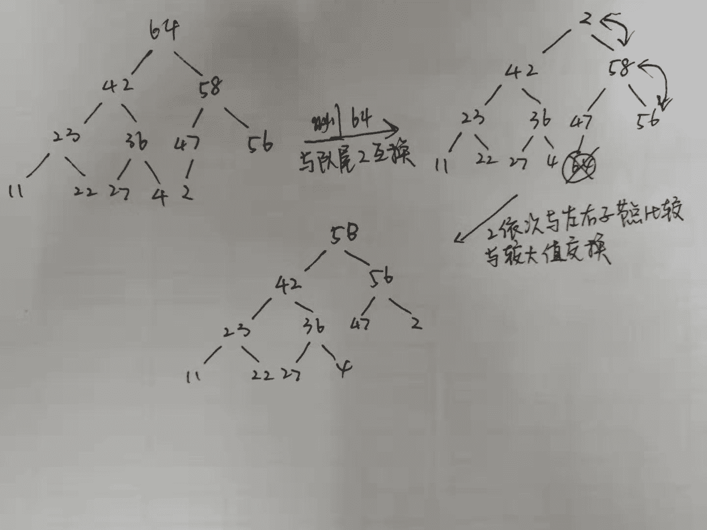

# 网易 2018 校园招聘机器学习算法工程师笔试卷

## 1

以下 python 代码输出为

```cpp
>>> a = [1, 2, 3]
>>> b = a
>>> a.append(4)
>>> b.append(5)
>>> print a, b

```

正确答案: A   你的答案: 空 (错误)

```cpp
[1, 2, 3, 4, 5] [1, 2, 3, 4, 5]
```

```cpp
[1, 2, 3, 4] [1, 2, 3, 4, 5]
```

```cpp
[1, 2, 3, 4, 5] [1, 2, 3, 5]
```

```cpp
[1, 2, 3, 4] [1, 2, 3, 5]
```

本题知识点

网易 算法工程师 算法工程师 网易 2018

讨论

[ndrea](https://www.nowcoder.com/profile/828209811)

a 跟 b 是一摸一样的。不仅是值还包括分配的内存地址。就是 a 就是 b

发表于 2019-05-31 13:38:05

* * *

[johline123](https://www.nowcoder.com/profile/5509157)

a = [1, 2, 3]
b = a[:]#a[:] 會製造一個 a 的副本, 所以 b=a[:] 會讓 b 參考到這個副本, 也就是說 b 跟 a 現在參考到不同的對象, 只是這兩個對象是相等的 b=a#會讓 b 參考到 a 參考的對象

发表于 2018-05-30 09:38:17

* * *

[Moralz](https://www.nowcoder.com/profile/790189302)

赋值引用，是把 a 的引用复制给 b，b 指向 a 指向的地址空间。 append 的话，是在原有 a 和 b 指向的地址空间操作数据，指向的[1，2，3]会改变。 如果重新给 b 进行赋值，b 引用就会变更指向新数据，原有 a 指向的数据〔1，2，3〕不变。

发表于 2019-09-19 21:32:49

* * *

## 2

以下 python 代码输出为

```cpp
>>> a=[1,2,3]
>>> b=a
>>> b[:] = [x+1 for x in a]
>>> print a, b
>>> b = [x-1 for x in a]
>>> print a, b

```

正确答案: A   你的答案: 空 (错误)

```cpp
[2, 3, 4] [2, 3, 4]<br>[2, 3, 4] [1, 2, 3]
```

```cpp
[1, 2, 3] [2, 3, 4]<br>[1, 2, 3] [1, 2, 3]
```

```cpp
[2, 3, 4] [2, 3, 4]<br>[1, 2, 3] [1, 2, 3]
```

```cpp
[1, 2, 3] [2, 3, 4]<br>[1, 2, 3] [2, 3, 4]
```

本题知识点

网易 算法工程师 算法工程师 网易 2018

讨论

[入驻长安街](https://www.nowcoder.com/profile/7945736)

切片操作呢，是改变所指存储空间的值；赋值操作呢，是改变所指存储空间位置；

发表于 2018-09-06 16:34:29

* * *

[王威 _ucas](https://www.nowcoder.com/profile/725237676)

b=a 之后，对 b 进行 append 之类的操作，a 和 b 都会同时变，因为此时他们指向的是同一块内存。但是如果用 b=[2,3,4]这类的赋值操作，相当于新建一块内存，b 由原来的指向 a 对应的地址变成指向新的地址，a 和 b 就没有关系了。但是 b[:]=，这样切片是和 append 类似的，不会改变地址。

发表于 2020-10-09 14:09:40

* * *

[王翠花](https://www.nowcoder.com/profile/68061747)

a = [1, 2, 3]
b = a[:]  # 切片
a[1:] = []  # 切片赋值
切片[:]在右侧，切片赋值[:]在左侧；

切片是浅拷贝，不影响原序列； 
切片赋值是针对原序列进行操作，改变切片区域的序列。 

b[:] = [x+1 for x in a]①其实是用 a 列表生成了一个+1 的列表，这个+1 的列表与 a 地址不同元素值也+1 了，但是 b=a 时已经让 b 在 a 的地址上了，所以这时 b[:] 切片赋值操作改变了 b 地址上的值，也就是 a 地址上的值

b = [x-1 for x in a]②其实就是用 a 列表生成了一个-1 的列表，这时 b 的地址为这个-1 的列表的地址。换了一个地址也就和 a 没有关系了

编辑于 2019-08-03 00:02:47

* * *

## 3

以下关于 importance sampling 说法正确的是

正确答案: D   你的答案: 空 (错误)

```cpp
importance sampling 需要计算抽样分布的归一化参数
```

```cpp
importance sampling 需要计算实际分布的归一化参数
```

```cpp
importance sampling 需要同时计算两个分布的归一化参数
```

```cpp
importance sampling 不需要计算两个分布的归一化参数
```

本题知识点

网易 算法工程师 2018

## 4

以下集合是凸集的是

正确答案: A   你的答案: 空 (错误)

```cpp
{(x,y) |y=x+1}
```

```cpp
{(x,y) | x 的平方 + y 的平方 = 1}
```

```cpp
{(x,y) | x 的平方 + y 的平方 &gt; 1 }
```

```cpp
{(x,y) |x=1 | y=1 }
```

本题知识点

网易 算法工程师 算法工程师 网易 2018

讨论

[凡事盼望](https://www.nowcoder.com/profile/665491)

凸集，实数*R*上（或复数*C*上）的向量空间中，如果集合*S*中任两点的连线上的点都在*S*内，则称集合*S*为凸集。

*   所以直线是凸集，A 正确。
*   {(x, y)| x² + y² <= 1}是凸集。
*   C 选项恰好是圆形外面的区域，而任意两点连线上的点在圆形。
*   D 选项是两条直线。

发表于 2018-05-27 10:19:47

* * *

[我要 offer 求你了](https://www.nowcoder.com/profile/496712975)

集合里任意选两个点，他们连线上的任意点也在集合中，叫凸集合

发表于 2020-02-05 20:10:39

* * *

[Maple_2005](https://www.nowcoder.com/profile/203246634)

注意 B 是一个圆，但仅仅是一个圆不包括内部，如果包括内部就也是个凸集了

发表于 2020-07-18 04:13:26

* * *

## 5

以下关于谱聚类说法错误的是

正确答案: C   你的答案: 空 (错误)

```cpp
kmean 无法很好的处理非凸的聚类簇，而谱聚类作为一种扩展可以较好的处理
```

```cpp
谱聚类是一种基于图论的聚类算法，将带权无向图划分为两个或两个以上的最优子图，使子图内部尽量相似，而子图间距离尽量距离较远，以达到常见的聚类的目的
```

```cpp
谱聚类中可以通过 SVD 进行降维，降维后的特征维度与聚类簇的数量一致
```

```cpp
谱聚类通过将离散问题连续化，通过 Rayleigh quotient 将特征向量和特征值与最小割问题建立联系
```

本题知识点

网易 算法工程师 算法工程师 网易 2018

讨论

[虎王 tank](https://www.nowcoder.com/profile/9372118)

谱聚类通过拉普拉斯矩阵进行矩阵变形处理

发表于 2018-08-04 14:16:03

* * *

## 6

ID3 算法在分类树构建中， 使用哪个度量来进行分类节点

正确答案: B   你的答案: 空 (错误)

```cpp
gini 指标
```

```cpp
信息增益
```

```cpp
信息增益率
```

```cpp
准确率
```

本题知识点

网易 算法工程师 算法工程师 网易 2018

讨论

[*feather*](https://www.nowcoder.com/profile/4956631)

ID3 信息增益；C4.5 信息增益率；CART 基尼指数。

发表于 2018-08-11 11:55:38

* * *

## 7

以下关于 Linear discriminant analysis（LDA）说法错误的是;

正确答案: B   你的答案: 空 (错误)

```cpp
LDA 假设每个类别的密度分布为高斯分布
```

```cpp
LDA 假设每个类之间的协方差矩阵都是对角阵
```

```cpp
LDA 假设每个类之间的协方差矩阵都相同
```

```cpp
LDA 的分界面为线性的
```

本题知识点

网易 算法工程师 算法工程师 网易 2018

讨论

[SillyCoderrrr](https://www.nowcoder.com/profile/82899155)

在 **LDA** 的情况下，假设每个类的高斯共享相同的协方差矩阵在 **QDA** 模型中，假设协方差矩阵是对角线的，则假设输入在每个类中是条件独立的，并且所得分类器等价于高斯朴素贝叶斯分类器 

发表于 2019-04-12 15:56:45

* * *

## 8

在测度论中，以下哪个性质不是 field（F）的

正确答案: D   你的答案: 空 (错误)

```cpp
Ω∈F
```

```cpp
A∈F,则 Ac∈F
```

```cpp
A,B∈F,则 union(A,B) ∈F
```

```cpp
A1,A2…∈F,union(A1,A2…) ∈F
```

本题知识点

网易 算法工程师 算法工程师 网易 2018

## 9

对于最大堆 64,42,58,23,36,47,56,11,22,27,4,2;删除掉最大元素后，调整后堆中元素为:

正确答案: D   你的答案: 空 (错误)

```cpp
56,42,58,23,36,47,2,11,22,27,4
```

```cpp
58,42,56,36,23,47,2,11,22,27,4
```

```cpp
58,42,56,23,36,47,11,2,22,27,4
```

```cpp
58,42,56,23,36,47,2,11,22,27,4
```

本题知识点

网易 算法工程师 算法工程师 网易 2018

讨论

[malofleur](https://www.nowcoder.com/profile/232267)



发表于 2019-07-19 09:15:22

* * *

## 10

下面关于排序的空间复杂度说法不正确的有()(N 为被排序数据的长度)

正确答案: D   你的答案: 空 (错误)

```cpp
堆排序的空间复杂度为 O(1)
```

```cpp
冒泡排序的空间复杂度为 O(1)
```

```cpp
归并排序的空间复杂度为 O(N)
```

```cpp
插入排序的空间复杂度为 O(N)
```

```cpp
递归实现的快速排序的空间复杂度为 O(logn)
```

本题知识点

网易 算法工程师 算法工程师 网易 2018

## 11

一个简单无向图有 10 个顶点，11 条边，如果用邻接矩阵来存储它，那么矩阵里面会有多少个 0?

正确答案: D   你的答案: 空 (错误)

```cpp
11
```

```cpp
22
```

```cpp
89
```

```cpp
78
```

```cpp
无法表达
```

本题知识点

网易 算法工程师 算法工程师 网易 2018

讨论

[码破苍穹](https://www.nowcoder.com/profile/4277728)

100-11*2=78

发表于 2018-07-21 11:06:26

* * *

## 12

由递归方式求的 N 的阶乘(即 N！)，时间复杂度是多少?

正确答案: D   你的答案: 空 (错误)

```cpp
O(N!)
```

```cpp
O(logN)
```

```cpp
O(N²)
```

```cpp
O(N)
```

```cpp
O(NlogN)
```

本题知识点

网易 算法工程师 算法工程师 网易 2018

## 13

将一颗有 346 个结点的完全二叉树从根这一层开始，进行广度遍历编号(从 1 开始编号)，那么编号最小的叶节点的编号是（）

正确答案: D   你的答案: 空 (错误)

```cpp
171
```

```cpp
172
```

```cpp
173
```

```cpp
174
```

```cpp
175
```

本题知识点

网易 算法工程师 算法工程师 网易 2018

讨论

[龙大鱼](https://www.nowcoder.com/profile/1022679)

偶数，说明非满二叉树， 叶子节点在上一层，也就是 346 // 2 + 1 = 174

发表于 2018-05-29 10:22:39

* * *

[yangyangyang111](https://www.nowcoder.com/profile/595229928)

第一行 1 个，第二行 2 个，第三行 4 个，第四行 8 个。。。第八行 128 个，前八行排到 255 号，346 号在第九行，从第八行第一个节点 128 号开始，128+（（346-256）/2） +1

发表于 2020-09-12 16:01:48

* * *

[即将成为内推官](https://www.nowcoder.com/profile/270582773)

128+（（345-255）-1）/2+1

发表于 2020-05-18 22:45:32

* * *

## 14

有如下代码:

```cpp
struct A1{
    virtual ~A1(){}
};
struct A2{
    virtual ~A2(){}
};
struct B1 : A1, A2{};
int main()
{
 B1 d;
 A1* pb1 = &d;
 A2* pb2 = dynamic_cast<A2*>(pb1);  //L1
 A2* pb22 = static_cast<A2*>(pb1);  //L2
 return 0;
}
```

下面说法正确的是（）

正确答案: B   你的答案: 空 (错误)

```cpp
L1 语句编译失败，L2 语句编译通过
```

```cpp
L1 语句编译通过，L2 语句编译失败
```

```cpp
L1，L2 都编译失败
```

```cpp
L1，L2 都编译通过
```

本题知识点

网易 算法工程师 2018 C 语言

讨论

[hwzub](https://www.nowcoder.com/profile/435703816)

1\. static_cast 关键字（编译时类型检查）直接检查表达式括号里面的类型 pb1 是 A1* 类型，不能转 A2(1)没有虚函数同样可以编译通过;(2)用于非多态类型转换(静态转换)，任何标准转换都可以用它，最常用的类型转换符，用于基本数据类型之间的转换，如把 int 转换为 char,但是不能用于两个不相关的类型转换。(3)用于类层次结构中基类和派生类之间指针或引用的转换，                             
    上行转换（派生类---基类）是安全的，与 dynamic_cast 效果相同;    
    下行转换（基类---派生类）由于没有动态类型检查，所以是不安全的;   
(4) 把空指针转换成目标类型的空指针                
(5) 把任何类型的表达式转为 void 类型           
(6) static_cast 不能转换掉 expression 的 const、volatile、或者 __unaligned 属性 2\. dynamic_cast 关键字（运行时类型检查）
检查表达式指针指向的对象类型。pb1 是 B1 类型，可以转 A2(1)dynamic_cast 只能用于有虚函数的类（必须有共有继承和虚函数)，为运行时转换，由于运行时类型检查需要运行时类型信息，而这个信息存储在类的虚函数表中，只有定义了虚函数的类才有虚函数表，没有定义虚函数的类是没有虚函数表的；如果父类没有虚函数，编译报错(2)用于类层次结构中基类和派生类之间指针或引用的转换, 
        上行转换（派生类--->基类）是安全的，与 static_cast 效果相同;
        下行转换（基类--->派生类）具有类型检查的功能，转型是安全的，
        当类型不一致时，转换过来的是空指针;
(3)先检查能否转型成功，能成功则转型，不能成功则返回 0  

发表于 2021-11-30 23:33:07

* * *

[雪松路吴彦祖](https://www.nowcoder.com/profile/600590199)

按照热评的说法 static 直接检查表达式括号里的类型 dynamic 检查对象

发表于 2022-03-17 13:31:09

* * *

[牛客 813707180 号](https://www.nowcoder.com/profile/813707180)

dynamic-cast<T*>（地址 a）如果类型 T 不是 a 的某个基类型，该操作将返回一个空指针

发表于 2020-09-03 10:42:47

* * *

## 15

操作系统中，不同子线程会共享同一个父进程的?

正确答案: B   你的答案: 空 (错误)

```cpp
寄存器组的值
```

```cpp
文件描述符
```

```cpp
线程的堆栈
```

```cpp
错误返回码
```

本题知识点

网易 算法工程师 算法工程师 网易 2018

## 16

下面关于 TCP 和 UDP 说法正确的是?

正确答案: A   你的答案: 空 (错误)

```cpp
在 TCP/UDP 传输段中，源端口地址和目的端口地址是不能相同的
```

```cpp
当客户端和服务器建立的是 TCP 连接的时候，服务器最后如果想要断开直接断开连接，停止发送数据就好了
```

```cpp
UDP 是用户数据报协议，是一个简单的面向数据报的应用层协议
```

```cpp
UDP 在传输数据报前不用在客户和服务器之间建立一个连接，但是也有超时重发的机制
```

```cpp
UDP 的传输速度优于 TCP
```

本题知识点

网易 算法工程师 算法工程师 网易 2018

讨论

[SillyCoderrrr](https://www.nowcoder.com/profile/82899155)

TCP 建立连接需要三次握手，断开连接需要四次握手  
UDP 是用户数据报协议，是一个简单的面向无连接的，不可靠的数据报的传输层协议
UDP 在传输数据报前不用在客户和服务器之间 建立一个连接，且没有超时重发等机制

编辑于 2019-04-12 16:55:35

* * *

## 17

数字图像处理中常使用主成员分析（PCA）来对数据进行降维，下列关于 PCA 算法错误的是：

正确答案: C   你的答案: 空 (错误)

```cpp
PCA 算法是用较少数量的特征对样本进行描述以达到降低特征空间维数的方法；
```

```cpp
PCA 本质是 KL-变换；
```

```cpp
PCA 是最小绝对值误差意义下的最优正交变换；
```

```cpp
PCA 算法通过对协方差矩阵做特征分解获得最优投影子空间，来消除模式特征之间的相关性、突出差异性；
```

本题知识点

网易 算法工程师 算法工程师 网易 2018

讨论

[SillyCoderrrr](https://www.nowcoder.com/profile/82899155)

PCA 算法的本质 K- L 变换：最优正交变换  1、一种常用的特征提取方法；
2、最小均方误差意义下的最优正交变换；
3、在消除模式特征之间的相关性、突出差异性方面有最优的效果。

发表于 2019-04-12 17:02:37

* * *

[俯仰之间张建华](https://www.nowcoder.com/profile/5153887)

是最小均方误差的最优正交变换

发表于 2018-08-09 21:25:22

* * *

[我要一桶浆糊](https://www.nowcoder.com/profile/384439973)

不一定是最优的正交变换

发表于 2018-08-07 15:01:53

* * *

## 18

CNN 神经网络对图像特征提取带来了变革性的变化，使之前的人工特征提取升级到数据驱动的自动特征提取，在 CNN 中，起到特征提取作用的网络层是：

正确答案: A   你的答案: 空 (错误)

```cpp
convolution 层
```

```cpp
full connect 层
```

```cpp
max pooling 层
```

```cpp
norm 层
```

本题知识点

网易 算法工程师 算法工程师 网易 2018

讨论

[SillyCoderrrr](https://www.nowcoder.com/profile/82899155)

卷积层负责提取特征，采样层负责特征选择，全连接层负责分类

发表于 2019-04-12 17:12:48

* * *

## 19

shell 中，如果想匹配以 wangyi 开头的行，应该采用下面的哪个正则表达式？

正确答案: A   你的答案: 空 (错误)

```cpp
^wangyi
```

```cpp
wangyi$
```

```cpp
\wangyi
```

```cpp
*wangyi
```

本题知识点

网易 算法工程师 算法工程师 网易 2018

讨论

[我要一桶浆糊](https://www.nowcoder.com/profile/384439973)

^表示开头，$表示结尾

发表于 2018-08-07 15:05:40

* * *

## 20

小易准备去魔法王国采购魔法神器,购买魔法神器需要使用魔法币,但是小易现在一枚魔法币都没有,但是小易有两台魔法机器可以通过投入 x(x 可以为 0)个魔法币产生更多的魔法币。
魔法机器 1:如果投入 x 个魔法币,魔法机器会将其变为 2x+1 个魔法币
魔法机器 2:如果投入 x 个魔法币,魔法机器会将其变为 2x+2 个魔法币
小易采购魔法神器总共需要 n 个魔法币,所以小易只能通过两台魔法机器产生恰好 n 个魔法币,小易需要你帮他设计一个投入方案使他最后恰好拥有 n 个魔法币。

本题知识点

网易 算法工程师 数学 贪心 模拟 2018

讨论

[牛客 6553333 号](https://www.nowcoder.com/profile/6553333)

```cpp
# 倒推
num = int(input())
res = '' 
while num > 0:  
    if num % 2 == 0:  
        res = '2' + res
        num = (num-2)//2  
    else:  
        res = '1' + res
        num = (num-1)//2
print(res)
```

编辑于 2018-08-08 09:16:59

* * *

[我要一桶浆糊](https://www.nowcoder.com/profile/384439973)

```cpp
target = int(input())
# 变成偶数那一步一定是用了 2，变成奇数那一步一定是用了 1
result = []
while target:
    if target % 2 == 0:
        # 是偶数，用了 2
        result.append(2)
        target = (target - 2) / 2
    else:
        result.append(1)
        target = (target - 1) / 2

for i in range(len(result) - 1, -1, -1):
    print(result[i], end='') 
```

编辑于 2018-08-07 16:20:08

* * *

[initial_point](https://www.nowcoder.com/profile/600258341)

```cpp
def machine1(x): return int((x-1)/2) def machine2(x): return int((x-2)/2) if __name__ == "main":
out = []
n = eval(input('请输入几个魔法币\n')) while n: if n%2==1:
        n = machine1(n)
        out.append('1') print(n) if n%2==0:
        n = machine2(n)
        out.append('2') print('2')
out.reverse()
res = ''.join(out) print(res)
```

发表于 2019-09-04 16:46:07

* * *

## 21

小易有一个长度为 N 的正整数数列 A = {A[1], A[2], A[3]..., A[N]}。
牛博士给小易出了一个难题:
对数列 A 进行重新排列,使数列 A 满足所有的 A[i] * Ai + 1 都是 4 的倍数。
小易现在需要判断一个数列是否可以重排之后满足牛博士的要求。

本题知识点

网易 算法工程师 数学 贪心 动态规划 数组 2018

讨论

[我要一桶浆糊](https://www.nowcoder.com/profile/384439973)

```cpp
# 数列个数
nums = int(input())
for i in range(nums):
    # 对每个数列进行处理
    n = int(input())  # 数列长度
    A = list(map(int, input().split(' ')))
    # 思路：统计出奇数、4 的倍数、非 4 的倍数的偶数的个数，分别记为（a,b,c），分情况考虑：
    # 1、a<=b 时，YES；2、当 a=b+1 and c==0 时，YES；3、否则 NO
    a = b = c = 0
    for num in A:
        if num % 2 == 1:
            a += 1
        else:
            if num % 4 == 0:
                b += 1
            else:
                c += 1
    # 判断
    if a <= b:
        print('Yes')
    elif a == b + 1 and c == 0:
        print('Yes')
    else:
        print('No') 
```

发表于 2018-08-07 16:20:43

* * *

## 22

一个合法的括号匹配序列被定义为:
1\. 空串""是合法的括号序列
2\. 如果"X"和"Y"是合法的序列,那么"XY"也是一个合法的括号序列
3\. 如果"X"是一个合法的序列,那么"(X)"也是一个合法的括号序列
4\. 每个合法的括号序列都可以由上面的规则生成
例如"", "()", "()()()", "(()())", "(((()))"都是合法的。
从一个字符串 S 中移除零个或者多个字符得到的序列称为 S 的子序列。
例如"abcde"的子序列有"abe","","abcde"等。
定义 LCS(S,T)为字符串 S 和字符串 T 最长公共子序列的长度,即一个最长的序列 W 既是 S 的子序列也是 T 的子序列的长度。
小易给出一个合法的括号匹配序列 s,小易希望你能找出具有以下特征的括号序列 t:
1、t 跟 s 不同,但是长度相同
2、t 也是一个合法的括号匹配序列
3、LCS(s, t)是满足上述两个条件的 t 中最大的
因为这样的 t 可能存在多个,小易需要你计算出满足条件的 t 有多少个。

如样例所示: s = "(())()",跟字符串 s 长度相同的合法括号匹配序列有:
"()(())", "((()))", "()()()", "(()())",其中 LCS( "(())()", "()(())" )为 4,其他三个都为 5,所以输出 3.

本题知识点

网易 算法工程师 字符串 *贪心 栈 *穷举 哈希 *2018*** ***讨论

[我要一桶浆糊](https://www.nowcoder.com/profile/384439973)

```cpp
def isValid(str):
    # 判断该字符串是否是合法的括号序列
    stack = []
    for i in range(len(str)):
        if str[i] == '(':
            stack.append(str[i])
        else:
            # 去 stack 里匹配一个左括号
            if len(stack) == 0 or stack[-1] != '(':
                return False
            else:
                stack.pop()

    return not stack

# 得到输入字符串
input_str = input()
n = len(input_str)
# 思路：取出字符串中的某一个字符 c，得到一个剩余字符串 remain_str，依次把 c 插入到 remain_str 中
# 得到新的字符串，如果该字符串是合法的括号序列，并且与源字符串不相等，则个数加 1
# 关键点：对于 LCS(s, t)，必然会存在长度为 len(s) - 1 的公共子序列
count = 0
new_str_list = []
for i in range(n):
    c = input_str[i]
    remain_str = input_str[:i] + input_str[i + 1:]
    # 分别把 c 插入到 remain_str 中
    for j in range(len(remain_str) + 1):
        new_str = remain_str[:j] + c + remain_str[j:]
        # 判断 new_str 是否是合法的括号序列，并且与源字符串不相等，并且这个 new_str 也不能重复
        if new_str != input_str and isValid(new_str) and new_str not in new_str_list:
            new_str_list.append(new_str)
            count += 1

print(count) 
```

发表于 2018-08-07 16:21:14

* * *

[零葬](https://www.nowcoder.com/profile/75718849)

只要是移动原字符串一个字符所形成的其他字符串，一定和原字符串 str 有长度为 str.length() - 1 的最长公共子序列（注意不是最长公共子串，序列可以不连续），这样获得的合法括号序列均满足 LCS 最大的条件，于是采用暴力解法：

```cpp
import java.io.BufferedReader;
import java.io.InputStreamReader;
import java.io.IOException;
import java.util.HashSet;
import java.util.Stack;

public class Main {
    public static void main(String[] args) throws IOException {
        BufferedReader br = new BufferedReader(new InputStreamReader(System.in));
        String string;
        while((string = br.readLine()) != null)
            System.out.println(solve(string));
    }

    // 判断是否为合法的括号序列
    private static boolean isValid(String seq) {
        Stack<Character> stack = new Stack<>();
        for(int i = 0; i < seq.length(); i++){
            if(seq.charAt(i) == '(')
                stack.push('(');
            else{
                if(stack.isEmpty())
                    return false;
                else
                    stack.pop();
            }
        }
        return stack.isEmpty();
    }

    private static int solve(String s) {
        String s1, s2;
        HashSet<String> set = new HashSet<>();
        for(int i = 0; i < s.length(); i++){
            s1 = s.substring(0, i) + s.substring(i + 1);
            for(int j = 0; j < s1.length(); j++){
                s2 = s1.substring(0, j) + s.charAt(i) + s1.substring(j);
                // 如果是合法的括号序列则加入集合
                if(isValid(s2))
                    set.add(s2);
            }
        }
        return set.size() - 1;     // 把自己减去
    }
}
```

编辑于 2020-10-22 17:06:55

* * *

## 23

假设有一个成立了半年的电商网站，用户量 1000 万，商品量 1 万多，平均每个月会上架 2 千左右商品，同时淘汰下架 300 左右商品。现在交给你一个光荣而艰巨的任务，请你为这家电商网站设计一个推荐系统，从数据、算法、系统尽可能考虑周全。

你的答案

本题知识点

网易 算法工程师 2018

## 24

有一批 UGC 的文本数据，大概几千万条，其中有 2 万条因为涉及黄暴内容被抓了出来。但是由于人力有限，这几千万条文本中还有很多（可能几十万条）黄暴内容，请设计一个文本分类系统帮助解决这个问题，从数据、算法、系统尽可能考虑周全。

你的答案

本题知识点

网易 算法工程师 2018

## 25

下面针对 HashMap 的描述错误的有哪个?

正确答案: C   你的答案: 空 (错误)

```cpp
HashMap 的 key 能为 null
```

```cpp
HashMap 的 value 能为 null
```

```cpp
HashMap 的 hashcode 冲突时，会采用数组扩展方式解决
```

```cpp
HashMap 的 hashcode 冲突时，会采用链表扩展方式解决
```

本题知识点

网易 算法工程师 2018

讨论

[小熊猫的喵](https://www.nowcoder.com/profile/213933886)

HashMap 的底层主要是基于数组和链表来实现的，它之所以有相当快的查询速度主要是因为它是通过计算散列码来决定存储的位置。HashMap 中主要是通过 key 的 hashCode 来计算 hash 值的，只要 hashCode 相同，计算出来的 hash 值就一样。如果存储的对象对多了，就有可能不同的对象所算出来的 hash 值是相同的，这就出现了所谓的 hash 冲突。冲突处理主要分两种，一种是开放定址法，另一种是链地址法。HashMap 的实现中采用的是链地址法。

发表于 2019-01-07 17:17:35

* * ****