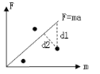

# 网易 2018 校园招聘人工智能工程师笔试卷

## 1

以下 python 代码输出为

```cpp
>>> val=[['a'] * 3] * 3
>>> val[0][0]='b'
>>> print val;

```

正确答案: B   你的答案: 空 (错误)

```cpp
[['b', 'b', 'b'], ['b', 'b', 'b'], ['b', 'b', 'b']]
```

```cpp
[['b', 'a', 'a'], ['b', 'a', 'a'], ['b', 'a', 'a']]
```

```cpp
[['b', 'a', 'a'], ['a', 'a', 'a'], ['a', 'a', 'a']]
```

```cpp
[['a', 'a', 'a'], ['a', 'a', 'a'], ['a', 'a', 'a']]
```

本题知识点

网易 算法工程师 网易 2018

## 2

以下关于 Linear discriminant analysis（LDA）说法错误的是;

正确答案: B   你的答案: 空 (错误)

```cpp
LDA 假设每个类别的密度分布为高斯分布
```

```cpp
LDA 假设每个类之间的协方差矩阵都是对角阵
```

```cpp
LDA 假设每个类之间的协方差矩阵都相同
```

```cpp
LDA 的分界面为线性的
```

本题知识点

网易 算法工程师 2018

## 3

以下哪个是 lasso 对于参数的作用效果

正确答案: C   你的答案: 空 (错误)

本题知识点

网易 算法工程师 网易 2018

## 4

以下算法不可以使用贪心算法的是?

正确答案: A   你的答案: 空 (错误)

```cpp
Floyd-Warshall 算法
```

```cpp
dijkstra 算法
```

```cpp
kruskal 算法
```

```cpp
Huffman 编码算法
```

本题知识点

网易 算法工程师 网易 2018

## 5

假设一棵二叉排序树的节点的值均为 10 到 20 的整数，如果在这棵树里查找 15，以下哪个序列是不可能存在的?

正确答案: E   你的答案: 空 (错误)

```cpp
20,19,18,17,16,15
```

```cpp
14,19,18,16,15
```

```cpp
12,13,20,14,18,15
```

```cpp
11,12,19,13,18,17,14,16,15
```

```cpp
12,18,16,13,14,17,15
```

本题知识点

网易 算法工程师 网易 2018

讨论

[零葬](https://www.nowcoder.com/profile/75718849)

对于 E 选项，先找到的 12，那么就要往 12 节点的右树寻找 15，结果找到了 18，又要往 18 节点的左树寻找 15，找到了节点 16，再往 16 的左树找 15，找到了 13，往左又找到 14，往右找到了 17。这显然是不可能的，如果这是合法的，那么 13,14,17 就都在 16 的左子树上，17>16，不可能在 16 的左子树上。

编辑于 2022-02-26 21:41:37

* * *

## 6

下面关于 dynamic_cast 说法错误的有?

正确答案: C   你的答案: 空 (错误)

```cpp
dynamic_cast 在运行期，会检查这个转换是否可能
```

```cpp
dynamic_cast&lt;X&gt;(a)，那么 X 必须是一个指针或者引用
```

```cpp
表达式 dynamic_cast&lt;T*&gt;(a) 将 a 值转换为类型为 T 的对象指针。如果类型 T 不是 a 的某个基类型，该操作将失败抛出 bad_cast 异常
```

```cpp
T1 obj;T2 *pObj = dynamic_cast&lt;T2*&gt;(&amp;obj);被转换对象 obj 的类型 T1 必须是多态类型，即 T1 必须公有继承自其它类，或者 T1 拥有虚函数（继承或自定义）
```

本题知识点

网易 算法工程师 网易 2018

## 7

图像中应用的 kmeans 算法，以下说法错误的是：

正确答案: D   你的答案: 空 (错误)

```cpp
kmeans 算法有效的前提假设是数据满足高斯分布
```

```cpp
kmeans 需要手工指定类别的数目 K
```

```cpp
对于多维实数数据，kmeans 算法最终一定是收敛的
```

```cpp
kmeans 算法可以直接得到类别分布的层级关系
```

本题知识点

网易 算法工程师 网易 2018

## 8

小易有一个长度为 N 的正整数数列 A = {A[1], A[2], A[3]..., A[N]}。
牛博士给小易出了一个难题:
对数列 A 进行重新排列,使数列 A 满足所有的 A[i] * Ai + 1 都是 4 的倍数。
小易现在需要判断一个数列是否可以重排之后满足牛博士的要求。

本题知识点

网易 数学 贪心 动态规划 数组 算法工程师 2018

讨论

[零葬](https://www.nowcoder.com/profile/75718849)

数学

这个题要不是看左神讲过，可太难想了。主要思路是统计三种数：(1) 能被 4 整除，记为 4；(2) 能被 2 整除，记为 2；(3) 其他，能被 1 整除的数，记为 1。1）如果没有 2，1 和 4 交替排列即可，但是 1 的数量不能超过 4 的数量+1，否则 4 不够插空，会有连续的 1，而连续的 1 出现会使得 A[i]*A[i+1]不是 4 的倍数。2）如果有 2，同样也要满足 1 的数量不超过 4 的数量+1，如果 1 和 4 的数量相等，能凑出“1 4 1 4 1 4”，这种情况下，需要有偶数个 2，得到“1 4 1 4 1 4 2 2 2 2”，否则 2 没有办法配对也会无法满足题设。如果 1 比 4 多一个，能凑出“1 4 1 4 1 4 1”，仍然需要满足有偶数个 2 配对形成“1 4 1 4 1 4 1 2 2 2 2”。如果是奇数个 2，就要减少 1 的个数，让 2 插空到 4 之间，形成“1 4 1 4 2 4 2 2 2 2”。

```cpp
import java.io.*;
import java.util.*;

public class Main {
    public static void main(String[] args) throws IOException {
        BufferedReader br = new BufferedReader(new InputStreamReader(System.in));
        int T = Integer.parseInt(br.readLine());
        while(T-- > 0){
            int n = Integer.parseInt(br.readLine());
            String[] strs = br.readLine().split(" ");
            int canDivBy4 = 0, canDivBy2 = 0, canDivBy1 = 0;
            for(String strNum: strs){
                int num = Integer.parseInt(strNum);
                if(num % 4 == 0){
                    canDivBy4++;
                }else if(num % 2 == 0){
                    canDivBy2++;
                }else{
                    canDivBy1++;
                }
            }
            if(canDivBy1 + (canDivBy2 % 2) <= canDivBy4 + 1){
                System.out.println("Yes");
            }else{
                System.out.println("No");
            }
        }
    }
}
```

编辑于 2022-02-26 22:06:12

* * *

## 9

一个合法的括号匹配序列被定义为:
1\. 空串""是合法的括号序列
2\. 如果"X"和"Y"是合法的序列,那么"XY"也是一个合法的括号序列
3\. 如果"X"是一个合法的序列,那么"(X)"也是一个合法的括号序列
4\. 每个合法的括号序列都可以由上面的规则生成
例如"", "()", "()()()", "(()())", "(((()))"都是合法的。
从一个字符串 S 中移除零个或者多个字符得到的序列称为 S 的子序列。
例如"abcde"的子序列有"abe","","abcde"等。
定义 LCS(S,T)为字符串 S 和字符串 T 最长公共子序列的长度,即一个最长的序列 W 既是 S 的子序列也是 T 的子序列的长度。
小易给出一个合法的括号匹配序列 s,小易希望你能找出具有以下特征的括号序列 t:
1、t 跟 s 不同,但是长度相同
2、t 也是一个合法的括号匹配序列
3、LCS(s, t)是满足上述两个条件的 t 中最大的
因为这样的 t 可能存在多个,小易需要你计算出满足条件的 t 有多少个。

如样例所示: s = "(())()",跟字符串 s 长度相同的合法括号匹配序列有:
"()(())", "((()))", "()()()", "(()())",其中 LCS( "(())()", "()(())" )为 4,其他三个都为 5,所以输出 3.

本题知识点

网易 字符串 *贪心 栈 *穷举 哈希 *算法工程师 2018*** ***讨论

[零葬](https://www.nowcoder.com/profile/75718849)

暴力

本来用“DFS+剪枝”生成所有合法的括号序列，然后计算这些序列（除原始序列外）与给定括号串的 LCA 长度。但是这种做***超时，于是换了一种暴力的方式：把给定括号串的每个字符尝试插在不同的位置，保留下除给定括号串之外的所有合法括号序列，再与给定的括号串计算 LCS 的长度。

```cpp
import java.io.*;
import java.util.ArrayList;
import java.util.HashSet;
import java.util.TreeMap;

public class Main {
    private static HashSet<String> res;
    public static void main(String[] args) throws IOException {
        BufferedReader br = new BufferedReader(new InputStreamReader(System.in));
        String parenthesis;
        while((parenthesis = br.readLine()) != null){
            int n = parenthesis.length() >> 1;
            res = new HashSet<>();
            generateParenthesis(parenthesis);
            TreeMap<Integer, Integer> map = new TreeMap<>();
            for(String seq: res){
                if(!seq.equals(parenthesis)){
                    int maxLen = lcs(parenthesis, seq);
                    map.put(maxLen, map.getOrDefault(maxLen, 0) + 1);
                }
            }
            System.out.println(map.lastEntry().getValue());
        }
    }

    private static int lcs(String s1, String s2) {
        int n = s1.length();
        int[][] dp = new int[n + 1][n + 1];
        for(int i = 1; i <= n; i++) {
            for(int j = 1; j <= n; j++){
                if(s1.charAt(i - 1) == s2.charAt(j - 1)){
                    dp[i][j] = dp[i - 1][j - 1] + 1;
                }else{
                    dp[i][j] = Math.max(dp[i - 1][j], dp[i][j - 1]);
                }
            }
        }
        return dp[n][n];
    }

    private static void generateParenthesis(String str) {
        int n = str.length();
        for(int i = 0; i < n; i++){
            String c = str.substring(i, i + 1);
            String parenthesis = str.substring(0, i) + str.substring(i + 1);
            for(int j = 0; j < parenthesis.length(); j++){
                String s = parenthesis.substring(0, j) + c + parenthesis.substring(j);
                if(!s.equals(str) && isValid(s)){
                    res.add(s);
                }
            }
        }
    }

    private static boolean isValid(String str) {
        int n = str.length();
        int left = 0;
        for(int i = 0; i < n; i++){
            if(str.charAt(i) == '('){
                left++;
            }else{
                if(left > 0){
                    left--;
                }else{
                    return false;
                }
            }
        }
        return left == 0;
    }
}
```

发表于 2022-02-26 21:49:20

* * *

## 10

马尔科夫决策过程（MDP）是指在做序列的决策过程中，t+1 时刻的状态只跟 t 时刻的状态有关，MDP 过程中的 3 元素为（当前状态 state，行为 action，行为的回报 reward）。MDP 的最优决策过程是指，连续执行一系列的 action，获得最高的 reward 和。1.请描述 MDP 最优决策过程与动态规划（DP）过程的相似性。2.10x8 的方格中，机器人从左上角走到右下角（仅能在 8 邻域内移动），机器人移动到 4 邻域某一格的电池电量消耗为 0.1 C，移动到 8 邻域某一格的电池电量消耗为 0.15 C，到达终点可以充电 2 C。请描述这个 MDP 过程中的 state，action，reward 分别是什么？3\. 在上面机器人从左上角走到右下角的任务中，如何使用 DP 得到最优的决策序列？

你的答案

本题知识点

网易 算法工程师 2018

讨论

[100Offer++](https://www.nowcoder.com/profile/2385434)

1.马尔科夫最优决策过程是依据贝尔曼最优方程来进行求解，即若整个过程是最优的则路径上的每个点都是最优的。对于动态规划来说，递归方程是很重要的一部分，也是利用贝尔曼最优方程进行求解。2.状态为机器人的位置与电量，action 为选择移动的方向，奖励是充电或者消耗电量。3.建立价值函数，利用策略评估来得到每个状态的价值，利用贪心策略进行策略改进，迭代完成最优值寻找。

发表于 2019-03-28 21:15:02

* * *

[Mr.Lin_](https://www.nowcoder.com/profile/907458658)

1.马尔科夫决策过程（MDP）是指在做序列的决策过程中忽略掉历史信息，只保留了当前状态的信息来预测下一个状态.
动态规划过程是：每次决策依赖于当前状态，又随即引起状态的转移。一个决策序列就是在变化的状态中产生出来的，所以，这种多阶段最优化决策解决问题的过程就称为动态规划。两者均是在状态转移的基础上求解以后的状态信息。
2.在 MDP 问题中，提到 State 是完全可观察的全部环境的 State ，并且下一个 State 却决于当前的 State 和当前的 Action。在此基础上，Policy 起着连接 State 和 Action 之间关键性作用，对于当前的 State，Policy 会预测所有 Action 的潜在价值期望，做出决策，同时对于此次的决策的结果，在一套完善的策略评估系统上会得到一个评估 Reward，在此过程中，将会产生三个中间变量：State，Action 以及 Reward，可以作为一次 SAMPLE。重复这一试验过程，将会得到（SAMPLES）样本序列，反过来，我们用 SAMPLES 去更新和改进 Policy，这里引入一个策略价值评估函数 Q（s）来衡量目前 Policy 对于未来做出决策的潜在价值。3.基本思想与分治法类似，也是将待求解的问题分解为若干个子问题（阶段），按顺序求解子阶段，前一子问题的解，为后一子问题的求解提供了有用的信息。在求解任一子问题时，列出各种可能的局部解，通过决策保留那些有可能达到最优的局部解，丢弃其他局部解。依次解决各子问题，最后一个子问题就是初始问题的解。

发表于 2019-03-08 16:48:14

* * *

## 11

在物理实验中，为验证牛顿第二定律，F=ma，我们采集到一批数据（m1, F1, m2, F2, m3, F3, ....）。但由于实验存在误差，我们常常使用最小二乘来拟合 F=ma。
1\. 为什么使用最小二乘拟合，其原理是什么？提示：（1）如上图，我们都知道，最小二乘是优化 “使得计算实验点沿 d1 方向到直线 F=ma 的距离和最短”，为什么不是优化 “沿 d2 方向到直线的距离和最短”？（2）结合中心极限定理和极大似然估计来分析，可以有公式推导过程 2\. 最小二乘法在机器学习里面的应用？（从机器学习模型和 loss 函数两方面描述）

你的答案

本题知识点

网易 算法工程师 2018

讨论

[Mr.Lin_](https://www.nowcoder.com/profile/907458658)

模型已知, 而待求解的参数无法精确求出, 并且给的条件(或者是观测值)比参数个数多时, 可以考虑使用.利用最小二乘法可以简便地求得未知的数据，并使得这些求得的数据与实际数据之间误差的平方和为最小。平方和误差是要求 Y 方向的差值的平方和最小.最小二乘法是一种优化方法，求得目标函数的最优值。并且也可以用于曲线拟合，来解决回归问题。回归学习最常用的损失函数是平方损失函数。

发表于 2019-03-08 17:11:46

* * *

## 12

使用 momentum 的 SGD 比不使用 momentum 的 SGD 优势在哪里？

你的答案

本题知识点

网易 算法工程师 2018

## 13

选择一个你熟悉的深度学习框架，描述其在多 GPU 训练过程中的 loss 是怎么反向传播的？

你的答案

本题知识点

网易 算法工程师 2018

讨论

[Mr.Lin_](https://www.nowcoder.com/profile/907458658)

pytorch：并行处理机制是，首先将模型加载到主 GPU 上，然后再将模型复制到各个指定的从 GPU 中，然后将输入数据按 batch 维度进行划分，具体来说就是每个 GPU 分配到的数据 batch 数量是总输入数据的 batch 除以指定 GPU 个数。每个 GPU 将针对各自的输入数据独立进行 forward 计算，最后将各个 GPU 的 loss 进行求和，再用反向传播更新单个 GPU 上的模型参数，再将更新后的模型参数复制到剩余指定的 GPU 中，这样就完成了一次迭代计算。所以该接口还要求输入数据的 batch 数量要不小于所指定的 GPU 数量。

发表于 2019-03-08 17:39:15

* * *

## 14

交叉熵的：1\. 定义是什么 2\. 含义是什么 3\. 举例说明其在深度学习的 loss 设计中的应用？

你的答案

本题知识点

网易 算法工程师 2018

讨论

[Mr.Lin_](https://www.nowcoder.com/profile/907458658)

交叉熵（Cross Entropy）是信息论中一个重要概念，主要用于度量两个概率分布间的差异性信息 交叉熵就是用来判定实际的输出与期望的输出的接近程度，交叉熵越小说明两者之间越接近。

交叉熵常用于分类任务，交叉熵损失函数可以用于二分类和多分类。 

发表于 2019-03-08 17:54:06

* * ****