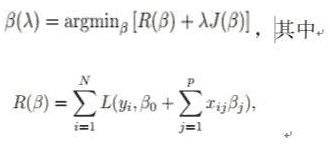

# 网易 2018 校园招聘深度学习算法工程师笔试卷

## 1

以下 python 代码输出为

```cpp
>>> a = [1, 2, 3]
>>> b = a
>>> a.append(4)
>>> b.append(5)
>>> print a, b

```

正确答案: A   你的答案: 空 (错误)

```cpp
[1, 2, 3, 4, 5] [1, 2, 3, 4, 5]
```

```cpp
[1, 2, 3, 4] [1, 2, 3, 4, 5]
```

```cpp
[1, 2, 3, 4, 5] [1, 2, 3, 5]
```

```cpp
[1, 2, 3, 4] [1, 2, 3, 5]
```

本题知识点

网易 算法工程师 算法工程师 网易 2018

讨论

[牛客 32743978 号](https://www.nowcoder.com/profile/32743978)

python 是引用传递，不是值传递

发表于 2022-01-23 00:46:15

* * *

[Mr.LiRong](https://www.nowcoder.com/profile/65944734)

a、b 共用一个 list

发表于 2019-09-09 00:04:58

* * *

## 2

以下关于 importance sampling 说法正确的是

正确答案: D   你的答案: 空 (错误)

```cpp
importance sampling 需要计算抽样分布的归一化参数
```

```cpp
importance sampling 需要计算实际分布的归一化参数
```

```cpp
importance sampling 需要同时计算两个分布的归一化参数
```

```cpp
importance sampling 不需要计算两个分布的归一化参数
```

本题知识点

网易 算法工程师 算法工程师 网易 2018

讨论

[牛客 5564227 号](https://www.nowcoder.com/profile/5564227)

可参考知乎对重要性采样的介绍：[`zhuanlan.zhihu.com/p/41217212`](https://zhuanlan.zhihu.com/p/41217212)

发表于 2019-06-11 15:31:09

* * *

## 3

以下集合是凸集的是

正确答案: A   你的答案: 空 (错误)

```cpp
{(x,y) |y=x+1}
```

```cpp
{(x,y) | x 的平方 + y 的平方 = 1}
```

```cpp
{(x,y) | x 的平方 + y 的平方 &gt; 1 }
```

```cpp
{(x,y) |x=1 | y=1 }
```

本题知识点

网易 算法工程师 算法工程师 网易 2018

讨论

[constme="小仙女"](https://www.nowcoder.com/profile/6964973)

凸集，实数*R*上（或复数*C*上）的向量空间中，如果集合*S*中任两点的连线上的点都在*S*内，则称集合*S*为凸集。

*   所以直线是凸集，A 正确。
*   {(x, y)| x² + y² <= 1}是凸集。
*   C 选项恰好是圆形外面的区域，而任意两点连线上的点在圆形。
*   D 选项是两条直线。

发表于 2018-07-24 09:23:05

* * *

## 4

以下关于谱聚类说法错误的是

正确答案: C   你的答案: 空 (错误)

```cpp
kmean 无法很好的处理非凸的聚类簇，而谱聚类作为一种扩展可以较好的处理
```

```cpp
谱聚类是一种基于图论的聚类算法，将带权无向图划分为两个或两个以上的最优子图，使子图内部尽量相似，而子图间距离尽量距离较远，以达到常见的聚类的目的
```

```cpp
谱聚类中可以通过 SVD 进行降维，降维后的特征维度与聚类簇的数量一致
```

```cpp
谱聚类通过将离散问题连续化，通过 Rayleigh quotient 将特征向量和特征值与最小割问题建立联系
```

本题知识点

网易 算法工程师 算法工程师 网易 2018

## 5

ID3 算法在分类树构建中， 使用哪个度量来进行分类节点

正确答案: B   你的答案: 空 (错误)

```cpp
gini 指标
```

```cpp
信息增益
```

```cpp
信息增益率
```

```cpp
准确率
```

本题知识点

网易 算法工程师 2018

讨论

[大大的锅](https://www.nowcoder.com/profile/5396023)

id3:信息增益 c4.5 信息增益率 cart 基尼指数

发表于 2018-05-27 16:55:57

* * *

## 6

以下关于 Linear discriminant analysis（LDA）说法错误的是;

正确答案: B   你的答案: 空 (错误)

```cpp
LDA 假设每个类别的密度分布为高斯分布
```

```cpp
LDA 假设每个类之间的协方差矩阵都是对角阵
```

```cpp
LDA 假设每个类之间的协方差矩阵都相同
```

```cpp
LDA 的分界面为线性的
```

本题知识点

网易 算法工程师 算法工程师 网易 2018

讨论

[offer 女神眷顾我吧](https://www.nowcoder.com/profile/517520874)

```cpp
PCA 假设每个类之间的协方差矩阵都是对角阵
```

发表于 2020-08-08 10:42:18

* * *

## 7

假定β参数预估满足如下式子：
且 R，J 函数满足

1. R 是β的二次函数或者分段线性函数

2\. J 是β的分段线性函数

则β(λ) 的预估值为：

正确答案: B   你的答案: 空 (错误)

```cpp
二次函数
```

```cpp
分段线性函数
```

```cpp
线性函数
```

```cpp
常数
```

本题知识点

网易 算法工程师 算法工程师 网易 2018

## 8

以下哪个是 lasso 对于参数的作用效果

正确答案: C   你的答案: 空 (错误)

本题知识点

网易 算法工程师 算法工程师 网易 2018

## 9

对于最大堆 64,42,58,23,36,47,56,11,22,27,4,2;删除掉最大元素后，调整后堆中元素为:

正确答案: D   你的答案: 空 (错误)

```cpp
56,42,58,23,36,47,2,11,22,27,4
```

```cpp
58,42,56,36,23,47,2,11,22,27,4
```

```cpp
58,42,56,23,36,47,11,2,22,27,4
```

```cpp
58,42,56,23,36,47,2,11,22,27,4
```

本题知识点

网易 算法工程师 算法工程师 网易 2018

## 10

以下关于无向正权图的最短路和最小生成树的说法正确的有()

正确答案: C   你的答案: 空 (错误)

```cpp
当图的每条边的权值都增加 2 的时候，之前计算的最短路和最小生成树都仍然有效。
```

```cpp
当图的每条边的权值都扩大 2 倍的时候，之前计算的最短路和最小生成树已经失效。
```

```cpp
当图的每条边的权值都增加 2 的时候，之前计算的最小生成树仍然有效。
```

```cpp
当图的每条边的权值都扩大 2 倍的时候，之前计算的最短路已经失效（不再是最短路）。
```

本题知识点

网易 算法工程师 算法工程师 网易 2018

## 11

一个简单无向图有 10 个顶点，11 条边，如果用邻接矩阵来存储它，那么矩阵里面会有多少个 0?

正确答案: D   你的答案: 空 (错误)

```cpp
11
```

```cpp
22
```

```cpp
89
```

```cpp
78
```

```cpp
无法表达
```

本题知识点

网易 算法工程师 算法工程师 网易 2018

讨论

[superzz](https://www.nowcoder.com/profile/567055)

总共有 10*10 个点，然后有 11 条边，也就是有 22 个点为 1,78 个点为 0

发表于 2018-05-26 00:06:38

* * *

[Binke](https://www.nowcoder.com/profile/200202609)

n 为顶点，e 为边，nn-2e

发表于 2020-09-12 14:26:51

* * *

## 12

假如一个二叉树有 1026 个节点，它的深度的可能性有多少种?(假设只有根节点的深度为 1)

正确答案: E   你的答案: 空 (错误)

```cpp
2
```

```cpp
1017
```

```cpp
1014
```

```cpp
1015
```

```cpp
1016
```

本题知识点

网易 算法工程师 算法工程师 网易 2018

讨论

[牛客 5564227 号](https://www.nowcoder.com/profile/5564227)

每层一个节点。 深度最大值是 1026，深度最小值的情况是完全二叉树的时候，除最下面一层外，其他都满节点。
根据完全二叉树深度求法，具有 n 个结点的完全二叉树的深度为 11，所以 1026 个节点，深度可能为 11 到 1026 种可能，共 1016 种。

发表于 2019-06-11 16:37:18

* * *

## 13

下面关于 dynamic_cast 说法错误的有?

正确答案: C   你的答案: 空 (错误)

```cpp
dynamic_cast 在运行期，会检查这个转换是否可能
```

```cpp
dynamic_cast&lt;X&gt;(a)，那么 X 必须是一个指针或者引用
```

```cpp
表达式 dynamic_cast&lt;T*&gt;(a) 将 a 值转换为类型为 T 的对象指针。如果类型 T 不是 a 的某个基类型，该操作将失败抛出 bad_cast 异常
```

```cpp
T1 obj;T2 *pObj = dynamic_cast&lt;T2*&gt;(&amp;obj);被转换对象 obj 的类型 T1 必须是多态类型，即 T1 必须公有继承自其它类，或者 T1 拥有虚函数（继承或自定义）
```

本题知识点

网易 算法工程师 算法工程师 网易 2018

讨论

[面朝大海 yuxiubin](https://www.nowcoder.com/profile/5535706)

应该是返回空值？

发表于 2020-04-07 16:10:48

* * *

## 14

有如下代码:

```cpp
struct A1{
    virtual ~A1(){}
};
struct A2{
    virtual ~A2(){}
};
struct B1 : A1, A2{};
int main()
{
 B1 d;
 A1* pb1 = &d;
 A2* pb2 = dynamic_cast<A2*>(pb1);  //L1
 A2* pb22 = static_cast<A2*>(pb1);  //L2
 return 0;
}
```

正确答案: B   你的答案: 空 (错误)

```cpp
L1 语句编译失败，L2 语句编译通过
```

```cpp
L1 语句编译通过，L2 语句编译失败
```

```cpp
L1，L2 都编译失败
```

```cpp
L1，L2 都编译通过
```

本题知识点

网易 算法工程师 2018 C++ C 语言

讨论

[mu 木心](https://www.nowcoder.com/profile/963937406)

**dynamic_cast** 专门用于将多态基类的指针或引用强制转换为派生类的指针或引用，而且能够检查转换的安全性。对于不安全的指针转换，转换结果返回 NULL 指针。**dynamic_cast** 是通过“运行时类型检查”来保证安全性的。dynamic_cast 不能用于将非多态基类的指针或引用强制转换为派生类的指针或引用——这种转换没法保证安全性，只好用 reinterpret_cast 来完成。**static_cast** 用于进行比较“自然”和低风险的转换，如整型和浮点型、字符型之间的互相转换。另外，如果对象所属的类重载了强制类型转换运算符 T（如 T 是 int、int* 或其他类型名），则 static_cast 也能用来进行对象到 T 类型的转换。 

发表于 2021-03-22 16:01:12

* * *

[一纸缘](https://www.nowcoder.com/profile/607917881)

[`blog.csdn.net/lekonpeng/article/details/3274997`](https://blog.csdn.net/lekonpeng/article/details/3274997)

发表于 2020-08-25 16:54:59

* * *

[飞翔的企鹅 3550771168](https://www.nowcoder.com/profile/393747266)

dynamic_cast 是运行时检查，虽然 pb1 是 A1 类型的，但是指向的实体却是子类(&d 是 B1*)，所以子类(B1)转父类(A2)完全是可以的。

发表于 2020-11-17 14:33:29

* * *

## 15

采用死锁预防方案处理死锁问题时，一般不会破坏以下哪些条件

正确答案: D   你的答案: 空 (错误)

```cpp
循环等待
```

```cpp
持有并等待
```

```cpp
非剥夺
```

```cpp
互斥
```

本题知识点

网易 算法工程师 算法工程师 网易 2018

## 16

下面关于父子进程说法错误的是?

正确答案: A   你的答案: 空 (错误)

```cpp
fork（）时子进程拷贝了父进程除了数据段以外的绝大部分空间，包括代码段，堆栈段等
```

```cpp
在拷贝的时候，系统会为子进程创建一个新的进程表项
```

```cpp
虽然父子进程共享代码空间，但是在涉及写数据时子进程有自己的数据空间，在有数据修改时，系统会为子进程申请新的页面
```

```cpp
所有进程都是 init 进程直接或者间接的 fork 出来的
```

本题知识点

网易 算法工程师 算法工程师 网易 2018

讨论

[面朝大海 yuxiubin](https://www.nowcoder.com/profile/5535706)

fork 之后，子进程会拷贝父进程的 PCB 结构，然后对 PCB 里面的数据做修改。父进程的页表（操作系统为每一个进程维护一个页表）直接拷（浅拷贝）给子进程，父子进程共享所有的数据空间。

发表于 2020-04-07 16:19:56

* * *

## 17

Belady 现象可能会出现在以下哪个算法中?

正确答案: D   你的答案: 空 (错误)

```cpp
预防死锁算法
```

```cpp
磁盘调度算法
```

```cpp
内存管理算法
```

```cpp
内存换页算法
```

```cpp
进程调度算法
```

本题知识点

网易 算法工程师 算法工程师 网易 2018

## 18

下面关于 TCP 和 UDP 说法正确的是?

正确答案: A   你的答案: 空 (错误)

```cpp
在 TCP/UDP 传输段中，源端口地址和目的端口地址是不能相同的
```

```cpp
当客户端和服务器建立的是 TCP 连接的时候，服务器最后如果想要断开直接断开连接，停止发送数据就好了
```

```cpp
UDP 是用户数据报协议，是一个简单的面向数据报的应用层协议
```

```cpp
UDP 在传输数据报前不用在客户和服务器之间建立一个连接，但是也有超时重发的机制
```

```cpp
UDP 的传输速度优于 TCP
```

本题知识点

网易 算法工程师 算法工程师 网易 2018

讨论

[红孩儿](https://www.nowcoder.com/profile/202896)

1、**传输层协议**：（1）TCP，传输控制协议，属于可靠连接（TCP 通过“三次握手”来建立连接，再**通过“四次挥手”断开一个连接**）；（2）UDP，用户数据报协议，属于不可靠连接（不保证数据安全准确到达）；2、**UDP 没有拥塞控制**，因此网络出现拥塞不会使源主机的发送速率降低（对实时应用很有用，如 IP 电话，实时视频会议等）；3、传输速度跟网络设备及网络环境有关，无法一概而论；参考连接：[`www.jianshu.com/p/eb50d2152646`](https://www.jianshu.com/p/eb50d2152646) 

发表于 2019-08-02 16:15:03

* * *

## 19

数字图像处理中常使用主成员分析（PCA）来对数据进行降维，下列关于 PCA 算法错误的是：

正确答案: C   你的答案: 空 (错误)

```cpp
PCA 算法是用较少数量的特征对样本进行描述以达到降低特征空间维数的方法；
```

```cpp
PCA 本质是 KL-变换；
```

```cpp
PCA 是最小绝对值误差意义下的最优正交变换；
```

```cpp
PCA 算法通过对协方差矩阵做特征分解获得最优投影子空间，来消除模式特征之间的相关性、突出差异性；
```

本题知识点

网易 算法工程师 2018

讨论

[紫夜馨空 2012](https://www.nowcoder.com/profile/303388676)

最小平均误差

发表于 2018-08-16 17:53:18

* * *

## 20

shell 中，如果想匹配以 wangyi 开头的行，应该采用下面的哪个正则表达式？

正确答案: A   你的答案: 空 (错误)

```cpp
^wangyi
```

```cpp
wangyi$
```

```cpp
\wangyi
```

```cpp
*wangyi
```

本题知识点

网易 算法工程师 2018

讨论

[superzz](https://www.nowcoder.com/profile/567055)

行的开始和结束 开始符号：^ 结束符号：$  如：^cat 应该理解为以 c 作为一行的第一个字符

发表于 2018-05-26 00:10:25

* * *

[WEBJ2EE](https://www.nowcoder.com/profile/3930151)

^ 元字符，用于匹配字符串开头 A

编辑于 2019-12-14 10:27:40

* * *

## 21

魔法王国一共有 n 个城市,编号为 0~n-1 号,n 个城市之间的道路连接起来恰好构成一棵树。
小易现在在 0 号城市,每次行动小易会从当前所在的城市走到与其相邻的一个城市,小易最多能行动 L 次。
如果小易到达过某个城市就视为小易游历过这个城市了,小易现在要制定好的旅游计划使他能游历最多的城市,请你帮他计算一下他最多能游历过多少个城市(注意 0 号城市已经游历了,游历过的城市不重复计算)。

本题知识点

网易 算法工程师 贪心 动态规划 树 2018

讨论

[下午约球不](https://www.nowcoder.com/profile/545691869)

出题就不能出个通俗易懂的？玩文字游戏有锤子意思

发表于 2019-03-07 16:00:53

* * *

[零葬](https://www.nowcoder.com/profile/75718849)

贪心

构造一个 distance 数组，其中 distance[i]表示第 i 号城市到 0 号城市之间有多少个城市（可能有重复城市），根据题中给出的拓扑关系就能够将这个数组填好，然后我们考察 distance 中对的最大元素 maxSize：（1）如果 L+1 不超过 maxSize，说明最多可以游历的城市数为 L+1；（2）否则表示 L+1-maxSize 这些城市经过了两次，需要把多算的城市减去。

```cpp
import java.io.*;
import java.util.*;

public class Main {
    public static void main(String[] args) throws IOException {
        BufferedReader br = new BufferedReader(new InputStreamReader(System.in));
        String line;
        while((line = br.readLine()) != null){
            String[] params = line.split(" ");
            int n = Integer.parseInt(params[0]), L = Integer.parseInt(params[1]);
            params = br.readLine().split(" ");
            int[] prev = new int[n - 1];
            for(int i = 0; i < n - 1; i++){
                prev[i] = Integer.parseInt(params[i]);
            }
            int[] distance = new int[n];
            distance[0] = 1;
            for(int i = 0; i < n - 1; i++){
                distance[i + 1] = distance[prev[i]] + 1;
            }
            int maxSize = 1;
            for(int dis: distance){
                maxSize = Math.max(dis, maxSize);
            }
            if(L + 1 <= maxSize){
                System.out.println(L + 1);
            }else{
                System.out.println(maxSize + ((L + 1 - maxSize) >> 1));
            }
        }
    }
}
```

编辑于 2022-02-27 15:46:19

* * *

## 22

一个合法的括号匹配序列被定义为:
1\. 空串""是合法的括号序列
2\. 如果"X"和"Y"是合法的序列,那么"XY"也是一个合法的括号序列
3\. 如果"X"是一个合法的序列,那么"(X)"也是一个合法的括号序列
4\. 每个合法的括号序列都可以由上面的规则生成
例如"", "()", "()()()", "(()())", "(((()))"都是合法的。
从一个字符串 S 中移除零个或者多个字符得到的序列称为 S 的子序列。
例如"abcde"的子序列有"abe","","abcde"等。
定义 LCS(S,T)为字符串 S 和字符串 T 最长公共子序列的长度,即一个最长的序列 W 既是 S 的子序列也是 T 的子序列的长度。
小易给出一个合法的括号匹配序列 s,小易希望你能找出具有以下特征的括号序列 t:
1、t 跟 s 不同,但是长度相同
2、t 也是一个合法的括号匹配序列
3、LCS(s, t)是满足上述两个条件的 t 中最大的
因为这样的 t 可能存在多个,小易需要你计算出满足条件的 t 有多少个。

如样例所示: s = "(())()",跟字符串 s 长度相同的合法括号匹配序列有:
"()(())", "((()))", "()()()", "(()())",其中 LCS( "(())()", "()(())" )为 4,其他三个都为 5,所以输出 3.

本题知识点

网易 算法工程师 字符串 *贪心 栈 *穷举 哈希 *2018*** ***## 23

深度学习已经在图像/语音/语言等领域带来了一系列突破，在其他领域的应用也越来越广泛。请结合您的某个具体项目：1）阐述深度学习在其中具体是如何工作的？2）应用深度学习过程中遇到的困难有哪些以及是如何解决的？3）请根据您的理解，谈谈深度学习的优点和缺点。

你的答案

本题知识点

网易 算法工程师 2018

## 24

常用的深度学习计算框架都需要支持分布式计算，一般采用 parameter server 架构实现多机数据并行，请尝试设计一个高性能的分布式 parameter server 架构？1）在数据并行训练系统中，parameter server 主要作用是什么？ 除深度学习领域外，它能否用于加速传统机器学习分布式训练效率？2）对于有 N 个并行计算的 worker 节点（worker 节点定义为进行神经网络 forward 和 backward 的完整执行单元），你会如何设计 paramter server 架构，有哪些因素会影响到 parameter server 的对整体分布式训练效率？3）什么是 Amdahl's law？ 基于分布式 parameter server 架构的多机并行神经网络训练框架中，如何利用 amdahl's law 指导多机并行加速效率的优化？4）spin lock 和 pthread mutex lock 有什么区别？ 假定一个 parameter server 主要完成对神经网络 parameter weight 的向量求和操作。如果同时有 100 个 worker 向 parameter server 推送 weight 数据，即同时需要在 parameter server 上实现 100 组 weight 向量的向量求和操作，给定 56 个 Cpu 物理核来完成求和操作，请设计一个并行计算逻辑最大程度提高整个求和操作的效率，请用伪代码描述。5）计算机架构中，哪些设计中使用了 pipeline 技术？它的作用是啥？ 你设计的 parameter server 架构中，你觉得有些地方可以用 pipeline 技术来优化效率，具体如何实现 pipeline？

你的答案

本题知识点

网易 算法工程师 2018***