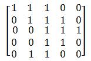

# 网易 2018 校园招聘计算机视觉算法工程师笔试卷

## 1

图像数据如下：卷积核为：则输出为：

正确答案: A   你的答案: 空 (错误)

本题知识点

网易 算法工程师 2018

讨论

[流浪阿波罗](https://www.nowcoder.com/profile/409462482)

只要将卷积核从 feature map 的左上角，步长为 1，一动两次，对应位置相乘相加，就可以求得卷积之后的前两个值，之后就可以排除得到，答案选择 A

发表于 2019-07-17 21:06:59

* * *

## 2

以下哪个是 lasso 对于参数的作用效果

正确答案: C   你的答案: 空 (错误)

本题知识点

网易 算法工程师 算法工程师 网易 2018

讨论

[依依东望 0221](https://www.nowcoder.com/profile/704187199)

LASSO 是指目标函数中加入了 L1 范数进行正则化。L1 范数是指向量元素的绝对值之和。L1 范数正则化首先是会降低变量的绝对值大小，因此 A 不对。其次 L1 范数会使得部分变量值为 0（也就是筛选出了不重要的特征使其权重为 0），因此 B 不对。综上选 C。

发表于 2022-02-08 10:58:20

* * *

[牛客网的小仔](https://www.nowcoder.com/profile/900924093)

lasso 会进行特征选择， 稀疏化， 不重要的特征 权值为零（我猜的）

发表于 2020-04-18 22:27:02

* * *

[流浪阿波罗](https://www.nowcoder.com/profile/409462482)

看不懂这题是什么意思，希望有人客指出

发表于 2019-07-17 21:07:39

* * *

## 3

以下关于无向正权图的最短路和最小生成树的说法正确的有()

正确答案: C   你的答案: 空 (错误)

```cpp
当图的每条边的权值都增加 2 的时候，之前计算的最短路和最小生成树都仍然有效。
```

```cpp
当图的每条边的权值都扩大 2 倍的时候，之前计算的最短路和最小生成树已经失效。
```

```cpp
当图的每条边的权值都增加 2 的时候，之前计算的最小生成树仍然有效。
```

```cpp
当图的每条边的权值都扩大 2 倍的时候，之前计算的最短路已经失效（不再是最短路）。
```

本题知识点

网易 算法工程师 算法工程师 网易 2018

## 4

假设一棵二叉排序树的节点的值均为 10 到 20 的整数，如果在这棵树里查找 15，以下哪个序列是不可能存在的?

正确答案: E   你的答案: 空 (错误)

```cpp
20,19,18,17,16,15
```

```cpp
14,19,18,16,15
```

```cpp
12,13,20,14,18,15
```

```cpp
11,12,19,13,18,17,14,16,15
```

```cpp
12,18,16,13,14,17,15
```

本题知识点

网易 算法工程师 算法工程师 网易 2018

讨论

[我加了洋葱](https://www.nowcoder.com/profile/517173742)

二叉排序树是指根节点大于左子树小于右子树，e 选项里 16>15 后面搜索值肯定都会小于 15，17 错误

发表于 2019-09-05 16:28:37

* * *

## 5

有如下代码:

```cpp
struct A1{
    virtual ~A1(){}
};
struct A2{
    virtual ~A2(){}
};
struct B1 : A1, A2{};
int main()
{
 B1 d;
 A1* pb1 = &d;
 A2* pb2 = dynamic_cast<A2*>(pb1);  //L1
 A2* pb22 = static_cast<A2*>(pb1);  //L2
 return 0;
}
```

正确答案: B   你的答案: 空 (错误)

```cpp
L1 语句编译失败，L2 语句编译通过
```

```cpp
L1 语句编译通过，L2 语句编译失败
```

```cpp
L1，L2 都编译失败
```

```cpp
L1，L2 都编译通过
```

本题知识点

网易 算法工程师 2018 C++ C 语言

讨论

[面朝大海 yuxiubin](https://www.nowcoder.com/profile/5535706)

可参考：[`www.cnblogs.com/wft1990/p/7126812.html`](https://www.cnblogs.com/wft1990/p/7126812.html)A1 与 A2 是两个不相关的类 但是 dynamic_cast 是动态的，若转换不成功返回 BULL，而 static_cast 是静态的，在编译时就检查了

编辑于 2020-04-07 12:05:33

* * *

[Amo-wintercs](https://www.nowcoder.com/profile/444653760)

1、静态类型转换

static_cast<目标类型>(原类型)  目标类型和源类型之间必须一个方向可以自动类型转换，否则就会出现 错误。

2、动态类型转换

dynamic_cast<目标类型>(原类型)  源类型和目标类型之间必须存在继承关系，否则会出现错误。

3、去常类型转换

const_cast<目标类型>(原类型)  源类型和目标类型必须是指针或引用，且间除了 const 属性外，其它都相同，否则就会出现错误。

4、reinterpret_cast

reinterpret_cast<目标类型>(原类型)  只能把整数转换成指针或把指针转换成整数，否则就会出现错误。

发表于 2021-04-07 10:20:24

* * *

[面试被拒的小虎](https://www.nowcoder.com/profile/852097236)

都转换不成功，stati_cast 编译时类型检查，编译发生错误 dynamic_cast 运行时类型检查 RTTI,指针失败返回 NULL，引用失败返回异常 bad_cast

发表于 2020-10-22 14:14:53

* * *

## 6

图像特征描述子中，SIFT 特征的 keypoint 点提取的是：

正确答案: B   你的答案: 空 (错误)

```cpp
原图邻域梯度变化极值点
```

```cpp
高斯差分图像邻域梯度变化极值点
```

```cpp
原图邻域像素值极值点
```

```cpp
高斯差分图像邻域像素值极值点
```

本题知识点

网易 算法工程师 2018

## 7

在基于特征点（如 SIFT 点）点对的图像匹配中，常使用一下何种方式对误匹配点对进行过滤？

正确答案: A   你的答案: 空 (错误)

```cpp
RANSAC
```

```cpp
kalman 滤波
```

```cpp
Homography 映射
```

```cpp
光流跟踪
```

本题知识点

网易 算法工程师 2018

讨论

[Sesenn](https://www.nowcoder.com/profile/85234885)

随机抽样一致算法（RANdom SAmple Consensus，**RANSAC**） ransac 算法的输入为：需要处理的点集；以及可能符合的函数模型, 选择的模型决定了需要计算模型参数的点的个数。

ransac 算法的输出为：满足某种关系的过滤点集 ；函数模型的参数。 

发表于 2019-08-05 21:14:23

* * *

## 8

图像中应用的 kmeans 算法，以下说法错误的是：

正确答案: D   你的答案: 空 (错误)

```cpp
kmeans 算法有效的前提假设是数据满足高斯分布
```

```cpp
kmeans 需要手工指定类别的数目 K
```

```cpp
对于多维实数数据，kmeans 算法最终一定是收敛的
```

```cpp
kmeans 算法可以直接得到类别分布的层级关系
```

本题知识点

网易 算法工程师 算法工程师 网易 2018

讨论

[Yaoruolong](https://www.nowcoder.com/profile/193485016)

算法接受参数 k ；然后将事先输入的 n 个数据对象划分为 k 个聚类以便使得所获得的聚类满足：同一聚类中的对象相似度较高；而不同聚类中的对象相似度较小。算法思想：以空间中 k 个点为中心进行聚类，对最靠近他们的对象归类。通过迭代的方法，逐次更新各聚类中心的值，直至得到最好的聚类结果算法描述：          （1）适当选择 c 个类的初始中心；          （2）在第 k 次迭代中，对任意一个样本，求其到 c 各中心的距离，将该样本归到距离最短的中心所在的类；          （3）利用均值等方法更新该类的中心值；          （4）对于所有的 c 个聚类中心，如果利用（2）（3）的迭代法更新后，值保持不变，则迭代结束；否则，则继续迭代优点：速度快，简单缺点：最终结果跟初始点选择相关，容易陷入局部最优，需知道 k 值 k-means 计算出来的是不包含层级关系的

发表于 2019-09-08 16:43:26

* * *

## 9

数字图像处理中常使用主成员分析（PCA）来对数据进行降维，下列关于 PCA 算法错误的是：

正确答案: C   你的答案: 空 (错误)

```cpp
PCA 算法是用较少数量的特征对样本进行描述以达到降低特征空间维数的方法；
```

```cpp
PCA 本质是 KL-变换；
```

```cpp
PCA 是最小绝对值误差意义下的最优正交变换；
```

```cpp
PCA 算法通过对协方差矩阵做特征分解获得最优投影子空间，来消除模式特征之间的相关性、突出差异性；
```

本题知识点

网易 算法工程师 算法工程师 网易 2018

讨论

[Mr.鑫 666](https://www.nowcoder.com/profile/266800702)

PCA 最小均方误差意义下的最优正交变换；
[`www.cnblogs.com/jojo123/p/6732819.html`](https://www.cnblogs.com/jojo123/p/6732819.html) 

发表于 2019-08-21 18:07:02

* * *

[依依东望 0221](https://www.nowcoder.com/profile/704187199)

PCA 最后向多个特征向量上进行投影，特征向量之间是正交的，因此是正交变换。选择最大的多个特征值对应的特征向量，其实就是为了最大化投影后数据方差，使得降维后信息量最大，最大化投影方差其实就是最小化均方误差。

发表于 2022-02-08 22:38:49

* * *

## 10

CNN 神经网络对图像特征提取带来了变革性的变化，使之前的人工特征提取升级到数据驱动的自动特征提取，在 CNN 中，起到特征提取作用的网络层是：

正确答案: A   你的答案: 空 (错误)

```cpp
convolution 层
```

```cpp
full connect 层
```

```cpp
max pooling 层
```

```cpp
norm 层
```

本题知识点

网易 算法工程师 2018

## 11

魔法王国一共有 n 个城市,编号为 0~n-1 号,n 个城市之间的道路连接起来恰好构成一棵树。
小易现在在 0 号城市,每次行动小易会从当前所在的城市走到与其相邻的一个城市,小易最多能行动 L 次。
如果小易到达过某个城市就视为小易游历过这个城市了,小易现在要制定好的旅游计划使他能游历最多的城市,请你帮他计算一下他最多能游历过多少个城市(注意 0 号城市已经游历了,游历过的城市不重复计算)。

本题知识点

网易 算法工程师 贪心 动态规划 树 2018

讨论

[菜是原罪，难是帮凶ಥ_ಥ](https://www.nowcoder.com/profile/431732435)

```cpp

	#include <iostream>

	#include <vector>

	using namespace std;

	class Solution{

	public:

	int max(int a, int b)

	{

	if(a > b)

	return a;

	else

	return b;

	}

	int maxCity(int len, int L, int n)

	{

	if(len > L)

	return L + 1;

	else if(len + 1 + (L - len)/2 > n)

	return n;

	else

	return len + 1 + (L - len)/2;

	}

	};

	int main(void)

	{

	int n, L;

	cin>>n>>L;

	int len = 0;

	int value;

	vector<int> dp(n);

	Solution s;

	for(int i = 0; i <= n - 2; ++ i)

	{

	cin>>value;

	dp[i + 1] = dp[value] + 1;

	len = s.max(len, dp[i + 1]);

	}

	int res = s.maxCity(len, L, n);

	cout<<res<<endl;

	return 0;

	}

```

编辑于 2019-02-27 19:40:06

* * *

## 12

小易有一个长度为 N 的正整数数列 A = {A[1], A[2], A[3]..., A[N]}。
牛博士给小易出了一个难题:
对数列 A 进行重新排列,使数列 A 满足所有的 A[i] * Ai + 1 都是 4 的倍数。
小易现在需要判断一个数列是否可以重排之后满足牛博士的要求。

本题知识点

网易 算法工程师 数学 贪心 动态规划 数组 2018

讨论

[0 雷电 0](https://www.nowcoder.com/profile/271835674)

这道题可以这么理解，相邻的两个元素相乘能被 4 整除，那么至少相邻的两个元素的各自因数中，相乘要有 4 那么可以把一个数看成因数有 4，或者因数只有 2，或者因数只有 1 比如 6 可以看成因数有 2，8 可以看成因数有 4，9 的话因数就只有 1 那么就总共 3 种情况，用一个字典 dit 记录对应因数出现的次数，分别为 dit[0]，dit[1]，dit[2]，表示因数只有 1，因数只有 2，因数含有 4 那么分析一下具体情况，能够相乘因数有 4，对于一个数的因数是 1 的时候，它只能和因数是 4 的数相乘才能满足条件即：1*4，而因数为 2 的情况只要不和因数为 1 的数配对则成立，所以我们只需要重点关注因数为 1 的情况那么假设 i 个因数为 1 的数，①只有因数 1 和因数 4 的数情况下，i-1 个因数为 4 的数来配对，例如 1*4*1*4*1②如果有因数为 2 的情况，显然因数为 2 的数不能接在 1 后面，那么则需要 i 个因数为 4 的数来配对。例如 1*4*1*4*1*4*2*2 所以 dit[1] == 0 的情况，按照①中的计算，dit[0]>dit[2]-1 则输出 Nodit[1]!=0 的情况，按照②中的计算，dit[0]>dit[2]则输出 No 其他情况并不需要判断，输出 Yes 即可 ```cpp
import sys
t =int(sys.stdin.readline().strip())
while t>0:
    t-=1
    dit ={0:0,1:0,2:0}
    n =int(sys.stdin.readline().strip())
    lit =list(map(int,(sys.stdin.readline().strip().split(" "))))
    for i inrange(len(lit)):
        if lit[i]%4==0:
            dit[2] +=1
        elif lit[i]%2==0:
            dit[1] +=1
        else:
            dit[0] +=1
    if dit[1]==0anddit[0]>dit[2]+1:
        print("No")
        continue
    if dit[1]!=0anddit[0]>dit[2]:
        print("No")
        continue
    print("Yes")
    continue
``` 

编辑于 2020-08-08 01:12:09

* * *

## 13

（问答题分"图像基础","机器学习"和"3D 视觉"三个部分，请任选其中一个方向作答，多答有神秘加分）（本题为"图像基础"）证明 Laplace 算子为旋转不变算子，并阐述离散化后旋转不变性的情况。

你的答案

本题知识点

网易 算法工程师 2018

讨论

[菜是原罪，难是帮凶ಥ_ಥ](https://www.nowcoder.com/profile/431732435)


发表于 2019-02-27 19:44:21

* * *

## 14

（问答题分"图像基础","机器学习"和"3D 视觉"三个部分，请任选其中一个方向作答，多答有神秘加分）（本题为"图像基础"）使用极坐标表示解释 Hough 变换用于直线检测的主要概念。在图像空间中画几条直线，在参数空间中勾画出相应的 Hough 变换。标示出所有重要的点线轴。

你的答案

本题知识点

网易 算法工程师 2018

## 15

（问答题分"图像基础","机器学习"和"3D 视觉"三个部分，请任选其中一个方向作答，多答有神秘加分）（本题为"图像基础"）与 DFT 相比，DCT 有哪些特点？在图像处理领域分别有那些应用

你的答案

本题知识点

网易 算法工程师 2018

讨论

[菜是原罪，难是帮凶ಥ_ಥ](https://www.nowcoder.com/profile/431732435)

解答： 与离散傅里叶变换相比，信号的离散余弦变换具有更好的能量压缩性能，仅用少数几个变换系数就可表征信号的整体，使得它在数据压缩和数据通信中得到了广泛的应用。另外，离散余弦变换避免了繁杂的运算，而且实信号的 DCT 变换结果仍然是实数。图像压缩

发表于 2019-02-27 20:19:37

* * *

## 16

（问答题分"图像基础","机器学习"和"3D 视觉"三个部分，请任选其中一个方向作答，多答有神秘加分）（本题为"图像基础"）双边滤波器的公式和优缺点。

你的答案

本题知识点

网易 算法工程师 2018

## 17

（问答题分"图像基础","机器学习"和"3D 视觉"三个部分，请任选其中一个方向作答，多答有神秘加分）（本题为"图像基础"）阐述词袋（BOW）模型，及其在图像中的应用。

你的答案

本题知识点

网易 算法工程师 2018

讨论

[再见 Matlab](https://www.nowcoder.com/profile/4241416)

图像检索

发表于 2019-10-03 12:53:24

* * *

## 18

（问答题分"图像基础","机器学习"和"3D 视觉"三个部分，请任选其中一个方向作答，多答有神秘加分）（本题为"图像基础"）谈谈你对 V/A/MR 的了解。

你的答案

本题知识点

网易 算法工程师 2018

## 19

（问答题分"图像基础","机器学习"和"3D 视觉"三个部分，请任选其中一个方向作答，多答有神秘加分）（本题为"机器学习"部分）期望风险、经验风险和结构风险之间的关系。

你的答案

本题知识点

网易 算法工程师 2018

讨论

[安于盛夏](https://www.nowcoder.com/profile/140393156)

损失函数表示模型预测值与样本真实值之间的差距。比如对于某个样本<Xi,Yi>，其真实的值为 Yi,而我们的模型选择决策函数为 f,那么通过模型预测的值为 f(Xi);损失函数就是用来表示 Yi 与 f(Xi)之间的差距的，我们用函数 L(f(Xi),Yi)来表示损失函数。我们希望最小化 L 函数。理想的情况是我们的模型决策函数预测值 f（Xi）刚好等于该样本的真值 Yi。常见的损失函数有以下几种 ：0-1 损失，平方损失，绝对值损失，对数或指数损失。将所有的样本点都求一次损失函数然后进行累加：即为经验风险。经验风险是对训练集中所有样本点损失函数的平均最小化。经验风险越小说明模型 f(X)对训练集的拟合程度越好。假设 X 和 Y 服从联合分布 P(X,Y).那么期望风险就可以表示为：
这就是期望风险，期望风险表示的是全局的概念，表示的是决策函数对所有的样本<X,Y>预测能力的大小，而经验风险则是局部的概念，仅仅表示决策函数对训练数据集里样本的预测能力。理想的模型（决策）函数应该是让所有的样本的损失函数最小的（也即期望风险最小化），但是期望风险函数往往是不可得到的，即上式中，X 与 Y 的联合分布函数不容易得到。现在我们已经清楚了期望风险是全局的，理想情况下应该是让期望风险最小化，但是呢，期望风险函数又不是那么容易得到的。怎么办呢？那就用局部最优的代替全局最优这个思想吧。这就是经验风险最小化的理论基础。

通过上面的分析可以知道，经验风险与期望风险之间的联系与区别。现在在总结一下：

经验风险是局部的，基于训练集所有样本点损失函数最小化的。

期望风险是全局的，是基于所有样本点的损失函数最小化的。

经验风险函数是现实的，可求的；

期望风险函数是理想化的，不可求的；

只考虑经验风险的话，会出现过拟合的现象，过拟合的极端情况便是模型 f(x)对训练集中所有的样本点都有最好的预测能力，但是对于非训练集中的样本数据，模型的预测能力非常不好。怎么办呢？这个时候就引出了结构风险。结构风险是对经验风险和期望风险的折中。在经验风险函数后面加一个正则化项（惩罚项）便是结构风险了。如下式：

相比于经验风险，结构风险多了一个惩罚项，其中是一个 lamada 是一个大于 0 的系数。J(f)表示的是是模型 f 的复杂度。结构风险可以这么理解：

经验风险越小，模型决策函数越复杂，其包含的参数越多，当经验风险函数小到一定程度就出现了过拟合现象。也可以理解为模型决策函数的复杂程度是过拟合的必要条件，那么我们要想防止过拟合现象的方式，就要破坏这个必要条件，即降低决策函数的复杂度。也即，让惩罚项 J(f)最小化，现在出现两个需要最小化的函数了。我们需要同时保证经验风险函数和模型决策函数的复杂度都达到最小化，一个简单的办法把两个式子融合成一个式子得到结构风险函数然后对这个结构风险函数进行最小化。

--------------------- 转自 张博 208 的 CSDN 博客 ，全文地址请点击：[`blog.csdn.net/bbbeoy/article/details/72526046?utm_source=copy`](https://blog.csdn.net/bbbeoy/article/details/72526046?utm_source=copy) 

发表于 2018-09-27 20:48:23

* * *

## 20

（问答题分"图像基础","机器学习"和"3D 视觉"三个部分，请任选其中一个方向作答，多答有神秘加分）（本题为"机器学习"部分）生成模型和判别模型分别是什么意思？详述逻辑回归并且说明其是哪个模型。

你的答案

本题知识点

网易 算法工程师 2018

讨论

[菜是原罪，难是帮凶ಥ_ಥ](https://www.nowcoder.com/profile/431732435)

生成模型： 学习时先得到 P(x,y)，继而得到 P(y|x)。预测时应用最大后验概率法（MAP）得到预测类别 y。
判别模型： 直接学习得到 P(y|x)，利用 MAP 得到 y。或者直接学得一个映射函数 y=f(x)。判别模型

编辑于 2019-02-27 21:08:28

* * *

[安于盛夏](https://www.nowcoder.com/profile/140393156)

判别模型：直接对条件概率 P(y|x;theta)来建模，不关心数据怎样生成，只关心信号间的差别，例如 SVM，LR 和 KNN。生成模型：必须先算联合概率，通过贝叶斯公式求 P(yi|x)。选择使 P(yi|x)最大的 y

发表于 2018-09-27 20:34:25

* * *

## 21

（问答题分"图像基础","机器学习"和"3D 视觉"三个部分，请任选其中一个方向作答，多答有神秘加分）（本题为"机器学习"部分）描述 dilated convolution 的优缺点及其应用

你的答案

本题知识点

网易 算法工程师 2018

讨论

[Sesenn](https://www.nowcoder.com/profile/85234885)

1、空洞卷积的优点是在不增加参数量的情况下，增大卷积核的感受野，同时它可以保证输出的特征映射（feature map）的大小保持不变。缺点是容易造成网格效应，局部信息丢失，每一层得到的卷积结果来自上一层的独立集合，没有相互依赖，因此该层之间的卷积结果没有相关性，造成局部细节丢失；同时由于空洞卷积稀疏的采样输入信息，使得远距离卷积得到的信息之间没有相关性。2、应用：语义分割、实例分割、目标检测、机器翻译、语音合成等

编辑于 2019-08-05 21:43:54

* * *

## 22

（问答题分"图像基础","机器学习"和"3D 视觉"三个部分，请任选其中一个方向作答，多答有神秘加分）（本题为"机器学习"部分）阐述 Densenet 的结构并分析其在计算机视觉方面取得成功的原因。

你的答案

本题知识点

网易 算法工程师 2018

讨论

[Fighting_youth](https://www.nowcoder.com/profile/664376333)

总的来说 DenseNet 打破了通过加深网络层数(ResNet)和加宽网络结构(Inception)来提升网络性能的思维定式，它从特征重用的角度，通过设置旁路，既大幅度地较少了网络的参数量又在一定程度上缓解了 gradient vanishing 问题的产生，在每个 Denseblock 中只需要给网络较小的 Growth rate 就足以实现 state-of-art 的性能。DenseNet 提出时作出的假设是：与其多次学习冗余特征，特征复用是一种更好的特征提取方式
DenseNet 与传统网络的主要不同点是：它可以接受较少的特征图数作为网络的输入
1、由于 DenseNet 对输入进行了 cat 操作，所以每一层产生的 feature map 都能被之后的所有层利用，使得特征可以在整个网络中重用，也是模型更加简洁
2、网络的每一层不仅接受了原始网络中来自 loss 的监督，同时由于多次用到 bypass 和 shortcut，网络的监督是多样的，从而实现了 Deep supervision，Deep supervision 的好处同样已经在 DSN 中得到了证实

发表于 2019-04-07 14:47:01

* * *

[hello201805212345580](https://www.nowcoder.com/profile/4994053)

减少了梯度消失，加强了 feature 的传递，增加对 feature 的利用，适当减少了参数

发表于 2018-07-16 16:56:48

* * *

## 23

（问答题分"图像基础","机器学习"和"3D 视觉"三个部分，请任选其中一个方向作答，多答有神秘加分）（本题为"机器学习"部分）推导反向传播算法。

你的答案

本题知识点

网易 算法工程师 2018

## 24

（问答题分"图像基础","机器学习"和"3D 视觉"三个部分，请任选其中一个方向作答，多答有神秘加分）（本题为"机器学习"部分）谈谈你对 moblenet 和 shufflenet 的理解。

你的答案

本题知识点

网易 算法工程师 2018

讨论

[教训小磊](https://www.nowcoder.com/profile/387976454)

mobilenet 是一种轻量级的可以应用在移动端的神经网络模型，它主要是由深度可分离卷积组成，而深度可分离卷积又由提取空间特征的深度卷积和通道交互的逐点卷积构成，mobilenet 的精度并没有大型 CNN 网络（如 ResNet）高，但它可以应用在一些计算资源受限的设备中以及一些速度更重要的场景中。shufflenet 也是一种轻量级的神经网络模型，它的作者认为分组卷积（group-conv）会使信息在各个分组之间不流动，使得产生的卷积结果没有相关性，所以 shufflenet 是在分组卷积之后再加了一个 shuffle 操作，使得各个组之间的信息可以流动，以提升模型的性能。

发表于 2020-08-06 14:32:50

* * *

## 25

（问答题分"图像基础","机器学习"和"3D 视觉"三个部分，请任选其中一个方向作答，多答有神秘加分）（本题为"机器学习"部分）写出 GAN 的 loss 并且阐述 GAN 的发展历程。

你的答案

本题知识点

网易 算法工程师 2018

讨论

[袁付勇](https://www.nowcoder.com/profile/403219465)

```cpp
   GAN（生成式对抗网络）是一种深度学习模型，是近年来复杂分布上无监督学习最具前景的方法之一。模型通过框架中（至少）两个模块：生成模型和判别模型的相互博弈学习产生相当好的输出。2014 年 10 月提出的。方法：判别模型（D 给定一张图，判断图片中动物是猫还是狗），生成模型（G 给一系列猫的图片，生成一张新的猫）。对于判别模型，损失函数容易定义，而生成模型也不能确定。而 GAN 得原理是由 G 生成一个图片，然后去让 D 去判别。G 尽量去生成“以假乱真”的图片，D 尽量去做正确的判别，G 和 D 生成一个动态的博弈过程。理想状态下，D 难以判定 G 的真假，即 D（G（z））=0.5，z 表示噪音。 

            发表于 2018-10-22 11:09:18

        26
          （问答题分"图像基础","机器学习"和"3D 视觉"三个部分，请任选其中一个方向作答，多答有神秘加分） 
   （本题为"机器学习"部分） 
   使用 momentum 的 SGD 比不使用 momentum 的 SGD 优势在哪里？ 

    你的答案

本题知识点

                                                            网易 
                                                算法工程师 
                                                2018 

讨论

[xiao_coco](https://www.nowcoder.com/profile/3422537)

                                                                      SGD(随机梯度下降法)的限制： 
   1.会卡在局部最优的位置 
   2.会卡在微分值为 0 的位置 
   momentum（动量），它模拟的是物体运动的惯性。

   采用 momentum 的 SGD 更新的时候，在一定程度上会保留之前的更新方向，同时利用当前的梯度微调最终更新方向。因而，采用 momentum 的 SGD 会学习的更快，且在一定程度上可以避免局部最优 
   

发表于 2018-06-25 17:50:59

* * *

[Sesenn](https://www.nowcoder.com/profile/85234885)

                                                                    动量算法在每次更新梯度是，都会考虑上一次额梯度更新，使得梯度振荡幅度减小，使用动量的 SGD 能够在相关方向加速 SGD，抑制振荡幅度，加快收敛。

发表于 2019-08-05 22:07:34

* * *

## 27

          （问答题分"图像基础","机器学习"和"3D 视觉"三个部分，请任选其中一个方向作答，多答有神秘加分） 
   （本题为"机器学习"部分） 
      交叉熵的：  
     1）定义是什么？ 2）含义是什么？ 3）举例说明其在深度学习的 loss 设计中的应用？  

你的答案

本题知识点

                                                            网易 
                                                算法工程师 
                                                2018 

讨论

[Sesenn](https://www.nowcoder.com/profile/85234885)

                                                                      交叉熵的定义：两分布之间信息熵的差异程度。 
   含义：两分布之间的差异程度 
   在深度学习 loss 设计中，其经常被用来进行二分类、多分类的 loss 计算。 

发表于 2019-08-05 22:07:56

* * *

[xiao_coco](https://www.nowcoder.com/profile/3422537)

                                                                       
   表示两个分布的接近程度，越小越接近 

发表于 2018-06-25 17:17:13

* * *

## 28

          （问答题分"图像基础","机器学习"和"3D 视觉"三个部分，请任选其中一个方向作答，多答有神秘加分） 
   （本题为"3D 视觉"部分） 
      一、本题与视觉 SLAM 相关。  

      1\. 请设计一种采用特征法、滑窗边缘化的视觉算法的前后端，并用软件框图的形式表达各个模块间的数据关联。  
      2\. 做图优化时，对比采用四元数法和李代数法在数学直观性、计算量上的差异性。  
      3\. 优化求解过程中，g2o 或者 ceres 的内部实现过程，有哪些加速计算的处理？  
      4\. 列举几个你常用的基础数学库，比如稀疏矩阵求解器，SVD 分解啦，等等。能说明数学求解原理更好啦。  
      5\. 现在呢，深度学习比较火，你总结下目前深度学习在几何视觉领域的结合情况。  

你的答案

本题知识点

                                                            网易 
                                                算法工程师 
                                                2018 

## 29

          （问答题分"图像基础","机器学习"和"3D 视觉"三个部分，请任选其中一个方向作答，多答有神秘加分） 
   （本题为"3D 视觉"部分） 
      二、本题与 VIO 相关。  

      1\. 请简单写一写采用 EKF 做位姿预测的公式，总结一下预计分中所作的一些近似条件。  
      2\. 假如视觉信息突然丢失，只有 IMU 做位姿初始预测时，你觉得预计分能坚持多久而不至于误差过大？  
      3\. 请设计 VISLAM 的重定位算法，只要语言描述即可。  
      4\. 请伪代码实现一个网格划分器，输入为全部特征点向量，输出为筛选的较为均匀分布的特征点向量。  
      5\. 请描述 RGB 三维重建过程从图像采集到文理贴图的全流程的 pipline。  

你的答案

本题知识点

                                                            网易 
                                                算法工程师 
                                                2018 

## 30

          （问答题分"图像基础","机器学习"和"3D 视觉"三个部分，请任选其中一个方向作答，多答有神秘加分） 
   （本题为"3D 视觉"部分） 
      三、本题主要和当前业界前沿相关。  
     1\. 请总结一下今年的 CVPR/ICRA/ICCV/等顶级相关会议与 SLAM 相关的，你觉得最具有突破性的论文。你如何判断一篇文章是否只是在灌水，又如何将先进理论作用到你自己的工作中的？  
     2\. 请说说你对于 ARKit 和 ARCore 在精度和鲁棒性上的优劣。面向 AR 的 SLAM 系统，和机器人的 SLAM 在设计上有什么差异性？以及你怎么看待苹果和 google 在 AR 上面的布局，以及国内公司的机会和挑战。  
     3\. 请介绍一下你们实验室的工作，你所承担的工作职责。  

你的答案

本题知识点

                                                            网易 
                                                算法工程师 
                                                2018 

讨论

[陈婵](https://www.nowcoder.com/profile/295695580)

                                                                    暂时还没看过

发表于 2019-08-29 22:15:15

* * *

[linhuincu](https://www.nowcoder.com/profile/9434019)

                                                                    ICRA2018 工作大部分都集中在深度学习和路径规划控制相关的工作；

发表于 2018-08-16 11:08:31

* * *

```