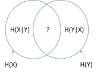
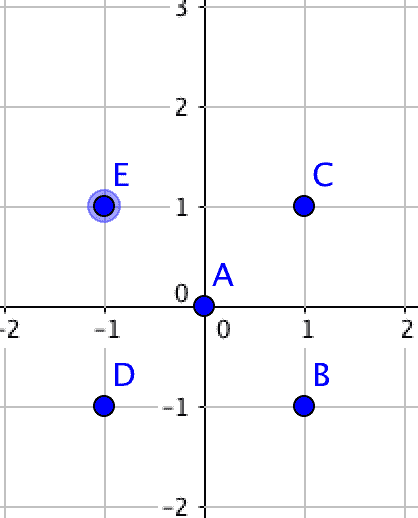

# 网易 2018 校园招聘 NLP 算法工程师笔试卷

## 1

以下集合是凸集的是

正确答案: A   你的答案: 空 (错误)

```cpp
{(x,y) |y=x+1}
```

```cpp
{(x,y) | x 的平方 + y 的平方 = 1}
```

```cpp
{(x,y) | x 的平方 + y 的平方 &gt; 1 }
```

```cpp
{(x,y) |x=1 | y=1 }
```

本题知识点

网易 算法工程师 2018

讨论

[给我一个 offer 叭！！！](https://www.nowcoder.com/profile/1409891)

凸集就是集合内任意两点的连线仍在集合内 A 直线表达式：直线上的任意两点的连线仍在该直线上，所以为凸集 B 圆的表达式：圆上任意两点的连线不在圆上，所以为非凸集 C &gt 为>号，圆外表达式：圆以外的任意两点的连线有可能不在圆外，所以为非凸集 D 只有一个点，非凸集

发表于 2020-04-05 20:51:34

* * *

## 2

以下关于 Linear discriminant analysis（LDA）说法错误的是;

正确答案: B   你的答案: 空 (错误)

```cpp
LDA 假设每个类别的密度分布为高斯分布
```

```cpp
LDA 假设每个类之间的协方差矩阵都是对角阵
```

```cpp
LDA 假设每个类之间的协方差矩阵都相同
```

```cpp
LDA 的分界面为线性的
```

本题知识点

网易 算法工程师 算法工程师 网易 2018

讨论

[给我一个 offer 叭！！！](https://www.nowcoder.com/profile/1409891)

在 LDA 的情况下，假设每个类的高斯共享相同的协方差矩阵

发表于 2020-04-05 20:53:18

* * *

## 3

在以下示意图中， 交集部分可以表示哪个统计量

 

正确答案: C   你的答案: 空 (错误)

```cpp
联合熵
```

```cpp
条件熵
```

```cpp
互信息
```

```cpp
交叉熵
```

本题知识点

网易 算法工程师 算法工程师 网易 2018

讨论

[给我一个 offer 叭！！！](https://www.nowcoder.com/profile/1409891)

H（x|y）是条件熵 知道 y 后 x 还剩多少信息量 H（x）— H（x|y）是互信息 知道 Y，给 X 的信息量带来多少损失

发表于 2020-04-05 20:57:51

* * *

## 4

某棵完全二叉树上有 555 个节点，则该二叉树的叶子节点数为

正确答案: C   你的答案: 空 (错误)

```cpp
276
```

```cpp
277
```

```cpp
278
```

```cpp
279
```

```cpp
230
```

本题知识点

网易 算法工程师 算法工程师 网易 2018

讨论

[superzz](https://www.nowcoder.com/profile/567055)

n0=(取整)(n+1)/2

发表于 2018-05-26 00:15:08

* * *

## 5

下面关于 dynamic_cast 说法错误的有?

正确答案: C   你的答案: 空 (错误)

```cpp
dynamic_cast 在运行期，会检查这个转换是否可能
```

```cpp
dynamic_cast&lt;X&gt;(a)，那么 X 必须是一个指针或者引用
```

```cpp
表达式 dynamic_cast&lt;T*&gt;(a) 将 a 值转换为类型为 T 的对象指针。如果类型 T 不是 a 的某个基类型，该操作将失败抛出 bad_cast 异常
```

```cpp
T1 obj;T2 *pObj = dynamic_cast&lt;T2*&gt;(&amp;obj);被转换对象 obj 的类型 T1 必须是多态类型，即 T1 必须公有继承自其它类，或者 T1 拥有虚函数（继承或自定义）
```

本题知识点

网易 算法工程师 2018 C++

讨论

[Muyao](https://www.nowcoder.com/profile/9115452)

C（错误）：表达式 dynamic_cast<t>(a) 将 a 值转换为类型为 T 的对象指针。如果类型 T 不是 a 的某个基类型，该操作将返回一个**空指针**。它不仅仅像 static_cast 那样，检查转换前后的两个指针是否属于同一个继承树，它还要检查被指针引用的对象的实际类型，确定转换是否可行。如果可以，它返回一个新指针，甚至计算出为处理多继承的需要的必要的偏移量。如果这两个指针间不能转换，转换就会失败，此时返回空指针（NULL）。

发表于 2020-08-07 14:24:23

* * *

[J-Young](https://www.nowcoder.com/profile/955576717)

本题目当中的代码写得实在是太混乱了。关于 dynamic_cast，我们必须要知道它的作用究竟是什么。将指向基类的指针，指向派生类。而且，能够转换的前提是基类当中包含有虚函数，否则是无法完成转换的。

发表于 2021-06-17 16:26:20

* * *

## 6

魔法王国一共有 n 个城市,编号为 0~n-1 号,n 个城市之间的道路连接起来恰好构成一棵树。
小易现在在 0 号城市,每次行动小易会从当前所在的城市走到与其相邻的一个城市,小易最多能行动 L 次。
如果小易到达过某个城市就视为小易游历过这个城市了,小易现在要制定好的旅游计划使他能游历最多的城市,请你帮他计算一下他最多能游历过多少个城市(注意 0 号城市已经游历了,游历过的城市不重复计算)。

本题知识点

网易 算法工程师 贪心 动态规划 树 2018

## 7

小易有一个长度为 N 的正整数数列 A = {A[1], A[2], A[3]..., A[N]}。
牛博士给小易出了一个难题:
对数列 A 进行重新排列,使数列 A 满足所有的 A[i] * Ai + 1 都是 4 的倍数。
小易现在需要判断一个数列是否可以重排之后满足牛博士的要求。

本题知识点

网易 算法工程师 数学 贪心 动态规划 数组 2018

讨论

[HHAH 啊](https://www.nowcoder.com/profile/5409092)

设置一个计数器，循环遍历数组中的每个元素，对于元素 A[i]，如果该元素可以被 4 整除，则 count+2, 如果只可以被 2 整除不可以被 4 整除，则 count+1\.遍历完数组，判断 count 值是否大于等于数组的长度 n,如果是，则该数列可以重排之后满足牛博士的要求，否则不能满足要求

发表于 2018-05-27 15:22:57

* * *

[为啥要起名字](https://www.nowcoder.com/profile/1833472)

```cpp
while True:
    try:
        t=int(raw_input().strip())
        for i in range(t):
            n=int(raw_input().strip())
            a=list(map(int,raw_input().strip().split()))
            count4,count2,countodd=0,0,0
            for j in a:
                if j%4==0:
                    count4+=1
                else:
                    if j%4==2:
                        count2+=1
                    else:
                        countodd+=1
            if count2==0:
                if count4>=countodd-1:
                    print('Yes')
                else:
                    print('No')
            else:
                if count4>=countodd:
                    print('Yes')
                else:
                    print('No')
    except:
        break

```

发表于 2018-07-30 16:35:04

* * *

## 8

小易正在玩一款新出的射击游戏,这个射击游戏在一个二维平面进行,小易在坐标原点(0,0),平面上有 n 只怪物,每个怪物有所在的坐标(x[i], y[i])。小易进行一次射击会把 x 轴和 y 轴上(包含坐标原点)的怪物一次性消灭。
小易是这个游戏的 VIP 玩家,他拥有两项特权操作:
1、让平面内的所有怪物同时向任意同一方向移动任意同一距离
2、让平面内的所有怪物同时对于小易(0,0)旋转任意同一角度
小易要进行一次射击。小易在进行射击前,可以使用这两项特权操作任意次。
小易想知道在他射击的时候最多可以同时消灭多少只怪物,请你帮帮小易。如样例所示:
所有点对于坐标原点(0,0)顺时针或者逆时针旋转 45°,可以让所有点都在坐标轴上,所以 5 个怪物都可以消灭。

本题知识点

网易 算法工程师 模拟 数学 穷举 2018

讨论

[零葬](https://www.nowcoder.com/profile/75718849)

数学

这个题很有意思，对于小易的两种特权操作，无论是所有的怪物都往一个方向移动一步，还是所有怪物都以原点为中心旋转一个角度，所有怪物的相对于位置都是不变的。所以原始位置就已经决定了最终最多可以消灭多少个怪物。我们可以从 n 个坐标中选择 3 个，过这三个点做两条垂线（前两个点 x 和 y 确定一条直线 L1，第三个点 z 做一条过 L1 的垂线 L2），L1 和 L2 能通过的最多点数，就是最多能同时消灭的怪物数。判断某个点 p 是否在这两条垂线上，可以用数学的方法，构建向量

如果和内积为 0，则说明 p 点在垂线上；如果和共线，说明 p 点在方向向量确定的直线上。若和共线，则有：为了避免讨论分母为 0 的情况，交叉相乘得到： ```cpp
import java.io.*;
import java.util.*;

public class Main{
    public static void main(String[] args) throws IOException {
        BufferedReader br = new BufferedReader(new InputStreamReader(System.in));
        String line;
        while((line = br.readLine()) != null){
            int n = Integer.parseInt(line);
            String[] strs = br.readLine().split(" ");
            int[] x = new int[n];
            for(int i = 0; i < n; i++){
                x[i] = Integer.parseInt(strs[i]);
            }
            strs = br.readLine().split(" ");
            int[] y = new int[n];
            for(int i = 0; i < n; i++){
                y[i] = Integer.parseInt(strs[i]);
            }
            System.out.println(solve(n, x, y));
        }
    }

    public static int solve(int n,int[] x,int[] y){
        if(n <= 2){
            return n;
        }
        int res = 0;
        for(int i = 0; i < n; i++){        // 确定第一个点
            for(int j = 0; j < n; j++){    // 确定第二个点
                if(i != j){
                    int[] v1 = {x[j] - x[i], y[j] - y[i]};
                    for(int k = 0; k < n; k++){    // 确定第三个点
                        int count = 0;
                        if(k != i && k != j){
                            for(int r = 0; r < n; r++){
                                int[] v2 = {x[r] - x[k], y[r] - y[k]};
                                int[] v3 = {x[r] - x[i], y[r] - y[i]};
                                if(v1[0]*v2[0] + v1[1]*v2[1] == 0 || v3[0]*v1[1] == v3[1]*v1[0]) {
                                    count++;
                                }
                            }
                        }
                        res = Math.max(res, count);
                    }
                }
            }
        }
        return res;
    }
}
``` 

编辑于 2022-03-05 16:43:39

* * *

## 9

请言简意赅地描述一个你所参与的 NLP 相关项目，包括项目的目标（需要解决的问题）以及系统架构，然后详述一个你最熟悉的模块。如果上述模块是采用传统的机器学习算法（LR，GBDT，SVM 等），请你结合应用谈谈你是如何设计和选择特征的；如果采用的是深度学习方法，请你说明此项目中使用的深度学习算法具有什么样的优势？在该项目中是否使用某些开源的工具或者框架，对比同类工具和框架他们具有什么特点？描述你在参与项目中遇到的主要困难以及你的解决办法。

你的答案

本题知识点

网易 算法工程师 2018</t>