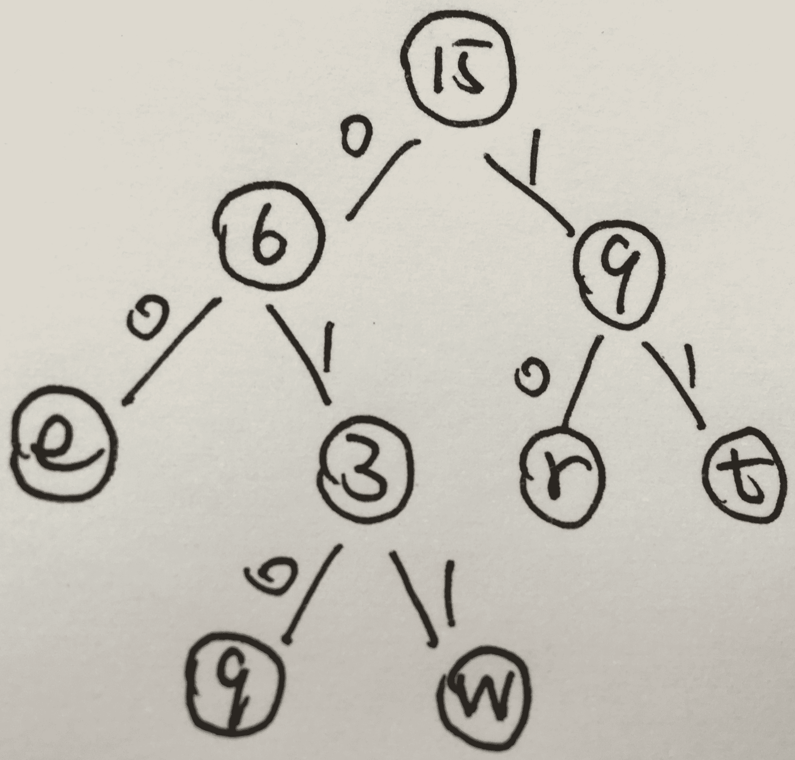

# 网易 2018 校园招聘大数据开发工程师笔试卷

## 1

以下哪种 join 性能最差？

正确答案: A   你的答案: 空 (错误)

```cpp
Nested-loop join
```

```cpp
Indexed nested-loop join
```

```cpp
Merge-join
```

```cpp
Hash-join
```

本题知识点

网易 算法工程师 大数据开发工程师 2018

讨论

[马丘](https://www.nowcoder.com/profile/4843107)

```cpp
Nested-loop join 是循环嵌套查询，效率当然很低。
```

[`blog.csdn.net/a5685263/article/details/51658637`](https://blog.csdn.net/a5685263/article/details/51658637)  具体参考

发表于 2019-04-27 11:11:50

* * *

[Wonder201810121808709](https://www.nowcoder.com/profile/944129495)

 ```cpp
Nested-loop join
```

当索引丢失或者查询条件限制不够时，效率很低；当表的纪录数多时，效率低。当索引丢失或者查询条件限制不够时，效率很低；当表的纪录数多时，效率低。

发表于 2018-10-12 18:54:40

* * *

## 2

java 中，关于 synchronized 关键字的说法错误的是？（ ）

正确答案: D   你的答案: 空 (错误)

```cpp
可以修饰类的静态方法
```

```cpp
可以修饰类的非静态方法
```

```cpp
可以修饰某一段代码块
```

```cpp
可以修饰类的属性
```

本题知识点

网易 算法工程师 大数据开发工程师 网易 2018

## 3

对于最大堆 64,42,58,23,36,47,56,11,22,27,4,2;删除掉最大元素后，调整后堆中元素为:

正确答案: D   你的答案: 空 (错误)

```cpp
56,42,58,23,36,47,2,11,22,27,4
```

```cpp
58,42,56,36,23,47,2,11,22,27,4
```

```cpp
58,42,56,23,36,47,11,2,22,27,4
```

```cpp
58,42,56,23,36,47,2,11,22,27,4
```

本题知识点

网易 算法工程师 大数据开发工程师 网易 2018

## 4

字符串有 5 个字符 q,w,e,r,t，出现的频率分别为 1,2,3,4,5，如果采用 Huffman 编码对字符串编码，则每个字符编码的平均长度是（）?

正确答案: B   你的答案: 空 (错误)

```cpp
2.2
```

```cpp
2.4
```

```cpp
2.6
```

```cpp
2.8
```

```cpp
3.0
```

本题知识点

网易 算法工程师 大数据开发工程师 2018

讨论

[饭稀稀 7](https://www.nowcoder.com/profile/8261286)

Huffman 编码后分别为：q:000,w:001,e:01,r:10,t:11，平均编码长度为（3+3+2+2+2）/5=2.4。

编辑于 2018-07-04 10:38:00

* * *

[YFGu0618](https://www.nowcoder.com/profile/1821085)

不确定解析过程对不对，但是答案是对的
q -> 010w -> 011e -> 00r -> 10t -> 11(3+3+2+2+2) / 5 = 2.4

发表于 2018-08-10 14:30:49

* * *

[kongdian](https://www.nowcoder.com/profile/392012674)

考虑访问的频率，五个字符必定是加权的，huffman 树是为了整体访问加权最低，  qw 在第 4 层，ert 在第三层，整体的访问加权平均结果是 （1+2）*3+（3+4+5）*2  除以 1+2+3+4+5  ， 结果是 2.2 所以 2.2 是访问平均长度 ， 题目问的是编码平均长度 ， 我是 rz

发表于 2019-08-02 15:39:48

* * *

## 5

假如一个二叉树有 1026 个节点，它的深度的可能性有多少种?(假设只有根节点的深度为 1)

正确答案: E   你的答案: 空 (错误)

```cpp
2
```

```cpp
1017
```

```cpp
1014
```

```cpp
1015
```

```cpp
1016
```

本题知识点

网易 算法工程师 大数据开发工程师 网易 2018

讨论

[Skye_kh](https://www.nowcoder.com/profile/1954627)

最短深度是 11 ，最高时 1026  ，一共有 1016 个可能

发表于 2018-08-11 09:24:20

* * *

[高斯没有理](https://www.nowcoder.com/profile/7093334)

最长深度 max 为 1026，最短深度--完全二叉树为 10（2⁰ + 2¹ + ... + 2⁹ < 1026），所以深度可能性 1026 - 10 = 1016

发表于 2018-08-10 11:27:40

* * *

[Yakulttt_](https://www.nowcoder.com/profile/603345698)

最短深度=【log2N+1】向下取整=11 最大深度=102611~1026=1016

发表于 2022-03-21 22:45:35

* * *

## 6

有一个整数序列(1 到 7):2,3,_*,_*,7,1,5,中间二个数字 4,6 被墨水模糊了，看不清顺序了(不知道到底是 4,6 还是 6,4)，它所构成的二叉排序树 a，对 a 进行中序遍历，结果是()

正确答案: C   你的答案: 空 (错误)

```cpp
7-2-1-4-3-6-5
```

```cpp
1-3-5-2-4-6-7
```

```cpp
1-2-3-4-5-6-7
```

```cpp
5-6-3-4-1-2-7
```

```cpp
不能确定
```

本题知识点

网易 算法工程师 大数据开发工程师 网易 2018

讨论

[高斯没有理](https://www.nowcoder.com/profile/7093334)

二叉排序数的概念 BST 的中序遍历为递增序列

发表于 2018-08-10 11:29:33

* * *

## 7

有一个算法的递推关系式为：T(N) = T(2N/3) + 1，则该算法的时间复杂度为（）(^符号是幂的意思)

正确答案: D   你的答案: 空 (错误)

```cpp
O(1)
```

```cpp
O(N^log2(3) )
```

```cpp
O(N^log3(2) )
```

```cpp
O(logN)
```

```cpp
O(N)
```

本题知识点

网易 算法工程师 大数据开发工程师 网易 2018

讨论

[马丘](https://www.nowcoder.com/profile/4843107)

使用的是 master 公式，T(N) = a*T(N/b) + O(N^d)

1.  log(b,a) > d -> 复杂度为 O(N^log(b,a))
2.  log(b,a) = d -> 复杂度为 O(N^d * logN)
3.  log(b,a) < d -> 复杂度为 O(N^d)

发表于 2019-04-27 11:37:05

* * *

[高斯没有理](https://www.nowcoder.com/profile/7093334)

O(log N) == O(log[2/3]N)

发表于 2018-08-10 11:31:08

* * *

## 8

java 中，下面关于 this()和 super()说法正确的有?

正确答案: A   你的答案: 空 (错误)

```cpp
super()和 this()类似,区别是，super 从子类中调用父类的构造方法，this()在同一类内调用其它方法
```

```cpp
this 和 super 可以同时出现在一个构造函数里面
```

```cpp
super()必须放在构造方法内第一行，this()不需要
```

```cpp
super()不能在 static 环境中使用，this()可以
```

本题知识点

网易 算法工程师 大数据开发工程师 网易 2018

讨论

[medews](https://www.nowcoder.com/profile/4905906)

super()和 this()都是对于对象来使用的，所以不能在 static 修饰的代码中使用 this 和 super 都必须在第一行 this 和 super 不能同时在同一个构造方法中，因为 this 会调用其他构造方法，其他构造方法还有 super 方法

发表于 2018-05-26 14:39:42

* * *

[柠檬鲸饲养员](https://www.nowcoder.com/profile/329705606)

this()语句和 super()语句，只能在构造方法中使用，且都只能在构造方法中的第一行，所以他们不能同时出现。如果一个类有父类，则这个类中所有构造方法中默认存在 super()语句，这个语句用来调用父类的构造方法，所以说父类优先创建于子类；如果这个之类的构造方法中有 this()语句，则就不能存在 super()语句，this()表示调用当前类的构造方法。 this 和 this()，this 是关键字，代表当前类的对象，可以用了调用当前类的属性和方法，而 this()代表当前类的构造方法，只能在构造方法中使用。

发表于 2019-09-17 00:19:58

* * *

## 9

下面关于 java 内存区说法错误的是?

正确答案: C   你的答案: 空 (错误)

```cpp
类中的成员变量，存放在堆区
```

```cpp
方法中的局部变量，存放在栈区
```

```cpp
jvm 中的堆区和栈区是私有的，不能被线程共享
```

```cpp
方法区：又叫静态存储区，存放 class 文件和静态数据，线程共享
```

```cpp
常量区放未经 new 的常量
```

本题知识点

网易 算法工程师 大数据开发工程师 2018

讨论

[马丘](https://www.nowcoder.com/profile/4843107)

堆是共有的，栈是私有的[`www.cnblogs.com/lipeineng/p/8358601.html`](https://www.cnblogs.com/lipeineng/p/8358601.html)

编辑于 2019-04-27 12:17:31

* * *

## 10

操作系统中，不同子线程会共享同一个父进程的?

正确答案: B   你的答案: 空 (错误)

```cpp
寄存器组的值
```

```cpp
文件描述符
```

```cpp
线程的堆栈
```

```cpp
错误返回码
```

本题知识点

网易 算法工程师 大数据开发工程师 2018

讨论

[马丘](https://www.nowcoder.com/profile/4843107)

父子进程之间的关系 
关于资源：子进程得到的是除了代码段是与父进程共享的意外，其他所有的都是得到父进程的一个副本，子进程的所有资源都继承父进程，得到父进程资源的副本，既然为副本，也就是说，二者并不共享地址空间。，两个是单独的进程，继承了以后二者就没有什么关联了，子进程单独运行。（采用写时复制技术） 
关于文件描述符：继承父进程的文件描述符时，相当于调用了 dup 函数，父子进程共享文件表项，即共同操作同一个文件，一个进程修改了文件，另一个进程也知道此文件被修改了。

发表于 2019-04-27 12:20:24

* * *

## 11

Belady 现象可能会出现在以下哪个算法中?

正确答案: D   你的答案: 空 (错误)

```cpp
预防死锁算法
```

```cpp
磁盘调度算法
```

```cpp
内存管理算法
```

```cpp
内存换页算法
```

```cpp
进程调度算法
```

本题知识点

网易 算法工程师 大数据开发工程师 2018

讨论

[马丘](https://www.nowcoder.com/profile/4843107)

链接：[`www.nowcoder.com/questionTerminal/82cf791b133547bbaa7622bbd23a5ef3`](https://www.nowcoder.com/questionTerminal/82cf791b133547bbaa7622bbd23a5ef3)
来源：牛客网
**所谓 Belady 现象是指：采用 FIFO 算法时，如果对—个进程未分配它所要求的全部页面，有时就会出现分配的页面数增多但缺页率反而提高的异常现象。****Belady 现象的原因是 FIFO 算法的置换特征与进程访问内存的动态特征是矛盾的，即被置换的页面并不是进程不会访问的。 先进先出算法(FIFO)。选择装入最早的页面置换。可以通过链表来表示各页的装入时间先后。FIFO 的性能较差，因为较早调入的页往往是经常被访问的 页，这些页在 FIFO 算法下被反复调入和调出，并且有 Belady 现象.**

发表于 2019-04-27 12:32:36

* * *

## 12

下面关于 TCP 和 UDP 说法正确的是?

正确答案: A   你的答案: 空 (错误)

```cpp
在 TCP/UDP 传输段中，源端口地址和目的端口地址是不能相同的
```

```cpp
当客户端和服务器建立的是 TCP 连接的时候，服务器最后如果想要断开直接断开连接，停止发送数据就好了
```

```cpp
UDP 是用户数据报协议，是一个简单的面向数据报的应用层协议
```

```cpp
UDP 在传输数据报前不用在客户和服务器之间建立一个连接，但是也有超时重发的机制
```

```cpp
UDP 的传输速度优于 TCP
```

本题知识点

网易 算法工程师 大数据开发工程师 网易 2018

讨论

[马丘](https://www.nowcoder.com/profile/4843107)

```cpp
在 TCP/UDP 传输段中，若源端口地址和目的端口地址相同，相当于是建立了一条自己通向自己的连接，会造成资源浪费.

	B 选项：断开 tcp 连接，要发送“断开请求”

	C 选项：udp 是运输层协议

	D 选项：没有超时重发的机制

	E 选项：丢包多时，udp 速度反而更慢

```

发表于 2019-04-27 12:34:39

* * *

[kongdian](https://www.nowcoder.com/profile/392012674)

这是真的吗？   首先另外一个回答肯定是没看懂题目， 端口地址就是端口号的意思， 题目表达的意思是  不同 ip 相互通信的时候，建立的连接不可以使用相同的端口。我第一次知道这个事情 UCP 传输速度绝大部分情况是优于 TCP 的，最明显的大型网络不能容忍延迟的游戏用的是 UDP 吧， 可能网易的荒野行动用的是 tcp

发表于 2019-08-02 15:56:32

* * *

## 13

TCP 数据包里的出现什么标志位表示连接被异常终止，或被拒绝的异常请求

正确答案: B   你的答案: 空 (错误)

```cpp
FIN/ACK
```

```cpp
RST/ACK
```

```cpp
SYN
```

```cpp
ACK
```

本题知识点

网易 算法工程师 大数据开发工程师 网易 2018

讨论

[高斯没有理](https://www.nowcoder.com/profile/7093334)

SYN 表示建立连接，

FIN 表示关闭连接，

ACK 表示响应，

PSH 表示有 DATA 数据传输，

RST 表示连接重置。

 其中，ACK 是可能与 SYN，FIN 等同时使用的，比如 SYN 和 ACK 可能同时为 1，它表示的就是建立连接之后的响应，

 如果只是单个的一个 SYN，它表示的只是建立连接。

TCP 的几次握手就是通过这样的 ACK 表现出来的。

 但 SYN 与 FIN 是不会同时为 1 的，因为前者表示的是建立连接，而后者表示的是断开连接。

RST 一般是在 FIN 之后才会出现为 1 的情况，表示的是连接重置。

 一般地，当出现 FIN 包或 RST 包时，我们便认为客户端与服务器端断开了连接；而当出现 SYN 和 SYN＋ACK 包时，我们认为客户端与服务器建立了一个连接。

发表于 2018-08-10 11:46:23

* * *

## 14

以下关于 mapreduce 中 shuffle 过程说法正确的是

正确答案: A   你的答案: 空 (错误)

```cpp
如果没有 reduce 任务，map 直接输出到 HDFS，则 hadoop 任务不需要 shuffle 过程
```

```cpp
map 的输出会首先输出到 HDFS 上，然后再 copy 到 reduce 的本地磁盘
```

```cpp
Hadoop 容许用户声明使用 combiner， 此函数会被允许在 map 的输出数据上，hadoop 框架在每个 map 输出上会且仅会调用一次
```

```cpp
map 和 reduce 之间 copy 数据是使用的 ftp 协议
```

本题知识点

网易 算法工程师 大数据开发工程师 2018

讨论

[medews](https://www.nowcoder.com/profile/4905906)

如果没有 reduce 直接写到磁盘，如果有 reduce，先写到内存，内存满的话再写到磁盘。

发表于 2018-05-26 18:25:32

* * *

[马丘](https://www.nowcoder.com/profile/4843107)

[`blog.csdn.net/asn_forever/article/details/81233547`](https://blog.csdn.net/asn_forever/article/details/81233547)

发表于 2019-04-27 12:37:19

* * *

[luohuadefeng](https://www.nowcoder.com/profile/556081896)

http 协议

发表于 2019-10-06 15:24:34

* * *

## 15

HDFS 的设计中没有考虑以下哪个特性

正确答案: D   你的答案: 空 (错误)

```cpp
超大文件
```

```cpp
流式的数据访问
```

```cpp
HDFS 基于商用硬件，对于大集群而言，发生节点故障的几率较高
```

```cpp
低数据延迟
```

本题知识点

网易 算法工程师 大数据开发工程师 2018

讨论

[medews](https://www.nowcoder.com/profile/4905906)

**不适合低延迟数据访问：**HDFS 是为了处理大型数据集，主要是为了达到高的数据吞吐量而设计，这就可能以高延迟作为代价。10 毫秒以下的访问可以无视 hdfs，不过 hbase 可以弥补这个缺点。**无法高效存储大量小文件：**namenode 节点在内存中存储整个文件系统的元数据，因此文件的数量就会受到限制，每个文件的元数据大约 150 字节。**不支持多用户写入及任意修改文件**：不支持多用户对同一文件进行操作，而且写操作只能在文件末尾完成，即追加操作。

发表于 2018-05-26 18:35:46

* * *

## 16

以下关于 Hadoop 中数据压缩说法正确的是

正确答案: C   你的答案: 空 (错误)

```cpp
gzip 压缩支持文件分割，输入的文件块可以给多个 map 任务共用，可能会导致运行时间变长
```

```cpp
对于大型文件，最好对整个文件进行 gzip 压缩，提高空间利用率
```

```cpp
对于 gzip 的文本压缩文件，可以通过 hadoop fs –text 方式来查看文件内容
```

```cpp
在 hadoop 脚本中通过设置 mapred.output.compression.codec=true 来设置使用默认压缩算法
```

本题知识点

网易 算法工程师 大数据开发工程师 2018

讨论

[马丘](https://www.nowcoder.com/profile/4843107)

[`blog.csdn.net/qq_35641192/article/details/80490557`](https://blog.csdn.net/qq_35641192/article/details/80490557)

发表于 2019-04-27 12:52:01

* * *

## 17

以下 hive sql 语法正确的是

正确答案: D   你的答案: 空 (错误)

```cpp
select * from a inner join b on a.id&lt;&gt;b.id
```

```cpp
select * from a where a.id in (select id from b)
```

```cpp
select sum(a.amt) as total from a where a.total&gt;20
```

```cpp
select * from a inner join b on a.id=b.id
```

本题知识点

网易 算法工程师 大数据开发工程师 网易 2018

讨论

[橘子大盗](https://www.nowcoder.com/profile/950135649)

D

发表于 2019-05-21 21:13:05

* * *

[小蜗的城堡](https://www.nowcoder.com/profile/706965766)

hive 下的 SQL 特点：     1.不支持等值连接，即不支持 where [a.id](http://a.id/) = b.id 的连接方式，一般使用 left join、right join 或者 inner join 替代。    2.不能智能识别 concat(‘;’,key)，只会将‘；’当做 SQL 结束符号。    3.不支持 INSERT INTO 表 Values（）, UPDATE, DELETE 等操作，hive 不支持将数据插入现有的表或分区，仅支持覆盖重写整张表。    4.HiveQL 中 String 类型的字段若是空(empty)字符串, 即长度为 0, 那么对它进行 IS NULL 的判断结果是 False，使用 left join 可以进行筛选行。hive 中没有 not null，当字段为 null 时，使用\n 代替。    5.不支持 ‘< dt <’这种格式的范围查找，可以用 dt in(”,”)或者 between 替代。

发表于 2020-08-02 16:51:41

* * *

## 18

以下关于 hive 以及 Hadoop 生态系统中其他组件的说法正确的是

正确答案: B   你的答案: 空 (错误)

```cpp
Hbase 依赖 HDFS 存储数据，实现的编程语言为 Java
```

```cpp
Hbase 是一个面向列分布式数据库，和 hive 不同的是，hbase 能够在它的数据库上实时运行，而不是运行 mapreduce 任务
```

```cpp
hive 不支持数据更新，延迟比较小，可用于实时查询系统
```

```cpp
hive 采用了 SQL 的查询语言 HQL，其支持了 SQL 中的所有特性
```

本题知识点

网易 算法工程师 大数据开发工程师 网易 2018

讨论

[陈苏航](https://www.nowcoder.com/profile/636134617)

发生的

发表于 2018-10-12 08:17:08

* * *

[kongdian](https://www.nowcoder.com/profile/392012674)

为什么没人对 A 解析呢，HBase 可以使用其他的文件系统，不一定是 hdfs；但是基本会用 hdfsA 的说法有些欠妥，但也不能说错 hive 不仅仅可以运行 mapreduce 任务，也可以进行查询。在 hive-default.xml.template 文件中 hive.fetch.task.conversion 默认是 more，老版本 hive 默认是 minimal，该属性修改为 more 以后，在全局查找、字段查找、limit 查找等都不走 mapreduce

发表于 2019-08-02 16:46:45

* * *

[Mowar](https://www.nowcoder.com/profile/9730423)

Hive 查询延时比较严重，离线分析 hbase : 实时查询不支持所有 sql 所有特性

发表于 2018-10-11 20:32:16

* * *

## 19

shell 中，可以让一个变量变为全局变量的是？

正确答案: B   你的答案: 空 (错误)

```cpp
alias
```

```cpp
export
```

```cpp
exports
```

```cpp
let
```

本题知识点

网易 算法工程师 大数据开发工程师 网易 2018

## 20

大表 1000 万条数据， 小表 1000 条数据， 为提高查询效率两行表关联时通常做法是

正确答案: B   你的答案: 空 (错误)

```cpp
大表在前
```

```cpp
大表在后
```

```cpp
小表子查询
```

```cpp
先处理成一张表在查询
```

本题知识点

网易 算法工程师 大数据开发工程师 2018 硬件工程师 浩鲸云 2020

讨论

[訾尤](https://www.nowcoder.com/profile/853867278)

小表在前，大表在后，防止出现数据倾斜。

发表于 2019-09-21 10:15:53

* * *

[马丘](https://www.nowcoder.com/profile/4843107)

[`www.cnblogs.com/xubiao/p/5438460.html`](https://www.cnblogs.com/xubiao/p/5438460.html)

发表于 2019-04-27 12:55:04

* * *

[牛客 181809468 号](https://www.nowcoder.com/profile/181809468)

小于表头的放在前面，大于表头的放在后面。小表头放在前面，大表头放在后面

发表于 2021-09-04 16:56:23

* * *

## 21

魔法王国一共有 n 个城市,编号为 0~n-1 号,n 个城市之间的道路连接起来恰好构成一棵树。
小易现在在 0 号城市,每次行动小易会从当前所在的城市走到与其相邻的一个城市,小易最多能行动 L 次。
如果小易到达过某个城市就视为小易游历过这个城市了,小易现在要制定好的旅游计划使他能游历最多的城市,请你帮他计算一下他最多能游历过多少个城市(注意 0 号城市已经游历了,游历过的城市不重复计算)。

本题知识点

网易 算法工程师 贪心 动态规划 树 大数据开发工程师 2018

## 22

一个合法的括号匹配序列被定义为:
1\. 空串""是合法的括号序列
2\. 如果"X"和"Y"是合法的序列,那么"XY"也是一个合法的括号序列
3\. 如果"X"是一个合法的序列,那么"(X)"也是一个合法的括号序列
4\. 每个合法的括号序列都可以由上面的规则生成
例如"", "()", "()()()", "(()())", "(((()))"都是合法的。
从一个字符串 S 中移除零个或者多个字符得到的序列称为 S 的子序列。
例如"abcde"的子序列有"abe","","abcde"等。
定义 LCS(S,T)为字符串 S 和字符串 T 最长公共子序列的长度,即一个最长的序列 W 既是 S 的子序列也是 T 的子序列的长度。
小易给出一个合法的括号匹配序列 s,小易希望你能找出具有以下特征的括号序列 t:
1、t 跟 s 不同,但是长度相同
2、t 也是一个合法的括号匹配序列
3、LCS(s, t)是满足上述两个条件的 t 中最大的
因为这样的 t 可能存在多个,小易需要你计算出满足条件的 t 有多少个。

如样例所示: s = "(())()",跟字符串 s 长度相同的合法括号匹配序列有:
"()(())", "((()))", "()()()", "(()())",其中 LCS( "(())()", "()(())" )为 4,其他三个都为 5,所以输出 3.

本题知识点

网易 算法工程师 字符串 *贪心 栈 *穷举 哈希 *大数据开发工程师 2018*** ***## 23

小易正在玩一款新出的射击游戏,这个射击游戏在一个二维平面进行,小易在坐标原点(0,0),平面上有 n 只怪物,每个怪物有所在的坐标(x[i], y[i])。小易进行一次射击会把 x 轴和 y 轴上(包含坐标原点)的怪物一次性消灭。
小易是这个游戏的 VIP 玩家,他拥有两项特权操作:
1、让平面内的所有怪物同时向任意同一方向移动任意同一距离
2、让平面内的所有怪物同时对于小易(0,0)旋转任意同一角度
小易要进行一次射击。小易在进行射击前,可以使用这两项特权操作任意次。
小易想知道在他射击的时候最多可以同时消灭多少只怪物,请你帮帮小易。如样例所示:
所有点对于坐标原点(0,0)顺时针或者逆时针旋转 45°,可以让所有点都在坐标轴上,所以 5 个怪物都可以消灭。

本题知识点

网易 算法工程师 模拟 数学 穷举 大数据开发工程师 2018

讨论

[doggyh](https://www.nowcoder.com/profile/394045167)

思路：先选择 3 点，前两个点构造一条直线，后面一个点构造一条垂直于前一条直线的直线，然后枚举剩下的点是否在这两条线上。
涉及到的数学知识：
判断一个点是否在某直线上有两个点（x1，y1） （x2，y2），待判断的点（x3，y3），
如果（x3-x1）/（y3-y1）=（x2-x1）/（y2-y1），则共线

判断是否在垂线上：
运用的公理：两垂直线的斜率之积为-1
直线上有两个点（x1，y1） （x2，y2），垂线上点（x4，y4）待判断的点（x3，y3）。
（x2-x1）/（y2-y1）*（x3-x4）/（y3-y4）=-1，则该点在垂线上。
————————————————
public class ShotGame{
    public static void main(String[] args){
        Scanner sc=new Scanner(System.in);
        while(sc.hasNext()){
            int n=sc.nextInt();
            int[] x=new int[n];
            int[] y=new int[n];
            for(int i=0;i<n;i++){
                x[i]=sc.nextInt();
            }
            for(int i=0;i<n;i++){
                y[i]=sc.nextInt();
            }
            int res=solve(n,x,y);
            System.out.println(res);
        }
    }
    public static int solve(int n,int[] x,int[] y){
        int res = 1;
        if (n <= 2)return n;
        for (int i=0; i<n; i++) {  //first point
            for (int j=0; j<n; j++) {  //second point
                if (i != j){
                    int dx1 = x[j] - x[i];
                    int dy1 = y[j] - y[i];
                    for (int k=0; k<n; k++) {  //third point
                        int count = 0;
                        if (k != i && k != j){
                            for (int r=0; r<n; r++) {
                                int dx2 = x[r] - x[i];
                                int dy2 = y[r] - y[i];
                                if (dy1*dx2 == dx1*dy2) {//判断当前点是否和选定的前两个点在同一条直线上
                                    count++;
                                }else{
                                    dx2 = x[r] - x[k];
                                    dy2 = y[r] - y[k];
                                    if (dy1*dy2 == -dx1*dx2) {//判断当前点是否在选定的第三个点和前两个点形成垂直的线上
                                        count++;
                                    }
                                }
                            }
                        }
                        res = Math.max(res, count);
                    }
                }
            }
        }
        return res;
    }

编辑于 2021-07-21 14:41:12

* * ****