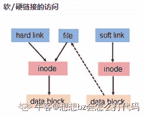

# 网易 2018 校园招聘运维工程师笔试卷

## 1

永久修改系统主机名为 testserver 并且立即生效，正确的做法是

正确答案: A   你的答案: 空 (错误)

```cpp
执行命令 hostname testserver，然后修改文件/etc/sysconfig/network 主机名字段为 testserver
```

```cpp
执行命令 hostname testserver 即可
```

```cpp
修改文件/etc/sysconfig/network
```

```cpp
修改文件/etc/sysconfig/network，然后重启网卡
```

本题知识点

网易 运维工程师 2018

## 2

修改替换 file 文件中 myname 字段为 name, 下列正确的是:

正确答案: D   你的答案: 空 (错误)

```cpp
sed 's@name@myname@g' file
```

```cpp
sed -i 's@name@myname@g' file
```

```cpp
sed 's@myname@name@g' file
```

```cpp
sed -i 's@myname@name@g' file
```

本题知识点

网易 运维工程师 2018

讨论

[磕磕](https://www.nowcoder.com/profile/107617791)

```cpp
sed -i 's/原字符串/新字符串/g' /home/1.txt
```

发表于 2019-05-09 15:51:50

* * *

[小张同志](https://www.nowcoder.com/profile/5631978)

Sed -i 's@新内容@旧内容@g 'file

发表于 2018-05-28 10:46:10

* * *

## 3

查看/tmp/log 目录下 5 天前的并且大于 1G 的文件，然后删除，下列正确的是:

正确答案: C   你的答案: 空 (错误)

```cpp
find /tmp/log -mtime -5 -zise 1G | xargs rm
```

```cpp
find /tmp/log -mtime -5 -size +1G | xargs rm
```

```cpp
find /tmp/log -mtime +5 -size +1G | xargs rm
```

```cpp
find /tmp/log -mtime +5 -size 1G | xargs rm
```

本题知识点

网易 运维工程师 2018

讨论

[发妈妈的第十万零一个干儿子](https://www.nowcoder.com/profile/4343524)

时间线(从左到右流)，+表示往左，-表示往右

发表于 2018-05-28 16:51:52

* * *

## 4

临时需要制作一个 1G 大小的文件 tmp，以下做法正确的是:

正确答案: B   你的答案: 空 (错误)

```cpp
dd if=/dev/zero of=tmp count=1G bs=1
```

```cpp
dd if=/dev/zero of=tmp count=1 bs=1G
```

```cpp
dd if=/dev/zero of=tmp count=1 bs=1
```

```cpp
dd if=/dev/zero of=tmp count=1G bs=1G
```

本题知识点

网易 运维工程师 运维工程师 网易 2018

讨论

[小张同志](https://www.nowcoder.com/profile/5631978)

/dev/zero 是一个字符设备，会不断返回 0 值字节（\0） If 为输入 Of 为输出 Count 为复制的次数 Bs 为大小

发表于 2018-05-28 10:55:11

* * *

## 5

以下 python 代码输出为

```cpp
>>> val=[['a'] * 3] * 3
>>> val[0][0]='b'
>>> print val;

```

正确答案: B   你的答案: 空 (错误)

```cpp
[['b', 'b', 'b'], ['b', 'b', 'b'], ['b', 'b', 'b']]
```

```cpp
[['b', 'a', 'a'], ['b', 'a', 'a'], ['b', 'a', 'a']]
```

```cpp
[['b', 'a', 'a'], ['a', 'a', 'a'], ['a', 'a', 'a']]
```

```cpp
[['a', 'a', 'a'], ['a', 'a', 'a'], ['a', 'a', 'a']]
```

本题知识点

网易 运维工程师 2018

## 6

在 Linux 系统下，查看进程占用的端口的命令是什么?

正确答案: A   你的答案: 空 (错误)

```cpp
netstat –apn
```

```cpp
watch
```

```cpp
lsof
```

```cpp
ps -aux
```

本题知识点

网易 运维工程师 运维工程师 网易 2018

## 7

java 中，关于 synchronized 关键字的说法错误的是？（ ）

正确答案: D   你的答案: 空 (错误)

```cpp
可以修饰类的静态方法
```

```cpp
可以修饰类的非静态方法
```

```cpp
可以修饰某一段代码块
```

```cpp
可以修饰类的属性
```

本题知识点

网易 运维工程师 2018

## 8

某文件的组内成员的权限为只写，所有者为读和写，组外成员为只读，则该文件的权限为()

正确答案: B   你的答案: 空 (错误)

```cpp
642
```

```cpp
624
```

```cpp
264
```

```cpp
246
```

```cpp
426
```

本题知识点

网易 运维工程师 2018

讨论

[发妈妈的第十万零一个干儿子](https://www.nowcoder.com/profile/4343524)

rwx：421

发表于 2018-05-28 16:53:29

* * *

[小张同志](https://www.nowcoder.com/profile/5631978)

所有者|组内成员|其他成员 读写 110 写 010 读 100

发表于 2018-05-28 11:22:53

* * *

## 9

关于 linux 中 shell 变量$,下面那个说法是错误的?

正确答案: C   你的答案: 空 (错误)

```cpp
$0 是脚本本身的名字
```

```cpp
$@ 是传给脚本的所有参数的列表
```

```cpp
$1 是传递给该 shell 脚本的第二个参数
```

```cpp
$$ 是脚本运行的当前进程 ID 号
```

本题知识点

网易 运维工程师 2018

讨论

[小张同志](https://www.nowcoder.com/profile/5631978)

linux 中 shell 变量$#,$@,$0,$1,$2 的含义解释/Shell 中的${}、##和%%使用范例/export 转载 2017 年 06 月 16 日 10:02:45 阅读 2650 linux 中 shell 变量$#,$@,$0,$1,$2 的含义解释: 变量说明: $$ Shell 本身的 PID（ProcessID） $! Shell 最后运行的后台 Process 的 PID $? 最后运行的命令的结束代码（返回值） $- 使用 Set 命令设定的 Flag 一览 $* 所有参数列表。如"$*"用「"」括起来的情况、以"$1 $2 … $n"的形式输出所有参数。 $@ 所有参数列表。如"$@"用「"」括起来的情况、以"$1" "$2" … "$n" 的形式输出所有参数。 $# 添加到 Shell 的参数个数 $0 Shell 本身的文件名 $1～$n 添加到 Shell 的各参数值。$1 是第 1 参数、$2 是第 2 参数…。

发表于 2018-05-28 11:27:01

* * *

## 10

下面关于 Linux 链接说法正确的是()

正确答案: D   你的答案: 空 (错误)

```cpp
符号链接又被称为硬链接
```

```cpp
硬链接可以跨文件系统，软链接不可以
```

```cpp
软链接不可以对一个不存在的文件名进行链接
```

```cpp
软链接可以对目录进行链接
```

```cpp
硬链接指向是的不同的 inode 节点
```

本题知识点

网易 运维工程师 运维工程师 网易 2018

讨论

[想想 bz 会怎么打代码](https://www.nowcoder.com/profile/847933232)


硬链接存在以下几点特性：

*   文件有相同的 inode 及 data block；
*   只能对已存在的文件进行创建；
*   不能交叉文件系统进行硬链接的创建；
*   不能对目录进行创建，只可对文件创建；
*   删除一个硬链接文件并不影响其他有相同 inode 号的文件。

软链接存在以下几点特性：

*   软链接有自己的文件属性及权限等；
*   可对不存在的文件或目录创建软链接；
*   软链接可交叉文件系统；
*   软链接可对文件或目录创建；
*   创建软链接时，链接计数 i_nlink 不会增加；
*   删除软链接并不影响被指向的文件，但若被指向的原文件被删除，则相关软连接被称为死链接（即 dangling link，若被指向路径文件被重新创建，死链接可恢复为正常的软链接）。

发表于 2020-04-22 00:13:50

* * *

## 11

Linux 进程内存空间有以下几个部分:

> 1.stack 2.heap3.bss segment4.code segment/text segment5.data segment

它们从高地址到低地址的分布顺序为()

正确答案: B   你的答案: 空 (错误)

```cpp
45321
```

```cpp
12354
```

```cpp
45312
```

```cpp
21354
```

本题知识点

网易 运维工程师 2018

讨论

[想想 bz 会怎么打代码](https://www.nowcoder.com/profile/847933232)

**在 Linux 中，进程的内存空间按低地址到高地址的顺序分为：代码段 text、数据段 data、bss 段、堆、栈和内核数据区（命令行参数和环境变量等）。**

发表于 2020-04-22 00:18:10

* * *

## 12

下面关于 Linux 中多核 CPU 描述错误的是()

正确答案: B   你的答案: 空 (错误)

```cpp
多个核能直接通信
```

```cpp
多个核能平均处理系统中的任务
```

```cpp
多个核可以并行计算
```

```cpp
可以把某个进程绑定到某个核上
```

本题知识点

网易 运维工程师 2018

## 13

对于最大堆 64,42,58,23,36,47,56,11,22,27,4,2;删除掉最大元素后，调整后堆中元素为:

正确答案: D   你的答案: 空 (错误)

```cpp
56,42,58,23,36,47,2,11,22,27,4
```

```cpp
58,42,56,36,23,47,2,11,22,27,4
```

```cpp
58,42,56,23,36,47,11,2,22,27,4
```

```cpp
58,42,56,23,36,47,2,11,22,27,4
```

本题知识点

网易 运维工程师 运维工程师 网易 2018

## 14

由递归方式求的 N 的阶乘(即 N！)，时间复杂度是多少?

正确答案: D   你的答案: 空 (错误)

```cpp
O(N!)
```

```cpp
O(logN)
```

```cpp
O(N²)
```

```cpp
O(N)
```

```cpp
O(NlogN)
```

本题知识点

网易 运维工程师 运维工程师 网易 2018

## 15

依次要访问磁道为 21,45,42,6,81,13,78,当前磁头位于 42 号柱面，若用最短寻道时间优先磁盘调度算法，则访问序列为（）

正确答案: B   你的答案: 空 (错误)

```cpp
21,45,42,6,81,13,78
```

```cpp
42,45,21,13,6,78,81
```

```cpp
42,45,78,81,21,13,6
```

```cpp
42,45,78,81,6,13,21
```

```cpp
42,45,78,81,13,6,19
```

```cpp
42,21,13,6,81,78,45
```

本题知识点

网易 运维工程师 运维工程师 网易 2018

## 16

下面关于父子进程说法错误的是?

正确答案: A   你的答案: 空 (错误)

```cpp
fork（）时子进程拷贝了父进程除了数据段以外的绝大部分空间，包括代码段，堆栈段等
```

```cpp
在拷贝的时候，系统会为子进程创建一个新的进程表项
```

```cpp
虽然父子进程共享代码空间，但是在涉及写数据时子进程有自己的数据空间，在有数据修改时，系统会为子进程申请新的页面
```

```cpp
所有进程都是 init 进程直接或者间接的 fork 出来的
```

本题知识点

网易 运维工程师 运维工程师 网易 2018

讨论

[归来仍是少年 v](https://www.nowcoder.com/profile/255695337)

在 fork 之后 exec 之前两个进程用的是相同的物理空间（内存区），子进程的代码段、数据段、堆栈都是指向父进程的物理空间，

发表于 2019-09-11 10:15:28

* * *

## 17

Belady 现象可能会出现在以下哪个算法中?

正确答案: D   你的答案: 空 (错误)

```cpp
预防死锁算法
```

```cpp
磁盘调度算法
```

```cpp
内存管理算法
```

```cpp
内存换页算法
```

```cpp
进程调度算法
```

本题知识点

网易 运维工程师 运维工程师 网易 2018

讨论

[陈铁方 1996](https://www.nowcoder.com/profile/253604020)

所谓 Belady 现象是指:在分页式虚拟存储器管理中，发生缺页时的置换算法采用 FIFO([先进先出](https://baike.so.com/doc/6704993-6918968.html))算法时，如果对一个进程未分配它所要求的全部页面，有时就会出现分配的页面数增多但缺页率反而提高的异常现象。

发表于 2020-08-16 18:22:05

* * *

## 18

如果把一个网络 30.30.0.0 分为两个子网，第一个子网是 30.30.0.0/17，那么第二个子网将会是()

正确答案: D   你的答案: 空 (错误)

```cpp
30.30.1.0/17
```

```cpp
30.30.2.0/16
```

```cpp
30.30.64.0/17
```

```cpp
30.30.128.0/17
```

```cpp
30.30.192.0/17
```

本题知识点

网易 运维工程师 运维工程师 网易 2018

讨论

[想想 bz 会怎么打代码](https://www.nowcoder.com/profile/847933232)

 ```cpp
子网掩码是 17 个 1,即 11111111.11111111.10000000.0000000
化为二进制就是 255.255.128.0
从第 17 位开始划分起，这里可以是 0/128，所以这两个子网是 30.30.0.0/17 和 30.30.128.0/17
``` 

编辑于 2020-04-22 00:32:33

* * *

## 19

TCP SYN 攻击是利用 TCP 的弱点来进行攻击，攻击者向服务器发出 SYN 请求后，服务器对接收到的 SYN 请求做什么处理

正确答案: B   你的答案: 空 (错误)

```cpp
服务器在收到攻击者发出的 SYN 请求后不会向攻击者发出任何数据包
```

```cpp
服务器在收到攻击者发出的 SYN 请求后会向攻击者发送 SYN+ACK 数据包
```

```cpp
服务器在收到攻击者发出的 SYN 请求后会向攻击者发送 SYN 数据包
```

```cpp
服务器在收到攻击者发出的 SYN 请求后会和攻击者建立连接
```

本题知识点

网易 运维工程师 运维工程师 网易 2018

## 20

shell 中，如果想匹配以 wangyi 开头的行，应该采用下面的哪个正则表达式？

正确答案: A   你的答案: 空 (错误)

```cpp
^wangyi
```

```cpp
wangyi$
```

```cpp
\wangyi
```

```cpp
*wangyi
```

本题知识点

网易 运维工程师 运维工程师 网易 2018

## 21

讲述一下 Linux 进程的几个运行状态，D 状态一般是什么情况造成的，Z 状态是什么原因导致的？

你的答案

本题知识点

网易 运维工程师 2018

## 22

内核在报“filesystem is full”，df 显示磁盘还有空余空间，然后你尝试删除了部分文件，但是发现根本没有多少空间 free 出来，请描述一下你的后续排查和处理方式。

你的答案

本题知识点

网易 运维工程师 2018

讨论

[牛客 675187165 号](https://www.nowcoder.com/profile/675187165)

1）inode 节点被使用完后就算磁盘还有空间也不能继续在该磁盘中创建文件 2）划分的 block 太大但是存的是很小的文件，造成许多空间浪费 3）vdo 只是我的观点，不知道对错

发表于 2021-04-29 23:50:07

* * *

## 23

为了得到一个数的"相反数",我们将这个数的数字顺序颠倒,然后再加上原先的数得到"相反数"。例如,为了得到 1325 的"相反数",首先我们将该数的数字顺序颠倒,我们得到 5231,之后再加上原先的数,我们得到 5231+1325=6556.如果颠倒之后的数字有前缀零,前缀零将会被忽略。例如 n = 100, 颠倒之后是 1.

本题知识点

网易 运维工程师 模拟 字符串 *数学 栈 *2018** **讨论

[为啥要起名字](https://www.nowcoder.com/profile/1833472)

while True:
    try:
        s=raw_input().strip()
        print(int(s)+int(s[::-1]))
    except:
        break

发表于 2018-05-28 08:49:57

* * *

[HeandNe](https://www.nowcoder.com/profile/604591491)

#include <iostream>#include <string>#include <stdlib.h>#include <algorithm>usingnamespacestd;intmain(){    longlongn;    cin >> n;    string tmp = to_string(n);    reverse(tmp.begin(),tmp.end());    longlongd = atoll(tmp.c_str());    cout << d+n ;    return0;}

发表于 2019-08-03 10:44:05

* * *

[NNNN4](https://www.nowcoder.com/profile/9860814)

```cpp
//一直报错，到底哪里错了啊。。
function fn(n){
    var con = 0;
    for(var i =1;parseInt(n/i)>0;i*=10){
        con =con + (parseInt(n/i))%10 + "";
    }
    return Number(con) + Number(n);   
}

```

发表于 2018-05-27 15:54:24

* * *

## 24

一个由小写字母组成的字符串可以看成一些同一字母的最大碎片组成的。例如,"aaabbaaac"是由下面碎片组成的:'aaa','bb','c'。牛牛现在给定一个字符串,请你帮助计算这个字符串的所有碎片的平均长度是多少。

本题知识点

网易 运维工程师 字符串 *贪心 模拟 2018* *讨论

[go 镳镳](https://www.nowcoder.com/profile/659807961)

```cpp
public class Main{
    public static void main(String[]args){
        Scanner sc = new Scanner(System.in);

        while(sc.hasNext()){
            String str = sc.nextLine();
            List<Integer> list = new ArrayList<>();
            int count = 1;
            for(int i=0; i< str.length()-1; i++){
                char c = str.charAt(i);
                if(str.charAt(i+1) == c) count++;
                else{
                    list.add(count);
                    count =1;
                }
            }
            list.add(count);
            int sum =0, length = list.size();
            for(int i =0; i < length; i++){
                sum+=list.get(i);
            }
            return sum/length;

        }
    }
}
```

发表于 2020-09-05 10:55:03

* * *

[Its.](https://www.nowcoder.com/profile/5502493)

```cpp
def fun(str):
    count=1
    for i in range(1,str.__len__()):
        if str[i]==str[i-1]:
            continue
        else:
            count+=1
    return count
str=input()
print('%.2f'%(str.__len__()/fun(str))) 
```

发表于 2018-09-14 22:32:11

* * *

[Marbin](https://www.nowcoder.com/profile/1033237)

import java.util.Scanner;

public class Main {

```cpp
public static void main(String[] args) {
    Scanner in = new Scanner(System.in);
    String s = in.next();
    in.close();
    char[] c = s.toCharArray();
    char a = c[0];
    int n = 1;
    float f;
    for(int i = 1; i < c.length ; i++){
        if(a != c[i]){
            a = c[i];
            n++;
        }
    }

    f = (float)c.length / n;
    System.out.println(String.format("%.2f", f));
} 
```

}

发表于 2018-08-29 15:26:22

* * *

## 25

小易有一个长度为 N 的正整数数列 A = {A[1], A[2], A[3]..., A[N]}。
牛博士给小易出了一个难题:
对数列 A 进行重新排列,使数列 A 满足所有的 A[i] * Ai + 1 都是 4 的倍数。
小易现在需要判断一个数列是否可以重排之后满足牛博士的要求。

本题知识点

网易 运维工程师 数学 贪心 动态规划 数组 2018

讨论

[Samuelyo](https://www.nowcoder.com/profile/5146365)

```cpp
import java.util.Scanner;

public class Main {

    public static void main(String[] args) {

        Scanner sc = new Scanner(System.in);
        while (sc.hasNext()) {
            int times = sc.nextInt();
            for (int k = 0; k < times; k++) {
                int len = sc.nextInt();
                int[] nums = new int[len];
                int count_4 = 0;
                int count_2 = 0;
                int count_1 = 0;
                for (int i = 0; i < len; i++) {
                    nums[i] = sc.nextInt();
                    if (nums[i] % 4 == 0) {
                        count_4++;
                    } else if (nums[i] % 2 == 0) {
                        count_2++;
                    } else {
                        count_1++;
                    }
                }
                if (count_2 == 0) {
                    System.out.println(count_4 >= count_1 - 1 ? "Yes" : "No");
                } else {
                    System.out.println(count_4 >= count_1 ? "Yes" : "No");
                }

            }
        }
        sc.close();

    }

} 
```

发表于 2018-05-25 22:57:17

* * *

[牛客 43462370 号](https://www.nowcoder.com/profile/43462370)

```cpp
def meetRequirement(l):
    fours = 0
    twos = 0
    others = 0
    m = len(l)
    for i,k in enumerate(l):
        if k%4 == 0:
            fours +=1
        elif k%2 == 0:
            twos +=1
        else:
            others +=1
    #即 4 的倍数的个数大于一半时肯定满足条件
    if fours >= m//2:
        return 'Yes'
    #当 4 的倍数小于一半时，两个 2 的倍数必须在一起才满足条件，4 的倍数旁边可以加其他数，所以 2 的倍数的个数大于等于 m-2*fours 时才满足条件
    elif twos >= m - fours*2:
        return 'Yes'
    else:
        return 'No'
n = int(input())
for _ in range(n):
    m = int(input())
    l = list(map(int,input().split()))
    print(meetRequirement(l))
```

 发表于 2021-03-25 17:14:35

* * *

[輕邶](https://www.nowcoder.com/profile/707476424)

```cpp
t = int(input())
ns = []
arrays = []
for each in range(t):
    ns.append(int(input()))
    arrays.append([i for i in map(int, input().split())])
count = 0
results = []
while count < t:
    n = ns[count]
    array = arrays[count]
    fours = 0
    twos = 0
    others = 0
    for each in array:
        if each % 4 == 0:
            fours += 1
        elif each % 2 == 0:
            twos += 1
        else:
            others += 1
    if twos == 0:
        if fours >= n // 2:
            results.append('Yes')
        else:
            results.append('No')
    else:
        if fours >= others:
            results.append('Yes')
        else:
            results.append('No')
    count += 1
for each in results:
    print(each)
```

发表于 2020-10-20 23:13:47

* * ****