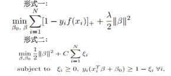
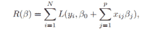
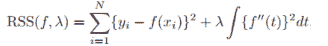

# 网易 2018 校园招聘算法工程师(有道)笔试卷

## 1

以下 python 代码输出为

```cpp
>>> a=[[1, 2], [3, 4]]
>>> print map(list, zip(*a))

```

正确答案: A   你的答案: 空 (错误)

```cpp
[[1, 3], [2, 4]]
```

```cpp
[[1, 2], [3, 4]]
```

```cpp
[1, 2, 3, 4]
```

```cpp
{1: 2, 3: 4}
```

本题知识点

网易 算法工程师 2018

讨论

[零葬](https://www.nowcoder.com/profile/75718849)

*a 对[[1,2],[3,4]]进行拆包得到[1,2]和[3,4]，zip 将这两个列表的元素两两组合“1 和 3，2 和 4”（相当于拉链操作），经过 list 函数将组合结果再转换为列表[1,3]和[2,4]，打印出来就是[[1,3],[2,4]]

发表于 2022-03-05 09:21:42

* * *

## 2

在关联规则中， 有三个重要的指标，支持度（support）， 可信度（confident）， 作用度（lift）， 则对于规则 X->Y 的三个指标说法错误的是(N 表示所有的样本 item 数目)：

正确答案: C   你的答案: 空 (错误)

```cpp
support = freq(X,Y)/N
```

```cpp
confident = freq(X,Y)/freq(x)
```

```cpp
lift = freq(X,Y)/freq(Y)
```

```cpp
lift = freq(X,Y)*N/(freq(X)*freq(Y))
```

本题知识点

网易 算法工程师 2018

讨论

[零葬](https://www.nowcoder.com/profile/75718849)


发表于 2022-03-05 09:25:10

* * *

## 3

以下哪个模型被 Breiman 赞扬为“best off-the-shelf classifier”

正确答案: B   你的答案: 空 (错误)

```cpp
rf
```

```cpp
adaboost
```

```cpp
bagging
```

```cpp
决策树
```

本题知识点

网易 算法工程师 算法工程师 网易 2018

## 4

当前深度学习框架学习主要依赖下列哪个算法框架

正确答案: A   你的答案: 空 (错误)

```cpp
BP
```

```cpp
adagrad
```

```cpp
adam
```

```cpp
SGD
```

本题知识点

网易 算法工程师 算法工程师 网易 2018

讨论

[零葬](https://www.nowcoder.com/profile/75718849)

深度学习模型的训练主要依赖的就是反向传播 BP，正因为有 BP，才能训练深层模型，发挥出深度神经网络的威力（即使后面存在很多缓解梯度消失的手段，但没有 BP 这些都无从谈起）

发表于 2022-03-05 09:29:10

* * *

[糊涂难得](https://www.nowcoder.com/profile/574966516)

A 选项 BP 神经网路

发表于 2018-12-04 21:39:28

* * *

## 5

一个数组求其最长递增子序列(LIS),例如数组{3, 1, 4, 2, 3, 9, 4, 6}的 LIS 是{1, 2, 3, 4, 6}，长度为 5，假设数组长度为 N，求数组的 LIS 的长度,那么最好的解法情况下,时间复杂度和空间复杂度都是多少?

正确答案: B   你的答案: 空 (错误)

```cpp
时间: O(N²), 空间:O(N)
```

```cpp
时间: O(NlogN), 空间:O(N)
```

```cpp
时间: O(N), 空间:O(N)
```

```cpp
时间: O(N), 空间:O(NlogN)
```

```cpp
时间: O(NlogN), 空间:O(NlogN)
```

本题知识点

网易 算法工程师 算法工程师 网易 2018

## 6

{10,12,11,14,13,19,15,18,16,17}是以数组形式存储的最小堆，删除堆顶元素 10 调整后的结果是（）

正确答案: D   你的答案: 空 (错误)

```cpp
12,11,14,13,19,15,18,16,17
```

```cpp
11,12,15,14,13,19,18,16,17
```

```cpp
12,13,11,14,17,19,15,18,16
```

```cpp
11,12,15,14,13,19,17,18,16
```

```cpp
12,11,15,14,13,19,17,18,16
```

本题知识点

网易 算法工程师 算法工程师 网易 2018

## 7

下面关于归并排序的说法错误的有()

正确答案: C   你的答案: 空 (错误)

```cpp
将 k 个已经排序的数组归并成一个大的排序的结果数组。这些数组可能数量比较大，以至于不能直接装载到内存中，可以选择最小堆 k 路归并排序来优化算法
```

```cpp
归并排序是稳定的排序
```

```cpp
在实际中，归并排序比快速排序要快，因为它的比较次数少，所以大部分排序算法底层是归并排序
```

```cpp
对于长度为 N 的数组，使用归并排序，时间复杂度最差也是 O（NlogN）
```

本题知识点

网易 算法工程师 算法工程师 网易 2018

## 8

跳表是一个非常好的数据结构，在 Linux 内核里面可以经常见到，它的插入，删除，查找的平均时间复杂度分别为多少?

正确答案: C   你的答案: 空 (错误)

```cpp
O(1),O(1),O(N)
```

```cpp
O(logN),O(logN),O(N)
```

```cpp
O(logN),O(logN),O(logN)
```

```cpp
O(N),O(logN),O(N)
```

```cpp
O(N),O(N),O(logN)
```

本题知识点

网易 算法工程师 算法工程师 网易 2018

## 9

用二分法查找长度为 129 的排好序的线性表,最多需要比较多少次才能查找到所需要的元素

正确答案: B   你的答案: 空 (错误)

```cpp
7
```

```cpp
8
```

```cpp
9
```

```cpp
128
```

```cpp
65
```

本题知识点

网易 算法工程师 算法工程师 网易 2018

## 10

以下 C++代码在 64 位环境下会输出多少?

```cpp
#include <iostream>
using namespace std;
struct Bar { 
	char c[16];
};
struct Test { 
	Bar& bar;
};
int main()
{
	cout << sizeof(Test::bar);
}
```

正确答案: C   你的答案: 空 (错误)

```cpp
1
```

```cpp
0
```

```cpp
16
```

```cpp
8
```

```cpp
4
```

本题知识点

网易 算法工程师 算法工程师 网易 2018

## 11

有如下 C++代码:

```cpp
#include <iostream>
using namespace std;
void fun(int *p1, int *p2, int *t)
{
	t = (int *)malloc(sizeof(int));
	*t = *p1 + *(p2++);
}
int main()
{
	int a[2] = { 1,2 };
	int b[2] = { 10,20 };
	int *t = a;
	fun(a, b, t);
	cout << *t << endl;
}
```

输出是多少?

正确答案: C   你的答案: 空 (错误)

```cpp
11
```

```cpp
10
```

```cpp
1
```

```cpp
2
```

```cpp
12
```

本题知识点

网易 算法工程师 算法工程师 网易 2018

讨论

[malofleur](https://www.nowcoder.com/profile/232267)

fun 中的 t 是重新分配空间，函数结束时自动释放内存，因此原先的 t 并未被改变
若把 malloc 那行去掉，或者把 fun 中改为 int*& t，就输出 11

发表于 2019-08-02 21:34:10

* * *

## 12

（）完成域名到 IP 地址的映射，（）实现 MAC 到 IP 地址的映射

正确答案: B   你的答案: 空 (错误)

```cpp
DNS,ARP
```

```cpp
DNS,RARP
```

```cpp
ICMP,ARP
```

```cpp
ICMP,RARP
```

```cpp
FTP,ARP
```

本题知识点

网易 算法工程师 算法工程师 网易 2018

## 13

以下关于 TCP 协议说法正确的有?

正确答案: C   你的答案: 空 (错误)

```cpp
TCP 协议有拥塞控制功能，但是不能进行流量控制
```

```cpp
TCP 在视频流传输方面取代了 UDP 的功能
```

```cpp
TCP 建立连接需要 3 次握手，3 次握手也可能对其造成被 flood 攻击的可能
```

```cpp
TCP 是 HTTP,FTP,TFTP 的底层实现协议
```

本题知识点

网易 算法工程师 算法工程师 网易 2018

## 14

以下不属于线程共享的内容是?

正确答案: E   你的答案: 空 (错误)

```cpp
代码段（code segment）
```

```cpp
进程用户 ID 与进程组 ID
```

```cpp
进程打开的文件描述符
```

```cpp
数据段（data section）
```

```cpp
栈空间
```

本题知识点

网易 算法工程师 算法工程师 网易 2018

讨论

[malofleur](https://www.nowcoder.com/profile/232267)

栈是个线程独有的，保存其运行状态和局部自动变量的。
堆是共享的

发表于 2019-08-02 21:35:35

* * *

## 15

SVM 的以下两种模型表达是等价的， 则其中的正则化系数λ和 C 的关系为：

正确答案: B   你的答案: 空 (错误)

```cpp
λ=C
```

```cpp
λ=1/C
```

```cpp
λ=C 的平方
```

```cpp
λ=2C
```

本题知识点

网易 算法工程师 算法工程师 网易 2018

## 16

对于以下上下文有关文法， G=（N, ∑， P, S）, 其中 N={S,A,B,C}, ∑={a，b, c}P:S -> ABCA -> aA|aB -> bB|bBC -> Bcc 则所识别的语言为：

正确答案: D   你的答案: 空 (错误)

```cpp
abc
```

```cpp
anbc2, n>=1
```

```cpp
anbnc2, n>=1
```

```cpp
anbmc2,n>=1, m>=1
```

本题知识点

网易 算法工程师 算法工程师 网易 2018

讨论

[malofleur](https://www.nowcoder.com/profile/232267)


发表于 2019-08-02 21:42:10

* * *

## 17

若以下目标函数满足：1\. R 是β的二次函数或者分段线性函数 2\. J 是β的分段线性函数目标函数：
则β(λ) 的预估值为：

正确答案: B   你的答案: 空 (错误)

```cpp
二次函数
```

```cpp
分段线性函数
```

```cpp
线性函数
```

```cpp
常数
```

本题知识点

网易 算法工程师 算法工程师 网易 2018

## 18

关于以下目标函数说法错误的是：

正确答案: D   你的答案: 空 (错误)

```cpp
当λ为无穷大的时候， f(x)为线性函数
```

```cpp
当λ为 0， 则 f(x)为任意能完全拟合样本点的函数
```

```cpp
对于一般的λ而言，存在最优解，最优解为自然三次样条曲线（natural cubic spline）
```

```cpp
对于一般的λ而言， 存在最优解， f(x)为线性函数
```

本题知识点

网易 算法工程师 算法工程师 网易 2018

## 19

抽取 30 个手机用户，计算出他们通话时间的方差。要用样本方差推断总体方差，假定前提是所有用户的通话时间应服从()

正确答案: B   你的答案: 空 (错误)

```cpp
χ2 分布
```

```cpp
正态分布
```

```cpp
t 分布
```

```cpp
F 分布
```

本题知识点

网易 算法工程师 算法工程师 网易 2018

## 20

python 代码如下:
a = [i for i in range(1,10) if i%2 == 0]
b = (i for i in range(1,10) if i%2 == 0)
则以下说法正确的是:

正确答案: B   你的答案: 空 (错误)

```cpp
b 值为[2, 4, 6, 8], 长度为 4
```

```cpp
a 值为[2, 4, 6, 8], 长度为 4
```

```cpp
b 值为[2, 4, 6, 8, 10], 长度为 5
```

```cpp
a 值为[2, 4, 6, 8, 10], 长度为 5
```

本题知识点

网易 算法工程师 算法工程师 网易 2018

## 21

牛牛手中有 s 份工作需要完成,牛牛准备将工作分给三位员工。考虑到三位员工还有其他工作需要做,牛牛规定他们每人必须要参与的工作数量分别是 a,b,c。
牛牛需要制定详细的工作方案,需要满足每份工作至少有一个人做,同一份工作可以由两个或者三个人共同参与。牛牛一下意识到可能的工作方案很多,牛牛需要你帮他计算一下一共有多少种不同的工作方案(对于两种方案,如果某份工作分配的人或者人数不一样就考虑为不一样的工作方案)。

对于输入样例,s = 3, a = 3, b = 1, c = 1
a 要参与所有三份工作,b 和 c 各自有三种选择,所以不同的工作方案是 3 * 3 * 1= 9
如果 s = 3, a = 1, b = 1, c = 1
相当于对三个员工做全排列,所以不同的工作方案是 3 * 2 * 1 = 6

本题知识点

网易 算法工程师 数学 2018

讨论

[零葬](https://www.nowcoder.com/profile/75718849)

数学

甲先选择 a 份工作，还剩下 rest=s-a 份工作；接下来乙选工作，假设他在 rest 中选了 i 份工作（i 需要进行枚举），那么剩下的 b-i 份工作就要在 a 中选；最后丙选工作，他可以从 rest-i 中选一部分，剩下的 c-(rest-i)份工作在甲和乙已经选过的 a+i 份工作中选，而这两部分，只要一部分确定了，另一部分就确定了。

```cpp
import java.io.*;
import java.util.*;

public class Main {
    final static int MOD = 1000000007;
    public static void main(String[] args) throws IOException {
        BufferedReader br = new BufferedReader(new InputStreamReader(System.in));
        String line;
        while((line = br.readLine()) != null){
            String[] params = line.split(" ");
            int s = Integer.parseInt(params[0]);
            int a = Integer.parseInt(params[1]);
            int b = Integer.parseInt(params[2]);
            int c = Integer.parseInt(params[3]);
            long count = 0;
            int rest = s - a;    // 第一个选完后，剩下的工作数
            for (int i = Math.max(Math.max(0, rest - c), b - a); i <= Math.min(b, rest); i++) {
                count += ((combination(i, rest)* combination(b - i, a) % MOD) * combination(c - rest + i, a + i)) % MOD;
            }
            count *= combination(a, s);
            System.out.println(count % MOD);
        }
    }

    private static long combination(int m, int n) {
        double d = 1;
        for(int i = 0, len = m; i < len; i++) {
            d = d * n-- / m--;
        }
        return (long)Math.round(d) % MOD;
    }
}
```

编辑于 2022-03-05 16:47:12

* * *

## 22

牛牛有一个正整数 x,牛牛需要把数字 x 中的数位进行重排得到一个新数(不同于 x 的数),牛牛想知道这个新数是否可能是原 x 的倍数。请你来帮他解决这个问题。

本题知识点

网易 算法工程师 模拟 穷举 数组 2018

讨论

[零葬](https://www.nowcoder.com/profile/75718849)

暴力

(1) 对原始数字 num 的各位进行全排列，并去除含前导零的数值形成候选集；(2) 遍历候选集里面的数有没有 num 的倍数。

```cpp
import java.io.*;
import java.util.*;

public class Main {
    public static void main(String[] args) throws IOException {
        BufferedReader br = new BufferedReader(new InputStreamReader(System.in));
        int t = Integer.parseInt(br.readLine());
        while(t-- > 0){
            String str = br.readLine();
            char[] chars = str.toCharArray();
            int num = Integer.parseInt(str);
            List<Integer> res = new ArrayList<>();
            permutation(chars, 0, res);
            boolean flag = false;
            for(int candicate: res){
                if(candicate != num && candicate % num == 0){
                    flag = true;
                    break;
                }
            }
            if(flag){
                System.out.println("Possible");
            }else{
                System.out.println("Impossible");
            }
        }
    }

    private static void permutation(char[] num, int index, List<Integer> res) {
        if(index == num.length){
            if(num[0] != '0'){
                res.add(Integer.parseInt(String.valueOf(num)));
            }
        }else{
            for(int i = index; i < num.length; i++){
                swap(num, index, i);
                permutation(num, index + 1, res);
                swap(num, index, i);
            }
        }
    }

    private static void swap(char[] chars, int i, int j) {
        if(i != j){
            char temp = chars[i];
            chars[i] = chars[j];
            chars[j] = temp;
        }
    }
}
```

发表于 2022-03-04 22:40:37

* * *

[SDGSlhh](https://www.nowcoder.com/profile/383930122)

#include  <iostream>#include<algorithm>#include  <cstring>using namespace std;int result;int Integer(char s[]){    int n=strlen(s),flag=1,sum=0;    for(int i=n-1;i>=0;i--)    {        sum+=flag*(s[i]-'0');        flag*=10;    }    return sum;}bool is(int index,char s[],int length){    if(index==length){        int res=Integer(s);        if(res%result==0&&res!=result)           return true;        else            return false;    }    else{        for(int i=index;i<length;i++){            swap(s[i],s[index]);            if(is(index+1,s,length))                return true;            swap(s[i],s[index]);        }        return false;    }}int main(){    char str[10];    int m;    cin>>m;    while(m--){        cin>>str;        result=Integer(str);        int length=strlen(str);        if(is(0,str,length))            cout<<"Possible"<<endl;        else            cout<<"Impossible"<<endl;    }}

发表于 2022-03-05 11:58:10

* * *

## 23

小易参加了一个骰子游戏,这个游戏需要同时投掷 n 个骰子,每个骰子都是一个印有数字 1~6 的均匀正方体。
小易同时投掷出这 n 个骰子,如果这 n 个骰子向上面的数字之和大于等于 x,小易就会获得游戏奖励。
小易想让你帮他算算他获得奖励的概率有多大。

本题知识点

网易 算法工程师 数学 动态规划 2018

讨论

[零葬](https://www.nowcoder.com/profile/75718849)

记忆化搜索

看成一个从左往右的尝试模型，一个个骰子进行尝试，递归函数设置两个可变参数：(1) 还剩下 rest 颗骰子要扔；(2) 当前的点数 point。递归头：当 rest=0 时，结算点数，如果 point>=x，则生成了一种有效地方案。递归体：当前骰子可以是 1~6 点，开 6 个分支尝试下一个骰子的可能性。

```cpp
import java.io.*;
import java.util.*;

public class Main {
    public static void main(String[] args) throws IOException {
        BufferedReader br = new BufferedReader(new InputStreamReader(System.in));
        String[] params = br.readLine().split(" ");
        int n = Integer.parseInt(params[0]);
        int x = Integer.parseInt(params[1]);
        long all = (long)Math.pow(6, n);
        long[][] dp = new long[n + 1][151];
        for(int i = 0; i <= n; i++){
            for(int j = 0; j <= 150; j++){
                dp[i][j] = -1;
            }
        }
        long events = dfs(n, x, 0, dp);
        long g = gcd(all, events);
        System.out.println(events == 0? 0: all == events? 1: (events / g) + "/" + (all / g));
    }

    private static long dfs(int rest, int x, int point, long[][] dp) {
        if(rest == 0){
            return point >= x? 1: 0;
        }else{
            if(dp[rest][point] > -1){
                return dp[rest][point];
            }
            long ways = 0L;
            for(int i = 1; i <= 6; i++){
                ways += dfs(rest - 1, x, point + i, dp);
            }
            dp[rest][point] = ways;
            return ways;
        }
    }

    private static long gcd(long a, long b) {
        return b == 0? a: gcd(b, a % b);
    }
}
```

注意：得到有效的方案数之后，需要与事件的总数求最大公约数，以便约分得到概率表达的最简真分式，且分子为 0 时直接输出 0，分子等于分母时直接输出 1。

发表于 2022-03-05 16:48:31

* * *

[Johan007](https://www.nowcoder.com/profile/7524749)

```cpp
import java.util.Arrays;
import java.util.Scanner;
public class Solution43 {
    /**
     * 网易笔试 https://www.nowcoder.com/questionTerminal/4ac62a94e4ba49df86a66eb7c44fa96a
     n 个骰子的和有 6*n-n+1  最大 6n 最小 n
     用 f[n][m]表示投第 n 个筛子时点数之和为 m 的个数
     投第 n 个筛子的点数之和只与投第 n-1 个筛子有关
     f(n,m)=f(n-1,m-1)+f(n-1,m-2)+f(n-1,m-2)+f(n-1,m-3)+f(n-1,m-4)+f(n-1,m-5)+f(n-1,m-6)
     表示本轮点数之和为 n 的次数等于上一轮点数和为 n-1,n-2,n-3,n-4,n-5,n-6 出现的次数之和
     例如:
     f(2,6)=f(1,5)+f(1,4)+f(1,3)+f(1,2)+f(1,1)+f(1,0)=1+1+1+1+1=5
     f(3,6)=f(2,5)+f(2,4)+f(2,3)+f(2,2)+f(2,1)+f(2,0)
     如果有空间限制 其实只需要用两个数组 一个表示上次的和的次数,一个用来表示本次和出现的次数,用 flag 区分本次和上次
     注意: 由于 6 的 n 次方可能会超过 int 的表示范围,所以 f 和 count 都要用 long
     *  n 筛子的个数
     *  gMax 每个筛子的最大点数
     *  返回值为 所有点数和出现的次数
     */
    static int gMax=6;
    long[] probabilities(int n){
        int maxSum=gMax*n;
        long[][] f=new long[n+1][maxSum+1];
        int flag=0;
        //初始化第 1 个筛子和的次数
        for (int i = 1; i <=gMax ; i++) {
            f[1][i]=1;
        }
//        System.out.println(Arrays.toString(f[1]));
        //求投第 i 个筛子和的次数
        for (int i = 2; i <=n ; i++) {
            for (int j = 1; j <=maxSum ; j++) {
                for (int k = 1; k <=gMax ; k++) {
                    if (j-k>0){
                        f[i][j]+=f[i-1][j-k];
                    }else {
                        //j-k<=0 时后面的不用再加,都是 0
                        break;
                    }
                }
            }
//            System.out.println(Arrays.toString(f[i]));
        }
        return f[n];
    }
    /**
     * 辗转相除法：
     目的：求两个整数的最大公约数
     最大公约数：能同时被两个整数整除的最大公约数
     原理：
     最大公约数 = 小数 与 （大数%小数） 的最大公约数
     利用这条原理，反复执行，直到   大数%小数 = 0，此时较小的数就是原来两数的最大公约数
     * @param x
     * @param y
     * @return
     */
    public static long gcd(long x, long y){ // 这个是运用辗转相除法求 两个数的 最大公约数 看不懂可以百度 // 下
        if(y == 0)
            return x;
        else
            return gcd(y,x%y);
    }
    public static void main(String[] args) {
        Solution43 solution43=new Solution43();
        Scanner scanner=new Scanner(System.in);
        int n=scanner.nextInt();
        int x=scanner.nextInt();
        long[] f=solution43.probabilities(n);
        long count=0;
        for (int i =x ; i <=6*n ; i++) {
            count+=f[i];
        }
        long max=(long)Math.pow(gMax,n); //最多 gMax 的 n 次方种情况
        long g=gcd(count,max);
        if (count==0)
            System.out.println(0);
        else if (count==max)
            System.out.println(1);
        else
            System.out.println(count/g+"/"+max/g);
    }
} 
```

发表于 2018-07-07 11:48:26

* * *