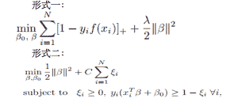
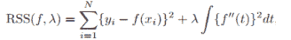

# 网易 2018 校园招聘深度学习工程师(BJ)笔试卷

## 1

以下 python 代码输出为

```cpp
>>> a=[[1, 2], [3, 4]]
>>> print map(list, zip(*a))

```

正确答案: A   你的答案: 空 (错误)

```cpp
[[1, 3], [2, 4]]
```

```cpp
[[1, 2], [3, 4]]
```

```cpp
[1, 2, 3, 4]
```

```cpp
{1: 2, 3: 4}
```

本题知识点

网易 算法工程师 Java 工程师 C++工程师 iOS 工程师 安卓工程师 运维工程师 前端工程师 PHP 工程师 算法工程师 网易 2018

讨论

[明天也不想努力](https://www.nowcoder.com/profile/931940110)

选 A 呀，这么简单

发表于 2018-11-03 15:58:19

* * *

[QuewangLiu](https://www.nowcoder.com/profile/419323)

zip(*)函数是 zip()函数的逆过程，zip(*a)就是要找一个 list b 使 zip(b) = alist b = [[1,3],             [2,4]]
经过 zip(b) = a 所以答案为 A

发表于 2018-11-02 20:56:32

* * *

[念@！不忘](https://www.nowcoder.com/profile/755503706)

转置：zip(*a)=[(1,3),(2,6)]在执行 map(list,zip(*a)) 将各项的 tuple 变为 list

发表于 2018-11-01 16:20:06

* * *

## 2

在关联规则中， 有三个重要的指标，支持度（support）， 可信度（confident）， 作用度（lift）， 则对于规则 X->Y 的三个指标说法错误的是(N 表示所有的样本 item 数目)：

正确答案: C   你的答案: 空 (错误)

```cpp
support = freq(X,Y)/N
```

```cpp
confident = freq(X,Y)/freq(x)
```

```cpp
lift = freq(X,Y)/freq(Y)
```

```cpp
lift = freq(X,Y)*N/(freq(X)*freq(Y))
```

本题知识点

网易 算法工程师 Java 工程师 C++工程师 iOS 工程师 安卓工程师 运维工程师 前端工程师 PHP 工程师 算法工程师 网易 2018

## 3

以下哪个模型被 Breiman 赞扬为“best off-the-shelf classifier”

正确答案: B   你的答案: 空 (错误)

```cpp
rf
```

```cpp
adaboost
```

```cpp
bagging
```

```cpp
决策树
```

本题知识点

网易 算法工程师 Java 工程师 C++工程师 iOS 工程师 安卓工程师 运维工程师 前端工程师 PHP 工程师 2018

## 4

当前深度学习框架学习主要依赖下列哪个算法框架

正确答案: A   你的答案: 空 (错误)

```cpp
BP
```

```cpp
adagrad
```

```cpp
adam
```

```cpp
SGD
```

本题知识点

网易 算法工程师 Java 工程师 C++工程师 iOS 工程师 安卓工程师 运维工程师 前端工程师 PHP 工程师 2018

讨论

[九点半独角戏](https://www.nowcoder.com/profile/251769448)

根源

发表于 2021-10-07 01:25:04

* * *

[牛客 728883735 号](https://www.nowcoder.com/profile/728883735)

问题有点模糊不清

发表于 2020-05-07 21:55:15

* * *

[字节跳动-智能创作实验室-内推](https://www.nowcoder.com/profile/1591238)

这种钓鱼题，感觉有点像高考试卷。。。

发表于 2018-07-19 14:08:13

* * *

## 5

假设现在有一个数组长度为 80，使用选择排序为其排序，再已经排序了 40 次的情况下，那么现在有多少项被保证处于最后的位置(永远不再移动)

正确答案: C   你的答案: 空 (错误)

```cpp
20
```

```cpp
39
```

```cpp
40
```

```cpp
41
```

```cpp
60
```

本题知识点

网易 算法工程师 Java 工程师 C++工程师 iOS 工程师 安卓工程师 运维工程师 前端工程师 PHP 工程师 2018

## 6

一个数组求其最长递增子序列(LIS),例如数组{3, 1, 4, 2, 3, 9, 4, 6}的 LIS 是{1, 2, 3, 4, 6}，长度为 5，假设数组长度为 N，求数组的 LIS 的长度,那么最好的解法情况下,时间复杂度和空间复杂度都是多少?

正确答案: B   你的答案: 空 (错误)

```cpp
时间: O(N²), 空间:O(N)
```

```cpp
时间: O(NlogN), 空间:O(N)
```

```cpp
时间: O(N), 空间:O(N)
```

```cpp
时间: O(N), 空间:O(NlogN)
```

```cpp
时间: O(NlogN), 空间:O(NlogN)
```

本题知识点

网易 算法工程师 Java 工程师 C++工程师 iOS 工程师 安卓工程师 运维工程师 前端工程师 PHP 工程师 2018

## 7

{10,12,11,14,13,19,15,18,16,17}是以数组形式存储的最小堆，删除堆顶元素 10 调整后的结果是（）

正确答案: D   你的答案: 空 (错误)

```cpp
12,11,14,13,19,15,18,16,17
```

```cpp
11,12,15,14,13,19,18,16,17
```

```cpp
12,13,11,14,17,19,15,18,16
```

```cpp
11,12,15,14,13,19,17,18,16
```

```cpp
12,11,15,14,13,19,17,18,16
```

本题知识点

网易 算法工程师 Java 工程师 C++工程师 iOS 工程师 安卓工程师 运维工程师 前端工程师 PHP 工程师 算法工程师 网易 2018

## 8

下面关于归并排序的说法错误的有()

正确答案: C   你的答案: 空 (错误)

```cpp
将 k 个已经排序的数组归并成一个大的排序的结果数组。这些数组可能数量比较大，以至于不能直接装载到内存中，可以选择最小堆 k 路归并排序来优化算法
```

```cpp
归并排序是稳定的排序
```

```cpp
在实际中，归并排序比快速排序要快，因为它的比较次数少，所以大部分排序算法底层是归并排序
```

```cpp
对于长度为 N 的数组，使用归并排序，时间复杂度最差也是 O（NlogN）
```

本题知识点

网易 算法工程师 Java 工程师 C++工程师 iOS 工程师 安卓工程师 运维工程师 前端工程师 PHP 工程师 算法工程师 网易 2018

## 9

用二分法查找长度为 129 的排好序的线性表,最多需要比较多少次才能查找到所需要的元素

正确答案: B   你的答案: 空 (错误)

```cpp
7
```

```cpp
8
```

```cpp
9
```

```cpp
128
```

```cpp
65
```

本题知识点

网易 算法工程师 Java 工程师 C++工程师 iOS 工程师 安卓工程师 运维工程师 前端工程师 PHP 工程师 算法工程师 网易 2018

## 10

以下 C++代码在 64 位环境下会输出多少?

```cpp
#include <iostream>
using namespace std;
struct Bar { 
	char c[16];
};
struct Test { 
	Bar& bar;
};
int main()
{
	cout << sizeof(Test::bar);
}
```

正确答案: C   你的答案: 空 (错误)

```cpp
1
```

```cpp
0
```

```cpp
16
```

```cpp
8
```

```cpp
4
```

本题知识点

网易 算法工程师 Java 工程师 C++工程师 iOS 工程师 安卓工程师 运维工程师 前端工程师 PHP 工程师 2018 C++

讨论

[wjunsing](https://www.nowcoder.com/profile/935378)


发表于 2021-03-08 18:03:14

* * *

[十一 1011](https://www.nowcoder.com/profile/195527855)

对引用调用 sizeof 获得是引用的对象的大小。

发表于 2021-05-14 11:40:37

* * *

[牛客小丑 C](https://www.nowcoder.com/profile/410104169)

这里结构体可以视为一个类，而且成员属性都是 public 的，那么，输出时候就是 bar 类里面成员大小，而其为 char 类型，占 1 个字节，共 16 个，那么输出就是 16。不知道这么解析合适不合适，欢迎各位大佬指正。

发表于 2020-10-19 09:09:23

* * *

## 11

有如下 C++代码:

```cpp
#include <iostream>
using namespace std;
void fun(int *p1, int *p2, int *t)
{
	t = (int *)malloc(sizeof(int));
	*t = *p1 + *(p2++);
}
int main()
{
	int a[2] = { 1,2 };
	int b[2] = { 10,20 };
	int *t = a;
	fun(a, b, t);
	cout << *t << endl;
}
```

输出是多少?

正确答案: C   你的答案: 空 (错误)

```cpp
11
```

```cpp
10
```

```cpp
1
```

```cpp
2
```

```cpp
12
```

本题知识点

网易 算法工程师 Java 工程师 C++工程师 iOS 工程师 安卓工程师 运维工程师 前端工程师 PHP 工程师 2018 C++

讨论

[去了趟夏天](https://www.nowcoder.com/profile/158568276)

fun（）函数中重新为 it 申请了地址，跟 main 函数中 it 的地址不一致了，所以 fun 中的 it 的值不能传给 main 函数里的 it。

发表于 2020-08-09 11:21:06

* * *

[西邮白白](https://www.nowcoder.com/profile/132008587)

这个题基础不扎实确实很容易出错，我们经常说传值的时候形参是实参的一份拷贝，所以我们要对实参进行更改，要传地址。这个题就出现了传指针，很容易认为结果是 11，但是当指针作为值传进去的时候我们想更改其指向空间的值我们这时候要传二级指针。如果想得到 11 应该

```cpp
#include <iostream>
using namespace std;
void fun(int *p1, int *p2, int **t)
{
	*t = (int *)malloc(sizeof(int));
	**t = *p1 + *(p2++);
}
int main()
{
	int a[2] = { 1,2 };
	int b[2] = { 10,20 };
	int *t = a;
	fun(a, b, &t);
	cout << *t << endl;
	system("pause");
	return 0;
}
```

发表于 2020-08-11 12:27:49

* * *

[HouJian](https://www.nowcoder.com/profile/5255423)

fun 函数中形参只是实参的一份拷贝，也就是说有两个指针指向 a，一个是 main 函数中的，一个是 fun 函数中的，这两个是不一样的。而 fun 函数中的指针被重新申请了地址，这两个指针指向的就不再是同一块内存了。因此改变 fun 函数中的拷贝，不会影响 main 函数中的 t。

发表于 2020-09-08 08:51:02

* * *

## 12

（）完成域名到 IP 地址的映射，（）实现 MAC 到 IP 地址的映射

正确答案: B   你的答案: 空 (错误)

```cpp
DNS,ARP
```

```cpp
DNS,RARP
```

```cpp
ICMP,ARP
```

```cpp
ICMP,RARP
```

```cpp
FTP,ARP
```

本题知识点

网易 算法工程师 Java 工程师 C++工程师 iOS 工程师 安卓工程师 运维工程师 前端工程师 PHP 工程师 算法工程师 网易 2018

## 13

以下关于 TCP 协议说法正确的有?

正确答案: C   你的答案: 空 (错误)

```cpp
TCP 协议有拥塞控制功能，但是不能进行流量控制
```

```cpp
TCP 在视频流传输方面取代了 UDP 的功能
```

```cpp
TCP 建立连接需要 3 次握手，3 次握手也可能对其造成被 flood 攻击的可能
```

```cpp
TCP 是 HTTP,FTP,TFTP 的底层实现协议
```

本题知识点

网易 算法工程师 Java 工程师 C++工程师 iOS 工程师 安卓工程师 运维工程师 前端工程师 PHP 工程师 算法工程师 网易 2018

## 14

以下不属于线程共享的内容是?

正确答案: E   你的答案: 空 (错误)

```cpp
代码段（code segment）
```

```cpp
进程用户 ID 与进程组 ID
```

```cpp
进程打开的文件描述符
```

```cpp
数据段（data section）
```

```cpp
栈空间
```

本题知识点

网易 算法工程师 Java 工程师 C++工程师 iOS 工程师 安卓工程师 运维工程师 前端工程师 PHP 工程师 算法工程师 网易 2018

## 15

SVM 的以下两种模型表达是等价的， 则其中的正则化系数λ和 C 的关系为：

正确答案: B   你的答案: 空 (错误)

```cpp
λ=C
```

```cpp
λ=1/C
```

```cpp
λ=C 的平方
```

```cpp
λ=2C
```

本题知识点

网易 算法工程师 Java 工程师 C++工程师 iOS 工程师 安卓工程师 运维工程师 前端工程师 PHP 工程师 2018

## 16

对于以下上下文有关文法， G=（N, ∑， P, S）, 其中 N={S,A,B,C}, ∑={a，b, c}P:S -> ABCA -> aA|aB -> bB|bBC -> Bcc 则所识别的语言为：

正确答案: D   你的答案: 空 (错误)

```cpp
abc
```

```cpp
anbc2, n>=1
```

```cpp
anbnc2, n>=1
```

```cpp
anbmc2,n>=1, m>=1
```

本题知识点

网易 算法工程师 Java 工程师 C++工程师 iOS 工程师 安卓工程师 运维工程师 前端工程师 PHP 工程师 2018

## 17

若以下目标函数满足：1\. R 是β的二次函数或者分段线性函数 2\. J 是β的分段线性函数目标函数：
则β(λ) 的预估值为：

正确答案: B   你的答案: 空 (错误)

```cpp
二次函数
```

```cpp
分段线性函数
```

```cpp
线性函数
```

```cpp
常数
```

本题知识点

网易 算法工程师 Java 工程师 C++工程师 iOS 工程师 安卓工程师 运维工程师 前端工程师 PHP 工程师 2018

## 18

关于以下目标函数说法错误的是：

正确答案: D   你的答案: 空 (错误)

```cpp
当λ为无穷大的时候， f(x)为线性函数
```

```cpp
当λ为 0， 则 f(x)为任意能完全拟合样本点的函数
```

```cpp
对于一般的λ而言，存在最优解，最优解为自然三次样条曲线（natural cubic spline）
```

```cpp
对于一般的λ而言， 存在最优解， f(x)为线性函数
```

本题知识点

网易 算法工程师 Java 工程师 C++工程师 iOS 工程师 安卓工程师 运维工程师 前端工程师 PHP 工程师 算法工程师 网易 2018

## 19

抽取 30 个手机用户，计算出他们通话时间的方差。要用样本方差推断总体方差，假定前提是所有用户的通话时间应服从()

正确答案: B   你的答案: 空 (错误)

```cpp
χ2 分布
```

```cpp
正态分布
```

```cpp
t 分布
```

```cpp
F 分布
```

本题知识点

网易 算法工程师 Java 工程师 C++工程师 iOS 工程师 安卓工程师 运维工程师 前端工程师 PHP 工程师 2018

## 20

python 代码如下:
a = [i for i in range(1,10) if i%2 == 0]
b = (i for i in range(1,10) if i%2 == 0)
则以下说法正确的是:

正确答案: B   你的答案: 空 (错误)

```cpp
b 值为[2, 4, 6, 8], 长度为 4
```

```cpp
a 值为[2, 4, 6, 8], 长度为 4
```

```cpp
b 值为[2, 4, 6, 8, 10], 长度为 5
```

```cpp
a 值为[2, 4, 6, 8, 10], 长度为 5
```

本题知识点

网易 算法工程师 Java 工程师 C++工程师 iOS 工程师 安卓工程师 运维工程师 前端工程师 PHP 工程师 2018

讨论

[Chrisiven](https://www.nowcoder.com/profile/203872321)

选 B!首先, a 生成的是一个 list!b 生成的是一个 gennerator 生成器,生成器就得去迭代.故选 B!

发表于 2018-10-29 18:33:14

* * *

## 21

牛牛手中有 s 份工作需要完成,牛牛准备将工作分给三位员工。考虑到三位员工还有其他工作需要做,牛牛规定他们每人必须要参与的工作数量分别是 a,b,c。
牛牛需要制定详细的工作方案,需要满足每份工作至少有一个人做,同一份工作可以由两个或者三个人共同参与。牛牛一下意识到可能的工作方案很多,牛牛需要你帮他计算一下一共有多少种不同的工作方案(对于两种方案,如果某份工作分配的人或者人数不一样就考虑为不一样的工作方案)。

对于输入样例,s = 3, a = 3, b = 1, c = 1
a 要参与所有三份工作,b 和 c 各自有三种选择,所以不同的工作方案是 3 * 3 * 1= 9
如果 s = 3, a = 1, b = 1, c = 1
相当于对三个员工做全排列,所以不同的工作方案是 3 * 2 * 1 = 6

本题知识点

网易 算法工程师 Java 工程师 C++工程师 iOS 工程师 安卓工程师 运维工程师 前端工程师 PHP 工程师 数学 2018

## 22

牛牛有一个正整数 x,牛牛需要把数字 x 中的数位进行重排得到一个新数(不同于 x 的数),牛牛想知道这个新数是否可能是原 x 的倍数。请你来帮他解决这个问题。

本题知识点

网易 算法工程师 Java 工程师 C++工程师 iOS 工程师 安卓工程师 运维工程师 前端工程师 PHP 工程师 模拟 穷举 数组 2018

## 23

牛牛非常喜欢和朋友们一起玩。
牛牛有 n 个朋友当前在一根数轴上,每个朋友当前在整数 x[i]坐标位置。
牛牛向他们发出一个移动的信号,每个朋友就向左或者向右移动 s 距离(每个朋友的选择是独立的,都可以选择向左或者向右)。
为了在一起玩耍方便,牛牛希望移动之后最左边的朋友和最右边的朋友距离最近,牛牛想知道最近距离为多少。

例如牛牛有三个朋友分别所在数轴坐标为-7, 4, 7, s = 5
那么第一个朋友-7 向右移动 s,变为-2
第二个朋友 4 向左移动 s,变为-1
第三个朋友 7 向左移动 s,变为 2。
现在最左和最右的朋友距离是 4,没有比这个更优的方案了。

本题知识点

网易 算法工程师 Java 工程师 C++工程师 iOS 工程师 安卓工程师 运维工程师 前端工程师 PHP 工程师 模拟 贪心 2018

讨论

[零葬](https://www.nowcoder.com/profile/75718849)

贪心

这个题确实很妙，首先可以确定的是：有一部分人 C1 会往右移动，另外一部分人 C2 会往左移动，而这两部分人肯定在某个分割点的两侧，左边的人向右移动，右边的人向左移动。于是我们可以枚举分割点，假设坐标数组 x 是有序的，移动完成之后的人群整体右边界一定是：“C1 最右边的那个人向右移动 s 的位置”和“C2 最左边的那个人向左移动 s 的位置”最大值。人群整体左边界一定是：“C1 最左边那个人向右移动 s 的位置”和“C2 最左边那个人向左移动 s 的位置”最小值。遍历所有可能的分隔点（0~n-1），计算出最小的范围即可。

```cpp
import java.io.*;
import java.util.*;

public class Main {
    public static void main(String[] args) throws IOException {
        BufferedReader br = new BufferedReader(new InputStreamReader(System.in));
        String[] params = br.readLine().split(" ");
        int n = Integer.parseInt(params[0]);
        int s = Integer.parseInt(params[1]);
        String[] strs = br.readLine().split(" ");
        int[] x = new int[n];
        for(int i = 0; i < n; i++){
            x[i] = Integer.parseInt(strs[i]);
        }
        Arrays.sort(x);
        int minRange = Integer.MAX_VALUE;
        for(int i = 0; i < n - 1; i++){
            int left = Math.min(x[0] + s, x[i + 1] - s);
            int right = Math.max(x[i] + s, x[n - 1] - s);
            minRange = Math.min(minRange, right - left);
        }
        System.out.println(minRange);
    }
}
```

编辑于 2022-03-05 18:48:53

* * *