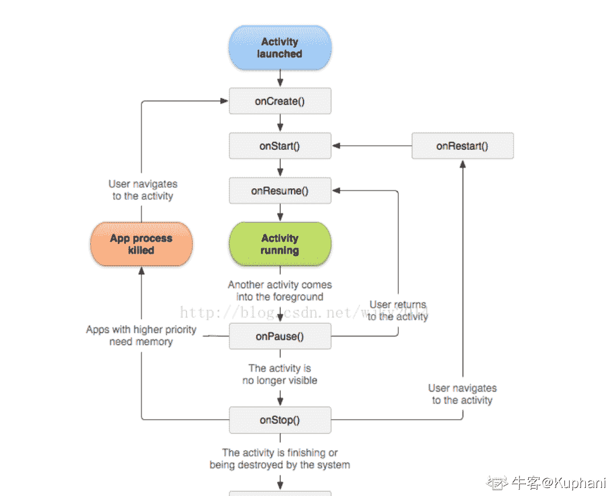

# 网易 2018 校园招聘 Android 开发工程师(BJ)笔试卷

## 1

以下哪个不是 Android 的图片加载框架?

正确答案: D   你的答案: 空 (错误)

```cpp
Picasso
```

```cpp
Glide
```

```cpp
Fresco
```

```cpp
Charles
```

本题知识点

网易 安卓工程师 2018

讨论

[减肥一个月也不会变成小田切让](https://www.nowcoder.com/profile/7662098)

D。据我所知，这个貌似是 Mac 里面的一个软件，可能也有相同的框架名称，但是 ABC 都是常见的

发表于 2018-08-10 10:07:53

* * *

## 2

Activity 之间的跳转需要借助 Intent,下列关于 IntentFlags 说法错误的是

正确答案: B   你的答案: 空 (错误)

```cpp
FLAG_ACTIVITY_NEW_TASK 默认启动类型,每次会重新创建一个新的 Activity
```

```cpp
FLAG_ACTIVITY_CLEAR_TOP 以这种方式启动的 Activity,会把当前所启动的 Activity 之上的 Activity 全部清空如：原来栈中的情况是 A,B,C,D 这时从 D 中跳转到 B，此时栈中的情况就只有 B
```

```cpp
FLAG_ACTIVITY_NO_HISTORY 用此 FLAG 启动的 Activity，一旦推出，就不会存在于栈中. 如:原来是 A,B,C 此时在 C 中以此 FLAG 启动 D,D 再启动 E,这时栈中情况为 A,B,C,E。
```

```cpp
FLAG_ACTIVITY_SINGLE_TOP 相当于启动模式的 singletop,以此 Falg 启动的 Activity,全局只会有一个.
```

本题知识点

网易 安卓工程师 2018

讨论

[小黄猪](https://www.nowcoder.com/profile/7043905)

D 是错的吧：singleTop Activity 的实例可以无限多，唯一的区别是如果在栈顶已经有一个相同类型的 Activity 实例，Intent 不会再创建一个 Activity

发表于 2018-08-10 18:54:23

* * *

## 3

Android 四大组件中哪一个主要功能是负责与用户交互？

正确答案: B   你的答案: 空 (错误)

```cpp
Service
```

```cpp
Activity
```

```cpp
Content Provider
```

```cpp
BroadCast Receiver
```

本题知识点

网易 安卓工程师 2018

讨论

[减肥一个月也不会变成小田切让](https://www.nowcoder.com/profile/7662098)

B，所谓的用户交互，就是用户看得到的和用户发生联系的。所以 Activity 界面。

发表于 2018-08-10 10:06:13

* * *

## 4

Activity 生命周期函数中紧接着 onRestart()执行的是？

正确答案: D   你的答案: 空 (错误)

```cpp
onCreate()
```

```cpp
onResume()
```

```cpp
onPause()
```

```cpp
onStart()
```

本题知识点

网易 安卓工程师 2018

讨论

[Kuphani](https://www.nowcoder.com/profile/329387005)



发表于 2020-05-27 17:11:45

* * *

## 5

以下哪种不是 Android 数据存储的方式？

正确答案: B   你的答案: 空 (错误)

```cpp
Shared Preferences
```

```cpp
Bundle
```

```cpp
SQLite
```

```cpp
Content Provider
```

本题知识点

网易 安卓工程师 2018

讨论

[牛客 846726711 号](https://www.nowcoder.com/profile/846726711)

bundle 用于打包数据

发表于 2021-03-22 22:31:32

* * *

## 6

Activity 四种启动模式中，哪一种模式独立运行在一个 task 中？

正确答案: D   你的答案: 空 (错误)

```cpp
standard
```

```cpp
singleTop
```

```cpp
singleTask
```

```cpp
singleInstance
```

本题知识点

网易 安卓工程师 2018

## 7

{10,12,11,14,13,19,15,18,16,17}是以数组形式存储的最小堆，删除堆顶元素 10 调整后的结果是（）

正确答案: D   你的答案: 空 (错误)

```cpp
12,11,14,13,19,15,18,16,17
```

```cpp
11,12,15,14,13,19,18,16,17
```

```cpp
12,13,11,14,17,19,15,18,16
```

```cpp
11,12,15,14,13,19,17,18,16
```

```cpp
12,11,15,14,13,19,17,18,16
```

本题知识点

网易 安卓工程师 安卓工程师 网易 2018

讨论

[🎧关键词、](https://www.nowcoder.com/profile/9897585)

删除堆顶，然后总是从堆尾将某个数先放置到堆顶，然后依次下调到符合完全二叉树的要求，即每个子树的两个子节点都比父节点大（最小堆）。即比较子节点与父节点的大小，把最小的子节点同父节点互换，依次下调。

发表于 2018-06-05 12:53:34

* * *

## 8

以下哪个排序算法中，元素的比较次数元素与元素的初始排列无关（）

正确答案: E   你的答案: 空 (错误)

```cpp
希尔排序
```

```cpp
快速排序
```

```cpp
归并排序
```

```cpp
直接插入排序
```

```cpp
选择排序
```

本题知识点

网易 安卓工程师 安卓工程师 网易 2018

讨论

[Xeldow.](https://www.nowcoder.com/profile/9381982)

比较次数与初始元素顺序无关的排序算法（即最好、最坏情况的时间复杂度一样）选择排序 O(n²)堆排序 O(nlogn)归并排序 O(nlogn)基数排序 O(tn)

发表于 2019-04-02 09:04:32

* * *

## 9

下面关于归并排序的说法错误的有()

正确答案: C   你的答案: 空 (错误)

```cpp
将 k 个已经排序的数组归并成一个大的排序的结果数组。这些数组可能数量比较大，以至于不能直接装载到内存中，可以选择最小堆 k 路归并排序来优化算法
```

```cpp
归并排序是稳定的排序
```

```cpp
在实际中，归并排序比快速排序要快，因为它的比较次数少，所以大部分排序算法底层是归并排序
```

```cpp
对于长度为 N 的数组，使用归并排序，时间复杂度最差也是 O（NlogN）
```

本题知识点

网易 安卓工程师 安卓工程师 网易 2018

## 10

跳表是一个非常好的数据结构，在 Linux 内核里面可以经常见到，它的插入，删除，查找的平均时间复杂度分别为多少?

正确答案: C   你的答案: 空 (错误)

```cpp
O(1),O(1),O(N)
```

```cpp
O(logN),O(logN),O(N)
```

```cpp
O(logN),O(logN),O(logN)
```

```cpp
O(N),O(logN),O(N)
```

```cpp
O(N),O(N),O(logN)
```

本题知识点

网易 安卓工程师 安卓工程师 网易 2018

## 11

用二分法查找长度为 129 的排好序的线性表,最多需要比较多少次才能查找到所需要的元素

正确答案: B   你的答案: 空 (错误)

```cpp
7
```

```cpp
8
```

```cpp
9
```

```cpp
128
```

```cpp
65
```

本题知识点

网易 安卓工程师 2018

## 12

有一个完全二叉树的叶子节点个数为 1234 个，那么它最多有()个节点

正确答案: C   你的答案: 空 (错误)

```cpp
2466
```

```cpp
2467
```

```cpp
2468
```

```cpp
2469
```

```cpp
2470
```

本题知识点

网易 安卓工程师 安卓工程师 网易 2018

## 13

下面关于内存管理方式错误的有?

正确答案: C   你的答案: 空 (错误)

```cpp
页式管理把内存空间按页的大小划分成片或者页面，然后把页式虚拟地址与内存地址建立一一对应的页表
```

```cpp
页式管理采用请求调页或预调页技术来实现内外存存储器的统一管理
```

```cpp
段页式管理是段式管理与页式管理方案结合而成的，具有它们两者的优点，所以使执行速度提升了。
```

```cpp
段式管理优点是可以分别编写和编译，可以针对不同类型的段采取不同的保护，可以按段为单位来进行共享，包括通过动态链接进行代码共享
```

本题知识点

网易 安卓工程师 安卓工程师 网易 2018

## 14

（）完成域名到 IP 地址的映射，（）实现 MAC 到 IP 地址的映射

正确答案: B   你的答案: 空 (错误)

```cpp
DNS,ARP
```

```cpp
DNS,RARP
```

```cpp
ICMP,ARP
```

```cpp
ICMP,RARP
```

```cpp
FTP,ARP
```

本题知识点

网易 安卓工程师 安卓工程师 网易 2018

## 15

以下关于 TCP 协议说法正确的有?

正确答案: C   你的答案: 空 (错误)

```cpp
TCP 协议有拥塞控制功能，但是不能进行流量控制
```

```cpp
TCP 在视频流传输方面取代了 UDP 的功能
```

```cpp
TCP 建立连接需要 3 次握手，3 次握手也可能对其造成被 flood 攻击的可能
```

```cpp
TCP 是 HTTP,FTP,TFTP 的底层实现协议
```

本题知识点

网易 安卓工程师 安卓工程师 网易 2018

## 16

下面关于线程和进程说法错误的有?

正确答案: D   你的答案: 空 (错误)

```cpp
一个进程可创建一个或多个线程
```

```cpp
一个线程可创建一个或多个线程
```

```cpp
进程有独立的地址空间，线程没有
```

```cpp
线程与线程通信不可使用共享内存
```

本题知识点

网易 安卓工程师 安卓工程师 网易 2018

## 17

下面关于 HashMap 和 Hashtable 说法错误的有?

正确答案: D   你的答案: 空 (错误)

```cpp
HashMap 不能保证元素的顺序,HashMap 能够将键设为 null
```

```cpp
Hashtable 不能将键和值设为 null，否则运行时会报空指针异常错误
```

```cpp
HashMap 线程不安全，Hashtable 线程安全
```

```cpp
HashMap 使用键/值得形式保存数据，但是允许一次只插入键或者值
```

本题知识点

网易 安卓工程师 安卓工程师 网易 2018

## 18

下面关于线程的方法叙述错误的是?

正确答案: D   你的答案: 空 (错误)

```cpp
run()方法用来执行线程体中具体的内容
```

```cpp
sleep()方法用来使线程进入睡眠状态
```

```cpp
start()方法用来启动线程对象，使其进入就绪状态
```

```cpp
suspend()方法用来使线程挂起，要通过 start()方法使其重新启动
```

本题知识点

网易 安卓工程师 2018

## 19

下面哪些是合法的 java 数组声明？(a) int a();
(b) float b[];
(c) double[] c;
(d) counter d[];

正确答案: C   你的答案: 空 (错误)

```cpp
a 和 b
```

```cpp
a 和 c 和 d
```

```cpp
b 和 c
```

```cpp
c 和 d
```

本题知识点

网易 安卓工程师 2018

## 20

下面关于进程说法正确的是：

正确答案: C   你的答案: 空 (错误)

```cpp
同步进程必定是阻塞的，异步进程必定是非阻塞的
```

```cpp
同步进程必定是非阻塞的，异步进程必定是阻塞的
```

```cpp
进程同步异步，和阻塞非阻塞没有直接关系
```

```cpp
进程同步异步，和阻塞非阻塞有着必然关系
```

本题知识点

网易 安卓工程师 安卓工程师 网易 2018

## 21

在英文中,我们会把一些长的名字或者短语进行缩写。例如"looks good to me"缩写为"lgtm",短语中的每个单词的首字母组成缩写。现在给出一个字符串 s,字符串 s 中包括一个或者多个单词,单词之间以空格分割,请输出这个字符串的缩写。

本题知识点

网易 安卓工程师 字符串 *模拟 2018* *讨论

[华科平凡](https://www.nowcoder.com/profile/4939096)

python3 一行

```cpp
print("".join(map(lambda word: word[0], input().split())))
```

发表于 2019-02-23 09:38:56

* * *

[offer 菜鸟](https://www.nowcoder.com/profile/5889369)

```cpp
#include <iostream>
#include<string>

using namespace std;

int main()
{
    string mid;
    while(cin>>mid)
    {
        cout<<mid[0];
    }
    return 0;
}

```

发表于 2019-05-27 20:19:18

* * *

[向宇回桌](https://www.nowcoder.com/profile/520872)

```cpp
import java.util.*;

public class Main {
    private static final int MAX = 1005;
    private static final int MOD_NUMBER = 1000000007;
    public static void main(String[] args) {
        Scanner sc = new Scanner(System.in);
        String[] in = sc.nextLine().split(" ");
        StringBuilder sb = new StringBuilder();
        for (String s : in) {
            sb.append(s.charAt(0));
        }
        System.out.println(sb.toString());
    }
}

```

发表于 2019-02-07 00:05:32

* * *

## 22

牛牛手中有 s 份工作需要完成,牛牛准备将工作分给三位员工。考虑到三位员工还有其他工作需要做,牛牛规定他们每人必须要参与的工作数量分别是 a,b,c。
牛牛需要制定详细的工作方案,需要满足每份工作至少有一个人做,同一份工作可以由两个或者三个人共同参与。牛牛一下意识到可能的工作方案很多,牛牛需要你帮他计算一下一共有多少种不同的工作方案(对于两种方案,如果某份工作分配的人或者人数不一样就考虑为不一样的工作方案)。

对于输入样例,s = 3, a = 3, b = 1, c = 1
a 要参与所有三份工作,b 和 c 各自有三种选择,所以不同的工作方案是 3 * 3 * 1= 9
如果 s = 3, a = 1, b = 1, c = 1
相当于对三个员工做全排列,所以不同的工作方案是 3 * 2 * 1 = 6

本题知识点

网易 安卓工程师 数学 2018

## 23

牛牛非常喜欢和朋友们一起玩。
牛牛有 n 个朋友当前在一根数轴上,每个朋友当前在整数 x[i]坐标位置。
牛牛向他们发出一个移动的信号,每个朋友就向左或者向右移动 s 距离(每个朋友的选择是独立的,都可以选择向左或者向右)。
为了在一起玩耍方便,牛牛希望移动之后最左边的朋友和最右边的朋友距离最近,牛牛想知道最近距离为多少。

例如牛牛有三个朋友分别所在数轴坐标为-7, 4, 7, s = 5
那么第一个朋友-7 向右移动 s,变为-2
第二个朋友 4 向左移动 s,变为-1
第三个朋友 7 向左移动 s,变为 2。
现在最左和最右的朋友距离是 4,没有比这个更优的方案了。

本题知识点

网易 安卓工程师 模拟 贪心 2018*