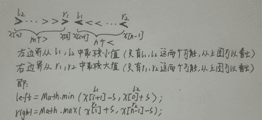

# 网易 2018 校园招聘 C 开发工程师(BJ)笔试卷

## 1

{10,12,11,14,13,19,15,18,16,17}是以数组形式存储的最小堆，删除堆顶元素 10 调整后的结果是（）

正确答案: D   你的答案: 空 (错误)

```cpp
12,11,14,13,19,15,18,16,17
```

```cpp
11,12,15,14,13,19,18,16,17
```

```cpp
12,13,11,14,17,19,15,18,16
```

```cpp
11,12,15,14,13,19,17,18,16
```

```cpp
12,11,15,14,13,19,17,18,16
```

本题知识点

网易 C++工程师 C++工程师 网易 2018

讨论

[gk_0413](https://www.nowcoder.com/profile/5487801)

https://www.cnblogs.com/chengxiao/p/6129630.html

发表于 2018-08-10 23:55:34

* * *

[库克船长 201808081934978](https://www.nowcoder.com/profile/980084485)

[`blog.csdn.net/FX677588/article/details/77964912`](https://blog.csdn.net/FX677588/article/details/77964912)这篇文章讲的不错

发表于 2018-08-10 16:37:19

* * *

## 2

下面关于归并排序的说法错误的有()

正确答案: C   你的答案: 空 (错误)

```cpp
将 k 个已经排序的数组归并成一个大的排序的结果数组。这些数组可能数量比较大，以至于不能直接装载到内存中，可以选择最小堆 k 路归并排序来优化算法
```

```cpp
归并排序是稳定的排序
```

```cpp
在实际中，归并排序比快速排序要快，因为它的比较次数少，所以大部分排序算法底层是归并排序
```

```cpp
对于长度为 N 的数组，使用归并排序，时间复杂度最差也是 O（NlogN）
```

本题知识点

网易 C++工程师 C++工程师 网易 2018

## 3

跳表是一个非常好的数据结构，在 Linux 内核里面可以经常见到，它的插入，删除，查找的平均时间复杂度分别为多少?

正确答案: C   你的答案: 空 (错误)

```cpp
O(1),O(1),O(N)
```

```cpp
O(logN),O(logN),O(N)
```

```cpp
O(logN),O(logN),O(logN)
```

```cpp
O(N),O(logN),O(N)
```

```cpp
O(N),O(N),O(logN)
```

本题知识点

网易 C++工程师 C++工程师 网易 2018

讨论

[为什么不问问神奇海螺呢](https://www.nowcoder.com/profile/6527132)

跳表和红黑树、AVL 树的复杂度不相上下

发表于 2018-12-06 16:38:44

* * *

## 4

用二分法查找长度为 129 的排好序的线性表,最多需要比较多少次才能查找到所需要的元素

正确答案: B   你的答案: 空 (错误)

```cpp
7
```

```cpp
8
```

```cpp
9
```

```cpp
128
```

```cpp
65
```

本题知识点

网易 C++工程师 C++工程师 网易 2018

讨论

[为什么不问问神奇海螺呢](https://www.nowcoder.com/profile/6527132)

(log2N ) +1

发表于 2018-12-06 16:39:07

* * *

## 5

有一个完全二叉树的叶子节点个数为 1234 个，那么它最多有()个节点

正确答案: C   你的答案: 空 (错误)

```cpp
2466
```

```cpp
2467
```

```cpp
2468
```

```cpp
2469
```

```cpp
2470
```

本题知识点

网易 C++工程师 2018

讨论

[为什么不问问神奇海螺呢](https://www.nowcoder.com/profile/6527132)

通过度恒等方程，能计算出 n2=n0-1。 则 n2=1233。可知此树非满二叉树，那么用 1233+1244+1=2468

发表于 2018-12-06 16:44:52

* * *

## 6

以下 C++代码在 64 位环境下会输出多少?

```cpp
#include <iostream>
using namespace std;
struct Bar { 
	char c[16];
};
struct Test { 
	Bar& bar;
};
int main()
{
	cout << sizeof(Test::bar);
}
```

正确答案: C   你的答案: 空 (错误)

```cpp
1
```

```cpp
0
```

```cpp
16
```

```cpp
8
```

```cpp
4
```

本题知识点

网易 C++工程师 C++工程师 网易 2018

## 7

下面关于运算符重载说法正确的是?

正确答案: E   你的答案: 空 (错误)

```cpp
当友元函数重载一个运算符时，其参数表中没有任何参数则说明该运算符是一元运算符
```

```cpp
当成员函数重载一个运算符时，其参数表中有 1 个参数则说明该运算符是一元运算符
```

```cpp
类 A 的成员函数重载一个+运算符时，A 的对象+1 与 1+A 的对象并没有区别
```

```cpp
输出流符号&quot;&lt;&lt;&quot;只能以成员函数的形式重载
```

```cpp
单目运算符最好重载为类的成员函数；双目运算符则最好重载为类的友元函数
```

本题知识点

网易 C++工程师 C++工程师 网易 2018

## 8

下面关于 C++lambda 表达式说法正确的有

正确答案: B   你的答案: 空 (错误)

```cpp
[ capture ] ( params ) -&gt; ret { body } 这是一个完整的 lambda 表达式形式
```

```cpp
capture 值为[a,&amp;b]表示 a 变量以值的方式呗捕获，b 以引用的方式被捕获
```

```cpp
capture 为[=]表示不捕获外部的任何变量
```

```cpp
lambda 表达式是属于 C++14 的新特性
```

本题知识点

网易 C++工程师 2018 C++

讨论

[lilinl](https://www.nowcoder.com/profile/3431580)

简单来说，Lambda 函数也就是一个函数，它的语法定义如下：      capture mutable ->return-type{statement}

1.[capture]：捕捉列表。捕捉列表总是出现在 Lambda 函数的开始处。实际上，[]是 Lambda 引出符。编译器根据该引出符判断接下来的代码是否是 Lambda 函数。捕捉列表能够捕捉上下文中的变量以供 Lambda 函数使用;

2.(parameters)：参数列表。与普通函数的参数列表一致。如果不需要参数传递，则可以连同括号“()”一起省略;

3.mutable：mutable 修饰符。默认情况下，Lambda 函数总是一个 const 函数，mutable 可以取消其常量性。在使用该修饰符时，参数列表不可省略（即使参数为空）;

4.->return-type：返回类型。用追踪返回类型形式声明函数的返回类型。我们可以在不需要返回值的时候也可以连同符号”->”一起省略。此外，在返回类型明确的情况下，也可以省略该部分，让编译器对返回类型进行推导;

5.{statement}：函数体。内容与普通函数一样，不过除了可以使用参数之外，还可以使用所有捕获的变量。

与普通函数最大的区别是，除了可以使用参数以外，Lambda 函数还可以通过捕获列表访问一些上下文中的数据。具体地，捕捉列表描述了上下文中哪些数据可以被 Lambda 使用，以及使用方式（以值传递的方式或引用传递的方式）。语法上，在“[]”包括起来的是捕捉列表，捕捉列表由多个捕捉项组成，并以逗号分隔。捕捉列表有以下几种形式：

1.[var]表示值传递方式捕捉变量 var；
2.[=]表示值传递方式捕捉所有父作用域的变量（包括 this）；
3.[&var]表示引用传递捕捉变量 var；
4.[&]表示引用传递方式捕捉所有父作用域的变量（包括 this）；
5.[this]表示值传递方式捕捉当前的 this 指针。

上面提到了一个父作用域，也就是包含 Lambda 函数的语句块，说通俗点就是包含 Lambda 的“{}”代码块。上面的捕捉列表还可以进行组合，例如：

1.[=,&a,&b]表示以引用传递的方式捕捉变量 a 和 b，以值传递方式捕捉其它所有变量;
2.[&,a,this]表示以值传递的方式捕捉变量 a 和 this，引用传递方式捕捉其它所有变量。

不过值得注意的是，捕捉列表不允许变量重复传递。下面一些例子就是典型的重复，会导致编译时期的错误。例如：

3.[=,a]这里已经以值传递方式捕捉了所有变量，但是重复捕捉 a 了，会报错的;
4.[&,&this]这里&已经以引用传递方式捕捉了所有变量，再捕捉 this 也是一种重复。

发表于 2018-07-28 21:46:06

* * *

[北城★流域](https://www.nowcoder.com/profile/518499900)

B 为什么正确？a 和 b 不都是值传递方式吗？

发表于 2020-11-16 19:29:02

* * *

[GodfreyHarold](https://www.nowcoder.com/profile/894973453)

Lambda 函数语法定义: capture mutable ->return-type{statement}; A 错误.
[=]表示值传递方式捕捉所有父作用域的变量(包括 this); B 错误.lambda 表达式是属于 C++11&14 新特性; D 错误. 

发表于 2022-03-16 18:53:45

* * *

## 9

有如下 C++代码:

```cpp
#include <iostream>
using namespace std;
void fun(int *p1, int *p2, int *t)
{
	t = (int *)malloc(sizeof(int));
	*t = *p1 + *(p2++);
}
int main()
{
	int a[2] = { 1,2 };
	int b[2] = { 10,20 };
	int *t = a;
	fun(a, b, t);
	cout << *t << endl;
}
```

输出是多少?

正确答案: C   你的答案: 空 (错误)

```cpp
11
```

```cpp
10
```

```cpp
1
```

```cpp
2
```

```cpp
12
```

本题知识点

网易 C++工程师 C++工程师 网易 2018

讨论

[lilinl](https://www.nowcoder.com/profile/3431580)

fun()函数中的指针 t 是函数内新分配的指针，函数结束时，该指针指向的内存回收了；原来的 t 指针的指向并未改变；

发表于 2018-07-28 21:49:42

* * *

[theRedDevil](https://www.nowcoder.com/profile/3653050)

因为是值传递，fun 第三个参数类型改成 int *&t，输出就是 11

发表于 2018-07-30 21:27:36

* * *

## 10

下面关于 shared_ptr 说法错误的有?

正确答案: C   你的答案: 空 (错误)

```cpp
一个 shared_ptr 对象实体可被多个线程同时读取
```

```cpp
两个 shared_ptr 对象实体可以被两个线程同时写入
```

```cpp
多线程读写同一个 shared_ptr 对象不需要加锁,因为 shared_ptr 对象本身是线程安全的
```

```cpp
使用 shared_ptr 时候最好使用 make_shared 来分配内存
```

本题知识点

网易 C++工程师 2018 C++

讨论

[.Z.Z.Y.](https://www.nowcoder.com/profile/140229691)

（shared_ptr）的引用计数本身是安全且无锁的，但对象的读写则不是，因为 shared_ptr 有两个数据成员，读写操作不能原子化。 shared_ptr 的线程安全级别和内建类型、标准库容器、std::string 一样，即：
• 一个 shared_ptr 对象实体可被多个线程同时读取；
• 两个 shared_ptr 对象实体可以被两个线程同时写入，“析构”算写操作；
• 如果要从多个线程读写同一个 shared_ptr 对象，那么需要加锁。
请注意，以上是 shared_ptr 对象本身的线程安全级别，不是它管理的对象的线程安全级别

发表于 2021-01-09 14:48:06

* * *

[EmperorDragonEmperor](https://www.nowcoder.com/profile/846970547)

答案选 C

发表于 2020-08-29 07:33:00

* * *

[殊不知](https://www.nowcoder.com/profile/815431659)

见到“可”、“最好”正确，见到“不需要”正确😂😂

发表于 2020-09-04 22:03:23

* * *

## 11

假设目前有 8 台机器，有 N 个进程需要消耗 2 台这样的机器，规定每个进程每次只能申请一台，则至多允许（ ）个进程参于竞争，而不会发生死锁

正确答案: C   你的答案: 空 (错误)

```cpp
5
```

```cpp
6
```

```cpp
7
```

```cpp
8
```

```cpp
15
```

本题知识点

网易 C++工程师 C++工程师 网易 2018

讨论

[博厚](https://www.nowcoder.com/profile/964936426)

假定有 n 个进程，则资源安全数量为 8=n*（2-1）+1；则 n=7.其中 2 表示每个进程需要申请 2 个设备，8 为总设备数。所以最终答案为：7

编辑于 2018-08-08 20:26:34

* * *

## 12

下面关于内存管理方式错误的有?

正确答案: C   你的答案: 空 (错误)

```cpp
页式管理把内存空间按页的大小划分成片或者页面，然后把页式虚拟地址与内存地址建立一一对应的页表
```

```cpp
页式管理采用请求调页或预调页技术来实现内外存存储器的统一管理
```

```cpp
段页式管理是段式管理与页式管理方案结合而成的，具有它们两者的优点，所以使执行速度提升了。
```

```cpp
段式管理优点是可以分别编写和编译，可以针对不同类型的段采取不同的保护，可以按段为单位来进行共享，包括通过动态链接进行代码共享
```

本题知识点

网易 C++工程师 C++工程师 网易 2018

讨论

[lilinl](https://www.nowcoder.com/profile/3431580)

```cpp

	在段页式管理系统中，如果要对内存中指令或数据进行一次存取的话，至少需要访问三次以上的内存：

	第一次由段表地址寄存器得到段表起始地址后访问段表，由此取出对应段的页表在内存中的地址；

	第二次是访问页表得到所要访问的物理地址；

	第三次才能真正访问所需的物理单元；

	这会使 CPU 的执行指令速度降低；可以设置快速联想寄存器；

```

发表于 2018-07-29 09:25:41

* * *

## 13

（）完成域名到 IP 地址的映射，（）实现 MAC 到 IP 地址的映射

正确答案: B   你的答案: 空 (错误)

```cpp
DNS,ARP
```

```cpp
DNS,RARP
```

```cpp
ICMP,ARP
```

```cpp
ICMP,RARP
```

```cpp
FTP,ARP
```

本题知识点

网易 C++工程师 C++工程师 网易 2018

## 14

以下关于 TCP 协议说法正确的有?

正确答案: C   你的答案: 空 (错误)

```cpp
TCP 协议有拥塞控制功能，但是不能进行流量控制
```

```cpp
TCP 在视频流传输方面取代了 UDP 的功能
```

```cpp
TCP 建立连接需要 3 次握手，3 次握手也可能对其造成被 flood 攻击的可能
```

```cpp
TCP 是 HTTP,FTP,TFTP 的底层实现协议
```

本题知识点

网易 C++工程师 C++工程师 网易 2018

## 15

以下不属于线程共享的内容是?

正确答案: E   你的答案: 空 (错误)

```cpp
代码段（code segment）
```

```cpp
进程用户 ID 与进程组 ID
```

```cpp
进程打开的文件描述符
```

```cpp
数据段（data section）
```

```cpp
栈空间
```

本题知识点

网易 C++工程师 C++工程师 网易 2018

讨论

[lilinl](https://www.nowcoder.com/profile/3431580)

线程独有的内容包括：      线程 ID      寄存器组的值      线程堆栈     错误的返回码     线程的信号屏蔽码线程共享内容包括：     进程代码段    进程的公有数据    进程打开的文件描述符    信号处理器    进程用户 ID 和进程组 ID

发表于 2018-07-29 09:56:16

* * *

## 16

下面关于线程和进程说法错误的有?

正确答案: D   你的答案: 空 (错误)

```cpp
一个进程可创建一个或多个线程
```

```cpp
一个线程可创建一个或多个线程
```

```cpp
进程有独立的地址空间，线程没有
```

```cpp
线程与线程通信不可使用共享内存
```

本题知识点

网易 C++工程师 C++工程师 网易 2018

## 17

在当前目录下查找深度为 2 级目录，并且创建时间是 7 天前的文件，然后删除，正确的是：

正确答案: B   你的答案: 空 (错误)

```cpp
find -maxdepth +2 -mtime +7 -type file -exec rm
```

```cpp
find -maxdepth 2 -mtime +7 -type f | xargs rm
```

```cpp
find -maxdepth +2 -mtime -7 -type file -exec rm
```

```cpp
find -maxdepth 2 -mtime 7 -type f | xargs rm
```

本题知识点

网易 C++工程师 C++工程师 网易 2018

讨论

[lilinl](https://www.nowcoder.com/profile/3431580)

我觉得是 D，求路过大神解答

发表于 2018-07-29 10:07:47

* * *

## 18

下面关于进程说法正确的是：

正确答案: C   你的答案: 空 (错误)

```cpp
同步进程必定是阻塞的，异步进程必定是非阻塞的
```

```cpp
同步进程必定是非阻塞的，异步进程必定是阻塞的
```

```cpp
进程同步异步，和阻塞非阻塞没有直接关系
```

```cpp
进程同步异步，和阻塞非阻塞有着必然关系
```

本题知识点

网易 C++工程师 C++工程师 网易 2018

## 19

已知 shell 脚本 func.sh 如下:#!/bin/bashfunc1(){echo "$#"}func2(){for i in "$*"doecho $idone}func3(){for i in "$@"doecho $idone}func1 1 2 3 4func2 1 2 3 4func3 1 2 3 4 则运行 sh func.sh 输出正确的是:

正确答案: D   你的答案: 空 (错误)

```cpp
1 2 3 4<br>1 2 3 4<br>1 2 3 4
```

```cpp
4<br>1<br>2<br>3<br>4<br>1<br>2<br>3<br>4
```

```cpp
4<br>1 2 3 4<br>1 2 3 4
```

```cpp
4<br>1 2 3 4<br>1<br>2<br>3<br>4
```

本题知识点

网易 C++工程师 2018

讨论

[lilinl](https://www.nowcoder.com/profile/3431580)

常用的位置参数如下：

$0                                     相当于 C 语言的 main 函数的 argv[0]

$1、$2、$3.....                 这些称为位置参数，相当于 C 语言的 main 函数里面的 argv[1]、argv[2].....

$#                                      相当于 C 语言里面的 main 函数的 argc -1 ,注意这里的 # 后面不表示任何注释

$@                                   表示参数列表 "$1","$2",.......... ,例如可以在 for 循环 的 in 后面

$* **表示参数列表 “$1”,"$2",........... 同上。不过这两个表示法有点区别：$****@** **和  $*的存储方式不同，$@ 是按每个参数分开（分块）存储的；而， $* 是连续存储在一个块里面** 

$?                                     上一条命令的  Exit Status

$$                                     当前进程号

shift                                   左移命令（比如 shift 3 ,表示原来的 $4 变成 $1，原来的 $5 变成 $2 ,原来的 $1，$2,$3 丢弃，$0 不移动。不带参的 shift 命令相当于 shift 1）。argc 是主程序参数的个数，即传入参数的个数，开始是不知道的；argv[]是字符串数组，数组存放的是传入的参数，其中 argv[0]x 存放可执行文件的文件名，之后一一对应传入的参数；

编辑于 2018-07-29 10:19:32

* * *

## 20

牛牛有一个正整数 x,牛牛需要把数字 x 中的数位进行重排得到一个新数(不同于 x 的数),牛牛想知道这个新数是否可能是原 x 的倍数。请你来帮他解决这个问题。

本题知识点

网易 C++工程师 模拟 穷举 数组 2018

讨论

[向宇回桌](https://www.nowcoder.com/profile/520872)

C++因为有 next_permutation，还是方便呀。

```cpp
#include <bits/stdc++.h>
using namespace std;
int main() {
    int T; cin >> T;
    while (T--) {
        int n; cin >> n;
        string s_n = to_string(n);
        sort(s_n.begin(), s_n.end());
        bool flag = false;
        do {
            int p_num = stoi(s_n);
            if (p_num!=n && p_num%n==0) {
                flag = true;
                break;
            }
        } while (next_permutation(s_n.begin(), s_n.end()));
        cout << (flag ? "Possible" : "Impossible") << endl;
    }
    return 0;
}
```

发表于 2019-02-07 11:18:39

* * *

[WAK](https://www.nowcoder.com/profile/9358901)

将 n 的每位存入 vector 并排序，将 y = n*i(i=2~9)的每位另存入 vector 并排序，比较排序后的 vector，若有相等的，则可能，若都不相等，则不可能。#include<iostream>#include<string>#include<vector>#include<limits.h>#include<algorithm>using namespace std;intmain(){    int n;    while(cin>>n){        for(int i = 0;i<n;i++){            int x;            cin>>x;            int b =x;            vector<int> vec1;            while(x>0){                int temp = x%10;                vec1.push_back(temp);                x = x/10;            }            sort(vec1.begin(),vec1.end());            int *** = false;            for(int i = 2;i<10;i++){                vector<int> vec2;                int y = b*i;                while(y>0){                    int temp = y%10;                    vec2.push_back(temp);                    y = y/10;                }                sort(vec2.begin(),vec2.end());                if(vec1==vec2){                    *** = true;                    break;                }            }            if(***)                cout<<"Possible"<<endl;            else                cout<<"Impossible"<<endl;        }    }    system("pause");    return0;}

编辑于 2018-07-23 10:35:01

* * *

[nbgao](https://www.nowcoder.com/profile/211289)

```cpp
#include <bits/stdc++.h>
using namespace std;

bool isSame(int x, int y){
    vector<int> a, b;
    while(x){
        a.push_back(x%10);
        x /= 10;
    }
    while(y){
        b.push_back(y%10);
        y /= 10;
    }
    int n=a.size(), m=b.size();
    if(n!=m)
        return false;
    sort(a.begin(), a.end());
    sort(b.begin(), b.end());
    for(int i=0;i<n;i++)
        if(a[i]!=b[i])
            return false;
    return true;
}

int main(){
    int t, x;
    scanf("%d", &t);
    while(t--){
        bool flag = false;
        scanf("%d", &x);
        for(int i=2;i<=9;i++){
            flag = isSame(x, x*i);
            if(flag)
                break;
        }
        if(flag)
            puts("Possible");
        else
            puts("Impossible");
    }
    return 0;
}
```

发表于 2020-09-08 11:55:15

* * *

## 21

牛牛非常喜欢和朋友们一起玩。
牛牛有 n 个朋友当前在一根数轴上,每个朋友当前在整数 x[i]坐标位置。
牛牛向他们发出一个移动的信号,每个朋友就向左或者向右移动 s 距离(每个朋友的选择是独立的,都可以选择向左或者向右)。
为了在一起玩耍方便,牛牛希望移动之后最左边的朋友和最右边的朋友距离最近,牛牛想知道最近距离为多少。

例如牛牛有三个朋友分别所在数轴坐标为-7, 4, 7, s = 5
那么第一个朋友-7 向右移动 s,变为-2
第二个朋友 4 向左移动 s,变为-1
第三个朋友 7 向左移动 s,变为 2。
现在最左和最右的朋友距离是 4,没有比这个更优的方案了。

本题知识点

网易 C++工程师 模拟 贪心 2018

讨论

[wylu](https://www.nowcoder.com/profile/8627786)

```cpp
import java.io.BufferedReader;
import java.io.IOException;
import java.io.InputStreamReader;
import java.util.Arrays;

/**
 * @author wylu
 */
public class Main {
    public static void main(String[] args) throws IOException {
        BufferedReader br = new BufferedReader(new InputStreamReader(System.in));
        String[] strs = br.readLine().split(" ");
        int n = Integer.parseInt(strs[0]), s = Integer.parseInt(strs[1]);
        int[] x = new int[n];
        strs = br.readLine().split(" ");
        for (int i = 0; i < n; i++) {
            x[i] = Integer.parseInt(strs[i]);
        }

        Arrays.sort(x);
        int dist = x[n - 1] - x[0];
        for (int left, right, i = 0; i < n - 1; i++) {
            right = Math.max(x[i] + s, x[n - 1] - s);
            left = Math.min(x[i + 1] - s, x[0] + s);
            dist = Math.min(dist, right - left);
        }
        System.out.println(dist);
    }
}

```

发表于 2019-03-13 00:19:14

* * *

[XH！](https://www.nowcoder.com/profile/8132871)

问题转换：如果先把所有点先向左移动 s，所有点的可选操作就变成了原地不动或向右移动 2s。
其中，向左移动 s 的步骤可省略，不影响结果。

解析思路：

先考虑最左边的点，如果向右移动 2s 后仍在最右点的左边，那么定左边界为移动后的位置，否则定左边界为最右点。(此左边界表示不可再右移的边界)
右边界为一个动态的值，初始为最右点。
再从左向右考虑点，如果向右移动 2s 后在右边界左边，直接跳过。（因为这个点不可能成为边界点）
直到某个点向右移动在右边界的右边，有两种选择。

1.  保持不动，则得到一个距离，右边界到当前点，更新最短距离
2.  右移 2s，则更新右边界
    之后的所有点都面临上面这两种情况，直到当前点位于了左边界右边。（因为左边界不可能在右移了，余下的点右移又会更新右边界，所有不用考虑了）

```cpp
import java.util.Arrays;
import java.util.Scanner;

public class Main {

    private static int n;
    private static int s;
    private static int[] P;

    public static void main(String[] args){

        int loop = 1;

        Scanner scanner = new Scanner(System.in);

        //loop = scanner.nextInt();
        while (loop-- > 0) {

            n = scanner.nextInt();
            s = scanner.nextInt();
            P = new int[n];

            for (int i = 0; i < n; i++) {
                P[i] = scanner.nextInt();
            }

            solve();
        }

        scanner.close();
    }

    private static void solve() {
        Arrays.sort(P);

        int dist = P[n - 1] - P[0];
        int move = s + s;
        int i = 0;
        int right = P[n - 1];
        int left = P[i] + move < right ? P[i++] + move : right; // 定左边界

        while (P[i] + move <= right) ++i; // 跳过移动后在右边界左边的点
        while (i < n && P[i] < left) { // 当前在左边界左边，移动后在右边界右边
            if(right - P[i] < dist) dist = right - P[i];
            right = P[i++] + move;
        }
        if(right - left < dist) dist = right - left;

        System.out.println(dist);
    }
} 
```

发表于 2018-07-24 22:55:57

* * *

[ynlybjl](https://www.nowcoder.com/profile/7064643)

代码参考自 wylu，采用遍历中心点的思路，解释一下以 x[i]为中心点时（即从 x[0]到 x[i]右移，从 x[i+1]到 x[n-1]左移），左右边界是怎么确定的： 

编辑于 2019-04-25 18:32:27

* * *

## 22

小易参加了一个骰子游戏,这个游戏需要同时投掷 n 个骰子,每个骰子都是一个印有数字 1~6 的均匀正方体。
小易同时投掷出这 n 个骰子,如果这 n 个骰子向上面的数字之和大于等于 x,小易就会获得游戏奖励。
小易想让你帮他算算他获得奖励的概率有多大。

本题知识点

网易 C++工程师 数学 动态规划 2018

讨论

[KronosChan](https://www.nowcoder.com/profile/978480030)

```cpp
//动态规划，注释写的很详细了，建议把 dp 输出看一看
#include<iostream>
#include<cmath>
using namespace std;
long long int dp[25][155];    //dp[i][j] 表示投掷了 i 个骰子，分数为 j 的方案种数，这里要用 long long int，不然 n,x 大了后面会溢出 
long func(long a,long b){        //求最大公约数 
    long temp;
    while(b>0){
        temp=a%b;
        a=b;
        b=temp;
    }
    return a;
}
int main(){
    int n,x,i,j;
    cin>>n>>x;
    if(n>=x)        //所有骰子都投了 1 也能到达 x 分，怎么投都满足条件了 
        cout<<1;
    else if(6*n<x)    //所有骰子都投了 6 还是达不到 x 分 
        cout<<0;
    else{
        for(i=1;i<=6;i++)
            dp[1][i]=1;            //只投一个骰子，分数为 i 的方案数为 1 
        for(i=1;i<=n;i++){        //从投一个骰子到 n 个骰子 
            for(j=1;j<=x;j++){        
                for(int k=1;k<=6;k++){    //骰子只有 1-6 
                    if(j-k<0)        //如果 j-k<0 就没有必要继续比较了  对后面的 k,j-k 肯定都是<0 的了 
                        break;
                    dp[i][j]+=dp[i-1][j-k];    //投了 i 个骰子，总得分为 j 的方案数=投了 i-1 个骰子，得分为 j-1,j-2,...,j-k（当然前提要 j-k>=0,因为不可能投了 i-1 个骰子得了负分） 
                }
            }
        }
        long long int sum=0,fenmu=pow(6,n);        //分母=6^n 
        for(i=1;i<=x-1;i++)     
            sum+=dp[n][i];                //将得分达不到 x 的方案数加起来 
        long gcd=func(fenmu-sum,fenmu);        //分子=6^n-sum,求分母分子的最大公约数 
        cout<<(fenmu-sum)/gcd<<"/"<<fenmu/gcd;        //输出最简分数 
    }
}

```

编辑于 2019-04-04 00:11:41

* * *

[nbgao](https://www.nowcoder.com/profile/211289)

```cpp
#include <bits/stdc++.h>
using namespace std;

typedef long long ll;

int main(){
    int n, x;
    scanf("%d%d", &n, &x);
    if(n>=x)
        puts("1");
    else if(6*n < x)
        puts("0");
    else{
        long dp[25][151]={0};
        for(int i=1;i<=6;i++)
            dp[1][i] = 1;
        for(int i=1;i<=n;i++)
            for(int j=1;j<=x;j++)
                for(int k=1;k<=6;k++){
                    if(j<k)
                        break;
                    dp[i][j] += dp[i-1][j-k];
                }
        long s=0, a, b=pow(6, n), t;
        for(int i=1;i<x;i++)
            s += dp[n][i];
        a = b - s;
        t = __gcd(a, b);
        printf("%ld/%ld\n", a/t, b/t);
    }
    return 0;
}
```

发表于 2020-10-04 10:25:21

* * *

[wylu](https://www.nowcoder.com/profile/8627786)

```cpp
import java.io.BufferedReader;
import java.io.IOException;
import java.io.InputStreamReader;

/**
 * https://blog.csdn.net/qq_32767041/article/details/86420299
 *
 * @author wylu
 */
public class Main {
    public static void main(String[] args) throws IOException {
        BufferedReader br = new BufferedReader(new InputStreamReader(System.in));
        String[] strs = br.readLine().split(" ");
        int n = Integer.parseInt(strs[0]), x = Integer.parseInt(strs[1]);

        //骰子最大面值
        int diceMaxVal = 6;
        //count[][n]: 点数和为 n 出现的次数
        long[][] count = new long[2][diceMaxVal * n + 1];

        int flag = 0;
        for (int i = 1; i <= diceMaxVal; i++) count[flag][i] = 1;

        for (int k = 2; k <= n; k++) {
            //有 k 个骰子时，最小点数和为 k，不存在出现点数和小于 k 的情况
            for (int i = 1; i < k; i++) count[1 - flag][i] = 0;

            for (int i = k; i <= diceMaxVal * k; i++) {
                count[1 - flag][i] = 0;
                for (int j = 1; j < i && j <= diceMaxVal; j++) {
                    count[1 - flag][i] += count[flag][i - j];
                }
            }

            //在下一轮中，交换两个数组，通过改变 flag 实现
            flag = 1 - flag;
        }

        long sum = 0, total = (long) Math.pow(diceMaxVal, n);
        for (int i = x; i <= diceMaxVal * n; i++) sum += count[flag][i];

        long  maxDivisor = gcd(total, sum);
        if (sum == 0) System.out.println(0);
        else if (sum == total) System.out.println(1);
        else System.out.println((sum / maxDivisor) + "/" + (total / maxDivisor));
    }

    private static long gcd(long a, long b) {
        return b == 0 ? a : gcd(b, a % b);
    }
}

```

发表于 2019-01-13 15:56:17

* * *

## 23

有一个记录工人和部门的表 relation(dep_id, worker_id),字段表示部门 id 和工人 id，希望计算得到每个部门的工人个数信息，下面的 sql 语句正确的是有一个记录工人和部门的表 relation(dep_id, worker_id),字段表示部门 id 和工人 id，希望计算得到每个部门的工人个数信息，下面的 sql 语句正确的是

正确答案: D   你的答案: 空 (错误)

```cpp
select dep_id,sum(work_id) from relation
```

```cpp
select dep_id,count(work_id) from relation
```

```cpp
select dep_id,sum(work_id) from relation group by dep_id
```

```cpp
select dep_id,count(work_id) from relation group by dep_id
```

本题知识点

网易 C++工程师 C++工程师 网易 2018