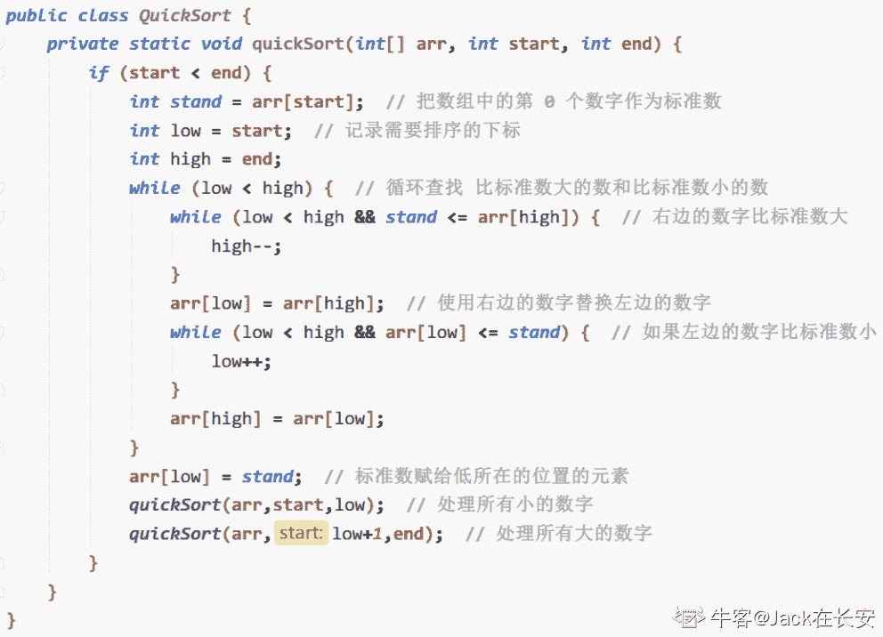

# 网易 2018 校园招聘测试开发工程师（有道事业部）笔试卷

## 1

以下 python 代码输出为

```cpp
>>> a=[1,2,3]
>>> b=a
>>> b[:] = [x+1 for x in a]
>>> print a, b
>>> b = [x-1 for x in a]
>>> print a, b

```

正确答案: A   你的答案: 空 (错误)

```cpp
[2, 3, 4] [2, 3, 4]<br>[2, 3, 4] [1, 2, 3]
```

```cpp
[1, 2, 3] [2, 3, 4]<br>[1, 2, 3] [1, 2, 3]
```

```cpp
[2, 3, 4] [2, 3, 4]<br>[1, 2, 3] [1, 2, 3]
```

```cpp
[1, 2, 3] [2, 3, 4]<br>[1, 2, 3] [2, 3, 4]
```

本题知识点

网易 测试开发工程师 网易 2018

讨论

[offercall 快点来好嘛](https://www.nowcoder.com/profile/4107414)

b=a 赋值操作，不会开辟新的内存空间，只是复制了对象的引用，修改了 b 就会影响 a,修改了 a 也会影响 bb=[x-1 for x in a]相当于重新建了一个对象 b，并给它赋值，不影响原来的 a

发表于 2018-08-10 14:39:51

* * *

[渣渣向前看](https://www.nowcoder.com/profile/298023265)

b = a a 的值赋值给 b，此时 b 与 a 指向同一内存地址 b[:] = [x+1 for x in a  给列表 b 重新赋值由于 a 与 b 指向同一内存地址，修改 b 的内容，a 的内容也会随之改变，故选择 a

发表于 2021-05-03 17:06:10

* * *

## 2

java 中，关于 synchronized 关键字的说法错误的是？（ ）

正确答案: D   你的答案: 空 (错误)

```cpp
可以修饰类的静态方法
```

```cpp
可以修饰类的非静态方法
```

```cpp
可以修饰某一段代码块
```

```cpp
可以修饰类的属性
```

本题知识点

网易 测试开发工程师 网易 2018

讨论

[柏拉图的永恒~~](https://www.nowcoder.com/profile/330111251)

synchronized 与 static 一起使用时，实现了全局锁，锁的是当前使用的类。在普通方法声明上加 synchronized 锁的是当前对象。synchronized 也可以对一段代码加锁

发表于 2019-08-01 18:23:57

* * *

## 3

Ｃ/Ｓ结构软件测试时，以下哪个选项是Ｂ/Ｓ测试时所不需要的？

正确答案: A   你的答案: 空 (错误)

```cpp
客户端专用软件安装包的正常安装测试
```

```cpp
浏览器能否正常打开网页的测试
```

```cpp
数据库是否正常连接的测试
```

```cpp
通过数据库交互取得的数据正确性测试
```

本题知识点

网易 测试开发工程师 网易 2018

讨论

[offercall 快点来好嘛](https://www.nowcoder.com/profile/4107414)

C/S 架构是一种典型的两层架构，其全称是 Client/Server，即客户端服务器端架构，其客户端包含一个或多个在用户的电脑上运行的程序，而服务器端有两种，一种是数据库服务器端，客户端通过数据库连接访问服务器端的数据；另一种是 Socket 服务器端，服务器端的程序通过 Socket 与客户端的程序通信。B/S 架构的全称为 Browser/Server，即浏览器/服务器结构。Browser 指的是 Web 浏览器，极少数事务逻辑在前端实现，但主要事务逻辑在服务器端实现，Browser 客户端，WebApp 服务器端和 DB 端构成所谓的三层架构。**B/S 架构的系统无须特别安装，只有 Web 浏览器即可。**
[`blog.csdn.net/JingFeng001/article/details/59541804`](https://blog.csdn.net/JingFeng001/article/details/59541804)

发表于 2018-08-10 15:00:38

* * *

## 4

需求文档里，文本输入框（textbox）长度要求 1~100 个字，需要以下哪些测试用例？Ａ）0 个文字输入Ｂ）纯英文，纯汉字，英文与汉字结合 1~100 输入Ｃ）全半角输入 D）能否完整显示输入的内容

正确答案: C   你的答案: 空 (错误)

```cpp
ACD
```

```cpp
ABD
```

```cpp
ABCD
```

```cpp
BCD
```

本题知识点

网易 测试开发工程师 网易 2018

## 5

对于需求文档的测试，是在以下哪个阶段进行？

正确答案: C   你的答案: 空 (错误)

```cpp
单元测试
```

```cpp
集成测试
```

```cpp
系统测试
```

```cpp
验收测试
```

本题知识点

网易 测试开发工程师 网易 2018

讨论

[offercall 快点来好嘛](https://www.nowcoder.com/profile/4107414)

每一个阶段测试基于的文档是什么？ 单元测试：软件设计文档。 集成测试：软件结构设计文档。配置项测试：需求规格说明书（接口需求规格说明）。系统测试：用户需求（研制合同或系统需求）。验收测试：软件研制合同（用户需求或系统需求）

发表于 2018-08-10 15:06:07

* * *

## 6

关于 linux 中 shell 变量$,下面那个说法是错误的?

正确答案: C   你的答案: 空 (错误)

```cpp
$0 是脚本本身的名字
```

```cpp
$@ 是传给脚本的所有参数的列表
```

```cpp
$1 是传递给该 shell 脚本的第二个参数
```

```cpp
$$ 是脚本运行的当前进程 ID 号
```

本题知识点

网易 测试开发工程师 网易 2018

讨论

[offercall 快点来好嘛](https://www.nowcoder.com/profile/4107414)

变量说明

$$
Shell 本身的 PID（ProcessID）
$!
Shell 最后运行的后台 Process 的 PID
$?
最后运行的命令的结束代码（返回值）
$-
使用 Set 命令设定的 Flag 一览
$*
所有参数列表。如"$*"用「"」括起来的情况、以"$1 $2 … $n"的形式输出所有参数。
$@
所有参数列表。如"$@"用「"」括起来的情况、以"$1" "$2" … "$n" 的形式输出所有参数。
$#
添加到 Shell 的参数个数
$0
Shell 本身的文件名
$1～$n
添加到 Shell 的各参数值。$1 是第 1 参数、$2 是第 2 参数…。

发表于 2018-08-10 15:19:07

* * *

## 7

设一组初始关键字记录关键字为(17,13,10,16,19,34,43,8),则以开头 17 为基准记录的一趟快速排序结束的结果为()

正确答案: B   你的答案: 空 (错误)

```cpp
13,8,10,16,17,34,43,19
```

```cpp
8,13,10,16,17,34,43,19
```

```cpp
8,13,10,16,17,43,34,19
```

```cpp
8,13,10,17,16,43,34,19
```

本题知识点

网易 测试开发工程师 2018

讨论

[Jack 在长安](https://www.nowcoder.com/profile/453495783)

**先给出快速排序的代码：**
以 17 作为基准，我们从后向前去遍历，找比基准小的数，也就是 8，把 8 放在最前面的位置接着，从前向后继续找比基准大的数,也就是 19，把 19 放在最后的位置接着继续循环，从后向前继续找比基准小的数，发现此时 17 的后面没有比它更小的数字了那么继续从前向后遍历，找比基准大的数，发现左边也没有比 17 更大的数字了等到 low = high，把 17 放到 low = high 的位置那么第一轮排序完的结果就是：***8,13,10,16,17,34,43,19******答案选 B******PS：如解释有误，敬请指正***

发表于 2019-08-28 15:08:01

* * *

[cookcode](https://www.nowcoder.com/profile/457263640)

17 为基准，第一轮开始，while(left<right>发表于 2019-08-02 22:09:54

* * *

## 8

某二叉查找树的每个节点存放一个整数,中序遍历该树得到的序列为 3,4,5，则该树的画法有多少种情况?

正确答案: C   你的答案: 空 (错误)

```cpp
3
```

```cpp
4
```

```cpp
5
```

```cpp
6
```

本题知识点

网易 测试开发工程师 网易 2018

## 9

对于最大堆 64,42,58,23,36,47,56,11,22,27,4,2;删除掉最大元素后，调整后堆中元素为:

正确答案: D   你的答案: 空 (错误)

```cpp
56,42,58,23,36,47,2,11,22,27,4
```

```cpp
58,42,56,36,23,47,2,11,22,27,4
```

```cpp
58,42,56,23,36,47,11,2,22,27,4
```

```cpp
58,42,56,23,36,47,2,11,22,27,4
```

本题知识点

网易 测试开发工程师 网易 2018

## 10

一个简单无向图有 10 个顶点，11 条边，如果用邻接矩阵来存储它，那么矩阵里面会有多少个 0?

正确答案: D   你的答案: 空 (错误)

```cpp
11
```

```cpp
22
```

```cpp
89
```

```cpp
78
```

```cpp
无法表达
```

本题知识点

网易 测试开发工程师 网易 2018

讨论

[cookcode](https://www.nowcoder.com/profile/457263640)

看邻接矩阵无向图的定义 。n² -2e

发表于 2019-08-03 20:17:55

* * *

## 11

有一个整数序列(1 到 7):2,3,_*,_*,7,1,5,中间二个数字 4,6 被墨水模糊了，看不清顺序了(不知道到底是 4,6 还是 6,4)，它所构成的二叉排序树 a，对 a 进行中序遍历，结果是()

正确答案: C   你的答案: 空 (错误)

```cpp
7-2-1-4-3-6-5
```

```cpp
1-3-5-2-4-6-7
```

```cpp
1-2-3-4-5-6-7
```

```cpp
5-6-3-4-1-2-7
```

```cpp
不能确定
```

本题知识点

网易 测试开发工程师 网易 2018

讨论

[999_000](https://www.nowcoder.com/profile/1435511)

个人觉得，中序遍历其实就是，先左节点再根节点再右节点，因为二叉排序树是：左节点<根节点<右节点，所以该二叉排序树的中序遍历就是从小到大的排序大家有什么好的做法，或者建议，欢迎评论

发表于 2018-08-12 19:20:04

* * *

## 12

下面关于 java 内存区说法错误的是?

正确答案: C   你的答案: 空 (错误)

```cpp
类中的成员变量，存放在堆区
```

```cpp
方法中的局部变量，存放在栈区
```

```cpp
jvm 中的堆区和栈区是私有的，不能被线程共享
```

```cpp
方法区：又叫静态存储区，存放 class 文件和静态数据，线程共享
```

```cpp
常量区放未经 new 的常量
```

本题知识点

网易 测试开发工程师 网易 2018

## 13

依次要访问磁道为 21,45,42,6,81,13,78,当前磁头位于 42 号柱面，若用最短寻道时间优先磁盘调度算法，则访问序列为（）

正确答案: B   你的答案: 空 (错误)

```cpp
21,45,42,6,81,13,78
```

```cpp
42,45,21,13,6,78,81
```

```cpp
42,45,78,81,21,13,6
```

```cpp
42,45,78,81,6,13,21
```

```cpp
42,45,78,81,13,6,19
```

```cpp
42,21,13,6,81,78,45
```

本题知识点

网易 测试开发工程师 网易 2018

讨论

[💦Carrie](https://www.nowcoder.com/profile/3604497)

最短寻道时间优先磁盘调度算法：选择与当前磁头距离最短的磁道进行访问，可依次找到访问的磁道为：42-45-21-13-6-78-81

发表于 2018-07-06 17:19:58

* * *

## 14

操作系统中，不同子线程会共享同一个父进程的?

正确答案: B   你的答案: 空 (错误)

```cpp
寄存器组的值
```

```cpp
文件描述符
```

```cpp
线程的堆栈
```

```cpp
错误返回码
```

本题知识点

网易 测试开发工程师 网易 2018

## 15

发送方在发送了一个 TCP 数据包之后，经过 RTO 时间，没有收到对方的确认数据包，则应该？

正确答案: C   你的答案: 空 (错误)

```cpp
停止通信
```

```cpp
检测网络
```

```cpp
重传
```

```cpp
直接发送下一个数据包
```

本题知识点

网易 测试开发工程师 网易 2018

## 16

假设 TTL 的初始值为 3，两台主机之间存在 4 个路由器，则该数据包到达目的地后的 TTL 的值为

正确答案: D   你的答案: 空 (错误)

```cpp
1
```

```cpp
2
```

```cpp
3
```

```cpp
数据包无法到达
```

本题知识点

网易 测试开发工程师 网易 2018

## 17

create table counttest(name char(1), age char(2));insert into counttest(name, age)values('a','14'),('a','15'),('a','15'),('b',NULL),('b','16'),('c','17'),('d',null),('e','');select name, count(1),count(*),count(age), count(distinct(age))from counttest group by name;   查询结果是

正确答案: D   你的答案: 空 (错误)

```cpp
a 3 3 3 2<br>b 2 1 1 1<br>c 1 1 1 1<br>d 1 1 0 0<br>e 1 1 1 1
```

```cpp
a 3 3 3 2<br>b 2 1 2 2<br>c 1 1 1 1<br>d 1 1 1 1<br>e 1 1 1 1
```

```cpp
a 3 3 3 2<br>b 2 1 1 2<br>c 1 1 1 1<br>d 1 1 0 1<br>e 1 0 1 1
```

```cpp
a 3 3 3 2<br>b 2 2 1 1<br>c 1 1 1 1<br>d 1 1 0 0<br>e 1 1 1 1
```

本题知识点

网易 测试开发工程师 网易 2018

## 18

为了得到一个数的"相反数",我们将这个数的数字顺序颠倒,然后再加上原先的数得到"相反数"。例如,为了得到 1325 的"相反数",首先我们将该数的数字顺序颠倒,我们得到 5231,之后再加上原先的数,我们得到 5231+1325=6556.如果颠倒之后的数字有前缀零,前缀零将会被忽略。例如 n = 100, 颠倒之后是 1.

本题知识点

网易 模拟 字符串 *数学 栈 *测试开发工程师 2018** **讨论

[handsomeoier](https://www.nowcoder.com/profile/101897674)

#include <bits>using namespace std;
int s,d,ans=0;
int main(){
    cin>>s;
    int k=s;
    while (k!=0){
        d=d*10+k%10;
        k/=10;
    }
    ans=d+s;
    cout<<ans<<endl;
    return 0;
}

发表于 2018-11-29 21:04:07

* * *

[求求给我来个 Offer 吧](https://www.nowcoder.com/profile/397614448)

```cpp
n=input()
print(int(str(n)[::-1])+n)
```

发表于 2019-08-27 13:02:50

* * *

[log 羽翼](https://www.nowcoder.com/profile/747898517)

import java.util.Scanner;
public class Main {
    public static void main(String[] args) {
        Scanner scan=new Scanner(System.in);
        int num=scan.nextInt();
        System.out.println(getReverseNum(num)+num);
    }
    public static int getReverseNum(int num){
        int temp=0;
        while(num>0){
            temp=temp*10+num%10;
            num/=10;    
        }
        return temp;
    }
}

编辑于 2018-11-29 23:39:23

* * *

## 19

小易有一个长度为 N 的正整数数列 A = {A[1], A[2], A[3]..., A[N]}。
牛博士给小易出了一个难题:
对数列 A 进行重新排列,使数列 A 满足所有的 A[i] * Ai + 1 都是 4 的倍数。
小易现在需要判断一个数列是否可以重排之后满足牛博士的要求。

本题知识点

网易 数学 贪心 动态规划 数组 测试开发工程师 2018

讨论

[幼师的攻城狮](https://www.nowcoder.com/profile/6732997)

```cpp
#include <bits/stdc++.h>
using namespace std;
int main() {
  int t; // 数列个数
  scanf("%d", &t); 
  for(int k=0;k<t;++k) {
    int n;
    scanf("%d", &n); // 数列长度 
    int cnt4 = 0; // 四倍数计数
    int cnt2 = 0; // 偶数计数
    int cnt1 = 0; // 奇数计数
    for (int i = 0; i < n; i++) { // 获取数列数据
      int x;
      scanf("%d", &x);
      // 更新统计
      if (x % 4 == 0)
        cnt4++;
      else if (x % 2 == 0)
        cnt2++;
      else
        cnt1++;
    }
    // 统计判断
    if (cnt2 == 0) { // 情况 1
      if (cnt4 >= cnt1 - 1)
        printf("Yes\n");
      else
        printf("No\n");
    } else { // 情况 2
      if (cnt4 >= cnt1)
        printf("Yes\n");
      else
        printf("No\n");
    }
  }
  return 0;
}

```

发表于 2018-11-04 11:49:11

* * *

[Disconnect](https://www.nowcoder.com/profile/4864974)

```cpp
t = input()
t = int(t)
for k in range(t):
    n = input()
    n = int(n)
    con4,con2 = 0,0
    lst = list(map(int,input().split()))
    for i in range(n):
        if lst[i]%4==0:
            con4+=1
        elif lst[i]%2==0:
            con2+=1
    if con2==1:
        con2=0
    if n%2==0:
        if con4*2+con2>=n:
            print("Yes")
        else:
            print("No")
    else:
        if con4*2+con2>=n-1:
            print("Yes")
        else:
            print("No")

```

发表于 2018-12-24 00:11:50

* * *

## 20

一个合法的括号匹配序列被定义为:
1\. 空串""是合法的括号序列
2\. 如果"X"和"Y"是合法的序列,那么"XY"也是一个合法的括号序列
3\. 如果"X"是一个合法的序列,那么"(X)"也是一个合法的括号序列
4\. 每个合法的括号序列都可以由上面的规则生成
例如"", "()", "()()()", "(()())", "(((()))"都是合法的。
从一个字符串 S 中移除零个或者多个字符得到的序列称为 S 的子序列。
例如"abcde"的子序列有"abe","","abcde"等。
定义 LCS(S,T)为字符串 S 和字符串 T 最长公共子序列的长度,即一个最长的序列 W 既是 S 的子序列也是 T 的子序列的长度。
小易给出一个合法的括号匹配序列 s,小易希望你能找出具有以下特征的括号序列 t:
1、t 跟 s 不同,但是长度相同
2、t 也是一个合法的括号匹配序列
3、LCS(s, t)是满足上述两个条件的 t 中最大的
因为这样的 t 可能存在多个,小易需要你计算出满足条件的 t 有多少个。

如样例所示: s = "(())()",跟字符串 s 长度相同的合法括号匹配序列有:
"()(())", "((()))", "()()()", "(()())",其中 LCS( "(())()", "()(())" )为 4,其他三个都为 5,所以输出 3.

本题知识点

网易 字符串 *贪心 栈 *穷举 哈希 *测试开发工程师 2018*** ***## 21

在 C++程序中，如有如下语句：int b = 5;int a = 10;int &i = b;int *j = &a;int *&k = j;请问下列哪个操作不能实现把 a 赋值为 5。

正确答案: B   你的答案: 空 (错误)

```cpp
a = i;
```

```cpp
k = &amp;b;
```

```cpp
*k = i;
```

```cpp
*j = *&amp;b;
```

本题知识点

网易 测试开发工程师 网易 2018

## 22

随机地掷一骰子两次，则两次出现的点数之和等于 8 的概率为：

正确答案: C   你的答案: 空 (错误)

```cpp
3/36
```

```cpp
4/36
```

```cpp
5/36
```

```cpp
2/36
```

本题知识点

网易 测试开发工程师 网易 2018

讨论

[999_000](https://www.nowcoder.com/profile/1435511)

随机掷两次[骰子](https://www.baidu.com/s?wd=%E9%AA%B0%E5%AD%90&tn=SE_PcZhidaonwhc_ngpagmjz&rsv_dl=gh_pc_zhidao)之和等于 8 有以下几种情况 （逗号前的是第 1 次得到的数.后面为第 2 次得到的数 ）
2,6
3,5
4,4
5,3
6,2
共 5 种情况
[骰子](https://www.baidu.com/s?wd=%E9%AA%B0%E5%AD%90&tn=SE_PcZhidaonwhc_ngpagmjz&rsv_dl=gh_pc_zhidao)有六个面,掷两次共有 6*6＝36 种情况,且每种情况出现的几率相等
所以是 5/36,[约等于](https://www.baidu.com/s?wd=%E7%BA%A6%E7%AD%89%E4%BA%8E&tn=SE_PcZhidaonwhc_ngpagmjz&rsv_dl=gh_pc_zhidao)13.9％

发表于 2018-08-13 21:54:09

* * *

## 23

求下面函数的返回值

```cpp
{ 
    int countx = 0; 
    while(x) 
    { 
        countx ++; 
        x = x&(x-1); 
    } 
    return countx; 
}
```

正确答案: B   你的答案: 空 (错误)

```cpp
16
```

```cpp
8
```

```cpp
2
```

```cpp
4
```

本题知识点

网易 测试开发工程师 网易 2018***</bits>**</right>