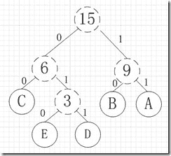

# 网易 2018 校园招聘运维开发工程师（有道事业部）笔试卷

## 1

临时需要制作一个 1G 大小的文件 tmp，以下做法正确的是:

正确答案: B   你的答案: 空 (错误)

```cpp
dd if=/dev/zero of=tmp count=1G bs=1
```

```cpp
dd if=/dev/zero of=tmp count=1 bs=1G
```

```cpp
dd if=/dev/zero of=tmp count=1 bs=1
```

```cpp
dd if=/dev/zero of=tmp count=1G bs=1G
```

本题知识点

网易 运维工程师 运维工程师 网易 2018

## 2

以下 python 代码输出为

```cpp
>>> a=[1,2,3]
>>> b=a
>>> b[:] = [x+1 for x in a]
>>> print a, b
>>> b = [x-1 for x in a]
>>> print a, b

```

正确答案: A   你的答案: 空 (错误)

```cpp
[2, 3, 4] [2, 3, 4]<br>[2, 3, 4] [1, 2, 3]
```

```cpp
[1, 2, 3] [2, 3, 4]<br>[1, 2, 3] [1, 2, 3]
```

```cpp
[2, 3, 4] [2, 3, 4]<br>[1, 2, 3] [1, 2, 3]
```

```cpp
[1, 2, 3] [2, 3, 4]<br>[1, 2, 3] [2, 3, 4]
```

本题知识点

网易 运维工程师 运维工程师 网易 2018

讨论

[renyiBUPT](https://www.nowcoder.com/profile/535890314)

一句话 b[:] 是深拷贝，修改的内容指向原地址 b 是浅拷贝，修改的内容，指向新的内存地址选 A

发表于 2018-09-19 10:50:44

* * *

[阳光下](https://www.nowcoder.com/profile/3598955)

A

发表于 2018-07-27 09:23:40

* * *

## 3

在 Linux 系统下，查看进程占用的端口的命令是什么?

正确答案: A   你的答案: 空 (错误)

```cpp
netstat –apn
```

```cpp
watch
```

```cpp
lsof
```

```cpp
ps -aux
```

本题知识点

网易 运维工程师 运维工程师 网易 2018

## 4

关于 linux 中 shell 变量$,下面那个说法是错误的?

正确答案: C   你的答案: 空 (错误)

```cpp
$0 是脚本本身的名字
```

```cpp
$@ 是传给脚本的所有参数的列表
```

```cpp
$1 是传递给该 shell 脚本的第二个参数
```

```cpp
$$ 是脚本运行的当前进程 ID 号
```

本题知识点

网易 运维工程师 运维工程师 网易 2018

## 5

下面关于 Linux 链接说法正确的是()

正确答案: D   你的答案: 空 (错误)

```cpp
符号链接又被称为硬链接
```

```cpp
硬链接可以跨文件系统，软链接不可以
```

```cpp
软链接不可以对一个不存在的文件名进行链接
```

```cpp
软链接可以对目录进行链接
```

```cpp
硬链接指向是的不同的 inode 节点
```

本题知识点

网易 运维工程师 运维工程师 网易 2018

## 6

Linux 进程内存空间有以下几个部分:

> 1.stack 2.heap3.bss segment4.code segment/text segment5.data segment

它们从高地址到低地址的分布顺序为()

正确答案: B   你的答案: 空 (错误)

```cpp
45321
```

```cpp
12354
```

```cpp
45312
```

```cpp
21354
```

本题知识点

网易 运维工程师 运维工程师 网易 2018

## 7

字符串有 5 个字符 q,w,e,r,t，出现的频率分别为 1,2,3,4,5，如果采用 Huffman 编码对字符串编码，则每个字符编码的平均长度是（）?

正确答案: B   你的答案: 空 (错误)

```cpp
2.2
```

```cpp
2.4
```

```cpp
2.6
```

```cpp
2.8
```

```cpp
3.0
```

本题知识点

网易 运维工程师 运维工程师 网易 2018

讨论

[简单点 201904031109229](https://www.nowcoder.com/profile/673358515)

出现频率更大的符号将获得更短的比特(权值)，出现频率更小的符号将被分配更长的比特，以此来提高数据压缩率，提高传输效率, 故用树表示此图 ABCDE, 频率 5,4,3,2,1, 即 AB 的频率大, 权值得小, 树的深度小故: 编码 A:11, B:10, C:00, D:011, E:010 平均长度: (2 + 2 + 2 + 3 + 3)/5 = 2.4

发表于 2019-04-03 16:06:34

* * *

## 8

假如一个二叉树有 1026 个节点，它的深度的可能性有多少种?(假设只有根节点的深度为 1)

正确答案: E   你的答案: 空 (错误)

```cpp
2
```

```cpp
1017
```

```cpp
1014
```

```cpp
1015
```

```cpp
1016
```

本题知识点

网易 运维工程师 2018

## 9

在页式存储管理中，假设一个程序的存储块数是 3，要访问的页面 id 为 1,2,3,3,2,1,4,3,2,1，并采用 LRU 算法，那么整个过程缺页次数为多少?

正确答案: C   你的答案: 空 (错误)

```cpp
5
```

```cpp
6
```

```cpp
7
```

```cpp
8
```

```cpp
4
```

本题知识点

网易 运维工程师 运维工程师 网易 2018

## 10

下面关于消息队列说法错误的有?

正确答案: B   你的答案: 空 (错误)

```cpp
一个消息队列可以被多个进程所共享
```

```cpp
一个进程的消息太多，一个消息队列放不下，不可以用多于一个的消息队列，只能通过其他方式来进行进程通信
```

```cpp
共享消息队列的进程所发送的消息中除了 message 本身外还有一个标志，这个标志可以指明该消息将由哪个进程或者是哪类进程接受
```

```cpp
每一个共享消息队列的进程针对一个队列可以有自己的标志，可以用来声明自己的身份
```

本题知识点

网易 运维工程师 2018

## 11

Belady 现象可能会出现在以下哪个算法中?

正确答案: D   你的答案: 空 (错误)

```cpp
预防死锁算法
```

```cpp
磁盘调度算法
```

```cpp
内存管理算法
```

```cpp
内存换页算法
```

```cpp
进程调度算法
```

本题知识点

网易 运维工程师 运维工程师 网易 2018

## 12

如果 TCP 连接中，拥塞窗口一直在缩小,下面哪种情况最有可能发生？

正确答案: D   你的答案: 空 (错误)

```cpp
包错误
```

```cpp
释放缓存
```

```cpp
连接错误
```

```cpp
丢包
```

本题知识点

网易 运维工程师 2018

## 13

TCP SYN 攻击是利用 TCP 的弱点来进行攻击，攻击者向服务器发出 SYN 请求后，服务器对接收到的 SYN 请求做什么处理

正确答案: B   你的答案: 空 (错误)

```cpp
服务器在收到攻击者发出的 SYN 请求后不会向攻击者发出任何数据包
```

```cpp
服务器在收到攻击者发出的 SYN 请求后会向攻击者发送 SYN+ACK 数据包
```

```cpp
服务器在收到攻击者发出的 SYN 请求后会向攻击者发送 SYN 数据包
```

```cpp
服务器在收到攻击者发出的 SYN 请求后会和攻击者建立连接
```

本题知识点

网易 运维工程师 运维工程师 网易 2018

## 14

发送方在发送了一个 TCP 数据包之后，经过 RTO 时间，没有收到对方的确认数据包，则应该？

正确答案: C   你的答案: 空 (错误)

```cpp
停止通信
```

```cpp
检测网络
```

```cpp
重传
```

```cpp
直接发送下一个数据包
```

本题知识点

网易 运维工程师 运维工程师 网易 2018

## 15

假设 TTL 的初始值为 3，两台主机之间存在 4 个路由器，则该数据包到达目的地后的 TTL 的值为

正确答案: D   你的答案: 空 (错误)

```cpp
1
```

```cpp
2
```

```cpp
3
```

```cpp
数据包无法到达
```

本题知识点

网易 运维工程师 运维工程师 网易 2018

## 16

TCP 数据包里的出现什么标志位表示连接被异常终止，或被拒绝的异常请求

正确答案: B   你的答案: 空 (错误)

```cpp
FIN/ACK
```

```cpp
RST/ACK
```

```cpp
SYN
```

```cpp
ACK
```

本题知识点

网易 运维工程师 运维工程师 网易 2018

## 17

在 TCP 协议包里，如果接收方发现丢包的情况，则会发送多少个重复 ACK 数据包

正确答案: A   你的答案: 空 (错误)

```cpp
3
```

```cpp
4
```

```cpp
5
```

```cpp
6
```

本题知识点

网易 运维工程师 运维工程师 网易 2018

## 18

shell 中，可以让一个变量变为全局变量的是？

正确答案: B   你的答案: 空 (错误)

```cpp
alias
```

```cpp
export
```

```cpp
exports
```

```cpp
let
```

本题知识点

网易 运维工程师 运维工程师 网易 2018

## 19

一个 bash shell 脚本上的第一行通常要加上下面哪一句？

正确答案: D   你的答案: 空 (错误)

```cpp
#/bin/csh
```

```cpp
#!/bin/sh
```

```cpp
#/bin/sh
```

```cpp
#!/bin/bash
```

本题知识点

网易 运维工程师 运维工程师 网易 2018

## 20

shell 中，如果想匹配以 wangyi 开头的行，应该采用下面的哪个正则表达式？

正确答案: A   你的答案: 空 (错误)

```cpp
^wangyi
```

```cpp
wangyi$
```

```cpp
\wangyi
```

```cpp
*wangyi
```

本题知识点

网易 运维工程师 运维工程师 网易 2018

讨论

[T-Candice](https://www.nowcoder.com/profile/6505468)

A，^表示以什么开头

发表于 2018-11-17 19:41:55

* * *

## 21

小易准备去魔法王国采购魔法神器,购买魔法神器需要使用魔法币,但是小易现在一枚魔法币都没有,但是小易有两台魔法机器可以通过投入 x(x 可以为 0)个魔法币产生更多的魔法币。
魔法机器 1:如果投入 x 个魔法币,魔法机器会将其变为 2x+1 个魔法币
魔法机器 2:如果投入 x 个魔法币,魔法机器会将其变为 2x+2 个魔法币
小易采购魔法神器总共需要 n 个魔法币,所以小易只能通过两台魔法机器产生恰好 n 个魔法币,小易需要你帮他设计一个投入方案使他最后恰好拥有 n 个魔法币。

本题知识点

网易 运维工程师 数学 贪心 模拟 2018

讨论

[Its.](https://www.nowcoder.com/profile/5502493)

```cpp
s = ''
def fun(n):
    global s
    while n != 0:
        if n % 2 == 0:
            f=lambda n:(n-2)/2
            n=f(n)
            s=s+'2'
        else:
            f=lambda n:(n-1)/2
            n=f(n)
            s=s+'1'
n = eval(input())
fun(n)
print(s[::-1]) 
```

发表于 2018-09-14 21:58:40

* * *

[清塘荷韵 _kathy](https://www.nowcoder.com/profile/573237)

| x  | 机器 1   '1'  | 机器 2  '2'  |
| 0  | 1  | 2  |
| 1    | 3  | 4  |
| 2  | 5  | 6  |
| 3  | 7  | 8  |
| 4  | 9  | 10 |

n=10,                          
f(0)=1  '1'f(1)=4  '2'f(4)=10  '2'
n=9,f(0)=1  '1'f(1)=4   '2'f(4)=9   '1'倒着看，就会发现规律，当 n 为奇数时，f(x)=2*x+1；当 n 为偶数时，f（x）=2*x+2.
#include <iostream>#include <stack>usingnamespacestd;stack<char> getMoney(intN){    stack<char> ret;    chara ='1';    charb ='2';    while(N != 0)    {        if(N % 2 == 0)//偶数，(N-2)/2        {            N = (N-2)/2;            ret.push(b);        }        if(N % 2 == 1)//奇数，(N-1)/2        {            N = (N-1)/2;            ret.push(a);        }    }    returnret;}intmain(){    intx;    cin>>x;    stack<char> ret = getMoney(x);    while(!ret.empty())    {        cout<<ret.top();        ret.pop();    }    return0;}

发表于 2018-08-10 17:55:06

* * *

[你们之后会让 hr 联系我的](https://www.nowcoder.com/profile/6845873)

```cpp
def func(n ,res):
    if n == 0:
        res.reverse()
        print ''.join(res)
        return None

    if n % 2 == 0:
        res.append('2')
        func((n - 2) / 2, res)
    else:
        res.append('1')
        func((n - 1) / 2, res)

if __name__ == '__main__':
    n = input()
    res = []

    func(n, res)
```

编辑于 2018-08-30 10:48:13

* * *

## 22

魔法王国一共有 n 个城市,编号为 0~n-1 号,n 个城市之间的道路连接起来恰好构成一棵树。
小易现在在 0 号城市,每次行动小易会从当前所在的城市走到与其相邻的一个城市,小易最多能行动 L 次。
如果小易到达过某个城市就视为小易游历过这个城市了,小易现在要制定好的旅游计划使他能游历最多的城市,请你帮他计算一下他最多能游历过多少个城市(注意 0 号城市已经游历了,游历过的城市不重复计算)。

本题知识点

网易 运维工程师 贪心 动态规划 树 2018

## 23

小易有一个长度为 N 的正整数数列 A = {A[1], A[2], A[3]..., A[N]}。
牛博士给小易出了一个难题:
对数列 A 进行重新排列,使数列 A 满足所有的 A[i] * Ai + 1 都是 4 的倍数。
小易现在需要判断一个数列是否可以重排之后满足牛博士的要求。

本题知识点

网易 运维工程师 数学 贪心 动态规划 数组 2018

讨论

[wsws 阿毛](https://www.nowcoder.com/profile/7966271)

#include <stdio.h>#include<stdlib.h>
#include<string.h>

char IsTwFo(int a)
{
    char flag;
    if (!(a % 4))
        flag = 2;
    else if (!(a % 2))
        flag = 1;
    else
        flag = 0;
    return flag;
}
char IsYes(int num_1, int num_0, int a)//满足条件 flag=1
{                                       //num_1-能被 4 整除,num_0--能被 2 整除
    char flag;
    if ((a == num_0) || (num_1 >= a - num_0 - num_1))
        flag = 1;
    else
        flag = 0;
    return flag;
}
int main()
{
    int N;
    while (scanf("%d", &N) != EOF)
    {
        int n[10] = { 0 };
        int i, j;
        int **A = (int **)(malloc(N*sizeof(int *)));

        for (i = 0; i < N; i++)
        {
            scanf("%d", &n[i]);
            A[i] = (int *)(malloc(n[i] * sizeof(int)));
            for (j = 0; j < n[i]; j++)
            {
                scanf("%d", &A[i][j]);
            }
        }

        int num[10][2] = { 0 };//统计每个数列只能被 2 和能被 4 整除的数量
                               //num[i][0]--能被 4 整除，num[i][1]--能被 2 整除

        for (i = 0; i < N; i++)
        {
            for (j = 0; j < n[i]; j++)
            {
                if (IsTwFo(A[i][j]) == 2)
                    num[i][0]++;
                else if (IsTwFo(A[i][j]) == 1)
                    num[i][1]++;
            }
        }
        for (i = 0; i < N; i++)
        {
            if (IsYes(num[i][0], num[i][1], n[i]))
                printf("Yes\n");
            else
                printf("No\n");
        }
        for (i = 0; i < N; i++)
        {
            free(A[i]);
        }
        free(A);

    }  

```cpp
  //  system("pause");
```

    return 0;
}

发表于 2018-08-06 19:52:56

* * *

[司码珺](https://www.nowcoder.com/profile/9130313)

```cpp
#include <bits/stdc++.h>

using namespace std;

int main()
{
    int n;
    int num;
    cin>>num;
    while(num--)
    {
        cin>>n;
        int n4=0,n2=0,n1=0;
        while(n--)
        {
            int temp=0;
            cin>>temp;
            if(temp%4==0)
                n4++;
            else if(temp%2==0)
                n2++;
            else
                n1++;
        }
        if(n2==0)
        {
            if(n4>=n1-1)
            {
                printf("Yes\n");
            }
            else
            {
                printf("No\n");
            }
        }
        else
        {
            if(n4>=n1)
            {
                printf("Yes\n");
            }
            else
            {
                printf("No\n");
            }
        }
    }
    return 0;
}

```

发表于 2018-07-31 22:26:22

* * *</stdio.h>