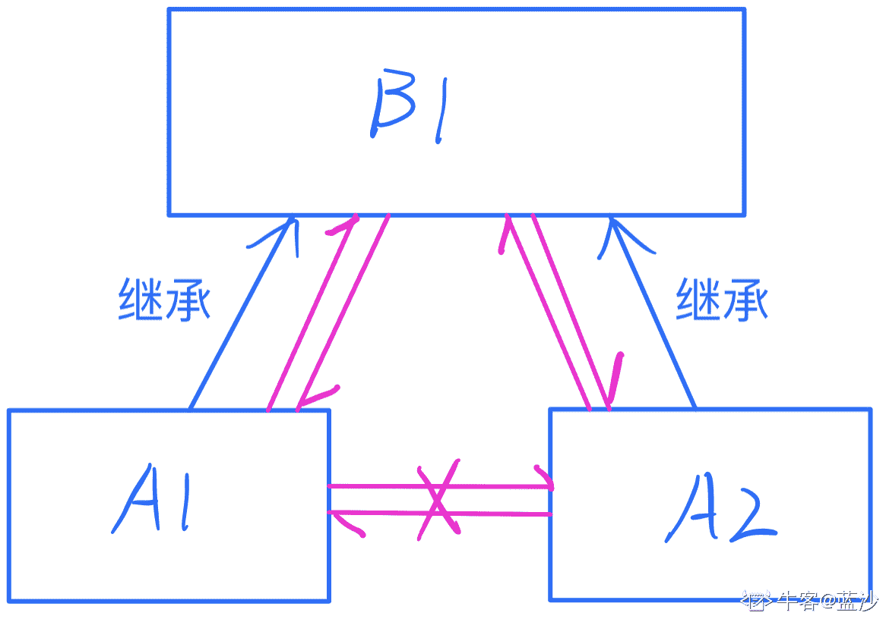
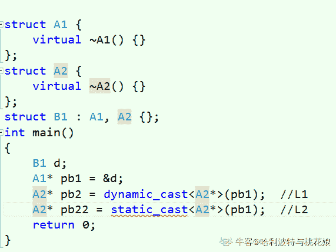

# 网易 2018 校园招聘研发工程师（有道事业部）笔试卷

## 1

Android 的 UI 管理系统的层级关系，由外到内，正确的包含关系是？

正确答案: C   你的答案: 空 (错误)

```cpp
PhoneWindow, Activity, DecorView, ContentView
```

```cpp
Activity, DecorView, PhoneWindow, ContentView
```

```cpp
Activity, PhoneWindow, DecorView, ContentView
```

```cpp
Activity, DecorView, ContentView, PhoneWindow
```

本题知识点

网易 运维工程师 Java 工程师 C++工程师 iOS 工程师 安卓工程师 前端工程师 算法工程师 PHP 工程师 2018

讨论

[传奇的小象](https://www.nowcoder.com/profile/927360754)

C

发表于 2019-07-07 14:44:29

* * *

## 2

在 iOS 沙盒机制下，下面哪个文件夹是用来存放数据的，并且在版本迭代时不会被替换掉。

正确答案: B   你的答案: 空 (错误)

```cpp
Application
```

```cpp
Documents
```

```cpp
Library
```

```cpp
tmp
```

本题知识点

网易 运维工程师 Java 工程师 C++工程师 iOS 工程师 安卓工程师 前端工程师 算法工程师 PHP 工程师 C++工程师 Java 工程师 网易 2018

## 3

下面关于正则表达式的说法错误的是()

正确答案: D   你的答案: 空 (错误)

```cpp
&quot;.&quot;匹配除\n 之外的任意字符
```

```cpp
&quot;*&quot;匹配 0 个或多个的数量限定符
```

```cpp
&quot;+&quot;匹配 1 个或多个的数量限定符
```

```cpp
&quot;?&quot;匹配前面的子表达式 0 次或 1 次或 2 次
```

本题知识点

网易 运维工程师 Java 工程师 C++工程师 iOS 工程师 安卓工程师 前端工程师 算法工程师 PHP 工程师 2018

讨论

[ricric](https://www.nowcoder.com/profile/597274366)

*   runoo+b，可以匹配 runoob、runooob、runoooooob 等，+ 号代表前面的字符必须至少出现一次（1 次或多次）。

*   runoo*b，可以匹配 runob、runoob、runoooooob 等，* 号代表前面的字符可以不出现，也可以出现一次或者多次（0 次、或 1 次、或多次）。

*   colou?r 可以匹配 color 或者 colour，? 问号代表前面的字符最多只可以出现一次（0 次、或 1 次）。

发表于 2020-08-04 17:27:24

* * *

## 4

Linux 进程内存空间有以下几个部分:

> 1.stack 2.heap3.bss segment4.code segment/text segment5.data segment

它们从高地址到低地址的分布顺序为()

正确答案: B   你的答案: 空 (错误)

```cpp
45321
```

```cpp
12354
```

```cpp
45312
```

```cpp
21354
```

本题知识点

网易 运维工程师 Java 工程师 C++工程师 iOS 工程师 安卓工程师 前端工程师 算法工程师 PHP 工程师 C++工程师 Java 工程师 网易 2018

## 5

有一个数组,元素为 70,10,40,30,190,100,130,160,90,80,将它进行堆排序,当刚刚建成大根堆时,它
所对应二叉树的前序遍历是多少?

正确答案: C   你的答案: 空 (错误)

```cpp
190,160,130,100,90,80,70,40,30,10
```

```cpp
30,90,70,160,10,80,190,100,130,40
```

```cpp
190,160,90,30,70,80,10,130,100,40
```

```cpp
30,70,90,10,80,160,100,40,130,190
```

本题知识点

网易 运维工程师 Java 工程师 C++工程师 iOS 工程师 安卓工程师 前端工程师 算法工程师 PHP 工程师 C++工程师 Java 工程师 网易 2018

## 6

某表达式的后缀表达式为 AB+CD+/E*，该表达式原型可能为以下哪个?

正确答案: D   你的答案: 空 (错误)

```cpp
A+B/(C+D)*E
```

```cpp
((A+B)/C+D)*E
```

```cpp
(A+B/C+D)*E
```

```cpp
(A+B)/(C+D)*E
```

```cpp
(A+B)*E/(C+D)
```

本题知识点

网易 运维工程师 Java 工程师 C++工程师 iOS 工程师 安卓工程师 前端工程师 算法工程师 PHP 工程师 C++工程师 Java 工程师 网易 2018

## 7

字符串有 5 个字符 q,w,e,r,t，出现的频率分别为 1,2,3,4,5，如果采用 Huffman 编码对字符串编码，则每个字符编码的平均长度是（）?

正确答案: B   你的答案: 空 (错误)

```cpp
2.2
```

```cpp
2.4
```

```cpp
2.6
```

```cpp
2.8
```

```cpp
3.0
```

本题知识点

网易 运维工程师 Java 工程师 C++工程师 iOS 工程师 安卓工程师 前端工程师 算法工程师 PHP 工程师 C++工程师 Java 工程师 网易 2018

## 8

以下关于无向正权图的最短路和最小生成树的说法正确的有()

正确答案: C   你的答案: 空 (错误)

```cpp
当图的每条边的权值都增加 2 的时候，之前计算的最短路和最小生成树都仍然有效。
```

```cpp
当图的每条边的权值都扩大 2 倍的时候，之前计算的最短路和最小生成树已经失效。
```

```cpp
当图的每条边的权值都增加 2 的时候，之前计算的最小生成树仍然有效。
```

```cpp
当图的每条边的权值都扩大 2 倍的时候，之前计算的最短路已经失效（不再是最短路）。
```

本题知识点

网易 运维工程师 Java 工程师 C++工程师 iOS 工程师 安卓工程师 前端工程师 算法工程师 PHP 工程师 2018

## 9

以下算法不可以使用贪心算法的是?

正确答案: A   你的答案: 空 (错误)

```cpp
Floyd-Warshall 算法
```

```cpp
dijkstra 算法
```

```cpp
kruskal 算法
```

```cpp
Huffman 编码算法
```

本题知识点

网易 运维工程师 Java 工程师 C++工程师 iOS 工程师 安卓工程师 前端工程师 算法工程师 PHP 工程师 2018

## 10

一个简单无向图有 10 个顶点，11 条边，如果用邻接矩阵来存储它，那么矩阵里面会有多少个 0?

正确答案: D   你的答案: 空 (错误)

```cpp
11
```

```cpp
22
```

```cpp
89
```

```cpp
78
```

```cpp
无法表达
```

本题知识点

网易 运维工程师 Java 工程师 C++工程师 iOS 工程师 安卓工程师 前端工程师 算法工程师 PHP 工程师 2018

讨论

[我佛慈悲](https://www.nowcoder.com/profile/651485287)

邻接矩阵反映顶点间邻接关系。设 G=(V，E)是具有 n 个顶点的图，G 的邻接矩阵 M 是一个 n 行 n 列的矩阵，并有若(i，j)或＜i，j＞∈E，则 M[i][j]=1。否则 M[i][j]=0。
由邻接矩阵的定义可知，无向图的邻接矩阵是对称的，即图中的一条边对应邻接矩阵的两个非零元素。因此在一个含有 n 个顶点和 e 条边的简单无向图的邻接矩阵***有 n2-2e 个零元素。

发表于 2018-09-08 10:35:27

* * *

## 11

有一个整数序列(1 到 7):2,3,_*,_*,7,1,5,中间二个数字 4,6 被墨水模糊了，看不清顺序了(不知道到底是 4,6 还是 6,4)，它所构成的二叉排序树 a，对 a 进行中序遍历，结果是()

正确答案: C   你的答案: 空 (错误)

```cpp
7-2-1-4-3-6-5
```

```cpp
1-3-5-2-4-6-7
```

```cpp
1-2-3-4-5-6-7
```

```cpp
5-6-3-4-1-2-7
```

```cpp
不能确定
```

本题知识点

网易 运维工程师 Java 工程师 C++工程师 iOS 工程师 安卓工程师 前端工程师 算法工程师 PHP 工程师 C++工程师 Java 工程师 网易 2018

## 12

有如下代码:

```cpp
struct A1 {
    virtual ~A1() {}
};
struct A2 {
    virtual ~A2() {}
};
struct B1 : A1, A2 {};

int main() {
    B1 d;
    A1* pb1 = &d;
    A2* pb2 = dynamic_cast<A2*>(pb1);  //L1
    A2* pb22 = static_cast<A2*>(pb1);  //L2
    return 0;
}
```

正确答案: B   你的答案: 空 (错误)

```cpp
L1 语句编译失败，L2 语句编译通过
```

```cpp
L1 语句编译通过，L2 语句编译失败
```

```cpp
L1，L2 都编译失败
```

```cpp
L1，L2 都编译通过
```

本题知识点

网易 C++工程师 iOS 工程师 2018 C++ C 语言

讨论

[蓝沙](https://www.nowcoder.com/profile/819135291)

    因为 dynamic_cast 是在运行时进行类型检查的，指针 pb1 指向了基类对象 d，在运行时 dynamic_cast 能知道 pb1 真正指向的对象 d，所以用 dynamic_cast<A2*>(pb1)其实就是把 A1*指向 B1 转换成了 A2*指向 B1    而 static_cast 是在编译时进行转换的，A1*和 A2*是两个不同的指针类型，不能进行转换。    如果把 A2* pb2 = dynamic_cast<A2*>(pb1);A2* pb22 = static_cast<A2*>(pb1);    换成 A2* pb2 = dynamic_cast<A2*>(&d);A2* pb22 = static_cast<A2*>(&d);    就没有错误了
    这道题考的应该是 static_cast 的编译时期转换和 dynamic_cast 的运行时期转换

发表于 2020-12-28 08:51:03

* * *

[凉城绘梦](https://www.nowcoder.com/profile/442216957)

在类的转换时，在类层次间进行上行转换时，dynamic_cast 和 static_cast 的效果是一样的。在进行下行转换时，dynamic_cast 具有类型检查的功能，比 static_cast 更安全。

向上转换，即为子类指针指向父类指针（一般不会出问题）；向下转换，即将父类指针转化子类指针。

向下转换的成功与否还与将要转换的类型有关，即要转换的指针指向的对象的实际类型与转换以后的对象类型一定要相同，否则转换失败。

发表于 2020-09-20 12:23:46

* * *

[哈利波特与桃花娘](https://www.nowcoder.com/profile/501696196)

vs2015 上面 L2 无法编译...

编辑于 2020-09-27 19:10:12

* * *

## 13

java 中，当实例化子类对象时，如果有以下几个会被加载，那么加载的顺序是什么？
(1)父类静态代码块
(2)父类构造函数
(3)父类非静态代码块
(4)子类静态代码块
(5)子类构造函数
(6)子类非静态代码块

正确答案: C   你的答案: 空 (错误)

```cpp
1-&gt;2-&gt;4-&gt;3-&gt;5-&gt;6
```

```cpp
1-&gt;2-&gt;3-&gt;4-&gt;5-&gt;6
```

```cpp
1-&gt;4-&gt;3-&gt;2-&gt;6-&gt;5
```

```cpp
2-&gt;1-&gt;3-&gt;4-&gt;5-&gt;6
```

```cpp
1-&gt;4-&gt;3-&gt;6-&gt;2-&gt;5
```

本题知识点

网易 运维工程师 Java 工程师 C++工程师 iOS 工程师 安卓工程师 前端工程师 算法工程师 PHP 工程师 C++工程师 Java 工程师 网易 2018

## 14

在页式存储管理中，假设一个程序的存储块数是 3，要访问的页面 id 为 1,2,3,3,2,1,4,3,2,1，并采用 LRU 算法，那么整个过程缺页次数为多少?

正确答案: C   你的答案: 空 (错误)

```cpp
5
```

```cpp
6
```

```cpp
7
```

```cpp
8
```

```cpp
4
```

本题知识点

网易 运维工程师 Java 工程师 C++工程师 iOS 工程师 安卓工程师 前端工程师 算法工程师 PHP 工程师 C++工程师 Java 工程师 网易 2018

## 15

下面关于操作系统的进程说法正确的有?

正确答案: B   你的答案: 空 (错误)

```cpp
系统中进程的数目越多，CPU 的利用率就越高
```

```cpp
同一个进程的多个线程共享状况为堆共享，栈私有
```

```cpp
只有使用了多进程技术才会发生死锁问题
```

```cpp
进程和线程都有独立的地址空间
```

本题知识点

网易 运维工程师 Java 工程师 C++工程师 iOS 工程师 安卓工程师 前端工程师 算法工程师 PHP 工程师 C++工程师 Java 工程师 网易 2018

## 16

下面关于父子进程说法错误的是?

正确答案: A   你的答案: 空 (错误)

```cpp
fork（）时子进程拷贝了父进程除了数据段以外的绝大部分空间，包括代码段，堆栈段等
```

```cpp
在拷贝的时候，系统会为子进程创建一个新的进程表项
```

```cpp
虽然父子进程共享代码空间，但是在涉及写数据时子进程有自己的数据空间，在有数据修改时，系统会为子进程申请新的页面
```

```cpp
所有进程都是 init 进程直接或者间接的 fork 出来的
```

本题知识点

网易 运维工程师 Java 工程师 C++工程师 iOS 工程师 安卓工程师 前端工程师 算法工程师 PHP 工程师 C++工程师 Java 工程师 网易 2018

## 17

Belady 现象可能会出现在以下哪个算法中?

正确答案: D   你的答案: 空 (错误)

```cpp
预防死锁算法
```

```cpp
磁盘调度算法
```

```cpp
内存管理算法
```

```cpp
内存换页算法
```

```cpp
进程调度算法
```

本题知识点

网易 运维工程师 Java 工程师 C++工程师 iOS 工程师 安卓工程师 前端工程师 算法工程师 PHP 工程师 C++工程师 Java 工程师 网易 2018

## 18

如果 TCP 连接中，拥塞窗口一直在缩小,下面哪种情况最有可能发生？

正确答案: D   你的答案: 空 (错误)

```cpp
包错误
```

```cpp
释放缓存
```

```cpp
连接错误
```

```cpp
丢包
```

本题知识点

网易 运维工程师 Java 工程师 C++工程师 iOS 工程师 安卓工程师 前端工程师 算法工程师 PHP 工程师 C++工程师 Java 工程师 网易 2018

## 19

TCP 数据包里的出现什么标志位表示连接被异常终止，或被拒绝的异常请求

正确答案: B   你的答案: 空 (错误)

```cpp
FIN/ACK
```

```cpp
RST/ACK
```

```cpp
SYN
```

```cpp
ACK
```

本题知识点

网易 运维工程师 Java 工程师 C++工程师 iOS 工程师 安卓工程师 前端工程师 算法工程师 PHP 工程师 C++工程师 Java 工程师 网易 2018

## 20

create table counttest(name char(1), age char(2));insert into counttest(name, age)values('a','14'),('a','15'),('a','15'),('b',NULL),('b','16'),('c','17'),('d',null),('e','');select name, count(1),count(*),count(age), count(distinct(age))from counttest group by name;   查询结果是

正确答案: D   你的答案: 空 (错误)

```cpp
a 3 3 3 2<br>b 2 1 1 1<br>c 1 1 1 1<br>d 1 1 0 0<br>e 1 1 1 1
```

```cpp
a 3 3 3 2<br>b 2 1 2 2<br>c 1 1 1 1<br>d 1 1 1 1<br>e 1 1 1 1
```

```cpp
a 3 3 3 2<br>b 2 1 1 2<br>c 1 1 1 1<br>d 1 1 0 1<br>e 1 0 1 1
```

```cpp
a 3 3 3 2<br>b 2 2 1 1<br>c 1 1 1 1<br>d 1 1 0 0<br>e 1 1 1 1
```

本题知识点

网易 运维工程师 Java 工程师 C++工程师 iOS 工程师 安卓工程师 前端工程师 算法工程师 PHP 工程师 C++工程师 Java 工程师 网易 2018

## 21

魔法王国一共有 n 个城市,编号为 0~n-1 号,n 个城市之间的道路连接起来恰好构成一棵树。
小易现在在 0 号城市,每次行动小易会从当前所在的城市走到与其相邻的一个城市,小易最多能行动 L 次。
如果小易到达过某个城市就视为小易游历过这个城市了,小易现在要制定好的旅游计划使他能游历最多的城市,请你帮他计算一下他最多能游历过多少个城市(注意 0 号城市已经游历了,游历过的城市不重复计算)。

本题知识点

网易 运维工程师 Java 工程师 C++工程师 iOS 工程师 安卓工程师 前端工程师 算法工程师 PHP 工程师 贪心 动态规划 树 2018

讨论

[苗🕓201909290008306](https://www.nowcoder.com/profile/135728442)

本题是在树结构中利用贪心算法的综合性题目，我认为本题最重要的一点在于通过题目中输入的两行数据（N:城市数目，parent[i]城市间的连通关系）构建出树的原貌。我在做题一开始对于‘

```cpp
包括 n-1 个整数 parenti, 对于每个合法的 i(0 ≤ i ≤ n - 2),在(i+1)号城市和 parent[i]间有一条道路连接’
```

```cpp
没有理解到位，导致无法重构这颗树。这句话的意思是输入的 n-1 个数据 parent[i]分别代表了不同的城市编号，这些编号所对应的城市与编号为 i+1 的城市之间有连接，在全部输入 n-1 个编号后，所有的城市通路就全部完成了。
接下来题目要求我们求这位驴友走 L 步最多能游历的城市数量，显然，我们的标准是尽可能不要走重复的路线，因此根据树的特点我们应首先找到最深的路径，再通过该路径与 L 的比较来进行判断
如果：最深路径大于 L，那么这位兄弟只要沿着最深路径走完全部 L 步即可，游历城市数目为 L+1，因为他的起点代表游历了城市 0
如果：最深路径小于 L，那么重复路径就是无法避免的了，但我们也要尽可能少走，由此我们想到先走除非最深路径以外的城市，每个城市去回共需要两步，最后留下走完最深路径的步数，即为当下最多游历城市的数目；
这是大体的思路，可以发现思路很简单，但需要处理很多细节，比如边界问题，实质上走到最深路径只需要其层数-1 步即可，因此在列判断条件时应该注意；另外就是往返城市需要两步，需注意第二个如果里除去最深路径需要走的步数外，其他步数应该除以 2；
本题另一个关键在于求到每个节点的深度，根据题目所给条件，我们使用递归的思想来记录深度，规定第一层的深度为 1，由于 i+1 层与 parent[i]层次存在直接连接关系，因此 第 i+1 层深度=第（parent[i]）层深度+1），以此类推遍历所有节点即可。
最后还需注意 Scanner 的用法，输入的用法经常容易被我们忽略.Scanner sc=new Scanner(System.in);nextInt（）和 nextLine（）分别可以得到下一个整型和下一行输入；

```
import java.util.*;
public class Main{
    public static void main(String []args){
        Scanner sc=new Scanner(System.in);
        int n = sc.nextInt();
        int L = sc.nextInt();
        int[] parent=new int[n-1];
        int[] node_len = new int[n];
        sc.nextLine();
        int i=0;
        for(i=0;i<n-1;i++){
            parent[i]=sc.nextInt();
        }
        node_len[0]= 1;
        for(i=0;i<n-1;i++){
            node_len[i+1]= node_len[parent[i]]+1;
        }
        Arrays.sort(node_len);
        if(L<=node_len[n-1]-1)
            System.out.println(L+1);
        else
            System.out.println(node_len[n-1]+(L-node_len[n-1]+1)/2);
    }
}
```cpp

```

’

发表于 2020-10-03 12:19:06

* * *

[VectorYSH](https://www.nowcoder.com/profile/332263)

```cpp
#include <iostream>

using namespace std;

int main()
{  int n, L;  int parent[55];  int dp[200];  int mx = 0;  cin >> n >> L;  for (int i = 0; i < n - 1; i++)  {  cin >> parent[i];  }  dp[0] = 0;  for (int i = 0; i < n - 1; i++)  {  dp[i + 1] = dp[parent[i]] + 1;  mx = max(mx, dp[i + 1]);  }  int d = min(L, mx);  int result = min(n, 1+ d + (L - d) / 2);  cout << result << endl;  return 0;
}

```

发表于 2018-08-31 21:03:48

* * *

## 22

小易有一个长度为 N 的正整数数列 A = {A[1], A[2], A[3]..., A[N]}。
牛博士给小易出了一个难题:
对数列 A 进行重新排列,使数列 A 满足所有的 A[i] * Ai + 1 都是 4 的倍数。
小易现在需要判断一个数列是否可以重排之后满足牛博士的要求。

本题知识点

网易 运维工程师 Java 工程师 C++工程师 iOS 工程师 安卓工程师 前端工程师 算法工程师 PHP 工程师 数学 贪心 动态规划 数组 2018

讨论

[昵称已被占用、](https://www.nowcoder.com/profile/5014683)

*   总结归纳：遍历序列，统计能被 4 整除的数和只能被 2 整除的数。
*   n4 >= n / 2 或者(double)n2 >= (n - n2) / 2

```cpp
public class Sort {

    public static void main(String[] args) {
        Scanner in = new Scanner(System.in);

        try {
            in = new Scanner(new FileInputStream("F:\\java\\JavaLearning\\src\\nowcoder\\pastexampapers\\Sort"));
        } catch (FileNotFoundException e) {
            // TODO Auto-generated catch block
            e.printStackTrace();
        }

        int testNum = in.nextInt();
        for (int i = 0; i < testNum; i++) {
            int n = in.nextInt();
            int[] seq = new int[n];
            for (int j = 0; j < n; j++) {
                seq[j] = in.nextInt();
            }
            process(seq);
        }
    }
    private static void process(int[] seq) {

        int fourTimeCount = 0;
        int twoTimeCount = 0;
        for (int i : seq) {
            if ((i & 3) == 0) {
                fourTimeCount++;
            } else if ((i & 1) == 0) {
                twoTimeCount++;
            }
        }

        if (fourTimeCount >= seq.length / 2) {
            System.out.println("Yes");
        } else if (fourTimeCount >= (seq.length - twoTimeCount) / (double)2) {
            System.out.println("Yes");
        } else {
            System.out.println("No");
        }
    }
} 
```

编辑于 2018-07-25 21:49:28

* * *

[热爱 code 的涛涛](https://www.nowcoder.com/profile/696294464)

本人还是个菜鸟，是这么理解的：
4 的倍数>=奇数-1 插空法排序

```cpp
import java.util.Scanner;
public class 重排数列 {
    public static void solution() {
        Scanner in=new Scanner(System.in);
        int t=in.nextInt();
        String[] res=new String[2³¹];
        int index=0;
        for(int i=0;i<t;i++) {
            int n=in.nextInt();
            int four=0;
            int two=0;
            int[] A=new int[n];
            for(int j=0;j<n;j++) {
                A[j]=in.nextInt();
                if(A[j]%4==0) {
                    four++;
                }else if(A[j]%2==0) {
                    two++;
                }
                if(j==n-1) {
                    if(four>=n-four-1) {
                        res[index++]="Yes";
                    }else if(four>=n-two-four){
                        res[index++]="Yes";
                    }else {
                        res[index++]="No";
                    }
                }
            }
        }
        for(String a:res) {
            if(a!=null) {
                System.out.println(a);
            }
        }
    }

    public static void main(String[] args) {
        solution();
    }
}
```

发表于 2019-09-20 17:05:58

* * *

[2033329616](https://www.nowcoder.com/profile/116334094)

只要满足被 4 整除的个数比无法被 2 整除的数多或相等就可以满足题意。

```cpp
 def result():
    t = int(input().strip())
    for i in range(t):
        n = int(input().strip())
        num_list = list(map(int, input().strip().split(' ')))
        times_no = 0
        times_4 = 0
        for data in num_list:
            if data % 4 == 0:
                times_4 += 1
            elif data % 2 != 0:
                times_no += 1
        if times_4 >= times_no:
            print('Yes')
        else:
            print('No')
result()
```

发表于 2019-08-26 20:16:46

* * *

## 23

一个合法的括号匹配序列被定义为:
1\. 空串""是合法的括号序列
2\. 如果"X"和"Y"是合法的序列,那么"XY"也是一个合法的括号序列
3\. 如果"X"是一个合法的序列,那么"(X)"也是一个合法的括号序列
4\. 每个合法的括号序列都可以由上面的规则生成
例如"", "()", "()()()", "(()())", "(((()))"都是合法的。
从一个字符串 S 中移除零个或者多个字符得到的序列称为 S 的子序列。
例如"abcde"的子序列有"abe","","abcde"等。
定义 LCS(S,T)为字符串 S 和字符串 T 最长公共子序列的长度,即一个最长的序列 W 既是 S 的子序列也是 T 的子序列的长度。
小易给出一个合法的括号匹配序列 s,小易希望你能找出具有以下特征的括号序列 t:
1、t 跟 s 不同,但是长度相同
2、t 也是一个合法的括号匹配序列
3、LCS(s, t)是满足上述两个条件的 t 中最大的
因为这样的 t 可能存在多个,小易需要你计算出满足条件的 t 有多少个。

如样例所示: s = "(())()",跟字符串 s 长度相同的合法括号匹配序列有:
"()(())", "((()))", "()()()", "(()())",其中 LCS( "(())()", "()(())" )为 4,其他三个都为 5,所以输出 3.

本题知识点

网易 运维工程师 Java 工程师 C++工程师 iOS 工程师 安卓工程师 前端工程师 算法工程师 PHP 工程师 字符串 *贪心 栈 *穷举 哈希 *2018*** ***讨论

[小小](https://www.nowcoder.com/profile/59)

```cpp
#include <bits/stdc++.h>

using namespace std;

string s;
int main() {
    cin >> s;
    set<string> S;
    int len = s.size();
    for(int i = 0; i < len; i++) {
        string w = s.substr(0, i) + s.substr(i + 1);
        for(int j = 0; j < len - 1; j++) {
            string u = w.substr(0, j) + s[i] + w.substr(j);
            int tmp = 0;
            for(int k = 0; k < len; k++) {
                tmp += (u[k] == '(' ? 1 : -1);
                if(tmp < 0) {
                    break;
                }
            }
            if(tmp >= 0) {
                S.insert(u);
            }
        }
    }
    cout << (int)S.size() - 1 << endl;
    return 0;
}
```

发表于 2020-06-23 10:30:35

* * ****