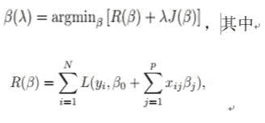

# 网易 2018 校园招聘算法工程师（有道事业部）笔试卷

## 1

以下集合是凸集的是

正确答案: A   你的答案: 空 (错误)

```cpp
{(x,y) |y=x+1}
```

```cpp
{(x,y) | x 的平方 + y 的平方 = 1}
```

```cpp
{(x,y) | x 的平方 + y 的平方 &gt; 1 }
```

```cpp
{(x,y) |x=1 | y=1 }
```

本题知识点

网易 算法工程师 算法工程师 网易 2018

## 2

以下关于 Linear discriminant analysis（LDA）说法错误的是;

正确答案: B   你的答案: 空 (错误)

```cpp
LDA 假设每个类别的密度分布为高斯分布
```

```cpp
LDA 假设每个类之间的协方差矩阵都是对角阵
```

```cpp
LDA 假设每个类之间的协方差矩阵都相同
```

```cpp
LDA 的分界面为线性的
```

本题知识点

网易 算法工程师 算法工程师 网易 2018

## 3

在以下示意图中， 交集部分可以表示哪个统计量

 

正确答案: C   你的答案: 空 (错误)

```cpp
联合熵
```

```cpp
条件熵
```

```cpp
互信息
```

```cpp
交叉熵
```

本题知识点

网易 算法工程师 2018

## 4

假定β参数预估满足如下式子：
且 R，J 函数满足

1. R 是β的二次函数或者分段线性函数

2\. J 是β的分段线性函数

则β(λ) 的预估值为：

正确答案: B   你的答案: 空 (错误)

```cpp
二次函数
```

```cpp
分段线性函数
```

```cpp
线性函数
```

```cpp
常数
```

本题知识点

网易 算法工程师 算法工程师 网易 2018

## 5

以下哪个是 lasso 对于参数的作用效果

正确答案: C   你的答案: 空 (错误)

本题知识点

网易 算法工程师 算法工程师 网易 2018

## 6

关于 linux 中 shell 变量$,下面那个说法是错误的?

正确答案: C   你的答案: 空 (错误)

```cpp
$0 是脚本本身的名字
```

```cpp
$@ 是传给脚本的所有参数的列表
```

```cpp
$1 是传递给该 shell 脚本的第二个参数
```

```cpp
$$ 是脚本运行的当前进程 ID 号
```

本题知识点

网易 算法工程师 算法工程师 网易 2018

讨论

[请叫我吃货！](https://www.nowcoder.com/profile/418720)

```cpp
C
$1 第一个参数
```

发表于 2018-07-24 20:54:04

* * *

## 7

Linux 进程内存空间有以下几个部分:

> 1.stack 2.heap3.bss segment4.code segment/text segment5.data segment

它们从高地址到低地址的分布顺序为()

正确答案: B   你的答案: 空 (错误)

```cpp
45321
```

```cpp
12354
```

```cpp
45312
```

```cpp
21354
```

本题知识点

网易 算法工程师 算法工程师 网易 2018

## 8

有一个数组,元素为 70,10,40,30,190,100,130,160,90,80,将它进行堆排序,当刚刚建成大根堆时,它
所对应二叉树的前序遍历是多少?

正确答案: C   你的答案: 空 (错误)

```cpp
190,160,130,100,90,80,70,40,30,10
```

```cpp
30,90,70,160,10,80,190,100,130,40
```

```cpp
190,160,90,30,70,80,10,130,100,40
```

```cpp
30,70,90,10,80,160,100,40,130,190
```

本题知识点

网易 算法工程师 2018

讨论

[零葬](https://www.nowcoder.com/profile/75718849)

其实就是将堆顶的 70 跟最后的 80 进行交换后向下调整

发表于 2022-03-07 11:33:28

* * *

## 9

某表达式的后缀表达式为 AB+CD+/E*，该表达式原型可能为以下哪个?

正确答案: D   你的答案: 空 (错误)

```cpp
A+B/(C+D)*E
```

```cpp
((A+B)/C+D)*E
```

```cpp
(A+B/C+D)*E
```

```cpp
(A+B)/(C+D)*E
```

```cpp
(A+B)*E/(C+D)
```

本题知识点

网易 算法工程师 2018

讨论

[零葬](https://www.nowcoder.com/profile/75718849)

从左往右遍历后缀表达式，A、B 先入栈，遇到符号+，弹出两个元素 A 和 B 进行计算，即计算完 A+B 再压栈；然后压栈 C、D，遇到+号弹栈两个元素 C 和 D 进行计算，将 C+D 压栈，此时栈中为[A+B,C+D]，遇到/，继续弹出两个元素 A+B 和 C+D 进行计算，将(A+B)/(C+D)压栈；将 E 压栈后遇到*，弹出栈中唯一的两个元素(A+B)/(C+D)和 E 计算(A+B)/(C+D)*E，这就是后缀表达式计算的中缀表达式。

编辑于 2022-03-07 11:32:35

* * *

## 10

以下关于无向正权图的最短路和最小生成树的说法正确的有()

正确答案: C   你的答案: 空 (错误)

```cpp
当图的每条边的权值都增加 2 的时候，之前计算的最短路和最小生成树都仍然有效。
```

```cpp
当图的每条边的权值都扩大 2 倍的时候，之前计算的最短路和最小生成树已经失效。
```

```cpp
当图的每条边的权值都增加 2 的时候，之前计算的最小生成树仍然有效。
```

```cpp
当图的每条边的权值都扩大 2 倍的时候，之前计算的最短路已经失效（不再是最短路）。
```

本题知识点

网易 算法工程师 算法工程师 网易 2018

## 11

一个简单无向图有 10 个顶点，11 条边，如果用邻接矩阵来存储它，那么矩阵里面会有多少个 0?

正确答案: D   你的答案: 空 (错误)

```cpp
11
```

```cpp
22
```

```cpp
89
```

```cpp
78
```

```cpp
无法表达
```

本题知识点

网易 算法工程师 算法工程师 网易 2018

讨论

[零葬](https://www.nowcoder.com/profile/75718849)

10 个顶点的图用邻接矩阵存储需要 10*10=100 个格子，11 条无向边需要占用 22 个格子（关于主对角线对称）存储 1，因此零格子有 100-22=78 个

发表于 2022-03-07 11:27:58

* * *

## 12

假设一棵二叉排序树的节点的值均为 10 到 20 的整数，如果在这棵树里查找 15，以下哪个序列是不可能存在的?

正确答案: E   你的答案: 空 (错误)

```cpp
20,19,18,17,16,15
```

```cpp
14,19,18,16,15
```

```cpp
12,13,20,14,18,15
```

```cpp
11,12,19,13,18,17,14,16,15
```

```cpp
12,18,16,13,14,17,15
```

本题知识点

网易 算法工程师 算法工程师 网易 2018

## 13

有一个整数序列(1 到 7):2,3,_*,_*,7,1,5,中间二个数字 4,6 被墨水模糊了，看不清顺序了(不知道到底是 4,6 还是 6,4)，它所构成的二叉排序树 a，对 a 进行中序遍历，结果是()

正确答案: C   你的答案: 空 (错误)

```cpp
7-2-1-4-3-6-5
```

```cpp
1-3-5-2-4-6-7
```

```cpp
1-2-3-4-5-6-7
```

```cpp
5-6-3-4-1-2-7
```

```cpp
不能确定
```

本题知识点

网易 算法工程师 算法工程师 网易 2018

讨论

[零葬](https://www.nowcoder.com/profile/75718849)

不知道这个题干中的序列代表的什么意思，但是二叉搜索树的中序序列是有序的，所以选 C

发表于 2022-03-07 11:25:58

* * *

## 14

下面关于 dynamic_cast 说法错误的有?

正确答案: C   你的答案: 空 (错误)

```cpp
dynamic_cast 在运行期，会检查这个转换是否可能
```

```cpp
dynamic_cast&lt;X&gt;(a)，那么 X 必须是一个指针或者引用
```

```cpp
表达式 dynamic_cast&lt;T*&gt;(a) 将 a 值转换为类型为 T 的对象指针。如果类型 T 不是 a 的某个基类型，该操作将失败抛出 bad_cast 异常
```

```cpp
T1 obj;T2 *pObj = dynamic_cast&lt;T2*&gt;(&amp;obj);被转换对象 obj 的类型 T1 必须是多态类型，即 T1 必须公有继承自其它类，或者 T1 拥有虚函数（继承或自定义）
```

本题知识点

网易 算法工程师 算法工程师 网易 2018

## 15

有如下代码:

```cpp
struct A1
{
    virtual ~A1() {}
};
struct A2
{
    virtual ~A2() {}
};
struct B1 : A1, A2 {};
int main()
{
    B1 d;
    A1* pb1 = &d;
    A2* pb2 = dynamic_cast<A2*>(pb1);  //L1
    A2* pb22 = static_cast<A2*>(pb1);  //L2
    return 0;
}
```

正确答案: B   你的答案: 空 (错误)

```cpp
L1 语句编译失败，L2 语句编译通过
```

```cpp
L1 语句编译通过，L2 语句编译失败
```

```cpp
L1，L2 都编译失败
```

```cpp
L1，L2 都编译通过
```

本题知识点

网易 算法工程师 2018 C++

讨论

[牛客 749768238 号](https://www.nowcoder.com/profile/749768238)

一、static_cast 关键字（编译时类型检查）**直接检查表达式括号里面的类型 pb1 是 A1* 类型，不能转 A2**二、dynamic_cast 关键字（运行时类型检查） **检查表达式指针指向的对象类型。pb1 是 B1 类型，可以转 A2**

发表于 2020-10-09 11:12:14

* * *

[wjunsing](https://www.nowcoder.com/profile/935378)

**1、static_cast 和 dynamic_cast 的区别：   ** 

    1)static_cast          

    1.1)没有虚函数同样可以编译通过;
    1.2)用于非多态类型转换(静态转换)，任何标准转换都可以用它，
    最常用的类型转换符，用于基本数据类型之间的转换，如把 int 转换为 char,
    但是不能用于两个不相关的类型转换。
    1.3)用于类层次结构中基类和派生类之间指针或引用的转换，                             
    上行转换（派生类---基类）是安全的，与 dynamic_cast 效果相同;    
    下行转换（基类---派生类）由于没有动态类型检查，所以是不安全的;   
    1.4) 把空指针转换成目标类型的空指针                
    1.5) 把任何类型的表达式转为 void 类型           
    1.6) static_cast 不能转换掉 expression 的 const、volatile、或者 __unaligned 属性 

```cpp
    int e = 10;  
    const int f = static_cast<const int>(e);//正确，将 int 型数据转换成 const int 型数据  
    const int g = 20;  
    int *h =static_cast<int*>(&g);//编译错误，static_cast 不能转换掉 g 的 const 属性            

```

    2)dynamic_cast     

    2.1)dynamic_cast 只能用于有虚函数的类（必须有共有继承和虚函数)，为运行时转换，由于运行时类型检查需要运行时类型信息，而这个信息存储在类的虚函数表中，只有定义了虚函数的类才有虚函数表，没有定义虚函数的类是没有虚函数表的；        如果父类没有虚函数，编译报错；              
    2.2)用于类层次结构中基类和派生类之间指针或引用的转换, 
        上行转换（派生类--->基类）是安全的，与 static_cast 效果相同;
        下行转换（基类--->派生类）具有类型检查的功能，转型是安全的，
        当类型不一致时，转换过来的是空指针;
    2.3）先检查能否转型成功，能成功则转型，不能成功则返回 0  

    2、static_cast 和 reinterpret_cast 的区别:

    static_cast 不适用于不同指针类型之间的转换, 因为它们是完全不同的两个类型. 
    如果 自己清楚自己在做什么, 通常对于不同指针类型的转换应该使用 reinterpret_cast

编辑于 2021-01-14 09:07:52

* * *

[牛客 580050057 号](https://www.nowcoder.com/profile/580050057)

static_cast 关键字（编译时类型检查）直接检查表达式括号里面的类型 pb1 是 A1*类型，不能转 A2dynamic_cast 关键字（运行时类型检查）检查表达式指针指向的对象类型。pb1 是 B1 类型，可以转 A2

发表于 2021-06-29 15:43:00

* * *

## 16

在页式存储管理中，假设一个程序的存储块数是 3，要访问的页面 id 为 1,2,3,3,2,1,4,3,2,1，并采用 LRU 算法，那么整个过程缺页次数为多少?

正确答案: C   你的答案: 空 (错误)

```cpp
5
```

```cpp
6
```

```cpp
7
```

```cpp
8
```

```cpp
4
```

本题知识点

网易 算法工程师 算法工程师 网易 2018

讨论

[零葬](https://www.nowcoder.com/profile/75718849)

第一次访问 1,2,3 时都没进行页面缓存，所以上来就缺页 3 次，缓存区域为 123；第二次访问 3 时缓存命中不缺页，缓存区不调整；第二次访问 2 时，缓存命中不缺页，缓存区调整为 132（最新访问过的排在最后）；第二次访问 1 时，缓存命中不缺页，缓存区调整为 321；访问 4 时，缺页，缓存区加入 4，并将最久不使用的 key 删除，得到 214,；第三次访问 3 时缺页，缓存区调整为 143，第三次访问 2 时缺页，缓存区调整为 432；第三次访问 1 时还是缺页，缓存区调整为 321，一共缺页 7 次。

编辑于 2022-03-07 11:24:52

* * *

## 17

Belady 现象可能会出现在以下哪个算法中?

正确答案: D   你的答案: 空 (错误)

```cpp
预防死锁算法
```

```cpp
磁盘调度算法
```

```cpp
内存管理算法
```

```cpp
内存换页算法
```

```cpp
进程调度算法
```

本题知识点

网易 算法工程师 算法工程师 网易 2018

## 18

TCP 数据包里的出现什么标志位表示连接被异常终止，或被拒绝的异常请求

正确答案: B   你的答案: 空 (错误)

```cpp
FIN/ACK
```

```cpp
RST/ACK
```

```cpp
SYN
```

```cpp
ACK
```

本题知识点

网易 算法工程师 算法工程师 网易 2018

## 19

魔法王国一共有 n 个城市,编号为 0~n-1 号,n 个城市之间的道路连接起来恰好构成一棵树。
小易现在在 0 号城市,每次行动小易会从当前所在的城市走到与其相邻的一个城市,小易最多能行动 L 次。
如果小易到达过某个城市就视为小易游历过这个城市了,小易现在要制定好的旅游计划使他能游历最多的城市,请你帮他计算一下他最多能游历过多少个城市(注意 0 号城市已经游历了,游历过的城市不重复计算)。

本题知识点

网易 算法工程师 贪心 动态规划 树 2018

讨论

[Huluuu](https://www.nowcoder.com/profile/6198101)

**思路：**如果是 L<=maxLen，那么就直接输出 L； 
如果是 L>maxLen： 
考虑最坏情况，除了最大深度所在的树链（以下用主链表示）之外，其他都在 root 上，那么肯定是考虑先游历除了主链之外的链（因为，主链是最长的，遍历主链并返回到 root，是最浪费步数的），并留给主链 maxLen 的步数，遍历其他链需要其他链的二倍的步数（因为要返回到 root）。 
由于可能 L 巨大，所以如果遍历的点的个数大于 n，取 n。 得：min(n,1+maxLen+(L-maxLen)/2)
**测试用例：**10 10 
0 3 1 3 0 5 2 7 5**代码：**

```cpp
#include<cstdio>
#include<cstring>
#include<cmath>
#include<algorithm>
#include<iostream>

using namespace std;
typedef long long LL;
int parent[60];
int dp[200];
int main()
{
    int n, L;
    scanf_s("%d%d", &n, &L);
    for (int i = 0; i<n - 1; i++)
    {
        scanf_s("%d", &parent[i]);
    }
    int mx = 0;
    for (int i = 0; i<n - 1; i++)
    {
        for (int j = 0; j <= i; j++)
        {
            dp[j + 1] = max(dp[j + 1], dp[parent[j]] + 1);
        }
        mx = max(mx, dp[i + 1]);
    }
    int d = min(L, mx);
    printf("%d\n", min(n, 1 + d + (L - d) / 2));
    return 0;
}
```

编辑于 2018-10-09 15:54:02

* * *

[只有 offer 能让我快乐](https://www.nowcoder.com/profile/3435944)

```cpp
有大佬看下这个为什么一直通过不了吗？看了半天了都没发现问题    
def isSubStructure(self, pRoot1, pRoot2):
        """
        :type A: TreeNode
        :type B: TreeNode
        :rtype: bool
        """
        if not pRoot1 or not pRoot2:
            return False
        def is_sub_tree(tree1, tree2):
            #子结构已经循环完毕，代表全部匹配
            if not tree2:
                return True
            # 大树已经循环完毕，并未成功匹配
            if not tree1:
                return False
            if tree1.val == tree2.val:
                return is_sub_tree(tree1.left, tree2.left) and is_sub_tree(tree1.right, tree2.right)
            return False
        return is_sub_tree(pRoot1, pRoot2) or is_sub_tree(pRoot1.left, pRoot2) or is_sub_tree(pRoot1.right, pRoot2)
```

编辑于 2021-07-25 00:30:57

* * *

[RPGzreo](https://www.nowcoder.com/profile/691654099)

解题思路：
本题的关键点在于判断是否需要走重复的城市，首先我们需要找到树中根节点到叶节点的最长路径长度，也就是树的深度。
不妨设这棵树中根节点的层次为 0，树的深度为 hight，当 L <= hight 时，则只需顺着最长路径一直往下走，即无需重复访问，结果为 L+1(包含根节点，即城市 0)；
当 L > hight 时，为了更多地游历城市，我们应当尽量少重复走，因此留出 hight 步走最长路径，剩余的步数用于走其他的路径(由题意得城市之间是连通的，那么剩余的这些步数便用于从最长路径上的某一城市走出然后返回)，该过程是往返的，理想情况上游历了(L - hight) / 2 个不同的城市，然后再加上最长路径上的城市数量，便是最终结果。

```cpp
//https://blog.csdn.net/RPG_Zero/article/details/99562230 #include<iostream>
#include<algorithm>
using namespace std;
int parent[52];
int dp[52];
int main() {
    int n, l;
    while (cin >> n >> l) {
        for (int i = 1; i <= n - 1; i++) {
            cin >> parent[i];
        }
        dp[0] = 0; int hight = 0;
        for (int i = 1; i <= n - 1; i++) {
            dp[i] = dp[parent[i]] + 1;
            hight = max(hight, dp[i]);//求出树的深度
        }
        if (l <= hight) { cout << l + 1 << endl; }
        else cout << min(n, hight + 1 + (l - hight) / 2);//注意最多也就是把所有的城市都游历完
    }
}
```

编辑于 2019-08-14 14:08:37

* * *

## 20

小 Q 和牛博士合唱一首歌曲,这首歌曲由 n 个音调组成,每个音调由一个正整数表示。
对于每个音调要么由小 Q 演唱要么由牛博士演唱,对于一系列音调演唱的难度等于所有相邻音调变化幅度之和, 例如一个音调序列是 8, 8, 13, 12, 那么它的难度等于|8 - 8| + |13 - 8| + |12 - 13| = 6(其中||表示绝对值)。
现在要对把这 n 个音调分配给小 Q 或牛博士,让他们演唱的难度之和最小,请你算算最小的难度和是多少。
如样例所示: 小 Q 选择演唱{5, 6}难度为 1, 牛博士选择演唱{1, 2, 1}难度为 2,难度之和为 3,这一个是最小难度和的方案了。

本题知识点

网易 算法工程师 动态规划 2018

讨论

[重洋](https://www.nowcoder.com/profile/543034449)

        dp[0][0]=0        dp[1][0]=0        dp[2][0]=dp[1][0]+v[2]-v[1];

        dp[2][1]=dp[2][0];

        dp[3][0]=dp[2][0]+v[3]-v[2];       
        dp[3][1]=dp[2][1]+v[3]-v[2]; 
        //dp[3][2]取下列最小值
        dp[3][2]=dp[0][2];
        dp[3][2]=dp[1][2]+v[3]-v[1];

        //0<=j<=i-2
        dp[4][0]=dp[3][0]+v[4]-v[3];
        dp[4][1]=dp[3][1]+v[4]-v[3];
        dp[4][2]=dp[3][2]+v[4]-v[3];        //j==i-1
        //dp[4][3]取下列最小值
        dp[4][3]=dp[0][3];        
        dp[4][3]=dp[1][3]+v[4]-v[1];
        dp[4][3]=dp[2][3]+v[4]-v[2];

```cpp
import java.util.*;
public class Main {
    public static void main(String[] args) {
        Scanner sc = new Scanner(System.in);
        int n = sc.nextInt();
        int[] v = new int[n+1];
        for(int i=1; i<=n; i++)
            v[i] = sc.nextInt();
        int[][] dp=new int[n+1][n+1];//小 Q 唱到 i，博士唱到 j 的最小难度和，反过来也一样，故矩阵对称

        /*
        dp[2][0]=dp[1][0]+v[2]-v[1];

        dp[2][1]=dp[2][0];

        dp[3][0]=dp[2][0]+v[3]-v[2];       
        dp[3][1]=dp[2][1]+v[3]-v[2]; 

        dp[3][2]=dp[0][2];
        dp[3][2]=dp[1][2]+v[3]-v[1];

        dp[4][0]=dp[3][0]+v[4]-v[3];
        dp[4][1]=dp[3][1]+v[4]-v[3];
        dp[4][2]=dp[3][2]+v[4]-v[3];

        dp[4][3]=dp[0][3];        
        dp[4][3]=dp[1][3]+v[4]-v[1];
        dp[4][3]=dp[2][3]+v[4]-v[2];
        */

        dp[0][0]=0;
        dp[1][0]=0;
        for(int i=2;i<=n;i++)
        {
        	int min=dp[i-1][0];
        	for(int j=0;j<=i-2;j++)
        	{
        		dp[i][j]=dp[i-1][j]+Math.abs(v[i]-v[i-1]);
        		if(j==0)
        			continue;
        		int value=dp[i-1][j]+Math.abs(v[i]-v[j]);
        		min=min<value?min:value;
        	}
        	dp[i][i-1]=min;
        }

        int min=Integer.MAX_VALUE;
        for(int j=0;j<n;j++)
        {
        	int value=dp[n][j];
            min=min<value?min:value;
        }
        System.out.println(min);
    }
}
```

发表于 2019-09-05 23:30:17

* * *

[不聊天🙊](https://www.nowcoder.com/profile/334957443)

1.  #include <bits/stdc++.h>
2.  using namespace std;

4.  const int maxn = 2005;
5.  int dp[maxn][maxn];
6.  int acc[maxn], v[maxn];

8.  int main()
9.  {
10.  int n;
11.  scanf ("%d", &n);
12.  for (int i=0; i<n; i++) {
13.  scanf ("%d", &v[i]);
14.  }
15.  if (n < 3) {
16.  printf ("0\n");
17.  } else {
18.  dp[1][0] = 0;
19.  acc[1] = 0;
20.  for (int i=2; i<n; i++) {
21.  acc[i] = acc[i-1] + abs(v[i-1]-v[i-2]);
22.  dp[i][i-1] = acc[i];
23.  for (int j=0; j<i-1; j++) {
24.  dp[i][j] = dp[i-1][j] + abs(v[i]-v[i-1]);
25.  dp[i][i-1] = min(dp[i][i-1], dp[i-1][j]+abs(v[i]-v[j]));
26.  }
27.  }
28.  int mins = dp[n-1][0];
29.  for (int i=1; i<n-1; i++) {
30.  if (dp[n-1][i] < mins) {
31.  mins = dp[n-1][i];
32.  }
33.  }
34.  printf ("%d", mins);
35.  }
36.  return 0;
37.  }

发表于 2018-08-27 17:23:33

* * *

## 21

小易正在玩一款新出的射击游戏,这个射击游戏在一个二维平面进行,小易在坐标原点(0,0),平面上有 n 只怪物,每个怪物有所在的坐标(x[i], y[i])。小易进行一次射击会把 x 轴和 y 轴上(包含坐标原点)的怪物一次性消灭。
小易是这个游戏的 VIP 玩家,他拥有两项特权操作:
1、让平面内的所有怪物同时向任意同一方向移动任意同一距离
2、让平面内的所有怪物同时对于小易(0,0)旋转任意同一角度
小易要进行一次射击。小易在进行射击前,可以使用这两项特权操作任意次。
小易想知道在他射击的时候最多可以同时消灭多少只怪物,请你帮帮小易。如样例所示:
所有点对于坐标原点(0,0)顺时针或者逆时针旋转 45°,可以让所有点都在坐标轴上,所以 5 个怪物都可以消灭。

本题知识点

网易 算法工程师 模拟 数学 穷举 2018

讨论

[重洋](https://www.nowcoder.com/profile/543034449)

```cpp
import java.util.*;
public class Main {

    public static void main(String[] args) {
        Scanner sc = new Scanner(System.in);
        int n = sc.nextInt();

        int[] x = new int[n];
        int[] y = new int[n];
        for(int i=0; i<n; i++)
            x[i] = sc.nextInt();
        for(int i=0; i<n; i++)
            y[i] = sc.nextInt();

        if(n<=3)
        {
            System.out.println(n);
            return;
        }

        int max=0;
        for(int i=0;i<n;i++)
            for(int j=i+1;j<n;j++)
                for(int k=0;k<n;k++)
                {
                	if(k==i || k==j)
                		continue;
                    int count=0;
                    //k=A，l=B，若 l 在 k 代表的 Y 轴上，则 k=B 时，仍在此 Y 轴上，总 count 不变，不计算 l=A 也可，反正不会更大； 
                    //若 l 不在 k 代表的 Y 轴上，则不关于 Y 轴计数，等到 k=B 时，l=A 也就不在 Y 轴上，不关于 Y 轴计数，故不必向前考虑
                                        //for(int l=0;l<n;l++) 不影响结果
                                        for(int l=k+1;l<n;l++)
                    {
                    	if(l==i || l==j || l==k)
                    		continue;
                        if((y[i]-y[j])*(x[i]-x[l])==(y[i]-y[l])*(x[i]-x[j]))
                            count++;
                        else if((x[i]-x[j])*(x[k]-x[l])==-(y[k]-y[l])*(y[i]-y[j]))
                            count++;
                    }
                    max=max>count?max:count;
                }
        System.out.println(max+3);
    }
}

```

编辑于 2019-09-05 21:33:34

* * *

## 22

有一个地区有 2 个市，一个来自 A 市的概率是 20%，B 市的是 80%，A 市得病的概率是 2%，B 市得病的概率是 3%，现在有一个病人，问是 A 市的概率是？

正确答案: C   你的答案: 空 (错误)

```cpp
1/6
```

```cpp
1/3
```

```cpp
1/7
```

```cpp
1/14
```

本题知识点

网易 算法工程师 2018

讨论

[零葬](https://www.nowcoder.com/profile/75718849)

条件概率，本题要求的是，根据贝叶斯公式：  依题意，，，，，代入贝叶斯公式得：

编辑于 2022-03-07 11:16:26

* * *

## 23

随机地掷一骰子两次，则两次出现的点数之和等于 8 的概率为：

正确答案: C   你的答案: 空 (错误)

```cpp
3/36
```

```cpp
4/36
```

```cpp
5/36
```

```cpp
2/36
```

本题知识点

网易 算法工程师 2018

讨论

[零葬](https://www.nowcoder.com/profile/75718849)

古典概型：每个骰子能产生 6 个结果，因此两个骰子一共能够产生 6*6=36 个基本事件，而点数之和等于 8 有如下的五个基本事件：(2,6)，(6,2)，(3,5)，(5,3)，(4,4)，因此点数之和为 8 的概率为 5/36

发表于 2022-03-07 11:18:59

* * *