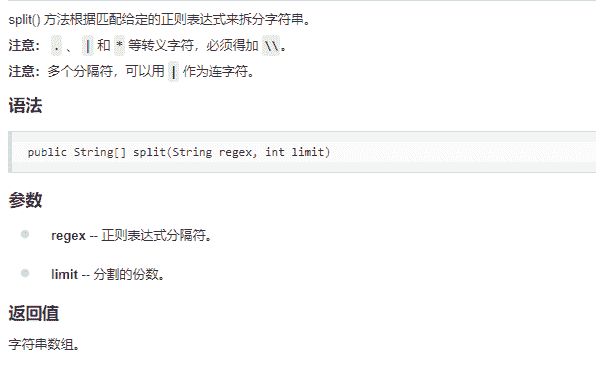

# 网易 2018 校招开发工程师（北京）笔试卷

## 1

以下哪个问题用贪心算法求解无法得到最优解（）

正确答案: C   你的答案: 空 (错误)

```cpp
霍夫曼编码问题
```

```cpp
单源最短路径问题
```

```cpp
0-1 背包问题
```

```cpp
最小生成树问题
```

本题知识点

网易 Java 工程师 C++工程师 iOS 工程师 安卓工程师 运维工程师 前端工程师 算法工程师 PHP 工程师 C++工程师 Java 工程师 网易 2018

讨论

[寂寞包邮](https://www.nowcoder.com/profile/7193579)

贪心算法思想：

顾名思义，贪心算法总是作出在当前看来最好的选择。也就是说贪心算法并不从整体最优考虑，它所作出的选择只是在某种意义上的局部最优选择。当然，希望贪心算法得到的最终结果也是整体最优的。虽然贪心算法不能对所有问题都得到整体最优解，但对许多问题它能产生整体最优解。如单源最短路经问题，最小生成树问题等。在一些情况下，即使贪心算法不能得到整体最优解，其最终结果却是最优解的很好近似。

贪心算法的基本思路：

从问题的某一个初始解出发逐步逼近给定的目标，以尽可能快的地求得更好的解。当达到算法中的某一步不能再继续前进时，算法停止。

该算法存在问题：

1\. 不能保证求得的最后解是最佳的；

2\. 不能用来求最大或最小解问题；

3\. 只能求满足某些约束条件的可行解的范围。作者：小小沸沸要加油
链接：[`www.nowcoder.com/discuss/3574`](https://www.nowcoder.com/discuss/3574)
来源：牛客网

```cpp
0-1 背包问题
```

问题描述：

    现有 n 件物品和一个容量为 c 的背包。第 i 件物品的重量是重量为 w[i]，价值是 v[i]。已知对于一件物品必须选择取（用 1 表示）或者不取（用 0 表示），且每件物品只能被取一次（这就是“0-1”的含义）。求放置哪些物品进背包，可使这些物品的重量总和不超过背包容量，且价值总和最大。

发表于 2018-07-07 11:02:27

* * *

## 2

当需要查看当前系统所有 TCP 网络连接，端口占用情况时，可以使用

正确答案: D   你的答案: 空 (错误)

```cpp
ps aux
```

```cpp
netstat -ntlp
```

```cpp
netstat -ntulp
```

```cpp
ss -antlp
```

本题知识点

网易 Java 工程师 C++工程师 iOS 工程师 安卓工程师 运维工程师 前端工程师 算法工程师 PHP 工程师 C++工程师 Java 工程师 网易 2018

讨论

[向阳 ustb](https://www.nowcoder.com/profile/5616877)

ss(Socket Statistics 的缩写)命令可以用来获取 socket 统计信息，此命令输出的结果类似于 netstat 输出的内容，但它能显示更多更详细的 TCP 连接状态的信息，且比 netstat 更快速高效。

发表于 2019-03-30 23:20:25

* * *

## 3

将当前命令 sh test.sh 任务在后台执行，下列最优雅的的做法是

正确答案: C   你的答案: 空 (错误)

```cpp
sh test.sh &amp;
```

```cpp
nohup sh test.sh
```

```cpp
nohup sh test.sh &amp;
```

```cpp
nohup sh test.sh &amp;&amp;
```

本题知识点

网易 Java 工程师 C++工程师 iOS 工程师 安卓工程师 运维工程师 前端工程师 算法工程师 PHP 工程师 C++工程师 Java 工程师 网易 2018

## 4

linux 查看系统 IP 地址以及网卡流量可以使用以下哪个命令

正确答案: B   你的答案: 空 (错误)

```cpp
ipconfig
```

```cpp
ifconfig
```

```cpp
netstat
```

```cpp
ss
```

本题知识点

网易 Java 工程师 C++工程师 iOS 工程师 安卓工程师 运维工程师 前端工程师 算法工程师 PHP 工程师 2018

## 5

有时候因为磁盘空间快满了，我们需要删除一些 log 文件，但是忘记停止程序了，日志删除后，发现磁盘空间并没有释放，这时候我们通常使用以下哪种方式查找已删除文件的进程占用

正确答案: B   你的答案: 空 (错误)

```cpp
ps
```

```cpp
lsof
```

```cpp
top
```

```cpp
df
```

本题知识点

网易 Java 工程师 C++工程师 iOS 工程师 安卓工程师 运维工程师 前端工程师 算法工程师 PHP 工程师 C++工程师 Java 工程师 网易 2018

讨论

[向阳 ustb](https://www.nowcoder.com/profile/5616877)

lsof(list open files)是一个列出当前系统打开文件的工具。

lsof 使用实例
查找谁在使用文件系统
恢复删除的文件

发表于 2019-03-30 23:23:38

* * *

## 6

以下关于 ACID 说法正确的是？

正确答案: A   你的答案: 空 (错误)

```cpp
A 表示原子性，要么全部执行，要么全部不执行，不会存在部分执行
```

```cpp
C 表示完整性，是数据操作前后的约束
```

```cpp
I 表示读写操作的隔离性
```

```cpp
D 表示持久性，一旦事务提交，则其所做的修改不会发生变化
```

本题知识点

网易 Java 工程师 C++工程师 iOS 工程师 安卓工程师 运维工程师 前端工程师 算法工程师 PHP 工程师 C++工程师 Java 工程师 网易 2018

讨论

[hellogy1](https://www.nowcoder.com/profile/9346730)

Atomicity

原子性体现在对于一个事务来讲，要么一起执行成功要么一起失败，执行的过程中是不能被打断或者执行其他操作的。

Consistency

一致性表现为事务进行过后和执行前，整体系统都是稳定的，比如对于入账出账操作是不会有总资金的变化的。

Isolation

隔离性表示各个事务之间不会互相影响，数据库一般会提供多种级别的隔离。实际上多个事务是并发执行的，但是他们之间不会互相影响。

Durability

持久性表示一旦一个事务成功了，那么他的改变是永久性的被记录和操作。

发表于 2018-08-07 16:55:28

* * *

## 7

对于 SQL 语句 select * from t where a=100 and b=200，哪个索引可以使用到？

正确答案: D   你的答案: 空 (错误)

```cpp
索引 idx_b(b)
```

```cpp
索引 idx_b_a(b,a)
```

```cpp
索引 idx_a_b(a,b)
```

```cpp
都可以
```

本题知识点

网易 Java 工程师 C++工程师 iOS 工程师 安卓工程师 运维工程师 前端工程师 算法工程师 PHP 工程师 C++工程师 Java 工程师 网易 2018

## 8

以下不是 SQL 的聚集操作函数的是？

正确答案: A   你的答案: 空 (错误)

```cpp
HAVING
```

```cpp
SUM
```

```cpp
MAX
```

```cpp
COUNT
```

本题知识点

网易 Java 工程师 C++工程师 iOS 工程师 安卓工程师 运维工程师 前端工程师 算法工程师 PHP 工程师 C++工程师 Java 工程师 网易 2018

## 9

若要在员工信息表 EMP 中增加一列 WANGYI_NO（网易 id），可用（ ）。

正确答案: C   你的答案: 空 (错误)

```cpp
ADD TABLE EMP（WANGYI_NO CHAR（10））
```

```cpp
ADD TABLE EMP ALTER（WANGYI_NO CHAR（10））
```

```cpp
ALTER TABLE EMP ADD（WANGYI_NO CHAR（10））
```

```cpp
ALTER TABLE EMP （ADD WANGYI_NO CHAR（10））
```

本题知识点

网易 Java 工程师 C++工程师 iOS 工程师 安卓工程师 运维工程师 前端工程师 算法工程师 PHP 工程师 2018

## 10

小易为了向他的父母表现他已经长大独立了,他决定搬出去自己居住一段时间。一个人生活增加了许多花费: 小易每天必须吃一个水果并且需要每天支付 x 元的房屋租金。当前小易手中已经有 f 个水果和 d 元钱,小易也能去商店购买一些水果,商店每个水果售卖 p 元。小易为了表现他独立生活的能力,希望能独立生活的时间越长越好,小易希望你来帮他计算一下他最多能独立生活多少天。

本题知识点

网易 Java 工程师 C++工程师 iOS 工程师 安卓工程师 运维工程师 前端工程师 算法工程师 PHP 工程师 模拟 数学 贪心 2018

## 11

小易将 n 个棋子摆放在一张无限大的棋盘上。第 i 个棋子放在第 x[i]行 y[i]列。同一个格子允许放置多个棋子。每一次操作小易可以把一个棋子拿起并将其移动到原格子的上、下、左、右的任意一个格子中。小易想知道要让棋盘上出现有一个格子中至少有 i(1 ≤ i ≤ n)个棋子所需要的最少操作次数.

本题知识点

网易 Java 工程师 C++工程师 iOS 工程师 安卓工程师 运维工程师 前端工程师 算法工程师 PHP 工程师 模拟 2018

## 12

小易老师是非常严厉的,它会要求所有学生在进入教室前都排成一列,并且他要求学生按照身高不递减的顺序排列。有一次,n 个学生在列队的时候,小易老师正好去卫生间了。学生们终于有机会反击了,于是学生们决定来一次疯狂的队列,他们定义一个队列的疯狂值为每对相邻排列学生身高差的绝对值总和。由于按照身高顺序排列的队列的疯狂值是最小的,他们当然决定按照疯狂值最大的顺序来进行列队。现在给出 n 个学生的身高,请计算出这些学生列队的最大可能的疯狂值。小易老师回来一定会气得半死。

本题知识点

网易 Java 工程师 C++工程师 iOS 工程师 安卓工程师 运维工程师 前端工程师 算法工程师 PHP 工程师 贪心 数学 2018

## 13

Java 是一门面向对象的编程语言，下面关键字中能够表示 Java 面向对象的特性是（）

正确答案: A   你的答案: 空 (错误)

```cpp
extends, interface
```

```cpp
volatite, implements
```

```cpp
abstract, interface
```

```cpp
static, void
```

本题知识点

网易 Java 工程师 C++工程师 iOS 工程师 安卓工程师 运维工程师 前端工程师 算法工程师 PHP 工程师 C++工程师 Java 工程师 网易 2018

讨论

[我是如此相信](https://www.nowcoder.com/profile/7988004)

封装 继承 多态中的继承？

发表于 2019-02-15 15:08:15

* * *

## 14

定义字符串 String str = “用户 1|用户 2|用户 3|用户 4”，现在想要对字符串根据字符“|”进行分割解析，下面哪种分割方式是正确的？（）

正确答案: C   你的答案: 空 (错误)

```cpp
str.split(&ldquo;\|&rdquo;)
```

```cpp
str.split(&ldquo;|&rdquo;)
```

```cpp
str.split(&ldquo;\\|&rdquo;)
```

```cpp
str.split(&ldquo;\\\|&rdquo;)
```

本题知识点

网易 Java 工程师 C++工程师 iOS 工程师 安卓工程师 运维工程师 前端工程师 算法工程师 PHP 工程师 C++工程师 Java 工程师 网易 2018

讨论

[hellogy1](https://www.nowcoder.com/profile/9346730)



发表于 2018-08-07 16:52:49

* * *

## 15

在编程中我们经常需要做一些数据过滤或校验，为了能够精确且方便的匹配数据，可以使用 Java 的正则表达式。现有如下正则表达式：
"^((13[0-9])|(15[⁴])|(18[0-9])|(17[0-8]))\d{8}$"
请问下面哪个值能够被正确匹配？（）

正确答案: B   你的答案: 空 (错误)

```cpp
182217265233
```

```cpp
13855112578
```

```cpp
15417850808
```

```cpp
16808808888
```

本题知识点

网易 Java 工程师 C++工程师 iOS 工程师 安卓工程师 运维工程师 前端工程师 算法工程师 PHP 工程师 C++工程师 Java 工程师 网易 2018

讨论

[我是如此相信](https://www.nowcoder.com/profile/7988004)

[a-zA-Z]从 a 到 z 或从 A 到 Z 的任意字符

[^abc]除了 a、b 和 c 之外的任意字符

X|Y：X 或 Y

XY：Y 跟在 X 后面

(X):组

^：一行的起始

$：一行的结束

\d：数字[0-9]

X{n}恰好 n 次 X

发表于 2019-02-15 17:03:58

* * *

## 16

现在一个抽象类中定义一个方法如下：
public abstract void getUserInfo(String userId, int age);
下面哪个选项不是该方法的重载？（）

正确答案: C   你的答案: 空 (错误)

```cpp
public  abstract  void  getUserInfo(String userId, String name);
```

```cpp
public  abstract  int   getUserInfo(int age, String userId);
```

```cpp
public  abstract  void  getUserInfo(String  name,  int sex);
```

```cpp
public  abstract  void  getUserInfo(String userId, int age,  int sex);
```

本题知识点

网易 Java 工程师 C++工程师 iOS 工程师 安卓工程师 运维工程师 前端工程师 算法工程师 PHP 工程师 C++工程师 Java 工程师 网易 2018

讨论

[OFFERNeeder](https://www.nowcoder.com/profile/5753982)

返回类型不同也能构成重载？？

发表于 2018-08-11 08:52:52

* * *

## 17

如果希望在网络中通过某个类的对象包装数据进行传输，那么这个类需要实现下面哪个接口？（）

正确答案: C   你的答案: 空 (错误)

```cpp
Cloneable
```

```cpp
Comparable
```

```cpp
Serializable
```

```cpp
Runnable
```

本题知识点

网易 Java 工程师 C++工程师 iOS 工程师 安卓工程师 运维工程师 前端工程师 算法工程师 PHP 工程师 C++工程师 Java 工程师 网易 2018

## 18

在多线程编程中我们常常需要考虑到线程安全性，那么在 java 集合中，下面哪些是属于多线程安全的的集合类？（）

正确答案: C   你的答案: 空 (错误)

```cpp
HashMap,  Vector
```

```cpp
LinkedList,  LinkedHashMap
```

```cpp
CurrentHashMap,  Vector
```

```cpp
ArrayList, LinkedHashMap
```

本题知识点

网易 Java 工程师 C++工程师 iOS 工程师 安卓工程师 运维工程师 前端工程师 算法工程师 PHP 工程师 C++工程师 Java 工程师 网易 2018

## 19

定义如下程序：

```cpp
public static void main(String[] args){
    Double x=1.2;  
    long l = 1.2;  
    float f =  x/l;
    System.out.println(f);
}
```

程序执行结果是？ （）

正确答案: D   你的答案: 空 (错误)

```cpp
1
```

```cpp
1f
```

```cpp
运行报错
```

```cpp
编译报错
```

本题知识点

网易 Java 工程师 C++工程师 iOS 工程师 安卓工程师 运维工程师 前端工程师 算法工程师 PHP 工程师 2018

## 20

String 类是 java 中最常用的类之一，现有如下程序：

```cpp
public static void main(String[] args){
    String  s1 = “s1”;
    String  s2 = new String (“s2”);
    String  s3 = new String(“s3”);
    System.out.println(s1 + s2 + s3);
}
```

上面方法一共创建了几个对象？（）

正确答案: A   你的答案: 空 (错误)

```cpp
4 个
```

```cpp
5 个
```

```cpp
6 个
```

```cpp
7 个
```

本题知识点

网易 Java 工程师 C++工程师 iOS 工程师 安卓工程师 运维工程师 前端工程师 算法工程师 PHP 工程师 2018

讨论

[满脑子程序](https://www.nowcoder.com/profile/1808110)

不够应该改为多少个字符串对象，因为打印的时候相加时还创建了 StringBuilder 对象

发表于 2018-08-09 16:58:13

* * *

[CharmsGraker](https://www.nowcoder.com/profile/671970057)

StringBuilder 的 toString 不会创建新对象吗 QAQ

发表于 2022-03-14 23:45:37

* * *

[脆脆面面](https://www.nowcoder.com/profile/111186171)

String s1 = "s1" 有一个对象
String s2=new String("s2") 有两个对象
String s3=new String("s3") 有两个对象
啊？不应该有 5 个吗？

发表于 2021-04-03 09:30:06

* * *

## 21

定义如下程序：

```cpp
Public static void main(String[] args){
    String str1 = “ABCDEFG”;
    System.out.println(str1.substring(2,5));
}
```

程序输出结果是：（）

正确答案: B   你的答案: 空 (错误)

```cpp
&rdquo;BCDE&rdquo;
```

```cpp
&ldquo;CDE&rdquo;
```

```cpp
&ldquo;CDEF&rdquo;
```

```cpp
&ldquo;BCD&rdquo;
```

本题知识点

网易 Java 工程师 C++工程师 iOS 工程师 安卓工程师 运维工程师 前端工程师 算法工程师 PHP 工程师 2018

## 22

下列代码的时间复杂度是多少()(^符号是幂的意思)

```cpp
int func(int N)
{
    int cnt = 0;
    for(int i=1;i<=N;i++)
        for(int j=1;j<=N;j+=i)
            cnt+=(i+j);
    return cnt;
}
```

正确答案: B   你的答案: 空 (错误)

```cpp
O(N)
```

```cpp
O(NlogN)
```

```cpp
O(N¹.5)
```

```cpp
O(N²)
```

本题知识点

网易 Java 工程师 C++工程师 iOS 工程师 安卓工程师 运维工程师 前端工程师 算法工程师 PHP 工程师 2018

## 23

假如 N 是由一棵有序树 T 转换而来的二叉树，那么 T 中的节点的后序遍历顺序是 N 节点的()

正确答案: B   你的答案: 空 (错误)

```cpp
先序遍历
```

```cpp
中序遍历
```

```cpp
后序遍历
```

```cpp
层次遍历
```

本题知识点

网易 Java 工程师 C++工程师 iOS 工程师 安卓工程师 运维工程师 前端工程师 算法工程师 PHP 工程师 2018

讨论

[寂寞包邮](https://www.nowcoder.com/profile/7193579)

如果 T2 是由有序树 T 转换而来的二叉树,那么 T 中结点的前序就是 T2 中结点的前序,T 中结点的后序就是 T2 中结点的中序 就这 2 句话 记得就行

发表于 2018-07-07 11:24:07

* * *