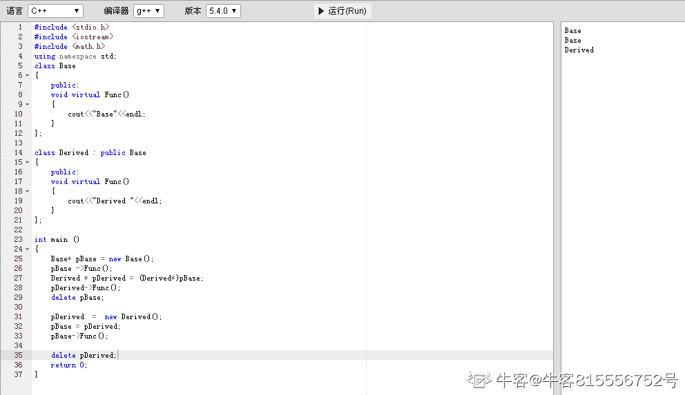
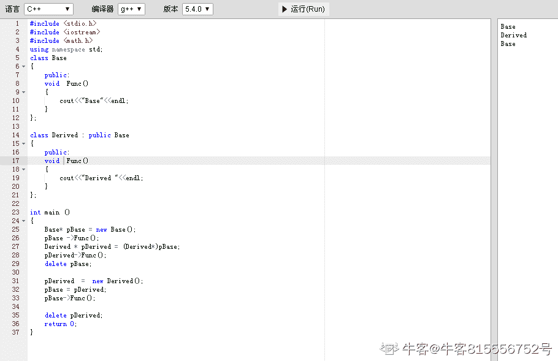

# 网易 2018 校招研发工程师（有道事业部）笔试卷

## 1

下述有关虚函数和纯虚函数说法错误的是？

正确答案: C   你的答案: 空 (错误)

```cpp
被 virtual 关键字修饰的成员函数，就是虚函数
```

```cpp
在基类中实现纯虚函数的方法是在函数原型后加&ldquo;=0&rdquo; virtual void funtion1()=0
```

```cpp
同时含有纯虚拟函数的类称为抽象类，它可以被实例化，但是对象不可以调用纯虚函数
```

```cpp
使用纯虚函数的意义是在很多情况下，基类本身生成对象是不合情理的
```

本题知识点

网易 Java 工程师 C++工程师 iOS 工程师 安卓工程师 运维工程师 前端工程师 算法工程师 PHP 工程师 C++工程师 Java 工程师 网易 2018

## 2

下面程序的功能是输出数组的全排列,选择正确的选项,完成其功能。

```cpp
void perm(int list[], int k, int m)
{
    if (    )
    {
        copy(list,list+m,ostream_iterator<int>(cout," "));
        cout<<endl;
        return;
    }
    for (int i=k; i<=m; i++)
    {
        swap(&list[k],&list[i]);
        (    );
        swap(&list[k],&list[i]);
    }
}
```

正确答案: B   你的答案: 空 (错误)

```cpp
k!=m 和 perm（list，k+1，m）
```

```cpp
k==m 和 perm（list，k+1，m）
```

```cpp
k!=m 和 perm（list，k，m）
```

```cpp
k==m 和 perm（list，k，m）
```

本题知识点

网易 Java 工程师 C++工程师 iOS 工程师 安卓工程师 运维工程师 前端工程师 算法工程师 PHP 工程师 2018

## 3

将一个整数序列整理为升序，两趟处理后序列变为 10,12,21,9,7,3,4,25，则采用的排序算法可能是 ________。

正确答案: A   你的答案: 空 (错误)

```cpp
插入排序
```

```cpp
选择排序
```

```cpp
快速排序
```

```cpp
堆排序
```

本题知识点

网易 Java 工程师 C++工程师 iOS 工程师 安卓工程师 运维工程师 前端工程师 算法工程师 PHP 工程师 C++工程师 Java 工程师 网易 2018

## 4

当需要查看当前系统所有 TCP 网络连接，端口占用情况时，可以使用

正确答案: D   你的答案: 空 (错误)

```cpp
ps aux
```

```cpp
netstat -ntlp
```

```cpp
netstat -ntulp
```

```cpp
ss -antlp
```

本题知识点

网易 Java 工程师 C++工程师 iOS 工程师 安卓工程师 运维工程师 前端工程师 算法工程师 PHP 工程师 C++工程师 Java 工程师 网易 2018

## 5

将当前命令 sh test.sh 任务在后台执行，下列最优雅的的做法是

正确答案: C   你的答案: 空 (错误)

```cpp
sh test.sh &amp;
```

```cpp
nohup sh test.sh
```

```cpp
nohup sh test.sh &amp;
```

```cpp
nohup sh test.sh &amp;&amp;
```

本题知识点

网易 Java 工程师 C++工程师 iOS 工程师 安卓工程师 运维工程师 前端工程师 算法工程师 PHP 工程师 2018

## 6

截取 logfile 文件中含有 suc 的行，并且只输出最后一列，下列操作正确的是:

正确答案: C   你的答案: 空 (错误)

```cpp
grep -o 'suc' logfile | awk '{print $0}'
```

```cpp
grep 'suc' logfile | awk '{print $0}'
```

```cpp
grep 'suc' logfile | awk '{print $NF}'
```

```cpp
grep -o 'suc' logfile | awk '{print $NF}'
```

本题知识点

网易 Java 工程师 C++工程师 iOS 工程师 安卓工程师 运维工程师 前端工程师 算法工程师 PHP 工程师 C++工程师 Java 工程师 网易 2018

讨论

[祈求 offer](https://www.nowcoder.com/profile/894067753)

```cpp
-o 只输出文件中匹配到的部分
```

发表于 2020-08-08 09:49:02

* * *

## 7

以下关于 ACID 说法正确的是？

正确答案: A   你的答案: 空 (错误)

```cpp
A 表示原子性，要么全部执行，要么全部不执行，不会存在部分执行
```

```cpp
C 表示完整性，是数据操作前后的约束
```

```cpp
I 表示读写操作的隔离性
```

```cpp
D 表示持久性，一旦事务提交，则其所做的修改不会发生变化
```

本题知识点

网易 Java 工程师 C++工程师 iOS 工程师 安卓工程师 运维工程师 前端工程师 算法工程师 PHP 工程师 C++工程师 Java 工程师 网易 2018

讨论

[横扫 offer~](https://www.nowcoder.com/profile/979643583)

事务是由一组 SQL 语句组成的逻辑处理单元，事务具有以下 4 个属性，通常简称为事务的 ACID 属性。
ACID 是 Atomic（原子性）
Consistency（一致性）
Isolation（隔离性）
Durability（持久性）
Atomic（原子性）：指整个数据库事务是不可分割的工作单位。只有使据库中所有的操作执行成功，才算整个事务成功；事务中任何一个 SQL 语句执行失败，那么已经执行成功的 SQL 语句也必须撤销，数据库状态应该退回到执行事务前的状态。
Consistency（一致性）：指数据库事务不能破坏关系数据的完整性以及业务逻辑上的一致性。例如对银行转帐事务，不管事务成功还是失败，应该保证事务结束后 ACCOUNTS 表中 Tom 和 Jack 的存款总额为 2000 元。
Isolation（隔离性）：指的是在并发环境中，当不同的事务同时操纵相同的数据时，每个事务都有各自的完整数据空间。
Durability（持久性）：指的是只要事务成功结束，它对数据库所做的更新就必须永久保存下来。即使发生系统崩溃，重新启动数据库系统后，数据库还能恢复到事务成功结束时的状态。

发表于 2019-08-02 16:06:26

* * *

## 8

对于 SQL 语句 select * from t where a=100 and b=200，哪个索引可以使用到？

正确答案: D   你的答案: 空 (错误)

```cpp
索引 idx_b(b)
```

```cpp
索引 idx_b_a(b,a)
```

```cpp
索引 idx_a_b(a,b)
```

```cpp
都可以
```

本题知识点

网易 Java 工程师 C++工程师 iOS 工程师 安卓工程师 运维工程师 前端工程师 算法工程师 PHP 工程师 C++工程师 Java 工程师 网易 2018

## 9

关于 Android 广播,下列说法错误的是

正确答案: D   你的答案: 空 (错误)

```cpp
广播的注册分静态注册和动态注册
```

```cpp
广播分为一般广播 sendBroadcast,有序广播 sendOrderBroadcast,和粘性广播 sendStickyBroadcast.
```

```cpp
LocalBroadcastManager 是本地广播,发送的广播只有本 APP 会接收到,其他 APP 的广播无法到达通过 LocalBroadcastManager 注册的 Receiver 中
```

```cpp
无法禁止其他 app 的广播到达自己的 broadcastReceiver 中
```

本题知识点

网易 Java 工程师 C++工程师 iOS 工程师 安卓工程师 运维工程师 前端工程师 算法工程师 PHP 工程师 C++工程师 Java 工程师 网易 2018

## 10

以下输出正确的是（ ）

```cpp
#include <iostream>
using namespace std;

class Base {
public:
    void virtual Func() {
        cout << "Base" << endl;
    }
};

class Derived : public Base {
public:
    void virtual Func() {
        cout << "Derived " << endl;
    }
};

int main() {
    Base* pBase = new Base();
    pBase->Func();
    Derived* pDerived = (Derived*)pBase;
    pDerived->Func();
    delete pBase;

    pDerived = new Derived();
    pBase = pDerived;
    pBase->Func();

    delete pDerived;
    return 0;
}

```

正确答案: B   你的答案: 空 (错误)

```cpp
Base  Derived  Base
```

```cpp
Base  Base  Derived
```

```cpp
Base  Derived  Derived
```

```cpp
Derived Base  Derived
```

本题知识点

网易 Java 工程师 C++工程师 iOS 工程师 安卓工程师 运维工程师 前端工程师 算法工程师 PHP 工程师 2018 C++

讨论

[牛客 174555332 号](https://www.nowcoder.com/profile/174555332)

选 B，13 好理解，对于 2，强制类型转换时会将 Base 类型的数据所在的内存按照 Derived 类型格式解析和转换。pDerived 解析得到的是 pBase 的虚函数表，相当于 pDerived 的 vtbl 虚函数表指针指向了 pBase 的虚函数表，故得到 Base;但这种强制转换比较危险，当访问某虚函数时子类存在而父类不存在时，就可能导致运行时出现访问错误，程序崩溃，而此时编译是正常的，因为指针的虚函数表是动态链接的。

发表于 2020-08-27 16:00:36

* * *

[精通各种语言的 helloworld](https://www.nowcoder.com/profile/815556752)

当函数为虚函数时，子类继承基类会完全覆盖基类虚函数，强制指针类型转换无法改变类内虚函数的函数体；虚函数调用与指针类型无关，基类调用基类虚函数，子类调用子类虚函数；若为普通函数，普通函数同名但未被覆盖，优先匹配与指针类型匹配的同名函数；即 base 类型指针调用 base 内部函数；Derived 类型指针调用 Derived 类内函数；附上运行图

编辑于 2020-10-04 11:38:50

* * *

[油麦小王子](https://www.nowcoder.com/profile/322165592)

BASE 非继承不触发虚函数 BASE 继承，触发虚函数 DERIVED 非继承不触发虚函数

发表于 2020-03-22 16:30:44

* * *

## 11

如果一个 01 串任意两个相邻位置的字符都是不一样的,我们就叫这个 01 串为交错 01 串。例如: "1","10101","0101010"都是交错 01 串。
小易现在有一个 01 串 s,小易想找出一个最长的连续子串,并且这个子串是一个交错 01 串。小易需要你帮帮忙求出最长的这样的子串的长度是多少。

本题知识点

网易 Java 工程师 C++工程师 iOS 工程师 安卓工程师 运维工程师 前端工程师 算法工程师 PHP 工程师 字符串 *2018* *## 12

小易有一个长度为 n 的整数序列,a_1,...,a_n。然后考虑在一个空序列 b 上进行 n 次以下操作:
1、将 a_i 放入 b 序列的末尾
2、逆置 b 序列
小易需要你计算输出操作 n 次之后的 b 序列。

本题知识点

网易 Java 工程师 C++工程师 iOS 工程师 安卓工程师 运维工程师 前端工程师 算法工程师 PHP 工程师 模拟 队列 *2018* *讨论

[线上幽灵 007](https://www.nowcoder.com/profile/4039680)

```cpp

	#include <bits/stdc++.h> 

	using namespace std;

	int main()

	{

	    long long n;

	    cin >> n;

	    vector<long long> res(n);

	    vector<long long> result(n);

	    for(long long i = 0; i < n; ++i)

	        cin >> res[i];

	    long long left = 0;

	    long long right = n - 1;

	    bool flag = true;

	    for(long long i = n - 1; i >= 0; --i)

	    {

	        if(flag)

	        {

	            result[left] = res[i];

	            ++left;

	            flag = false;

	            continue;

	        }

	        else{

	            result[right] = res[i];

	            --right;

	            flag = true;

	            continue;

	        }

	    }

	    for(long long i = 0; i < n -1; ++i)

	        cout << result[i] << " ";

	    cout << result[n-1] << endl;

	    return0;

	}

```

发表于 2018-08-08 19:19:07

* * *

[Wh_BB](https://www.nowcoder.com/profile/4256741)

找规律，从后向前隔一个输出，再顺序输出

```cpp
n = int(raw_input())
l1 = raw_input().split()
l1 = map(int, l1)
for i in range(n-1,-1,-2):
    print l1[i],
    l1[i] = 's'
for i in l1:
    if i != 's':
        print i, 
```

发表于 2018-08-09 22:32:13

* * *

## 13

小易老师是非常严厉的,它会要求所有学生在进入教室前都排成一列,并且他要求学生按照身高不递减的顺序排列。有一次,n 个学生在列队的时候,小易老师正好去卫生间了。学生们终于有机会反击了,于是学生们决定来一次疯狂的队列,他们定义一个队列的疯狂值为每对相邻排列学生身高差的绝对值总和。由于按照身高顺序排列的队列的疯狂值是最小的,他们当然决定按照疯狂值最大的顺序来进行列队。现在给出 n 个学生的身高,请计算出这些学生列队的最大可能的疯狂值。小易老师回来一定会气得半死。

本题知识点

网易 Java 工程师 C++工程师 iOS 工程师 安卓工程师 运维工程师 前端工程师 算法工程师 PHP 工程师 贪心 数学 2018

讨论

[线上幽灵 007](https://www.nowcoder.com/profile/4039680)

```cpp

	#include <bits/stdc++.h>

	using namespace std;

	int main()

	{

	    int n;

	    cin >> n;

	    vector<int> res(n);

	    vector<int> result(n);

	    for(inti = 0; i < n; ++i)

	        cin >> res[i];

	    sort(res.begin(), res.end());

	    int left = 0;

	    int right = n - 1;

	    bool flag = true;

	    for(int i = 1; i < n; ++i)

	    {

	        if(flag)

	        {

	            result[i] = res[left];

	            ++left;

	            flag = false;

	            continue;

	        }

	        else{

	            result[i] = res[right];

	            --right;

	            flag = true;

	            continue;

	        }

	    }

	    result[0] = res[left];

	    int sum = 0;

	    for(int i = 1; i < n; ++i)

	        sum += abs(result[i] - result[i-1]);

	    cout << sum << endl;

	    return0;

	}

```

发表于 2018-08-08 19:20:16

* * *

## 14

定义字符串 String str = “用户 1|用户 2|用户 3|用户 4”，现在想要对字符串根据字符“|”进行分割解析，下面哪种分割方式是正确的？（）

正确答案: C   你的答案: 空 (错误)

```cpp
str.split(&ldquo;\|&rdquo;)
```

```cpp
str.split(&ldquo;|&rdquo;)
```

```cpp
str.split(&ldquo;\\|&rdquo;)
```

```cpp
str.split(&ldquo;\\\|&rdquo;)
```

本题知识点

网易 Java 工程师 C++工程师 iOS 工程师 安卓工程师 运维工程师 前端工程师 算法工程师 PHP 工程师 C++工程师 Java 工程师 网易 2018

## 15

在编程中我们经常需要做一些数据过滤或校验，为了能够精确且方便的匹配数据，可以使用 Java 的正则表达式。现有如下正则表达式：
"^((13[0-9])|(15[⁴])|(18[0-9])|(17[0-8]))\d{8}$"
请问下面哪个值能够被正确匹配？（）

正确答案: B   你的答案: 空 (错误)

```cpp
182217265233
```

```cpp
13855112578
```

```cpp
15417850808
```

```cpp
16808808888
```

本题知识点

网易 Java 工程师 C++工程师 iOS 工程师 安卓工程师 运维工程师 前端工程师 算法工程师 PHP 工程师 C++工程师 Java 工程师 网易 2018

## 16

在多线程编程中我们常常需要考虑到线程安全性，那么在 java 集合中，下面哪些是属于多线程安全的的集合类？（）

正确答案: C   你的答案: 空 (错误)

```cpp
HashMap,  Vector
```

```cpp
LinkedList,  LinkedHashMap
```

```cpp
CurrentHashMap,  Vector
```

```cpp
ArrayList, LinkedHashMap
```

本题知识点

网易 Java 工程师 C++工程师 iOS 工程师 安卓工程师 运维工程师 前端工程师 算法工程师 PHP 工程师 2018

## 17

下面有关 nginx 说法错误的是

正确答案: B   你的答案: 空 (错误)

```cpp
worker_processes 是个主模块指令，指定了 Nginx 要开启的进程数
```

```cpp
nginx.conf 中，一个 sever 作用域中以嵌套多个 http 作用域
```

```cpp
upstream 模块可以通过一个简单的调度算法来实现客户端 IP 到后端服务器的负载均衡
```

```cpp
location 模块支持正则表达式匹配，也支持条件判断匹配
```

本题知识点

网易 Java 工程师 C++工程师 iOS 工程师 安卓工程师 运维工程师 前端工程师 算法工程师 PHP 工程师 2018

讨论

[酣眠](https://www.nowcoder.com/profile/900896106)

B

发表于 2020-03-19 11:46:27

* * *

## 18

下列代码的时间复杂度是多少()(^符号是幂的意思)

```cpp
int func(int N)
{
    int cnt = 0;
    for(int i=1;i<=N;i++)
        for(int j=1;j<=N;j+=i)
            cnt+=(i+j);
    return cnt;
}
```

正确答案: B   你的答案: 空 (错误)

```cpp
O(N)
```

```cpp
O(NlogN)
```

```cpp
O(N¹.5)
```

```cpp
O(N²)
```

本题知识点

网易 Java 工程师 C++工程师 iOS 工程师 安卓工程师 运维工程师 前端工程师 算法工程师 PHP 工程师 C++工程师 Java 工程师 网易 2018

## 19

假如 N 是由一棵有序树 T 转换而来的二叉树，那么 T 中的节点的后序遍历顺序是 N 节点的()

正确答案: B   你的答案: 空 (错误)

```cpp
先序遍历
```

```cpp
中序遍历
```

```cpp
后序遍历
```

```cpp
层次遍历
```

本题知识点

网易 Java 工程师 C++工程师 iOS 工程师 安卓工程师 运维工程师 前端工程师 算法工程师 PHP 工程师 C++工程师 Java 工程师 网易 2018

## 20

在一棵度为 3 的树中，若有 3 个度为 3 的结点，有 5 个度为 2 的结点，则有 ( ) 个度为 0 的结点。

正确答案: D   你的答案: 空 (错误)

```cpp
18
```

```cpp
16
```

```cpp
14
```

```cpp
12
```

本题知识点

网易 Java 工程师 C++工程师 iOS 工程师 安卓工程师 运维工程师 前端工程师 算法工程师 PHP 工程师 2018

讨论

[线上幽灵 007](https://www.nowcoder.com/profile/4039680)

树中结点数等于所有结点度数的和加 13*N3 + 5*N2 + N1 + 1 = N0 + N1 + N2 + N3 已知 N3 = 3，N2 = 5 所以 N0 = 12

发表于 2018-08-08 19:26:49

* * *

## 21

以下哪个子网掩码是合法的

正确答案: C   你的答案: 空 (错误)

```cpp
192.168.255.0
```

```cpp
192.168.248.0
```

```cpp
255.255.248.0
```

```cpp
255.255.1.0
```

本题知识点

网易 Java 工程师 C++工程师 iOS 工程师 安卓工程师 运维工程师 前端工程师 算法工程师 PHP 工程师 2018

讨论

[LeeeeeMOON](https://www.nowcoder.com/profile/879222207)

<网络号，子网号，主机号>，子网号由主机号划分，先子网号，再主机号 A 类地址，网络号：8 位，主机号：24 位 B 类地址，网络号：16 位，主机号：16 位 C 类地址，网络号：24 位，主机号：8 位只有 C 合法，B 类地址，网络号：16 位，子网号：13 位，主机号：3 位

发表于 2020-09-01 11:46:46

* * *

[牛客 955381010 号](https://www.nowcoder.com/profile/955381010)

确认子网掩码是不是合法有效的，这个要把子网掩码转换成二进制，如果转换后全部都是由一连串的 1 和一连串的 0 组成，就说明是合法有效的

发表于 2020-03-18 17:13:53

* * *

## 22

如果一个二叉树的前序遍历结果是 a、b、c，后序遍历结果是 c、b、a， 那么其中序遍历的结果是:

正确答案: D   你的答案: 空 (错误)

```cpp
bac
```

```cpp
acb
```

```cpp
cab
```

```cpp
不确定
```

本题知识点

网易 Java 工程师 C++工程师 iOS 工程师 安卓工程师 运维工程师 前端工程师 算法工程师 PHP 工程师 2018

## 23

在一个请求页式存储管理中，一个程序的页面走向为 4、3、2、1、3、5、4、3、2、1、5，并采用 LUR 算法。设分配给该程序的存储块数 M 分别为 3 和 4，在该访问中发生的缺页次数 F 和缺页率 f 是( )

正确答案: B   你的答案: 空 (错误)

```cpp
①M=3，F=8、f&asymp;67％ ②M=4，F=5、f&asymp;42％
```

```cpp
①M=3，F=10、f=83％ ②M=4，F=8、f&asymp;67％
```

```cpp
①M=3，F=9、f&asymp;75％ ②M=4，F=IO、f&asymp;83％
```

```cpp
①M=3，F=7、f&asymp;58％ ②M=4，F=6、f=50％
```

本题知识点

网易 Java 工程师 C++工程师 iOS 工程师 安卓工程师 运维工程师 前端工程师 算法工程师 PHP 工程师 C++工程师 Java 工程师 网易 2018**