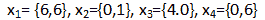
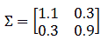
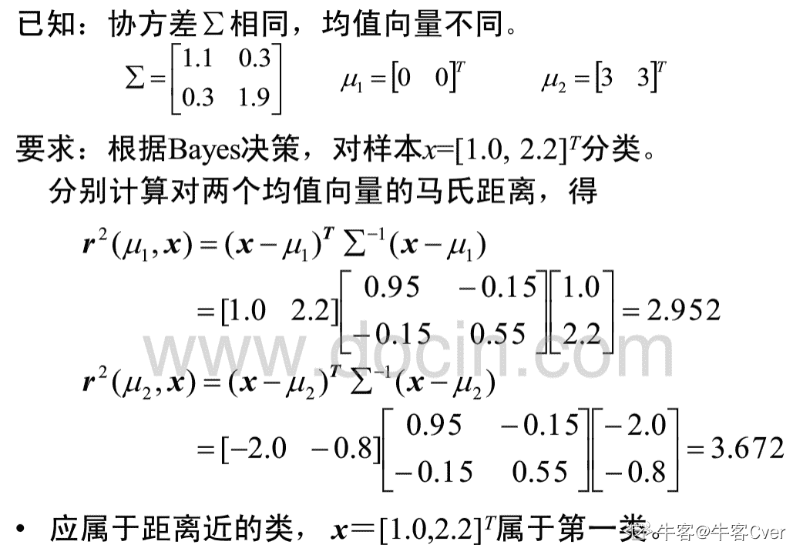
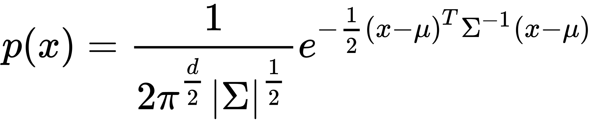
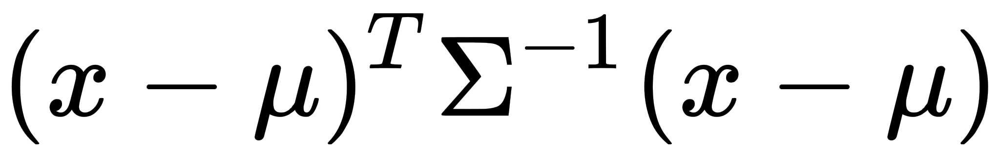
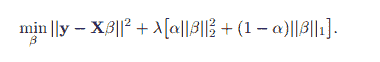
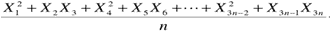
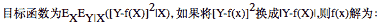
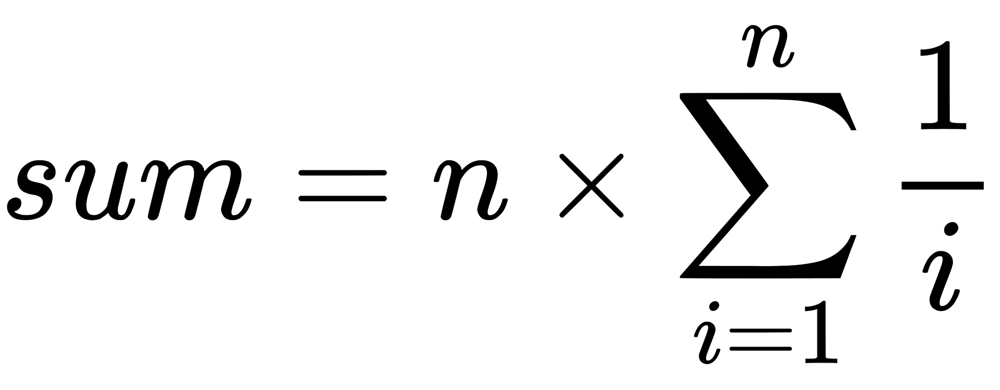
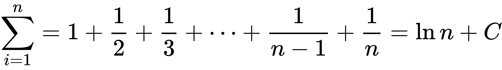

# 网易 2018 校招机器学习算法工程师笔试卷

## 1

在数理统计中， 一般通过增加抽样次数取平均来使得预估误差减小， 在机器学习中也有类似的模型处理， 如随机森林， 通过引入随机样本并且增加决策树的数据，对于随机森林主要降低预估的哪个方面值

正确答案: B   你的答案: 空 (错误)

```cpp
预估偏差
```

```cpp
预估方差
```

```cpp
噪音
```

```cpp
全部
```

本题知识点

网易 算法工程师 2018

讨论

[Yansz](https://www.nowcoder.com/profile/83072547)

随机森林减少模型方差，提高性能 GBDT 减少模型偏差，提高性能

发表于 2019-08-02 11:31:46

* * *

[TYHYGD](https://www.nowcoder.com/profile/193722204)

随机森林减小方差，GBDT 减小偏差

发表于 2020-02-14 20:22:26

* * *

## 2

以下不属于非监督学习的为

正确答案: D   你的答案: 空 (错误)

```cpp
关联规则
```

```cpp
Kmeans
```

```cpp
Word2vec
```

```cpp
Knn
```

本题知识点

网易 算法工程师 2018

讨论

[牛客 412451068 号](https://www.nowcoder.com/profile/412451068)

knn 是有监督学习,kmean 是无监督

发表于 2021-04-20 17:28:10

* * *

[nicco](https://www.nowcoder.com/profile/3715921)

这个题错了吧，Kmeans 是无监督，Knn 是有监督

发表于 2019-09-19 17:53:47

* * *

[小熊与你同行](https://www.nowcoder.com/profile/1116846)

knn 需要知道数据集合的类别，才能定义新的数据的类别。

发表于 2019-07-25 11:48:19

* * *

## 3

下列哪一项符合 GDBT 的算法描述

正确答案: C   你的答案: 空 (错误)

```cpp
从样本集中用 Bootstrap 采样选出 n 个样本, 在所有属性上对这 n 个样本建立分类器,重复建立 m 个分类器，最终投票分类
```

```cpp
从样本集中用 Bootstrap 采样选出 n 个样本，预建立 CART，在树的每个节点上，从所有属性中随机选择 k 个属性，选择出一个最佳分割属性作为节点，重复建立 m 棵树，最终投票分类
```

```cpp
对于输入的一个样本实例，首先会赋予一个初值，然后会遍历每一棵决策树，每棵树都会对预测值进行调整修正，最后得到预测的结果
```

```cpp
每一颗树始终拟合到目前为止的残差
```

本题知识点

网易 算法工程师 2018

讨论

[不要问我为什么 _____](https://www.nowcoder.com/profile/104594161)

这么多知识怎么学啊！！！！

发表于 2019-11-06 17:06:53

* * *

[零葬](https://www.nowcoder.com/profile/75718849)

A 和 B 都是在说随机森林。C 是正确的，描述的是 GBDT 的推理阶段，初值是第一棵树预测的，后面的树由于在训练时都是在拟合残差，因此在推理时是在对第一颗树的预测结果进行修正，直到样本过完最后一棵树，得到最终预测结果。D 选项错误，第一棵树是正儿八经的拟合标签，后面的树才是拟合残差。

发表于 2022-02-25 16:22:41

* * *

[努力～奋斗～](https://www.nowcoder.com/profile/910831366)

投票分类的的是 bagging 方法（基分类器尽可能独立），而 GBDT 属于 boosting 方法（各基分类器有依赖性），

发表于 2019-04-23 18:36:33

* * *

## 4

将当前命令 sh test.sh 任务在后台执行，下列最优雅的的做法是

正确答案: C   你的答案: 空 (错误)

```cpp
sh test.sh &amp;
```

```cpp
nohup sh test.sh
```

```cpp
nohup sh test.sh &amp;
```

```cpp
nohup sh test.sh &amp;&amp;
```

本题知识点

网易 算法工程师 算法工程师 网易 2018

讨论

[abv](https://www.nowcoder.com/profile/1547153)

nohup 是把任务提交到后台运行，&amp；为转义字符就是&

发表于 2019-08-03 13:22:43

* * *

[努力～奋斗～](https://www.nowcoder.com/profile/910831366)

有大佬解释一下么？

发表于 2019-04-23 18:37:28

* * *

## 5

截取 logfile 文件中含有 suc 的行，并且只输出最后一列，下列操作正确的是:

正确答案: C   你的答案: 空 (错误)

```cpp
grep -o 'suc' logfile | awk '{print $0}'
```

```cpp
grep 'suc' logfile | awk '{print $0}'
```

```cpp
grep 'suc' logfile | awk '{print $NF}'
```

```cpp
grep -o 'suc' logfile | awk '{print $NF}'
```

本题知识点

网易 算法工程师 算法工程师 网易 2018

讨论

[TYHYGD](https://www.nowcoder.com/profile/193722204)

grep -o    只输出文件中匹配到的部分 awk' ' 执行‘’里面的语句块

发表于 2020-02-14 20:26:19

* * *

## 6

在机器学习任务中经常假设矩阵为 n×n 的对称矩阵 A， 则以下说法正确的是

正确答案: C   你的答案: 空 (错误)

```cpp
对称矩阵为满秩矩阵
```

```cpp
对称矩阵的列向量之间正交
```

```cpp
对应于 A 的不同特征值的特征向量之间正交
```

```cpp
对应于 A 的相同特征值得特征向量之间正交
```

本题知识点

网易 算法工程师 2018

讨论

[MagicCarpet](https://www.nowcoder.com/profile/5204516)

[`zhuanlan.zhihu.com/p/30454490`](https://zhuanlan.zhihu.com/p/30454490)

*不同特征值对应的特征向量线性无关的证明*

发表于 2019-07-03 17:10:41

* * *

[凡事盼望](https://www.nowcoder.com/profile/665491)

对于选项 A 参考百度：

```cpp
对称矩阵不一定满秩。实对称矩阵 A 可以对角化则有，
P^(-1)AP=Λ
r（A）=r（Λ）
若Λ的特征值有 0，则，A 与Λ都不满秩

```

发表于 2018-07-18 22:08:14

* * *

## 7

以下关于 python 数据结构说法正确的是

正确答案: D   你的答案: 空 (错误)

```cpp
python 中 list 可以动态的更新， 但是不容许嵌套
```

```cpp
python 中 tuple 可以动态更新， 但是不容许嵌套
```

```cpp
python 中 dict 保存键值对， 并且键值对是有序的
```

```cpp
python 中 list 的元素可以是 tuple
```

本题知识点

网易 算法工程师 算法工程师 网易 2018

讨论

[正在起昵称](https://www.nowcoder.com/profile/30742155)

list 可更新，可嵌套；tuple 不可更新，可嵌套。当 tuple 中元素有 list 时，list 如果进行了更新，tuple 并没有更新，因为 tuple 中存放的是 list 的地址

发表于 2019-08-05 17:04:14

* * *

[不要问我为什么 _____](https://www.nowcoder.com/profile/104594161)

元组、列表、字符串都是属于序列类型，其中利用元组可以保护数据

发表于 2019-11-06 17:09:05

* * *

## 8

小明在一次班干部二人竞选中，支持率为百分之五十五，而置信水平 0.95 以上的置信区间为百分之五十到百分之六十，请问小明未当选的可能性有可能是

正确答案: D   你的答案: 空 (错误)

```cpp
40%
```

```cpp
50%
```

```cpp
5%
```

```cpp
3%
```

本题知识点

网易 算法工程师 算法工程师 网易 2018

讨论

[yangsencom](https://www.nowcoder.com/profile/564927)

[置信区间](https://www.baidu.com/s?wd=%E7%BD%AE%E4%BF%A1%E5%8C%BA%E9%97%B4&tn=SE_PcZhidaonwhc_ngpagmjz&rsv_dl=gh_pc_zhidao)展现的是这个参数的真实值有一定概率落在测量结果的周围的程度。置信区间给出的是被测量参数的测量值的可信程度，即前面所要求的“一定概率”。这个概率被称为[置信水平](https://www.baidu.com/s?wd=%E7%BD%AE%E4%BF%A1%E6%B0%B4%E5%B9%B3&tn=SE_PcZhidaonwhc_ngpagmjz&rsv_dl=gh_pc_zhidao)。如果小明的支持率为 55%，而[置信水平](https://www.baidu.com/s?wd=%E7%BD%AE%E4%BF%A1%E6%B0%B4%E5%B9%B3&tn=SE_PcZhidaonwhc_ngpagmjz&rsv_dl=gh_pc_zhidao)0.95 以上的置信区间是（50%,60%），那么他的真实支持率有百分之九十五的机率落在百分之五十和百分之六十之间，因此他的真实支持率不足一半的可能性小于百分之 5。

发表于 2018-08-11 10:49:31

* * *

[sdsfcdsfs](https://www.nowcoder.com/profile/854271041)

题目表述不清楚，题中“置信水平 0.95 以上的置信区间为百分之五十到百分之六十”，我一直当作百分之五十到百分之六十这一段的置信水平高于 0.95。实际上，题目想表述的是百分之五十到百分之六十是在正态分布置信水平 0.95 的右侧的。而且这鬼题也是个捞题，俩人竞选，一个人拿了 55%的票凭啥还不当选啊。。。

发表于 2019-08-06 20:34:56

* * *

## 9

用户通过搜索后点击找到所需信息，一般检索系统会通过点击的信息熵和 term 的权重来进行策略定位， 则以下说法正确的是

正确答案: A   你的答案: 空 (错误)

```cpp
term 的信息熵越小，term 权重越大， 则定位的页面越准确
```

```cpp
term 的信息熵越大，term 权重越大， 则定位的页面越准确
```

```cpp
term 的信息熵越小，term 权重越小， 则定位的页面越准确
```

```cpp
term 的信息熵越大，term 权重越小， 则定位的页面越准确
```

本题知识点

网易 算法工程师 2018

讨论

[阿莫西林·胶囊](https://www.nowcoder.com/profile/103343449)

信息熵越大，信息增益越小，信息就越混乱。

发表于 2020-04-06 11:15:15

* * *

## 10

以下关于最小二乘法正确的是

正确答案: B   你的答案: 空 (错误)

```cpp
最小二乘估计是线性有偏估计中方差最小的
```

```cpp
最小二乘估计是线性无偏估计中方差最小的
```

```cpp
最小二乘估计是线性有偏估计中方差最大的
```

```cpp
最小二乘估计是线性无偏估计中方差最大的
```

本题知识点

网易 算法工程师 算法工程师 网易 2018

## 11

小易为了向他的父母表现他已经长大独立了,他决定搬出去自己居住一段时间。一个人生活增加了许多花费: 小易每天必须吃一个水果并且需要每天支付 x 元的房屋租金。当前小易手中已经有 f 个水果和 d 元钱,小易也能去商店购买一些水果,商店每个水果售卖 p 元。小易为了表现他独立生活的能力,希望能独立生活的时间越长越好,小易希望你来帮他计算一下他最多能独立生活多少天。

本题知识点

网易 算法工程师 模拟 数学 贪心 2018

讨论

[零葬](https://www.nowcoder.com/profile/75718849)

模拟

房租是每天都要给的，水果还有剩余的话就不用买水果。如果水果吃完了，每天就多了一项买水果的开销，哪天不够付“房租”或“房租+水果”或“水果”了，就生存不下去了。

```cpp
import java.io.*;
import java.util.*;

public class Main {
    public static void main(String[] args) throws IOException {
        BufferedReader br = new BufferedReader(new InputStreamReader(System.in));
        String[] params = br.readLine().split(" ");
        int x = Integer.parseInt(params[0]);
        int f = Integer.parseInt(params[1]);
        int d = Integer.parseInt(params[2]);
        int p = Integer.parseInt(params[3]);
        int day = 0;
        while(d > 0){
            if(f == 0){    // 没水果了
                if(d >= p){
                    d -= p;     // 还有钱买水果
                }else{
                    break;      // 没钱买水果了
                }
            }else{
                f--;
            }
            if(d >= x){
                d -= x;      // 房租是每天都要给的
                day++;
            }else{
                break;
            }
        }
        System.out.println(day);
    }
}
```

发表于 2022-02-25 16:26:29

* * *

[叁九零](https://www.nowcoder.com/profile/399280754)

```cpp
x, f, d, p = map(int, input().split())
if d < f*x:
    print(d//x)
elif d>=f*x:
    print((d-f*x) // (p+x) + f)
else:
    print(0)
```

发表于 2019-08-26 16:49:57

* * *

[Jenny0329](https://www.nowcoder.com/profile/354539032)

先看拥有的水果数是否大于我们能够租的天数如果大于，则说明租完这么多天就结束了，水果还有剩，但是没钱租房了，否则，天数就等于拥有的水果数，然后钱减少水果数*一天租金之后就没有水果了，需要每天都去买，因此每天消费为租金+水果价格

```cpp
#include<iostream>
#include<algorithm>

using namespace std;

int main()
{
    int rent = 0;
    int ownMoney = 0;
    int ownFruit = 0;
    int fruitPrice = 0;
    cin>>rent>>ownFruit>>ownMoney>>fruitPrice;
    if(rent < 0 || ownFruit < 0 || ownMoney < 0 || fruitPrice < 0) 
    {
        cout<<0;
        return 0;
    }
    if(ownMoney < rent)
    {
        cout<<0;
        return 0;
    }
    if(0 == ownFruit && ownMoney < fruitPrice)
    {
        cout<<0;
        return 0;
    }
    int count = 0;
    if(ownFruit > 0)
    {
        int temp = ownMoney / rent;
        if(temp < ownFruit)
        {
            cout<<temp;
            return 0;
        }
        else
        {
            count = ownFruit;
            ownMoney -= (ownFruit*rent) ;
            ownFruit = 0;
        }
    }
    if(ownMoney / (rent+fruitPrice) > 0)
    {
        int temp = ownMoney / (rent+fruitPrice);
        count += temp;
        ownMoney -= (temp * (rent+fruitPrice));
    }
    cout<<count;
    return 0;
}
```

发表于 2021-09-24 11:34:39

* * *

## 12

小易将 n 个棋子摆放在一张无限大的棋盘上。第 i 个棋子放在第 x[i]行 y[i]列。同一个格子允许放置多个棋子。每一次操作小易可以把一个棋子拿起并将其移动到原格子的上、下、左、右的任意一个格子中。小易想知道要让棋盘上出现有一个格子中至少有 i(1 ≤ i ≤ n)个棋子所需要的最少操作次数.

本题知识点

网易 算法工程师 模拟 2018

讨论

[零葬](https://www.nowcoder.com/profile/75718849)

穷举

枚举最终棋子所在的位置，让所有的棋子往这个位置移动（最近的先移动过来），计算最小的移动代价。

```cpp
import java.lang.String;
import java.io.BufferedReader;
import java.io.InputStreamReader;
import java.io.IOException;
import java.util.Arrays;
import java.util.ArrayList;
import java.util.PriorityQueue;

public class Main {
    public static void main(String[] args) throws IOException {
        BufferedReader br = new BufferedReader(new InputStreamReader(System.in));
        String line;
        while((line = br.readLine()) != null){
            int n = Integer.parseInt(line);
            String[] params = br.readLine().split(" ");
            int[] x = new int[n];
            for(int i = 0; i < n; i++){
                x[i] = Integer.parseInt(params[i]);
            }
            params = br.readLine().split(" ");
            int[] y = new int[n];
            for(int i = 0; i < n; i++){
                y[i] = Integer.parseInt(params[i]);
            }
            System.out.println(solve(n, x, y));
        }
    }

    private static String solve(int n, int[] x, int[] y) {
        int[] res = new int[n];
        Arrays.fill(res, Integer.MAX_VALUE);
        PriorityQueue<Integer> pq = new PriorityQueue<>();
        // 枚举所有可能的位置
        for(int i = 0; i < n; i++){
            for(int j = 0; j < n; j++){
                // 让所有的棋子移动到(i,j)位置
                for(int k = 0; k < n; k++){
                    pq.offer(Math.abs(x[i] - x[k]) + Math.abs(y[j] - y[k]));
                }
                int dis = 0, index = 0;
                while(!pq.isEmpty()){
                    dis += pq.poll();
                    res[index] = Math.min(res[index], dis);
                    index++;
                }
            }
        }
        StringBuilder sb = new StringBuilder();
        for(int i = 0; i < n; i++){
            sb.append(res[i] + " ");
        }
        return sb.toString().trim();
    }
}
```

发表于 2022-02-25 16:32:01

* * *

[Buendia94](https://www.nowcoder.com/profile/622391059)

n, i = list(map(int, input().split(' ')))
sum = 0
if n % 2 == 1:
    num_left = int((n-1)/2)
    if i > num_left:
        for j in range(num_left):
            sum = sum + 2 * (j + 1) 
        for j in range(i - num_left - 1):
            sum = sum + 2 * (j + 1)
    elif i <= num_left:
        for j in range(i - 1):
            sum = sum + 2 * (j + 1)

else:
    num_left = int(n/2)
    if i > num_left:
        for j in range(num_left):
            sum = sum + 2 * (j + 1)
        for j in range(i - num_left -1):
            sum = sum + 2 * (j + 1)
    elif i <= num_left:
        for j in range(i - 1):
            sum = sum + 2 * (j + 1)

print(sum)

发表于 2020-06-09 02:04:49

* * *

[往事随风丶](https://www.nowcoder.com/profile/309853761)

import numpy as npn=int(input())x=list(map(int,input().split()))y=list(map(int,input().split()))def c_list(n,x,y):c=[]x=np.array(x)y=np.array(y)for i in range(n):#print(x[:i+1])midx,midy=np.sum(x[:i+1])//(i+1),np.sum(y[:i+1])//(i+1)#print(midx,midx)c_i=np.sum(np.fabs(x[:i+1]-midx)+np.fabs(y[:i+1]-midy))#print(np.fabs(x[:i+1]-midx))#print(np.fabs(y[:i+1]-midy))c.append(c_i)return cfor i in c_list(n,x,y):print(int(i),end=' ') 

发表于 2019-08-03 00:23:53

* * *

## 13

小易非常喜欢拥有以下性质的数列:
1、数列的长度为 n
2、数列中的每个数都在 1 到 k 之间(包括 1 和 k)
3、对于位置相邻的两个数 A 和 B(A 在 B 前),都满足(A <= B)或(A mod B != 0)(满足其一即可)
例如,当 n = 4, k = 7
那么{1,7,7,2},它的长度是 4,所有数字也在 1 到 7 范围内,并且满足第三条性质,所以小易是喜欢这个数列的
但是小易不喜欢{4,4,4,2}这个数列。小易给出 n 和 k,希望你能帮他求出有多少个是他会喜欢的数列。

本题知识点

网易 算法工程师 动态规划 2018

讨论

[offeroffer+1+1+1](https://www.nowcoder.com/profile/31471276)

```cpp
#include <cmath>
#include <climits>
#include <sstream>
#include <iostream>
#include <map>
#include <vector>
#include <string>
#include <stack>
#include <queue>
#include <numeric>
#include <unordered_map>
#include <unordered_set>
#include <algorithm>
using namespace std;
#define f(i, n, m) for(int i=n; i<m; i++)
class Solution{
    public:
    int ret = 0;
    long long int kmod = 1000000007;
    int solve(int k, int n){
        vector<vector<long long int>> dp;
        dp.resize(n+1);
        f(i, 1, n+1){
            if(i==1) {dp[1].resize(k+1, 1);dp[1][0]=0;}
            else dp[i].resize(k+1, 0);
        }

        for(int i = 2; i < n+1; ++i) {
            long long int sum = accumulate(
                dp[i-1].begin(),  dp[i-1].end(), 0, 
                &{ return (a+b) % kmod; }
            );
            for( int j = 1; j < k+1; ++j){
                long long int ret = 0;
                for(int idx = j+j; idx <= k; idx+=j){
                    ret += dp[i-1][idx];
                    ret %= kmod;
                }
                dp[i][j] = (sum - ret + kmod)%kmod;
            }
        }
        // for (auto &t:dp){
        //     showVector(t);
        //}
        return accumulate(
                dp[n].begin(),  dp[n].end(), 0, 
                &{ return (a+b) % kmod; }
            );
    }
};
int main(){
    Solution a;
    int n, k;
    cin >> n;
    cin >> k;
    cout << a.solve(k, n)<<endl;
}

```

发表于 2020-06-11 00:00:35

* * *

[Buendia94](https://www.nowcoder.com/profile/622391059)

cal = 0
n, k = list(map(int, input().split(' ')))
min_value = (1 - 10 ** int(n))/(1 - 10)
max_value = k * (1 - 10 ** int(n))/(1 - 10)
print(min_value)
print(max_value)
min_value = int(min_value)
max_value = int(max_value)

for i in range(min_value, max_value + 1, 1):
    BOOL = True
    S = str(i)
    re.sub("", " ", S)
    if "0" in S:
        BOOL = False
    else:
        for j in range(n-1):
            if int(S[j]) <= int(S[j + 1]) or int(S[j]) % int(S[j + 1]) != 0:
                pass
            else:
                BOOL = False
    if BOOL == True:
        print(S)
        cal = cal + 1

print(cal)

发表于 2020-06-09 17:18:04

* * *

## 14

SVD 经常作为特征降维的一种有效方法， 对于以下四个样本，，如果采用 SVD 的特征处理方式后，只保留最大特征值，则 SVD 后的样本向量的均方差误差为：

正确答案: B   你的答案: 空 (错误)

```cpp
100
```

```cpp
25
```

```cpp
625
```

```cpp
125
```

本题知识点

网易 算法工程师 算法工程师 网易 2018

讨论

[尤米尼斯](https://www.nowcoder.com/profile/5959913)

设样本的协方差矩阵为 C，可求出 C 的特征值分别是 100 和 25，保留最大的奇异值——10，则样本经处理变为（10,0,0,0），可计算出均方差为 25

发表于 2018-08-17 11:40:15

* * *

## 15

在只有两类的情况下， 二维特征向量通过共享相同的协方差矩阵的正太分布生成， 其中协方差矩阵为，均值向量分别为 u[1]=[0,0]^T，u[2]=[3,3]^T ，则根据贝叶斯分类， 样本[1.0, 2.2]^T 分类为：

正确答案: A   你的答案: 空 (错误)

```cpp
分类 1
```

```cpp
分类 2
```

```cpp
到两个类的距离相等，分类 1 或者分类 2 都可
```

```cpp
无法确定到两个类的距离，无法确定
```

本题知识点

网易 算法工程师 算法工程师 网易 2018

讨论

[牛客 Cver](https://www.nowcoder.com/profile/1897620)

做这道题目的时候，最开始是不知道如何计算的，事后找了一道类型一样的题目来看了下解题思路，明白还是对贝叶斯分类器不够深入了解，对此将类似的解题过程放在了下面，题型是一样的，只是数字有所改变。

发表于 2020-04-11 14:54:43

* * *

[零葬](https://www.nowcoder.com/profile/75718849)

根据多维高斯分布的计算公式，高斯贝叶斯分类器是这么计算概率的：  可以看出来，实际上我们只用计算就可以判断出更贴近哪个高斯分布了。

编辑于 2022-02-25 16:43:53

* * *

## 16

以下目标函数说法正确的是： 

正确答案: C   你的答案: 空 (错误)

```cpp
最小二乘+ L1
```

```cpp
最小二乘+ L2
```

```cpp
最小二乘+ elastic net
```

```cpp
最大似然估计+ elastic net
```

本题知识点

网易 算法工程师 算法工程师 网易 2018

讨论

[Maple_2005](https://www.nowcoder.com/profile/203246634)

前面显然是最小二乘法，后面是 L1L2 混合正则化，所以是弹性网络

发表于 2020-08-15 00:37:34

* * *

## 17

设{x[n]}服从独立同分布， E[x[n]] = 0, Var[x[n]]=1, 则当 n 趋向于无穷大时，下式值为： 

正确答案: C   你的答案: 空 (错误)

```cpp
无穷大
```

```cpp
0
```

```cpp
1
```

```cpp
2
```

本题知识点

网易 算法工程师 算法工程师 网易 2018

讨论

[zioyolar](https://www.nowcoder.com/profile/806974665)

因为 Xn 独立同分布，又 n 趋近无穷。所以表达式相当于求 E（X²+XY）。以为 X 与 Y 独立，所以 E（XY）=E(X)*E(Y)=0\. E(X²)=D(X)+E²(X)=1.所以答案为 1

发表于 2018-08-11 11:48:45

* * *

## 18

通常可以通过关联规则挖掘来发现啤酒和尿布的关系， 那么如果对于一条规则 A →B, 如果同时购买 A 和 B 的顾客比例是 4/7, 而购买 A 的顾客当中也购买了 B 的顾客比例是 1/2, 而购买 B 的顾客当中也购买了 A 的顾客比例是 1/3,则以下对于规则 A →B 的支持度(support)和置信度(confidence)分别是多少？

正确答案: C   你的答案: 空 (错误)

```cpp
4/7，1/3
```

```cpp
3/7，1/2
```

```cpp
4/7，1/2
```

```cpp
4/7，2/3
```

本题知识点

网易 算法工程师 算法工程师 网易 2018

讨论

[exec_cyc.](https://www.nowcoder.com/profile/669084697)

考察的就是关联规则的基础定义：对于规则 X→Y，支持度指同时包含 X 和 Y 的概率；置信度表示在已包含 X 的情况下包含 Y 的条件概率

发表于 2019-07-12 06:31:09

* * *

## 19

Java 是一门面向对象的编程语言，下面关键字中能够表示 Java 面向对象的特性是（）

正确答案: A   你的答案: 空 (错误)

```cpp
extends, interface
```

```cpp
volatite, implements
```

```cpp
abstract, interface
```

```cpp
static, void
```

本题知识点

网易 算法工程师 算法工程师 网易 2018

## 20

现在一个抽象类中定义一个方法如下：
public abstract void getUserInfo(String userId, int age);
下面哪个选项不是该方法的重载？（）

正确答案: C   你的答案: 空 (错误)

```cpp
public  abstract  void  getUserInfo(String userId, String name);
```

```cpp
public  abstract  int   getUserInfo(int age, String userId);
```

```cpp
public  abstract  void  getUserInfo(String  name,  int sex);
```

```cpp
public  abstract  void  getUserInfo(String userId, int age,  int sex);
```

本题知识点

网易 算法工程师 2018

讨论

[朕蹲厕唱忐忑](https://www.nowcoder.com/profile/945749079)

A 重载了参数类型，B 重载了返回类型，D 重载了参数数量和类型

发表于 2019-06-28 20:08:04

* * *

## 21

在最小二乘法中，

正确答案: B   你的答案: 空 (错误)

```cpp
E(Y|X=x)
```

```cpp
median(Y|X=x)
```

```cpp
E(Y2|X=x)
```

```cpp
avg(Y|X=x)
```

本题知识点

网易 算法工程师 算法工程师 网易 2018

## 22

在高斯混合分布中， 其隐变量的含义是：

正确答案: A   你的答案: 空 (错误)

```cpp
表示数据从某个高斯分布产生
```

```cpp
表示数据从每个高斯分布产生的概率
```

```cpp
表示高斯分布的方差
```

```cpp
表示高斯分布的均值
```

本题知识点

网易 算法工程师 算法工程师 网易 2018

## 23

下列代码的时间复杂度是多少()(^符号是幂的意思)

```cpp
int func(int N)
{
    int cnt = 0;
    for(int i=1;i<=N;i++)
        for(int j=1;j<=N;j+=i)
            cnt+=(i+j);
    return cnt;
}
```

正确答案: B   你的答案: 空 (错误)

```cpp
O(N)
```

```cpp
O(NlogN)
```

```cpp
O(N¹.5)
```

```cpp
O(N²)
```

本题知识点

网易 算法工程师 算法工程师 网易 2018

讨论

[CodingOneLife](https://www.nowcoder.com/profile/8795753)

执行次数乘号右侧为调和级数，使用欧拉公式
其中 C 为欧拉常数。

发表于 2019-07-03 12:42:46

* * *