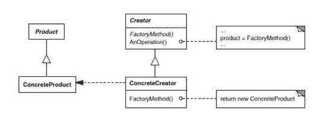

# 网易 2018 校招大数据开发工程师笔试卷

## 1

对记录序列{314，298，508，123，486，145}按从小到大的顺序进行插入排序，经过两趟排序后的结果为：

正确答案: B   你的答案: 空 (错误)

```cpp
{314，298，508，123，145，486}
```

```cpp
{298，314，508，123，486，145}
```

```cpp
{298，123，314，508，486，145}
```

```cpp
{123、298，314，508，486，145}
```

本题知识点

网易 算法工程师 Java 工程师 C++工程师 iOS 工程师 安卓工程师 运维工程师 前端工程师 PHP 工程师 大数据开发工程师 网易 2018

讨论

[向阳 ustb](https://www.nowcoder.com/profile/5616877)

i 从 1 到 len – 1
j 从 i – 1 到 0
后面的与前面的比较，大的往后移

发表于 2019-03-20 10:56:06

* * *

## 2

下列有关线程的说法正确的是：（ ）

正确答案: D   你的答案: 空 (错误)

```cpp
启动一个线程是调用 start（）方法，是线程所代表的虚拟处理机处于可运行状态，这意味着线程此时就会立即运行。
```

```cpp
notify（）方法可以确切的唤醒某个处于等待状态的线程。
```

```cpp
wait（）方法可以使一个线程处于等待状态，但不会释放所持有对象的锁。
```

```cpp
sleep（）方法使一个正在运行的线程处于睡眠状态，是一个静态方法，调用此方法时，需要捕捉 InterruptedException 异常
```

本题知识点

网易 算法工程师 Java 工程师 C++工程师 iOS 工程师 安卓工程师 运维工程师 前端工程师 PHP 工程师 大数据开发工程师 网易 2018

讨论

[高斯没有理](https://www.nowcoder.com/profile/7093334)

1.调用 run()才会运行 2.notify()随机唤醒、notifyAll()全部唤醒 3.wait()释放锁，锁进入等待序列

发表于 2018-08-10 16:49:12

* * *

## 3

如果 C 类子网的掩码为 255.255.255.240，则包含的子网位数、子网数目、每个子网中的主机数目正确的是（ ）

正确答案: C   你的答案: 空 (错误)

```cpp
2 2 2
```

```cpp
3 6 30
```

```cpp
4 14 14
```

```cpp
5 30 6
```

本题知识点

网易 算法工程师 Java 工程师 C++工程师 iOS 工程师 安卓工程师 运维工程师 前端工程师 PHP 工程师 大数据开发工程师 网易 2018

讨论

[向阳 ustb](https://www.nowcoder.com/profile/5616877)

240: 11110000 子网位数：48 + 4 + 2 + 1 = 14

发表于 2019-03-20 10:59:29

* * *

## 4

二分查找算法不能在下面哪个数据结构中使用？（）

正确答案: A   你的答案: 空 (错误)

```cpp
sorted linked list
```

```cpp
sorted binary trees
```

```cpp
sorted linear array
```

```cpp
sorted pointer array
```

本题知识点

网易 算法工程师 Java 工程师 C++工程师 iOS 工程师 安卓工程师 运维工程师 前端工程师 PHP 工程师 大数据开发工程师 网易 2018

讨论

[海康威视内推官](https://www.nowcoder.com/profile/6325506)

有序的顺序表，不能是链表，至于为什么有序树可以还不知道

发表于 2018-09-07 22:34:34

* * *

[离疏](https://www.nowcoder.com/profile/6259171)

链表不支持随机访问

发表于 2018-08-11 12:32:36

* * *

## 5

以下意图那个是用来描述 ADAPTER（适配器）?（      ）

正确答案: B   你的答案: 空 (错误)

```cpp
定义一个用于创建对象的接口，让子类决定实例化哪一个类
```

```cpp
将一个类的接口转换成客户希望的另外一个接口。本模式使得原本由于接口不兼容而不能一起工作的那些类一起工作
```

```cpp
将一个请求封装为一个对象，从而使你可用不同的请求对客户进行参数化；对请求排队或记录请求日志，以及支持可撤销的操作
```

```cpp
表示一个作用于某对象结构中的各元素的操作。它使你可以在不改变各元素的类的前提下作用于这些元素的新操作
```

本题知识点

网易 算法工程师 Java 工程师 C++工程师 iOS 工程师 安卓工程师 运维工程师 前端工程师 PHP 工程师 大数据开发工程师 网易 2018

## 6

单链表的每个结点中包括一个指针 next，它指向该结点的后继结点。现要将指针 q 指向的新结点插入到指针 p 指向的单链表结点之后，下面的操作系列中哪一个是正确的？

正确答案: C   你的答案: 空 (错误)

```cpp
q=p-&gt;next;p-&gt;next=q-&gt;next
```

```cpp
p=p-&gt;next=q-&gt;next;p-&gt;next
```

```cpp
q-&gt;next=p-&gt;next;p-&gt;next=q;
```

```cpp
p-&gt;next=1;q-&gt;next=p-&gt;next
```

本题知识点

网易 算法工程师 Java 工程师 C++工程师 iOS 工程师 安卓工程师 运维工程师 前端工程师 PHP 工程师 大数据开发工程师 网易 2018

## 7

哪一个方法不能用于 linux 的进程通信

正确答案: B   你的答案: 空 (错误)

```cpp
命名管道
```

```cpp
临界区
```

```cpp
共享内存
```

```cpp
信号量
```

本题知识点

网易 算法工程师 Java 工程师 C++工程师 iOS 工程师 安卓工程师 运维工程师 前端工程师 PHP 工程师 大数据开发工程师 网易 2018

讨论

[高斯没有理](https://www.nowcoder.com/profile/7093334)

**Linux 下进程通信的八种方法：管道(pipe)，命名管道(FIFO)，内存映射(mapped memeory)，消息队列(message queue)，共享内存(shared memory)，信号量(semaphore)，信号(signal)，套接字(Socket)**

发表于 2018-08-10 16:51:15

* * *

## 8

下面的类图表明了哪个模式?

正确答案: D   你的答案: 空 (错误)

```cpp
责任链模式
```

```cpp
命令模式
```

```cpp
备忘录模式
```

```cpp
工厂方法模式
```

本题知识点

网易 算法工程师 Java 工程师 C++工程师 iOS 工程师 安卓工程师 运维工程师 前端工程师 PHP 工程师 大数据开发工程师 网易 2018

## 9

以下关于 Hadoop 描述哪些是正确的：

正确答案: C   你的答案: 空 (错误)

```cpp
Ganglia 可以对 Hadoop 集群进行监控和报警；
```

```cpp
HDFS 支持数据的随机读写；
```

```cpp
HDFS 的 Block 默认保存 3 份；
```

```cpp
Yarn 中默认的调度器是 Fair Schedular；
```

本题知识点

网易 算法工程师 Java 工程师 C++工程师 iOS 工程师 安卓工程师 运维工程师 前端工程师 PHP 工程师 大数据开发工程师 2018

讨论

[求 offer 的菜鸟儿](https://www.nowcoder.com/profile/725427698)

Yarn 中调度器有三种： Fair Schedule (公平调度模式)             单队列                                     FIFO Schedule (先进先出调度模式)   单队列形式  <默认调度模式>                                     Capacity Schedule(容器调度模式)      多队列

发表于 2020-03-24 18:00:35

* * *

[向阳 ustb](https://www.nowcoder.com/profile/5616877)

Ganglia 是 UC Berkeley 发起的一个开源集群监视项目，设计用于测量数以千计的节点。Ganglia 的核心包含 gmond、gmetad 以及一个 Web 前端。主要是用来监控系统性能，如：cpu 、mem、硬盘利用率， I/O 负载、网络流量情况等，通过曲线很容易见到每个节点的工作状态，对合理调整、分配系统资源，提高系统整体性能起到重要作用。

发表于 2019-03-20 11:24:02

* * *

[离疏](https://www.nowcoder.com/profile/6259171)

HDFS 一次写入，多次读取，只支持随机读不支持随机写

发表于 2018-08-11 12:33:02

* * *

## 10

下面关于 HBase 描述哪些是正确的：

正确答案: A   你的答案: 空 (错误)

```cpp
支持条件查询；
```

```cpp
支持 SQL 查询；
```

```cpp
列族的数量没有性能影响；
```

```cpp
HBase 需要依赖 MapReduce；
```

本题知识点

网易 算法工程师 Java 工程师 C++工程师 iOS 工程师 安卓工程师 运维工程师 前端工程师 PHP 工程师 大数据开发工程师 2018

讨论

[zcah](https://www.nowcoder.com/profile/854836845)

A HBase 是 nosql 数据库，列族最好不要超过 3 个，列可以有多个，Hbase 不需要依赖 mapreduce

发表于 2018-07-09 15:53:38

* * *

[向阳 ustb](https://www.nowcoder.com/profile/5616877)

按指定 RowKey 获取唯一一条记录，get 方法

按指定的条件获取一批记录，scan 方法

发表于 2019-03-20 11:28:02

* * *

## 11

file 文件属性如下:
-rw-r--r-- 1 root root 0 Jun 24 23:12 file 现在需要其他用户能够编辑修改 file，下面哪项能够满足要求

正确答案: D   你的答案: 空 (错误)

```cpp
chown 764 file
```

```cpp
chown o+w file
```

```cpp
chmod 764 file
```

```cpp
chmod o+w file
```

本题知识点

网易 算法工程师 Java 工程师 C++工程师 iOS 工程师 安卓工程师 运维工程师 前端工程师 PHP 工程师 大数据开发工程师 网易 2018

讨论

[离疏](https://www.nowcoder.com/profile/6259171)

o 表示其他以外的人+ 表示增加权限 w 表示可写入此外 chmod 也可以用数字来表示权限如 chmod 777 file 
语法为：chmod abc file 
其中 a,b,c 各为一个数字，分别表示 User、Group、及 Other 的权限。 
r=4，w=2，x=1 
若要 rwx 属性则 4+2+1=7； 
若要 rw-属性则 4+2=6； 
若要 r-x 属性则 4+1=7。 

发表于 2018-08-11 12:34:56

* * *

## 12

linux 查看系统 IP 地址以及网卡流量可以使用以下哪个命令

正确答案: B   你的答案: 空 (错误)

```cpp
ipconfig
```

```cpp
ifconfig
```

```cpp
netstat
```

```cpp
ss
```

本题知识点

网易 算法工程师 Java 工程师 C++工程师 iOS 工程师 安卓工程师 运维工程师 前端工程师 PHP 工程师 大数据开发工程师 网易 2018

## 13

如果存在文本文件/tmp/testfile，并且文件行数小于等于 10 行，则输出文件前 3 行，下列脚本正确的是

正确答案: B   你的答案: 空 (错误)

```cpp
<pre>if [[ -n '/tmp/testfile' ]] &amp;&amp; [[ `wc -l /tmp/testfile` -le 10 ]];then
    head -3 /tmp/testfile
fi
</pre>
```

```cpp
<pre>if [[ -f '/tmp/testfile' ]] &amp;&amp; [[ `wc -l /tmp/testfile` -le 10 ]];then
    head -3 /tmp/testfile
fi
</pre>
```

```cpp
<pre>if [[ -n '/tmp/testfile' ]] || [[ `wc -l /tmp/testfile` -le 10 ]];then
    head -3 /tmp/testfile
 fi
</pre>
```

```cpp
<pre>if [[ -f '/tmp/testfile' ]] || [[ `wc -l /tmp/testfile` -le 10 ]];then
    head -3 /tmp/testfile
fi
</pre>
```

本题知识点

网易 算法工程师 Java 工程师 C++工程师 iOS 工程师 安卓工程师 运维工程师 前端工程师 PHP 工程师 大数据开发工程师 网易 2018

## 14

有时候因为磁盘空间快满了，我们需要删除一些 log 文件，但是忘记停止程序了，日志删除后，发现磁盘空间并没有释放，这时候我们通常使用以下哪种方式查找已删除文件的进程占用

正确答案: B   你的答案: 空 (错误)

```cpp
ps
```

```cpp
lsof
```

```cpp
top
```

```cpp
df
```

本题知识点

网易 算法工程师 Java 工程师 C++工程师 iOS 工程师 安卓工程师 运维工程师 前端工程师 PHP 工程师 大数据开发工程师 网易 2018

## 15

对于 SQL 语句 select * from t where a=100 and b=200，哪个索引可以使用到？

正确答案: D   你的答案: 空 (错误)

```cpp
索引 idx_b(b)
```

```cpp
索引 idx_b_a(b,a)
```

```cpp
索引 idx_a_b(a,b)
```

```cpp
都可以
```

本题知识点

网易 算法工程师 Java 工程师 C++工程师 iOS 工程师 安卓工程师 运维工程师 前端工程师 PHP 工程师 大数据开发工程师 网易 2018

## 16

以下 C 语言和 C++语言比较中错误的是（）

正确答案: B   你的答案: 空 (错误)

```cpp
C 语言绝大部分语法适用于 C++
```

```cpp
C 语言和 C++的 struct 意义和用法一致
```

```cpp
C 语言不能使用继承技术，但 C++可以
```

```cpp
C++是面向对象的语言，C 语言是面向过程的语言
```

本题知识点

网易 算法工程师 Java 工程师 C++工程师 iOS 工程师 安卓工程师 运维工程师 前端工程师 PHP 工程师 大数据开发工程师 网易 2018

讨论

[向阳 ustb](https://www.nowcoder.com/profile/5616877)

在 c++中，可以不要 struct，由于可以利用 typedef 嘛，但是在 c++中，不能在结构体后面声明结构体数组

发表于 2019-03-20 11:45:06

* * *

## 17

以下输出正确的是（ ）

```cpp
class Base
{
    public:
    void virtual Func()
    {
        cout<<"Base"<<endl;
    }
};

class Derived : public Base
{
    public:
    void virtual Func()
    {
        cout<<"Derived "<<endl;
    }
};

int main ()
{
    Base* pBase = new Base();
    pBase ->Func();
    Derived * pDerived = (Derived*)pBase;
    pDerived->Func();
    delete pBase;

    pDerived  =  new Derived();
    pBase = pDerived;
    pBase->Func();

    delete pDerived
    return 0;
}
```

正确答案: B   你的答案: 空 (错误)

```cpp
Base  Derived  Base
```

```cpp
Base  Base  Derived
```

```cpp
Base  Derived  Derived
```

```cpp
Derived Base  Derived
```

本题知识点

网易 算法工程师 Java 工程师 C++工程师 iOS 工程师 安卓工程师 运维工程师 前端工程师 PHP 工程师 大数据开发工程师 网易 2018

## 18

小易有一个长度为 n 的整数序列,a_1,...,a_n。然后考虑在一个空序列 b 上进行 n 次以下操作:
1、将 a_i 放入 b 序列的末尾
2、逆置 b 序列
小易需要你计算输出操作 n 次之后的 b 序列。

本题知识点

网易 算法工程师 Java 工程师 C++工程师 iOS 工程师 安卓工程师 运维工程师 前端工程师 PHP 工程师 模拟 队列 *大数据开发工程师 2018* *讨论

[he4thcliff](https://www.nowcoder.com/profile/7424778)

用栈

发表于 2019-09-20 16:48:32

* * *

[Seanmoore0707](https://www.nowcoder.com/profile/223633555)

```cpp
import sys

	num =int(sys.stdin.readline())

	numbers =sys.stdin.readline().strip().split(" ")

	output =""

	flag =0

	i =num-1

	while i>=0:

	    output+=numbers[i]+" "

	    if i==0:

	        flag=1

	    i -=2

	j =0

	if flag ==1:

	    j =1

	while j<num-1:

	    output+=numbers[j]+" "

	    j +=2

	print(output)

	# 找规律就行了，网易这套卷子三道编程题考查的不是编程能力，而是数学能力。

	# 本题 AC 通过，不需要复杂的数据结构或者算法。复杂度 O(n)

```

编辑于 2019-08-02 21:41:38

* * *

[岚匀](https://www.nowcoder.com/profile/2825940)

```cpp
#include<cstdio>
#include<vector>
using namespace std;
// 这个题考双向链表
// 定义一个方向，每次插入就在这个方向相反的方向插入链表节点
// 然后逆转这个方向

struct Node{
    int data;
    Node* prior;
    Node* next;
    Node(int d){
        data = d;
        prior = NULL;
        next = NULL;
    }
};

bool right_drct = true; // 开始这个链表的定义方向是正序向右的  那右边就是末尾
Node* left_ptr = NULL;
Node* right_ptr = NULL;

int main(){
    // 先处理输入输出
    int T;
    int data;
    scanf("%d", &T);
    while(T--){
        if((left_ptr == NULL) && (left_ptr == right_ptr)){ // 初始化
            scanf("%d", &data);
            Node* n = new Node(data);
            left_ptr = n;
            right_ptr = n;
        } else{
            scanf("%d", &data);
            Node* n = new Node(data);
            if(right_drct){
                // 在 right_ 尾节点去插
                right_ptr -> next = n;
                n -> prior = right_ptr;
                right_ptr = right_ptr -> next;
            } else{
                left_ptr -> prior = n;
                n -> next = left_ptr;
                left_ptr = left_ptr -> prior;   
            }
        }
        right_drct = !right_drct;
    }
    // 输出
    Node* p;
    if(right_drct){
        p = left_ptr;
        while(p -> next != NULL){
            printf("%d ", p -> data);
            p = p -> next;
        }
        printf("%d", p -> data);
    } else{
        p = right_ptr;
        while(p -> prior != NULL){
            printf("%d ", p -> data);
            p = p -> prior;
        }
        printf("%d", p -> data);
    }

    return 0;
}
```

发表于 2019-08-02 12:48:08

* * *

## 19

小易将 n 个棋子摆放在一张无限大的棋盘上。第 i 个棋子放在第 x[i]行 y[i]列。同一个格子允许放置多个棋子。每一次操作小易可以把一个棋子拿起并将其移动到原格子的上、下、左、右的任意一个格子中。小易想知道要让棋盘上出现有一个格子中至少有 i(1 ≤ i ≤ n)个棋子所需要的最少操作次数.

本题知识点

网易 算法工程师 Java 工程师 C++工程师 iOS 工程师 安卓工程师 运维工程师 前端工程师 PHP 工程师 模拟 大数据开发工程师 2018

## 20

小易老师是非常严厉的,它会要求所有学生在进入教室前都排成一列,并且他要求学生按照身高不递减的顺序排列。有一次,n 个学生在列队的时候,小易老师正好去卫生间了。学生们终于有机会反击了,于是学生们决定来一次疯狂的队列,他们定义一个队列的疯狂值为每对相邻排列学生身高差的绝对值总和。由于按照身高顺序排列的队列的疯狂值是最小的,他们当然决定按照疯狂值最大的顺序来进行列队。现在给出 n 个学生的身高,请计算出这些学生列队的最大可能的疯狂值。小易老师回来一定会气得半死。

本题知识点

网易 算法工程师 Java 工程师 C++工程师 iOS 工程师 安卓工程师 运维工程师 前端工程师 PHP 工程师 贪心 数学 大数据开发工程师 2018

## 21

Java 是一门面向对象的编程语言，下面关键字中能够表示 Java 面向对象的特性是（）

正确答案: A   你的答案: 空 (错误)

```cpp
extends, interface
```

```cpp
volatite, implements
```

```cpp
abstract, interface
```

```cpp
static, void
```

本题知识点

网易 算法工程师 Java 工程师 C++工程师 iOS 工程师 安卓工程师 运维工程师 前端工程师 PHP 工程师 大数据开发工程师 网易 2018

## 22

下列代码的时间复杂度是多少()(^符号是幂的意思)

```cpp
int func(int N)
{
    int cnt = 0;
    for(int i=1;i<=N;i++)
        for(int j=1;j<=N;j+=i)
            cnt+=(i+j);
    return cnt;
}
```

正确答案: B   你的答案: 空 (错误)

```cpp
O(N)
```

```cpp
O(NlogN)
```

```cpp
O(N¹.5)
```

```cpp
O(N²)
```

本题知识点

网易 算法工程师 Java 工程师 C++工程师 iOS 工程师 安卓工程师 运维工程师 前端工程师 PHP 工程师 大数据开发工程师 网易 2018

## 23

假如 N 是由一棵有序树 T 转换而来的二叉树，那么 T 中的节点的后序遍历顺序是 N 节点的()

正确答案: B   你的答案: 空 (错误)

```cpp
先序遍历
```

```cpp
中序遍历
```

```cpp
后序遍历
```

```cpp
层次遍历
```

本题知识点

网易 算法工程师 Java 工程师 C++工程师 iOS 工程师 安卓工程师 运维工程师 前端工程师 PHP 工程师 大数据开发工程师 网易 2018

讨论

[高斯没有理](https://www.nowcoder.com/profile/7093334)

将树转换为二叉树后，树的先根序列等于对应二叉树的先序序列，树的后根序列等于对应二叉树的中序序列。

发表于 2018-08-10 17:01:23

* * **