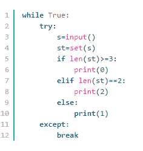

# 网易 2018 校招测试开发工程师笔试卷

## 1

下面关于进程和线程的关系不正确的是？（）

正确答案: D   你的答案: 空 (错误)

```cpp
线程是进程的一个实体，可作为系统独立调度和分派的基本单位。
```

```cpp
一个进程中多个线程可以并发执行。
```

```cpp
线程可以通过相互之间协同来完成进程所要完成的任务。
```

```cpp
线程之间不共享进程中的共享变量和部分环境。
```

本题知识点

网易 运维工程师 Java 工程师 C++工程师 iOS 工程师 安卓工程师 前端工程师 算法工程师 PHP 工程师 测试开发工程师 网易 2018

## 2

下述有关虚函数和纯虚函数说法错误的是？

正确答案: C   你的答案: 空 (错误)

```cpp
被 virtual 关键字修饰的成员函数，就是虚函数
```

```cpp
在基类中实现纯虚函数的方法是在函数原型后加&ldquo;=0&rdquo; virtual void funtion1()=0
```

```cpp
同时含有纯虚拟函数的类称为抽象类，它可以被实例化，但是对象不可以调用纯虚函数
```

```cpp
使用纯虚函数的意义是在很多情况下，基类本身生成对象是不合情理的
```

本题知识点

网易 运维工程师 Java 工程师 C++工程师 iOS 工程师 安卓工程师 前端工程师 算法工程师 PHP 工程师 测试开发工程师 网易 2018

## 3

下面程序的功能是输出数组的全排列,选择正确的选项,完成其功能。

```cpp
void perm(int list[], int k, int m)
{
    if (    )
    {
        copy(list,list+m,ostream_iterator<int>(cout," "));
        cout<<endl;
        return;
    }
    for (int i=k; i<=m; i++)
    {
        swap(&list[k],&list[i]);
        (    );
        swap(&list[k],&list[i]);
    }
}
```

正确答案: B   你的答案: 空 (错误)

```cpp
k!=m 和 perm（list，k+1，m）
```

```cpp
k==m 和 perm（list，k+1，m）
```

```cpp
k!=m 和 perm（list，k，m）
```

```cpp
k==m 和 perm（list，k，m）
```

本题知识点

网易 运维工程师 Java 工程师 C++工程师 iOS 工程师 安卓工程师 前端工程师 算法工程师 PHP 工程师 测试开发工程师 网易 2018

## 4

从 1000000000000 个数中选择最小的 20 个数，用以下哪种排序算法比较方便？（）

正确答案: D   你的答案: 空 (错误)

```cpp
归并排序
```

```cpp
插入排序
```

```cpp
快速排序
```

```cpp
堆排序
```

本题知识点

网易 运维工程师 Java 工程师 C++工程师 iOS 工程师 安卓工程师 前端工程师 算法工程师 PHP 工程师 测试开发工程师 网易 2018

讨论

[龙哥我要和你一样优秀](https://www.nowcoder.com/profile/526471458)

分开处理，建立大小为 10 的最小堆

发表于 2018-08-09 00:38:24

* * *

## 5

以下意图哪个是用来描述 OBSERVER（观察者）?（      ）

正确答案: C   你的答案: 空 (错误)

```cpp
使多个对象都有机会处理请求，从而避免请求的发送者和接收者之间的耦合关系
```

```cpp
将抽象部分与它的实现部分分离，使它们都可以独立地变化
```

```cpp
定义对象间的一种一对多的依赖关系,当一个对象的状态发生改变时, 所有依赖于它的对象都得到通知并被自动更新
```

```cpp
用原型实例指定创建对象的种类，并且通过拷贝这些原型创建新的对象
```

本题知识点

网易 运维工程师 Java 工程师 C++工程师 iOS 工程师 安卓工程师 前端工程师 算法工程师 PHP 工程师 测试开发工程师 2018

## 6

某单链表中最常用的操作是在最后一个元素之后插入一个元素和删除链表中给定的元素，则下列选项中正确的是 ________。

正确答案: A   你的答案: 空 (错误)

```cpp
若仅有头指针，则插入操作及删除操作均是 O(n)的
```

```cpp
增加尾指针既能提升插入操作的效率，也能提升删除操作的效率
```

```cpp
既有头指针又有尾指针，则插入操作及删除操作均是 O(1)的
```

```cpp
既有头指针又有尾指针，则插入操作及删除操作均是 O(n)的
```

本题知识点

网易 运维工程师 Java 工程师 C++工程师 iOS 工程师 安卓工程师 前端工程师 算法工程师 PHP 工程师 测试开发工程师 网易 2018

讨论

[ringer92](https://www.nowcoder.com/profile/739462449)

B. 不能提升删除效率 C.D.插入 O（1），删除 O（N）

发表于 2019-08-31 22:56:32

* * *

## 7

将一个整数序列整理为升序，两趟处理后序列变为 10,12,21,9,7,3,4,25，则采用的排序算法可能是 ________。

正确答案: A   你的答案: 空 (错误)

```cpp
插入排序
```

```cpp
选择排序
```

```cpp
快速排序
```

```cpp
堆排序
```

本题知识点

网易 运维工程师 Java 工程师 C++工程师 iOS 工程师 安卓工程师 前端工程师 算法工程师 PHP 工程师 测试开发工程师 网易 2018

讨论

[牛牛 xiao](https://www.nowcoder.com/profile/7795492)

插入排序：第一趟前两个有序，第二趟前三个有序。快速排序：每经过一趟快排，轴点元素都必然就位，也就是说，一趟下来至少有 1 个元素在其最终位置，2 趟就有两个位置元素就位。10,12,21,9,7,3,4,25  正确的结果是,3,4,7,9,10,12,21,25.。这里只有 25 一个元素就位了（10,12,21 虽然有序，但他们应该在 3,4,7,9 后面才行），。 

发表于 2018-08-10 10:02:20

* * *

## 8

单链表的每个结点中包括一个指针 next，它指向该结点的后继结点。现要将指针 q 指向的新结点插入到指针 p 指向的单链表结点之后，下面的操作系列中哪一个是正确的？

正确答案: C   你的答案: 空 (错误)

```cpp
q=p-&gt;next;p-&gt;next=q-&gt;next
```

```cpp
p=p-&gt;next=q-&gt;next;p-&gt;next
```

```cpp
q-&gt;next=p-&gt;next;p-&gt;next=q;
```

```cpp
p-&gt;next=1;q-&gt;next=p-&gt;next
```

本题知识点

网易 运维工程师 Java 工程师 C++工程师 iOS 工程师 安卓工程师 前端工程师 算法工程师 PHP 工程师 测试开发工程师 网易 2018

## 9

哪一个方法不能用于 linux 的进程通信

正确答案: B   你的答案: 空 (错误)

```cpp
命名管道
```

```cpp
临界区
```

```cpp
共享内存
```

```cpp
信号量
```

本题知识点

网易 运维工程师 Java 工程师 C++工程师 iOS 工程师 安卓工程师 前端工程师 算法工程师 PHP 工程师 测试开发工程师 网易 2018

## 10

linux 查看系统 IP 地址以及网卡流量可以使用以下哪个命令

正确答案: B   你的答案: 空 (错误)

```cpp
ipconfig
```

```cpp
ifconfig
```

```cpp
netstat
```

```cpp
ss
```

本题知识点

网易 运维工程师 Java 工程师 C++工程师 iOS 工程师 安卓工程师 前端工程师 算法工程师 PHP 工程师 测试开发工程师 网易 2018

## 11

截取 logfile 文件中含有 suc 的行，并且只输出最后一列，下列操作正确的是:

正确答案: C   你的答案: 空 (错误)

```cpp
grep -o 'suc' logfile | awk '{print $0}'
```

```cpp
grep 'suc' logfile | awk '{print $0}'
```

```cpp
grep 'suc' logfile | awk '{print $NF}'
```

```cpp
grep -o 'suc' logfile | awk '{print $NF}'
```

本题知识点

网易 运维工程师 Java 工程师 C++工程师 iOS 工程师 安卓工程师 前端工程师 算法工程师 PHP 工程师 测试开发工程师 网易 2018

讨论

[已注销](https://www.nowcoder.com/profile/6584997)

grep -o 可以逐行输出匹配的内容，有多少个匹配就有多少行

发表于 2020-08-23 19:43:38

* * *

## 12

python 函数 func1 如下：

```cpp
def func1(foo):
     def __dec():
         print "Start...."
         foo()
         print "End..."
     return __dec

```

func2 函数调用如下：

```cpp
@func1
def func2():
     print "I am python function" 
```

那么 func2 函数正确的输出是:

正确答案: C   你的答案: 空 (错误)

```cpp
Start...\nEnd...
```

```cpp
I am python function\n
```

```cpp
Start...\nI am python function\n End...
```

```cpp
Start...\nEnd...\nI am python function
```

本题知识点

网易 运维工程师 Java 工程师 C++工程师 iOS 工程师 安卓工程师 前端工程师 算法工程师 PHP 工程师 测试开发工程师 2018

讨论

[Chrisiven](https://www.nowcoder.com/profile/203872321)

选 C。@func1 是装饰器,使用在 func2()函数上.装饰器的功能是就是在函数进入装饰器中进行一些设置(比如常见的一些验证啊,打印进入的 log 啊等等)

编辑于 2018-10-29 18:21:37

* * *

[1055586866](https://www.nowcoder.com/profile/261103376)

c

发表于 2018-06-22 21:35:05

* * *

## 13

对于 SQL 语句 select * from t where a=100 and b=200，哪个索引可以使用到？

正确答案: D   你的答案: 空 (错误)

```cpp
索引 idx_b(b)
```

```cpp
索引 idx_b_a(b,a)
```

```cpp
索引 idx_a_b(a,b)
```

```cpp
都可以
```

本题知识点

网易 运维工程师 Java 工程师 C++工程师 iOS 工程师 安卓工程师 前端工程师 算法工程师 PHP 工程师 测试开发工程师 网易 2018

## 14

关于 Android 广播,下列说法错误的是

正确答案: D   你的答案: 空 (错误)

```cpp
广播的注册分静态注册和动态注册
```

```cpp
广播分为一般广播 sendBroadcast,有序广播 sendOrderBroadcast,和粘性广播 sendStickyBroadcast.
```

```cpp
LocalBroadcastManager 是本地广播,发送的广播只有本 APP 会接收到,其他 APP 的广播无法到达通过 LocalBroadcastManager 注册的 Receiver 中
```

```cpp
无法禁止其他 app 的广播到达自己的 broadcastReceiver 中
```

本题知识点

网易 运维工程师 Java 工程师 C++工程师 iOS 工程师 安卓工程师 前端工程师 算法工程师 PHP 工程师 测试开发工程师 2018

讨论

[减肥一个月也不会变成小田切让](https://www.nowcoder.com/profile/7662098)

D，只要在 broadcastReceiver 做了过滤就可以禁止了

发表于 2018-08-10 10:03:04

* * *

## 15

针对登陆页面（包含手机号码输入框和密码输入框）的测试用例，下列哪个说法是不正确的（）

正确答案: D   你的答案: 空 (错误)

```cpp
手机号码输入框测试用例里，应包含是否只能输入数字
```

```cpp
登陆框和密码框均应包含字母大小写的测试
```

```cpp
需要对密码的强度进行测试
```

```cpp
不需要对手机号码的长度进行测试
```

本题知识点

网易 运维工程师 Java 工程师 C++工程师 iOS 工程师 安卓工程师 前端工程师 算法工程师 PHP 工程师 测试开发工程师 网易 2018

## 16

关于白盒测试和黑盒测试，下列哪个说法是正确的（）

正确答案: B   你的答案: 空 (错误)

```cpp
白盒测试一般由测试人员执行
```

```cpp
黑盒测试着重于测试软件的功能，白盒测试着重于代码
```

```cpp
白盒与黑盒是一样的测试方法，只是测试对象不同
```

```cpp
黑盒测试可以取代白盒测试
```

本题知识点

网易 运维工程师 Java 工程师 C++工程师 iOS 工程师 安卓工程师 前端工程师 算法工程师 PHP 工程师 测试开发工程师 网易 2018

## 17

关于回归测试，下列哪个说法是正确的（）

正确答案: B   你的答案: 空 (错误)

```cpp
回归测试不需要进行全部用例的再测试
```

```cpp
回归测试需要选择所有功能的高级别用例进行测试，并对已发现的 BUG 进行再次测试
```

```cpp
回归测试在整个测试周期中，并不是非常的重要
```

```cpp
回归测试不需要根据风险程度来测试
```

本题知识点

网易 运维工程师 Java 工程师 C++工程师 iOS 工程师 安卓工程师 前端工程师 算法工程师 PHP 工程师 测试开发工程师 网易 2018

## 18

小易有一些彩色的砖块。每种颜色由一个大写字母表示。各个颜色砖块看起来都完全一样。现在有一个给定的字符串 s,s 中每个字符代表小易的某个砖块的颜色。小易想把他所有的砖块排成一行。如果最多存在一对不同颜色的相邻砖块,那么这行砖块就很漂亮的。请你帮助小易计算有多少种方式将他所有砖块排成漂亮的一行。(如果两种方式所对应的砖块颜色序列是相同的,那么认为这两种方式是一样的。)
例如: s = "ABAB",那么小易有六种排列的结果:
"AABB","ABAB","ABBA","BAAB","BABA","BBAA"
其中只有"AABB"和"BBAA"满足最多只有一对不同颜色的相邻砖块。

本题知识点

网易 运维工程师 Java 工程师 C++工程师 iOS 工程师 安卓工程师 前端工程师 算法工程师 PHP 工程师 模拟 字符串 *测试开发工程师 2018* *讨论

[一缕冷香远](https://www.nowcoder.com/profile/5072467)



发表于 2018-09-07 18:11:47

* * *

[对方没有名称](https://www.nowcoder.com/profile/6024096)

```cpp

	importjava.util.Scanner;

	importjava.util.HashSet;

	publicclassMain{

	    publicstaticvoidmain(String [] args){

	        Scanner sc=newScanner (System.in);

	        while(sc.hasNext()){

	            String str=sc.nextLine();

	            HashSet<Character> hs=newHashSet<>();

	            char[] nums=str.toCharArray();

	            for(inti=0;i<nums.length;i++){

	                hs.add(nums[i]);

	            }

	            if(hs.size()==1)

	                System.out.println(1);

	            elseif(hs.size()==2)

	                System.out.println(2);

	            else

	                System.out.println(0);

	        } 

	    }

	}

```

发表于 2018-08-10 14:29:42

* * *

## 19

小易有一个长度为 n 的整数序列,a_1,...,a_n。然后考虑在一个空序列 b 上进行 n 次以下操作:
1、将 a_i 放入 b 序列的末尾
2、逆置 b 序列
小易需要你计算输出操作 n 次之后的 b 序列。

本题知识点

网易 运维工程师 Java 工程师 C++工程师 iOS 工程师 安卓工程师 前端工程师 算法工程师 PHP 工程师 模拟 队列 *测试开发工程师 2018* *讨论

[对方没有名称](https://www.nowcoder.com/profile/6024096)

```cpp

	importjava.util.Scanner;

	importjava.util.ArrayList;

	publicclassMain{

	    publicstaticvoidmain(String [] args){

	        Scanner sc=newScanner(System.in);

	        while(sc.hasNext()){

	            ArrayList<Integer> list=newArrayList<>();

	            intn=sc.nextInt();

	            int[] nums=newint[n];

	            for(inti=0;i<n;i++)

	                nums[i]=sc.nextInt();

	            intmin=(n%2==1)?n-1:n;

	            intindex=0;

	            while(index<min){

	                if((index&1)==0){

	                    list.add(nums[index++]);

	                }else

	                    list.add(0,nums[index++]);

	            }

	            if(min==n){

	                for(inti=0;i<list.size()-1;i++){

	                    System.out.print(list.get(i)+" ");

	                }

	                System.out.println(list.get(list.size()-1));

	            }else{

	                list.add(nums[nums.length-1]);

	                for(inti=list.size()-1;i>0;i--){

	                    System.out.print(list.get(i)+" ");

	                }

	                System.out.println(list.get(0));

	            }

	        } 

	    }

	}

```

发表于 2018-08-10 14:30:13

* * *

## 20

小易将 n 个棋子摆放在一张无限大的棋盘上。第 i 个棋子放在第 x[i]行 y[i]列。同一个格子允许放置多个棋子。每一次操作小易可以把一个棋子拿起并将其移动到原格子的上、下、左、右的任意一个格子中。小易想知道要让棋盘上出现有一个格子中至少有 i(1 ≤ i ≤ n)个棋子所需要的最少操作次数.

本题知识点

网易 运维工程师 Java 工程师 C++工程师 iOS 工程师 安卓工程师 前端工程师 算法工程师 PHP 工程师 模拟 测试开发工程师 2018

讨论

[牛客 118814286 号](https://www.nowcoder.com/profile/118814286)

```cpp
1.暴力求解；
2.X,Y 距离最小的解一定分别在给定的序列内，X,Y 独立考虑；
```

发表于 2018-08-08 11:07:31

* * *

## 21

Java 是一门面向对象的编程语言，下面关键字中能够表示 Java 面向对象的特性是（）

正确答案: A   你的答案: 空 (错误)

```cpp
extends, interface
```

```cpp
volatite, implements
```

```cpp
abstract, interface
```

```cpp
static, void
```

本题知识点

网易 运维工程师 Java 工程师 C++工程师 iOS 工程师 安卓工程师 前端工程师 算法工程师 PHP 工程师 测试开发工程师 网易 2018

讨论

[再见谢谢](https://www.nowcoder.com/profile/137157265)

D

发表于 2018-09-07 14:27:06

* * *

## 22

定义字符串 String str = “用户 1|用户 2|用户 3|用户 4”，现在想要对字符串根据字符“|”进行分割解析，下面哪种分割方式是正确的？（）

正确答案: C   你的答案: 空 (错误)

```cpp
str.split(&ldquo;\|&rdquo;)
```

```cpp
str.split(&ldquo;|&rdquo;)
```

```cpp
str.split(&ldquo;\\|&rdquo;)
```

```cpp
str.split(&ldquo;\\\|&rdquo;)
```

本题知识点

网易 运维工程师 Java 工程师 C++工程师 iOS 工程师 安卓工程师 前端工程师 算法工程师 PHP 工程师 测试开发工程师 网易 2018

## 23

在多线程编程中我们常常需要考虑到线程安全性，那么在 java 集合中，下面哪些是属于多线程安全的的集合类？（）

正确答案: C   你的答案: 空 (错误)

```cpp
HashMap,  Vector
```

```cpp
LinkedList,  LinkedHashMap
```

```cpp
CurrentHashMap,  Vector
```

```cpp
ArrayList, LinkedHashMap
```

本题知识点

网易 运维工程师 Java 工程师 C++工程师 iOS 工程师 安卓工程师 前端工程师 算法工程师 PHP 工程师 测试开发工程师 网易 2018**