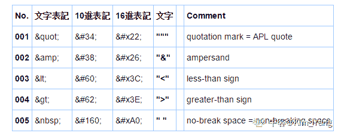

# 网易 2018 校招测试工程师笔试卷

## 1

下面关于进程和线程的关系不正确的是？（）

正确答案: D   你的答案: 空 (错误)

```cpp
线程是进程的一个实体，可作为系统独立调度和分派的基本单位。
```

```cpp
一个进程中多个线程可以并发执行。
```

```cpp
线程可以通过相互之间协同来完成进程所要完成的任务。
```

```cpp
线程之间不共享进程中的共享变量和部分环境。
```

本题知识点

网易 运维工程师 Java 工程师 C++工程师 iOS 工程师 安卓工程师 前端工程师 算法工程师 PHP 工程师 测试工程师 网易 2018

讨论

[999_000](https://www.nowcoder.com/profile/1435511)

(1)地址空间:进程具有独立的数据堆栈空间和数据段，线程有独立的堆栈空间，但共享数据段(2)进程是资源分配和拥有的最小单位,同一个进程内的线程共享进程的资源(3)线程是处理器调度的基本单位,但进程不是.(4)二者均可并发执行.(5)进程的销毁代价大，线程的销毁代价小；对于安全性，稳定性的建议使用进程；对于频繁创建和销毁的，多核分布，并发操作建议使用线程

发表于 2018-08-11 11:14:55

* * *

## 2

以下意图哪个是用来描述 OBSERVER（观察者）?（      ）

正确答案: C   你的答案: 空 (错误)

```cpp
使多个对象都有机会处理请求，从而避免请求的发送者和接收者之间的耦合关系
```

```cpp
将抽象部分与它的实现部分分离，使它们都可以独立地变化
```

```cpp
定义对象间的一种一对多的依赖关系,当一个对象的状态发生改变时, 所有依赖于它的对象都得到通知并被自动更新
```

```cpp
用原型实例指定创建对象的种类，并且通过拷贝这些原型创建新的对象
```

本题知识点

网易 运维工程师 Java 工程师 C++工程师 iOS 工程师 安卓工程师 前端工程师 算法工程师 PHP 工程师 测试工程师 网易 2018

讨论

[狐狸的奶酪](https://www.nowcoder.com/profile/499082733)

A:用来描述职责链 B：用来描述桥接 C:用来描述观察者 D:用来描述原型

发表于 2018-08-11 13:25:33

* * *

## 3

某单链表中最常用的操作是在最后一个元素之后插入一个元素和删除链表中给定的元素，则下列选项中正确的是 ________。

正确答案: A   你的答案: 空 (错误)

```cpp
若仅有头指针，则插入操作及删除操作均是 O(n)的
```

```cpp
增加尾指针既能提升插入操作的效率，也能提升删除操作的效率
```

```cpp
既有头指针又有尾指针，则插入操作及删除操作均是 O(1)的
```

```cpp
既有头指针又有尾指针，则插入操作及删除操作均是 O(n)的
```

本题知识点

网易 运维工程师 Java 工程师 C++工程师 iOS 工程师 安卓工程师 前端工程师 算法工程师 PHP 工程师 测试工程师 网易 2018

讨论

[一直 sober 的月](https://www.nowcoder.com/profile/888296090)

如果有尾指针，插入是 o(1)，删除还是 o(n)

发表于 2020-09-12 07:16:48

* * *

## 4

已知一棵高度为 4 的完全二叉树的第 4 层（设根为第 1 层）有 3 个叶结点，则该完全二叉树第 3 层的叶结点个数是 ________。

正确答案: B   你的答案: 空 (错误)

```cpp
1
```

```cpp
2
```

```cpp
3
```

```cpp
4
```

本题知识点

网易 运维工程师 Java 工程师 C++工程师 iOS 工程师 安卓工程师 前端工程师 算法工程师 PHP 工程师 测试工程师 2018

讨论

[狐狸的奶酪](https://www.nowcoder.com/profile/499082733)

由于高度限制，故第四层只有三个节点

发表于 2018-08-11 13:38:57

* * *

## 5

单链表的每个结点中包括一个指针 next，它指向该结点的后继结点。现要将指针 q 指向的新结点插入到指针 p 指向的单链表结点之后，下面的操作系列中哪一个是正确的？

正确答案: C   你的答案: 空 (错误)

```cpp
q=p-&gt;next;p-&gt;next=q-&gt;next
```

```cpp
p=p-&gt;next=q-&gt;next;p-&gt;next
```

```cpp
q-&gt;next=p-&gt;next;p-&gt;next=q;
```

```cpp
p-&gt;next=1;q-&gt;next=p-&gt;next
```

本题知识点

网易 运维工程师 Java 工程师 C++工程师 iOS 工程师 安卓工程师 前端工程师 算法工程师 PHP 工程师 测试工程师 2018

讨论

[〤。简简单单~](https://www.nowcoder.com/profile/505816391)

c 选项：q->next=p->next;p->next=q;第一个式子是让 q 指向 p 指向的，第二句让 p 指向 q

发表于 2018-09-23 11:43:32

* * *

## 6

一个栈的入栈序列是 1、2、3、4、5，则栈的不可能输出序列是：（）

正确答案: B   你的答案: 空 (错误)

```cpp
12345
```

```cpp
43512
```

```cpp
54321
```

```cpp
45321
```

本题知识点

网易 运维工程师 Java 工程师 C++工程师 iOS 工程师 安卓工程师 前端工程师 算法工程师 PHP 工程师 测试工程师 网易 2018

讨论

[lily-girl](https://www.nowcoder.com/profile/5264718)

先进后出，可以全进再依次出 c，也可以进一个出一个 a，也可以进一部分，出一个，再进一部分 d。

发表于 2018-08-02 17:51:37

* * *

## 7

为了方便软件移植，哪个是错误的（）

正确答案: D   你的答案: 空 (错误)

```cpp
在软件设计上，采用层次化设计和模块化设计
```

```cpp
在软件体系结构上，在操作系统和应用软件之间引入一个虚拟机层，把一些通用的、共性的操作系统 API 接口函数封装起来
```

```cpp
将不可移植的部分局域化，集中在某几个特定的文件之中
```

```cpp
在数据类型上，尽量直接使用 C 语言的数据类型
```

本题知识点

网易 运维工程师 Java 工程师 C++工程师 iOS 工程师 安卓工程师 前端工程师 算法工程师 PHP 工程师 测试工程师 2018

## 8

哪一个方法不能用于 linux 的进程通信

正确答案: B   你的答案: 空 (错误)

```cpp
命名管道
```

```cpp
临界区
```

```cpp
共享内存
```

```cpp
信号量
```

本题知识点

网易 运维工程师 Java 工程师 C++工程师 iOS 工程师 安卓工程师 前端工程师 算法工程师 PHP 工程师 测试工程师 网易 2018

讨论

[Wincent_](https://www.nowcoder.com/profile/351141457)

Linux 进程间通信方式有：消息队列，命名管道，信号量，共享内存，Berkeley 套接字 等。临界区是每个进程中访问临界资源的那段代码称，每次只准许一个进程进入临界区，进入后不允许其他进程进入。不论是硬件临界资源，还是软件临界资源，多个进程必须互斥地对它进行访问。它可以作为线程间通信方式而不能作为进程间通信方式，因为进程间内存是相互隔离的。

编辑于 2020-04-10 15:55:42

* * *

[Weightmin](https://www.nowcoder.com/profile/3648021)

管道及有名管道、信号、报文、队列（消息队列）、共享内存、信号量、套接字

发表于 2018-08-11 19:06:57

* * *

[牛客 684408842 号](https://www.nowcoder.com/profile/684408842)

LINUX 进程间的通信方式有：管道（匿名管道|命名管道）、消息队列、套接字、信号量、信号、共享内存

发表于 2021-09-14 09:51:31

* * *

## 9

下面的类图表明了哪个模式?

正确答案: D   你的答案: 空 (错误)

```cpp
责任链模式
```

```cpp
命令模式
```

```cpp
备忘录模式
```

```cpp
工厂方法模式
```

本题知识点

网易 运维工程师 Java 工程师 C++工程师 iOS 工程师 安卓工程师 前端工程师 算法工程师 PHP 工程师 测试工程师 2018

## 10

可以通过以下哪种方式查看系统内存使用情况

正确答案: A   你的答案: 空 (错误)

```cpp
free -g
```

```cpp
top
```

```cpp
ps
```

```cpp
df
```

本题知识点

网易 运维工程师 Java 工程师 C++工程师 iOS 工程师 安卓工程师 前端工程师 算法工程师 PHP 工程师 测试工程师 网易 2018

讨论

[Weightmin](https://www.nowcoder.com/profile/3648021)

top：系统中各个进程的资源占用状况

发表于 2018-08-11 19:08:00

* * *

[哈喽 39](https://www.nowcoder.com/profile/6168437)

df 查看硬盘使用情况 ps:查看进程

发表于 2018-08-10 23:26:30

* * *

## 11

关于单元测试，下列哪个说法是正确的（）

正确答案: B   你的答案: 空 (错误)

```cpp
单元测试的测试用例是由测试人员来编写
```

```cpp
单元测试的测试依据是详细设计书
```

```cpp
单元测试的对象是程序模块之间的错误
```

```cpp
测试方法是黑盒测试
```

本题知识点

网易 运维工程师 Java 工程师 C++工程师 iOS 工程师 安卓工程师 前端工程师 算法工程师 PHP 工程师 测试工程师 2018

讨论

[未·](https://www.nowcoder.com/profile/467376872)

**单元测试**的测试用例是开发写的

发表于 2020-09-26 19:16:25

* * *

[punchxxdd](https://www.nowcoder.com/profile/317302496)

单元测试验证的是详细设计，有自顶而下和自下而上两种方式，需要编写庄模块或驱动模块

编辑于 2019-09-05 11:12:33

* * *

## 12

集成测试的测试依据是（），测试方法是（）

正确答案: A   你的答案: 空 (错误)

```cpp
概要设计，灰盒测试
```

```cpp
概要设计，白盒测试
```

```cpp
详细设计，白盒测试
```

```cpp
详细设计，灰盒测试
```

本题知识点

网易 运维工程师 Java 工程师 C++工程师 iOS 工程师 安卓工程师 前端工程师 算法工程师 PHP 工程师 测试工程师 2018

讨论

[穿山乙](https://www.nowcoder.com/profile/824276190)

集成测试是在单元测试基础上，测试在将所有的软件单元按照概要设计规格说明的要求组装成模块、子系统或系统的过程中各部分工作是否达到或实现相应技术指标及要求的活动。

发表于 2019-08-03 11:12:14

* * *

## 13

黑盒测试阶段，当发现缺陷时，下列哪个说法是不正确的（）

正确答案: C   你的答案: 空 (错误)

```cpp
对发现的 BUG 进行分类，并且记录下复现的方法及步骤
```

```cpp
发现致命缺陷时，应将 BUG 修改优先度定为紧急，并及时联系开发人员
```

```cpp
发现 BUG 后，无需再现立刻报告给开发人员，并要求其进行修改
```

```cpp
BUG 报告内容包含：BUG 出现的位置，所使用的数据，截图，发现人等信息
```

本题知识点

网易 运维工程师 Java 工程师 C++工程师 iOS 工程师 安卓工程师 前端工程师 算法工程师 PHP 工程师 测试工程师 2018

## 14

根据需求的功能点来编写测试用例的是（）

正确答案: D   你的答案: 空 (错误)

```cpp
白盒测试
```

```cpp
灰盒测试
```

```cpp
单元测试
```

```cpp
黑盒测试
```

本题知识点

网易 运维工程师 Java 工程师 C++工程师 iOS 工程师 安卓工程师 前端工程师 算法工程师 PHP 工程师 测试工程师 2018

讨论

[一直 sober 的月](https://www.nowcoder.com/profile/888296090)

黑盒：功能测试

白盒：结构测试，逻辑驱动（基于代码）测试

灰盒：集成测试

发表于 2020-09-12 08:05:03

* * *

## 15

针对登陆页面（包含手机号码输入框和密码输入框）的测试用例，下列哪个说法是不正确的（）

正确答案: D   你的答案: 空 (错误)

```cpp
手机号码输入框测试用例里，应包含是否只能输入数字
```

```cpp
登陆框和密码框均应包含字母大小写的测试
```

```cpp
需要对密码的强度进行测试
```

```cpp
不需要对手机号码的长度进行测试
```

本题知识点

网易 运维工程师 Java 工程师 C++工程师 iOS 工程师 安卓工程师 前端工程师 算法工程师 PHP 工程师 测试工程师 2018

## 16

关于白盒测试和黑盒测试，下列哪个说法是正确的（）

正确答案: B   你的答案: 空 (错误)

```cpp
白盒测试一般由测试人员执行
```

```cpp
黑盒测试着重于测试软件的功能，白盒测试着重于代码
```

```cpp
白盒与黑盒是一样的测试方法，只是测试对象不同
```

```cpp
黑盒测试可以取代白盒测试
```

本题知识点

网易 运维工程师 Java 工程师 C++工程师 iOS 工程师 安卓工程师 前端工程师 算法工程师 PHP 工程师 测试工程师 2018

## 17

通常客户参于的测试阶段为（）

正确答案: A   你的答案: 空 (错误)

```cpp
验收测试
```

```cpp
集成测试
```

```cpp
确认测试
```

```cpp
系统测试
```

本题知识点

网易 运维工程师 Java 工程师 C++工程师 iOS 工程师 安卓工程师 前端工程师 算法工程师 PHP 工程师 测试工程师 2018

## 18

下列哪一个不是自动化测试工具（）

正确答案: C   你的答案: 空 (错误)

```cpp
QTP
```

```cpp
AdventNet
```

```cpp
Eclipse
```

```cpp
Rational
```

本题知识点

网易 运维工程师 Java 工程师 C++工程师 iOS 工程师 安卓工程师 前端工程师 算法工程师 PHP 工程师 测试工程师 2018

讨论

[Youkiaaa](https://www.nowcoder.com/profile/161877072)

Eclipse 是代码工具

发表于 2019-10-11 15:41:39

* * *

[已注销](https://www.nowcoder.com/profile/6584997)

eclipse 也可以执行自动化测试吧

发表于 2020-08-23 19:32:55

* * *

[牛客 905995289 号](https://www.nowcoder.com/profile/905995289)

eclipse 是开发工具吧

发表于 2021-10-13 20:07:36

* * *

## 19

关于回归测试，下列哪个说法是正确的（）

正确答案: B   你的答案: 空 (错误)

```cpp
回归测试不需要进行全部用例的再测试
```

```cpp
回归测试需要选择所有功能的高级别用例进行测试，并对已发现的 BUG 进行再次测试
```

```cpp
回归测试在整个测试周期中，并不是非常的重要
```

```cpp
回归测试不需要根据风险程度来测试
```

本题知识点

网易 运维工程师 Java 工程师 C++工程师 iOS 工程师 安卓工程师 前端工程师 算法工程师 PHP 工程师 测试工程师 2018

## 20

如果一个数列 S 满足对于所有的合法的 i,都有 S[i + 1] = S[i] + d, 这里的 d 也可以是负数和零,我们就称数列 S 为等差数列。
小易现在有一个长度为 n 的数列 x,小易想把 x 变为一个等差数列。小易允许在数列上做交换任意两个位置的数值的操作,并且交换操作允许交换多次。但是有些数列通过交换还是不能变成等差数列,小易需要判别一个数列是否能通过交换操作变成等差数列

本题知识点

网易 运维工程师 Java 工程师 C++工程师 iOS 工程师 安卓工程师 前端工程师 算法工程师 PHP 工程师 贪心 数学 排序 *测试工程师 2018* *讨论

[b0lv42](https://www.nowcoder.com/profile/247022720)

#include <cstdio>#include<algorithm>
using namespace std;

int main()
{
    int n;
    int num[100];
    scanf("%d",&n);
    for (int i=1;i<=n;i++) scanf("%d",&num[i]);
    sort(num+1,num+n+1);

    int dis;
    dis=num[2]-num[1];

    for (int i=3;i<=n;i++)
    {
        if (num[i]-num[i-1]!=dis)
        {
            dis=-10000;
            break;
        }
    }
    if (dis==-10000) printf("Impossible\n");
    else printf("Possible\n");

    return 0;
}

发表于 2019-08-03 10:40:27

* * *

[李秋月 0818](https://www.nowcoder.com/profile/47305071)

```cpp

	#include <stdio.h>

	intmain()

	{

	    intn;

	    scanf("%d",&n);

	    inti,j,S[n],sub,flag=0,t;

	    for(i=0;i<n;i++)

	        scanf("%d",&S[i]);

	    for(i=0;i<n;i++)

	        for(j=i;j<n;j++)

	            if(S[i]>S[j])

	            {

	                t=S[i];

	                S[i]=S[j];

	                S[j]=t;

	            }

	    sub=S[1]-S[0];

	    for(i=1;i<n-1;i++)

	        if(S[i]+sub != S[i+1])

	        {

	            flag=1;

	            break;

	        }

	    if(flag==0)

	        printf("Possible\n");

	    else

	        printf("Impossible\n");

	}

```

发表于 2019-08-03 09:28:20

* * *

[亲爱的暴躁的热心网友皮皮文](https://www.nowcoder.com/profile/3496468)

```cpp

	while1:

	    num=int(raw_input())

	    l=map(int,raw_input().split())

	    l=sorted(l)

	    d=(l[-1]-l[0])/(num-1)

	    ifd==0:

	        iflen(set(l))==1:

	            print'Possible'

	            break

	        else:

	            print'Impossible'

	            break

	    ifl==list(range(l[0],l[-1]+1,d)):

	        print'Possible'

	    else:

	        print'Impossible'

	    break

	#使用等差数列判断就好了 最后一项减去第一项除以个数，然后使用等差的列表判断相等不，使用空间换时间

```

发表于 2018-07-08 23:15:13

* * *

## 21

如果一个 01 串任意两个相邻位置的字符都是不一样的,我们就叫这个 01 串为交错 01 串。例如: "1","10101","0101010"都是交错 01 串。
小易现在有一个 01 串 s,小易想找出一个最长的连续子串,并且这个子串是一个交错 01 串。小易需要你帮帮忙求出最长的这样的子串的长度是多少。

本题知识点

网易 运维工程师 Java 工程师 C++工程师 iOS 工程师 安卓工程师 前端工程师 算法工程师 PHP 工程师 字符串 *测试工程师 2018* *讨论

[无念~](https://www.nowcoder.com/profile/7137544)

```cpp

```
import java.util.Scanner;

public class Main {
    public static void main(String[] args) {
        Scanner scanner = new Scanner(System.in);
        String s = scanner.next();
        int[] arr = new int[s.length()];
        arr[0] = 1;
        int result = 1;
        for (int i = 1; i < s.length(); i++) {
            if (s.charAt(i) == s.charAt(i-1)) {
                arr[i] = 1;
            } else {
                arr[i] = arr[i-1] + 1;
            }
            result = Math.max(arr[i], result);
        }
        System.out.println(result);
        scanner.close();
    }
}
```cpp

```

编辑于 2018-08-11 09:44:09

* * *

[阿罗罗罗啦](https://www.nowcoder.com/profile/710081675)

```cpp
n=input()
m=len(n)
n=int(n)
p=[]
for i in range(m):
    p.append(n%10)
    n=n//10
p.reverse()
t=[]
flag=1
for j in range(m-1):
    if abs(p[j+1]-p[j])==1:
        flag=flag+1
        t.append(flag)
    else:
        flag=1
        t.append(flag)
t.append(flag)
print(max(t)) 
```

编辑于 2019-08-02 17:54:09

* * *

[亲爱的暴躁的热心网友皮皮文](https://www.nowcoder.com/profile/3496468)

```cpp

								#coding=utf-8

								while1:

								    s=raw_input()

								    res=[]

								    count=0

								    fori inrange(len(s)):

								        ifi==0:

								            tmp=s[i]

								            pass

								        elifs[i]!=tmp:

								            count+=1

								            tmp=s[i]

								            pass

								        elifs[i]==tmp:

								            res.append(count)

								            count=0

								            tmp=s[i]

								    ifcount==len(s)-1:

								        print(count)+1

								        break

								    ifnotres:

								        print(0)

								        break

								    printmax(res)+1

								    break

					 |

```

使用 TMP 记录循环中上一次的值跟后一次进行比对 不一样就计数

发表于 2018-07-08 23:16:05

* * *

## 22

小易为了向他的父母表现他已经长大独立了,他决定搬出去自己居住一段时间。一个人生活增加了许多花费: 小易每天必须吃一个水果并且需要每天支付 x 元的房屋租金。当前小易手中已经有 f 个水果和 d 元钱,小易也能去商店购买一些水果,商店每个水果售卖 p 元。小易为了表现他独立生活的能力,希望能独立生活的时间越长越好,小易希望你来帮他计算一下他最多能独立生活多少天。

本题知识点

网易 运维工程师 Java 工程师 C++工程师 iOS 工程师 安卓工程师 前端工程师 算法工程师 PHP 工程师 模拟 数学 贪心 测试工程师 2018

讨论

[麻瓜工程师](https://www.nowcoder.com/profile/6931418)

```cpp
x,f,d,p = map(int,input().split())
print(d//x if f > d/x else (d + f*p)//(x+p))

```

一共只有两种可能，一种是小易带了许多水果，此时居住时间仅受房租制约，另一种是居住时间受房租和水果钱双重制约。判断之后，第一种情形居住天数 = 金钱/租金第二种情况 居住天数 由方程确定设工作天数为 Mx*m + (m - f) *p <= dm <= (d + f*p)/(x + p)使用 Python 三元表达式一步求解

发表于 2018-07-03 17:46:18

* * *

[Fukukoi](https://www.nowcoder.com/profile/448612437)

```cpp
#include <iostream>
using namespace std;
int main()
{
    int x,f,d,p,y;
    cin>>x>>f>>d>>p;
    if(f>(d/x))
        cout<<(d/x)<<endl;
    else
    {
        y=f+(d-f*x)/(p+x);
        cout<<y<<endl;
    }
    system("pause");
    return 0;
}

```

发表于 2019-08-02 20:45:54

* * *

[哈喽 39](https://www.nowcoder.com/profile/6168437)

if((d-x*f)>=0){            d=d+f*p;//此处一定要注意数组的溢出           day=d/(x+p);        }else{            day=d/x;        }

发表于 2018-08-11 00:11:42

* * *

## 23

下面可以匹配

> </img>

的正则表达式是？

正确答案: D   你的答案: 空 (错误)

```cpp
&lt;img src=&quot;[.&quot;]*&gt;&lt;/img&gt;
```

```cpp
&lt;img src=&quot;[.&quot;]*&quot;&gt;&lt;/img&gt;
```

```cpp
&lt;img src=&quot;[^&quot;]*&gt;&lt;/img&gt;
```

```cpp
&lt;img src=&quot;[^&quot;]*&quot;&gt;&lt;/img&gt;
```

本题知识点

网易 运维工程师 Java 工程师 C++工程师 iOS 工程师 安卓工程师 前端工程师 算法工程师 PHP 工程师 测试工程师 2018 HTML

讨论

[Kim_Yang](https://www.nowcoder.com/profile/7969867)

看不懂这道题目在考察什么东西？字符转义吗？选项写成那个鬼样子是网站渲染的问题，还是出题人故意出成这样的？反正不管怎么样，还是背背下面的常用字符转义表吧：

发表于 2021-01-29 17:18:47

* * *

[Panza](https://www.nowcoder.com/profile/639811123)

&lt;    img src=    &quot;              [^&quot;]*                 &quot;   &gt;              &lt;   /img    &gt; <      img src=        "           除了"以外的所有字符           "          >                  <     /img     >

发表于 2021-01-25 16:42:59

* * *

[益阳雷佳音](https://www.nowcoder.com/profile/549218159)

所以说匹配除"外的其他字符（&quot;在 html 表示"）

发表于 2020-08-06 21:44:31

* * **</cstdio>*