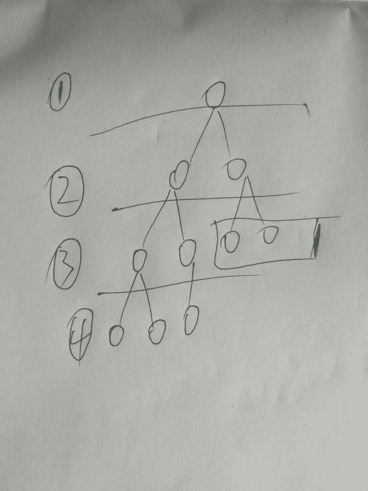
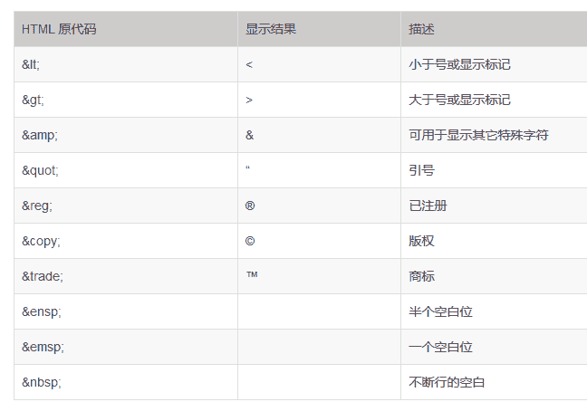
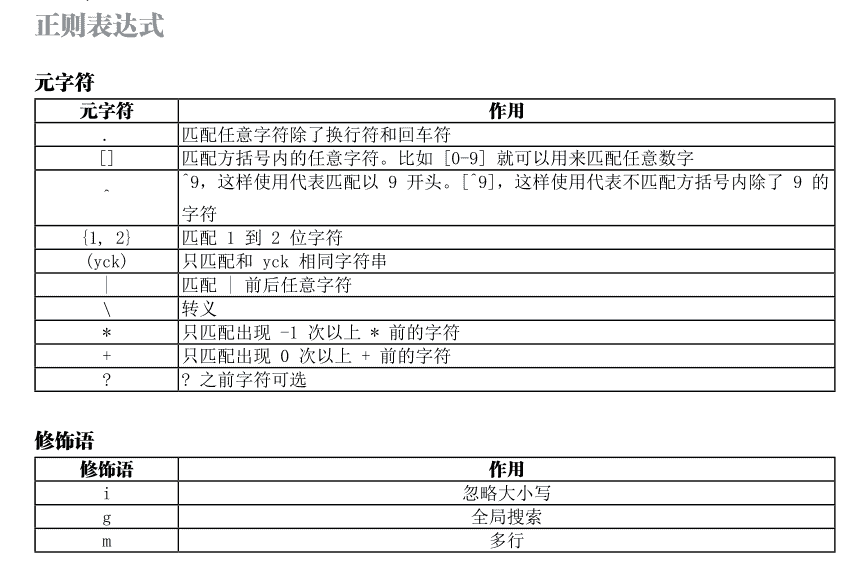

# 网易 2018 校招前端开发工程师笔试卷

## 1

下面关于进程和线程的关系不正确的是？（）

正确答案: D   你的答案: 空 (错误)

```cpp
线程是进程的一个实体，可作为系统独立调度和分派的基本单位。
```

```cpp
一个进程中多个线程可以并发执行。
```

```cpp
线程可以通过相互之间协同来完成进程所要完成的任务。
```

```cpp
线程之间不共享进程中的共享变量和部分环境。
```

本题知识点

网易 前端工程师 2018

讨论

[QQ 群](https://www.nowcoder.com/profile/968354)

线程之间***共享***进程中的共享变量和部分环境

发表于 2018-07-22 15:37:03

* * *

## 2

某系统中有 12 台设备,由 K 个进程竞争使用,每个进程最多需要 4 台设备。该系统可能会发生死锁的 K 的最小值是()

正确答案: B   你的答案: 空 (错误)

```cpp
3
```

```cpp
4
```

```cpp
5
```

```cpp
6
```

本题知识点

网易 前端工程师 2018

讨论

[薛定鄂的猫咪](https://www.nowcoder.com/profile/498036937)

一共有 12 台设备，最多每个进程需要 4 台。先实际分配给每个进程 3 台。最多 K 台不死锁。有如下等式：3*K+ 1 <= 12   得出 K=3 题目问的是：最少多少个进程使得会发生死锁。故 K+1 = 4 个进程。

发表于 2019-08-02 13:49:55

* * *

[Dianlll](https://www.nowcoder.com/profile/821368)

考虑极端情况，只要满足 3k+1=12 就不会死锁

发表于 2019-07-30 20:16:00

* * *

[QQ 群](https://www.nowcoder.com/profile/968354)

3 台及以下都不需要进行进程调配，所以肯定不会出现死锁。故而选 B：4 台

发表于 2018-07-22 15:37:59

* * *

## 3

二分查找算法不能在下面哪个数据结构中使用？（）

正确答案: A   你的答案: 空 (错误)

```cpp
sorted linked list
```

```cpp
sorted binary trees
```

```cpp
sorted linear array
```

```cpp
sorted pointer array
```

本题知识点

网易 前端工程师 2018

讨论

[QQ 群](https://www.nowcoder.com/profile/968354)

二分查找方法 不能用于链表！所以，A 选项是链表数据结构，肯定不能用二分查找

发表于 2018-07-22 15:38:44

* * *

[ccessl](https://www.nowcoder.com/profile/5948981)

二分查找不能用于链表

发表于 2018-06-20 10:13:12

* * *

## 4

从 1000000000000 个数中选择最小的 20 个数，用以下哪种排序算法比较方便？（）

正确答案: D   你的答案: 空 (错误)

```cpp
归并排序
```

```cpp
插入排序
```

```cpp
快速排序
```

```cpp
堆排序
```

本题知识点

网易 前端工程师 2018

讨论

[427894957](https://www.nowcoder.com/profile/427894957)

堆排序适合处理大量数据的排序问题

发表于 2019-08-02 21:02:19

* * *

[Ped](https://www.nowcoder.com/profile/9416754)

有人解释一下这道题吗？

发表于 2019-05-30 00:04:09

* * *

## 5

下面不属于 TCP 协议拥塞控制部分的是 （      ）

正确答案: C   你的答案: 空 (错误)

```cpp
快速重传
```

```cpp
慢启动
```

```cpp
带外数据
```

```cpp
快速恢复
```

本题知识点

网易 前端工程师 前端工程师 网易 2018

讨论

[保庇节后中奖🙏](https://www.nowcoder.com/profile/5206054)

TCP 的拥塞控制由 4 个核心算法组成：“慢启动”（Slow Start）、“拥塞避免”（Congestion voidance）、“快速重传 ”（Fast Retransmit）、“快速恢复”（Fast Recovery）

发表于 2018-08-11 14:25:50

* * *

## 6

以下意图那个是用来描述 ADAPTER（适配器）?（      ）

正确答案: B   你的答案: 空 (错误)

```cpp
定义一个用于创建对象的接口，让子类决定实例化哪一个类
```

```cpp
将一个类的接口转换成客户希望的另外一个接口。本模式使得原本由于接口不兼容而不能一起工作的那些类一起工作
```

```cpp
将一个请求封装为一个对象，从而使你可用不同的请求对客户进行参数化；对请求排队或记录请求日志，以及支持可撤销的操作
```

```cpp
表示一个作用于某对象结构中的各元素的操作。它使你可以在不改变各元素的类的前提下作用于这些元素的新操作
```

本题知识点

网易 前端工程师 前端工程师 网易 2018

讨论

[Kiw](https://www.nowcoder.com/profile/961873525)

适配器模式（Adapter）的定义如下：将一个类的接口转换成客户希望的另外一个接口，使得原本由于接口不兼容而不能一起工作的那些类能一起工作。适配器模式分为类结构型模式和对象结构型模式两种，前者类之间的耦合度比后者高，且要求程序员了解现有组件库中的相关组件的内部结构，所以应用相对较少些。

发表于 2020-04-10 21:54:01

* * *

[点滴成书](https://www.nowcoder.com/profile/665654190)

看错题，，，也是醉醉的了

发表于 2018-08-30 13:29:00

* * *

[QQ 群](https://www.nowcoder.com/profile/968354)

适配器：将一个类的接口转换成客户希望的另外一个接口。本模式使得原本由于接口不兼容而不能一起工作的那些类可以一起工作。

发表于 2018-07-22 15:40:22

* * *

## 7

对算法估计空间复杂度，关注的是

正确答案: B   你的答案: 空 (错误)

```cpp
程序代码占用的空间
```

```cpp
程序使用的辅助空间
```

```cpp
程序运行占用的总空间
```

```cpp
程序使用的数据空间
```

本题知识点

网易 前端工程师 前端工程师 网易 2018

讨论

[QQ 群](https://www.nowcoder.com/profile/968354)

算法空间复杂度：程序使用的辅助空间

发表于 2018-07-22 15:40:57

* * *

## 8

某单链表中最常用的操作是在最后一个元素之后插入一个元素和删除链表中给定的元素，则下列选项中正确的是 ________。

正确答案: A   你的答案: 空 (错误)

```cpp
若仅有头指针，则插入操作及删除操作均是 O(n)的
```

```cpp
增加尾指针既能提升插入操作的效率，也能提升删除操作的效率
```

```cpp
既有头指针又有尾指针，则插入操作及删除操作均是 O(1)的
```

```cpp
既有头指针又有尾指针，则插入操作及删除操作均是 O(n)的
```

本题知识点

网易 前端工程师 前端工程师 网易 2018

讨论

[你把你 offer 给我交了](https://www.nowcoder.com/profile/7815107)

如果有尾指针，因为插入是在尾部的，那么插入是 o(1)，删除还是 o(n)，因为删除都是要从头开始遍历的

发表于 2018-07-18 08:36:32

* * *

[QQ 群](https://www.nowcoder.com/profile/968354)

头指针+尾指针：删除操作是 o(1)，插入操作是 o(n)。添加尾指针：提升了删除的效率，没提高插入的效率。

发表于 2018-07-22 15:42:30

* * *

## 9

已知一棵高度为 4 的完全二叉树的第 4 层（设根为第 1 层）有 3 个叶结点，则该完全二叉树第 3 层的叶结点个数是 ________。

正确答案: B   你的答案: 空 (错误)

```cpp
1
```

```cpp
2
```

```cpp
3
```

```cpp
4
```

本题知识点

网易 前端工程师 前端工程师 网易 2018

讨论

[Biking](https://www.nowcoder.com/profile/714395942)



发表于 2018-08-19 11:20:06

* * *

[。。哼](https://www.nowcoder.com/profile/4004087)

不是吧，这样的话第二层就有叶子节点了，不满足完全二叉树的定义吧：叶子节点只能出现在二叉树的最下两层

发表于 2018-08-18 20:46:04

* * *

[你说啥我听不清](https://www.nowcoder.com/profile/569458946)

这是个坑啊，人家问的是叶子结点，我没仔细看，以为问第三层有多少个结点呢

发表于 2020-08-23 16:40:52

* * *

## 10

将一个整数序列整理为升序，两趟处理后序列变为 10,12,21,9,7,3,4,25，则采用的排序算法可能是 ________。

正确答案: A   你的答案: 空 (错误)

```cpp
插入排序
```

```cpp
选择排序
```

```cpp
快速排序
```

```cpp
堆排序
```

本题知识点

网易 前端工程师 前端工程师 网易 2018

讨论

[是函数不是方法](https://www.nowcoder.com/profile/7255829)

**求问快速排序为啥不行。**插入排序我明白是：经过第 2 趟，前 3 个数就会排好序。但是快速排序也是可以的啊，明明有两个数都已经放到正确位置了 T^T

发表于 2018-06-22 14:54:14

* * *

[offer 快来砸我吧](https://www.nowcoder.com/profile/227012346)

选择排序不是先把第一个当最小值吗然后选择出最小的来交换吗，为什么选择不行

发表于 2021-04-23 08:20:09

* * *

[请叫我小狮子的尾巴](https://www.nowcoder.com/profile/6743854)

感觉堆排序是可以的啊

发表于 2020-09-11 21:16:43

* * *

## 11

一个栈的入栈序列是 1、2、3、4、5，则栈的不可能输出序列是：（）

正确答案: B   你的答案: 空 (错误)

```cpp
12345
```

```cpp
43512
```

```cpp
54321
```

```cpp
45321
```

本题知识点

网易 前端工程师 前端工程师 网易 2018

## 12

在 JavaScript 中下面选项
关于 this 描述正确的是

正确答案: A   你的答案: 空 (错误)

```cpp
在使用 new 实例化对象时, this 指向这个实例对象
```

```cpp
当对象调用函数或者方法时,this 指向这个对象。
```

```cpp
在函数定义时,this 指向全局变量
```

```cpp
在浏览器下的全局范围内，this 指向全局对象
```

本题知识点

网易 前端工程师 2018

讨论

[QQ 群](https://www.nowcoder.com/profile/968354)

在使用 new 实例化对象时，this 指向这个实例对象

发表于 2018-07-22 15:43:52

* * *

[bettermeooo](https://www.nowcoder.com/profile/6153956)

怎么感觉 BCD 也对呢，请哪位大神讲解下~

发表于 2018-08-10 17:47:16

* * *

[鲁小溪 Angela](https://www.nowcoder.com/profile/5620727)

B：若这个函数或方法是这个对象的属性时，则 this 指向这个对象。若这个函数或者方法不是这个对象的属性，使用 o.函数名()调用会报错，找不到这个方法。

```cpp

		  var o  =  {

		  x:30, 

		  getX:function(){

		 return this.x; 

		  }

		  }; 

		  console.log(o.getX()); 

```

注：还有一种情况，就是对象方法里面还有方法，对象调用里面的这个方法，指向的是 window 对象。C：函数的 this 取值只有在函数被调用时才知道。D：感觉像是对的，有知道的求告知。

编辑于 2018-09-13 10:16:51

* * *

## 13

```cpp
var arr=[];

```

typeof arr 的结果是:

正确答案: B   你的答案: 空 (错误)

```cpp
array
```

```cpp
object
```

```cpp
function
```

```cpp
undefined
```

本题知识点

网易 前端工程师 2018

## 14

以下代码的执行结果是什么？

```cpp
var string = 'string';
var number = 0;
var bool = true;
console.log(number || string);
console.log(number && string);
console.log(bool || number);
console.log(bool && number);
```

正确答案: A   你的答案: 空 (错误)

```cpp
'string', 0, true, 0
```

```cpp
'string', 'string', true, 0
```

```cpp
'string', true, 0, 0
```

```cpp
'string', 0, true, true
```

本题知识点

网易 前端工程师 2018

讨论

[鲁小溪 Angela](https://www.nowcoder.com/profile/5620727)

此题有两个知识点：1.数据转换为布尔值。转换为 false 的有：0，空字符串，undefined，null，NaN。2.&&和||操作的返回值。&&：遇到转换为 false 的项就停止计算，返回该项。如果都为 true，返回最后一项。||：遇到转换为 true 的项就停止计算，返回该项。如果都为 false，返回最后一项。

编辑于 2018-09-13 11:01:49

* * *

[若即若离 2524](https://www.nowcoder.com/profile/4038639)

进行逻辑&&，|| 操作时先将两边变量转变为布尔类型 a||b   若 a 为真，则不再判断 b 直接返回 a 的值  bool||number=bool=true       若 a 为假，则表达式结果由 b 决定，直接返回 b 的值，0||"string"  ="string"a&&b  若 a 为真，则表达式结果由 b 决定，直接返回 b 的值，bool&&number=number=0          若 a 为假，则不再判断 b 直接返回 a 的值, 0&&"string"  =0

发表于 2018-08-11 11:50:41

* * *

## 15

以下代码的执行结果是什么？

```cpp
setTimeout(function() {
    console.log(1);
}, 100);
setTimeout(function() {
    console.log(2);
}, 0);
console.log(3);
```

正确答案: B   你的答案: 空 (错误)

```cpp
1, 2, 3
```

```cpp
3, 2, 1
```

```cpp
2, 1, 3
```

```cpp
2, 3, 1
```

本题知识点

网易 前端工程师 2018

讨论

[QQ 群](https://www.nowcoder.com/profile/968354)

下面代码输出结果：3 2 1

```cpp
setTimeout(function() { console.log(1);
}, 100); setTimeout(function() { console.log(2);
}, 99); console.log(3);
```

下面代码输出结果：3 1 2

```cpp
 ```
setTimeout(function() { console.log(1);
}, 100); setTimeout(function() { console.log(2);
}, 100); console.log(3);
```cpp 
```

发表于 2018-07-22 15:48:00

* * *

[sunnyww](https://www.nowcoder.com/profile/964650883)

同步任务与异步任务：

1.  先执行执行栈中的同步任务；
2.  将异步任务（回调函数）放入任务队列中；
3.  一旦执行栈中的所有同步任务执行完毕，系统会依次读取任务队列中的异步任务，被读取的异步任务结束等待状态，进入执行栈，开始执行。

发表于 2019-09-20 09:51:05

* * *

## 16

HTML5 中关于 section 元素使用正确的是

正确答案: D   你的答案: 空 (错误)

```cpp
通常将 section 元素用做设置样式的页面容器
```

```cpp
推荐使用 section 元素代替 article 元素、aside 元素、或 nav 元素
```

```cpp
在没有标题的内容区块应该使用 section 元素
```

```cpp
如果你想把一块内容分成几块时，应该使用 section 元素
```

本题知识点

网易 前端工程师 2018 HTML

讨论

[honng](https://www.nowcoder.com/profile/633961032)

看过一点 apple 官网首页源码，每一件商品，就是一个 section

编辑于 2020-12-17 19:06:52

* * *

[莫忘少年凌雲志](https://www.nowcoder.com/profile/183345630)

section 元素： section 元素 是 html5 中新增加的结构元素，它有更进一步的语义。表示页面中的一个内容区块，比如章节、页眉、页脚，或者页面中的其他部分。它可以与 h1, h2, h3, h4, h5 等元素结合起来使用，表示文档结构。

发表于 2020-08-31 15:31:39

* * *

[一分很准](https://www.nowcoder.com/profile/901660721)

section 元素： section 元素 是 html5 中新增加的结构元素，它有更进一步的语义。表示页面中的一个内容区块，比如章节、页眉、页脚，或者页面中的其他部分。它可以与 h1, h2, h3, h4, h5 等元素结合起来使用，表示文档结构。

发表于 2021-11-03 10:43:48

* * *

## 17

下列哪些不属于 HTML input 元素种类：

正确答案: D   你的答案: 空 (错误)

```cpp
search
```

```cpp
datetime
```

```cpp
range
```

```cpp
bool
```

本题知识点

网易 前端工程师 2018 HTML

讨论

[my 足迹](https://www.nowcoder.com/profile/7837208)

HTML input 元素种类 emailurlnumberrangeDate pickers(date, month, week, time, datetime, datetime-local)searchcolor

编辑于 2019-08-03 10:18:05

* * *

[sunnyww](https://www.nowcoder.com/profile/964650883)

*   text password radio checkbox submit reset file image search button
*   email url number **range** color
*   关于时间 (date, month, week, time, datetime, datetime-local)

发表于 2019-09-20 10:02:07

* * *

[牛客 191620233 号](https://www.nowcoder.com/profile/191620233)

datetime 谷歌也解析不了，应该得用 datetime-local

发表于 2021-03-12 14:43:39

* * *

## 18

下列哪些不是伪元素选择器：

正确答案: D   你的答案: 空 (错误)

```cpp
first-line
```

```cpp
first-letter
```

```cpp
before
```

```cpp
behind
```

本题知识点

网易 前端工程师 2018

讨论

[QQ 群](https://www.nowcoder.com/profile/968354)

```cpp
:first-line：为元素的第一行文字设置样式
:first-letter：为元素的文本内容的第一个字／字母设置样式
:before：在某个元素之前插入内容
:after：在某个元素之后插入内容。所以不是 behind。
```

发表于 2018-06-01 17:36:29

* * *

## 19

JavaScript 中 window 对象的子对象不包含以下那个对象：

正确答案: D   你的答案: 空 (错误)

```cpp
document
```

```cpp
history
```

```cpp
self
```

```cpp
message
```

本题知识点

网易 前端工程师 2018

讨论

[QQ 群](https://www.nowcoder.com/profile/968354)

self 属性：返回指向当前 window 对象的引用，利用这个属性，可以保证在多个窗口被打开的情况下，正确调用当前窗口内的函数或属性而不会发生混乱。self 属性是只读的。

发表于 2018-07-22 15:56:47

* * *

## 20

小易有一些彩色的砖块。每种颜色由一个大写字母表示。各个颜色砖块看起来都完全一样。现在有一个给定的字符串 s,s 中每个字符代表小易的某个砖块的颜色。小易想把他所有的砖块排成一行。如果最多存在一对不同颜色的相邻砖块,那么这行砖块就很漂亮的。请你帮助小易计算有多少种方式将他所有砖块排成漂亮的一行。(如果两种方式所对应的砖块颜色序列是相同的,那么认为这两种方式是一样的。)
例如: s = "ABAB",那么小易有六种排列的结果:
"AABB","ABAB","ABBA","BAAB","BABA","BBAA"
其中只有"AABB"和"BBAA"满足最多只有一对不同颜色的相邻砖块。

本题知识点

网易 前端工程师 模拟 字符串 *2018* *讨论

[waitforuwen](https://www.nowcoder.com/profile/3076139)

```cpp
/*

	一个颜色有一种

	两个颜色有两种

	超过两个没有种

*/
var a = readline().split("");
var len = Array.from(new Set(a)).length;
print(len<=2?len:0);
```

发表于 2018-07-12 14:56:05

* * *

[你把你 offer 给我交了](https://www.nowcoder.com/profile/7815107)

```cpp
//本题关键点在于有多少个异色，而不是字符串长度。
var lines = readline().split('');
 var arr = [];
 for (var i = 0; i < lines.length; i++) {
    var cur = lines[i];
    // 等价于数组的去重
    if (arr.indexOf(cur) === -1)
        arr.push(cur);
}

// 一旦达到 3 个数字了，必定就不止 1 个异色了
if (arr.length > 2) { 
    print(0);
} else if (arr.length === 2) {
    print(2);
} else {
    print(1);
}
```

编辑于 2018-07-18 10:06:39

* * *

[巴拉拉拉](https://www.nowcoder.com/profile/4826142)

计算一共有多少种颜色，如果 1 种返回 1，2 种返回 2，超过两种颜色则至少有 2 个相邻不同颜色的砖块，不符合要求，返回 0

发表于 2018-05-29 19:36:09

* * *

## 21

如果一个 01 串任意两个相邻位置的字符都是不一样的,我们就叫这个 01 串为交错 01 串。例如: "1","10101","0101010"都是交错 01 串。
小易现在有一个 01 串 s,小易想找出一个最长的连续子串,并且这个子串是一个交错 01 串。小易需要你帮帮忙求出最长的这样的子串的长度是多少。

本题知识点

网易 前端工程师 字符串 *2018* *讨论

[你把你 offer 给我交了](https://www.nowcoder.com/profile/7815107)

```cpp
 let lines = readline().split('');
    let temp = lines[0]; //取数组的第一个为 temp，比如说是 0
    let len = 1;
    let maxLen = 1;
    for (let i = 1; i < lines.length; i++) {
        //计算出从下一个数字开始的非 0 个数。特别巧妙，注意 i 从 1 开始
        if (lines[i] != temp) {
            len++;
        }
        else {
            len = 1; //一旦遇到当前值和临时值相等时，len 重置为 1
        }
        //将 temp 设为当前 i
        temp = lines[i]; 
        // 设置 maxLen 是为了怕 len 又重置为 1 了
        if (maxLen < len) {
            maxLen = len
        }
    }
    console.log(maxLen); 
```

发表于 2018-07-18 15:49:30

* * *

[蚂蚁快到碗里来](https://www.nowcoder.com/profile/9356835)

```cpp
#include<stdio.h>
#include<string.h>
int main(){
    char s[51];
    while(scanf("%s",s)!=EOF){
        int length = strlen(s);
        char pre = '9';
        int max = 1;
        int count = 0;
        for(int i=0;i<length;i++){
            if(s[i]!=pre){
                count++;
            } else {
                count = 1;
            }
            pre = s[i];
            max = max<count? count:max;
        }
        printf("%d",max);
    }
    return 0;
}

```

发表于 2018-10-11 15:41:50

* * *

[牛客 137496344 号](https://www.nowcoder.com/profile/137496344)

```cpp
var s = readline();
var max = 1; //记录最大的子字符串长度（子字符串最小为 1）
var ans = 1; //记录目前的子字符串长度
for(var i=1;i<s.length;i++){
    if(s[i]!=s[i-1]){
        ans++; //前后两个字符相同，长度+1
    }else{
        ans = 1; //不同就重新置为 1，继续下一段的比较
    }
    if(max<ans){ //与最大的比较，取最大
        max = ans;
    }
}
console.log(max);
```

发表于 2020-08-08 11:55:06

* * *

## 22

小易为了向他的父母表现他已经长大独立了,他决定搬出去自己居住一段时间。一个人生活增加了许多花费: 小易每天必须吃一个水果并且需要每天支付 x 元的房屋租金。当前小易手中已经有 f 个水果和 d 元钱,小易也能去商店购买一些水果,商店每个水果售卖 p 元。小易为了表现他独立生活的能力,希望能独立生活的时间越长越好,小易希望你来帮他计算一下他最多能独立生活多少天。

本题知识点

网易 前端工程师 模拟 数学 贪心 2018

讨论

[前端-阿来](https://www.nowcoder.com/profile/488789122)

```cpp
//分析题意可能以下几种：
//1.吃完自带水果还有钱。
//2.刚好吃完说过也没钱了（都用来交房租了）。
//3.自带水果有剩余情况，但房租够一天。
//4.房租不够住一天。
//代码：
let lines = readline().split(' ');
let x = lines[0] - 0;//租金
let f = lines[1] - 0;//手上的水果
let d = lines[2] - 0;//手上的钱
let p = lines[3] - 0;//水果价格
if(x*f < d)
{
    let s = d-(x*f);//生活 f 天后剩余的钱
    let t = parseInt(s / (x+p));
        print(t+f);//总天数
       }//if end
else{
    if(x*f == d)//刚好生活 f 天的情况
    {
        print(f);
    }
    else{
        d/x>1?print(d/x):print(0);   //多余一天但少于 f 天的情况和不足一天的情况 
    }
}
```

编辑于 2019-08-02 15:15:30

* * *

[爱笑的猫🐱](https://www.nowcoder.com/profile/855994181)

var line=readline().split(" ");var x=parseInt(line[0]);var f=parseInt(line[1]);var d=parseInt(line[2]);var p=parseInt(line[3]);function exist(x,f,d,p){   if((x*f)<d){        var res=d-x*f;        var day=Math.floor(res/(x+p));        returnMath.floor(f+day);    }else{        returnMath.floor(d/x)    }}console.log(exist(x,f,d,p))

发表于 2019-07-29 21:45:11

* * *

[呐呐呐呐呐呐 201812111136406](https://www.nowcoder.com/profile/998502532)

```cpp
var arr = readline().split(" ");
var x = parseInt(arr[0]);     //3   注意此处要转为数字类型，不转的话 9 行出错 
var f = parseInt(arr[1]);     //5
var d = parseInt(arr[2]);     //100
var p = parseInt(arr[3]);     //10
if(f * x >= d){
    print(Math.floor(d/x));
}else if(f * x < d){
    print(Math.floor(  (d - f*x)  /(p + x))  + f); 
    //如果上面不转数字类型，就是字符串相加为字符串，导致结果出错
}

```

发表于 2019-02-24 23:39:05

* * *

## 23

下面可以匹配

> </img>

的正则表达式是？

正确答案: D   你的答案: 空 (错误)

```cpp
&lt;img src=&quot;[.&quot;]*&gt;&lt;/img&gt;
```

```cpp
&lt;img src=&quot;[.&quot;]*&quot;&gt;&lt;/img&gt;
```

```cpp
&lt;img src=&quot;[^&quot;]*&gt;&lt;/img&gt;
```

```cpp
&lt;img src=&quot;[^&quot;]*&quot;&gt;&lt;/img&gt;
```

本题知识点

网易 前端工程师 前端工程师 网易 2018

讨论

[小霞霞 568](https://www.nowcoder.com/profile/2835751)

1、html 的特殊字符：
2、正则表达式相关介绍：

发表于 2018-08-26 16:49:56

* * *

[Ice 五封](https://www.nowcoder.com/profile/679005287)

```cpp

```
&lt;img src=&quot;    

[^&quot;]*   //  []里面的^表示 非， *表示任意数量，这一段的意思是： 匹配 任意数量的不为"的字符

&quot;&gt;&lt;/img&gt;   // "></img>
```cpp

```

编辑于 2019-08-02 09:53:25

* * ***