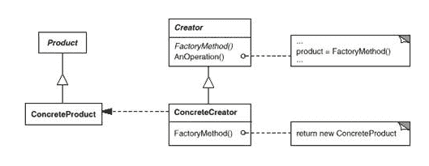

# 网易 2018 校招 iOS 开发工程师笔试卷

## 1

以下代码

```cpp
int x (int n) {
    if (n <= 3)
        return 1;
    else
        return x (n - 2) + x (n - 4) + 1;
}
int main (void) {
    printf ("%d\n", x (x (8)));
    return 0;
}
```

的输出和 x 函数被调用的次数分别是？（）

正确答案: A   你的答案: 空 (错误)

```cpp
9 和 18
```

```cpp
9 和 9
```

```cpp
2 和 12
```

```cpp
2 和 18
```

本题知识点

网易 iOS 工程师 2018 C++ C 语言

讨论

[子 _ 君](https://www.nowcoder.com/profile/501714313)

```cpp
int x (int n) {     //这里 X 是一个函数
    if (n <= 3)
        return 1;
    else
        return x (n - 2) + x (n - 4) + 1;    //这一个式子仍将调用 x 函数
}
int main (void) {
    printf ("%d\n", x (x (8)));    //这里的 x(x(8))可以看成两层，一层是内层 x(8),第二层则是另外一个 x
    return 0;
}
```

第一次调用 x（8），8>3,执行 x (n - 2) + x (n - 4) + 1;
这是第**1**次调用，将 8 代入得到 x(6)+x(4)+1;继续调用 x 函数，由于 6 和 4 都大于 3，所以上一步得到的式子调用了**2**次 x 函数，得到结果 x(4）+x(2)+1+x(2)+x(0)+1+1；上述式子中，又需要调用**4**次 x 函数，并得到式子 x(2）+x(0）+1+1+1+1+1+1+1；这里又调用了***2***次 x 函数，最后 return 9；则第一层调用的 x 次数为：1+2+4+2=9 次**到了第二层，为 x(9)，继续上述执行思路，可得到结果：第二次也是调用了 9 次 x 函数****注：首次解答，如有错误地方，还望指出。希望能和大家一起交流学习！**

发表于 2021-03-28 21:19:22

* * *

[天地间过](https://www.nowcoder.com/profile/912762093)

我建议把 8 改为 100000，这样才有意义

发表于 2020-08-17 15:57:48

* * *

[牛客 814170611 号](https://www.nowcoder.com/profile/814170611)

考耐心和细心的、

发表于 2021-03-18 12:28:12

* * *

## 2

下面关于进程和线程的关系不正确的是？（）

正确答案: D   你的答案: 空 (错误)

```cpp
线程是进程的一个实体，可作为系统独立调度和分派的基本单位。
```

```cpp
一个进程中多个线程可以并发执行。
```

```cpp
线程可以通过相互之间协同来完成进程所要完成的任务。
```

```cpp
线程之间不共享进程中的共享变量和部分环境。
```

本题知识点

网易 iOS 工程师 iOS 工程师 网易 2018

## 3

代码生成阶段的主要任务是：

正确答案: C   你的答案: 空 (错误)

```cpp
把高级语言翻译成机器语言
```

```cpp
把高级语言翻译成汇编语言
```

```cpp
把中间代码变换成依赖具体机器的目标代码
```

```cpp
把汇编语言翻译成机器语言
```

本题知识点

网易 iOS 工程师 2018

讨论

[666 的佩奇爸爸](https://www.nowcoder.com/profile/7670357)

答案：C。

代码生成阶段的主要任务是把中间代码（或经优化处理之后）变换成特定机器上的低级语言代码，它的工作有赖于硬件系统结构和机器指令含义。选项 C 正确。

发表于 2018-07-08 13:43:01

* * *

## 4

二分查找算法不能在下面哪个数据结构中使用？（）

正确答案: A   你的答案: 空 (错误)

```cpp
sorted linked list
```

```cpp
sorted binary trees
```

```cpp
sorted linear array
```

```cpp
sorted pointer array
```

本题知识点

网易 iOS 工程师 iOS 工程师 网易 2018

## 5

对算法估计空间复杂度，关注的是

正确答案: B   你的答案: 空 (错误)

```cpp
程序代码占用的空间
```

```cpp
程序使用的辅助空间
```

```cpp
程序运行占用的总空间
```

```cpp
程序使用的数据空间
```

本题知识点

网易 iOS 工程师 2018

## 6

将一个整数序列整理为升序，两趟处理后序列变为 10,12,21,9,7,3,4,25，则采用的排序算法可能是 ________。

正确答案: A   你的答案: 空 (错误)

```cpp
插入排序
```

```cpp
选择排序
```

```cpp
快速排序
```

```cpp
堆排序
```

本题知识点

网易 iOS 工程师 iOS 工程师 网易 2018

## 7

若某二叉树的中序遍历访问顺序是 47215386，前序遍历访问顺序是 12473568，则其后序遍历的结点访问顺序是（ ）

正确答案: A   你的答案: 空 (错误)

```cpp
74258631
```

```cpp
83451267
```

```cpp
64358721
```

```cpp
74258361
```

本题知识点

网易 iOS 工程师 iOS 工程师 网易 2018

## 8

一个栈的入栈序列是 1、2、3、4、5，则栈的不可能输出序列是：（）

正确答案: B   你的答案: 空 (错误)

```cpp
12345
```

```cpp
43512
```

```cpp
54321
```

```cpp
45321
```

本题知识点

网易 iOS 工程师 iOS 工程师 网易 2018

## 9

下面的类图表明了哪个模式?

正确答案: D   你的答案: 空 (错误)

```cpp
责任链模式
```

```cpp
命令模式
```

```cpp
备忘录模式
```

```cpp
工厂方法模式
```

本题知识点

网易 iOS 工程师 iOS 工程师 网易 2018

## 10

可以通过以下哪种方式查看系统内存使用情况

正确答案: A   你的答案: 空 (错误)

```cpp
free -g
```

```cpp
top
```

```cpp
ps
```

```cpp
df
```

本题知识点

网易 iOS 工程师 iOS 工程师 网易 2018

## 11

将当前命令 sh test.sh 任务在后台执行，下列最优雅的的做法是

正确答案: C   你的答案: 空 (错误)

```cpp
sh test.sh &amp;
```

```cpp
nohup sh test.sh
```

```cpp
nohup sh test.sh &amp;
```

```cpp
nohup sh test.sh &amp;&amp;
```

本题知识点

网易 iOS 工程师 iOS 工程师 网易 2018

## 12

截取 logfile 文件中含有 suc 的行，并且只输出最后一列，下列操作正确的是:

正确答案: C   你的答案: 空 (错误)

```cpp
grep -o 'suc' logfile | awk '{print $0}'
```

```cpp
grep 'suc' logfile | awk '{print $0}'
```

```cpp
grep 'suc' logfile | awk '{print $NF}'
```

```cpp
grep -o 'suc' logfile | awk '{print $NF}'
```

本题知识点

网易 iOS 工程师 2018

## 13

哪个不是 DDL(数据库定义语言)语句？

正确答案: D   你的答案: 空 (错误)

```cpp
ALTER
```

```cpp
CREATE
```

```cpp
RENAME
```

```cpp
GRANT
```

本题知识点

网易 iOS 工程师 2018

## 14

要实现不停下雨的功能，用一下哪个功能较好？

正确答案: C   你的答案: 空 (错误)

```cpp
NSTimer
```

```cpp
GCD
```

```cpp
CADisplayLink
```

```cpp
RunLoop
```

本题知识点

网易 iOS 工程师 2018

## 15

后台下发的字段在控制台打印的是<null>，请问接收到是什么类型？

正确答案: B   你的答案: 空 (错误)

```cpp
nil
```

```cpp
NSNull
```

```cpp
Nil
```

```cpp
NULL
```

本题知识点

网易 iOS 工程师 2018

## 16

当宏定义需要定义多行代码时，会使用下列哪个符号（）

正确答案: C   你的答案: 空 (错误)

```cpp
|
```

```cpp
/
```

```cpp
\
```

```cpp
-
```

本题知识点

网易 iOS 工程师 2018 C++ C 语言

讨论

[烟火流沙](https://www.nowcoder.com/profile/223263101)

在行尾放一个 \ ，编译器会忽略行尾的换行符，起到续行的作用。

发表于 2020-08-07 20:51:10

* * *

[为了 offer—](https://www.nowcoder.com/profile/443925925)

> 在行尾放一个 \ 转义字符，编译器会将行尾的换行符转义掉，起到续行的作用。

发表于 2021-05-30 10:08:12

* * *

[诸葛大大力力](https://www.nowcoder.com/profile/618322077)

[烟火流沙](https://www.nowcoder.com/profile/223263101) 在行尾放一个 \ ，编译器会忽略行尾的换行符，起到续行的作用。发表于 2020-08-07 20:51:10 回复(0)1[为了 offer—](https://www.nowcoder.com/profile/443925925)

> 在行尾放一个 \ 转义字符，编译器会将行尾的换行符转义掉，起到续行的作用。

发表于 2021-05-30 10:08:12

发表于 2021-09-17 16:09:21

* * *

## 17

下拉 tableview 过程中，逐渐改变导航栏背景色，需在下列哪个代理里获取到偏移量？

正确答案: B   你的答案: 空 (错误)

```cpp
-(void)scrollViewWillBeginDecelerating:(UIScrollView *)scrollView;
```

```cpp
-(void)scrollViewDidScroll:(UIScrollView *)scrollView;
```

```cpp
-(void)scrollViewDidZoom:(UIScrollView *)scrollView;
```

```cpp
-(void)tableView:(UITableView *)tableView moveRowAtIndexPath:(NSIndexPath&lt;br&gt;*)sourceIndexPath toIndexPath:(NSIndexPath *)destinationIndexPath;
```

本题知识点

网易 iOS 工程师 2018

## 18

不能正常为 people 的 address 属性赋值的有：

正确答案: B   你的答案: 空 (错误)

```cpp
people.address=@&ldquo;深圳&rdquo;;
```

```cpp
people-&gt;address =@&quot;深圳&rdquo;;
```

```cpp
[people setValue:@&quot;深圳&rdquo; forKey:@&quot;address&quot;];
```

```cpp
[people setAddress:@&quot;深圳&rdquo;];
```

本题知识点

网易 iOS 工程师 2018

## 19

如果一个数列 S 满足对于所有的合法的 i,都有 S[i + 1] = S[i] + d, 这里的 d 也可以是负数和零,我们就称数列 S 为等差数列。
小易现在有一个长度为 n 的数列 x,小易想把 x 变为一个等差数列。小易允许在数列上做交换任意两个位置的数值的操作,并且交换操作允许交换多次。但是有些数列通过交换还是不能变成等差数列,小易需要判别一个数列是否能通过交换操作变成等差数列

本题知识点

网易 iOS 工程师 贪心 数学 排序 *2018* *讨论

[vincen353](https://www.nowcoder.com/profile/545238076)

a

发表于 2021-10-22 17:38:29

* * *

[Disconnect](https://www.nowcoder.com/profile/4864974)

n = input()
n = int(n)
lst = sorted(map(int,input().split()))
cha = lst[1]-lst[0]
boo = True
for i in range(1,n-1):
    if cha!=lst[i+1]-lst[i]:
        print("Impossible")
        boo = False
        break
if boo:
    print("Possible")

发表于 2018-12-27 09:25:34

* * *

[凛 lyx](https://www.nowcoder.com/profile/9737182)

```cpp
import  sys
if  __name__ ==  "__main__":
    n =  int(sys.stdin.readline())
    line =  sys.stdin.readline().strip()
    array =  list(map(int, line.split()))
    # 差值为 0 的情况
    if  len(set(array)) ==  1:
        print("Possible")
    # 差值不为 0，则数列不可能出现数值相等的情况
    elif  len(array) !=  len(set(array)):
        print("Impossible")
    else:  # 数列排序
        array_r =  sorted(array)
        # 构造标准等差数列
        d =  array_r[1] -  array_r[0]
        n =  len(array)
        array_new =  [array_r[0] +  i*d for  i in  range(n)]
        # 两数列比较，没有差异项则为等差数列
        if  len(list(set(array_new).difference(set(array_r))))>0:
            print("Impossible")
        else:
            print("Possible")
```

发表于 2018-08-08 22:57:28

* * *

## 20

小易将 n 个棋子摆放在一张无限大的棋盘上。第 i 个棋子放在第 x[i]行 y[i]列。同一个格子允许放置多个棋子。每一次操作小易可以把一个棋子拿起并将其移动到原格子的上、下、左、右的任意一个格子中。小易想知道要让棋盘上出现有一个格子中至少有 i(1 ≤ i ≤ n)个棋子所需要的最少操作次数.

本题知识点

网易 iOS 工程师 模拟 2018

## 21

小易非常喜欢拥有以下性质的数列:
1、数列的长度为 n
2、数列中的每个数都在 1 到 k 之间(包括 1 和 k)
3、对于位置相邻的两个数 A 和 B(A 在 B 前),都满足(A <= B)或(A mod B != 0)(满足其一即可)
例如,当 n = 4, k = 7
那么{1,7,7,2},它的长度是 4,所有数字也在 1 到 7 范围内,并且满足第三条性质,所以小易是喜欢这个数列的
但是小易不喜欢{4,4,4,2}这个数列。小易给出 n 和 k,希望你能帮他求出有多少个是他会喜欢的数列。

本题知识点

网易 iOS 工程师 动态规划 2018

## 22

下面可以匹配

> </img>

的正则表达式是？

正确答案: D   你的答案: 空 (错误)

```cpp
&lt;img src=&quot;[.&quot;]*&gt;&lt;/img&gt;
```

```cpp
&lt;img src=&quot;[.&quot;]*&quot;&gt;&lt;/img&gt;
```

```cpp
&lt;img src=&quot;[^&quot;]*&gt;&lt;/img&gt;
```

```cpp
&lt;img src=&quot;[^&quot;]*&quot;&gt;&lt;/img&gt;
```

本题知识点

网易 iOS 工程师 iOS 工程师 网易 2018

## 23

下列代码的时间复杂度是多少()(^符号是幂的意思)

```cpp
int func(int N)
{
    int cnt = 0;
    for(int i=1;i<=N;i++)
        for(int j=1;j<=N;j+=i)
            cnt+=(i+j);
    return cnt;
}
```

正确答案: B   你的答案: 空 (错误)

```cpp
O(N)
```

```cpp
O(NlogN)
```

```cpp
O(N¹.5)
```

```cpp
O(N²)
```

本题知识点

网易 iOS 工程师 iOS 工程师 网易 2018*</null>