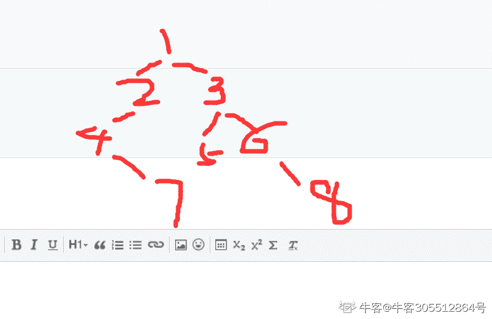

# 网易 2018 校招 Android 开发工程师笔试卷

## 1

下面关于进程和线程的关系不正确的是？（）

正确答案: D   你的答案: 空 (错误)

```cpp
线程是进程的一个实体，可作为系统独立调度和分派的基本单位。
```

```cpp
一个进程中多个线程可以并发执行。
```

```cpp
线程可以通过相互之间协同来完成进程所要完成的任务。
```

```cpp
线程之间不共享进程中的共享变量和部分环境。
```

本题知识点

网易 安卓工程师 安卓工程师 网易 2018

讨论

[温馨娜](https://www.nowcoder.com/profile/621772013)

线程和进程的区别在于子进程和父进程有不同的数据和代码空间，而多个线程则共享数据空间每个线程有自己的执行堆栈和程序计数器为其执行上下文

发表于 2018-08-10 08:52:01

* * *

## 2

下列有关线程的说法正确的是：（ ）

正确答案: D   你的答案: 空 (错误)

```cpp
启动一个线程是调用 start（）方法，是线程所代表的虚拟处理机处于可运行状态，这意味着线程此时就会立即运行。
```

```cpp
notify（）方法可以确切的唤醒某个处于等待状态的线程。
```

```cpp
wait（）方法可以使一个线程处于等待状态，但不会释放所持有对象的锁。
```

```cpp
sleep（）方法使一个正在运行的线程处于睡眠状态，是一个静态方法，调用此方法时，需要捕捉 InterruptedException 异常
```

本题知识点

网易 安卓工程师 安卓工程师 网易 2018

讨论

[Neo_17](https://www.nowcoder.com/profile/239143404)

```cpp
当用 start()开始一个线程后，线程就进入就绪状态，使线程所代表的虚拟处理机处于可运行状态，这意味着它可以由 JVM 调度并执行。这并不意味着线程就会立即运行。 wait():使一个线程处于等待状态，并且释放所持有的对象的 lock。 

sleep():使一个正在运行的线程处于睡眠状态，是一个静态方法，调用此方法要捕捉 InterruptedException 异常。

notify():唤醒一个处于等待状态的线程，注意的是在调用此方法的时候，并不能确切的唤醒某一个等待状态的线程，而是由 JVM 确定唤醒哪个线程，而且不是按优先级。
```

编辑于 2019-09-21 11:21:00

* * *

[风口的猪](https://www.nowcoder.com/profile/360132006)

notify():唤醒一个处于等待状态的线程，注意的是在调用此方法的时候，并不能确切的唤醒某一个等待状态的线程，而是由 JVM 确定唤醒哪个线程，而且不是按优先级。

发表于 2018-08-31 19:55:30

* * *

## 3

如果 C 类子网的掩码为 255.255.255.240，则包含的子网位数、子网数目、每个子网中的主机数目正确的是（ ）

正确答案: C   你的答案: 空 (错误)

```cpp
2 2 2
```

```cpp
3 6 30
```

```cpp
4 14 14
```

```cpp
5 30 6
```

本题知识点

网易 安卓工程师 安卓工程师 网易 2018

讨论

[东瑟啊呗](https://www.nowcoder.com/profile/549283426)

240 换成二进制为 11110000 ，前 4 位为子网位数，后四位为主机位数，所以子网数目=2⁴-2 = 14， 主机数目=2⁴-2 = 14，因为都要去掉全 0 全 1 的 ip

发表于 2019-08-01 10:48:39

* * *

## 4

从 1000000000000 个数中选择最小的 20 个数，用以下哪种排序算法比较方便？（）

正确答案: D   你的答案: 空 (错误)

```cpp
归并排序
```

```cpp
插入排序
```

```cpp
快速排序
```

```cpp
堆排序
```

本题知识点

网易 安卓工程师 安卓工程师 网易 2018

讨论

[温馨娜](https://www.nowcoder.com/profile/621772013)

典型的 N 取前 M 的题型，首先题目未说内存理想，根据常识 1 万亿=1T 的数据量，那么是无法一下全部放入内存的。

在内存有限情况下，可把数据先放在磁盘上，然后在内存开辟一个容纳 20 个数的最小堆。每次从磁盘上读取一个数，若最小堆未满，则直接放入最小堆中后调整堆；若最小堆已满，则将这个数与最小堆根结点上的数值进行比较，若比根结点的数值小，则替换掉根结点上的值，然后重新调整最小堆使其符合最小堆的性质。

遍历完 1 万亿个数后，这个最小堆里面存放的就是 20 个最小值了。

最后想到的是可使用并行计算，也就是堆排序与归并排序相结合

假设可先平均分为 Y 个堆，时间复杂度为 

再使用 X 个任务并行选出每堆的前 M 个最小数，该步时间复杂度为，此时生成了 Y 组长度为 M 的有序序列。

使用多路归并排序选出 Y 组序列中前 M 个数，此时的时间复杂度为 

总体时间复杂度为。至此算法达到了常数级别的优化。转自[`www.bslxx.com/a/mianshiti/tiku/2018/0408/1905.html`](http://www.bslxx.com/a/mianshiti/tiku/2018/0408/1905.html)

发表于 2018-08-10 16:24:39

* * *

## 5

以下意图那个是用来描述 ADAPTER（适配器）?（      ）

正确答案: B   你的答案: 空 (错误)

```cpp
定义一个用于创建对象的接口，让子类决定实例化哪一个类
```

```cpp
将一个类的接口转换成客户希望的另外一个接口。本模式使得原本由于接口不兼容而不能一起工作的那些类一起工作
```

```cpp
将一个请求封装为一个对象，从而使你可用不同的请求对客户进行参数化；对请求排队或记录请求日志，以及支持可撤销的操作
```

```cpp
表示一个作用于某对象结构中的各元素的操作。它使你可以在不改变各元素的类的前提下作用于这些元素的新操作
```

本题知识点

网易 安卓工程师 安卓工程师 网易 2018

讨论

[温馨娜](https://www.nowcoder.com/profile/621772013)

将一个类的接口转换成客户希望的另外一个接口。该模式使得原本由于接口不兼容而不能一起工作的那些类可以一起工作。适用场景如下：

*   已经存在的类的接口不符合我们的需求；
*   创建一个可以复用的类，使得该类可以与其他不相关的类或不可预见的类（即那些接口可能不一定兼容的类）协同工作；

*   在不对每一个都进行子类化以匹配它们的接口的情况下，使用一些已经存在的子类。
*   转自[`www.bslxx.com/a/mianshiti/tiku/2018/0408/1905.html`](http://www.bslxx.com/a/mianshiti/tiku/2018/0408/1905.html)

发表于 2018-08-10 16:30:41

* * *

## 6

对算法估计空间复杂度，关注的是

正确答案: B   你的答案: 空 (错误)

```cpp
程序代码占用的空间
```

```cpp
程序使用的辅助空间
```

```cpp
程序运行占用的总空间
```

```cpp
程序使用的数据空间
```

本题知识点

网易 安卓工程师 安卓工程师 网易 2018

讨论

[IFlipped](https://www.nowcoder.com/profile/858115101)

空间复杂度(Space Complexity)是对一个算法在运行过程中临时占用存储空间大小的量度[`baike.baidu.com/item/%E7%A9%BA%E9%97%B4%E5%A4%8D%E6%9D%82%E5%BA%A6/9664257?fr=aladdin`](https://baike.baidu.com/item/%E7%A9%BA%E9%97%B4%E5%A4%8D%E6%9D%82%E5%BA%A6/9664257?fr=aladdin)

发表于 2019-08-02 10:29:50

* * *

## 7

某单链表中最常用的操作是在最后一个元素之后插入一个元素和删除链表中给定的元素，则下列选项中正确的是 ________。

正确答案: A   你的答案: 空 (错误)

```cpp
若仅有头指针，则插入操作及删除操作均是 O(n)的
```

```cpp
增加尾指针既能提升插入操作的效率，也能提升删除操作的效率
```

```cpp
既有头指针又有尾指针，则插入操作及删除操作均是 O(1)的
```

```cpp
既有头指针又有尾指针，则插入操作及删除操作均是 O(n)的
```

本题知识点

网易 安卓工程师 安卓工程师 网易 2018

## 8

下列关于哈夫曼树的说法中，错误的是 ________。

正确答案: A   你的答案: 空 (错误)

```cpp
哈夫曼树是一棵完全二叉树
```

```cpp
哈夫曼树中没有度为 1 的结点
```

```cpp
哈夫曼树具有最小的带权路径长度
```

```cpp
同一组权值构造的哈夫曼树不唯一
```

本题知识点

网易 安卓工程师 2018

讨论

[头发还是这么短](https://www.nowcoder.com/profile/120902802)

A. 哈夫曼树与完全二叉树无关联性。节点的孩子节点可左可右

发表于 2020-08-16 20:26:46

* * *

## 9

若某二叉树的中序遍历访问顺序是 47215386，前序遍历访问顺序是 12473568，则其后序遍历的结点访问顺序是（ ）

正确答案: A   你的答案: 空 (错误)

```cpp
74258631
```

```cpp
83451267
```

```cpp
64358721
```

```cpp
74258361
```

本题知识点

网易 安卓工程师 2018

讨论

[听海.](https://www.nowcoder.com/profile/305512864)



发表于 2022-01-10 20:50:09

* * *

## 10

一个栈的入栈序列是 1、2、3、4、5，则栈的不可能输出序列是：（）

正确答案: B   你的答案: 空 (错误)

```cpp
12345
```

```cpp
43512
```

```cpp
54321
```

```cpp
45321
```

本题知识点

网易 安卓工程师 安卓工程师 网易 2018

## 11

可以通过以下哪种方式查看系统内存使用情况

正确答案: A   你的答案: 空 (错误)

```cpp
free -g
```

```cpp
top
```

```cpp
ps
```

```cpp
df
```

本题知识点

网易 安卓工程师 安卓工程师 网易 2018

讨论

[风口的猪](https://www.nowcoder.com/profile/360132006)

**[linux 命令 free、top](https://www.cnblogs.com/bingmengzhang/p/9024598.html)** **free**

```cpp
显示当前系统未使用的和已使用的内存状态，包括实体内存，虚拟的交换文件内存，共享内存区段，以及系统核心使用的缓冲区等
参数说明
-b：以 Byte 为单位显示内存使用情况；
-k：以 KB 为单位显示内存使用情况；
-m：以 MB 为单位显示内存使用情况；
-g 以 GB 为单位显示内存使用情况；
-o：不显示缓冲区调节列；
-s<间隔秒数>：持续观察内存使用状况；
-t：显示内存总和列；
-V：显示版本信息。

```

**top**

```cpp
显示当前系统正在执行的进程的相关信息，包括进程 ID、内存占用率、CPU 占用率等
参数说明
-b：以批处理模式操作；
-c：显示完整的治命令；
-d：屏幕刷新间隔时间；
-I：忽略失效过程；
-s：保密模式；
-S：累积模式；
-i<时间>：设置间隔时间；
-u<用户名>：指定用户名；
-p<进程号>：指定进程；
-n<次数>：循环显示的次数。
```

编辑于 2018-08-31 20:15:28

* * *

## 12

截取 logfile 文件中含有 suc 的行，并且只输出最后一列，下列操作正确的是:

正确答案: C   你的答案: 空 (错误)

```cpp
grep -o 'suc' logfile | awk '{print $0}'
```

```cpp
grep 'suc' logfile | awk '{print $0}'
```

```cpp
grep 'suc' logfile | awk '{print $NF}'
```

```cpp
grep -o 'suc' logfile | awk '{print $NF}'
```

本题知识点

网易 安卓工程师 安卓工程师 网易 2018

## 13

以下场景中不会导致内存泄露的是

正确答案: C   你的答案: 空 (错误)

```cpp
查询数据库时未关闭游标 Cursor
```

```cpp
使用计时器时,未在不使用的时候关闭
```

```cpp
在 Activity 被 destory 的时候未将全局变量设成 null
```

```cpp
动态注册的广播未在不使用的时候 unregister
```

本题知识点

网易 安卓工程师 安卓工程师 网易 2018

## 14

关于 Intent 说法下列错误的是

正确答案: B   你的答案: 空 (错误)

```cpp
Intent 可以用来启动 Activity,启动 Service,以及传递广播
```

```cpp
Intent 可以传递任何类型的数据,并且无大小限制
```

```cpp
Intent 分为显示和隐式两种类型
```

```cpp
PendingIntent 是对 Intent 对象的包装, 的主要目的是授权外部应用使用包含的 Intent.如: otificationManager ,AlarmManager 都会用到 PendingIntent.
```

本题知识点

网易 安卓工程师 2018

讨论

[温馨娜](https://www.nowcoder.com/profile/621772013)

**Intent/Bundle**支持传递基本类型的数据和基本类型的数组数据，以及**String/CharSequence**类型的数据和**String/CharSequence**类型的数组数据。

而对于其它类型的数据貌似无能为力，其实不然，我们可以在 Intent/Bundle 的 API 中看到 Intent/Bundle 还可以传递**Parcelable**（包裹化，邮包）和**Serializable**（序列化）类型的数据，以及它们的数组/列表数据。

所以要让非基本类型和非 String/CharSequence 类型的数据通过 Intent/Bundle 来进行传输，我们就需要在数据类型中实现**Parcelable**接口或是**Serializable**接口。

发表于 2018-08-11 08:17:05

* * *

## 15

关于 Android 广播,下列说法错误的是

正确答案: D   你的答案: 空 (错误)

```cpp
广播的注册分静态注册和动态注册
```

```cpp
广播分为一般广播 sendBroadcast,有序广播 sendOrderBroadcast,和粘性广播 sendStickyBroadcast.
```

```cpp
LocalBroadcastManager 是本地广播,发送的广播只有本 APP 会接收到,其他 APP 的广播无法到达通过 LocalBroadcastManager 注册的 Receiver 中
```

```cpp
无法禁止其他 app 的广播到达自己的 broadcastReceiver 中
```

本题知识点

网易 安卓工程师 安卓工程师 网易 2018

讨论

[温馨娜](https://www.nowcoder.com/profile/621772013)

 Android 中的广播可以跨进程甚至跨 App 直接通信，且注册是 exported 对于有 intent-filter 的情况下默认值是 true，由此将可能出现安全隐患如下：

1.其他 App 可能会针对性的发出与当前 App intent-filter 相匹配的广播，由此导致当前 App 不断接收到广播并处理；

2.其他 App 可以注册与当前 App 一致的 intent-filter 用于接收广播，获取广播具体信息。

无论哪种情形，这些安全隐患都确实是存在的。由此，最常见的增加安全性的方案是：

1.对于同一 App 内部发送和接收广播，将 exported 属性人为设置成 false，使得非本 App 内部发出的此广播不被接收；

2.在广播发送和接收时，都增加上相应的 permission，用于权限验证；

3.发送广播时，指定特定广播接收器所在的包名，具体是通过 intent.setPackage(packageName)指定在，这样此广播将只会发送到此包中的 App 内与之相匹配的有效广播接收器中。 

发表于 2018-08-11 08:31:34

* * *

## 16

关于 TextView 下列说法错误的是

正确答案: B   你的答案: 空 (错误)

```cpp
字体大小一般用 SP 为单位,SP 会跟随系统字体的大小设置变化而变化. 但如果将单位改成 DP,则不会.
```

```cpp
android:maxLines 属性,用来决定最多能显示的行数.如果文字较多,则会在设定的行数内,自动生成滚动效果.
```

```cpp
drawableLeft、drawableRight、drawableTop、drawableBottom 属性,可以设置文本的左,右,上,下的图片.
```

```cpp
inputType 属性决定了输入类型.如:日期,纯数字等.
```

本题知识点

网易 安卓工程师 2018

讨论

[不二先生 _yang](https://www.nowcoder.com/profile/9059309)

使用 maxLines 设置最大行数为 3 行，当输入的内容超过 3 行后，它形状的大小不会根据输入内容的多少而改变，反正它显示的内容就是 3 行。

发表于 2018-06-25 23:36:29

* * *

## 17

关于 Android 动画,下列说法正确的是

正确答案: C   你的答案: 空 (错误)

```cpp
Android 动画主要分为,透明度 alpha,伸缩 scale,位移 translate, rotate 旋转.四种通过 rotate 可以实现 3D 的旋转
```

```cpp
高级自定义动画经常会继承并使用 applyTransformation(float interpolatedTime, Transformation t)方法,其中参数 interpolatedTime 从动画开始到动画结束,会从 0 变到 100.
```

```cpp
使用 AnimationListener 可以实现对动画的监听,可以监听到一个动画的开始和结束
```

```cpp
由于 applyTransformation 方法是异步的,所以可以在里面做一些复杂运算.
```

本题知识点

网易 安卓工程师 2018

讨论

[外道、轮回](https://www.nowcoder.com/profile/7047561)

A：实现.3D 旋转需要自定义动画。自定义动画需要继承 Animation,并重写 applyTransformation(float interpolatedTime, Transformation t)方法和 initialize 方法。B：interpolatedTime: 该参数代表了时间的进行程度（如：你设置的时间是 1000ms, 
        那么 interploatedTime 就会从 0 开始一直到 1,当该参数为 1 时表明动画结束）

        Transformation: 
        代表补间动画在不同时刻对图形或组建的变形程度。该对象中封装了一个 Matrix 对象，对它所包含的 Matrix 对象进行位移、倾斜、旋转等变        换时，Transformation 将会控制对应的图片或视图进行相应的变换。
C：可以监听动画开始，结束，重复执行中，设置相应的逻辑

发表于 2018-07-25 19:19:34

* * *

## 18

若要在员工信息表 EMP 中增加一列 WANGYI_NO（网易 id），可用（ ）。

正确答案: C   你的答案: 空 (错误)

```cpp
ADD TABLE EMP（WANGYI_NO CHAR（10））
```

```cpp
ADD TABLE EMP ALTER（WANGYI_NO CHAR（10））
```

```cpp
ALTER TABLE EMP ADD（WANGYI_NO CHAR（10））
```

```cpp
ALTER TABLE EMP （ADD WANGYI_NO CHAR（10））
```

本题知识点

网易 安卓工程师 安卓工程师 网易 2018

## 19

小易有一些彩色的砖块。每种颜色由一个大写字母表示。各个颜色砖块看起来都完全一样。现在有一个给定的字符串 s,s 中每个字符代表小易的某个砖块的颜色。小易想把他所有的砖块排成一行。如果最多存在一对不同颜色的相邻砖块,那么这行砖块就很漂亮的。请你帮助小易计算有多少种方式将他所有砖块排成漂亮的一行。(如果两种方式所对应的砖块颜色序列是相同的,那么认为这两种方式是一样的。)
例如: s = "ABAB",那么小易有六种排列的结果:
"AABB","ABAB","ABBA","BAAB","BABA","BBAA"
其中只有"AABB"和"BBAA"满足最多只有一对不同颜色的相邻砖块。

本题知识点

网易 安卓工程师 模拟 字符串 *2018* *讨论

[温馨娜](https://www.nowcoder.com/profile/621772013)

这个题千万不要被这个全排列蒙蔽了，然后傻乎乎的去字母计算全排列，笔试时间有限，肯定有简单的方法。

分析一下：如果只有一种大写字母，肯定只有一种情况；

如果有两种大写字母，全排列出来有 6 中，符合题意的肯定只有两种；

如果有三种字母（或者>3 种），不同字母紧靠且符合题意的肯定没有；

所以，显而易见，三种情况考虑就 OK 了。

另外在判断字符串有几种字符的时候，考虑用 Set，因为 Set 中不能包含有重复的元素，最后 Set 的长度就是字符的种类数转自：[`blog.csdn.net/u011630900/article/details/77131415`](https://blog.csdn.net/u011630900/article/details/77131415)

发表于 2018-08-11 08:57:42

* * *

[请继续，○◇](https://www.nowcoder.com/profile/5360418)

```cpp

	import java.util.HashSet;

	import java.util.Scanner;

	publicclassMain {

	//三种情况

	    public static void main(String[] args) {

	        Scanner scanner=newScanner(System.in);

	        String string=scanner.nextLine();

	        HashSet<Character> set=new HashSet<>();

	        for(int i = 0; i < string.length(); i++) {

	            set.add(string.charAt(i));

	        }

	        if(set.size()==1) {

	            System.out.println(1);

	            return;

	        }elseif(set.size()==2) {

	            System.out.println(2);

	            return;

	        }else{

	            System.out.println(0);

	            return;

	        }

	    }

	}

```

发表于 2018-08-08 22:31:19

* * *

## 20

小易有一个长度为 n 的整数序列,a_1,...,a_n。然后考虑在一个空序列 b 上进行 n 次以下操作:
1、将 a_i 放入 b 序列的末尾
2、逆置 b 序列
小易需要你计算输出操作 n 次之后的 b 序列。

本题知识点

网易 安卓工程师 模拟 队列 *2018* *讨论

[请继续，○◇](https://www.nowcoder.com/profile/5360418)

| import java.util.Scanner;public class Main {//1、StringBuffer//2、两个栈//3、LinkedList//时间复杂度还高，怎么优化 啊，数组？public static void main(String[] args) {Scanner scanner=newScanner(System.in);int n=scanner.nextInt();int a[]=new int[n];for(inti = 0; i < a.length; i++) {a[i]=scanner.nextInt();}int array[]=new int[a.length];int l=a.length/2-1;int r=a.length/2;int tag=1;//思想源于 LinkedList，在头部尾部添加元素//从数组中间赋值，向两边延伸 for(int i = 0; i < a.length; i++) {if(tag==1) {array[r]=a[i];r++;tag=0;}else{array[l]=a[i];l--;tag=1;}}//若长度为偶数，则顺序遍历//若长度为奇数，则倒叙遍历 if(a.length%2==0) {for(int i = 0; i < a.length; i++) {System.out.print(array[i]);if(i!=a.length-1) {System.out.print(" ");}}}else{for(int i = a.length-1; i >=0; i--) {System.out.print(array[i]);if(i!=0) {System.out.print(" ");}}}}} |

编辑于 2018-08-08 22:28:48

* * *

[4399 内推](https://www.nowcoder.com/profile/932711750)

```cpp
/**
实现方法，左右左右输出，第一个数首先可以确定位置为数组长度 num/2.
用 pre，next 定位第一个数左右边的数，逐渐交替输出。
判断奇数还是偶数决定是先往右输出还是先往左输出。
*/
import java.util.Scanner;
public class Main{
    public static void main(String[] args){
        Scanner sc= new Scanner(System.in);
        int num = sc.nextInt();
        int a[] = new int[num];
        int input;
        int pre=num/2,next=num/2;
        boolean cg=false;
        input = sc.nextInt();
        a[num/2]=input;
        if(num%2==0)
        for(int i=1;i<num;i++){
            input = sc.nextInt();
            cg=!cg;
            if(pre>0&&cg)
              a[--pre]=input;
            else if(next<num&&!cg)
                a[++next]=input;
        }
        else{
           for(int i=1;i<num;i++){
            input = sc.nextInt();
            cg=!cg;
            if(pre>0&&!cg)
              a[--pre]=input;
            else if(next<num-1&&cg)
                a[++next]=input;
        }
    }
        System.out.print(a[0]);
        for(int i=1;i<num;i++){
            System.out.print(" "+a[i]);
        }
}
}
```

发表于 2020-08-08 11:26:37

* * *

[棒棒小糖](https://www.nowcoder.com/profile/321838913)

```cpp
import java.util.*;

public class Main {

    public static void main(String[] args) {
        Scanner in = new Scanner(System.in);
        int tes = in.nextInt();           // 4
        ArrayList<Integer> mList = new ArrayList<>();
        while(tes-- > 0) {
            mList.add(in.nextInt());
        }
        int size = mList.size();
        boolean flag = false;               // 第 0 个是否输出了
        for (int i = size - 1;i >= 0;i -= 2) {
            System.out.print(mList.get(i) + " ");
            if (i == 0) flag = true;
        }
        for (int j = flag? 1 : 0;j < size;j += 2) {
            if (j == size - 1 || j == size - 2) {
                System.out.print(mList.get(j));
            } else {
                System.out.print(mList.get(j) + " ");
            }
        }
    }

}

```

很奇怪，这一题从后往前，再从前往后每间隔一个输出就行了，不用搞交换这些花里胡哨的啊

发表于 2019-08-02 17:48:29

* * *

## 21

小易老师是非常严厉的,它会要求所有学生在进入教室前都排成一列,并且他要求学生按照身高不递减的顺序排列。有一次,n 个学生在列队的时候,小易老师正好去卫生间了。学生们终于有机会反击了,于是学生们决定来一次疯狂的队列,他们定义一个队列的疯狂值为每对相邻排列学生身高差的绝对值总和。由于按照身高顺序排列的队列的疯狂值是最小的,他们当然决定按照疯狂值最大的顺序来进行列队。现在给出 n 个学生的身高,请计算出这些学生列队的最大可能的疯狂值。小易老师回来一定会气得半死。

本题知识点

网易 安卓工程师 贪心 数学 2018

讨论

[仟掰度](https://www.nowcoder.com/profile/455526648)

使用贪心的策略，一个最大值，一个最小值，依次的加入答案，这里不需要输出对应得答案数组，只需要给出答案，所以每次维护两个变量，一个是当前最大值，一个是当前最小值。

思路:1.先将 height 排序，每一次取出最小值和最大值放在队列中 2.然后再取出最小值和最大值,最小值放在上次最大值的右边
3.最大值放在上次最小值的左边
Note：需要判断输入个数的奇偶性，若是奇数，最后一个元素是放在队头或者队尾，需要和当前的队头和队尾元素比较

```cpp
import java.util.*;

public class Main {
    public static void main(String[] args) {
        Scanner sc = new Scanner(System.in);
        while (sc.hasNext()) {
            int n = sc.nextInt();
            int[] a = new int[n];
            for (int i = 0; i < n; i++){
                a[i] = sc.nextInt();
            }
            Arrays.sort(a);
            int res = 0, left = 1, right = n - 2;
            int min_value = a[0];
            int max_value = a[n - 1];
            res += Math.abs(a[0] - a[n - 1]);
            while (left <= right) {
                if (left == right) {  //此时表示只剩一个元素（即数组长度为奇数）
                    res += Math.max(Math.abs(a[left++] - max_value), Math.abs(a[right--] - min_value));
                }
                else {
                    res += Math.abs(a[left] - max_value);
                    res += Math.abs(a[right] - min_value);
                    min_value = a[left++];
                    max_value = a[right--];
                }
            }
            System.out.println(res);
        }
        sc.close();
    }
}
```

 发表于 2019-08-06 17:55:53

* * *

## 22

Java 是一门面向对象的编程语言，下面关键字中能够表示 Java 面向对象的特性是（）

正确答案: A   你的答案: 空 (错误)

```cpp
extends, interface
```

```cpp
volatite, implements
```

```cpp
abstract, interface
```

```cpp
static, void
```

本题知识点

网易 安卓工程师 安卓工程师 网易 2018

讨论

[爱后余生](https://www.nowcoder.com/profile/768978826)

A

发表于 2018-06-20 10:42:36

* * *

[不必说了](https://www.nowcoder.com/profile/447527468)

A

发表于 2018-08-05 21:51:57

* * *

[外道、轮回](https://www.nowcoder.com/profile/7047561)

面向对象的三个特征：封装，继承，多态    封装是指：隐藏对象的属性和实现细节，仅对外提供公共访问方式    继承是从已有的类中派生出新的类，新的类能吸收已有类的数据属性和行为，并能扩展新的功能，或者说将事物的共性的功能和属性抽取出来定义成一个父类，让后来具有更多样化实现的子类继承父类。    多态的定义；某一类事物具备的多种表现形态（猫、狗和动物）（类型转换）

发表于 2018-07-25 19:11:53

* * *

## 23

现在一个抽象类中定义一个方法如下：
public abstract void getUserInfo(String userId, int age);
下面哪个选项不是该方法的重载？（）

正确答案: C   你的答案: 空 (错误)

```cpp
public  abstract  void  getUserInfo(String userId, String name);
```

```cpp
public  abstract  int   getUserInfo(int age, String userId);
```

```cpp
public  abstract  void  getUserInfo(String  name,  int sex);
```

```cpp
public  abstract  void  getUserInfo(String userId, int age,  int sex);
```

本题知识点

网易 安卓工程师 安卓工程师 网易 2018

讨论

[外道、轮回](https://www.nowcoder.com/profile/7047561)

```cpp
重载只在函数返回类型（前面的 void），参数个数，参数类型
```

发表于 2018-07-25 19:09:18

* * ***